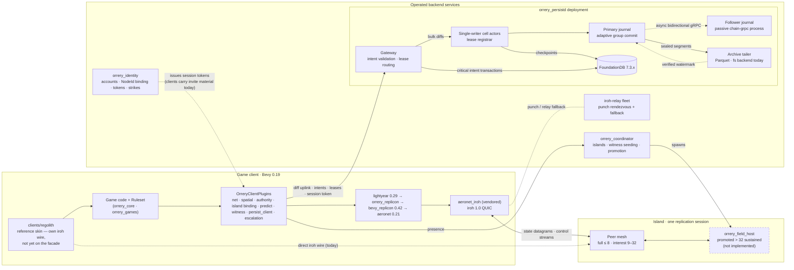

  

# Orrery

An in-development Rust workspace and architecture for the [Bevy](https://bevy.org)
game engine (0.19): peer-to-peer multiplayer and a persistent-universe backend.

It targets very large universes with strong spatial locality — 32–128 players
per area, 60 Hz fast action — and it is a framework, not a game. Games supply a
`Ruleset`; every tunable is a configurable parameter with a stated default.

**Normative source:** the [ADR index](docs/DECISIONS.md) and the 46 accepted
[ADRs](docs/adr/). The records run D1–D51 with three gaps: D18 was never
allocated (it is reserved only as a proposal inside D17 and has no file), and
**D39, D40, D50 and D51 are Proposed, not accepted** — non-normative until the
owner flips them. The applicable accepted ADRs govern this README and every
numbered document; where a document conflicts with one, the ADR wins.

---

## Status at a glance

Design is accepted and still moving; implementation runs across P0–P6, and the
phases are not a queue — P2 started during P1, and P6's archive work landed
before P5's criterion was met, because the enforcement ramp's last control was
moved *into* P6 by that dependency rather than waiting behind P5.

| Phase | Subject | Where it stands |
|---|---|---|
| **P0** | QUIC transport, NAT hole punching | **Criterion met** (2026-08-21, #237) — 8 peers on real heterogeneous NATs, 30 min, zero session drops |
| **P1** | Spatial model, replication, prediction | **Criterion met** (2026-08-21, #238) — 32-peer swarm, gates nightly, clean and impaired |
| **P2** | Persistence: cell actors, journal, FoundationDB | **Criterion met** (2026-08-21, #239) — indexed `journal-raw` is the default; 5/5 full kill-9 runs |
| **P3** | Per-entity authority and handoff | **Criterion met** (2026-08-16) — 8 peers, 400 entities, real `kill -9`; both dispositions measured |
| **P4** | Verifiable core, witnessing | Built and wired; witnessing runs in **shadow mode**. The criterion is a *measurement* not yet made — see below |
| **P5** | Intents, attestation, enforcement | **Partially built.** The dupe-gauntlet harness runs nightly; the criterion is not met |
| **P6** | Scale & hardening | **Partially built.** The journal→archive path exists end to end; `orrery_field_host` does not exist |

One crate named in the design is **not present**: `orrery_field_host` (P6
promotion and parked-cell catch-up). `orrery_identity` *does* exist and is a
root workspace member. The `orrery` name and crate prefix are provisional and
mechanically replaceable.

### There is a client, and someone has played it

[`clients/regolith`](clients/regolith/) is a Bevy 0.19 skin over the headless
Regolith rules and executor — the first rendered Orrery target. It is built and
published for x86_64 Windows, x86_64 Linux and aarch64 macOS by
`.github/workflows/package-client.yml`, and it joins a deployed campaign
service by name. That packaging workflow builds and publishes and nothing else;
every campaign join is in `.github/workflows/validate-client-release.yml`,
which runs nightly and on dispatch, one client at a time, and skips when the
deployed revision pin does not name the build under test (#1062).

A volunteer downloaded a release build and could not join it. Five distribution
defects came out of that one session, all fixed: the client wrote to a path a
downloaded copy does not have (#766), the Windows zip shipped an extensionless
binary inside a `stage/` folder (#768), the campaign/practice distinction was
invisible on screen (#769), an unopenable telemetry stream killed the client
during plugin registration (#772), and a session that records nothing said so
only in a log line after the fact (#773). See #775, #776 and #778 — the last of
which is the CI check that now extracts and launches the *archive* on each
platform, because every one of those defects was invisible to a build and
obvious to an extraction.

The screen and the record cannot disagree about scope: the banner across the
top is computed from the same value as `session_scope` on every telemetry
envelope. Read [`clients/regolith/PLAYTEST.md`](clients/regolith/PLAYTEST.md)
for the player-facing instructions.

### The P2 gate holds with the indexed raw journal

`scripts/p2-kill9-gate.sh` proves **durability** on every run — recovery
verified against every pre-crash acknowledgement, zero leases lost, zero
nacks, the zombie primary refused fenced admission, a bumped chain epoch
refused rather than forked.

On 2026-08-20, five full-duration alternating pairs ran on a qualified
`c4d-standard-32-lssd` local NVMe. The indexed `journal-raw` implementation
passed the complete gate in **5/5** runs; the Fjall control passed **0/5**.
All ten runs passed recovery verification.

| backend | full-gate passes | `journal_commit_ms` p99 | commits > 2 ms | commits > 15 ms |
|---|---:|---:|---:|---:|
| Fjall | 0/5 | **40 ms** median [15, 75] | **3.856%** median | **1.580%** median |
| indexed `journal-raw` | **5/5** | **1 ms** in every run | **0.009%** median | **0.000%** |

Every figure above is re-derived from committed data by
`scripts/p2-journal-raw-report.py` over
[`docs/data/p2-journal-raw-2026-08-20.jsonl`](docs/data/), not transcribed.

The indexed implementation is the default selected by
[D19](docs/adr/0019-indexed-waldb-journal.md), pinned to wal-db 1.0.0. Fjall
remains available behind the explicit, mutually exclusive `journal-fjall`
fallback feature; it is no longer the shipping path. The Fjall root cause is
its 100 ms-step write backpressure, not the device
([docs/08-persistence.md](docs/08-persistence.md) §4.3–§4.8;
[docs/spikes/journal-raw-waldb.md](docs/spikes/journal-raw-waldb.md) §9).

**And the journal is bounded** — it was not. Nothing released a segment, so a
node's journal, and the index rebuilt from it at every open, grew with its
uptime: 3.94 µs and ~95 bytes per record, linearly, which at the gate's own
arrival rate is a 94 GB journal and a 4.3-minute restart after one hour of run
time. [D20](docs/adr/0020-journal-retention.md) makes the checkpoint floor
bound it, clamped by what the chain follower has mirrored, with a scan below
the floor failing loudly rather than answering short.
[D23](docs/adr/0023-follower-journal-retention.md) closes the follower half and
makes the gate *fail* unless both nodes' floors advanced and every journal open
came in under D16's 2 000 ms budget — not a formality: an *unreleased* mirror
made a promoted node's `Journal::open` take 2 905 ms after a thirty-second
load, and bounding it brought the same open to 764 ms.

### The archive path exists end to end — on a filesystem store

D20's bound created an obligation: a released record's history exists only
where the archive has put it. All three pieces now exist in
`crates/orrery_persistd/src/archive/`:

- **The retention clamp** (#817) adds the archive's verified-through watermark
  as a third term in the release floor, and names a guarded release
  `ReleaseBlocked::ArchiveLag`. It is **registered only under
  `persistd --archive-retention`, which defaults off**; off is the pre-clamp
  floor exactly — the checkpoint-plus-chain minimum, unchanged.
- **The record schema** (#821) settles the on-disk contract before the first
  object is written. The time axis is `lsn`, not `tick`: `tick` is
  client-supplied and never server-validated, so a griefer would otherwise
  stamp the coordinate an operator later selects on. Sort order within an
  object is `(grid, cell, lsn)`.
- **The tailer** (#829) consumes sealed segments, re-sorts them, writes one
  Parquet object per `(node_id, segment_seq)`, **verifies it by reading it
  back**, commits the `jarchive/` row, and only then advances the watermark. It
  ships with the alarm the clamp makes non-optional, since "archive
  unreachable" is now a countdown to §15's bulk-ack shed.

Two limits, stated rather than implied. The object store is a trait with a
**filesystem backend** — object storage is designed, not deployed. And the
archive **cannot yet serve D32's daily conservation sweep** (#833): D11 sends
bulk diffs to the journal but economic intents straight to FoundationDB, and
the archive stores journal records, so balance and ownership effects are not in
it. `docs/08-persistence.md` §11.5 previously claimed otherwise and has been
corrected.

### What witnessing and enforcement do *not* claim

`WitnessConfig::shadow_mode` defaults to `true`. Detection, evidence assembly,
transport and adjudication are in place; what P4 exists to produce is the
false-positive rate, and that is an accumulation, not a build. The exit gate is
≥ 500 honest player-hours across all three platforms under injected impairment
with **zero** reports (D17.3, and the roadmap's R-6). The nightly 32-peer swarm
gate accrues 32 player-hours a night on x86_64 Linux and blocks on the
witnessing clauses. The criterion's loss band is 3–5%; the last recorded
deficit at 5% is attributed and closed, and the current figures live in the
gate's own reports rather than here.

The enforcement ramp ([D32](docs/adr/0032-enforcement-ramp.md)) is built and
measured shadow-first, per control, with a `ramp-shadow` nightly gate running a
shadow and an enforcing gateway from one binary at once. **Nothing is promoted
to live.** D32 clause (g) additionally blocks C3 — write refusal and annulment
— until the economy-wide invariant auditor is live. Its hourly incremental over
hot ledgers shipped and needs no archive; its daily full conservation sweep
needs history, and per #833 the archive does not yet hold the economic effects
that sweep must read. C3 therefore lands in P6, beside the tailer, not in P5.

### Terrain is not durable state in v1

`RecordKind::TerrainDelta` folded into empty arms, nothing constructed it, no
terrain joined a checkpoint, and nothing wrote `chunk/`. The false surface is
now removed (#830, #836) rather than made true: at D20's measured
18 000 records/s, 1 KiB terrain deltas would add 1.69 TB/day of journal
ingress. [D51](docs/adr/0051-v1-terrain-is-not-durable-state.md) records the
owner's 2026-09-01 decision and is **Proposed** — acceptance is the owner's act
alone, and P6's bulldozed-town demo criterion is deliberately left unrewritten
in the meantime.

---

## Design goals

These are the accepted design targets. They describe what the architecture is
*for*, not a claim that each is met today — see the status table above.

- **P2P QUIC with hole punching.** One iroh connection per peer pair carrying
  unreliable datagrams (state replication) and reliable streams (control, bulk)
  with no head-of-line blocking between them; the rest ride a relay fleet that
  doubles as the punch rendezvous.
- **Per-entity authority, never a player host.** Exactly one authority per
  replicated entity; weak authority spreads by interaction, strong ownership by
  explicit grab, both arbitrated by cluster-side TTL leases (10 s TTL, 2.5 s
  heartbeat). No elected-host topology and no host migration.
- **Prediction and rollback.** 60 Hz fixed tick, 20 Hz send rate, rollback
  window ≤ 9 ticks (150 ms), 100 ms interpolation buffer, bounded hit rewind
  ≤ 200 ms. Only prediction rewinds ([D47](docs/adr/0047-rollback-unit.md)):
  canonical state is correction-only, durable state recovery-only.
- **Population-adaptive islands.** Full mesh ≤ 8 peers, interest mesh at 9–32,
  coordinator-spawned headless field hosts above 32 sustained.
- **One 64-bit `CellId`, three jobs.** A Morton-encoded hierarchical grid cell
  (default edge 128 m, aligned with `big_space`) is simultaneously the
  replication interest group (27-cell AOI), the storage shard-key prefix, and
  the authority/handoff unit.
- **Witnessing instead of trust.** Invariant checks on every peer, witness-set
  re-execution of streamed input logs, deterministic replay adjudication of
  disputed windows, K=3-of-N≥5 co-signed persistence intents, decaying strikes.
- **Persistence that doesn't make the game wait.** The D16 budgets enforced by
  the P2 gate, with the journal as the event source for history and forensics.
- **Scoped determinism.** A game-supplied `Ruleset` defines a verifiable core
  used for replay adjudication and offline catch-up — never as the live sync
  model.

---

## What is built

**Client stack.** The `orrery` facade composes `OrreryClientPlugins<R: Ruleset>`
— a Bevy `PluginGroup` adding net → spatial → authority → island binding →
predict → witness → persist_client → escalation in dependency order, with
`OrreryConfig` aggregating the per-plugin configs.

The reference client does **not** compose that facade yet. `clients/regolith`
depends on `orrery_core`, `orrery_games`, `orrery_predict` and
`orrery_protocol`, and speaks iroh directly through its own `net` module with
transport pins mirroring `gates/p1-swarm` exactly — it is the second process on
that harness's exterior wire. The facade is the intended composition; the
skin has not been moved onto it.

**Persistence (P2).** Single-writer cell actors, an indexed wal-db segmented
journal with adaptive group commit on a dedicated OS thread, fencing and
hotspot splits, checkpoint/restore and cold area reads, the iroh gateway,
FDB-backed checkpoints and serializable intent execution, a TOML world seeder,
and a static two-process chain topology where a write-serving primary
asynchronously mirrors its journal to a passive gRPC follower.

**Authority (P3).** Signed, transport-bound gateway admission; actor-owned
durable lease rows; strict fenced bulk uplinks; lease-loss revocation. Authority
*moves* rather than only parking: a lost lease is offered to a successor with a
live session and coordinator interest covering the entity's cell, granted
through the ordinary serialized claim path. Holder-initiated negotiated
divestiture is implemented, with an always-on single-writer invariant checker.
Measured by `scripts/p3-island-gate.sh` on an 8-peer island of 400 entities,
peers as real OS processes: 50/50 of the victim's entities reassigned in ~9.9 s
and, on the `strong` arm D7 refuses to redistribute, 50/50 parked in ~10.7 s —
both against a 12.05 s budget, 0 lost and 0 duplicate-authority observations.
Still future: coordinator-driven island drain, `Expire` fan-out, redistribution
across sibling gateways, field-host promotion.

**Verifiable core (P4).** The `Ruleset` contract, fixed 60 Hz executor, seeded
per-entity-per-tick randomness, quantization lattice and tolerance-band
comparator, hash-chained tamper-evident input log, and a headless replay
harness whose `verify_bundle` is a pure function of the evidence. Bevy-free by
construction. `orrery_conformance` replays a fixed corpus on x86_64
Linux/Windows and aarch64 Linux/macOS, and a verdict job requires every
platform's per-tick state hashes to agree bit-for-bit.
`RulesetId.digest` is now a **computed** build identity, not a placeholder:
`orrery_ruleset_digest` derives the first-party source closure at build time and
emits the digest constant (#816, [D49](docs/adr/0049-compatibility-manifest.md)).

**Witnessing (P4).** Folds received log frames, verifies claim chains,
re-executes a subject's signed input log against that subject's own committed
state, and assembles a disputed window into a self-verifying
`DiscrepancyReport` that the adjudicator re-runs rather than believes.

**Intents and the dupe gauntlet (P5).** `gates/p5-dupe-gauntlet` runs the real
`GatewayServer` in one process and the live iroh wire in another, then reads
ledger, intent, attestation and receipt rows back from the same FoundationDB
cluster. Three of the criterion's four arms are single-gateway and live here —
replay, forged/self-chosen attestation, quarantined full validation — with the
double-spend race in `gates/p3-siblings`, which needs two gateways. No `PASSED`
marker is written unless every arm and the honest attested control agree.

### Where Bevy is, and where it is not

Ten of the nineteen first-party crates have no Bevy dependency at all:
`orrery_protocol`, `orrery_core`, `orrery_games`, `orrery_conformance`,
`orrery_compose`, `orrery_ruleset_digest`, `orrery_persistd`,
`orrery_coordinator`, `orrery_identity`, `orrery_seed`.

The old framing — that the rules layer is *strictly* engine-agnostic — is
superseded. On 2026-08-31 the owner accepted `bevy_ecs` as a first-class
dependency of `orrery_games`, amending [D42](docs/adr/0042-canonical-simulation-architecture.md)
clause (a) and [D43](docs/adr/0043-determinism-envelope-and-gate-replacement.md)
clause (e)(1) (#793, written into the records by #805). Two things follow, and
the distinction between them matters:

- **The admission is in the records and in the gate, not yet in the manifest.**
  `scripts/core-gates.sh` lists `orrery_games` in `BEVY_PERMITTED_CRATES` while
  keeping it in the gated and rules sets, so the determinism clauses still
  bind. `crates/orrery_games/Cargo.toml` has taken no Bevy dependency to date.
  Where `bevy_ecs` *did* land is `orrery_sim_host`, as the `EcsBackend` behind
  D42's host seam.
- **`orrery_core` is not amended and stays Bevy-free.** Its ban is a different
  ban for a different reason: the same build links into game clients, the
  future field host and `persistd`, so anything platform-specific there would
  make those three disagree — which is the exact failure the crate exists to
  detect. D42 clause (c), which rejects a shared app world, is untouched.

Engine handles are now blocked at **compile time**, not by review (#828,
[D45](docs/adr/0045-per-component-capability-policy.md) IV-7). `orrery_replicon`
is the only first-party crate permitted to declare `bevy_replicon`; its
registration surface requires a sealed `EngineHandleFree`, which `Entity`,
`ComponentId` and every other Bevy ECS type do not implement. A cargo-metadata
clause in `core-gates.sh` refuses any other direct declaration, including
renamed and non-normal dependencies, and refuses a zero-crate scan.

### Workspace

20 first-party crates under [`crates/`](crates/) plus 3 vendored upstreams in
[`vendor/`](vendor/), all in the root workspace. Thirteen Cargo workspaces
exist in total: the root, eleven standalone tools under [`gates/`](gates/) —
`p0-nat-test`, `p0-dashboard`, `p1-swarm`, `p2-load`, `p2-dashboard`,
`p2-journal-bench`, `p3-island`, `p3-siblings`, `p4-streams-bench`,
`p5-dupe-gauntlet`, `migration-bench` — and [`clients/regolith`](clients/regolith/).
Each standalone tool carries its own `[workspace]` and lockfile so a harness
cannot drag a dependency into the shipped graph, and each is consequently
invisible to `cargo test --workspace`. (`gates/p0-nat-lab` is deployment shell
for the real-NAT cohort, not a Cargo project, which is why it is not in that
list.)

`./scripts/check.sh` runs CI's lanes locally and is the executable inventory
(`--list`); `./scripts/gate-status.sh` reports where every gate stands, and
distinguishes seven statuses — a run that skipped every heavy harness says so
rather than reporting green.

---

## Architecture at a glance

---

## Reading path

Start with the ADRs. They are normative; everything else expands on them.

| # | Document | Covers |
|---|---|---|
| 1 | [DECISIONS.md](docs/DECISIONS.md) + [adr/](docs/adr/) | ADR index, the 46 accepted decisions, and the four proposed ones. **Normative** |
| 2 | [00-overview.md](docs/00-overview.md) | Goals, constraints, system diagram, subsystem tour, glossary |
| 3 | [01-spatial-model.md](docs/01-spatial-model.md) | Grid, `CellId`, `big_space`, AOI, hysteresis, hotspots |
| 4 | [02-networking.md](docs/02-networking.md) | iroh, relays, islands, topology regimes, channels, budgets |
| 5 | [03-replication.md](docs/03-replication.md) | replicon/lightyear stack, interest sets, delta compression |
| 6 | [04-authority.md](docs/04-authority.md) | Weak/strong claims, leases, handoff, orphans, promotion |
| 7 | [05-prediction-rollback.md](docs/05-prediction-rollback.md) | Timelines, reconciliation, interpolation, hit validation |
| 8 | [06-verifiable-core.md](docs/06-verifiable-core.md) | `Ruleset`, determinism scoping, signed input logs, replay |
| 9 | [07-witnessing.md](docs/07-witnessing.md) | Threat model, discrepancy protocol, adjudication, strikes |
| 10 | [08-persistence.md](docs/08-persistence.md) | Cell actors, journal, FDB schema, intents, event archive |
| 11 | [09-services-and-ops.md](docs/09-services-and-ops.md) | Service inventory, deployment, scaling, failure modes, runbooks |
| 12 | [10-crates.md](docs/10-crates.md) | Workspace layout, per-crate API sketches, dependency graph |
| 13 | [11-roadmap.md](docs/11-roadmap.md) | Build phases, demo criteria, risk register, open questions |
| 14 | [12-world-seeding.md](docs/12-world-seeding.md) | TOML scenario runner, generator bank, content diff/patch |
| 15 | [13-chain-replication.md](docs/13-chain-replication.md) | Journal mirroring, chain identity, reconnect, recovery |
| 16 | [14-capacity.md](docs/14-capacity.md) | Measured single-box capacity envelope and what binds first |
| 17 | [15-asset-provenance.md](docs/15-asset-provenance.md) | The licensing bar for third-party assets, and the guard on it |
| 18 | [references.md](docs/references.md) | Annotated bibliography |

Process and CI: [ci-and-gates.md](docs/ci-and-gates.md) (what CI runs, the
workspace table, self-test clauses, the determinism matrix) and
[agent-lanes.md](docs/agent-lanes.md). Working documents that decide nothing
live in [docs/spikes/](docs/spikes/); measurement evidence lives in
[docs/data/](docs/data/), and every number quoted from it is re-derived by a
script with a self-test rather than transcribed.

---

## Acknowledgments

This design builds directly on — and intends to contribute back to —
[lightyear](https://github.com/cBournhonesque/lightyear),
[bevy_replicon](https://github.com/simgine/bevy_replicon),
[aeronet](https://github.com/aecsocket/aeronet),
[iroh](https://github.com/n0-computer/iroh) and
[big_space](https://github.com/aevyrie/big_space).

The parts specific to Orrery are the iroh IO layer, the authority-lease
protocol, the witnessing layer, the spatial cell system, and the persistence
tier.

Pinned dependency versions ([D14](docs/adr/0014-pinned-versions.md)) reflect the
ecosystem as of August 2026 and are re-validated as implementation reaches each
dependency. Today: Bevy 0.19, lightyear 0.29, bevy_replicon 0.42.1 (vendored),
aeronet 0.21, iroh 1.0.3, big_space 0.13 (git, `bevy-0.19` branch),
FoundationDB 7.3.x, wal-db 1.0.0.
