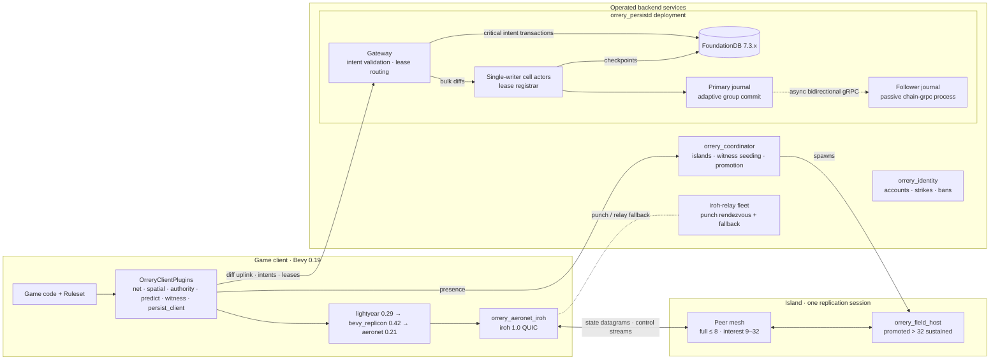

# Orrery

Orrery is an in-development Rust workspace and architecture for the [Bevy](https://bevy.org) game engine (0.19), providing peer-to-peer multiplayer and a persistent-universe backend: QUIC transport with NAT hole punching via [iroh](https://github.com/n0-computer/iroh), per-entity authority with client-side prediction and rollback/reapply, witness-validated trust in an untrusted peer mesh, and a horizontally scalable, low-latency clustered persistence tier (in-memory cell actors and an append-only journal in front of FoundationDB). It targets very large universes with strong spatial locality — 32–128 players per area, 60 Hz fast action — and it is a framework, not a game: games supply a `Ruleset`, and every tunable is a configurable parameter with a stated default.

Normative source: the [ADR index](docs/DECISIONS.md) and the 17 [accepted ADRs](docs/adr/) (the applicable ADRs are normative over this README and every numbered doc).

## Status

**Design + active P0–P3 implementation.** The accepted architecture decisions and their expansion documents remain normative. The workspace contains the vendored iroh/aeronet transport adapter and P0 test/dashboard tools; `orrery_protocol`, `orrery_net`, `orrery_spatial`, `orrery_coordinator`, and `orrery_predict` for the P1 foundation; and `orrery_persist_client`, `orrery_persistd`, and `orrery_seed` for P2. Landed persistence work includes single-writer cell actors, adaptive group-commit journals on a dedicated OS thread, fencing and hotspot splits, checkpoint/restore and cold area reads, the iroh gateway, FDB-backed checkpoints and serializable intent execution, the TOML world seeder, and a static two-process `persistd` chain topology: a write-serving primary asynchronously mirrors its journal to a passive gRPC follower with durable chain identity, restart reconstruction, and dedupe. Standalone `p2-load` and `p2-dashboard` tools exercise and gate the latency series. The permanent two-process crash/recovery regression harness (`scripts/p2-kill9-gate.sh`) proves recovery with post-restart acknowledged-state verification, zombie primary fencing, and meets all D16 acceptance latency targets (`journal_commit_ms < 2ms`, `bulk_ack_ms < 5ms`, `intent_commit_ms < 10ms`, `area_first_page_ms < 50ms`).

The implemented P3 authority slice adds `orrery_authority`, signed and transport-bound gateway admission, actor-owned durable lease rows, strict fenced bulk uplinks, NodeId-scoped session and claim controls, lease-loss revocation in `orrery_persist_client`, and server-owned durable rekeying. On top of that, authority now **moves** rather than only parking: a lost lease — whether the holder's session dropped or its TTL lapsed — is offered to a successor chosen among peers with a live session and live coordinator interest covering the entity's cell, granted through the ordinary serialized claim path, and pushed to that peer over a registrar→peer control lane; the losing holder is told where authority went. Holder-initiated negotiated divestiture (`Divest{to, final_seq, cursor}`) is implemented with an enforced uplink-completeness gate, and an always-on single-writer invariant checker counts any fenced-out write that overlapped a different live holder. Coordinator interest reaches gateways as a signed grant each peer carries itself, so redistribution is operable outside tests; both directions of cooperative handoff are implemented, including the registrar asking a holder to divest on a claimant's behalf. **The P3 demo criterion runs and holds**: `scripts/p3-island-gate.sh` forms an 8-peer island of 400 entities, `kill -9`s a peer holding 50, and proves every one is reassigned or parked inside the lease TTL with no duplicate-authority observation and nothing lost. Still future P3 work: coordinator-driven island drain, `Expire` fan-out to cell subscribers, contact-island propagation, redistribution across sibling gateways, and field-host promotion. The verifiable-core, witnessing, identity-service, and field-host crates are not yet present. See [docs/11-roadmap.md](docs/11-roadmap.md) for the phase gates. The `orrery` name and crate prefix are provisional and mechanically replaceable; pinned dependency versions ([D14](docs/adr/0014-pinned-versions.md)) reflect the ecosystem as of August 2026 and are re-validated as implementation reaches each dependency.

## Features (as designed)

- **P2P QUIC with hole punching.** One iroh connection per peer pair carries unreliable datagrams (state replication) and reliable streams (control, bulk transfer) with no head-of-line blocking between them; ~90% of pairs connect directly, the rest ride a self-hosted relay fleet that doubles as the punch rendezvous.
- **Per-entity authority, never a player host.** Exactly one authority per replicated entity; weak authority spreads by interaction, strong ownership by explicit grab, both arbitrated by cluster-side TTL leases (10 s TTL, 2.5 s heartbeat). No elected-host topology and no host migration — ever.
- **Prediction and rollback, lightyear-configured.** 60 Hz fixed tick, 20 Hz send rate, rollback window ≤ 9 ticks (150 ms), 100 ms interpolation buffer for remote entities, bounded hit rewind ≤ 200 ms.
- **Population-adaptive islands.** Full mesh ≤ 8 peers, Donnybrook-style interest mesh at 9–32 (24-entity high-rate set, 1–4 Hz proxies, ≤ 1 Mbps uplink), and coordinator-spawned headless field hosts above 32 sustained.
- **One 64-bit `CellId`, three jobs.** A Morton-encoded hierarchical grid cell (default edge 128 m, aligned with `big_space`) is simultaneously the replication interest group (27-cell AOI), the storage shard-key prefix, and the authority/handoff unit.
- **Witnessing instead of trust.** Cheap invariant checks on every peer, continuous witness-set re-execution of streamed input logs, prediction error as a free discrepancy signal during interactions, deterministic replay adjudication of disputed windows, K=3-of-N≥5 co-signed persistence intents, and decaying strikes (14-day half-life).
- **Persistence that doesn't make the game wait.** Bulk diffs journal-commit inside the cluster in < 2 ms (adaptive group commit) with client-observed acks < 5 ms p99 in-region; critical operations (trades, loot, progression) commit as serializable FoundationDB transactions in < 10 ms p99; the journal is the event source for history, forensics, and griefing rollback. Area load streams the 27-cell neighborhood with < 50 ms to first page-in.
- **Scoped determinism.** A game-supplied `Ruleset` defines a verifiable core (fixed tick, seeded RNG, quantized state, headless-runnable step function) used for replay adjudication and offline catch-up — never as the live sync model.

## Architecture at a glance

## Reading path

| Order | Document | Covers |
|---|---|---|
| 1 | [docs/DECISIONS.md](docs/DECISIONS.md) and [docs/adr/](docs/adr/) | ADR index plus the 17 independent accepted decisions. Normative. |
| 2 | [docs/00-overview.md](docs/00-overview.md) | Goals, constraints, system diagram, subsystem tour, glossary |
| 3 | [docs/01-spatial-model.md](docs/01-spatial-model.md) | Grid, `CellId` encoding, `big_space` integration, AOI, hysteresis, hotspots |
| 4 | [docs/02-networking.md](docs/02-networking.md) | iroh, relays, islands, topology regimes, channels, bandwidth budgets |
| 5 | [docs/03-replication.md](docs/03-replication.md) | replicon/lightyear stack, interest sets, delta compression, priority |
| 6 | [docs/04-authority.md](docs/04-authority.md) | Weak/strong claims, leases, handoff, orphans, promotion interplay |
| 7 | [docs/05-prediction-rollback.md](docs/05-prediction-rollback.md) | Timelines, prediction sets, reconciliation, interpolation, hit validation |
| 8 | [docs/06-verifiable-core.md](docs/06-verifiable-core.md) | `Ruleset`, determinism scoping, signed input logs, replay harness |
| 9 | [docs/07-witnessing.md](docs/07-witnessing.md) | Threat model, discrepancy protocol, adjudication, strikes, accepted limits |
| 10 | [docs/08-persistence.md](docs/08-persistence.md) | Cell actors, journal, FDB schema, intents, terrain, event archive |
| 11 | [docs/09-services-and-ops.md](docs/09-services-and-ops.md) | Service inventory, deployment, scaling, failure modes, telemetry |
| 12 | [docs/10-crates.md](docs/10-crates.md) | Workspace layout, per-crate API sketches, dependency graph |
| 13 | [docs/11-roadmap.md](docs/11-roadmap.md) | Build phases, milestones, tracked risks |
| 14 | [docs/12-world-seeding.md](docs/12-world-seeding.md) | World seeder: TOML scenario runner, generator bank, content diff/patch |
| 15 | [docs/13-chain-replication.md](docs/13-chain-replication.md) | Cross-process journal mirroring, durable chain identity, ordered batches, reconnect and recovery |
| 16 | [docs/references.md](docs/references.md) | Annotated bibliography, organized by topic |

## Acknowledgments

This design builds directly on — and intends to contribute back to — [lightyear](https://github.com/cBournhonesque/lightyear), [bevy_replicon](https://github.com/simgine/bevy_replicon), [aeronet](https://github.com/aecsocket/aeronet), [iroh](https://github.com/n0-computer/iroh), and [big_space](https://github.com/aevyrie/big_space). The novel parts of Orrery are the pieces nobody ships: the iroh IO layer, the authority-lease protocol, the witnessing layer, the spatial cell system, and the persistence tier.
