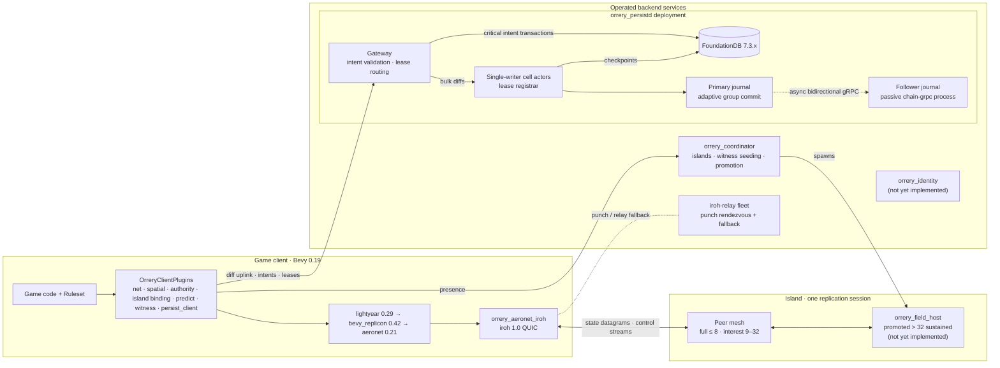

  

# Orrery

An in-development Rust workspace and architecture for the [Bevy](https://bevy.org)
game engine (0.19): peer-to-peer multiplayer and a persistent-universe backend.

It targets very large universes with strong spatial locality — 32–128 players
per area, 60 Hz fast action — and it is a framework, not a game. Games supply a
`Ruleset`; every tunable is a configurable parameter with a stated default.

**Normative source:** the [ADR index](docs/DECISIONS.md) and the 21 accepted
[ADRs](docs/adr/) (D1–D17 and D19–D22; D18 remains a reserved proposal). The
applicable ADRs govern this README and every numbered document.

---

## Status at a glance

Design is complete and accepted; implementation is active across P0–P4.

| Phase | Subject | Where it stands |
|---|---|---|
| **P0** | QUIC transport, NAT hole punching | Transport adapter vendored; NAT lab and dashboard tools present |
| **P1** | Spatial model, replication, prediction | Gate holds — 32-peer swarm runs clean, impaired and witnessed |
| **P2** | Persistence: cell actors, journal, FoundationDB | **Gate holds** — indexed `journal-raw` is the default and passed 5/5 full kill-9 runs |
| **P3** | Per-entity authority and handoff | Gate holds — 8 peers, 400 entities, `kill -9`, every entity reassigned or parked inside the lease TTL |
| **P4** | Verifiable core, witnessing | Built; witnessing runs in **shadow mode**. Enforcement is off until the false-positive rate is measured (D17 R-6) |
| **P5–P6** | Intents, attestation, enforcement | Not started |

Two crates named in the design are **not yet present**: `orrery_identity` and
`orrery_field_host`. The `orrery` name and crate prefix are provisional and
mechanically replaceable.

### The P2 gate holds with the indexed raw journal

`scripts/p2-kill9-gate.sh` proves **durability** on every run — recovery
verified against every pre-crash acknowledgement, zero leases lost, zero
nacks, the zombie primary refused fenced admission, a bumped chain epoch
refused rather than forked.

On 2026-08-20, five full-duration alternating pairs ran on a qualified
`c4d-standard-32-lssd` local NVMe. The indexed `journal-raw` implementation
passed the complete gate in **5/5** runs; the Fjall control passed **0/5**.
All ten runs passed recovery verification.

| backend | full-gate passes | `journal_commit_ms` p99 | commits > 2 ms | commits > 15 ms |
|---|---:|---:|---:|---:|
| Fjall | 0/5 | **40 ms** median [15, 75] | **3.856%** median | **1.580%** median |
| indexed `journal-raw` | **5/5** | **1 ms** in every run | **0.009%** median | **0.000%** |

The indexed implementation is now the default selected by
[D19](docs/adr/0019-indexed-waldb-journal.md), pinned to wal-db 1.0.0. Fjall
remains available behind the explicit, mutually exclusive `journal-fjall`
fallback feature; it is no longer the shipping path.

**And the journal is now bounded** — it was not. Nothing ever released a
segment, so a node's journal, and the index rebuilt from it at every open, grew
with its uptime: 3.94 µs and ~95 bytes per record, linearly, which at the
gate's own arrival rate is a 94 GB journal and a 4.3-minute restart after one
hour of run time. [D20](docs/adr/0020-journal-retention.md) makes the
checkpoint floor bound it, clamped by what the chain follower has mirrored,
with a scan below the floor failing loudly rather than answering short. The gate holds with it on — four
alternating arms on a qualified `c4d-standard-32-lssd` passed 4/4, retention
active in its two, every acknowledged write recovered after the `kill -9`. [D23](docs/adr/0023-follower-journal-retention.md) closes the
follower half: the primary's floor travels on the chain, the mirror is released
up to it, the dedupe cursor is seeded from a durable row instead of rebuilt
from batch zero, and the gate now *fails* unless both nodes' floors advanced
and every journal open came in under D16's 2 000 ms budget — which is not a
formality: measured on three cadence arms, an *unreleased* mirror made a
promoted node's `Journal::open` take 2 905 ms after a thirty-second load, past
that budget, and bounding it brought the same open to 764 ms. One residual is
named rather than hidden: released records are not archived anywhere until the
P6 tailer exists.

The Fjall root cause is its 100 ms-step write backpressure, not the device. The
full investigation is [docs/08-persistence.md](docs/08-persistence.md)
§4.3–§4.8; the indexed implementation, paired gate measurement and versioned
evidence are in
[docs/spikes/journal-raw-waldb.md](docs/spikes/journal-raw-waldb.md) §9.
Every number is re-derived from committed data by a script with a self-test.

---

## Design goals

These are the accepted design targets. They describe what the architecture is
*for*, not a claim that each is met today — see the status table above.

- **P2P QUIC with hole punching.** One iroh connection per peer pair carrying
  unreliable datagrams (state replication) and reliable streams (control, bulk)
  with no head-of-line blocking between them; the rest ride a relay fleet that
  doubles as the punch rendezvous.
- **Per-entity authority, never a player host.** Exactly one authority per
  replicated entity; weak authority spreads by interaction, strong ownership by
  explicit grab, both arbitrated by cluster-side TTL leases (10 s TTL, 2.5 s
  heartbeat). No elected-host topology and no host migration.
- **Prediction and rollback.** 60 Hz fixed tick, 20 Hz send rate, rollback
  window ≤ 9 ticks (150 ms), 100 ms interpolation buffer, bounded hit rewind
  ≤ 200 ms.
- **Population-adaptive islands.** Full mesh ≤ 8 peers, interest mesh at 9–32,
  coordinator-spawned headless field hosts above 32 sustained.
- **One 64-bit `CellId`, three jobs.** A Morton-encoded hierarchical grid cell
  (default edge 128 m, aligned with `big_space`) is simultaneously the
  replication interest group (27-cell AOI), the storage shard-key prefix, and
  the authority/handoff unit.
- **Witnessing instead of trust.** Invariant checks on every peer, witness-set
  re-execution of streamed input logs, deterministic replay adjudication of
  disputed windows, K=3-of-N≥5 co-signed persistence intents, decaying strikes.
- **Persistence that doesn't make the game wait.** The D16 budgets enforced by
  the P2 gate, with the journal as the event source for history and forensics.
- **Scoped determinism.** A game-supplied `Ruleset` defines a verifiable core
  used for replay adjudication and offline catch-up — never as the live sync
  model.

---

## What is built

**Client stack.** The `orrery` facade composes `OrreryClientPlugins<R: Ruleset>`
— a Bevy `PluginGroup` adding net → spatial → authority → island binding →
predict → witness → persist_client in dependency order, with `OrreryConfig`
aggregating the per-plugin configs.

**Persistence (P2).** Single-writer cell actors, an indexed wal-db segmented
journal with adaptive group commit on a dedicated OS thread, fencing and
hotspot splits, checkpoint/restore and cold area reads, the iroh gateway,
FDB-backed checkpoints and serializable intent execution, a TOML world seeder,
and a static two-process chain topology where a write-serving primary
asynchronously mirrors its journal to a passive gRPC follower.

**Authority (P3).** Signed, transport-bound gateway admission; actor-owned
durable lease rows; strict fenced bulk uplinks; lease-loss revocation. Authority
*moves* rather than only parking: a lost lease is offered to a successor with a
live session and coordinator interest covering the entity's cell, granted
through the ordinary serialized claim path. Holder-initiated negotiated
divestiture is implemented, with an always-on single-writer invariant checker.
Still future: coordinator-driven island drain, `Expire` fan-out, redistribution
across sibling gateways, field-host promotion.

**Verifiable core (P4).** The `Ruleset` contract, fixed 60 Hz executor, seeded
per-entity-per-tick randomness, quantization lattice and tolerance-band
comparator, hash-chained tamper-evident input log, and a headless replay
harness whose `verify_bundle` is a pure function of the evidence. Bevy-free by
construction. `orrery_conformance` replays a fixed corpus on x86_64
Linux/Windows and aarch64 Linux/macOS, and a verdict job requires every
platform's per-tick state hashes to agree bit-for-bit.

**Witnessing (P4).** Folds received log frames, verifies claim chains,
re-executes a subject's signed input log against that subject's own committed
state, and assembles a disputed window into a self-verifying
`DiscrepancyReport` that the adjudicator re-runs rather than believes.
`shadow_mode` defaults to `true`.

### Workspace

14 crates under [`crates/`](crates/), plus eleven standalone tools that each
declare their own workspace — `gates/p0-nat-lab`, `gates/p0-nat-test`, `gates/p0-dashboard`,
`gates/p1-swarm`, `gates/p2-load`, `gates/p2-dashboard`, `gates/p2-journal-bench`, `gates/p3-island`,
`gates/p3-siblings`, `gates/p4-streams-bench`, `gates/p5-dupe-gauntlet`.
`./scripts/check.sh` runs CI's four lanes locally; `./scripts/gate-status.sh`
reports where every gate stands.

---

## Architecture at a glance

---

## Reading path

Start with the ADRs. They are normative; everything else expands on them.

| # | Document | Covers |
|---|---|---|
| 1 | [DECISIONS.md](docs/DECISIONS.md) + [adr/](docs/adr/) | ADR index and the 18 accepted decisions. **Normative** |
| 2 | [00-overview.md](docs/00-overview.md) | Goals, constraints, system diagram, subsystem tour, glossary |
| 3 | [01-spatial-model.md](docs/01-spatial-model.md) | Grid, `CellId`, `big_space`, AOI, hysteresis, hotspots |
| 4 | [02-networking.md](docs/02-networking.md) | iroh, relays, islands, topology regimes, channels, budgets |
| 5 | [03-replication.md](docs/03-replication.md) | replicon/lightyear stack, interest sets, delta compression |
| 6 | [04-authority.md](docs/04-authority.md) | Weak/strong claims, leases, handoff, orphans, promotion |
| 7 | [05-prediction-rollback.md](docs/05-prediction-rollback.md) | Timelines, reconciliation, interpolation, hit validation |
| 8 | [06-verifiable-core.md](docs/06-verifiable-core.md) | `Ruleset`, determinism scoping, signed input logs, replay |
| 9 | [07-witnessing.md](docs/07-witnessing.md) | Threat model, discrepancy protocol, adjudication, strikes |
| 10 | [08-persistence.md](docs/08-persistence.md) | Cell actors, journal, FDB schema, intents, terrain, archive |
| 11 | [09-services-and-ops.md](docs/09-services-and-ops.md) | Service inventory, deployment, scaling, failure modes |
| 12 | [10-crates.md](docs/10-crates.md) | Workspace layout, per-crate API sketches, dependency graph |
| 13 | [11-roadmap.md](docs/11-roadmap.md) | Build phases, milestones, tracked risks |
| 14 | [12-world-seeding.md](docs/12-world-seeding.md) | TOML scenario runner, generator bank, content diff/patch |
| 15 | [13-chain-replication.md](docs/13-chain-replication.md) | Journal mirroring, chain identity, reconnect, recovery |
| 16 | [14-capacity.md](docs/14-capacity.md) | Measured single-box capacity envelope and what binds first |
| 17 | [references.md](docs/references.md) | Annotated bibliography |

Working documents that decide nothing live in [docs/spikes/](docs/spikes/);
measurement evidence lives in [docs/data/](docs/data/).

---

## Acknowledgments

This design builds directly on — and intends to contribute back to —
[lightyear](https://github.com/cBournhonesque/lightyear),
[bevy_replicon](https://github.com/simgine/bevy_replicon),
[aeronet](https://github.com/aecsocket/aeronet),
[iroh](https://github.com/n0-computer/iroh) and
[big_space](https://github.com/aevyrie/big_space).

The parts specific to Orrery are the iroh IO layer, the authority-lease
protocol, the witnessing layer, the spatial cell system, and the persistence
tier.

Pinned dependency versions ([D14](docs/adr/0014-pinned-versions.md)) reflect the
ecosystem as of August 2026 and are re-validated as implementation reaches each
dependency.
