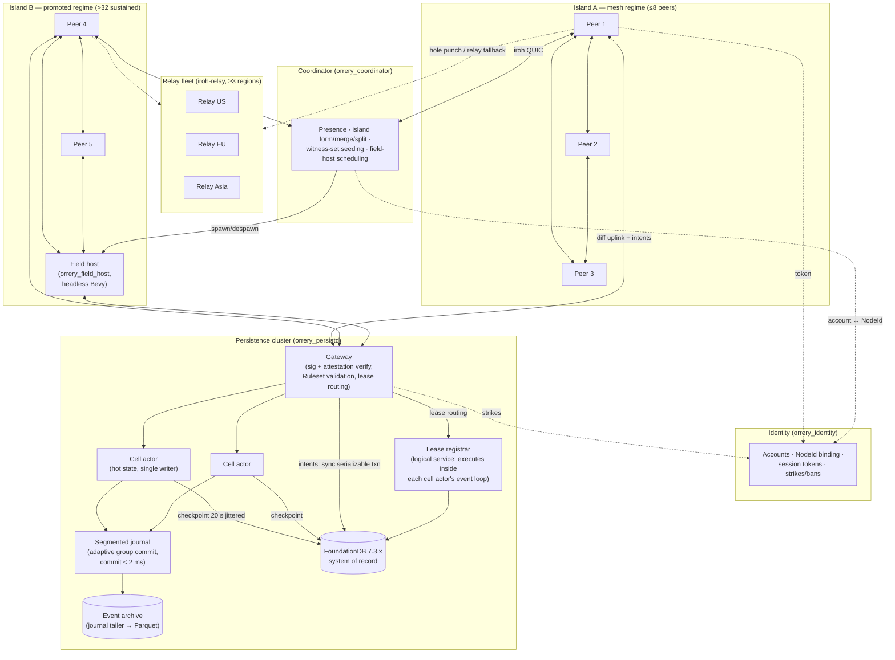
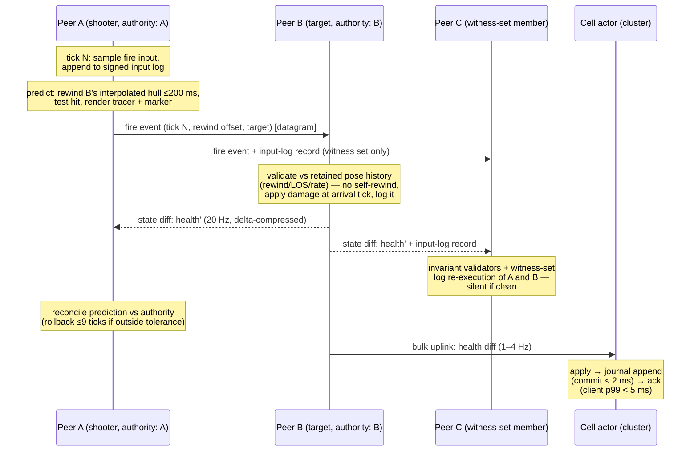
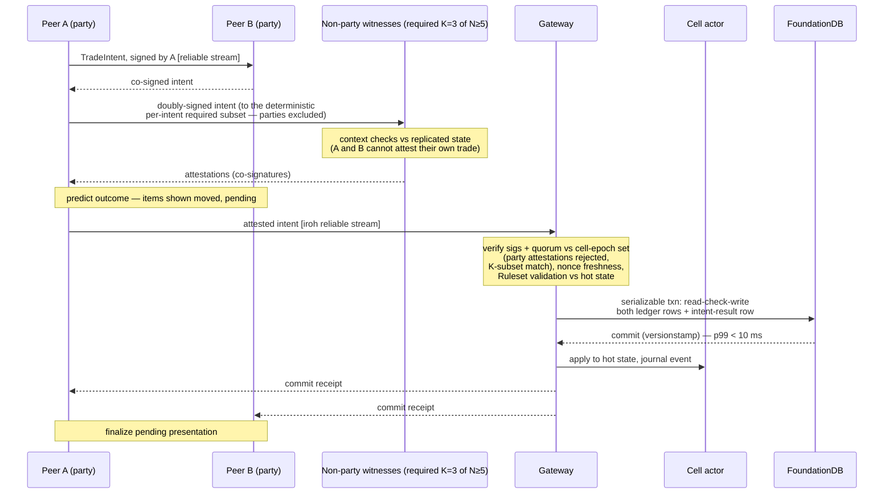

# Orrery — System Overview

Orrery is a set of Rust crates for [Bevy](https://bevy.org) 0.19 that provides peer-to-peer multiplayer (QUIC with NAT hole punching via [iroh](https://github.com/n0-computer/iroh)), client-side prediction with rollback/reapply, witness-based trust, and a horizontally scalable, low-latency clustered persistence tier for very large persistent universes with strong spatial locality. This document is the entry point to the architecture doc set: what the system is, the five ideas that carry its weight, a full-system diagram, two end-to-end walkthroughs, and a glossary. Everything here is a summary; the numbered sibling docs carry the detail, and the accepted ADRs are the law.

Normative source: the [ADR index](DECISIONS.md) and all [accepted ADRs](adr/) D1–D17 (this overview touches every decision; where wording differs, the applicable ADR wins).

## 1. What Orrery is — and is not

Orrery **is a framework**, not a game. Games bring their own rules — movement limits, combat resolution, loot tables, economy — by implementing a `Ruleset` trait (D9) that both clients and the persistence cluster execute. Every numeric in this doc set is a configurable parameter with the stated default (D16).

Orrery **is under active implementation**. P0–P2 code exists, but not every crate in [10-crates.md](10-crates.md) has landed; inspect the workspace and [README status](../README.md#status) before assuming a designed component exists. Version pins ([D14](adr/0014-pinned-versions.md)) reflect the ecosystem as of August 2026.

Orrery is **not**:

- a deterministic-lockstep rollback library (rejected in D2 — incompatible with streaming interest sets and peer churn; determinism is used only *scoped and offline* in the verifiable core);
- a dedicated-server engine (no game-simulation servers exist until a cell's population exceeds the mesh ceiling, D6/D12);
- an anti-cheat silver bullet (aimbots and fog-of-war leaks are documented, accepted limits of P2P — D10; what *is* protected is durable state).

## 2. Requirements recap

Settled with the project owner on 2026-08-11 (D1):

| # | Requirement | Expanded in |
|---|---|---|
| R1 | P2P networking, QUIC preferred, NAT hole punching, reuse existing crates | [02-networking.md](02-networking.md) |
| R2 | Client-side prediction with rollback/reapply | [05-prediction-rollback.md](05-prediction-rollback.md) |
| R3 | Remote persistence: "really really fast", horizontally scalable | [08-persistence.md](08-persistence.md) |
| R4 | Very big universe; interaction is spatially local | [01-spatial-model.md](01-spatial-model.md) |
| R5 | Per-entity authority + prediction (not lockstep) | [04-authority.md](04-authority.md) |
| R6 | 32–128 players per area typical | [02-networking.md](02-networking.md) |
| R7 | Persist everything, including event history | [08-persistence.md](08-persistence.md) |
| R8 | Witness-based validation ("amended witnessing") | [07-witnessing.md](07-witnessing.md) |
| R9 | Native only (Windows/Linux/macOS) | — |
| R10 | Fast action: 60 Hz fixed simulation tick | [05-prediction-rollback.md](05-prediction-rollback.md) |
| R11 | Custom hot tier + proven durable store | [08-persistence.md](08-persistence.md) |

## 3. The system at a glance

Players connect to each other in **islands** (P2P replication sessions over iroh QUIC), to the **coordinator** for island membership and NodeId handout, and to the **persistence gateway** for state uplink and durable operations. The five backend services (D12) — identity, relay fleet, coordinator, persistence cluster, field hosts — are the *entire* server inventory. Netsplit posture: if the cluster is unreachable, P2P simulation continues; intents queue and durable commits pause — degraded, not dead.

## 4. Five load-bearing ideas

### 4.1 One 64-bit `CellId` does triple duty (D5)

The universe is a hierarchical uniform integer grid aligned with `big_space`'s `GridCell`. A single sortable `CellId` (a `NonZeroU64` — the sentinel bit guarantees non-zero; S2-style bit layout: Morton-interleaved offset-binary coordinates, level encoded by the sentinel bit, parent = prefix) is simultaneously:

1. the **replication interest group** — peers subscribe to their cell plus the 3×3×3 neighborhood (27 cells), mapped onto `bevy_replicon` visibility;
2. the **storage shard key prefix** — `world/{cell_id}/{entity_id}` in FoundationDB, so "load everything near me" is a handful of contiguous range scans;
3. the **authority/handoff unit** — leases, island membership, field-host promotion, and hotspot splitting all operate on cells.

One identifier means the replication layer, the storage layer, and the authority layer never disagree about *where* something is. Interest-level cell edge defaults to 128 m; a shard cell is 8×8×8 interest cells; cell-crossing uses a hysteresis margin of 10% of cell edge to prevent handoff thrash (the SpatialOS lesson). Details: [01-spatial-model.md](01-spatial-model.md).

### 4.2 Per-entity authority, arbitrated by cluster leases (D7)

Every replicated entity has exactly one authority at any instant — the single-writer invariant. Claims come in two tiers: **weak authority** (implicit, via interaction — collisions, damage; propagates through physics contact islands) and **strong ownership** (explicit — grab, mount, your own character; not stealable). There is *no gameplay host*: the arbiter is the persistence cluster's **lease registrar** — a logically distinct service that physically executes inside each cell actor's single-writer event loop, with the gateway routing lease traffic — a TTL lease row per persistent entity acquired by compare-and-swap (TTL 10 s, heartbeat 2.5 s). Peers claim **optimistically** — simulate immediately, roll back only if the CAS loses. Lease expiry auto-orphans entities of crashed peers; orphans are reassigned nearby or **parked** in the cluster. Ephemeral entities (projectiles, VFX) never touch the registrar. Details: [04-authority.md](04-authority.md).

### 4.3 Prediction *is* the witness (D8, D10)

Prediction error is a free witness signal — for the entities a peer actually predicts. Peers interacting with a remote entity measure reconciliation error against its authority's state, and that error signal doubles as passive cheat detection over the predicted/interacting set. For **non-interacting remote entities** — which nobody predicts — the passive signal is different: **cell-epoch witness-set members continuously re-execute the streamed, signed input logs** of the core entities they watch (kinematic core step, ~µs per tick; logs fan out to the witness set only, ≤ 7 links, or to the field host in the promoted regime), while other interested peers contribute only cheap stateless invariant checks (speed caps, teleport detection, rate limits). A sustained tolerance-band violation (ε_pos 1 cm, ε_vel 1 cm/s, window 250 ms), re-execution mismatch, or invariant breach escalates: the observer fetches the disputed window's signed, hash-chained input log (PeerReview pattern, D9), re-executes it in the deterministic verifiable core, and on mismatch files a **discrepancy report** — self-verifying evidence — to the cluster, which re-executes (window ≤ 3 s / 180 ticks), corrects in-session authority, refuses/annuls the durable write, and issues a decaying **strike** (half-life 14 days). No dedicated observer infrastructure: witnessing is paid for by prediction where interaction already happens, and by micro-cost log re-execution where it doesn't. Details: [07-witnessing.md](07-witnessing.md), [06-verifiable-core.md](06-verifiable-core.md).

### 4.4 Hot cell actors + write-behind FDB, synchronous attested intents (D11)

"Really really fast" means the game never waits for a database. **Bulk state** (positions, health, terrain deltas) flows as replicon change-detection diffs at 1–4 Hz per entity to a single-writer in-memory **cell actor**, which appends to a local segmented journal (adaptive group commit: fsync immediately when the disk is idle, ~0.5 ms batching under load) and acks — **journal commit < 2 ms** server-internal, **client-observed ack p99 < 5 ms** in-region. Cell actors checkpoint to FoundationDB on a 20 s jittered cadence; the journal doubles as the event source for the archive (R7). **Critical operations** (trades, loot, currency, progression) take the opposite trade: signed, witness-attested **intents** (quorum K=3 of N≥5, parties excluded from attesting) validated by the gateway against hot state and committed through a *synchronous* FoundationDB serializable optimistic transaction — **intent commit p99 < 10 ms**, RPO 0, duplication-proof by construction. Fast where speed matters, strict where value matters. Details: [08-persistence.md](08-persistence.md).

### 4.5 Population-adaptive topology: mesh → interest mesh → field host (D6)

Island topology adapts to live population, because P2P mesh bandwidth has a hard empirical ceiling ([Donnybrook, SIGCOMM 2008](https://www.microsoft.com/en-us/research/wp-content/uploads/2016/02/donnybrook.pdf): ~12·n kb/s receive per player, fast games cap at ~16–32 interacting players on consumer uplinks):

| Regime | Population | Topology |
|---|---|---|
| Mesh | ≤ 8 | Full mesh; every peer connects to every peer. |
| Interest mesh | 9–32 | Connections only to interest-set peers; bounded high-rate set (24 entities), 1–4 Hz extrapolated proxies for the rest. |
| Promoted | > 32 sustained | Coordinator spawns a **field host** — infrastructure, never a player's machine — which assumes cell-entity authority; peers keep authority over their own characters. |

Elected-player-host with host migration is banned outright — it is the most repeated failure in shipped P2P ([For Honor's retreat to dedicated servers](https://www.ubisoft.com/en-us/game/for-honor/news-updates/2HayRoZjbJzSEJAhJMpeF7/for-honor-now-on-dedicated-servers-on-all-platforms), CoD's "host migration failed"). Peer upload budget: ≤ 1 Mbps sustained. Details: [02-networking.md](02-networking.md).

## 5. Walkthrough A: one 60 Hz tick — player A fires at player B

Both players hold strong ownership of their own characters (D7): A is authority for A, B for B. A's hit *presentation* is predicted; the *effect* is validated by B's authority; durable consequences go through intents. One tick is 16.67 ms; what follows is tick N on A plus the round trip that resolves it.

1. **Input sample (A, tick N).** `orrery_predict` samples the fire input, stamps it with tick N, and `orrery_core` appends it to A's signed, hash-chained input log (streamed to the cell-epoch **witness set** — ≤ 7 links, the field host in the promoted regime — piggybacked on the 20 Hz replication datagrams; cheap: sparse inputs, one frame signature per send per link).
2. **Predicted step (A, tick N).** A steps its predicted set (own player + locally-held entities, ≈1 ms budget). For the hit test, A rewinds its *interpolated* view of B — normally ~100 ms behind (2-send-interval buffer) — bounded by the 200 ms hit-rewind cap, and tests the shot against B's rewound hull. Hit predicted: muzzle flash, tracer, hit marker render immediately. Nothing authoritative has happened.
3. **Send (A).** The fire event (tick-stamped, with A's claimed rewind offset and target) goes out immediately on the unreliable datagram channel to the interest set; A's state diff rides the normal 20 Hz send cadence, delta-compressed against last-acked baselines.
4. **Validation (B, on receipt).** B — the target's authority — validates the effect **against its retained pose history**: rewind claim within cap and consistent with where B actually was, line-of-sight and range per the `Ruleset`'s verifiable-core combat rules (integer damage math, seeded RNG from `(universe_seed, entity, tick)`), fire-rate invariants. B never rewinds or resimulates its own authoritative core entity — its signed log stays straight-line by construction. Valid → B applies the damage **at the arrival tick** in its next core step and logs the interaction input at that tick; invalid → B ignores it, and a sustained pattern of invalid claims becomes witness evidence against A.
5. **Witnesses (peers C, D, … — near-free).** Every interested peer runs the stateless invariant validators on both A's fire event and B's resulting state; peers interacting with A or B additionally watch them through their prediction-reconciliation monitors. Cell-epoch witness-set members continuously re-execute A's and B's streamed input logs (kinematic core step, ~µs/tick). No discrepancy → silence. Discrepancy → escalation per D10.
6. **Reconcile (A, ~RTT later).** B's authoritative health arrives in a 20 Hz snapshot. A compares against its prediction: within tolerance bands → converge silently; outside → rollback ≤ 9 ticks (150 ms) and reapply; older than the window → snap.
7. **Persistence (asynchronous).** B's health diff uplinks to the cell actor at 1–4 Hz (bulk class; journal commit < 2 ms server-internal, client-observed ack p99 < 5 ms). If the shot kills B, death consequences (loot, XP) are `Ruleset`-classified critical operations and take the intent path — Walkthrough B. Above ~250 ms RTT to the target's authority, A's hit-presentation prediction is disabled (Overwatch precedent).

## 6. Walkthrough B: a witnessed item trade — click to durable commit

Trades are the canonical critical operation: two parties, two ledger rows, and the whole reason the cluster — never a peer — is the sole writer of durable truth. Message-field details below are elaborations of D10/D11 (see [08-persistence.md](08-persistence.md) and [07-witnessing.md](07-witnessing.md) for the normative protocol).

1. **Click (A).** A confirms a trade UI with B: sword for 100 gold. `orrery_persist_client` builds a `TradeIntent { intent_id, ruleset_op, parties: [A, B], gives/receives, cell_id, cell_epoch, tick, nonce }` and signs it with A's NodeId key.
2. **Counterparty co-sign (B).** The intent goes to B over the reliable stream channel; B's client verifies it matches B's accepted trade and co-signs. Both parties now attest the *same* bytes.
3. **Witness attestation.** The doubly-signed intent is sent to the cell-epoch witness set — seeded by the coordinator (committed through the gateway; never self-chosen, anti-collusion), drawn from the entity's interest set **excluding all parties to the intent**: A, B, and every NodeId bound to their accounts can never attest their own trade. The K **required** co-signers are a **deterministic per-intent subset** of the eligible non-parties, derived from the epoch seed and `intent_id` — no attestation shopping. Each required witness checks context it already has via replication: both players present in-cell and alive, the sword visible in A's replicated inventory, neither party currently flagged by its reconciliation monitor. Checks pass → co-sign. K=3 of N≥5 signatures from the required subset; if party exclusion leaves fewer than N eligible candidates, fall back to a field-host witness or a provisional commit (flagged rows, finalized after cluster-side spot replay).
4. **Submit + predict.** A submits the attested intent to the gateway over its iroh reliable stream and *predicts the outcome*: both clients show the items moved, visually marked pending. (Offline/netsplit: the intent queues client-side; the trade is simply not durable — or presentable as final — until the cluster returns.)
5. **Gateway validation.** The gateway verifies both party signatures and the witness quorum against the cell-epoch's seeded set — rejecting any attestation from a party or a party-bound NodeId, and checking the K signers are exactly the deterministic per-intent required subset — checks nonce freshness (replay protection), and runs `Ruleset` validation against the cell actor's hot state — conservation, rate limits, plausibility.
6. **FDB transaction.** The gateway executes one FoundationDB serializable optimistic transaction: read A's and B's `ledger/…` rows, check the sword is A's and the gold is B's, write both mutated rows plus an intent-result record keyed by `intent_id` (idempotency — a resubmitted intent returns the original receipt instead of re-executing). A concurrent conflicting transaction (double-spend attempt) forces a retry, which then fails validation honestly. No locks, no LWT contention cliffs. Commit p99 < 10 ms in-region; RPO 0.
7. **Ack + converge.** The gateway returns a commit receipt (FDB versionstamp); the cell actor updates hot state and journals the event (feeding the archive for economy forensics). Both clients finalize the pending presentation; on refusal, the predicted outcome rolls back and the UI reverts. Refusal caused by bad evidence also feeds the strike pipeline.

## 7. Shipped precedent

This hybrid — P2P simulation islands plus an authoritative persistence/coordination cluster — is not a research bet; it has shipped at MMO scale for over a decade. [Elite Dangerous](https://www.lavewiki.com/network) (2014–present) runs the entire galaxy as P2P instances ("islands") formed on command of central instancing servers (`edServer` — our coordinator's role), while central servers own the market and BGS persistent state. [Destiny 1](https://gist.github.com/nessus42/df399f31e4ab41192cbd51b32e9d7b73) split the same way: player-hosted physics hosts with Bungie-datacenter mission/persistence servers — "all changes to persistent character data are communicated directly to the secure data center with no peer-to-peer interference" — and [Destiny 2 moved the physics host into datacenters](https://edgegap.com/blog/multiplayer-game-hosting-deep-dive-exploring-how-destiny-2-uses-both-peer-to-peer-authoritative-servers) specifically to kill host migration, which is exactly our field-host posture. The cautionary tales are equally instructive: GTA Online's decade of "hacked money" shows that post-hoc persistence correction is too weak — validate *before* commit — and [Diablo II's open-vs-closed-realm split](https://gist.github.com/amtal/bf941bde443eefc7d4626fd439d7f480) is the canonical demonstration that server-side storage and validation of durable state is the effective anti-duping control. The academic P2P overlays that scaled further on paper (VON/VAST, Solipsis, [Donnybrook](https://www.microsoft.com/en-us/research/wp-content/uploads/2016/02/donnybrook.pdf)) [never shipped commercially](https://dl.acm.org/doi/10.1145/2522968.2522977) — cheating, persistence, and churn killed them, which is precisely the part of the problem Orrery's cluster-side half exists to solve.

## 8. Failure modes (system level)

Each sibling doc has its own failure-mode section; these are the cross-cutting ones a first reader should hold.

| Failure | Behavior | Bound |
|---|---|---|
| Cluster unreachable (netsplit) | P2P simulation continues; intents queue client-side; durable commits and lease operations pause. Degraded, not dead. | Queue drains on reconnect; leases ride out TTL. |
| Peer crash | Lease heartbeats (2.5 s) stop; lease expires; entities orphaned, reassigned to nearest interacting peer or parked in-cluster. | ≤ 10 s (lease TTL) to authority recovery. |
| Hole punch fails (CGNAT↔CGNAT, UDP-blocked) | Connection runs via relay permanently. This ~5–10% tail is provisioned for, not an edge case. | Extra relay hop latency; ~90% of pairs go direct. |
| Cell exceeds mesh ceiling | Coordinator promotes: field host spun up with hysteresis; peers keep own-character authority. | Promotion at > 32 sustained. |
| Too few witnesses in cell (including after party exclusion) | Field-host witness, or provisional commit finalized after cluster-side spot replay. | Flagged rows, bounded finalization. |
| Persistence node loss | Bulk state replays from journal; with chain replication (default on) RPO ≤ ~100 ms, else ≤ 20 s checkpoint cadence. Intents are never at risk: RPO 0. | Per D11 durability windows. |
| Honest player with bad network | Tolerance bands + sustained-error windows + multiple-rollback thresholds keep packet loss and platform drift out of the strike pipeline; strike system launches in shadow mode. | ε_pos 1 cm / ε_vel 1 cm·s⁻¹ / 250 ms window. |

## 9. Glossary

| Term | Meaning |
|---|---|
| **Island** | One replication session: a connected set of populated cells plus the peers in them; formed/merged/split/drained by the coordinator (D6). |
| **Cell** | One node of the hierarchical uniform grid; the interest-level cell (edge ≈ 128 m) is the unit of AOI, authority, and handoff (D5). |
| **`CellId`** | Sortable 64-bit cell identifier (`NonZeroU64`; Morton-interleaved, S2-style prefix hierarchy) serving as interest group, storage shard prefix, and authority unit (D5). |
| **`GridId`** | Identity of one nested-grid `CellId` space (universe root = 0); a moving reference frame (ship, planet) whose velocity lives at the grid root, never in its contents ([01-spatial-model.md](01-spatial-model.md) §13). |
| **Frame migration** | Continuous reparenting of an entity between nested grids with velocity preserved (EVA, undocking); logged as a `FrameChange` record so replay stays closed across the basis change ([01-spatial-model.md](01-spatial-model.md) §13.3, [06-verifiable-core.md](06-verifiable-core.md) §6). |
| **`PersistId`** | Stable 64-bit persistent entity id (`u64`), cluster-minted (intent commit receipts, or journaled per-session block grants usable offline); never a Bevy `Entity` (D11, D15). |
| **`Tick`** | Universe-global 60 Hz tick counter (`u64`), anchored to a coordinator-issued universe epoch; all islands share absolute ticks and merges never re-base (D8). |
| **Shard cell** | Coarser cell (8×8×8 interest cells) used as the placement/sharding unit for cell actors (D5, D11). |
| **Cell actor** | Single-writer in-memory actor in `orrery_persistd` owning a cell's hot state; applies diffs, journals, checkpoints to FDB (D11). |
| **Interest set** | The entities/peers a peer replicates at high rate; bounded (default 24 entities) in the interest-mesh regime (D6). |
| **Proxy** | Low-rate (1–4 Hz) extrapolated representation of an entity outside the high-rate interest set (D6, D8). |
| **Intent** | A signed, witness-attested request for a persistence-critical operation (trade, loot grant, progression); the only path to durable value mutation (D11). |
| **Attestation** | A non-party witness's co-signature over an intent, vouching that replicated context was consistent with it; K=3 of N≥5 required, from the deterministic per-intent required subset (D10). |
| **Witness set** | Per cell-epoch, coordinator-seeded subset of a cell's interest set eligible to attest intents and re-execute streamed input logs; never self-chosen; all parties to an intent (accounts + bound NodeIds) are excluded from attesting it (D10). |
| **Cell-epoch** | Coordinator-rotated validity period for a cell's witness-set seed; bounds how long a seeded set persists. Reseeds are rate-limited (min interval 10 s); the epoch announcement commits (hash) to the seed key, revealed at epoch end (D10). |
| **Lease** | TTL row in the registrar (`entity_id → holder, auth_seq, own_seq, expiry`) making authority over a persistent entity explicit; CAS-acquired, TTL 10 s, heartbeat 2.5 s (D7). |
| **Lease registrar** | The persistence cluster's arbitration service for authority leases; logically distinct, physically executed inside each cell actor's single-writer event loop — the gateway routes lease traffic (D7, D11). |
| **Weak authority** | Implicit authority acquired by interaction (collision, damage, pickup attempt); propagates through contact islands; monotonic `auth_seq` (D7). |
| **Strong ownership** | Explicit, non-stealable claim (own character, grab, mount, inventory); monotonic `own_seq`; beats weak authority (D7). |
| **Single-writer invariant** | Exactly one authority (peer or field host) simulates and writes a given entity at any instant (D2). |
| **Verifiable core** | The `Ruleset`-defined deterministic subset of simulation whose outcomes touch persistent value; headless-replayable at 60 Hz (D9). |
| **`Ruleset`** | Game-supplied trait implementing core rules, validation, and operation classification; linked by clients *and* the cluster (D9, D12). |
| **`RulesetId`** | Version identity of a `Ruleset` build: `{ version: u32, digest: [u8; 32] }`; carried in handshakes, log frames, and evidence bundles; adjudication retains the last 3 builds (D9, D12). |
| **Field host** | Coordinator-scheduled headless Bevy instance (`orrery_field_host`) holding cell-entity authority in promoted cells; infrastructure, never a player machine (D6). |
| **Parked entity** | Persistent entity with no live authority; state served from the hot tier, optional lazy catch-up simulation on next load (D7). |
| **Orphan** | Entity whose holder's lease expired (crash); reassigned to the nearest interacting peer or parked (D7). |
| **Discrepancy report** | Self-verifying evidence bundle (signed input-log segment, claimed vs. recomputed hashes) filed to the cluster's adjudication service (D10). |
| **Adjudication** | Cluster-side deterministic re-execution of a disputed window (≤ 3 s / 180 ticks); verdict drives authority correction, write annulment, strikes (D10). |
| **Strike** | Reputation penalty on an account; decays with 14-day half-life; thresholds escalate quarantine → cooldown → ban (D10). |
| **Journal** | Per-node segmented append-only log in the hot tier; adaptive group commit (fsync immediately when idle, ~0.5 ms batching under load), commit < 2 ms; the event source for the archive (D11). |
| **Checkpoint** | Cell actor's copy-on-update write of hot state to FoundationDB, 20 s jittered cadence (D11). |
| **Event archive** | Compacted journal history in object storage (Parquet); powers griefing rollback, offline progress, forensics (D11). |
| **Gateway** | The persistence cluster's iroh-facing front door: routes diffs to cell actors, validates and executes intents (D11). |
| **Coordinator** | `orrery_coordinator`: coarse presence, island lifecycle, witness seeding, field-host orchestration — the Elite `edServer` role (D12). |
| **Relay** | Self-hosted `iroh-relay` node: hole-punch rendezvous plus fallback path for the ~5–10% of pairs that cannot connect directly (D3). |
| **Hysteresis margin** | Overlap zone (10% of cell edge) within which an entity keeps its current cell/authority, preventing handoff thrash (D5). |
| **Rollback window** | Maximum resimulation depth on misprediction: 9 ticks (150 ms); beyond it, snap and reconcile (D8). |

## 10. Where to go next

Read [01-spatial-model.md](01-spatial-model.md) → [02-networking.md](02-networking.md) → [04-authority.md](04-authority.md) for the simulation half; [08-persistence.md](08-persistence.md) → [07-witnessing.md](07-witnessing.md) for the durable half; [10-crates.md](10-crates.md) for the workspace layout; [11-roadmap.md](11-roadmap.md) for build order and the risk register ([D17](adr/0017-risks-and-open-questions.md)). The full document map is in the [ADR index](DECISIONS.md).
