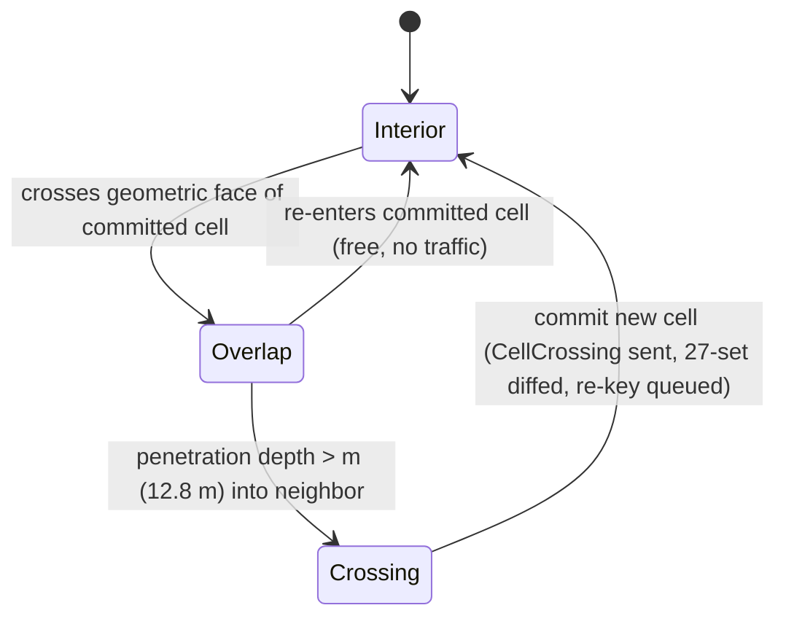

# 01 — Spatial Model: Grid, `CellId`, AOI, Hysteresis, Hotspots

The universe is partitioned by a hierarchical uniform integer grid whose cells are canonically aligned with `big_space` `GridCell`s. A single sortable `CellId(u64)` — offset-binary coordinates, Morton-interleaved, S2-style sentinel level encoding — simultaneously names a replication interest group, a storage shard-key prefix, and an authority/handoff unit. This document specifies the encoding bit-for-bit, the level hierarchy, the 27-cell area-of-interest (AOI) subscription mechanics, the boundary hysteresis that prevents authority thrash, hotspot splitting, and the tuning space. It is implemented by `orrery_protocol` (the `CellId` type) and `orrery_spatial` (Bevy-side integration).

Normative source: [ADR-0005](adr/0005-spatial-model.md) (parameters [D16](adr/0016-parameter-reference.md); interfaces to [D6](adr/0006-population-adaptive-topology.md), [D7](adr/0007-authority-and-leases.md), and [D11](adr/0011-persistence.md)).

## 1. Why a hierarchical uniform integer grid

The 2026 convergence across shipped large-world systems is a fixed-size-per-level integer cell grid linearized by a space-filling curve: [Unreal's Replication Graph `GridSpatialization2D`](https://www.unrealengine.com/en-US/tech-blog/replication-graph-overview-and-proper-replication-methods) serves 100-player / ~50,000-actor Fortnite matches with per-cell actor lists instead of all-pairs distance checks; [Minecraft's chunk/region format](https://minecraft.wiki/w/Region_file_format) is sixteen years of proof that chunk-keyed storage with empty-section elision scales for sparse worlds; Z-order keys over sorted keyspaces are standard in [HBase-style geo stores and Delta/Iceberg Z-ordering](https://medium.com/@nishant.chandra/z-order-indexing-for-efficient-queries-in-data-lake-48eceaeb2320). The grid's properties are exactly what D5 needs: O(1) cell-from-position, trivial 3×3×3 neighbor enumeration, stable pub-sub group IDs, no tree rebalancing, and empty cells that cost nothing (a sorted KV store only materializes written keys).

Alternatives, and why they lost:

- **S2 / H3 geodesic cells.** [S2](https://s2geometry.io/devguide/s2cell_hierarchy.html) is the gold standard for *encoding* — 64-bit IDs, parent = key prefix, sorted order = spatial locality — but its face-projection math targets a sphere; there is no volumetric S2, and [H3's hexagons don't subdivide exactly](https://medium.com/versent-tech-blog/geospatial-indexing-and-partitioning-in-grid-systems-b7b9c310bfb0), breaking clean prefix-range scans. For an abstract 3D universe the projection is pure overhead on top of integer cells `big_space` already gives us. We copy S2's bit layout, not its geometry.
- **Adaptive octrees as the partition unit.** Proven in demos ([EVE Aether Wars, 14,274 clients at GDC 2019](https://www.ccpgames.com/news/2019/ccp-games-and-hadean-to-showcase-the-next-eve-aether-wars-in-november)), but the vendor pivoted to defense simulation, and the structural problems remain: split/merge churn causes authority-handoff storms precisely when load peaks (mid-battle), and tree nodes are unstable pub-sub group IDs — every split invalidates subscriptions. Octrees survive in Orrery only as process-local query structures (§9).
- **Voronoi overlays (VAST/VON).** [Academically elegant fully-P2P AOI](https://dl.acm.org/citation.cfm?id=1326266) — each peer tracks only Voronoi neighbors — but constant re-triangulation under churn, [documented consistency losses](https://www.researchgate.net/publication/224305544_Voronoi_State_Management_for_Peer-to-Peer_Massively_Multiplayer_Online_Games), no shipped large deployment, no maintained Rust implementation, and crucially *no storage story*: a Voronoi region is not a shard key.
- **Static region-per-server** (EVE solar systems, Second Life 256 m regions) and **SpatialOS-style transparent distribution** are topology/authority decisions, rejected in D6/D2 respectively; their surviving lessons — natural boundaries hide handoffs, [overlap zones prevent authority thrash](https://image-ppubs.uspto.gov/dirsearch-public/print/downloadPdf/10878146), decouple replication state from simulation authority ([Star Citizen's Replication Layer](https://starcitizen.tools/Replication_layer)) — are baked into §7–§8 and D11.
- **`bevy_spatial`** is stalled at Bevy 0.16 (May 2025, ~136 downloads/month) and is not a dependency; we use [`kiddo`](https://crates.io/crates/kiddo) directly (§9).

## 2. `big_space` alignment and the float-precision story

[`big_space`](https://github.com/aevyrie/big_space) solves f32 precision at huge coordinates by giving every entity an integer `GridCell` coordinate plus a cell-local `f32 Transform` (nestable grids, `i8`..`i128` indices, up to ~160 bits of effective translation precision). Orrery makes this alignment *canonical*: the `big_space` grid is configured so that **one `GridCell` = one interest-level cell** (default edge 128 m). `CellId` derivation from an entity's position is then integer-only: take the `GridCell` triple, bias, interleave (§3). No float touches the partition function, so peers can never disagree about which cell an entity is in due to platform float drift.

The precision numbers at the 128 m default: cell-local coordinates never exceed ~64 m in component magnitude (origin at cell center), where an f32 ulp is 2⁻²³·2⁶ ≈ **7.6 µm**. Naive world-space f32 at the default universe extent (~2.7×10⁵ km per axis, §4) would have an ulp of ~32 m — six orders of magnitude worse and unusable. Rendering large scenes uses `big_space`'s floating-origin machinery unchanged; Orrery only pins the grid edge and reads the `GridCell`.

**Port risk (D14/D17):** `big_space` 0.12 (Feb 2026) targets Bevy 0.18; Orrery pins Bevy 0.19 (June 2026). Budget a small upstream port. Containment: `orrery_spatial` is the only crate importing `big_space` types; `CellId` math in `orrery_protocol` is engine-agnostic and does not depend on it. Fallback is a pinned vendored fork until upstream catches up (single-maintainer risk, same mitigation posture as lightyear/aeronet).

## 3. `CellId(u64)`: exact encoding

`CellId` lives in `orrery_protocol`. It is a `NonZeroU64` newtype (0 is invalid — free `Option<CellId>` niche), totally ordered, hash- and sort-stable, identical on wire, in memory, and (by default) in the storage keyspace.

### 3.1 Construction

1. **Levels** run 0 (root, entire addressable volume) to 21 (finest). Cell coordinates at level *L* are signed integers in `[−2^(L−1), 2^(L−1))` per axis (level-21: ±2²⁰ cells/axis).
2. **Offset-binary:** each signed coord is biased to unsigned: `u = c + 2^(L−1)`, an *L*-bit value. (Arithmetic right-shift of the biased form equals floor-division of the signed form, so coarsening is a shift.)
3. **Morton interleave:** the three *L*-bit values are interleaved MSB-first in axis order **x, y, z** — bit *i* of each axis produces the triplet `x_i y_i z_i` — yielding a `3·L`-bit Morton prefix (63 bits at level 21).
4. **Sentinel:** the prefix is placed in the top `3·L` bits of the u64, followed by a single `1` bit, followed by zeros.

```
bit 63                                        bit 0
┌──────────────────────────────┬───┬─────────────┐
│ Morton prefix  (3·L bits)    │ 1 │ 0 … 0       │
│ x_i y_i z_i triplets,        │   │ (63−3·L     │
│ MSB-first, i = L−1 … 0       │   │  zero bits) │
└──────────────────────────────┴───┴─────────────┘
```

### 3.2 Properties and operations

| Operation | Formula (sketch) | Cost |
|---|---|---|
| `level()` | `(63 − id.trailing_zeros()) / 3` | O(1) (`TZCNT`) |
| `parent()` | `lsb = id & id.wrapping_neg(); nl = lsb << 3; (id & nl.wrapping_neg()) \| nl` | O(1) |
| `is_prefix_of(other)` | `other ∈ subtree_range()` | O(1) |
| `subtree_range()` | `[id − lsb + 1, id + lsb − 1]` inclusive | O(1) |
| `children()` | append each of the 8 triplets, sentinel moves down 3 | O(1) |
| `coords()` | de-interleave (PEXT / magic-number gather), un-bias | O(1) |
| `neighbor(offset)` | decode → add offset → re-encode (never raw key arithmetic) | O(1) |

Two properties carry the whole design:

- **Sorted order = spatial locality.** Numerically adjacent IDs are (mostly) spatially adjacent cells, so `[cell_id][entity_id]` range scans read neighborhoods contiguously (D11).
- **Parent is a prefix.** A cell's entire subtree — all descendants at all levels, plus itself — is exactly the contiguous u64 range `[id − lsb + 1, id + lsb − 1]`. "Everything stored under this shard cell" is one range scan; zoom in/out is a prefix-length change, exactly the [S2 trick](https://s2geometry.io/devguide/s2cell_hierarchy.html).

Interleaving uses BMI2 `PDEP`/`PEXT` where available, with the portable magic-number fallback from [`morton-encoding`](https://docs.rs/morton-encoding/) / [`zorder`](https://docs.rs/zorder/latest/zorder/).

### 3.3 Worked example

Entity at world position `(312.7, −45.2, 1024.0)` m, default 128 m interest edge, level 21.

Cell coords: `floor(p/128)` = **(2, −1, 8)**. Bias by 2²⁰ = 1,048,576:

| Axis | Signed | Biased | 21-bit binary |
|---|---:|---:|---|
| x | 2 | 1,048,578 | `100000000000000000010` |
| y | −1 | 1,048,575 | `011111111111111111111` |
| z | 8 | 1,048,584 | `100000000000000001000` |

Interleave MSB-first (`x_i y_i z_i`): triplet i=20 is `101`; i=19..4 are sixteen `010`s; then i=3 `011`, i=2 `010`, i=1 `110`, i=0 `010`; append sentinel `1`:

```
101 | 010 ×16 | 011 010 110 010 | 1
= 0xA924_9249_2492_4D65        (level 21: trailing_zeros = 0 → (63−0)/3 = 21 ✓)
```

Derive the parent (level 20): `lsb = 1`, `nl = 8`; clear the bottom three Morton bits, set bit 3:

```
parent  = 0xA924_9249_2492_4D68   (trailing_zeros = 3 → level 20 ✓)
```

Three applications of `parent()` reach the **shard cell** (level 18, §4):

```
shard   = 0xA924_9249_2492_4E00   (trailing_zeros = 9 → level 18 ✓)
subtree = [0xA924_9249_2492_4C01, 0xA924_9249_2492_4FFF]
```

Note the level-21 id shares the shard id's top 54 bits — parent-is-prefix, verified by inspection. The subtree range is what `orrery_persistd` scans to load the whole shard cell.

### 3.4 API sketch

```rust
// orrery_protocol — sketch, not full implementation
#[derive(Clone, Copy, PartialEq, Eq, PartialOrd, Ord, Hash, Encode, Decode)]
pub struct CellId(NonZeroU64);

impl CellId {
    pub const FINEST_LEVEL: u8 = 21;
    pub fn from_coords(c: IVec3, level: u8) -> Result<Self, CellRangeError>;
    pub fn from_grid_cell(gc: GridCoord) -> Result<Self, CellRangeError>; // interest level
    pub fn level(self) -> u8;
    pub fn parent(self) -> Option<Self>;              // None at level 0
    pub fn ancestor_at(self, level: u8) -> Self;
    pub fn children(self) -> [Self; 8];
    pub fn coords(self) -> (IVec3, u8);
    pub fn neighbor(self, offset: IVec3) -> Option<Self>; // None outside ±2^(L−1)
    pub fn aoi_27(self) -> impl Iterator<Item = Self>;    // clamped at volume edge
    pub fn subtree_range(self) -> RangeInclusive<u64>;
    pub fn is_prefix_of(self, other: Self) -> bool;
}
```

## 4. Level hierarchy, interest level, shard level

| Level | Cell edge (defaults) | Role |
|---|---|---|
| 0 | ~2.7×10⁵ km | Root; whole addressable volume of one grid |
| … | ×2 per level | Coarse presence, island bookkeeping (`orrery_coordinator`) |
| **18** | **1,024 m** | **Shard level** (= interest − 3): cell-actor placement, rendezvous hashing, hotspot split root (D11) |
| 19–20 | 512 / 256 m | Intermediate: split targets for hot shard cells |
| **21** | **128 m** | **Interest level** (finest, default): AOI groups, leases/handoff, storage row prefix |

Defaults per D16: interest cell edge **128 m** ≈ AOI radius; shard cell = **8×8×8 interest cells**. The interest level is configurable (`interest_level`, default 21 = finest); games that want sub-interest key granularity (e.g. finer terrain chunk keys) set `interest_level < 21` and keep the finer levels for storage only. At the defaults the addressable volume is 2²¹ × 128 m ≈ 268,435 km per axis; games needing more range use nested `big_space` grids (one `CellId` space per grid, grid id carried alongside — see §13) or the `u128` feature (D5).

## 5. Triple duty: one ID, three systems

| Duty | Granularity | Consumer | Mechanism |
|---|---|---|---|
| **Replication interest group** | interest cell (21) | `orrery_spatial` → replicon visibility/rooms | Peer subscribes to its cell + 26 neighbors; cell id *is* the stable room id ([Fortnite RepGraph precedent](https://www.unrealengine.com/en-US/tech-blog/replication-graph-overview-and-proper-replication-methods)) |
| **Storage shard-key prefix** | interest cell rows, shard cell placement | `orrery_persistd` | `world/{cell_id}/{entity_id}` rows; cell actor owns one shard-cell subtree range; neighborhood load = 27 range scans (D11) |
| **Authority/handoff unit** | interest cell | `orrery_authority`, `orrery_coordinator`, `orrery_field_host` | Leases carry the holder's cell; handoff hysteresis (§7), field-host promotion at >32 sustained per cell (D6), witness-set seeding per cell-epoch (D10), hotspot splitting (§8) |

The point of the triple duty is that the three systems can never disagree about "where" an entity is: the same 64 bits route its packets, key its rows, and scope its lease.

## 6. AOI: 27-cell subscription mechanics

Each peer's interest set is the 3×3×3 neighborhood of its committed interest cell — 27 cells. Because the block extends a full cell edge beyond the center cell in every direction, any AOI radius R ≤ edge is guaranteed covered regardless of position within the center cell. Within subscribed cells, a second-stage precise filter (range/frustum — the [aura-nimbus model](https://dl.acm.org/doi/10.1145/2535417) layered on cell pub-sub) selects the **24-entity high-rate set** (D6); remaining in-AOI entities are 1–4 Hz extrapolated proxies. Cells are the coarse filter; they are deliberately *not* the precise one.

`orrery_spatial` maps each subscribed cell to a replicon visibility group / lightyear room whose id is the `CellId` itself (room ids are globally allocated in lightyear 0.29's replicon backend, so the mapping is direct). On a face crossing the 27-set diff is 9 removed / 9 added; edge crossing 15/15; corner crossing 19/19. The diff is always computed set-to-set, never incrementally, which makes multi-cell jumps (§10) the same code path.

```mermaid
sequenceDiagram
    participant P as Moving peer (orrery_spatial)
    participant N as Island peers / field host
    participant G as Gateway (orrery_persistd)
    participant C as orrery_coordinator
    P->>P: position exceeds hysteresis depth (§7) — commit cell A→B
    P->>P: diff 27-sets: 9 out / 9 in (face case)
    P->>N: CellCrossing{entity, from, to, tick, auth_seq}  [reliable stream]
    N->>N: update replicon visibility; removed cells enter 1 s linger
    N-->>P: snapshot burst of entities in added cells (nearest-first, priority-accumulated)
    P->>G: InterestUpdate{added, removed}
    G-->>P: cold cells: FDB range scans world/{cell}/… + live actor deltas (<50 ms first page-in)
    G->>G: queue storage re-key world/{A}/{eid} → world/{B}/{eid} at next commit
    P->>C: coarse presence update (shard level)
    C->>C: island merge/split evaluation (D6)
```

Design details (invented here, consistent with D5/D6/D11):

- **Control messages** ride the reliable stream, not datagrams — a lost `CellCrossing` must not silently desynchronize visibility. Sketch:

  ```rust
  // orrery_protocol — sketch
  pub struct CellCrossing { pub entity: PersistId, pub from: CellId, pub to: CellId,
                            pub tick: Tick, pub auth_seq: u32 }
  pub struct InterestUpdate { pub added: SmallVec<[CellId; 19]>,
                              pub removed: SmallVec<[CellId; 19]>, pub tick: Tick }
  ```

- **Additions are immediate; removals linger 1 s** (tunable). Hysteresis already suppresses boundary jitter, but a fast double-crossing deeper than the margin would otherwise despawn-and-respawn remote entities; the linger converts that into a no-op.
- **Nearest-first streaming:** newly added cells' entities are prioritized by distance in the per-link priority accumulator (D8), so the wavefront of new content arrives in perceptual order; the gateway target for cold-cell page-in is **< 50 ms** (D16).
- **Authority is unaffected by crossing** (D7): the holder keeps its lease; only the storage row is re-keyed by the owning cell actor at the next commit. Crossing a *shard* boundary additionally re-routes the uplink to the new cell actor (rendezvous hashing), transparently to gameplay.

## 7. Hysteresis: the 10% overlap zone

Hard boundaries thrash: an entity oscillating on a cell edge would flip its cell, its subscriptions, and its storage routing every few ticks. This is the failure SpatialOS solved with worker-authority overlap regions (entities stay with their current worker while inside the overlap — the pattern survives in [Improbable's handover patent](https://image-ppubs.uspto.gov/dirsearch-public/print/downloadPdf/10878146)) and Second Life never fully solved with hard 256 m region seams ([timing-sensitive crossing failures for 20 years](https://wiki.secondlife.com/wiki/Region_crossing)).

Orrery's rule is a Schmitt trigger on penetration depth. Margin **m = 10% of cell edge** (D16) = 12.8 m at defaults:

- An entity is **committed** to exactly one interest cell at all times (`InterestCell.committed`); all three duties key off the committed cell, never the raw geometric cell.
- Commitment changes only when the position leaves the committed cell's bounds *expanded by m on every face* — i.e. the entity is more than m deep into a neighbor.
- Re-entering the committed cell from the overlap zone costs nothing: no messages, no re-key, no subscription change.



Consequences: a strafing fight straddling a boundary generates zero crossings as long as oscillation amplitude stays under 12.8 m; a walking player (5 m/s) must commit ~2.6 s of directed movement to cross. Because commitment is hysteretic, two peers may briefly disagree about an entity's *geometric* cell but never about its *committed* cell — `CellCrossing` carries `(tick, auth_seq)` and only the authority holder emits it (single-writer invariant, D2). The AOI coverage guarantee degrades gracefully: with commitment lagging position by at most m, the worst-case guaranteed visibility radius is `edge − m` (115.2 m at defaults) — accounted for in tuning (§11).

## 8. Hotspot detection and shard-cell splitting

Space-filling-curve range sharding concentrates a crowd's writes on one shard — the [FoundationDB hotspot pattern, issue #11510](https://github.com/apple/foundationdb/issues/11510) (write-queue growth, `process_behind`), and the reason [TiKV pairs range sharding with automatic split/merge](https://tikv.org/deep-dive/scalability/data-sharding/). Orrery has two independent responses at two layers:

- **Topology (D6, not this doc):** interest cells sustaining >32 players promote to a field host — see [02-networking.md](02-networking.md).
- **Storage/actor (D11):** the shard-cell actor in `orrery_persistd` splits.

Detection inputs: per-interest-cell player counts (coordinator presence telemetry) and per-actor write rates / journal backlog (persistd telemetry, OpenTelemetry per D12). Split mechanics (elaborated here): when a shard actor exceeds its sustained load threshold (default: >50% of per-actor write budget or >96 players in the shard cell for 30 s — tunables, not D16 constants), it splits into its **8 child cells** (level +1), each re-placed by rendezvous hashing; because parent = prefix, each child's key range is a sub-range of the parent's, so the split moves actor ownership and journal routing but **no storage keys change**. Splits recurse to at most the interest level — one interest cell is the atomic actor granularity (beyond that, the answer is the field host + FDB's own range splitting under the checkpoint load). Merging back is lazy and conservative (default: <25% load for 5 min) to avoid split/merge oscillation — the octree lesson from §1 applied to the one place Orrery *does* adapt granularity: storage actors, whose IDs are stable cell ids, not tree nodes, so subscriptions and keys survive the split.

**Pre-splitting:** for scheduled crowd events, ops can pre-split shard cells by telemetry forecast (the load-shedding design flagged in D17.4) rather than reacting mid-spike.

## 9. Intra-cell query structures — and what they are not

Inside a process (client, field host, cell actor), gameplay needs "nearest N", range, and volume queries at finer-than-cell resolution: target acquisition, the aura-nimbus precise filter (§6), proximity interactions, witness-set candidate enumeration. These use ordinary in-memory indexes over the entities in the 27 subscribed cells:

- [`kiddo` 6.x](https://crates.io/crates/kiddo) k-d tree — the actively maintained default (6.0.1 Aug 2026, 7.4 M downloads); rebuilt or incrementally maintained per tick over the local entity set.
- [`oktree`](https://lib.rs/crates/oktree) (pool-based octree, Bevy-benchmarked) or [`rstar`](https://lib.rs/crates/rstar) (R*-tree) where insert-heavy or static-geometry workloads fit better.

These structures are **process-local, ephemeral, and invisible**: they have no network identity, never appear on the wire or in the keyspace, are never partition or authority units, and can be swapped per game without protocol impact. The partition unit is always the cell (§1's octree rejection is precisely about *not* letting adaptive trees own IDs).

## 10. Edge cases and failure modes

- **Fast movers.** An entity faster than ~one cell edge per second (128 m/s default; threshold = `edge × send_rate / hysteresis_ticks`, tunable) gets *predictive subscription*: `orrery_spatial` subscribes cells along the velocity vector one crossing early, so content is paged in before arrival (the VAST literature's missed-fast-mover failure, avoided by prefetch). The set-diff mechanics already handle multi-cell-per-tick motion; hysteresis still applies at each commit. **A fast *carrier* — a ship with contents — must not move its contents through cells at all**: it becomes a nested grid whose velocity lives at the grid root (§13), so only one entity crosses cells, not hundreds.
- **Teleports.** A teleport (Ruleset-sanctioned, else the D10 invariant validators flag it) skips hysteresis entirely: full 27-set replacement, treated as an area load (D11 `< 50 ms` first page-in), possible island change via the coordinator, lease retained, storage re-key immediate. Presentation should expect up to one page-in latency of missing surroundings.
- **Boundary exactness.** Cell assignment is `floor(p / edge)` in `big_space` integer space — an entity exactly on a face belongs to the higher cell deterministically on every platform (integer math only; no float epsilon disagreements).
- **Coordinate range exhaustion.** `from_coords` outside ±2²⁰ (level 21) returns `CellRangeError`; `orrery_spatial` saturates the committed cell at the volume edge and raises telemetry. Bigger universes: nested `big_space` grids (§13) or the `u128` feature (D5), decided at game-config time, not dynamically.
- **Entities larger than a cell** (stations, capital ships). Committed cell = anchor point; the entity is *replicated into* every cell its bounds intersect (visibility union), but leased, keyed, and handed off by its anchor only. Games with many such entities should raise the interest edge or model them as multi-entity assemblies.
- **Cell-actor split during crossing.** A `CellCrossing` racing a shard split can reach the old actor; rendezvous-hash routing at the gateway retries against the current owner — idempotent because re-key is keyed by `(entity, tick)`.
- **Morton locality discontinuities.** Neighbor cells across power-of-two boundaries can be numerically distant. Never scan "nearby" as one raw key range: neighborhoods are always the explicit 27 ids → 27 range scans (or fewer after prefix coalescing). Discontinuities then cost nothing correctness-wise and only marginal scan locality (§12).

## 11. Parameter tuning guidance

| Parameter | Default (D16) | Tuning pressure |
|---|---|---|
| Interest cell edge | 128 m | Must satisfy `edge ≥ AOI radius + hysteresis margin` for the coverage guarantee (§7). Bigger cells → more entities per 27-cell set → more proxy traffic and page-in volume; smaller cells → more crossings (rate ∝ v/edge) and more rooms. |
| AOI radius | ≈ cell edge | Sets perceptual range; the 24-entity high-rate set and 1–4 Hz proxies (D16) bound bandwidth regardless, so oversizing AOI mostly costs proxy churn and load traffic. |
| Shard level delta | −3 (8×8×8) | Larger shard cells → fewer, hotter actors; smaller → more placement churn. 8×8×8 ≈ 1 km³ at defaults fits the "handful of contiguous scans" goal. |
| Hysteresis margin | 10% of edge | Below ~5% boundary fights thrash again; above ~20% the coverage guarantee visibly erodes (`edge − m`) and handoff feels laggy for fast movers. |

Per-genre starting points: close-quarters shooter (interactions ≤ 60 m): edge 64–128 m; open-world vehicular (engagements ~300 m): edge 256 m and accept larger page-ins; space sim: nested grids — e.g. a planetary grid at 128 m inside a system grid at 128 km — each with its own `CellId` space (§13). Expected occupancy math for capacity planning: entities-in-interest ≈ 27 · ρ · edge³ for density ρ; keep the *typical* value within a small multiple of the 24-entity high-rate set so the precise filter, not the cell filter, is the effective selector.

## 12. Morton vs. Hilbert at the storage layer

The runtime/network `CellId` is **Morton, permanently**: it is the cheapest to compute (one `PDEP` per axis), trivially invertible for neighbor math, and its locality is sufficient for interest management where neighborhoods are explicit id sets (§10). Hilbert curves cluster measurably better for *range scans* — [`lindel`'s documentation](https://lib.rs/crates/lindel) states the trade plainly: Hilbert preserves locality better, Morton is much cheaper to compute.

Accordingly, `orrery_persistd` owns a single pluggable key-mapping function `storage_key(CellId) -> u64` (default: identity). If scan telemetry on real workloads shows FDB range-read locality is a measurable cost, the Hilbert mapping via `lindel` can be enabled *behind that function only* — the wire, the rooms, the leases, and every peer-visible surface keep Morton ids. A Hilbert index built the S2 way retains the parent-prefix property, so subtree-range scans survive the swap; the mapping choice is per-deployment and recorded in the store's metadata row to keep scans and writers consistent. Default is off: measure first (TiKV and FDB both split ranges adaptively, which absorbs much of the theoretical difference).

## 13. Nested grids: moving reference frames

Everything above describes one grid. A moving *carrier* — a ship with crew, a station with a docked ship, a planet with a settlement — breaks the single-grid assumption twice over: its contents would cross cells at the carrier's velocity (a 500 m/s cruiser re-keys hundreds of entities every ~256 ms at the 128 m default), and its contents' local velocities would be dwarfed by the frame's velocity (a player walking a corridor at 5 m/s inside a 500 m/s hull is, in universe space, a 505 m/s entity — flagged by every speed-cap invariant validator in §D10). The resolution is big_space's nested grids, promoted from a rendering convenience to a first-class partition concept: **the carrier is a nested grid, and its velocity lives at the grid root, never in its contents.**

The rule for when to nest: **a nested grid is justified when (a) its contents move together as a frame, and (b) contents interact with each other far more than with the parent frame.** A crewed ship and an inhabited planet qualify on both counts; a drifting asteroid does not — it is an ordinary entity in its parent grid. Do not nest for organization: every level is another `CellId` space, another teleport boundary, another interest boundary.

### 13.1 Grid identity and the frame stack

Each nested grid is its own `CellId` space (§3 encoding unchanged), identified by a **`GridId`** carried alongside every `CellId` wherever a cell reference can cross frames: wire messages, journal records, storage keys, leases, and log records. A full spatial reference is `(GridId, CellId)`; within a single-frame context the `GridId` is implicit. The root grid (the universe/system grid) has the well-known `GridId` 0. A grid's *frame* — its origin transform and velocity relative to its parent — is stored on the grid-root entity's row (`grid/{grid_id}`, [08-persistence.md](08-persistence.md) §6) and replicated to anyone the frame is visible to.

The frame stack for a player in a ship on a planet is `universe > planet > ship`. Composition is exact: each level is integer `GridCell` arithmetic plus one f32 transform compose at the leaf (§2), so a contents-to-parent transform never accumulates the frame's velocity into float error — the player's ship-local f32 coordinates stay in the ~7.6 µm-ulp regime at any carrier speed.

### 13.2 Interest across frames

AOI subscription is computed **in the observer's own grid only**. An observer outside the ship never subscribes to ship-grid cells: they receive the ship root as one replicated entity (high-rate if in their 24-entity set, a 1–4 Hz proxy otherwise), and the ship's interior stays cluster-side until revealed — the D10 exposure-minimization posture falls out of the frame boundary for free. The frame boundary *is* an interest boundary.

The one exception is the **crossing window**: an entity mid-transition (the EVA case, §13.3) holds a transient **dual subscription** — its committed cell in the destination grid plus a shrinking tail of source-grid cells (the airlock it just left), bounded by a short timer (default 5 s), so the crossing doesn't pop content at the threshold. The carrier root itself is pinned in the crossing entity's high-rate set for the duration: the departing player watches the ship recede as one entity, not as its contents.

### 13.3 Frame migration (EVA, docking, landing)

Crossing between grids comes in two kinds, and they are different mechanisms:

- **Teleport-class** (boarding a docked ship, landing): the frames are stationary relative to each other, so the crossing is the §10 teleport path — Ruleset-sanctioned, full 27-set replacement, area-load page-in, lease retained, storage re-key immediate.
- **Continuous-class** (EVA, undocking thrust, being flung): relative velocity is nonzero and must be *preserved* across the reparenting. This is a **frame migration**, not a teleport:

  1. **Transform.** The entity's state converts exactly: `parent_transform = grid_origin ∘ local_transform` (integer cell math + one f32 compose), `parent_velocity = frame_velocity + rotated(local_velocity)`. The result is a clean `(GridCell, f32 local)` pair in the destination grid with a large but representable velocity.
  2. **Destination.** Reparent to the **innermost enclosing frame whose velocity the entity will now share**: deep-space EVA → the universe grid; jumping out in atmosphere → the planet grid; undocking from a station → the station's parent grid.
  3. **Log continuity.** The authority (for a player, the player — the `PLAYER_BOUND` lease is entity-keyed and survives migration untouched, §D7) appends a **`FrameChange` record** to the signed input log at the migration tick, binding the chain to the new coordinate basis ([06-verifiable-core.md](06-verifiable-core.md) §6). Replay and tolerance-band comparison apply *after* the recorded transform, so the 500 m/s basis change is evidence, not a false positive.
  4. **Storage.** The entity's `world/` row re-keys from the source grid's keyspace to the destination's at the next commit — one row, same `PersistId`.

### 13.4 Cross-frame interaction

The hit-validation path ([05-prediction-rollback.md](05-prediction-rollback.md) §7) assumes one coordinate basis per interaction, so the rule is: **interaction requires frame coincidence.** You can hit-validate what shares your grid; everything in another grid is visible only through its frame root's replicated/proxy representation. Long-range fire at a moving ship targets *the ship* (one entity, one pose history), not its crew — per-crew effects become possible only after a boarding action establishes frame coincidence. Games that need cross-frame weapons fire (orbital bombardment) model the effect as the *target frame's* Ruleset event (a `GeometryFrame`-checked terrain/structure impact), not as a cross-frame hit claim.

### 13.5 Islands and presence across frames

Islands (D6) form over populated cells **per grid**: the ship's interior is an island over ship-grid cells (a lone crew member is an island of one), independent of the system-grid island the ship root drifts through. The coordinator tracks coarse presence per grid and evaluates merge/split within each; a carrier approaching a station is two grids in proximity, and the dock/merge handshake is where the fast-traveler open question (D17.6) concentrates. Field-host promotion applies per grid-island as usual — a busy ship can be promoted exactly like a busy ground cell.

### 13.6 Environmental fields: gravity, atmosphere, and everything that is not a frame

Not every environmental influence is a frame. The §13 nesting rule is the test: a gravity well fails it twice — its "contents" (passing ships) do not move together (that is the point of a well: everything in it is on a different trajectory), and a ship skimming the well interacts with the parent frame constantly. Wells also *overlap* (star + planet + moon), and the frame stack is a strict tree — an entity cannot be inside two frames, but it can be inside two gravity wells. A vented compartment fails the rule too: the room's contents do not move relative to the ship; the room is a region *within* the ship grid. The resolution is a third spatial concept alongside cells and frames: the **environmental field** — journaled, content-hashed, per-grid state that core rules read through a recorded view, exactly as they read terrain.

**Definition.** A field is named, typed state defined over a region of one grid: a gravity vector field, a compartment's atmosphere (pressure, temperature, composition), a radiation belt, a sensor jammer. Fields come in two classes with different trust stories:

- **Derived fields** are computable from other journaled state — gravity from celestial bodies' orbital state (itself deterministic from `universe_seed`; orbits are the most clockwork thing in the game). They are cheap to make replay-closed: the content hash of the inputs pins the field.
- **Simulated fields** are history-dependent and mutated by gameplay — compartment atmosphere after a breach, a spreading fire. They are replay-closed only if the game's sim is deterministic with logged inputs; otherwise they are cluster-trusted state validated by `invariants()` only, never replay-adjudicated — the same tier the verifiable core already assigns to line-of-sight against mutable terrain ([06-verifiable-core.md](06-verifiable-core.md) §3). Games choose the tier by choosing whether the field touches persistent value.

**Ownership and control.** Field state lives with the **cell actors of the grid that contains it** ([08-persistence.md](08-persistence.md)) — journaled, checkpointed, and migrated on split/merge like any other cell state. No field is a `PLAYER_BOUND` entity; per §13.2 interiors are cluster-side until revealed, and per the seed-predictability rule ([06-verifiable-core.md](06-verifiable-core.md) §9) unwitnessed state lives cluster-side, so field simulation is a cluster (or promoted field-host, §13.5) responsibility. Control is exercised only through the Ruleset: "vent deck 3" is a Ruleset-adjudicated intent against the ship grid, and an effect originating outside the frame — a breach from weapons fire — is modeled as the *target frame's* Ruleset event, per the §13.4 cross-frame rule. The compartment map itself (which cells form which compartment, where the doors are) is mutable geometry: a hull breach is a journaled geometry mutation, and the atmosphere sim is downstream of geometry.

**Reading fields from core rules.** `step` reads fields only through `StateView::fields()`, which records each consulted field (region keys + content hashes) into the tick's log as a **`FieldFrame`** — the exact analogue of `GeometryFrame` for terrain and `NeighborFrame` for neighbors ([06-verifiable-core.md](06-verifiable-core.md) §3). Replay is thereby closed over the environment: an adjudicator re-executing a disputed window cross-checks the recorded hashes against journaled field state at that tick, and an authority that feeds itself fabricated gravity to justify a trajectory produces checkable evidence against itself. Field math is continuous state: VC-6 libm floats, VC-7 quantization at tick boundaries, tolerance-band comparison — a free-fall trajectory is precisely the "a centimeter cannot mint currency" class the bands exist for. Derived fields need a Ruleset-defined cutoff (acceleration below quantization noise reads as zero) so the recorded read-set stays small; overlapping wells compose by vector addition inside the Ruleset.

**Interaction with frames.** A body's *motion* and its *gravity* are separate concepts living in different places: a planet is a frame (its velocity at the grid root, §13.1) *and* the source of a gravity field in the parent grid it moves through. An approaching ship reads the field; a landed entity has migrated (§13.3) and no longer reads the field — surface gravity is now a property of the frame it shares, applied by the Ruleset as frame-local environment. The `FrameChange` record already binds the discontinuity into the log, so the switch from field-governed to frame-governed physics is evidence, not a false positive — the same argument as the 500 m/s basis change.

**Replication and exposure.** Fields replicate through the existing interest machinery, and the frame boundary does the D10 exposure-minimization work for free: an outside observer sees at most a summary flag on the ship root's proxy ("venting"), never the interior gas sim; occupants receive their compartment's state through normal room subscription at bulk-class rates — pressure is not 60 Hz state, and nothing value-dense is continuous ("did the airlock open" is an integer fact; the exact pascal reading is not). Cross-frame field effects do not propagate directly (§13.4): a fire in a docked ship affecting the station is a Ruleset event on the station grid.

**What the framework fixes vs. what games own.** Orrery fixes only the mechanism: fields are durable, journaled, replay-closed via `FieldFrame`, and replicated through interest. The semantics — pressure, temperature, O₂ fraction, fire, radiation, their diffusion and their gameplay effects — are entirely the game's Ruleset and cell-actor logic. A vacuum-only game never defines an atmosphere field; a game with a full atmos sim implements diffusion in its cell actors and picks its trust tier.

## Cross-references

[02-networking.md](02-networking.md) (islands, topology regimes over these cells) · [03-replication.md](03-replication.md) (visibility/rooms, priority accumulation) · [04-authority.md](04-authority.md) (leases, handoff on crossing) · [06-verifiable-core.md](06-verifiable-core.md) (`FrameChange` log record, replay across bases, `FieldFrame` recorded field reads) · [08-persistence.md](08-persistence.md) (cell actors, keyspace, checkpoints, `grid/` rows) · [09-services-and-ops.md](09-services-and-ops.md) (telemetry, hotspot ops).
