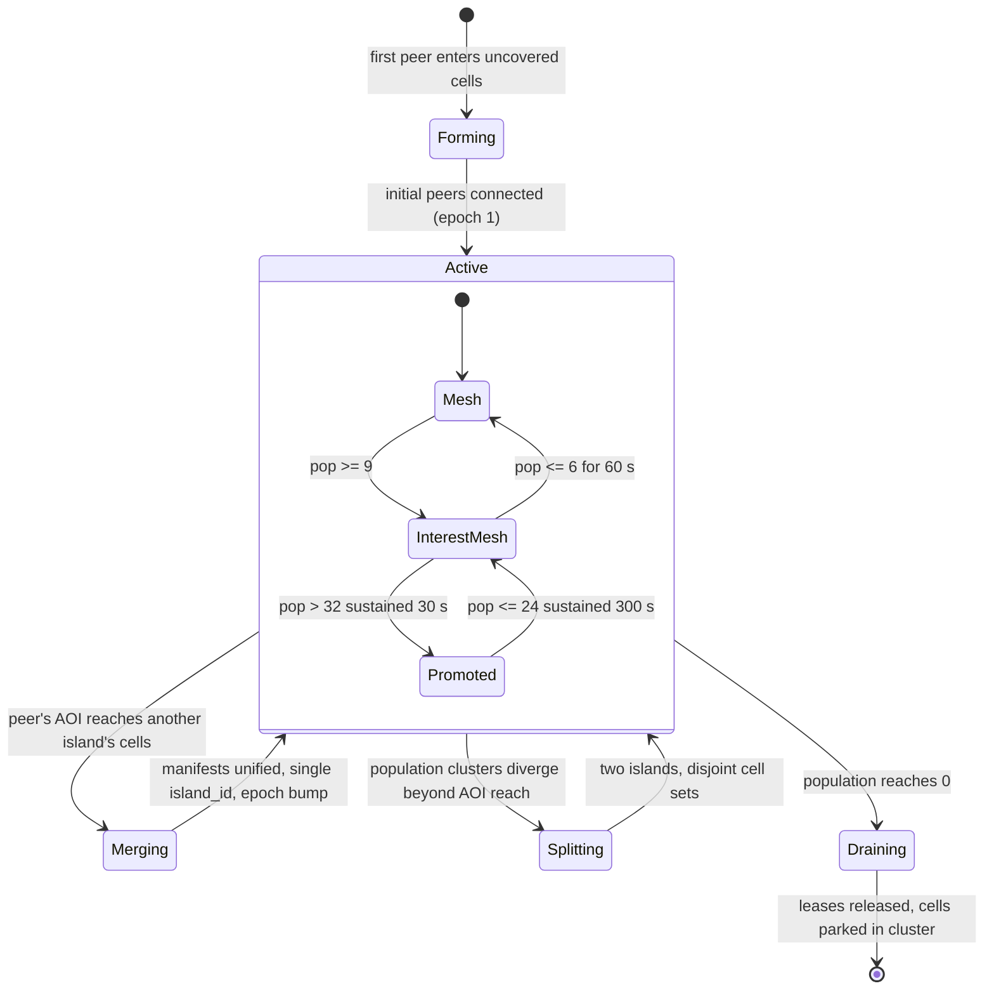

# Networking & Topology

Orrery's transport layer is iroh 1.x QUIC: peers dial each other by public key, connect instantly through self-hosted relays, and migrate to punched direct paths via QUIC multipath. On top of that transport, the coordinator organizes peers into **islands** — per-region replication sessions whose internal topology adapts to population: full mesh up to 8 players, interest-managed mesh to 32, and coordinator-spawned field hosts beyond that. This document explains the transport mechanics, the topology regimes and their bandwidth math, the connection and island lifecycles, the channel policy, and the failure modes. It expands the transport and topology decisions; the persistence uplink that rides this transport is specified in [08-persistence.md](08-persistence.md), and the replication payloads in [03-replication.md](03-replication.md).

Normative source: [ADR-0003](adr/0003-transport.md) and [ADR-0006](adr/0006-population-adaptive-topology.md) (touchpoints: [D4](adr/0004-bevy-netcode-stack.md), [D12](adr/0012-backend-services.md), [D15](adr/0015-crate-set.md), [D16](adr/0016-parameter-reference.md)).

---

## 1. iroh primer for game engineers

[iroh](https://github.com/n0-computer/iroh) is a P2P QUIC library. If you have shipped netcode on ENet, Steam sockets, or raw UDP, the mental model shifts are:

**You dial a key, not an address.** Every node has an ed25519 keypair; the public key is its `NodeId` and its stable network identity ([dial keys, not IPs](https://pinggy.io/blog/iroh_1_0_dial_keys_not_ips/)). QUIC's TLS 1.3 handshake authenticates the remote key, so transport identity and encryption come for free. `NodeId` is Orrery's transport identity *everywhere*: peer↔peer, peer↔coordinator, peer↔persistence gateway (D3). The identity service ([09-services-and-ops.md](09-services-and-ops.md)) binds `NodeId`s to accounts; the transport neither knows nor cares.

**Relays are the rendezvous, the fallback, and the address book.** Each node maintains a lightweight connection to a "home relay" — a stateless, self-hostable HTTPS server ([`iroh-relay`](https://docs.iroh.computer/about/faq): public IP + DNS + ACME cert, nothing else). Relays forward encrypted QUIC packets between nodes that cannot yet (or ever) reach each other directly. Because the relay path exists from the first packet, **connections start working immediately** — no user-visible "connecting…" while ICE gathers candidates. This is the same design Tailscale documents as the minimum viable traversal stack (coordination + address discovery + relay fleet, [How NAT traversal works](https://tailscale.com/blog/how-nat-traversal-works)), collapsed into one binary.

**Hole punching happens inside QUIC, after connect.** iroh ≥1.0 runs on [`noq`](https://github.com/n0-computer/noq), n0's quinn-derived QUIC stack implementing RFC 9000/9001/9002/9221 plus three extensions that matter here:

- **QUIC Address Discovery (QAD):** the remote endpoint tells you the source address it observed for you — STUN's job, without STUN servers.
- **[draft-seemann-quic-nat-traversal](https://datatracker.ietf.org/doc/html/draft-seemann-quic-nat-traversal) (QNT):** `ADD_ADDRESS` / `PUNCH_ME_NOW` frames carry ICE-style candidate exchange and round-based simultaneous-open scheduling *inside the already-established relay-path connection*. Both sides fire packets at each other's candidate addresses; the NATs on each side see outbound traffic and open mappings; one pair sticks ([background](https://seemann.io/posts/2024-10-26---p2p-quic/)).
- **QUIC Multipath:** the punched direct path is added as a second path on the *same connection*, validated, and traffic migrates to it with congestion state handled per-path. Pre-1.0 iroh had to reset the congestion controller on path switch, causing seconds-long hiccups; on noq the [migration is native](https://www.iroh.computer/blog/iroh-on-QUIC-multipath) and invisible to the application. The relay path stays available as a standby.

**One connection carries everything.** RFC 9221 unreliable datagrams (state replication — newest-wins, no retransmit) and any number of reliable streams (control, bulk) multiplex on one connection with no head-of-line blocking between them. There is no second socket, no separate "reliable channel" handshake.

**Measured success rates.** iroh reports ~90% of connections achieving a direct path in production, with ~95% of data volume flowing direct ([source](https://pinggy.io/blog/iroh_1_0_dial_keys_not_ips/)); Tailscale independently corroborates ">9 of 10 connections direct" for the same class of techniques ([NAT traversal improvements](https://tailscale.com/blog/nat-traversal-improvements-pt-1)). The failures concentrate in symmetric/hard NAT, CGNAT, multi-layer NAT, and UDP-blocking networks. Tailscale's numbers on the hard tail are sobering: a *single* hard NAT yields ~98% punch success after ~20 s of birthday-paradox probing, but two stacked hard NATs (CGNAT↔CGNAT) need ~28 minutes to reach 99.9% — effectively never for a game session. That 5–10% tail rides the relay **permanently**, which is why D3 treats relay capacity as a product requirement (§8).

One accepted property, stated plainly: once a direct path is established, interest-set peers learn each other's IP addresses. Relay-only mode would hide them (Valve's SDR sells exactly that) at a permanent latency cost; Orrery accepts the exposure and documents it as a trust-model limit alongside D10's fog-of-war caveats ([07-witnessing.md](07-witnessing.md)).

## 2. Why iroh — the decision table

| | **iroh 1.x** (chosen) | rust-libp2p + DCUtR | DIY punching over quinn | matchbox / WebRTC |
|---|---|---|---|---|
| Punch success | **~90% direct, ~95% of bytes direct** ([prod data](https://pinggy.io/blog/iroh_1_0_dial_keys_not_ips/)) | ~70% (70%±7.1%, [large-scale measurement](https://arxiv.org/html/2510.27500v1)) | realistically ~70% territory without years of tuning | ICE-dependent; needs separate STUN+TURN fleet |
| Relay fallback | bundled, stateless, self-hostable (`iroh-relay`) | DHT-discovered public relays (unmanaged QoS) | you build and operate a TURN/DERP-alike | separately operated TURN |
| Connect UX | instant via relay, then multipath-migrates | punch-then-connect (wait) | you design it | multi-RTT ICE + DTLS handshakes |
| Datagrams + streams, no cross-HOL | native (RFC 9221 + streams, one connection) | no unreliable-datagram surface through its abstractions | native (quinn) | SCTP data channels; heavier ICE+DTLS+SCTP stack |
| Maintenance (Aug 2026) | 1.0.3, wire-stable across 1.x, active | last release 0.56.0, 2025-06-27 (13+ months); DCUtR maintenance [openly questioned](https://github.com/libp2p/rust-libp2p/discussions/5910) | quinn itself healthy; the traversal layer is all on you | active, but native path drags full webrtc-rs |
| Bevy precedent | `aeronet_iroh` prototype in the [aeronet repo](https://github.com/aecsocket/aeronet) | none meaningful | bevy_quinnet et al. (no traversal) | bevy_matchbox + bevy_ggrs |
| Verdict | **adopted** | rejected: punch gap + release gap | rejected: reproduces iroh at DIY quality, still needs a relay fleet | rejected: only wins if WASM parity mattered; R9 says native-only |

Hedges retained (D3): everything goes through the `aeronet_io` abstraction so a raw-quinn backend is a drop-in (§4); if iroh's identity layer ever chafes, `noq` itself (QNT + QAD + multipath) is usable standalone, and [ant-quic](https://crates.io/crates/ant-quic) demonstrates a second independent QNT implementation.

## 3. Connection lifecycle

Peers never discover each other; the coordinator (D12) tells them whom to dial. A coordinator handout, relay-first connect, punch, and migrate look like this:

```mermaid
sequenceDiagram
    participant A as Peer A (orrery_net)
    participant C as Coordinator
    participant R as Relay
    participant B as Peer B

    A->>C: AreaJoin { cell_id, session_token }
    C-->>A: IslandManifest { island_id, epoch, peers: [{node_id: B, relay_hint, cells}] }
    C-->>B: ManifestDelta { epoch+1, joined: [A] }
    A->>R: QUIC handshake to B, relay path
    R->>B: forward (stateless, encrypted passthrough)
    B-->>A: handshake complete
    Note over A,B: session UP on relay path — replication starts now
    B-->>A: QAD: "your address as I see it"
    A->>B: ADD_ADDRESS (local + reflexive candidates)
    B->>A: ADD_ADDRESS (candidates)
    A->>B: PUNCH_ME_NOW round — simultaneous open on candidate pair
    Note over A,B: NAT mappings opened; direct path validated
    A->>B: multipath migration → direct path primary
    Note over A,B: relay path retained as standby; orrery_net records path telemetry
```

Key properties:

- **Gameplay traffic never waits for the punch.** The session is live on the relay path within one handshake RTT; the punch typically lands within a few hundred ms and traffic migrates mid-stream. A player entering a busy cell starts receiving state immediately at relay latency, which then *drops* when the path goes direct.
- **Failure is not a state transition the game sees.** If every punch round fails, the session simply stays on the relay path. `orrery_net` exposes `PathState { Relay | Direct | Mixed }` per session as telemetry (relay-path fraction is an ops SLI, §8), but replication, prediction, and authority logic are path-agnostic.
- Server-side endpoints (coordinator, gateway, field hosts) are ordinary iroh nodes at well-known public addresses — peers dial them directly, no punching needed (D3).

The coordinator handout message set is `orrery_protocol` territory; the working field set (designed here, not in the ADR):

```rust
// sketch — orrery_protocol::coordinator
pub struct IslandManifest {
    pub island_id: IslandId,          // u64, coordinator-allocated
    pub epoch: u32,                   // bumped on any membership/topology change
    pub cells: SmallVec<[CellId; 8]>, // populated cells this island covers
    pub regime: Regime,               // Mesh | InterestMesh | Promoted { host: NodeId }
    pub peers: Vec<PeerEntry>,        // NodeId + relay hint + occupied cells
}
pub struct PeerEntry {
    pub node: NodeId,
    pub relay_hint: RelayUrl,   // that peer's home relay (dial accelerator)
    pub cells: SmallVec<[CellId; 4]>,
}
```

Epochs make manifests idempotent: a peer applies only monotonically newer manifests, and every coordinator message carries the epoch it was computed against.

## 4. The IO abstraction: `aeronet_io`, `orrery_aeronet_iroh`, and the quinn escape hatch

Per D4 we build on **aeronet 0.21**, the Bevy-native session/IO abstraction lightyear 0.29 consumes. Sessions are entities; IO backends are plugins that shuttle packets in and out of session components. The missing piece — and one of Orrery's genuinely novel crates — is the iroh backend, **`orrery_aeronet_iroh`** (D15), designed to be upstreamable as `aeronet_iroh`; an unpublished in-repo prototype exists in the aeronet repo to mirror.

```rust
// sketch — orrery_aeronet_iroh
pub struct IrohIoPlugin { pub endpoint: iroh::Endpoint }

/// Component on a session entity; one iroh connection.
pub struct IrohSession {
    pub remote: NodeId,
    pub path: PathState,
}
pub enum PathState {
    Relay { relay: RelayUrl },
    Direct { addr: SocketAddr, rtt: Duration },
    Mixed, // multipath transition window
}

/// Dial by NodeId; spawns a session entity that emits aeronet connect/
/// disconnect/packet events as the iroh connection progresses.
pub fn connect(commands: &mut Commands, target: iroh::NodeAddr) -> Entity;
```

Channel mapping (designed here): aeronet lanes with unreliable semantics map onto RFC 9221 datagrams; lanes requiring reliability map onto native QUIC streams, terminating reliability at the QUIC layer rather than running a userspace ARQ on top of an already-reliable pipe. §7 gives the per-traffic-class assignment.

**The escape hatch.** Because everything above the IO layer sees only `aeronet_io` sessions, a raw-**quinn** backend (quinn 0.11.x — the community-standard QUIC crate, same datagram+stream surface) is a drop-in for LAN play, dedicated-server deployments, and deterministic integration tests where NAT traversal is irrelevant. This also hedges the noq-fork-drift risk (D17.2): the day-to-day API surface Orrery touches is aeronet's, not iroh's.

## 5. Islands and the coordinator

An **island** is one replication session: a connected set of populated cells plus the peers in them (D6) — Elite Dangerous's pattern of [central servers commanding P2P instances](https://www.lavewiki.com/network) into existence. With nested grids, islands form **per grid** — a ship's interior is an island over ship-grid cells, independent of the system-grid island its hull drifts through ([01-spatial-model.md](01-spatial-model.md) §13.5). The coordinator (`orrery_coordinator`, the [edServer](https://forums.frontier.co.uk/threads/elite-dangerous-systems-architecture.43546/) role) tracks coarse presence (cell-level, not per-tick positions), forms islands, and manages their lifecycle:



- **Form:** a peer enters cells no island covers → the coordinator allocates an `island_id`, hands the peer a manifest (possibly listing only the gateway), and marks the cells covered. Entity state pages in from the persistence tier ([08-persistence.md](08-persistence.md)); parked entities get authority assigned per D7.
- **Merge:** when a peer's 27-cell AOI ([01-spatial-model.md](01-spatial-model.md)) touches cells of another island, the islands must become one replication session — cross-island entities can't interact otherwise. The coordinator unifies manifests under the surviving `island_id` (larger population wins), bumps the epoch, and both sides dial the peers they now share interest with. Merge latency for fast travelers is a tracked open question (D17.6).
- **Split:** when the population separates into clusters with no overlapping interest (nobody's AOI bridges them), the coordinator partitions the cell set and issues two manifests. Peers drop sessions to peers no longer in any shared interest set (lazily, on an idle timer — reconnecting is cheaper than churning).
- **Drain:** last peer leaves → the coordinator retires the island record and, if that peer's session is still open, sends it an advisory `CoordMsg::Drain` whose `deadline` is one **drain grace** (10 s, D16) ahead. Execution is peer-side and cluster-side, never coordinator-side ([D24](adr/0024-island-drain.md), which **narrows** this bullet): the departing peer divests its leases (D7), and whatever it does not divest is parked per entity by the gateway — on session teardown, or on the lease-TTL expiry sweep, so a drain completes within TTL + one sweep (≤ 11 s) even if the notice is never delivered and even if the coordinator is down. Cell state reaches durability on the ordinary jittered checkpoint cadence (D11/D16); no cell actor is stopped and no island-scoped quiesce exists. Cells end **parked**: no live authority, state served from the hot tier, optional catch-up simulation on next load. `Drain` never targets a *populated* island — evacuation is Merge/Split's job, not this one.

Hysteresis is everywhere deliberate: regime transitions use the sustain windows above, and cell membership itself uses D5's 10%-of-cell-edge overlap zone, so a player oscillating on a boundary neither thrashes topology nor authority.

## 6. Topology regimes and the bandwidth arithmetic

Within an island, topology adapts to live population (D6):

| Regime | Population | Topology | Connections per peer |
|---|---|---|---|
| Mesh | ≤ 8 | Full mesh; everyone connects to everyone | N−1 (≤ 7) |
| Interest mesh | 9–32 | Partial mesh: sessions only to interest-set peers; bounded high-rate set (default **24 entities**, D16); 1–4 Hz extrapolated proxies for the rest | ≈ interest-set size |
| Promoted | > 32 sustained | Coordinator-spawned **field host** holds cell-entity authority; peers keep authority over their own player entities | small constant (host + gateway + a few peers) |

### Why the mesh ceiling is ~32

The number is empirical, from [Donnybrook](https://www.microsoft.com/en-us/research/wp-content/uploads/2016/02/donnybrook.pdf) (SIGCOMM 2008), which measured Quake III per-player receive bandwidth at **~12·n kb/s** for n players and concluded fast-paced games cap at **16–32 simultaneous interacting players** on consumer uplinks. In a naive full mesh, upload is symmetric — each peer sends its own state to n−1 others at ~12 kb/s per link. Against Orrery's **≤ 1 Mbps sustained** per-peer upload budget (D16):

| Players (n) | Receive ≈ 12·n kb/s | Upload ≈ 12·(n−1) kb/s | Upload as % of 1 Mbps budget |
|---|---|---|---|
| 8 | 96 kb/s | 84 kb/s | ~8% — comfortable, full mesh |
| 32 | 384 kb/s | 372 kb/s | ~37% — viable **only with interest management**; headroom must still cover input logs, claim hashes, intents, jitter |
| 128 | 1,536 kb/s | 1,524 kb/s | **~152% — infeasible.** Aggregate mesh links: 128·127/2 = 8,128 |

And 12·n is the *optimistic* Quake III-era footprint. The per-link framing floor makes the 128 case worse than the table suggests: dividing the 1 Mbps budget across 127 links leaves ~7.9 kb/s per link, i.e. ~49 bytes per 20 Hz send — less than the ~50 bytes of IP+UDP+QUIC-short-header+AEAD overhead per packet. At 128 peers a full mesh cannot even afford empty packets. Donnybrook's own extrapolation: a 900-player P2P battle needs ~10 Mb/s per peer, and its 900-player result was achieved only with bounded interest sets plus ~1 Hz "doppelganger" proxies — which is precisely the 9–32 regime here (24-entity high-rate set, 1–4 Hz proxies, priority accumulator apportioning the 20 Hz send budget per link; see [03-replication.md](03-replication.md)). Of the headroom items above, the D9 witness-log stream is bounded by construction: ~20–30 kb/s per witness link for a typical sender (1–2 authored core entities), fanned out to the ≤ 7-link cell-epoch witness set only — independent of island size. At 32 players even that machinery saturates: interest sets churn violently in crowds (Donnybrook measured 68% membership turnover *per second*), so past the ceiling we change regime instead of squeezing the mesh.

### Why player-host migration is banned

The obvious cheap escalation — elect a player as host — is the single most repeated failure in shipped P2P. [For Honor abandoned P2P for dedicated servers in Feb 2018](https://www.ubisoft.com/en-us/game/for-honor/news-updates/2HayRoZjbJzSEJAhJMpeF7/for-honor-now-on-dedicated-servers-on-all-platforms), citing host migration, resyncs, NAT requirements, and match-completion rates ([AWS case study](https://aws.amazon.com/blogs/gametech/for-honor-friday-the-13th-the-game-move-from-p2p-to-the-cloud-to-improve-player-experience)); "[host migration failed](https://callofduty.fandom.com/wiki/Host_Migration)" is endemic CoD folklore; and the host seat is a super-cheater position (full authority + full information + zero latency). Destiny 2 moved its physics host from player machines into datacenters [specifically to kill host migration](https://edgegap.com/blog/multiplayer-game-hosting-deep-dive-exploring-how-destiny-2-uses-both-peer-to-peer-authoritative-servers). Orrery's field host is that lesson applied: **infrastructure, never a player's machine** — a headless Bevy instance (`orrery_field_host`) in a datacenter, where hot-cell egress up to **≤ 35 Mbps** is unremarkable (128 players × ~200 kb/s of interest-managed streams ≈ 25.6 Mbps, inside budget; ≈ 13 Mbps at 64), spawned and despawned by the coordinator. There is no migration event to fail: if a field host dies, the coordinator schedules a replacement and the cluster's hot tier replays it to currency; peers meanwhile continue P2P against their own-player authority.

### Promotion handoff, narratively

1. Coordinator presence telemetry shows island population > 32 sustained (30 s window). It schedules an `orrery_field_host` instance in the nearest region.
2. The field host connects to the persistence gateway, pages in the hot cells' state (the same area-load path clients use, [08-persistence.md](08-persistence.md)), and links the game's `Ruleset`.
3. It acquires leases for cell-owned entities via the lease registrar (D7): CAS claims; current peer holders receive cooperative-divestiture requests and ack. Player-owned entities (strong ownership) are untouched — peers keep authority over their own characters, now *validated* by the host.
4. Coordinator broadcasts a manifest with `regime: Promoted { host }` and an epoch bump. Peers dial the host (public address, no punch), transfer their high-rate uplink to it, and lazily drop peer-to-peer sessions outside their residual interest sets.
5. From the client's perspective nothing changed: the field host is just another authority peer speaking the same replication protocol (D6). Demotion reverses the process when population stays ≤ 24 for 5 minutes: leases hand back to interacting peers or park, the host checkpoints and exits.

The promotion threshold is a live-ops cost dial (D17.5): worst case — every cell hot — converges to client-server economics by design.

## 7. Channel policy

One iroh connection per session; traffic classes are assigned to QUIC primitives by loss tolerance and ordering needs. This table is the `orrery_net` channel policy (D15: "datagrams=state, streams=control/bulk"):

| Traffic class | QUIC primitive | Rate | Rationale |
|---|---|---|---|
| State deltas (high-rate replication) | **Unreliable datagrams** (RFC 9221) | 20 Hz (≤30 small islands) | Stale state is worthless; newest-wins; delta-compressed vs last-acked baseline; retransmission would add latency to data already superseded |
| Proxy updates (outside interest set) | **Unreliable datagrams** | 1–4 Hz | Same; extrapolated client-side |
| Input-log records + state-claim hashes (D9 witness stream) | **Unreliable datagrams** — `LogFrame`s/`StateClaim`s piggyback on the 20 Hz replication sends, to the cell-epoch witness set only (≤ 7 links) | 20 Hz frames; 2 Hz claims | Truncated rolling heads in each frame detect chain gaps; gap *repair* (`LogRangeRequest`/`Response`) rides the reliable control stream, because the hash chain must be gapless to be evidence |
| Authority/control (claims, handoff acks, manifest deltas, lease traffic) | **Reliable stream** (control lane) | sparse | Must arrive, order matters; tiny volume |
| Area load (27-cell page-in from gateway) | **Reliable streams**, one per cell, nearest-first priority | on area entry | Bulk transfer; per-cell streams let QUIC prioritize near cells without HOL-blocking far ones; < 50 ms first-page-in target (D16) |
| Bulk diff uplink to gateway (D11) | **Unreliable datagrams**, app-level ack | 1–4 Hz per entity | Idempotent `(entity, tick)` last-writer-wins records — a lost or reordered diff costs freshness, never correctness; the app-level ack is the client-observed < 5 ms p99 in-region measurement point (journal commit < 2 ms, server-internal) |
| Intent submission (critical ops) | **Reliable bidirectional stream** to gateway | sparse | Signed, witness-attested, idempotency-keyed; response carries commit/refusal; < 10 ms p99 commit target (D16) |
| Punch coordination (QNT frames) | QUIC layer itself, over relay path | during traversal | Not application-visible |

No head-of-line blocking exists between any two rows: datagrams never wait on streams, and each stream blocks only itself.

**Within** the stream rows, which stream a message takes is a further choice, and it is not free either way. `orrery_net`'s control lane (`SendPacket::mode`) offers two: the session's one long-lived shared stream, or a stream opened for that message alone. One stream is cheap and totally ordered, and a lost segment holds up everything queued behind it; a stream per message cannot block anything else, and concurrent streams interleave rather than finishing in turn.

`p4-streams-bench` measures both over real QUIC at 3% loss on a 40 ms link, across four seeds. Each direction of the trade is real and repeatable: sharing a stream between sparse control and 40 kB gap repairs costs **sparse control 2–5× its median and 3–6× its p95**, and separating them costs **the repair tail 1.4–2×**. Neither mode is faster than the other overall, and the difference between "a stream per message" and "sparse shared, bulk separate" is inside the run-to-run noise.

So the assignment is decided by which latency matters, not by a benchmark winner. Sparse control — lease traffic, handoff acks, manifest deltas — is latency-critical and has no repair path of its own. Gap repair is already slow by design: the witness holds one outstanding repair on a backoff and defers judgement while it catches up, so a longer tail is absorbed by machinery built to absorb it. The rule is therefore **sparse ordered control on the shared stream, bulk transfers on their own**: a gap repair's *request* is one packet and rides the shared stream, its *response* does not. Area load's one-stream-per-cell (the row above) is the same rule for the same reason.

## 8. Relay fleet requirements

The relay fleet is **self-hosted** `iroh-relay` (D12): public IP + DNS + ACME TLS per node, stateless, no persistent per-client state — which makes relays trivially replaceable and horizontally scalable. Requirements from D3 and the research:

- **≥ 3 regions at launch: 2×US/EU + Asia** (mirroring n0's own public fleet layout). Every node keeps a home-relay connection chosen by latency; the relay doubles as its hole-punch rendezvous and reachability address.
- n0's public relays are dev/testing-only and rate-limited — production traffic runs on our fleet, configured via iroh's relay-map so clients never touch public relays.
- **The 5–10% permanently-relayed tail is a product requirement, not an edge case.** CGNAT↔CGNAT and UDP-blocked players will *never* punch (Tailscale's 28-minutes-to-99.9% number, §1); they are paying customers who experience the game at relay-hop latency and must be provisioned for. Capacity sketch: relayed peers cap at the same ≤ 1 Mbps budget, so worst-case relay throughput ≈ `relayed_peer_count × 2 Mbps` (both directions); 1,000 concurrent players at a 10% relayed tail is ≈ 200 Mbps aggregate across the fleet — small, but it must be *reserved*, and regional (a Singapore CGNAT player relays through the Asia relay, not Virginia).
- **Ops SLIs** (`orrery_net` relay-path telemetry, D15): relayed-session fraction (alert if it drifts above ~10–12% — indicates a punch regression), relay RTT added vs direct, per-relay bandwidth headroom.

## 9. Failure modes

**Punch failure (per pair).** Expected for ~10% of pairs. Not an error: the session continues on the relay path indefinitely; consequences are one relay hop of added RTT and relay bandwidth. Gameplay logic is path-blind. Punch retries continue opportunistically (QNT rounds are cheap) — network changes (Wi-Fi→ethernet, VPN toggle) can make a previously unpunchable pair punchable.

**Relay outage.** Direct (already-punched) sessions are unaffected — the relay is standby for them. Relayed sessions and in-progress punches in that region degrade: nodes fail over to the next-nearest relay (relay-map has ≥ 2 candidates per region), re-home, and re-announce via the coordinator. Because relays are stateless, recovery is reconnection, not state repair. Blast radius: seconds of hiccup for the relayed tail in one region.

**Coordinator outage.** Existing islands keep running — the coordinator is not in the packet path. What stops: island formation for players entering uncovered areas, merges, splits, promotions, witness-set reseeding. Peers cache their last manifest and hold topology steady. Degraded, not dead (D12). The coordinator is stateless enough to rebuild presence from peer re-announcements on restart.

**Netsplit from the cluster (gateway unreachable).** The D12 posture: **P2P simulation continues; intents queue; durable commits pause.** `orrery_persist_client` buffers the diff uplink and the intent queue (offline queue, D15); leases cannot be renewed, but since no competing peer can reach the registrar either, in-island optimistic authority (D7) carries the session — peers keep simulating under their existing claims and re-CAS leases on reconnect, replaying queued intents (idempotency keys make this safe). The lease TTL (10 s) auto-orphaning matters only for entities whose holder crashes *during* the split; those orphans are resolved on reconnect.

**Island-internal partition.** A subset of peers lose connectivity to another subset (routing incident) while both still reach the coordinator. Peers report unreachable-peer telemetry; the coordinator treats a sustained partition as a **split** along the observed reachability cut, issuing disjoint manifests so each fragment is a consistent session. On healing, normal merge applies. Entities whose authority landed on the far side are orphaned by lease expiry and reassigned (D7).

**Peer NAT rebinding.** Consumer NATs expire idle UDP mappings and occasionally rebind active ones (CGNATs have notoriously short timers). Three defenses, in order: QUIC keep-alives on otherwise-idle sessions (interval 10 s, designed here, below typical 30 s mapping timeouts); QUIC connection migration + QAD, which detect the new reflexive address and revalidate the direct path without dropping the connection (connection identity is the key, not the 4-tuple); and if the direct path dies entirely, multipath falls back to the standing relay path while a fresh punch round runs. The player sees, at worst, a momentary latency step up to relay RTT.

**Field-host loss.** Covered in §6: no migration protocol exists to fail. Two tiers. *Fast path* — the gateway observes the host's connection drop and triggers immediate **unconditional divestiture** of the host's leases plus a warm-pool replacement: **< 10 s player-facing**, beneath most players' perception threshold. *Slow path* — a zombie host (process alive but unresponsive, no clean connection drop) is caught by lease TTL expiry instead: **< 30 s worst case**. In either gap the hot tier restores the replacement to currency and peers ride P2P + own-player authority; the cell's non-player entities freeze briefly (their authority is the host) rather than glitch.
