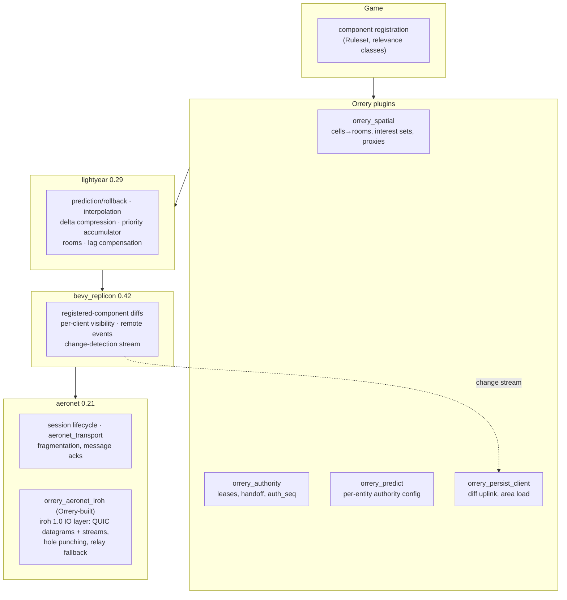

# 03 — Replication & Interest Management

Orrery replicates entity state peer-to-peer over a consolidated ecosystem stack — aeronet IO, bevy_replicon diffing, lightyear prediction and bandwidth management — and adds the pieces none of those crates have: cell-based interest management, bounded per-peer interest sets with low-rate extrapolated proxies, and the uplink that feeds the persistence tier. This document specifies what each layer of the stack contributes, how games classify components for replication, how the 27-cell AOI maps onto replicon visibility and lightyear rooms, the interest-set selection algorithm, delta compression and priority scheduling, the late-join snapshot flow, baseline handling across authority transfers, terrain delta replication, and the bandwidth arithmetic for all three topology regimes.

Normative source: [DECISIONS.md](DECISIONS.md) D4, D8 (bandwidth aspects); touches D5, D6, D9, D11.

## 1. Stack layering

Orrery builds *on top of* the aeronet → bevy_replicon → lightyear stack ([lightyear](https://github.com/cBournhonesque/lightyear) 0.29 runs on [bevy_replicon](https://github.com/simgine/bevy_replicon) 0.42 since 0.27, and on [aeronet](https://github.com/aecsocket/aeronet) 0.21 for IO). Nothing in that stack is reimplemented; Orrery contributes exactly the layers marked below.



| Layer | It provides | Orrery adds on top |
|---|---|---|
| `aeronet` 0.21 | Bevy-native sessions-as-entities, IO abstraction, fragmentation/acks (`aeronet_transport`) | `orrery_aeronet_iroh`: the missing iroh IO layer (no `aeronet_iroh` exists on crates.io as of Aug 2026) — unreliable datagrams for state, reliable streams for control/bulk, on one hole-punched QUIC connection ([02-networking.md](02-networking.md)) |
| `bevy_replicon` 0.42 | Registered-component replication, change-detection diffs, [per-client visibility](https://github.com/simgine/bevy_replicon), remote events, client acks | Cell-derived visibility policy (`orrery_spatial`); the change-detection stream is tapped by `orrery_persist_client` as the persistence uplink source (D11) |
| `lightyear` 0.29 | Prediction + rollback/reapply, snapshot interpolation, delta compression, priority accumulation, [rooms with globally allocated IDs over replicon filter bitsets](https://github.com/cBournhonesque/lightyear/releases), lag compensation, avian integration | Per-entity-authority configuration (`orrery_predict`, since lightyear's authority handling is "in flux" — D4 risk), room lifecycle bound to `CellId`, interest-set selection feeding room membership and per-entity priority |
| — (nobody has these) | — | Interest-set scoring + 1–4 Hz extrapolated proxies, authority leases (`orrery_authority`, [04-authority.md](04-authority.md)), witness log piggybacking ([06-verifiable-core.md](06-verifiable-core.md), [07-witnessing.md](07-witnessing.md)), persistence tier ([08-persistence.md](08-persistence.md)) |

One structural consequence of P2P: **each peer runs the replicon "server" role for the entities it holds authority over** and is a client of every other authority. Visibility and priority are therefore evaluated *per outgoing link on the sender*, for the sender's authored entities only. A field host is just a peer whose authored set is large.

## 2. Component classes and registration API

Every component a game ships falls into exactly one of three replication classes:

| Class | Replicated? | Persisted? | Constraints |
|---|---|---|---|
| **Verifiable-core state** | Yes — quantized identically on writer and reader (D8) | Continuous state via bulk uplink; durable consequences only via witness-attested intents (D9/D11) | Must be written only by the `Ruleset` step function; contributes to hash-chained state claims; tolerance-band comparable (ε_pos = 1 cm, ε_vel = 1 cm/s) |
| **Replicated gameplay state** | Yes — delta-compressed, priority-scheduled | Bulk uplink, ~1–4 Hz per entity (D11) | Ordinary replicon-registered components; no determinism obligations |
| **Cosmetic** | No | No | Ragdolls, particles, audio state, purely-visual transforms; never registered with replicon |

Registration is a builder over replicon's `app.replicate::<C>()` and lightyear's component registration, in `orrery_spatial`/`orrery_predict`. Sketch (signatures indicative, not final):

```rust
// sketch — orrery_spatial
pub enum ReplicationClass { VerifiableCore, Gameplay }

pub enum RelevanceClass { Character, Vehicle, Projectile, Interactive, Ambient }

pub trait OrreryReplicationAppExt {
    /// Register C for replication. Unregistered components are cosmetic by definition.
    fn orrery_replicate<C: Component + Serialize + DeserializeOwned>(
        &mut self,
    ) -> OrreryComponentBuilder<'_, C>;

    /// Debug guard: panics in dev builds if C ever gets replicon-registered.
    fn orrery_assert_cosmetic<C: Component>(&mut self) -> &mut Self;
}

impl<C: Component> OrreryComponentBuilder<'_, C> {
    pub fn class(self, class: ReplicationClass) -> Self;          // default: Gameplay
    pub fn quantize(self, q: impl Quantizer<C>) -> Self;          // mandatory for VerifiableCore
    pub fn delta(self) -> Self where C: Diffable;                 // enable delta encoding
    pub fn base_priority(self, p: f32) -> Self;                   // accumulator input, default 1.0
    pub fn extrapolate(self, e: impl Extrapolator<C>) -> Self;    // include in proxy packets
    pub fn persist(self, p: PersistPolicy) -> Self;               // Bulk { max_hz } | IntentOnly | None
}

// entity-level relevance, set once at spawn:
commands.spawn((PlayerBundle::new(), Relevance(RelevanceClass::Character)));
```

Example:

```rust
// sketch — game side
app.orrery_replicate::<Position>()
    .class(ReplicationClass::VerifiableCore)
    .quantize(PositionQuantizer::centimeters())   // matches ε_pos band, D9
    .delta()
    .base_priority(4.0)
    .extrapolate(LinearExtrapolator::from::<Velocity>())
    .persist(PersistPolicy::Bulk { max_hz: 4.0 });

app.orrery_replicate::<TorchFlicker>().base_priority(0.2); // gameplay, low priority
app.orrery_assert_cosmetic::<RagdollState>();
```

`VerifiableCore` registration additionally wires the component into `orrery_core`'s quantize-at-tick-boundary hooks and the reconciliation-error monitor in `orrery_predict` (the witness signal, D10).

## 3. Mapping the 27-cell AOI onto rooms and visibility

Per D5, a peer's area of interest is its own interest-level cell plus the 3×3×3 neighborhood — **27 cells** of edge **128 m** — the Unreal [Replication Graph grid-spatialization](https://www.unrealengine.com/en-US/tech-blog/replication-graph-overview-and-proper-replication-methods) pattern (Fortnite: 100 players, ~50k replicated actors, per-cell actor lists instead of per-actor distance checks).

Mechanics in `orrery_spatial`:

- **Room identity is the cell.** A lightyear room exists lazily for each *populated* interest-level cell; `RoomId` is derived from `CellId` (`NonZeroU64`, D15) directly (lightyear 0.29 room IDs are globally allocated u64s feeding replicon's filter bitsets, so a stable injective `CellId → RoomId` map is the natural fit). Empty cells have no room and cost nothing.
- **Entities join exactly one room** — their current cell, with the D5 handoff hysteresis (10% of cell edge, so 12.8 m of overlap) preventing room flapping at boundaries.
- **Observers join 27 rooms.** When the observer crosses a cell boundary along one axis, membership swaps one 3×3 face: **9 rooms leave, 9 join**. The same 10% hysteresis margin applies to the observer's subscription cell to prevent subscription churn (elaboration; the ADR defines hysteresis for the entity/authority side).
- **In mesh and interest-mesh regimes there is no global room registry.** Room membership is a pure function of replicated positions, so each sender evaluates it locally per outgoing link: "does entity E's cell fall within subscriber S's 27-cell set?" Replicon's per-client visibility API is driven directly from that predicate. On a field host the same code path uses lightyear rooms as designed, since the host genuinely has many clients.
- **Cell visibility is the coarse filter only.** Interest-set selection (§4) is the fine-grained second stage — the aura-nimbus layering recommended by the [interest-management survey literature](https://dl.acm.org/doi/10.1145/2535417): subscribe by cell, then rank within the union.

## 4. Interest-set selection: 24 high-rate entities + extrapolated proxies

Cell visibility bounds *what you may receive*; the interest set bounds *what you receive at full rate*. This is the [Donnybrook](https://dl.acm.org/doi/10.1145/1402958.1402973) result (SIGCOMM 2008): fast P2P games scale past small meshes only if each peer receives high-frequency updates from a **bounded interest set** and infrequent updates driving locally-simulated proxies ("doppelgängers") for everyone else. Orrery's defaults (D6/D16): high-rate set = **24 entities**, proxies at **1–4 Hz**.

### 4.1 Scoring (receiver-driven, per-peer, 1 Hz)

Each peer re-scores every replicable entity in its 27-cell AOI once per second and requests high-rate delivery for the top 24. Scoring function (Donnybrook's attention components — proximity, aim, interaction recency — weighted by relevance class):

```text
score(e) = W_rel(class(e)) · ( α·g_dist(e) + β·g_interact(e) + γ·g_aim(e) )

g_dist     = 1 / (1 + d(e)/64 m)          # half-weight at half a cell edge
g_interact = exp(−Δt_since_interaction / 10 s)
g_aim      = max(0, cos θ)                 # angle to observer's facing; game-overridable hook
α = 1.0, β = 2.0, γ = 0.5                  # defaults
W_rel: Character 4.0 · Vehicle 3.0 · Projectile 2.0 · Interactive 1.0 · Ambient 0.25
```

Rules layered on the raw ranking:

- **Pinned members** (always in-set, count against the 24): entities in a strong-ownership relation with the local player (mount, grabbed object), and current interaction partners (the entity you are trading with or shooting at must be high-rate — hit validation depends on it, D8).
- **Membership hysteresis:** a challenger evicts an incumbent only if its score exceeds the incumbent's by **15%**, evaluated at the 1 Hz rescore. Prevents set thrash when scores are near-tied.
- The interest set is expressed to each sending authority as a compact subscription bitmap over that authority's entities, sent on the reliable control stream. Senders enforce their own upload budget regardless of requests (§5); a subscription is a request, not a contract.

### 4.2 Proxies

Entities in the AOI but outside the high-rate set replicate as **proxies**: 1–4 Hz updates (rate scaled by score, floor 1 Hz) carrying absolute quantized position, velocity, and the components registered `.extrapolate(...)` — enough for dead-reckoned local simulation between updates. Games may attach a guidance blob (goal position, animation state) per the Donnybrook doppelgänger precedent so proxies steer smoothly instead of teleporting. Proxies are rendered from extrapolation, never interpolation (there is no meaningful interpolation buffer at 1 Hz), and are excluded from the prediction set and hit-rewind window ([05-prediction-rollback.md](05-prediction-rollback.md)).

Promotion proxy→high-rate resets the entity's interpolation buffer (2 send intervals ≈ 100 ms, D8) before display switches from extrapolated to interpolated view.

## 5. Delta compression, priority accumulator, send scheduling

### 5.1 Baselines and deltas

State replication uses lightyear's delta compression in the [Gaffer snapshot-compression lineage](https://gafferongames.com/post/snapshot_compression/): encode each component **relative to the last state the receiver has acknowledged** (the *baseline*), with per-component changed-bits so unchanged state costs ~1 bit. The magnitude of the win is the reason this is non-negotiable at our budgets: Fiedler's 901-cube scene costs **17.37 Mbps** raw at 60 Hz, drops ~5 Mbps from smallest-three orientation quantization alone, and lands around **15 kbps steady-state** (stationary objects) with a **≤256 kbps** target under motion once delta-encoded against acked baselines — three orders of magnitude.

Mechanics per link (sender side, per authored entity):

- Sender keeps a ring buffer of its own past quantized states (send-tick granularity, depth ≥ RTT + jitter, default 32 send ticks = 1.6 s at 20 Hz).
- Receiver acks carry `(entity, tick)` of the newest applied state (piggybacked on replicon's ack stream over datagrams).
- Encoding for entity E on link L = diff(current, state at `last_acked_tick[L][E]`). No acked baseline (new subscriber, expired ring, authority change) → **absolute encoding** (full quantized snapshot for that entity), flagged in the header.
- Quantization happens *before* diffing and identically on both sides (D8), so baseline states are bit-identical by construction.

### 5.2 Priority accumulator

Per link, per entity, in the [Gaffer state-synchronization pattern](https://gafferongames.com/post/state_synchronization/): every send tick, `acc[L][E] += effective_priority(E, L) · dt`. Entities are sorted by accumulator, packed greedily into the link's byte budget for this send tick, and packed entities reset their accumulator to zero. High-priority entities send every tick; low-priority entities accumulate until they win a slot — every entity sends *eventually* as long as the budget exceeds the sum of floor rates (§9.3).

**Priority composition.** Effective priority is a product of independent factors:

```text
effective_priority(E, L) =
    base_priority(components of E)          # registration, §2
  × W_rel(class(E))                          # relevance class
  × ring(E, L)                               # Chebyshev cell distance to subscriber:
                                             #   own cell 1.0 · adjacent ring 0.4
  × set_factor(E, L)                          # in L's high-rate set: 1.0
                                             # proxy: scaled so achieved rate ∈ 1–4 Hz
  × boost(E)                                  # transient: ×8 for ~500 ms after spawn,
                                             # teleport, authority change, or large state jump
```

### 5.3 Send scheduling

- **Send rate: 20 Hz default, up to 30 Hz for small islands** (D8) against the 60 Hz sim tick — i.e. every 3rd (resp. 2nd) tick. Send ticks are the only baseline-eligible ticks.
- Per-link byte budget = peer upload budget (**≤1 Mbps** sustained, D6) divided across active links by link class: interest-set links weighted above proxy-only links. Field hosts use datacenter budgets (hot-cell egress ≤ 35 Mbps at the 128-player ceiling, D6).
- Datagrams are coalesced per link per send tick (one or two QUIC datagrams; no head-of-line blocking against control streams, D3). Witness log records (`LogFrame`s, plus 2 Hz `StateClaim`s, D9) ride in the same datagrams at low priority — but **only on links to cell-epoch witness-set members** (≤ 7 links; in the promoted regime, to the field host only), never the whole interest set. They are small (sparse input records + truncated rolling heads) and share the accumulator; a witness that detects a chain gap from the rolling heads repairs it with `LogRangeRequest`/`Response` over the reliable control stream. Wire shapes and streaming rules are canonical in [06-verifiable-core.md](06-verifiable-core.md); this document agrees with it.
- The persistence uplink is a separate consumer: `orrery_persist_client` schedules replicon change-detection diffs to the gateway at ~1–4 Hz per entity with its own accumulator instance over the same code path (D11). Uplinked diffs are keyed by the entity's **`PersistId`** — a replicated component, written only by the entity's owner and maintained by `orrery_persist_client`, that is the canonical Bevy `Entity` ↔ `PersistId` mapping on every peer ([08-persistence.md](08-persistence.md)).

### 5.4 Terrain replication

Terrain edits do not ride the datagram path. The **editing peer broadcasts each `TerrainDelta` on the reliable per-cell stream, ordered by `(cell, tick)`** (D11): edits are rare relative to movement, must never be lost, and must apply in one consistent order on every replica. Every delta is **attributed to and fenced by the editing player's own `PLAYER_BOUND` lease** and invariant-checked at the cell actor (reach, rate, tool — [08-persistence.md](08-persistence.md)); destructive or high-value edits route through the intent path instead. Live peers apply received deltas directly to their local chunk copies; **late joiners never replay delta history** — they fetch compacted chunk snapshot rows from the gateway (§6) and pick up the live per-cell delta stream from there.

## 6. Late join / area entry

Two sources serve a joining client, split by liveness (D11): **the gateway serves cold state** (parked entities, terrain, anything without a live authority) from FDB range scans plus live cell-actor deltas; **authorities serve live entities** via absolute-encoded init replication. The gateway's copy of live entities is up to one bulk-uplink interval stale, so it is presentation-grade only; the authority's init snapshot supersedes it on arrival, keyed by `auth_seq`.

```mermaid
sequenceDiagram
    participant C as Joining client
    participant K as Coordinator
    participant G as Gateway (persistd)
    participant A as Authority peers / field host

    C->>K: join(area) — island lookup
    K-->>C: island manifest: peer NodeIds, field host?, witness epoch
    par cold state
        C->>G: subscribe(27-cell AOI)
        G-->>C: nearest-first range-scan pages (< 50 ms to first page-in)
        Note over C,G: parked entities + terrain chunks + stale copies of live entities
    and live state
        C->>A: iroh connect (hole punch / relay), interest subscription
        A-->>C: init replication: absolute snapshots of authored entities in C's AOI
        Note over C,A: absolute snapshot = first baseline; auth_seq supersedes gateway copy
        A-->>C: delta stream (20 Hz high-rate + 1–4 Hz proxies)
    end
    C->>C: prediction enabled once own-player lease confirmed (04-authority.md)
```

Ordering rules: the client renders gateway pages immediately (fast perceived load, **< 50 ms to first page-in**, D11); each live entity switches from gateway copy to authority stream atomically on first init snapshot — the two are matched via the replicated `PersistId` component (§5.3), which is the same id the gateway page was keyed by; entities the gateway marked *parked* never get an authority stream unless a peer acquires a lease (orphan pickup, D7). Area *exit* is the reverse: leaving the 27-cell set drops room membership, the sender stops scheduling the entity, and the receiver despawns or freezes its replica after a grace timeout (default 2 s).

## 7. Replication across authority transfer

Baselines are per-link state *held by the sender*; they do not survive an authority transfer (D7). When authority over entity E moves from A to B:

1. B bumps `auth_seq` (already required by D7) and starts every link for E with **no baseline** → its first send to each subscriber is absolute-encoded, with the transient priority boost (§5.2) so the reset propagates within ~1–2 send intervals.
2. Receivers treat any `auth_seq` increase as a mandatory baseline invalidation: acks for E restart against B's stream; stale in-flight deltas from A (lower `auth_seq`) are discarded on arrival.
3. In a *cooperative* handoff the divestiture message carries A's current quantized state for E, so B's first absolute snapshot is byte-identical to what receivers already display — a transfer with zero visual pop. In a *crash* handoff (lease expiry) B starts from its own replica or from the cell actor's hot state, and receivers may observe a small snap bounded by the staleness window.
4. Receivers whose prediction set included E roll back to the last state acked *to the new authority's stream* on first divergence, within the normal 9-tick window (D8).

Mass transfers (field-host promotion of a >32-population cell, D6) are the stress case: every entity in the cell resets baselines toward every subscriber at once. The field host staggers init snapshots across ~1 s using the accumulator (spawn boost disabled, ring/relevance factors intact) rather than bursting, accepting up to one second of slightly stale far entities in exchange for never exceeding link budgets.

## 8. Bandwidth budgets by topology regime

Modeling assumptions (these are estimates, not ADR parameters): average delta-encoded high-rate update ≈ **25 B**/entity (quantized position delta + smallest-three orientation delta + changed-mask + varint entity id — the compact link-local replication id; the persistent identity rides once as the replicated `PersistId` component, §5.3); proxy update ≈ **40 B** (absolute position, velocity, guidance); per-datagram overhead ≈ **60 B** (IP+UDP 28 B + QUIC short header/AEAD ≈ 32 B), one coalesced datagram per link per send tick. ADR-fixed inputs: 20 Hz send, 24-entity high-rate set, 1–4 Hz proxies (2 Hz assumed), ≤1 Mbps peer upload.

### Mesh (n ≤ 8, full mesh)

Assume each peer authors ~6 changing entities (player + held/contested objects), all peers mutually interested (interest set never binds at this scale).

| Flow | Arithmetic | Result |
|---|---|---|
| Upload per peer | 7 links × 20 Hz × (6×25 B + 60 B) | ≈ 235 kbps |
| Receive per peer | 7 senders × 20 Hz × (6×25 B + 60 B) | ≈ 235 kbps |
| Witness log stream (upload) | ≤ 7 witness links × 20–30 kbps (1–2 authored core entities, [06-verifiable-core.md](06-verifiable-core.md)) | ≈ 0.15–0.2 Mbps |
| Headroom vs 1 Mbps | — | ~2× |

### Interest mesh (9–32, partial mesh)

n = 32 players, ~100 additional replicable world entities in a typical AOI. Connections exist only to interest-relevant peers (D6).

| Flow | Arithmetic | Result |
|---|---|---|
| Receive: high-rate payload | 24 × 20 Hz × 25 B | 96 kbps |
| Receive: proxies | ~100 × 2 Hz × 40 B | 64 kbps |
| Receive: datagram overhead | ~10 high-rate links × 20 Hz × 60 B + proxy links at 2 Hz | ≈ 100–140 kbps |
| **Receive total** | | **≈ 260–300 kbps** — consistent with Donnybrook's ~12·n kb/s ⇒ 384 kbps at n = 32 (D6) |
| Upload, typical | own player high-rate to ~10 subscribers + proxies to rest | ≈ 150 kbps |
| Upload, worst case (everyone's focus) | 31 links × 20 Hz × (25 B + 60 B) | ≈ 420 kbps |
| Witness log stream (upload) | ≤ 7 witness links × 20–30 kbps typical (1–2 authored core entities); worst case 8 core entities ≈ 60 kbps/link | ≈ 0.15–0.2 Mbps typical, ≈ 0.4 Mbps worst |

The worst-case upload row is the empirical mesh ceiling: at n = 64 it would be ≈ 870 kbps for a *single* authored entity — the reason promotion triggers at **>32 sustained** (D6) rather than at a bandwidth alarm.

### Promoted (>32, field host)

n = 64 in the hot cell, scaled to the 128-player ceiling; the field host holds cell-entity authority; peers keep authority over their own players (D6).

| Flow | Arithmetic | Result |
|---|---|---|
| Peer upload | 1 link × 20 Hz × (2×25 B + 60 B) + intents ≈ 10 kbps | ≈ 28 kbps |
| Witness log stream (upload) | logs go to the **field host only** in this regime: 1 link × 20–30 kbps (1–2 authored core entities) | ≈ 20–30 kbps per peer |
| Peer receive | 96 kbps (24 high-rate) + ~150 proxies × 2 Hz × 40 B = 96 kbps + 20 Hz × 60 B | ≈ 200 kbps |
| Field host receive | 64 peers × 28 kbps + 64 log streams × 20–30 kbps | ≈ 1.8 Mbps + ≈ 1.3–1.9 Mbps logs |
| Field host send (n = 64) | 64 peers × 200 kbps | ≈ 12.8 Mbps |
| Field host send (n = 128 ceiling) | 128 peers × 200 kbps, plus proxy-set growth | ≈ 25.6+ Mbps — inside the ≤ 35 Mbps hot-cell egress budget (D6) |

Witness-stream compute is as bounded as its bandwidth: a sender produces **one `LogFrame` signature per send per link** — 20 Hz × ≤ 7 links = ≤ 140 signatures/s, ~2–3 ms/s of CPU — and a witness verifies 20 frames/s per watched authority ([06-verifiable-core.md](06-verifiable-core.md)).

## 9. Failure modes

### 9.1 Baseline loss

Sender's state ring no longer contains the receiver's acked tick (long RTT spike, receiver stalled >1.6 s), or the acked tick predates an `auth_seq` bump. Response: absolute-encode that entity on its next scheduled send. Cost is bounded per packet — the scheduler caps absolute-encoded entities per datagram (default 8) and lets the accumulator spread the rest over subsequent ticks, so a receiver waking from a long stall re-syncs over a few hundred ms instead of receiving one giant burst.

### 9.2 Ack starvation

Asymmetric loss: forward path fine, ack path lossy — baselines age, deltas grow toward absolute size, compression silently degrades. Detection: per-link `baseline_age` gauge; when the newest acked baseline is older than **500 ms** (10 send intervals), the link enters keyframe mode — periodic absolute snapshots for its entities at reduced rate — and `orrery_net` telemetry flags the link (often a symptom of relay-path congestion, [02-networking.md](02-networking.md)). QUIC datagrams are never retransmitted, so acks must be duplicated cheaply: each replication datagram carries the receiver's cumulative ack state redundantly (3× repeat), making total ack loss require sustained loss in one direction.

### 9.3 Priority starvation of far entities

The accumulator guarantees eventual transmission only if the link budget exceeds the sum of minimum rates. Oversubscription (large crowd, many authored entities, 1 Mbps cap) would otherwise let ring-1/Ambient entities starve indefinitely. Mitigation: high-rate spend is capped at **80%** of each link's budget; the residual 20% is reserved for the proxy floor (1 Hz minimum per AOI entity). If even the floor is unaffordable, the sender sheds load by relevance class from the bottom (Ambient first) and reports oversubscription to the coordinator — sustained oversubscription across an island's links is a promotion signal alongside raw population.

### 9.4 Replicon room-count and visibility-set limits

Room IDs feed per-client filter bitsets in replicon; the practical limits are (a) total live rooms per replicon instance and (b) visibility-set update cost on membership churn. Bounds by design: rooms exist only for *populated* cells (a 32-player island touches at most a few dozen); observers hold exactly 27; a cell crossing swaps 9 — amortized trivially at walking speeds and hysteresis-damped at boundary-camping speeds. `orrery_spatial` garbage-collects rooms when a cell's population reaches zero (grace 30 s) and recycles the `CellId→RoomId` slot. The pathological case is a fast traveler (cell crossing every few hundred ms): room churn is then rate-limited by switching the traveler to gateway-served streaming until velocity drops below one cell edge per second (cross-reference: fast-traveler consistency is an open question, D17.6).

### 9.5 Interest-set flapping and proxy pop

Two near-tied entities alternating in and out of the 24-slot set would each suffer repeated interpolation-buffer resets and baseline churn. The 15% eviction margin (§4.1) plus the 1 Hz rescore cadence bound flap frequency; on demotion the entity's proxy stream starts at 4 Hz and decays to its scored rate over 5 s, so a briefly-demoted entity re-promotes without visible pop.

### 9.6 Promotion/demotion baseline storm

Covered in §7: staggered init over ~1 s under the accumulator. Demotion (field host drains below threshold with hysteresis, D6) is gentler: leases transfer incrementally to interacting peers ([04-authority.md](04-authority.md)), so baselines reset entity-by-entity, not cell-at-once.
