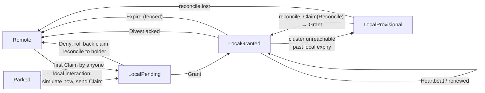
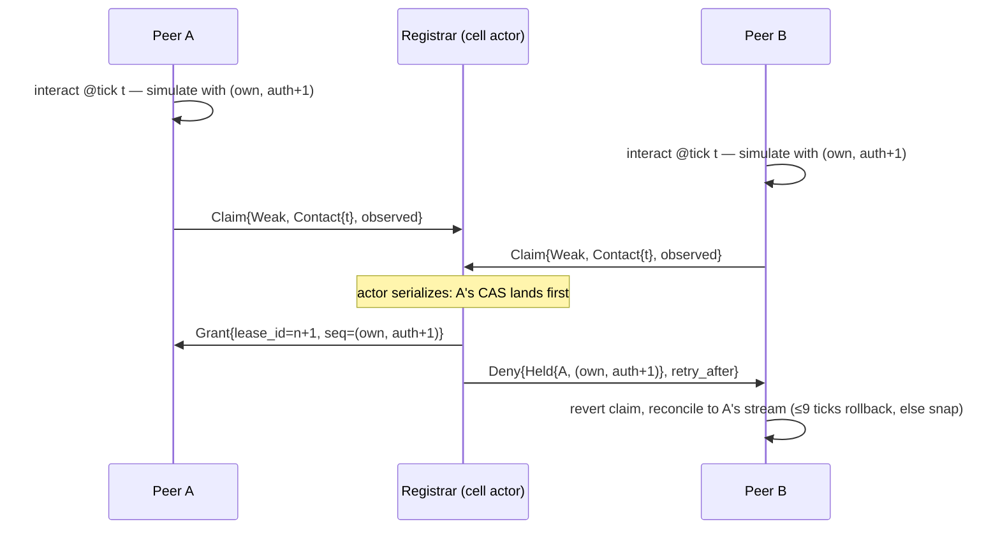
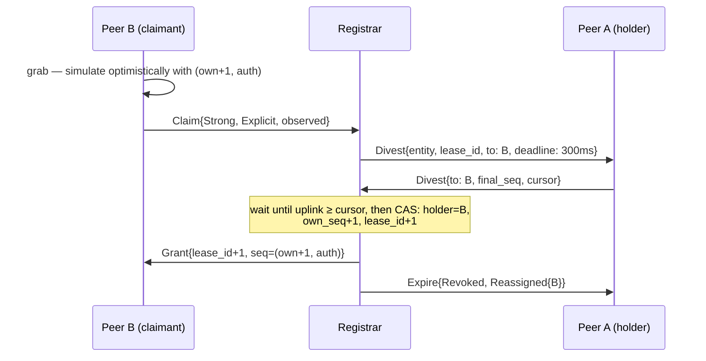

# Authority & Leases

Every replicated entity in Orrery has exactly one writer at any instant. This document specifies how that writer is chosen, proven, transferred, and recovered: the two-tier claim model (weak authority by interaction, strong ownership by explicit act) with its sequence-number invariants; the lease registrar inside the persistence cluster that arbitrates claims for persistent entities via compare-and-swap; the full message-level lease protocol (`Claim`, `Grant`, `Deny`, `Divest`, `Heartbeat`, `Expire`) with flows for cooperative handoff, contested claims, crash orphaning, and cluster-unreachable degraded operation; contact-island propagation for physics; ephemeral, parked, and active (NPC-hosted) entities; and the interactions with field-host promotion and cross-cell movement. The protocol lives in `orrery_protocol`, the client logic in `orrery_authority`, and the registrar in `orrery_persistd`.

Normative source: [DECISIONS.md](DECISIONS.md) §D7 (boundaries with §D5, §D6, §D8, §D11, §D12).

## 1. The two-tier model

Orrery follows [Gaffer's Networked Physics in VR](https://gafferongames.com/post/networked_physics_in_virtual_reality/) authority scheme, generalized by the ownership-management services of [HLA (IEEE 1516)](https://en.wikipedia.org/wiki/High_Level_Architecture):

- **Weak authority** is acquired *implicitly by interaction*: colliding with an object, damaging it, attempting a proximity pickup. It propagates recursively through physics contact islands (§5). It is freely stealable — a later interaction takes it. Guarded by the monotonic `auth_seq`.
- **Strong ownership** is acquired *explicitly*: grab, mount, place-in-inventory, and — permanently — a player's own character. It is not stealable; it transfers only with the holder's consent or on holder death. Guarded by the monotonic `own_seq`.

Gaffer's system ran four-player shared physics on non-deterministic PhysX under 1 Mbps with exactly this pair of per-object sequence numbers and a host confirming transitions; Orrery replaces the host with the cluster's lease registrar (§2). HLA supplies the transfer vocabulary we reuse: **negotiated divestiture** (owner approves via callback) for cooperative handoff and **unconditional divestiture** for crash/forced release. The single-writer rule itself is [Photon Fusion's](https://doc.photonengine.com/fusion/current/manual/shared-mode-master-client) — exactly one State Authority per object, always — and orphan redistribution follows [Unity NGO distributed authority](https://docs.unity3d.com/Packages/com.unity.netcode.gameobjects@2.11/manual/terms-concepts/distributed-authority.html) (on peer leave, ownership plus last-known state transfer to a remaining client).

### Invariants

Every replication envelope for an entity carries its `(own_seq, auth_seq)` pair; the registrar stores the authoritative pair per persistent entity.

- **INV-1 — single writer.** At most one node writes an entity's replicated state at any instant. For persistent entities the registrar lease is ground truth, and the persistence gateway *enforces* it: bulk-diff uplinks for an entity are rejected unless they bear the current `lease_id` (a fencing token, §2).
- **INV-2 — monotonicity.** `own_seq` and `auth_seq` never decrease. Every granted acquisition increments exactly one of them by one over the registrar-stored value; the `Grant` carries the authoritative pair.
- **INV-3 — ownership dominance.** Comparison key is the pair `(own_seq, auth_seq)`, lexicographic: any increase in `own_seq` beats any `auth_seq`. Weak claims never touch `own_seq`.
- **INV-4 — higher-seq-wins convergence.** A peer applies received state for an entity only if its pair is ≥ the highest pair seen; on equality, the current holder's stream wins. This is what lets optimistic claimants replicate before the registrar answers, and what makes a stale ex-holder yield without a round trip.
- **INV-5 — no stealing.** A strong-owned entity's lease moves only by holder-acked divestiture or holder expiry. The registrar denies non-consensual strong claims.

```rust
// orrery_protocol (sketch)
pub struct SeqPair { pub own_seq: u32, pub auth_seq: u32 }   // lexicographic Ord

impl SeqPair {
    /// INV-3/INV-4: does `incoming` supersede `known`?
    pub fn supersedes(incoming: SeqPair, known: SeqPair) -> bool { incoming > known }
}
```

## 2. The lease registrar

The registrar is a facet of `orrery_persistd`, not a separate service. A lease row is owned by the **cell actor** that owns the entity's storage cell — the actor's single-writer event loop *is* the CAS serializer, so "compare-and-swap" is a plain compare-then-write inside the actor, with no cross-node coordination in the common case.

**Lease row** (hot tier, checkpointed to FDB at `lease/{entity_id}` per §D11):

| Field | Type | Notes |
|---|---|---|
| `entity` | `PersistId` | cluster-minted, universe-stable u64 |
| `holder` | `Option<NodeId>` | `None` = parked/free |
| `seq` | `SeqPair` | authoritative `(own_seq, auth_seq)` |
| `lease_id` | `u64` | monotonic per entity — the fencing token |
| `expires_at` | `u64` ms | registrar-monotonic clock only |
| `flags` | bitset | `PLAYER_BOUND`, `STRONG_HELD`, `PROVISIONAL`, `PARKED` |
| `group` | `Option<Vec<PersistId>>` | attached children (lease group, §11.3) |

**Semantics:**

- **Acquire** = CAS on `(holder, seq, lease_id)`: the actor checks eligibility (INV-5, plausibility gate §10, expiry), bumps the relevant sequence, increments `lease_id`, sets `expires_at = now + TTL`, and emits `Grant`. Losing concurrent claimants get `Deny`. TTL is **10 s**, heartbeat every **2.5 s** (four missed heartbeats = expiry).
- **Durability**: acquire/transfer/park/expire write through to FDB; heartbeats renew only the in-memory row. On actor failover, leases are rebuilt from FDB with a *full fresh TTL* — conservative in the safe direction (an extra ≤10 s of orphan latency, never two writers).
- **Fencing**: the gateway tags each uplink session with the `lease_id`s the peer holds; a diff carrying a stale `lease_id` is dropped and answered with the current `Expire`. This closes the classic zombie-holder race without trusting peer clocks.
- **Clock discipline**: only the registrar's monotonic clock decides expiry. Holders track a conservative local estimate (`expires_at − one heartbeat interval`) and mark their lease *uncertain* past it (§11.1).

Ordinary claim round-trips ride the reliable control stream of the peer's existing iroh connection to the gateway (§D3 channel policy) and land on an in-memory actor; target p99 grant latency in-region is **< 5 ms** (design target, same path class as the < 2 ms bulk ack) — comfortably inside the 9-tick/150 ms rollback window, which is what makes optimistic claiming safe (§4).

### PersistId minting

Lease rows are keyed by `PersistId` — the cluster-minted, universe-stable u64 identity of a persistent entity — so an entity must *have* one before the registrar can arbitrate it. Two minting paths (§D11):

- **Intent receipts.** Entities created by a critical operation (structure placement, crafting output, loot grant) get their `PersistId`s minted by the cluster inside the intent's FDB transaction; the commit receipt carries them back to the initiating peer. This is the strongly-consistent path — the id exists iff the entity durably exists.
- **Block grants.** For peer-spawned bulk-class entities (dropped items, placed physics props), each session is leased a **journaled block grant** — a contiguous `PersistId` range (default **4096 ids**) recorded in the journal at grant time. The peer allocates locally from its block with no round trip, which also covers offline play and the §4.4 degraded mode: ids minted from a granted block during a netsplit are already unique by construction and reconcile cleanly on heal. Exhaustion mid-session leases the next block.

Client-side, `orrery_persist_client` maintains a replicated **`PersistId` component** — written only by the entity's authority, replicated like any registered component — that maps Bevy `Entity` (session-local) ↔ `PersistId` (universe-stable). Claims, uplink diffs, and intents all address entities by `PersistId`; the component is how every peer in the interest set resolves the same durable identity for the same replicated entity.

## 3. Wire protocol

Six messages, defined in `orrery_protocol`, postcard-encoded on the reliable control stream:

| Message | Direction | Fields (sketch) |
|---|---|---|
| `Claim` | peer → registrar | `entity`, `kind: Weak\|Strong`, `basis: Contact{tick} \| Explicit \| Orphan \| Promotion{warrant} \| Reconcile{log_ref}`, `observed: SeqPair`, `tick` |
| `Grant` | registrar → peer | `entity`, `lease_id`, `seq: SeqPair` (authoritative), `ttl_ms: 10_000`, `prev_holder` |
| `Deny` | registrar → peer | `entity`, `reason: Held{holder, seq} \| StrongHeld \| NotEligible \| RateLimited \| Parked`, `retry_after_ms` |
| `Divest` | both | registrar → holder: request `{entity, lease_id, to: Option<NodeId>, deadline_ms}`; holder → registrar: consent/offer `{entity, lease_id, to: Option<NodeId>, final_seq, cursor: JournalCursor}`. `to: None` = release/park. |
| `Heartbeat` | both | peer → registrar: `{lease_ids: Vec<u64>, tick}` (one batch per peer per 2.5 s covering all held leases); registrar → peer echo: `{renewed_until}` |
| `Expire` | registrar → holder + cell subscribers | `{entity, lease_id, last_holder, reason: Timeout\|Disconnect\|Revoked\|Parked, disposition: Reassigned{to}\|Parked\|Free}` |

`Divest.cursor` names the holder's last acked journal position so the registrar can require the state to be uplink-complete before regranting — the successor starts from exactly the state the predecessor last committed.

### Client-side state machine (`orrery_authority`)



`LocalPending` and `LocalProvisional` both simulate and replicate (stamped with the optimistic/provisional pair, accepted by peers under INV-4); only `LocalGranted` uplinks bulk diffs to the gateway (INV-1 fencing).

## 4. Protocol flows

### 4.1 Optimistic claim and contested simultaneous claims

Peers claim optimistically — simulate immediately, roll the *claim* back only if the CAS loses (Gaffer's host-confirm pattern). Below, A and B both shoot the same unheld crate on the same tick:



Both peers predicted with the *same* pair; INV-4's equal-pair rule is resolved by the registrar's serialization, and the loser's misprediction is absorbed by the normal §D8 rollback machinery — during the few in-flight milliseconds, other observers may briefly apply the loser's stream, which the winner's granted stream then supersedes.

### 4.2 Cooperative handoff — negotiated divestiture

B explicitly grabs an object A currently holds (HLA negotiated divestiture; the current holder acks):



Deadline behavior (design defaults): if A holds only *weak* authority, a missed 300 ms deadline converts to unconditional divestiture — the grant proceeds (interactions must not stall on an unresponsive peer). If A holds *strong* ownership, a missed deadline yields `Deny{StrongHeld}` to B (INV-5): stealing by timeout is exactly what "not stealable" forbids; only lease expiry (crash) breaks strong ownership. Game-level "ask to trade" UX happens above this protocol.

### 4.3 Crash orphaning and redistribution

```mermaid
sequenceDiagram
    participant A as Peer A (crashed)
    participant Reg as Registrar
    participant B as Peer B (nearest interactor)
    Note over A: crash — heartbeats stop
    alt gateway sees A's connection drop
        Note over Reg: unconditional divestiture immediately
    else silent (path failure)
        Note over Reg: TTL lapse: 10 s after last heartbeat
    end
    Reg->>Reg: mark orphan; pick candidate:<br/>1. peer with recent contact (weak-auth telemetry)<br/>2. nearest cell-subscribed peer<br/>3. none → park
    Reg->>B: Grant{unsolicited, seq=(own, auth+1)}
    Reg-->>B: Expire{A, Timeout, Reassigned{B}} (also to cell subscribers)
    B->>B: adopt from last committed state (may decline: Divest{to: None})
    Note over Reg: no candidate → row flagged PARKED,<br/>state served from hot tier
```

Redistribution is NGO-style: the successor inherits last-known committed state, not the crashed peer's unreplicated tail (bounded by the ≈1–4 Hz uplink cadence plus journal durability — see [08-persistence.md](08-persistence.md)). A strong-owned entity whose owner crashed re-parks with `own_seq` intact rather than being regranted, unless it is `PLAYER_BOUND` (the character parks and is exclusively reclaimable by the returning account).

The `alt` branch above is also how **field-host loss** resolves (§8): a field host is just a holder with many leases, and the gateway observing its connection drop triggers the **fast path** — immediate unconditional divestiture of every lease it held, while the coordinator re-promotes from the warm pool — **< 10 s player-facing** (the figure [02-networking.md](02-networking.md) and [09-services-and-ops.md](09-services-and-ops.md) reference). Only a *zombie* host — connection alive, heartbeats silent — falls to the **slow path** of lease-TTL expiry, **< 30 s worst case**.

### 4.4 Cluster unreachable — degraded mode

Per §D12, no cluster = degraded, not dead: P2P simulation continues, intents queue, durable commits pause.

```mermaid
sequenceDiagram
    participant A as Peer A
    participant I as Island peers
    participant Reg as Registrar (unreachable)
    Note over A,I: gateway connections drop — degraded mode
    A->>I: Claim broadcast on island control channel (provisional)
    Note over I: deterministic arbitration, no registrar:<br/>total order (SeqPair, claim_tick), tiebreak by lowest<br/>blake3(entity ‖ claim_tick ‖ NodeId ‖ manifest epoch) —<br/>all peers converge on the same winner
    A->>A: LocalProvisional — simulate + replicate,<br/>no uplink, transitions recorded in signed input log (D9)
    Note over A,Reg: cluster returns
    A->>Reg: Claim{Reconcile{log_ref}} per provisionally-held entity
    Reg->>Reg: replay claims in log order; cross-check leases,<br/>seq pairs, witness evidence
    Reg->>A: Grant (normal case: de-facto holder confirmed, seq bumped)
    Note over A: losing provisional holders reconcile to winner's<br/>stream; queued intents validate on commit as usual
```

In-island arbitration uses the same comparison key as the registrar plus a deterministic tiebreak: on identical `(SeqPair, claim_tick)`, the winner is the claimant with the lowest `blake3(entity || claim_tick || NodeId || island_manifest_epoch)` (the manifest epoch is the coordinator-stamped value from the island's current manifest, [02-networking.md](02-networking.md)), so every honest peer converges without communication beyond the claim broadcast. Raw lowest-`NodeId` is deliberately *not* the tiebreak: NodeIds are self-generated keypairs, so an attacker could grind a low-sorting NodeId offline and win every degraded-mode contest; hashing in the entity, tick, and epoch makes the winner unpredictable before the contest exists. Because durable writes were paused, divergence damage is bounded to bulk state; a losing provisional holder's edits are superseded by the winner's granted stream, and queued intents referencing a lease the registrar refuses simply fail validation. Split-brain across two islands that merge later resolves identically — the registrar is the single arbiter, seq pairs plus the signed logs (see [06-verifiable-core.md](06-verifiable-core.md)) are the evidence. The residual stands regardless of tiebreak: every degraded-mode outcome is **provisional** and is reconciled by the registrar on heal — in-island arbitration only minimizes divergence while the arbiter is away.

## 5. Contact-island weak authority (physics)

For contested physics per §D13: when a body under peer P's authority contacts a body with no fresher authority, P claims the touched body (`auth_seq + 1`), and the claim propagates recursively through the contact graph — push a crate into a pile and the whole pile follows you (Gaffer's recursive interaction rule). Mechanics:

- Propagated claims are **batched** into one `Claim` burst per tick, capped at **64 entities per batch** (design default; excess defers to next tick in contact-order). All are optimistic; each entity resolves independently under INV-4.
- Two players pushing one pile from both ends resolves per entity — the pile partitions along the contact frontier by whoever's interaction sequence lands first, which is Gaffer's observed behavior and is acceptable for cosmetic-tier physics.
- **Quantize both sides** (§D8): the writer quantizes replicated physics state *before* integrating each step, readers apply the same quantization, so both sides idle at bit-identical resting states. Without this, resting jitter re-dirties bodies, keeps contact islands "live," and generates a permanent trickle of claim churn and delta traffic.
- Weak authority naturally decays: when a body sleeps and its holder leaves the neighborhood, the holder divests (`Divest{to: None}` on cell-exit) and the entity parks.

## 6. Ephemeral entities

Projectiles, VFX, debris, and other non-persistent spawns never touch the registrar. Authority is the spawner's, in-island, by construction (Fusion's spawner-gets-initial-authority rule); IDs come from an island-scoped namespace; transfer, if ever needed, is an in-island claim under the same seq-pair comparison with no `Grant` round-trip. If an ephemeral entity causes a durable consequence (a rocket destroys a placed structure), the *consequence* travels the witness-attested intent path (§D11) — the projectile itself is never persisted.

## 7. Parked entities

A parked entity has **no live authority anywhere**: `holder = None`, `PARKED` flag set, state served read-only from the hot tier / FDB. Entering players receive parked state in the normal area-load stream and simply render it; the first `Claim` (usually a `Contact` when someone bumps it) unparks it through the ordinary CAS path. Optional **lazy catch-up** on load — advancing a parked cell's `Ruleset`-relevant state through elapsed time (crops grow, furnaces smelt) — is executed cluster-side by `orrery_field_host` in its parked-cell catch-up role before the state is served; semantics (lazy vs. scheduled) are an open question tracked in §D17.6 and detailed in [08-persistence.md](08-persistence.md).

### 7.1 Active entities — NPC hosting in unpromoted islands

Not everything should wait to be bumped: the `Ruleset` can flag entity classes as **active** — NPCs, wandering creatures, anything that must be *simulated* whenever its cell is live, not merely rendered from the hot tier. In a promoted cell the field host holds them as a matter of course (§8); in an unpromoted island somebody's machine has to, and the registrar assigns that somebody instead of waiting for a `Contact` claim:

- **On area load or unpark** of a `Ruleset`-flagged active entity, the registrar grants **weak authority** unsolicited (the §4.3 mechanism) to a deterministic candidate: the **nearest cell-subscribed peer with headroom**, chosen by the same candidate scoring as orphan pickup (recent-contact telemetry first, then proximity).
- **Per-peer load caps, split by class** — the cap is not one number, because the two classes cost different things (see below): default **16 core-class** active entities and **256 bulk-class** active entities per peer. A peer at either cap is skipped by the scorer for that class and the grant falls to the next candidate.
- **Decline** uses the ordinary `Divest{to: None}`: the registrar moves down the candidate list; when no eligible candidate remains, the entity stays parked (rendered, not simulated) until the population changes.
- The grant is plain weak authority: gameplay interaction steals it normally (INV-4), and it decays like any weak claim — sleep + cell-exit divests, and expiry/redistribution follow §4.3.

**Why the cap splits.** The scarce resource is not "entities" but the per-entity machinery only *core-class* entities carry: every core entity a peer authors rides that peer's signed, hash-chained input log streamed to the ≤7-link witness set (§D9) — the priced worst case is 8 authored core entities at ~60 kb/s per witness link (~0.4 Mb/s against the ≤ 1 Mbps upload budget, [06-verifiable-core.md](06-verifiable-core.md) §10) — plus a share of the ≈1 ms predicted-subset step that bounds rollback cost (§D8). Bulk-class active entities carry none of that: no log records, no state claims, just ordinary 1–4 Hz bulk uplinks (~25 B deltas — 200 NPCs at 1 Hz ≈ 20 kbps), so their cap is set by client CPU and uplink scheduling, not by the witness budget. A single 64-entity cap conflates the two and starves exactly the wrong case: a dense but value-free crowd (ship crew, ambient wildlife) is capped by a budget it never touches.

An active entity hosted this way is simulated on an untrusted machine: bulk-class state is invariant-checked and witnessed like any peer-authored state — not adjudicable core unless the `Ruleset` classifies it so. The classification is the trust boundary and the cost boundary at once: **crew that decorates and does chores is bulk-class and plentiful; crew that can be robbed, bribed, or murdered for loot is core-class, few per cell** — and when a location needs many *trusted* NPCs (bosses with loot tables, vendors, quest-critical actors), the supported answer is not to raise the core cap on player machines but to **lower the promotion threshold for those cell classes**, so a field host (§8) takes authority there even below the default > 32 population.

## 8. Field-host promotion interplay

When the coordinator promotes a cell (> 32 sustained, §D6), the field host must become authority for the cell's entities without touching players:

1. `orrery_coordinator` issues a **promotion warrant** — `{cell_ids, host: NodeId, epoch, expiry, signature}` (design elaboration) — to the field host and the registrar.
2. The host sends batched `Claim{basis: Promotion{warrant}}` for the cell's non-player entities. Warrant-bearing claims bypass the plausibility gate and rate limits (§10) and carry infrastructure priority: current weak holders get `Divest` requests with the 300 ms deadline, then unconditional divestiture.
3. **Players keep strong ownership of their own characters** — `PLAYER_BOUND` leases are never claimed by the host; the host *validates* player state as any authority-peer would (§D6, §D8), and durable consequences still ride the intent path.
4. Demotion reverses it: the host divests each entity to the nearest interacting peer (crash-redistribution candidate logic, but negotiated) or parks it, then the coordinator retires the warrant.

To clients the host is just another peer with a lot of leases — no special-case client code, which is the point of "the field host is infrastructure, never a player's machine."

## 9. Cross-cell movement, hysteresis, and re-keying

Leases are **entity-keyed, not cell-keyed**: an entity crossing a cell boundary keeps its holder and its `lease_id`. What moves is registrar-internal bookkeeping:

- **Hysteresis** (§D5): the entity's cell assignment flips only after it exits the overlap zone — **10 % of the cell edge** (12.8 m at the default 128 m edge) — so an entity dribbled along a boundary does not thrash leases, storage, or interest sets (the SpatialOS lesson).
- On the *committed* cell change, the storage row re-keys `world/{old_cell}/{entity}` → `world/{new_cell}/{entity}` in one journal record (one FDB transaction at checkpoint), and the lease row migrates between cell actors as part of the same handoff — invisible on the wire; `lease_id` and `seq` are preserved. The same applies when the committed change is a *frame migration* between nested grids ([01-spatial-model.md](01-spatial-model.md) §13.3): the row re-keys from the source grid's keyspace to the destination's, and the lease — entity-keyed, not cell- or grid-keyed — is untouched.
- If the destination cell belongs to another island, the coordinator's island merge/handoff governs (see [02-networking.md](02-networking.md)); if the destination is *promoted*, the entity's holder receives a `Divest{to: field_host}` on entry — the warrant covers entities that migrate in.
- Heartbeats are unaffected: they are batched per peer, not per cell.

## 10. Rate limits and anti-grief

Authority claiming is a griefing surface: spam claims to thrash objects, steal simulation of loot, or DoS the registrar. Controls (all design defaults, per-peer at the gateway):

| Control | Default |
|---|---|
| Claim token bucket | 20 claims/s sustained, burst 64 (matches the contact-batch cap) |
| Per-entity re-claim cooldown after `Deny` | 250 ms, doubling to 2 s cap |
| Contact-propagation batch cap | 64 entities/tick |
| Plausibility gate | weak `Claim` accepted only if the claimant's active interest subscription covers the entity's cell |
| Warrant exemption | `Promotion`-basis claims bypass all of the above |

Bucket exhaustion answers `Deny{RateLimited}` and is cheap for the registrar (drop before actor dispatch). *Sustained* abuse — a peer camping the rate limit, or claims failing the plausibility gate — feeds the witness/strike pipeline of [07-witnessing.md](07-witnessing.md) as telemetry, not as an automatic strike (honest contact storms exist; the D10 shadow-mode rule applies). Strong ownership is the structural defense for anything that matters: inventory, mounts, characters are simply not stealable regardless of spam volume.

## 11. Edge cases

### 11.1 Lease expiry mid-interaction

A holder fighting in a live island can lose its *registrar* path (heartbeats lapse) while P2P stays healthy. The holder's conservative clock marks the lease uncertain at `expires_at − 2.5 s`; it keeps simulating (the fight must not hitch) but is now effectively provisional. If the registrar reassigns at true expiry, the new `Grant` carries a higher `auth_seq`: the old holder observes the successor's superseding stream in-island and yields by INV-4 — no negotiation needed — while gateway fencing guarantees its stale uplinks never landed. If the registrar instead sees the holder's connection alive but heartbeat-silent (client bug), it revokes explicitly (`Expire{Revoked}`). Worst-case window of divergent presentation is bounded by TTL (10 s); durable state is never split-brained.

### 11.2 A/B claim races during combat

Contested claims *during* combat are the §4.1 flow plus a durability guard: hit presentation is client-predicted (§D8), but durable consequences (death, loot) are intents validated against the target's *current* lease at commit time. If authority over the target flips between shot and commit, the intent validates against the new holder's authoritative state — the race can cost a mispredicted hit marker (rolled back within 150 ms), never a duplicated or phantom durable effect.

### 11.3 Ownership transfer of full inventories

Item value never rides the lease protocol. A "give everything" trade is a single witness-attested intent executing one FDB serializable transaction across both parties' `ledger/` rows (§D11) — atomic, conflict-checked, no partial transfer. The lease side handles only the *physical* container entity: a dropped bag transfers as a **lease group** — the parent's `Divest`/`Grant` covers its attached children in one actor CAS (attachment forces co-cell storage keying, so one actor owns the whole group). Corollary: a lease transfer alone moves zero items; compromise of the authority layer cannot mint or move value.

### 11.4 Claim-spam griefing

Covered by §10; the residual risk is a peer *legitimately* interacting with many objects to hold them hostage (claim-and-idle). Weak authority decays on sleep + cell-exit (§5), TTL bounds abandonment at 10 s, and strong ownership is inaccessible without consent — hostage-holding degrades to shoving objects around in person, which is gameplay, not exploit.

## 12. Parameter reference

ADR-fixed values (must match §D16):

| Parameter | Value |
|---|---|
| Lease TTL / heartbeat | 10 s / 2.5 s |
| Rollback window | 9 ticks (150 ms) |
| Hysteresis margin | 10 % of cell edge |
| Cell edge (interest) | 128 m |
| Mesh→promotion threshold | > 32 sustained |
| Sim tick | 60 Hz |

Design-elaborated defaults introduced by this document (configurable, subject to tuning):

| Parameter | Default |
|---|---|
| Grant latency target (in-region p99) | < 5 ms |
| Divest ack deadline | 300 ms |
| Claim rate limit | 20/s sustained, burst 64 |
| Deny re-claim cooldown | 250 ms → 2 s exponential |
| Contact-propagation batch cap | 64 entities/tick |
| Active-entity load cap (per peer, §7.1) | 16 core-class / 256 bulk-class |
| Holder-side uncertainty margin | 1 heartbeat (2.5 s) before nominal expiry |
