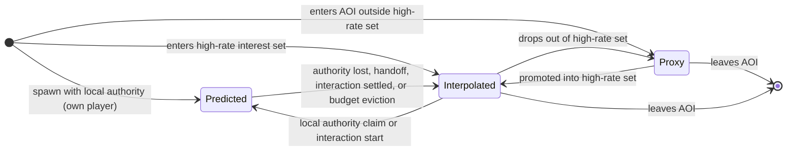
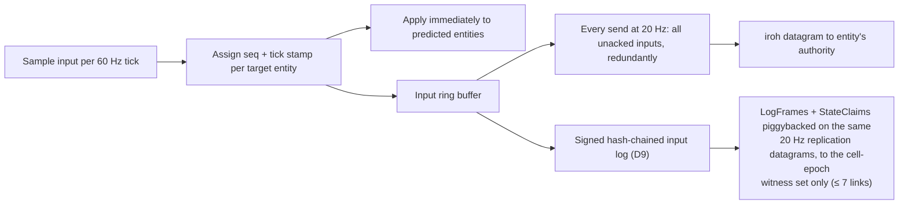

# 05 — Prediction, Rollback, Interpolation

Every Orrery peer runs three entity timelines at once: a predicted timeline for entities it controls or is actively touching, an interpolated past timeline for the remote entities it watches at high rate, and a coarse extrapolated timeline for everything else in its area of interest. This document specifies those timeline classes and the transitions between them, the per-entity Gambetta reconciliation loop in which each peer acts as the authoritative server for its own entities, the rollback mechanics and resimulation budget guard configured on `lightyear`, the input pipeline, the interpolation buffer, universe time synchronization, and the end-to-end hit-registration path. It closes with latency-regime behavior, the quantize-both-sides rule, the witness-signal hand-off, and a tuning guide for slower-paced games.

Normative source: [ADR-0008](adr/0008-prediction-rollback-interpolation.md) (expanding on [D2](adr/0002-simulation-model.md), [D6](adr/0006-population-adaptive-topology.md), and [D7](adr/0007-authority-and-leases.md); touching [D9](adr/0009-verifiable-core.md), [D10](adr/0010-witnessing.md), and [D11](adr/0011-persistence.md)). Defaults come from [D16](adr/0016-parameter-reference.md); games may reconfigure them (§12).

Implementing crates: `orrery_predict` (lightyear configuration, reconciliation-error monitor, rollback budget guard), `orrery_protocol` (wire types), `orrery_spatial` (interest-set selection, proxy extrapolation), `orrery_authority` (claims that drive timeline promotion), `orrery_core` (quantizers, deterministic step for core entities).

---

## 1. The three timeline classes

Every replicated entity on a given peer is in exactly one **timeline class** at any instant. The class determines which schedule simulates it, what history is retained for it, and what the player sees.

| Class | Who | Simulated by | Time shown | History kept |
|---|---|---|---|---|
| **Predicted** | Own player, entities under local (weak/strong) authority, remote-authority entities in a locally-initiated interaction | Fixed 60 Hz prediction schedule, at the current universe tick (or ahead, §3) | Present / near-future | Per-tick component snapshots, 16-tick ring (≥ rollback window 9 ticks + margin) |
| **Interpolated** | Remote-authority entities in the high-rate interest set (default **24** entities) | Not simulated; poses sampled between received snapshots | Past: **100 ms** behind (2 send intervals @ 20 Hz) | Received snapshots covering ≥ 200 ms (hit rewind cap) |
| **Proxy-extrapolated** | Entities inside the 27-cell AOI but outside the high-rate set | Dead-reckoned from **1–4 Hz** proxy updates (`orrery_spatial`) | Approximate present | Last proxy state + velocity only |

Class membership is decided every tick by two inputs: the interest-set selector in `orrery_spatial` (priority-scored top-24 within the AOI, see [03-replication.md](03-replication.md)) and the authority state machine in `orrery_authority` (see [04-authority.md](04-authority.md)).



Transition rules that matter in practice:

- **Interpolated → Predicted** happens optimistically the moment a local interaction begins (collision contact, grab attempt, damage event) — the peer files its weak-authority claim (D7) *and* starts predicting immediately, per Gaffer's [Networked Physics in VR](https://gafferongames.com/post/networked_physics_in_virtual_reality/) host-confirm pattern. The entity's interpolation buffer is retained; if the claim loses, the entity snaps back onto its interpolated timeline (the buffer was never discarded, so the demotion is a visual blend, not a pop).
- **Predicted → Interpolated** on cooperative handoff seeds the interpolation buffer with the last two predicted states so the 100 ms view delay starts populated rather than starving.
- The own player entity is **always Predicted** — strong ownership is not stealable (D7), so this class never demotes except on death/despawn.
- Proxy entities never interact: any locally-initiated interaction with a proxy first forces promotion into the high-rate set (evicting the lowest-priority member), then follows the Interpolated → Predicted edge.

## 2. Per-entity reconciliation: every peer is the Overwatch server for its own entities

The classic [Gambetta reconciliation loop](https://www.gabrielgambetta.com/client-side-prediction-server-reconciliation.html) — sequence-numbered inputs, authority echoes the last processed sequence, client rewinds to the authoritative state and replays unacknowledged inputs — assumes a single authoritative server. Orrery applies it **per entity**: for entity *E*, the current authority holder (a peer or field host, D6/D7) plays the server role, and every other peer predicting *E* plays the client role. [Overwatch's GDC 2017 netcode](https://www.gdcvault.com/play/1024001/-Overwatch-Gameplay-Architecture-and) is the direct precedent for the mechanics: fixed 16 ms command frames, clients predicting movement/abilities/weapons by default, bounded rollback-and-replay on mispredict ([summary](https://edgegap.com/blog/game-backend-deep-dive-overwatch-2016-netcode-architecture-rollback)). Overwatch's framing that this "requires a trusted authoritative dedicated server" is answered structurally: the authority per entity exists (single-writer invariant, D2), and *trust* is supplied not by hardware ownership but by witnessing (D10, [07-witnessing.md](07-witnessing.md)).

Three concrete cases:

1. **Own player entity.** The local peer holds strong ownership, so it *is* the authority — its predictions are definitionally correct and there is no reconciliation against anyone. RTT never affects own-character feel. (Even in the promoted regime, D6, players keep authority over their own characters; the field host validates rather than simulates them.)
2. **Remote-authority entity under locally-initiated interaction** (pushing peer B's crate, standing on a moving platform B owns). The local peer predicts *E* using its interaction inputs, tagged with a per-`(source peer, entity)` sequence number. B applies those inputs on its authoritative timeline, and every authoritative state update for *E* carries `last_processed_input_seq` per interacting source. On receiving an update for tick *T*, the local peer compares it against its stored prediction at *T*; on mismatch beyond the quantization/tolerance threshold it restores *T*, then replays inputs `last_processed_seq+1 ..= current` through the prediction schedule.
3. **Authority-side late inputs.** Interaction inputs always arrive at the authority *after* it has simulated their stamped tick (by one-way latency). The authority **never rewinds its own authoritative entities**: its signed input log (D9) is straight-line by construction, so a late remote input is applied — and logged — **at its arrival tick**, never back-dated ([06-verifiable-core.md](06-verifiable-core.md) makes the applied order normative). The interactor's misprediction of *when* its input lands is corrected by the ordinary reconciliation loop above; claims about the *past* (hits, touches) are never resimulated at all — they are validated against the authority's retained pose history (§7). Rollback-and-replay exists only on the predicting side, for the local predicted set and its presentation.

Sequence numbers are `u16` with serial-number wraparound comparison; the universe tick stamp (`Tick` = u64, D8) disambiguates. lightyear's internal u32 tick never appears on Orrery's wire — `orrery_predict` bridges it through an offset map (§6). Acks ride in every state update; there is no separate ack message.

## 3. Rollback mechanics on lightyear

`orrery_predict` configures [lightyear 0.29](https://github.com/cBournhonesque/lightyear)'s prediction/rollback machinery (which since 0.27 rides on `bevy_replicon` replication) rather than reimplementing it. What Orrery adds is the per-entity-authority wiring, the budget guard, and the monitor.

**What is snapshotted.** Per predicted entity, per fixed tick, into a 16-tick ring buffer:

- every component registered for prediction (Transform as `big_space` `GridCell` + local transform, avian3d `LinearVelocity`/`AngularVelocity`, plus game components opted in via the prediction registry);
- the per-entity input buffer entries for that tick;
- for verifiable-core entities: the deterministic RNG cursor and quantized core state (`orrery_core`), so a replayed window is bit-identical (D9).

Cosmetic state (particles, ragdolls, animation phase) is never snapshotted and never rolled back (D13). Snapshotting only the predicted subset — never the world — is the point: this is what makes cost scale with interest size instead of world size, the exact failure of whole-world rollback ([SnapNet, Netcode Architectures Part 2](https://www.snapnet.dev/blog/netcode-architectures-part-2-rollback/)).

**The window.** Rollback window = **9 ticks (150 ms)** at the 60 Hz fixed tick. An authoritative update for a tick still inside the window triggers compare-and-maybe-rollback; comparison uses the quantized representation (§10) so equality is exact, with the D9 tolerance bands (ε_pos = 1 cm, ε_vel = 1 cm/s) as the mispredict threshold for continuous state.

**Beyond the window: snap + reconcile.** If the authoritative tick has already left the ring (severe lag spike, long relay detour), the peer snaps the entity to the authoritative state at its stamped tick, fast-forwards it with plain extrapolation (no input replay) to the present, and applies **presentation-side error smoothing**: the visual transform decays the snap error over ~10 render frames. Smoothing is render-only — the simulation state is the snapped state immediately, so smoothed error can never leak back into replication or the witness comparators.

**Budget guard.** The D8 budget: a predicted-subset step must stay ≈ **1 ms**; worst-case resim is 9 ticks ≈ 9 ms, amortized over at most **2 render frames**. SnapNet's arithmetic shows why a guard is mandatory: a 60 Hz game absorbing 300 ms of rollback leaves ~1.1 ms/frame of simulation budget, and exceeding it triggers the resimulation "spiral of death" — resim makes you late, lateness makes the next resim longer ([SnapNet](https://www.snapnet.dev/blog/netcode-architectures-part-2-rollback/)). The guard in `orrery_predict`:

```rust
/// Landed — orrery_predict::budget
pub struct RollbackBudget {
    /// EWMA of the measured cost of one predicted-subset fixed step,
    /// seeded at D8's ≈ 1 ms target.
    pub step_cost: Duration,
    /// Max resim time spent on one render frame. Default 5 ms.
    pub max_resim_per_frame: Duration,
    /// Max render frames a single resim may be spread over. Default 2 (D8).
    pub max_amortize_frames: u8,
    /// Reciprocal weight of a new cost sample. Integer, so the EWMA cannot
    /// drift between platforms.
    pub cost_smoothing: u32,
    /// How long the hysteresis cap must go unprovoked before release. 5 s.
    pub recovery_period: Duration,
}

/// The ladder's answer. Every variant is affordable by construction, and
/// `ticks_now` is always how many fixed steps to run this frame.
pub enum ResimPlan {
    Immediate { ticks_now: u16 },
    Amortize { frames: u8, ticks_now: u16 },
    Evict { demote: u16, ticks_now: u16 },
    SnapOwnPlayer,
}

impl RollbackBudget {
    pub fn observe_step(&mut self, measured: Duration);
    pub fn observe_clean_frame(&mut self, frame_time: Duration);
    pub fn plan(&mut self, pending_ticks: u16, predicted_len: u16) -> ResimPlan;
    pub fn predicted_cap(&self) -> Option<u16>;
}
```

The guard cannot gate lightyear's replay directly — lightyear owns the loop and does not ask. What it does instead is set the bound: `RollbackPolicy::max_rollback_ticks` is the number beyond which lightyear *ignores* a rollback request, and an ignored request is exactly this section's "beyond the window, snap + reconcile". So the ladder is applied by narrowing that bound when the measured step cost says a full window will not fit, and restoring it on the first clean frame. `ResimPlan::Evict`'s `demote` count is the interest-set selector's input; the *which* is `PredictPriority` (own player > strong-owned > weak-authority > interaction), which the guard orders but does not choose.

Degradation ladder, evaluated before each resim:

1. If `pending_ticks × step_cost_ms` exceeds one frame's budget, split the replay across 2 render frames (rendering continues from the last completed predicted state; newly arriving inputs queue).
2. If it exceeds the 2-frame budget, **evict predicted entities**: demote the lowest-priority members of the predicted set to Interpolated until the projected cost fits. Priority order: own player > strong-owned > weak-authority held > interaction-predicted.
3. Floor: the own player alone always resims; if even that overruns (pathological), snap-reconcile the own player with error smoothing.
4. Hysteresis: two consecutive amortized overruns halve the predicted-set size cap until 5 s of clean frames pass.

Evictions are recorded by the reconciliation-error monitor (§11) — a machine that cannot afford prediction also cannot serve as a high-confidence witness.

## 4. Input pipeline



- Inputs are sampled once per fixed tick, applied to the predicted timeline the same tick, and buffered.
- **Redundant resend:** every outgoing packet (20 Hz) carries *all* inputs not yet acked by the receiving authority, up to a 20-tick (~333 ms) redundancy cap. At 60 Hz sim / 20 Hz send, a loss-free packet carries 3 new ticks plus recent history; a lost packet costs nothing because the next packet re-carries its inputs. This is the standard GGPO/Overwatch loss-armoring trick — no retransmission round-trip on the input path, ever. Inputs are small (bitfields + a couple of quantized axes), so redundancy is cheap.
- Beyond the redundancy cap the authority treats the sender as too late for interaction prediction; the inputs it does apply still enter its signed input log for adjudication (D9). The log path is **not** a dedicated reliable stream: `LogFrame`s and 2 Hz `StateClaim`s piggyback on the same 20 Hz replication datagrams, addressed to the **cell-epoch witness set only** (≤ 7 links; in the promoted regime, the field host only). Chain gaps from datagram loss are detected via the frames' truncated rolling heads and repaired with `LogRangeRequest`/`LogRangeResponse` on the reliable control stream ([06-verifiable-core.md](06-verifiable-core.md)).

```rust
/// Sketch — orrery_protocol wire types (postcard/bitcode encoded)
pub struct InputPacket {
    pub source: NodeId,
    pub tick: Tick,                  // sender's current universe tick (u64)
    pub streams: Vec<InputStream>,   // one per target entity
}
pub struct InputStream {
    pub target: PersistId,
    pub first_seq: u16,              // seq of first record below
    pub first_tick: Tick,
    pub inputs: Vec<InputRecord>,    // contiguous, unacked, ≤ 20
}
/// Acks ride in state updates, not separate messages:
pub struct AuthUpdateHeader {
    pub entity: PersistId,
    pub tick: Tick,
    pub last_processed_seq: Vec<(NodeId, u16)>, // per interacting source
}
```

## 5. Interpolation buffer and jitter

Interpolated entities render at `universe_tick_now − interp_delay`, with **interp_delay = 100 ms = 2 send intervals at 20 Hz** — Source's `cl_interp 0.1` over two 50 ms updates is the direct reference ([Valve, Source Multiplayer Networking](https://developer.valvesoftware.com/wiki/Source_Multiplayer_Networking)): one whole snapshot interval of delay buys immunity to single-packet loss, the second buys headroom for jitter.

Jitter handling:

- The buffer is **adaptive upward**: `orrery_net` tracks inter-arrival jitter per link (EWMA of |Δarrival − Δsend|); if p95 jitter exceeds the half-interval margin, interp_delay grows in 1-tick steps up to 2× default (200 ms), and decays back one tick per 5 s of calm. It never shrinks below 2 send intervals.
- **Buffer underrun** (both bracketing snapshots missing): extrapolate from the newest snapshot's velocity for at most 1 send interval (50 ms), then hold pose. Underruns are counted; a link that underruns chronically demotes its entities toward proxy behavior rather than showing rubber-banding.
- Interpolation is hermite on position (using replicated velocity) and nlerp on orientation; both operate on the quantized values (§10), so the interpolated view is drawn from exactly the states the authority also had.

Proxy-extrapolated entities are simpler: dead-reckon position from the last 1–4 Hz proxy update, clamp displayed speed to the entity's archetype maximum (the same invariant the witness validators use), and skip micro-corrections entirely — a proxy exists to be *there*, not to be precise.

## 6. Universe time synchronization

All timelines above are expressed in **universe ticks**: one global `Tick` counter (`u64`, 60 Hz) shared by every island (D8). Time is a property of the universe, not of an island.

- **Anchor.** The coordinator issues a **universe epoch** once per universe: `UniverseEpoch { epoch_utc: u64_micros, tick_rate: 60 }`; tick 0 is `epoch_utc`, and `tick(t_utc) = (t_utc − epoch_utc) × 60 Hz`. Every island simulates on this one absolute timeline — signed logs, RNG seeds, witness epochs, and journal records all reference the same absolute tick numbers — so **island merges never re-base anything**: no stamp re-mapping, no epoch adoption. The epoch rides in the session state the coordinator hands out (`orrery_net`).
- **Offset estimation.** No peer clock is trusted. Each peer estimates its offset to the universe timeline NTP-style over the existing iroh QUIC connections: a 4-timestamp exchange `(t0 send, t1 peer receive, t2 peer reply, t3 receive)` piggybacked on a ping datagram every 500 ms per connected peer, plus the coordinator as a low-frequency reference. Offset = `((t1−t0)+(t2−t3))/2`; samples are filtered by keeping the minimum-RTT samples in an 8-sample sliding window (classic NTP clock-filter shape) before an EWMA.
- **lightyear bridge.** lightyear's internal tick is a `u32`; `orrery_predict` maintains an **offset map** (a per-session base `Tick` plus wraparound accounting) translating lightyear ticks to universe ticks at the crate boundary, so `Tick` = u64 everywhere on Orrery's wire, in logs, and in storage while lightyear's prediction machinery runs unmodified.
- **Slew, never step.** Corrections apply as a bounded slew of ≤ 0.1 ms per tick (~0.6% rate), invisible to gameplay — the same family of mechanism as Overwatch's time dilation of client frames (16 ms → ~15.2 ms) under input starvation. If the estimated error ever exceeds 50 ms (half the interp buffer), the peer performs a hard re-sync: step the clock, flush prediction, snap-reconcile everything once.
- **Drift.** Consumer clocks drift O(10–100 ppm) — a few ms per minute; the continuous 500 ms sampling makes drift a non-event. Peers whose offset estimates disagree persistently with the island median by more than the tolerance window are flagged to telemetry (a desynced clock inflates everyone's reconciliation error against them — the monitor, §11, sees it first).
- **Late joiners.** On join, the coordinator hands over `UniverseEpoch` plus its current tick estimate. The joiner runs a **sync phase** before spawning into play: collect ≥ 8 offset samples from ≥ 2 island peers (or the coordinator alone if the island is a 1-peer mesh), typically < 1 s, then enter with a converged offset. Area state meanwhile pages in from the persistence gateway ([08-persistence.md](08-persistence.md)), so the sync phase hides inside load time.

There is no Overwatch-style global "run ahead of the server by RTT/2": with per-entity authority there are many authorities at many RTTs. All peers instead simulate *at* the shared universe tick, and lateness of interaction inputs is absorbed by the authority applying them at their arrival tick (§2, case 3) and validating past-referencing claims against retained pose history (§7). The cost is that an interaction's authoritative effect lands `RTT/2` later than the interactor predicted it — exactly the error the reconciliation loop exists to correct.

## 7. Hit registration end-to-end

Hits are the worst case: the shooter aims at an **interpolated** target (100 ms in the past, plus transit), while the target's state is owned by another peer. D8's contract: the shooter evaluates against its interpolated view with a bounded rewind ≤ **200 ms**; the *target's* authority validates the effect; durable consequences commit only via the intent path (D11).

```mermaid
sequenceDiagram
    autonumber
    participant S as Shooter peer<br/>(authority: shooter's player)
    participant T as Target's authority peer
    participant W as Witness set (K=3 of N≥5)
    participant G as Persistence gateway

    Note over S: tick t_f: fire input sampled
    S->>S: evaluate ray against interpolated pose of target<br/>at basis (tick_a, tick_b, alpha); total rewind ≤ 200 ms
    S->>S: predicted presentation: tracer always;<br/>impact/damage feedback only if RTT(S→T) < 250 ms
    S->>T: HitClaim (datagram, resent until acked)
    T->>T: validate basis against retained pose history<br/>(32-tick ring); range/LOS/rate invariants; rewind cap
    alt claim valid
        T->>T: apply damage at current tick,<br/>log interaction input at arrival tick (D9)<br/>— never rewinds its own entity
        T-->>S: HitVerdict::Accepted + authoritative state
        S->>S: confirm presentation (or reconcile magnitude)
        opt durable consequence (kill credit, loot, XP)
            T->>W: intent + context for co-signing
            W-->>T: K=3 co-signatures
            T->>G: signed, attested intent
            G-->>T: commit ack (p99 < 10 ms)
        end
    else claim invalid
        T-->>S: HitVerdict::Rejected(reason)
        S->>S: undo predicted presentation
        T->>T: log discrepancy sample → witness pipeline
    end
```

```rust
/// Sketch — orrery_protocol
pub struct HitClaim {
    pub shooter: PersistId,
    pub target: PersistId,
    pub weapon: WeaponRef,
    pub fire_tick: Tick,
    /// The interpolation basis the shooter rendered: two snapshot
    /// ticks and the blend factor. The authority re-derives the pose
    /// from ITS history — it never trusts a shooter-supplied pose.
    pub basis: (Tick, Tick, UNorm16),
    pub ray: QuantizedRay,
    pub claimed: HitSurface,     // body part / voxel face, for presentation
    pub input_seq: u16,
}
```

Validation on the target's authority is a **pose-history lookup, never a resimulation of the past** — the authority does not rewind its own core entity (§2, case 3; D9). The total rewind implied by `fire_tick − basis` must be ≤ 200 ms (12 ticks); the basis ticks must exist in its retained pose history — authorities keep a **32-tick ≈ 533 ms pose ring**, sized as the hit rewind cap (200 ms = 12 ticks) + the interpolation buffer (100 ms = 6 ticks) + a ~14-tick transit/jitter margin; the re-derived pose must intersect the ray within tolerance; and rate/range/LOS invariants (`orrery_witness` validators, D10) must pass. Where LOS or other geometry-dependent checks belong to the verifiable core, the rules read terrain only through `StateView::geometry()`, whose per-tick `GeometryFrame` (quantized section keys + content hashes consulted) enters the signed log so the adjudicator can cross-check against journaled terrain state at that tick ([06-verifiable-core.md](06-verifiable-core.md)); mutable-terrain LOS beyond that is validated only as a non-core invariant. Only then does damage exist — applied at the authority's current tick, with the interaction input logged at its arrival tick. A kill's gameplay fact (health = 0) replicates as ordinary state; the *durable* consequences — loot grant, XP, kill-credit ledger entries — are `Ruleset`-classified critical operations and exist only after the attested intent commits through the gateway to FoundationDB (D11). A cheating shooter can therefore at most paint local sparks; it cannot mint value.

This is "favor the shooter" with the trust inverted from Source's server-side lag compensation: the look-back bound is enforced by the *victim's* authority against its own pose history, so the worst-case "shot behind cover" experience is capped at 200 ms plus transit, and no peer can retro-date further than the cap.

### 7.1 Weapon archetypes and prediction regimes

| Weapon | Entity? | Prediction model | Authority transfer | Attestation cost |
|---|---|---|---|---|
| **Hitscan** | No — pure event | Shooter predicts presentation only; damage never predicted | N/A | One raycast + log replay |
| **Dumb projectile** | Yes — ephemeral | Shooter predicts spawn + ballistic flight; deterministic = spawn-params-only replication | On impact (contact) | Spawn log + one integration |
| **Guided missile** | Yes — ephemeral | Shooter predicts kinematics; guidance corrections from target's authority (RTT-dependent, §8) | Mid-flight (proximity) + on impact | Full guidance trace replay |

The guided missile's mid-flight transfer is the hardest case: guidance depends on the target's *current* position, which is authoritative only on the target's peer. At RTT < 150 ms the shooter can predict guidance using the target's interpolated pose; at RTT > 250 ms the missile stays Interpolated on the shooter and the target's authority simulates the terminal phase entirely (§8 latency bands).

### 7.2 A shot blocked by promotable terrain (the asteroid, end-to-end)

*Specifies the seam behavior of the terrain↔entity promotion mechanism ([08-persistence.md](08-persistence.md) §10.1 — non-normative proposal, pending D18).*

Two ships fire at each other across an inert, stationary, **destructible** asteroid. The block decision is made twice, per §7's contract: the shooter predicts against its interpolated view (presentation only), and the target's authority re-derives the ray against its own 32-tick pose ring **and its own terrain copy** — authoritative. Which tier of verifiability the block gets depends on what the asteroid *is* at the fire tick:

- **Static, shipped geometry** → content-hash-pinned, part of the build (VC-8): fully adjudicable for free.
- **Mutable terrain, unpinned** → the LOS check is a non-core `invariants()` matter ([06-verifiable-core.md](06-verifiable-core.md) §3): the target's authority validates honestly, witnesses spot-check, but a dispute is *not* replay-adjudicated.
- **Pinned (promoted or pin-pending)** → the asteroid is a Core entity; the block resolves through `NeighborFrame` reads of its state and the damage is a logged, witness-checked core rule — fully adjudicable.

The promotion machinery is what moves the block from tier 2 to tier 3 **exactly when the shot makes it matter**:

1. **Shooter fires, predicts locally.** Ray against interpolated asteroid (a terrain section): predicted sparks. If the `Ruleset` classifies this section class as promotable-on-damage, the shooter's core step emits the promotion event and its `orrery_persist_client` submits the **Pin intent** with witness co-signatures — concurrently with the `HitClaim` to the target's authority. The shooter's own log records the seam (`TerrainPromotion{Pin}`) in its step's tick.
2. **Target's authority validates.** Three cases:
   - **`Promote` already committed** (typical under sustained fire — the first volley pinned it): the asteroid is an entity in its interest set; the authority re-derives the ray against the entity's replicated state, damage applies as a logged core rule. Fully adjudicable end-to-end.
   - **`pin_pending`** (claim outran the intent, first-shot case): the authority **parks the claim** — it does not guess which geometry epoch to validate against, because the section's read type is mid-transition. It waits for the `Promote` broadcast on the per-cell stream (bounded wait: the intent commits in < 10 ms p99 or fails), then applies the committed state and issues the verdict. The shooter sees a delayed `HitVerdict`, never a wrong one.
   - **Pin intent rejected** (rate limit, policy): the section stays terrain; the claim validates as tier-2 invariant LOS, honestly but non-adjudicated — the pre-promotion status quo, deliberately.
3. **Adjudication later** (a dispute over the kill): the evidence spans the seam exactly as [06-verifiable-core.md](06-verifiable-core.md) §9 specifies — pre-pin geometry cross-checked against journaled terrain, post-pin reads against the asteroid's own chain, the seam record's `intent_id` checked against the FDB `intent/` row. A window *may* span the seam; a claimed seam without a committed intent is a discrete mismatch.

The asteroid itself is never an authority in the hit-claim sense — the two decision points stay exactly where §7 puts them (shooter's presentation, target's authority). Promotion changes only the *verifiability tier of the geometry evidence*, and only from the first interaction onward.

## 8. Latency-regime behavior

RTT in Orrery is **per authority pair**, not global: the local player is always RTT-free (§2), so degradation applies only to interactions with a given remote authority. Thresholds follow D8, with Overwatch's ~220 ms hit-prediction cutoff as the precedent for the top band.

| RTT to entity's authority | Predicted | Presentation | Notes |
|---|---|---|---|
| 0–50 ms | Own entities + all locally-initiated interactions, full fidelity | Everything predicted incl. hit impacts | Rollbacks rare and sub-perceptual (≤ 3 ticks) |
| 50–150 ms | Same; interaction mispredicts corrected within the 9-tick window | Everything predicted | The design center: window (150 ms) ≥ RTT, so replay covers a full round trip |
| 150–250 ms | Own entities full; contested-object prediction becomes conservative (predict kinematics, not discrete outcomes — no predicted pickups/latches) | Hit impacts still predicted (Overwatch ran to ~220 ms); interaction *outcomes* wait for authority | Window < RTT: some corrections arrive as snap+reconcile; error smoothing carries the visuals |
| 250+ ms | Own entities full; remote-authority interaction prediction **off** — contested entities stay Interpolated | Hit-impact presentation **disabled** (D8; Overwatch ~220 ms precedent): tracers fire, impacts confirm on verdict | Interp buffer allowed to widen to 200 ms; the peer is a low-weight witness (§11) |

The band is evaluated per link with hysteresis (enter a worse band after 3 s sustained, return after 10 s) so a jitter spike doesn't visibly toggle features.

## 9. Quantize both sides

Replicated continuous state is quantized **identically on writer and reader before use** (D8): the authority quantizes position/velocity/orientation at the tick boundary, *continues its own simulation from the quantized values*, and sends those values; the reader feeds the same bits into interpolation, prediction comparison, and any local physics interaction. This is Gaffer's quantize-both-sides rule from [Networked Physics in VR](https://gafferongames.com/post/networked_physics_in_virtual_reality/): if the writer simulates from un-quantized state, every snapshot silently injects a divergence the reader must re-converge from, forever. Quantizers live in `orrery_core` (shared with the verifiable core's tick-boundary quantization, D9 — see [06-verifiable-core.md](06-verifiable-core.md)); quantization steps are chosen well inside the tolerance bands (step ≤ ε_pos/4) so quantization noise can never trip the witness comparators. It also makes delta compression bite ([Gaffer, Snapshot Compression](https://gafferongames.com/post/snapshot_compression/): 17.37 Mbps raw → ~256 kbps) — the bandwidth side is specified in [03-replication.md](03-replication.md).

## 10. The reconciliation-error monitor is the witness signal

Every rollback comparison already computes `|predicted − authoritative|` per component per entity. `orrery_predict` keeps these residuals instead of discarding them:

```rust
/// Landed — orrery_predict::monitor
pub struct TrackKey { pub authority: NodeId, pub entity: PersistId }

pub struct ErrorTrack {
    /// Integer EWMAs on the quantization lattice: millimetres and mm/s.
    pub pos_ewma_mm: i64,
    pub vel_ewma_mms: i64,
    /// The open out-of-band run, if any.
    pub violation_start: Option<Tick>,
    pub violation_ticks: u32,
    /// Corrections attributed to this authority this witness epoch.
    pub rollbacks: u32,
    pub snaps: u32,
    pub last_tick: Option<Tick>,
}

pub enum MonitorSignal {
    /// ε_pos (1 cm) / ε_vel (1 cm/s) exceeded continuously ≥ 250 ms,
    /// or one tick ≥ 8× the band (no sustain needed).
    SustainedToleranceViolation {
        key: TrackKey, window: Range<Tick>, confidence: WitnessConfidence,
    },
    /// Rollback storm against one authority: mispredict cause is
    /// remote, not local jitter (other authorities are clean).
    AnomalousCorrectionPattern {
        authority: NodeId, rollbacks: u32, baseline: u32,
        confidence: WitnessConfidence,
    },
}

pub enum WitnessConfidence { Full, Reduced(DegradedReason) }
pub enum DegradedReason { HighLatencyBand, BudgetEviction }

impl ReconciliationMonitor {
    /// Returns a signal on the tick a violation first qualifies, and only
    /// on that tick — an open run does not re-fire.
    pub fn record_residual(
        &mut self, key: TrackKey, tick: Tick, pos_err_mm: i64, vel_err_mms: i64,
    ) -> Option<MonitorSignal>;
    pub fn record_rollback(&mut self, key: TrackKey);
    pub fn record_snap(&mut self, key: TrackKey);
    pub fn scan_correction_pattern(&self) -> Option<MonitorSignal>;
    pub fn degrade(&mut self, reason: DegradedReason);
    pub fn reset_counters(&mut self);
    pub fn retire_stale(&mut self, before: Tick);
}
```

Every number in the monitor is an integer over the quantization lattice, including the EWMAs, for the reason the tolerance comparator in `orrery_core` is: a comparator that used floats could disagree between the peer that reports and the adjudicator that decides, which would make verdicts platform-dependent. The EWMA moves at least one lattice unit per sample, because plain integer division stalls once the gap is under the smoothing divisor and would leave every sustained deviation under-reported by up to `n − 1` millimetres — permanently, in the direction that favours the accused. A fresh track is seeded from its first sample rather than climbing from zero, because the case that matters most (a hard snap on the tick an entity enters the predicted set) *is* a first sample.

The bands are mirrored from `orrery_core::Tolerance` rather than imported: [10-crates.md](10-crates.md)'s layering rule 2 does not put `orrery_predict` above `orrery_core`. Field names match exactly, so `orrery_witness` — which depends on both — converts mechanically.

**Where the residual comes from.** lightyear 0.29 fires no event, trigger or observer on rollback, and its `PredictionMetrics` counts rollbacks globally with no entity attribution. The per-entity residual arrives instead as `VisualCorrection<D>`, which lightyear adds to a mispredicted entity after its `RollbackSystems::EndRollback` and which carries the error in the component's own type. `orrery_predict` reads it on `Added` — never on a plain query, because the correction decays over several frames and sampling it every frame would turn one mispredict into a sustained run, manufacturing the violation the monitor exists to detect honestly. Attribution comes from a `PredictedBy { authority, persist_id }` component carrying the holder `orrery_authority` settled. `orrery_authority` does not write it — it is below `orrery_predict` on the dependency spine (D15) and naming the component would invert it — so the write crosses at the composition root, in `orrery::track_predicted_authority` (#910), pinned to the `Authority` transition `process_lease_replies` publishes and removed when the holder goes to `None`. A correction on an entity with no authority recorded is discarded rather than attributed to a guess.

A `MonitorSignal` is exactly the D10 step-1 "prediction *is* the witness" trigger: `orrery_witness` consumes it, requests the disputed window's signed input-log segment, and escalates per the protocol in [07-witnessing.md](07-witnessing.md) (replay, discrepancy report, adjudication — window capped at 3 s / 180 ticks). Two design consequences flow back into this document: residuals must be computed on quantized state against tolerance bands (so honest packet loss and float drift do not accuse anyone — the "multiple rollbacks" thresholding of D10), and the monitor tags its own confidence — a peer in the 250+ ms band, or one that recently evicted entities under the budget guard (§3), reports with reduced witness weight.

## 11. Failure modes and edge cases

- **Authority handoff mid-prediction.** The predicting peer's acks start coming from a new NodeId. Sequence spaces are per-`(source, entity)` and the new authority inherits the input log tail during handoff (D7), so `last_processed_seq` continues monotonically; a gap simply widens one replay. If the handoff was *to* the local peer, pending reconciliation is dropped — the local timeline is now definitionally correct.
- **Lease expiry / crashed authority.** Updates stop; interpolated entities underrun into the 50 ms extrapolation-then-hold path while `orrery_authority` runs orphan recovery. The freeze is honest — inventing motion for an unowned entity would poison the witness comparators.
- **Optimistic claim loses the CAS.** The entity was Predicted for up to one registrar round trip; demote to Interpolated, discard the locally-simulated branch, resume from the retained interpolation buffer (D7's claim rollback).
- **Resim overrun.** Handled by the §3 ladder; the failure boundary is explicit and per-entity, never a frame-rate death spiral.
- **Island merge.** Nothing to re-base: both islands already run on the universe tick (§6), so stamps, logs, RNG seeds, and prediction state survive untouched; cross-island interactions are blocked only until membership and interest sets converge (see D17's open question on fast travelers).
- **Frame migration mid-prediction (EVA, docking).** A nested-grid crossing ([01-spatial-model.md](01-spatial-model.md) §13.3) changes the predicted timeline's coordinate basis under it. The migration tick is logged as a `FrameChange` record ([06-verifiable-core.md](06-verifiable-core.md) §6) carrying the composed transform; the predicted ring's snapshots are re-based by that transform (positions/velocities compose exactly — integer cell math plus one f32 compose), so reconciliation continues across the boundary with no snap. The interpolation buffer for *other* entities is unaffected: remote entities keep their own frames, and the carrier root remains a normal interpolated entity in the migrator's high-rate set during the crossing window.
- **Malicious `last_processed_seq`.** An authority that acks inputs it never applied causes sustained reconciliation error against *itself* — the monitor (§10) converts the lie into a witness signal. Withheld acks degrade only the attacker's own entity's interactivity.
- **Two peers predict the same contested entity.** Both may, briefly (D2 permits divergent predicted views); the single-writer invariant means both reconcile against one authority, and ownership-beats-authority sequencing (D7) settles tug-of-war objects.

## 12. Tuning per game pacing

D16 defaults are the fast-action (R10) configuration. The parameters are one coupled system; retune by these invariants rather than individually:

| Invariant | Formula | Fast action (default) | Mid-pace example (30 Hz sim) | Slow/social example (20 Hz sim) |
|---|---|---|---|---|
| Rollback window ≈ 150 ms of real time | `ceil(0.15 × tick_rate)` | 9 ticks @ 60 Hz | 5 ticks | 3 ticks |
| Interp buffer = 2 send intervals | `2 / send_rate` | 100 ms @ 20 Hz | 133 ms @ 15 Hz | 200 ms @ 10 Hz |
| Hit rewind cap ≈ interp + ½ typical RTT | — | 200 ms | 250 ms | n/a (no twitch hits) |
| Redundant-input cap ≥ 2× send interval | — | 20 ticks | 10 ticks | 6 ticks |
| Step budget × window ≤ 2 render frames | `step_ms × window ≤ 2 × frame_ms` | 1 ms × 9 ≤ 33 ms | 2 ms × 5 | 4 ms × 3 |

Guidance: lowering the *send* rate is the cheapest bandwidth lever and only costs interpolation delay; lowering the *sim* tick coarsens rewind granularity and hit fidelity — slow-paced games should take that trade, fast games never should. The 250 ms presentation cutoff (§8) scales with the hit rewind cap. The witness tolerance bands (ε_pos/ε_vel) generally *loosen* for slower games, not tighten — fewer, larger movements per tick mean honest error grows with tick length.

## 13. Implementation status: what lightyear 0.29 actually supplies

Validated against the pinned stack (Bevy 0.19.1, lightyear 0.29.0, bevy_replicon 0.42.1 vendored) on 2026-08-16. The headline is that **D14's pin holds**: lightyear 0.29 builds against Bevy 0.19 unmodified, with no bump, no fork and no patch to lightyear itself. R-1's build-failure mode has not arrived.

Two things did arrive, and both matter more than a compile error would have.

### 13.1 The D16-to-lightyear knob map

Configured by `orrery_predict::wiring`, the only module in the workspace that names a lightyear type. Recording the mapping is most of the value: it is not obvious, and it moved in 0.29.

| D16 parameter | lightyear 0.29 | Note |
|---|---|---|
| 60 Hz sim tick | `ClientPlugins { tick_duration }` → `Time<Fixed>` + `TickDuration` | lightyear's own default is also 60 Hz |
| 20 Hz send | `ReplicationMetadata::new(50 ms)` | **App-global in 0.29.** `ReplicationSender` became a unit marker with no interval of its own; leaving the default sends every frame a fixed tick ran |
| 9-tick rollback window | `RollbackPolicy::max_rollback_ticks` **and** `InputDelayConfig::maximum_predicted_ticks` | The effective bound is the *minimum* of the two; writing only one lets the other's default silently win. lightyear's defaults are 20 and 100 |
| 100 ms interp buffer | `InterpolationConfig::min_delay`, with `send_interval_ratio` zeroed | lightyear defaults to `send_interval × 1.7`, which adapts to the peer's observed rate — right for one server, wrong for many authorities at different rates. §5's jitter estimator needs a fixed baseline to widen from |
| 20-tick input redundancy | `InputConfig::packet_redundancy` | Unit change: lightyear counts **packets**, D16 counts **ticks**. At 60 Hz over a 20 Hz send that is 3 ticks per packet, so 20 ticks is **7 packets**. Writing 20 would carry ~1 s of input history per datagram |
| — | `InputDelayConfig::maximum_input_delay_before_prediction: 0` | lightyear defaults to 3 ticks of input delay to avoid rollbacks. Orrery declines the trade: the own player is locally authoritative and RTT-free by construction (§2 case 1), so buying fewer rollbacks with input latency would spend the one thing this architecture gives away free |

`PredictConfig::validate` checks §12's coupling invariants and the plugin refuses to build on a defect, because a partial retune produces a game that *runs* and is quietly wrong.

**One workspace consequence.** `lightyear_replication` and `lightyear_prediction` depend on `bevy_replicon` from crates.io; Orrery depends on the vendored fork. Unpatched, cargo resolves both, and two copies of replicon are two distinct component types — `orrery_spatial`'s visibility mapping and lightyear's replication would talk past each other rather than fail to compile. The root manifest carries a `[patch.crates-io]` collapsing them onto the fork, which is 0.42.1 plus the `server::uplink` exposure (D11) and therefore satisfies lightyear's `^0.42.1`.

### 13.2 What is missing, and what it implies for R-1/R-2

**Per-entity authority does not work.** Not "is in flux" — `lightyear_replication`'s own module documentation states it: *"Authority is currently not working since replicon only supports server to client replication"* (`lightyear_replication-0.29.0/src/lib.rs:67`). `HasAuthority`, `AuthorityBroker`, `GiveAuthority` and `RequestAuthority` exist as types with no working machinery behind them.

This is D4's one substantive gap and it lands squarely on Orrery's premise: [ADR-0008](adr/0008-prediction-rollback-interpolation.md) is *per-entity* Gambetta reconciliation, and [ADR-0007](adr/0007-authority-and-leases.md) is a lease protocol on top of it. The consequence is a division of labour rather than a blocker — lightyear supplies prediction *mechanics* (history rings, replay schedule, correction smoothing, interpolation) and `orrery_authority` supplies the authority model in full, which is what it was already doing. Orrery was never going to get its lease semantics from upstream; what changes is that the upstream contribution named in [10-crates.md](10-crates.md)'s upstreaming plan is now a larger piece of work than "hardening", and R-2's plan B is correspondingly closer at hand.

**There is no rollback signal.** No event, trigger or observer; `PredictionMetrics` counts rollbacks with no entity attribution. §10 describes the monitor as reading residuals the rollback comparison already computed, and that is still what happens — but through `VisualCorrection<D>` on the entity, not through a callback. The practical cost is that a game must register lightyear correction for a component before that component's residuals can become witness evidence; `AppReconciliationExt::track_reconciliation::<D>()` is the hook, and it is silent (the query never matches) if correction was not registered.

**Rollback needs a live connection to exercise.** lightyear gates its `check_rollback` on `NetworkingMetadata` reporting a connected client or P2P topology, and on `LocalTimelineSync` having converged. Everything installs and configures in a headless `App`, and everything between lightyear's signal and Orrery's evidence is tested there; a genuine rollback is a two-peer harness, which is P3's island gate.

## Cross-references

[03-replication.md](03-replication.md) — send rate, delta compression, priority accumulation, interest sets · [04-authority.md](04-authority.md) — the claims/leases driving timeline transitions · [06-verifiable-core.md](06-verifiable-core.md) — quantization, deterministic replay, input logs · [07-witnessing.md](07-witnessing.md) — escalation from the monitor signal · [02-networking.md](02-networking.md) — datagram/stream channel policy and link telemetry feeding the jitter estimator.
