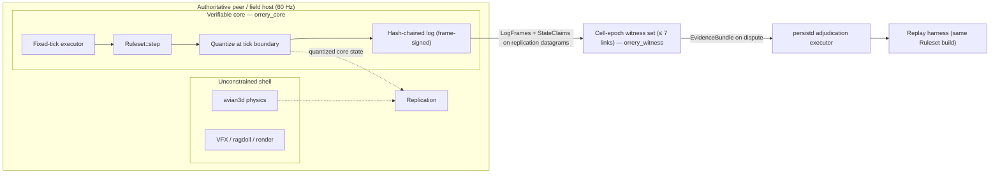
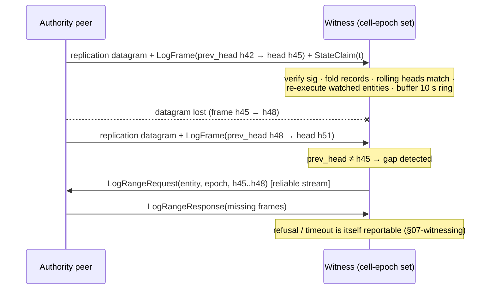

# 06 — The Verifiable Core

Orrery does not require determinism to keep peers in sync — it requires determinism to prove, after the fact, that an authority executed the rules it claimed to execute. This document specifies the **verifiable core**: the game-supplied `Ruleset` that isolates every rule touching persistent value into a pure, fixed-tick, deterministically replayable step function; the hard determinism rules that step function must obey; the tolerance-band comparator that separates platform drift from cheating; the PeerReview-style tamper-evident input log each authority maintains; and the headless replay harness that turns a disputed 3-second window into self-verifying evidence. It is implemented in `orrery_core` (engine-agnostic, no Bevy dependency) with wire types in `orrery_protocol`.

Normative source: [ADR-0009](adr/0009-verifiable-core.md) (context: [D10](adr/0010-witnessing.md), [D13](adr/0013-physics-and-determinism.md), and [D16](adr/0016-parameter-reference.md)).

> **Implementation status (2026-08-15).** `orrery_core` exists and is
> Bevy-free, with wire types in `orrery_protocol::verifiable`. Landed: the
> `Ruleset` contract (`CoreState`/`CoreInput`/`CoreEvent`, `step`,
> `classify_component`, `invariants`), the fixed 60 Hz executor with its
> VC-1/VC-3/VC-7 guarantees, `StateView` neighbour-read recording, the
> quantization lattice, the tolerance-band comparator, the hash-chained input
> log with per-frame signatures and claim chaining, the stage-1 invariant
> checks, the authority-side retained log with bundle assembly, the replay
> harness, and `verify_bundle`. `scripts/core-gates.sh` runs §8's static gates.
>
> Retention is implemented as this section describes: per-entity chain records,
> sent frames with the head transitions they commit to, claims, claim-tick
> snapshots and per-tick state hashes — floored at the 180-tick adjudication
> window, defaulting to 600. `AuthorityLog::assemble_bundle` is the producer
> side of `verify_bundle`: it is what makes a disputed window servable at all,
> and it refuses a window it cannot cover rather than serving a partial one.
> Retention holds at most two claims per tick and assembly opens a window at
> the claim the following claims chain from — see "One tick, two claims" below
> for why that choice is a verdict rather than bookkeeping.
>
> The quantization **lattice** is 1 mm and 1 mm/s — an invented default, an
> order of magnitude finer than D16's bands so quantization noise cannot itself
> trip the comparator. D16 fixes the bands, not the lattice.
>
> Deferred, each because its consumer or its subsystem does not exist yet: the
> `GeometryFrame`, `FieldFrame`, `FrameChange` and `TerrainPromotion` record
> sources (mutable terrain, environmental fields, nested-grid migration,
> terrain↔entity promotion); `validate_intent`, `park_tick` and `catch_up` on
> the trait (the intent path, the field host);
> log streaming and gap repair (`orrery_witness` + `orrery_net`); and the
> cross-platform CI matrix, for which the golden-vector and run-twice tests are
> in place but no Windows/macOS runner is. All are additive.

`verify_bundle` takes the authority's `NodeId` explicitly, which the §7 sketch
omits. An adjudicator always knows it from the lease row, and passing it beats
having the function infer which key a signature was meant to verify under —
that inference is exactly what a forged bundle would want it to make.

## 1. Why scoped determinism

Live synchronization in Orrery is per-entity-authority **state replication** ([03-replication.md](03-replication.md), [05-prediction-rollback.md](05-prediction-rollback.md)). As Gaffer's taxonomy puts it, state synchronization sends inputs *and* state, so ["perfect determinism is not required to stay in sync"](https://gafferongames.com/post/state_synchronization/) — a misprediction is corrected by the next authoritative snapshot, not by input replay from genesis. Contrast [deterministic lockstep](https://gafferongames.com/post/deterministic_lockstep/) ([GGPO](https://github.com/pond3r/ggpo)-family rollback), where determinism is *globally load-bearing*: every peer resimulates identical whole-world state, one divergent bit is a permanent desync, and resim cost scales with world size — [SnapNet's arithmetic](https://www.snapnet.dev/blog/netcode-architectures-part-2-rollback/) gives a 60 Hz game absorbing 300 ms roughly 1.1 ms/frame of simulation budget before the resim spiral of death.

That global requirement is not achievable on our stack, and we do not pretend otherwise. [rapier's `enhanced-determinism`](https://rapier.rs/docs/user_guides/rust/determinism/) claims cross-platform bit determinism only on strictly IEEE 754-2008 platforms and is mutually exclusive with `simd-stable`, `simd-nightly`, and `parallel`; [avian routes float math through libm at a ~10–30% cost, its `parallel` feature breaks even local determinism, and the maintainer's own position is that full cross-platform determinism "requires more testing"](https://deepwiki.com/avianphysics/avian/10.3-determinism). The one production system that ships trustworthy cross-platform deterministic rollback, Photon Quantum, got there by [abandoning IEEE floats for a bespoke Q48.16 fixed-point library](https://doc.photonengine.com/quantum/current/manual/quantum-ecs/fixed-point).

So determinism in Orrery is **scoped** on two axes:

- **What:** only rules whose outcomes touch persistent value (§2). Cosmetic simulation is unconstrained and keeps its SIMD/parallel fast paths (§D13).
- **When:** deterministic re-execution happens *out of band* — continuous witness re-execution of streamed logs (§6), replay adjudication (§D10), evidence self-verification, and parked-entity catch-up — never as the live sync mechanism. The authority runs the core inline at 60 Hz (its live execution *produces* the log), but no peer re-executes core rules to stay in sync. A determinism bug therefore degrades witnessing and adjudication quality; it cannot desync a session.

This inverts the lockstep failure economics: instead of bit-perfection being a liveness requirement across all hardware at all times, it is an *auditability* requirement over a bounded window (≤ 3 s / 180 ticks), for a small state subset, with tolerance bands absorbing residual float drift (§5).

## 2. What belongs in the core

`Ruleset::classify_component` (§3) makes this machine-checked, not aspirational. The classification also drives persistence write classes (§D11) and witness attention (§D10).

| Class | Contents | Constraints | Examples |
|---|---|---|---|
| **Core** | Rules whose outcomes touch persistent value | Full determinism rules (§4); logged, claimable, replayable; durable effects via intents | Movement limits (speed/accel caps, teleport legality), combat resolution (damage, death), loot rolls, crafting, trade preconditions, currency/item mutation, structure placement checks |
| **Bulk** | Persisted but not adjudicated | Quantized replication; bulk-class writes (§D11); invariant validators only | Contested physics objects (crates, vehicles) under weak authority, world-entity positions, terrain deltas |
| **Cosmetic** | Never persisted, never verified | None — full SIMD/parallel avian3d, nondeterminism welcome | Ragdolls, particles, debris, cloth, camera, VFX, audio, render interpolation |

Hard exclusions from the core: the renderer, VFX, cosmetic physics, and **the full physics engine**. Core movement uses framework-provided deterministic kinematic character movement plus integer combat math (§D13) — not avian/rapier. If a game rule needs "did the sword hit," it needs a deterministic capsule sweep in core math, not a rigid-body solver.



## 3. The `Ruleset` trait

Lives in `orrery_core`; linked identically into game clients, `orrery_field_host`, and the game's `orrery_persistd` binary (§D12 — games recompile `persistd` with their `Ruleset`). This sketch is the canonical statement of the trait — [10-crates.md](10-crates.md) defers to it. Sketch, not a full implementation:

```rust
// orrery_core — API sketch

pub struct Tick(pub u64); // universe-global 60 Hz tick (§D8)
pub struct TickRange { pub start: Tick, pub end: Tick } // half-open [start, end)

/// Ruleset version identity — the single identifier for a rules build,
/// pinned into handshakes, log frames, state claims, and evidence bundles.
/// Wire type in `orrery_protocol`. `version` is the game-assigned monotonic
/// rules version; `digest` is the 32-byte build digest.
pub struct RulesetId { pub version: u32, pub digest: [u8; 32] }

/// Canonical encoding: postcard with a fixed field order. Encode(x) is a
/// pure function of value — it is what gets hashed, so it must be canonical.
pub trait CoreCodec: Sized {
    fn encode(&self, out: &mut Vec<u8>);
    fn decode(bytes: &[u8]) -> Result<Self, CodecError>;
}

pub trait Ruleset: Send + Sync + 'static {
    /// Per-entity verifiable state — the ONLY state `step` may read or write.
    /// Discrete fields are integers/fixed-point; continuous fields are
    /// quantized wrappers (`QPos`, `QVel`) snapped at tick boundaries.
    type CoreState: CoreCodec + Clone + Quantized;

    /// One input to a core rule: player commands (move intent, attack,
    /// use-item) and inbound cross-entity CoreEvents from the previous tick.
    type CoreInput: CoreCodec + Clone;

    /// Deterministic outcome events (DamageApplied, LootRolled, ItemMoved).
    /// Cross-entity effects travel ONLY as events: an attacker's step emits
    /// DamageApplied(target); the target's step consumes it as an input at
    /// tick t+1. This keeps every entity's replay self-contained.
    type CoreEvent: CoreCodec;

    /// Persistence-critical operations submitted to the cluster (§D11).
    type Intent: CoreCodec;

    /// This build's version identity, pinned into every handshake, log
    /// frame, state claim, and evidence bundle.
    fn id(&self) -> RulesetId;

    /// Advance one 60 Hz tick for one entity. Pure: no I/O, no clocks, no
    /// globals; all reads through `view`, all randomness through `rng`.
    /// Re-executing with the same (state, inputs, rng) MUST reproduce the
    /// same delta and events, in the same order.
    fn step(
        &self,
        view: &mut StateView<'_, Self::CoreState>,
        inputs: &OrderedInputs<'_, Self::CoreInput>,
        rng: &mut TickRng,
    ) -> StepOutput<Self::CoreEvent>;

    /// Stateless precondition check for an intent. Same code runs at three
    /// sites: the submitting peer (outcome prediction), witnesses
    /// (attestation co-signing, §D10), and the persistence gateway
    /// (final validation before the FDB transaction, §D11).
    fn validate_intent(
        &self,
        view: &StateView<'_, Self::CoreState>,
        intent: &Self::Intent,
        at: Tick,
    ) -> IntentVerdict;

    /// One scheduled background tick for a parked entity (no live authority,
    /// state served from the hot tier, §D7). Runs cluster-side at low cadence.
    fn park_tick(
        &self,
        state: &mut Self::CoreState,
        at: Tick,
        rng: &mut TickRng,
    ) -> ParkOutcome; // Continue | Quiesce

    /// Bulk catch-up when a parked entity is loaded after `elapsed` offline
    /// ticks. Default: iterate `park_tick` up to a cap; games override with
    /// closed forms (crops grew, furnace smelted N items). Runs in persistd
    /// (lazy, on load) and field hosts (scheduled parked-cell catch-up).
    fn catch_up(
        &self,
        state: &mut Self::CoreState,
        elapsed: TickRange,
        rng: &mut RngFactory,
    ) -> CatchUpReport;

    /// Core | Bulk | Cosmetic for every registered replicated component (§2).
    /// Consulted by replication setup, the persistence uplink, and witnesses.
    fn classify_component(&self, component: ComponentTypeId) -> CoreClass;

    /// The stateless invariant validators (§D10 stage 1): speed/acceleration
    /// caps, teleport detection, fire/action rate limits, value-range checks.
    /// Run by every interested peer on received authoritative state
    /// ([07-witnessing.md](07-witnessing.md) §2) and by cell actors on
    /// inbound bulk diffs (§D11). Pure and cheap: O(received state), no
    /// history beyond the previous sample.
    fn invariants(&self) -> &[InvariantValidator];
}

pub enum CoreClass { Core, Bulk, Cosmetic }

pub struct StepOutput<E> {
    /// Quantized field writes recorded by the view (the wire/journal delta).
    pub delta: StateDelta,
    /// Emission order is part of determinism — Vec, never a set.
    pub events: Vec<E>,
}
```

Commentary on the load-bearing choices:

- **`StateView`** grants mutable access to *own* state only; neighbor state is read-only and snapshotted at tick start. Crucially, every neighbor read is **recorded** by the view into the tick's log as a `NeighborFrame` (the quantized fields actually read). A log segment is thereby a *closed* deterministic input set: replay never needs the neighbor's live state, and witnesses can cross-check recorded `NeighborFrame`s against that neighbor's own claims — an authority that feeds itself fabricated neighbor state to justify an outcome produces checkable evidence against itself. The view also reports **which entity is being stepped** (`view.entity()`), supplied by the executor rather than read out of the state, so a rule cannot claim to be an entity it is not. Rules need it to *attribute* what they emit: cross-entity effects travel as events consumed by their target, so an event that could not name its emitter would arrive anonymous — a game could resolve damage but never say who dealt it, and a kill's durable consequences (credit, loot, the ledger rows a §D11 intent writes) would have no account to attach to.
- **`StateView::geometry()`** is the only way core rules read terrain or static geometry. Every consulted section is **recorded** into the tick's log as a `GeometryFrame` — the quantized section keys plus the content hashes actually read — so a replay is closed over geometry exactly as `NeighborFrame`s close it over neighbors: the adjudicator cross-checks the recorded hashes against the journaled terrain state at that tick (§D11, [08-persistence.md](08-persistence.md)). Immutable, **content-hash-pinned static geometry** (shipped level content) may be read ambiently — its pinned hash makes it part of the build, not an input. Anything beyond that — notably line-of-sight against *mutable* terrain — is validated only as a non-core invariant (`invariants()`), never adjudicated by replay. [05-prediction-rollback.md](05-prediction-rollback.md)'s hit validation builds on this.
- **`StateView::fields()`** is the only way core rules read *environmental fields* — per-grid journaled state such as gravity vector fields or compartment atmosphere ([01-spatial-model.md](01-spatial-model.md) §13.6). Every consulted field region is **recorded** into the tick's log as a `FieldFrame` — the quantized region keys plus the content hashes actually read — closing replay over the environment exactly as `GeometryFrame`s close it over terrain: the adjudicator cross-checks recorded hashes against journaled field state at that tick. *Derived* fields (gravity from orbital state) are hash-pinned by their inputs and fully replay-adjudicable; *simulated* fields (a venting compartment) are replay-closed only if the game's field sim is itself deterministic with logged inputs — otherwise they are cluster-trusted state checked by `invariants()` only, the same tier as mutable-terrain LOS. Field math is continuous state: VC-6 floats, VC-7 quantization, §5 tolerance bands.
- **`OrderedInputs`** is the totally ordered input sequence for this entity and tick *as fixed by the authority's log* (§4, rule VC-2). Iteration order is the log order, always.
- **`TickRng`** is a `rand_chacha::ChaCha8Rng` seeded per entity per tick (§4, rule VC-3). `step` cannot construct any other RNG.
- **`validate_intent` is deliberately stateless and cheap** — it is the shared vocabulary between prediction, witnessing, and the gateway. The *authoritative* trade/loot mutation still only happens inside the cluster's FDB transaction; `validate_intent` is the precondition everyone can agree on.
- **`park_tick`/`catch_up`** exist because §D7 parks orphaned entities cluster-side and §D15 assigns parked-cell catch-up to field hosts. They obey the same determinism rules (seeded RNG per tick), so offline progression is as auditable as live play.
- **`classify_component`** is the single source of truth for §2's table; `orrery_persist_client` uses it to route bulk diffs vs. intents, `orrery_witness` uses it to decide what to watch.
- **`invariants()`** supplies the stage-1 witness checks. Every interested peer runs them on received state regardless of witness-set membership, and cell actors run them on inbound bulk diffs — mandatory in cells with fewer than N witness candidates, sampled elsewhere (§D11). They are the only validation most bulk-class state ever gets, which is why they live on the `Ruleset` rather than in `orrery_witness`.

> **Implementation status of the neighbour-read path.** The recording half of
> that bullet is not built. `RecordSource::NeighborFrame`
> (`orrery_protocol/src/verifiable.rs`) carries `neighbor: PersistId` and
> nothing else — not the quantized fields this section says it does — and no
> production code path constructs one; `Executor::step_entity` collects
> `TickOutcome::neighbor_reads` and no logger consumes it. Until a producer
> exists, **a neighbour read is unadjudicable**, not merely unrecorded: the
> adjudicator installs exactly one entity
> (`ReplayHarness::load_claimed_snapshot`), so its neighbour map is empty and a
> rule that consulted a neighbour resolves differently under replay than it did
> under play — a mismatch against an *honest* peer. `orrery_witness` states the
> same conclusion from the other end and isolates each entity for it; see the
> `Witness` type documentation in `crates/orrery_witness/src/witness.rs`
> ("Core steps should not read neighbours", ~line 346). Reference-game rules are
> written to that restriction: `orrery_games`' Skirmish splits a shot across the
> attacker's and the target's own steps rather than reading the target, and
> `orrery_games::scenario::adjudicate_isolated` is the harness clause that holds
> it there. The conformance corpus's reference ruleset was *not* so written
> until 2026-08-17 — its `Attack` rule branched on `view.neighbor(target)`, and
> the branch was invisible in the attacker's own state hash because the roll is
> folded into `roll_fold` before it, so `verify_bundle` would have exonerated a
> window whose emitted event was wrong. The check now lives in the target's own
> step; `scripts/core-gates.sh` §5 rejects the pattern statically in every gated
> ruleset, and the corpus's `combat-isolated` case runs one executor per entity
> so the same divergence would also change a golden chain. This is a gap in the
> implementation, not a narrowing of the decision
> above: neighbour reads remain permitted by §3 and by D9, and become
> adjudicable when `NeighborFrame` gains a producer that records the fields.

## 4. Determinism rules (hard requirements on core code)

These are contractual for any code reachable from `step`, `validate_intent`, `park_tick`, or `catch_up`. CI enforces what it can (§8); the rest is review discipline.

- **VC-1 — Fixed tick.** Core state advances only in `step`, at exactly 60 Hz (16.67 ms). No frame-rate-dependent math, no variable `dt` — `dt` is a compile-time constant. `Tick` is the **universe-global** u64 counter (§D8), anchored to the coordinator-issued universe epoch: all islands share absolute ticks and merges never re-base, so logs, claims, and RNG seeds all reference absolute ticks.
- **VC-2 — Total input order.** Inputs are totally ordered per entity per tick. The authority's log *is* the normative order: replay applies records in log sequence; validators check the order is *legal* (per-source sequence numbers monotonic, tick fields consistent) but never re-sort. Ties between sources are fixed by the canonical sort `(tick, source NodeId, source seq)` at log-append time.
- **VC-3 — Seeded RNG.** All randomness comes from `rand_chacha` (pinned 0.9, §D14) seeded from `(universe_seed, entity, tick)` — concretely, a 32-byte blake3 derivation `blake3::keyed_hash(universe_seed, persist_id ‖ tick)` (absolute universe ticks, so the derivation is stable across island merges). One RNG per entity per tick; draw order inside `step` is code order and therefore reproducible. No `thread_rng`, ever.
- **VC-4 — No unordered iteration.** No observable behavior may depend on `std::collections::HashMap`/`HashSet` iteration order (randomized per process). Core code uses `BTreeMap`/`BTreeSet`, sorted `Vec`s, or insertion-ordered maps with explicit sorted iteration. Enforced by a source scan in `scripts/core-gates.sh` over the gated crates' library sources (§8), not by clippy: `clippy.toml` is not merged across a workspace, so a single `disallowed_types` key at the root would fire on the ~175 legitimate `HashMap` uses in the services, and per-crate files would duplicate the setting forever.
- **VC-5 — Integer math for discrete outcomes.** Damage, currency, item counts, loot table indices, crafting results: integers or fixed-point, compared bit-exact. This is where the persistent value density lives, and it is exact on every platform by construction (the Quantum lesson, applied only where it pays).
- **VC-6 — libm floats for continuous state.** Position/velocity math uses [libm](https://deepwiki.com/avianphysics/avian/10.3-determinism)-backed transcendentals (no `std::f32::sin` etc.), no `fast-math` flags, a pinned codegen baseline for cluster builds. Continuous state is compared within tolerance bands (§5), never `==`.
- **VC-7 — Quantization at tick boundaries.** Continuous core state is snapped to its wire quantization at the end of every tick, and the quantized value is what the next tick reads (the §D8 quantize-both-sides rule, applied to the log). The state hash in a claim is the hash of the *quantized* canonical encoding, so a claim commits to exactly what replication and persistence saw.
- **VC-8 — No ambient inputs.** No wall-clock or monotonic clock reads, no thread timing, no thread-count or scheduling dependence, no pointer/address hashing, no environment or filesystem reads, no allocation-order dependence. Time is `Tick`; the outside world arrives only as logged inputs (`NeighborFrame`s, `GeometryFrame`s, `FieldFrame`s — §3). Sole ambient exception: immutable, content-hash-pinned static geometry, which is part of the build.

## 5. The tolerance-band comparator

Discrete state (VC-5) is compared bit-exact — any mismatch is a deviation, full stop. Continuous state uses bands, per §D16:

| Parameter | Default (D16) | Notes |
|---|---|---|
| ε_pos | **1 cm** | per-axis-combined positional error vs. replayed trajectory |
| ε_vel | **1 cm/s** | velocity error vs. replayed trajectory |
| Sustained window | **250 ms** (15 ticks) | error must exceed ε continuously this long to count |
| Hard-snap multiple | 8 × ε (invented default) | instantaneous escalation threshold, no sustain needed |

Comparator (in `orrery_core`, used by witnesses live and by the replay harness offline): per tick compute normalized error `e = max(|Δpos| / ε_pos, |Δvel| / ε_vel)` between claimed and computed state. A **violation** is `e > 1` for ≥ 15 consecutive ticks, or a single tick with `e > 8`. Both trajectories start from the same t₀ snapshot, so error within a window is accumulated deviation, not per-tick noise — a cheater riding just under the band gains at most ~ε of position per adjudicated window, which the quantization lattice (VC-7) then mostly erases.

**Why bands and not bit-equality.** (1) Peers, field hosts, and `persistd` run the *same `RulesetId`* but not necessarily the same binary: three OSes, two architectures, differing LLVM codegen can reorder non-associative float ops even under libm — bit-equality across those builds is exactly the promise [rapier scopes to IEEE-strict platforms](https://rapier.rs/docs/user_guides/rust/determinism/) and [avian declines to make](https://deepwiki.com/avianphysics/avian/10.3-determinism). (2) §D17 risk 3: false-positive strikes on honest players are the failure mode that kills witness-based trust; bands plus the sustain window keep platform drift and packet loss out of the strike pipeline. (3) Value analysis: nothing value-dense is continuous — a centimeter cannot mint currency, and everything that can is integer-exact under VC-5. Bands trade a bounded, gameplay-irrelevant slack in continuous state for zero cross-platform fragility in the adjudication path.

## 6. The tamper-evident log

Per §D9, every authority maintains a [PeerReview](https://www.cis.upenn.edu/~ahae/papers/peerreview-sosp07.pdf)-style tamper-evident log for each core entity it holds authority over. Wire types live in `orrery_protocol` (canonical postcard encoding):

```rust
// orrery_protocol — wire sketch

pub struct ChainHash(pub [u8; 32]);  // blake3
pub struct RollingHead(pub [u8; 8]); // truncated ChainHash — gap detection only

/// A nested-grid frame transform (01-spatial-model.md §13): the carrier
/// grid-root's origin and velocity relative to the destination grid at the
/// migration tick, quantized. Wire type in `orrery_protocol`.
pub struct FrameTransform { pub origin: QuantizedTransform, pub velocity: QVel }

pub enum RecordSource {
    /// A player/system command, with the source's own sequence number.
    Player { node: NodeId, input_seq: u32 },
    /// A CoreEvent emitted by another entity's step at tick-1 (§3).
    InboundEvent { from: PersistId },
    /// Quantized neighbor fields read by StateView this tick (§3).
    NeighborFrame { neighbor: PersistId },
    /// Geometry sections consulted via StateView::geometry() this tick (§3):
    /// quantized section keys + the content hashes actually read.
    GeometryFrame { sections: Vec<(SectionKey, [u8; 32])> },
    /// Environmental field regions consulted via StateView::fields() this
    /// tick (§3, [01-spatial-model.md](01-spatial-model.md) §13.6): quantized
    /// region keys + the content hashes actually read.
    FieldFrame { regions: Vec<(FieldKey, [u8; 32])> },
    /// Frame migration (nested grids, [01-spatial-model.md](01-spatial-model.md)
    /// §13.3): the coordinate basis changed at this tick. `transform` is the
    /// composed frame transform applied (derived from the carrier grid-root's
    /// replicated state at `tick`, which witnesses hold or can fetch); replay
    /// applies it before continuing, so tolerance-band comparison resumes in
    /// the new basis. Without this record a basis change is indistinguishable
    /// from a teleport cheat.
    FrameChange { from: GridId, to: GridId, tick: Tick, transform: FrameTransform },
    /// Terrain↔entity class transition binding record
    /// ([08-persistence.md](08-persistence.md) §10.1). `key` is a stable `SectionKey`
    /// (grid-anchored, `PersistId`-derived — §10.1.3) or a
    /// `TerrainChunkRef` listing a multi-chunk extent; the payload is one of
    /// `Pin{ mint: PersistId, intent_id, hash_in, tick }`,
    /// `Promote{ section, intent_id, seed_state_hash, tick }`, or
    /// `Demote{ section, intent_id, tick }`.
    ///
    /// It appears in TWO logs: the interactor's (its step emitted the
    /// event, so the record is part of that entity's closed input set) and
    /// the promoted entity's own chain (the entity has a `PersistId` from
    /// `tick_pin` onward; ticks at which it is pinned-but-not-promoted it
    /// logs the seam record and nothing else). Replay semantics per
    /// direction:
    ///
    /// - Before `Pin`: the section is geometry. Reads at those ticks are
    ///   recorded as `GeometryFrame`; the adjudicator cross-checks them
    ///   against journaled terrain, exactly as today.
    /// - Pinned but not yet `Promote`d: the section's `section_pin/` row
    ///   forbids further geometry mutation; core rules that would read or
    ///   mutate it MUST resolve through `NeighborFrame { neighbor: section }`
    ///   reads of the entity instead. The adjudicator cross-checks those
    ///   reads against the section's own chain.
    /// - At/after `Promote` (until `Demote`): the entity's chain carries
    ///   ordinary records; `seed_state_hash` binds the chain to the
    ///   journaled `TerrainPromotion` checkpoint image — the adjudicator
    ///   verifies the image hash against the `world/` row, and pre-promote
    ///   geometry against `GeometryFrame` hashes. A window may span the
    ///   seam: the seam record switches read type and evidence source at a
    ///   known tick.
    /// - `Demote` folds the entity back to geometry (§10.1.8); ticks after
    ///   it read as `GeometryFrame` again.
    TerrainPromotion { key: SectionRef },
    /// Chain-epoch boundary: embeds prior head + lease proof (§9).
    AuthorityChange { prev_head: ChainHash, lease_seq: u64 },
}

pub struct InputRecord {
    pub tick_off: u16,        // offset from the frame's shared tick base —
                              // sparse: only ticks with activity appear,
                              // ~8 B per active tick
    pub seq: u16,             // position in this tick's total order (VC-2)
    pub source: RecordSource, // varint-encoded ids
    pub payload: Bytes,       // canonical CoreCodec bytes
}
// Chain rule: h_i = blake3(h_{i-1} ‖ encode(record_i)). One UNSIGNED chain
// per (entity, chain_epoch); epoch increments on authority handoff.
// Records are never individually signed — the frame signature covers them.

/// Per-entity slice inside a LogFrame. Heads on the wire are truncated
/// 8-byte rolling heads (gap detection); receivers recompute the full
/// 32-byte heads by folding, and the 2 Hz StateClaims commit to them.
pub struct EntitySlice {
    pub entity: PersistId,          // varint
    pub chain_epoch: u32,
    pub prev_head: RollingHead,     // chain head before this slice
    pub records: Vec<InputRecord>,  // tick base = frame.first_tick
    pub head: RollingHead,          // after folding `records`
}

/// ONE frame per send per link, covering ALL core entities this sender
/// holds authority over — batching the sim ticks since the last send
/// (typically 3 at 60 Hz sim / 20 Hz send). ONE signature per frame:
/// preimage = ruleset ‖ tick range ‖ every entity's full 32-byte
/// (prev_head, head) pair — so signing cost is per-link, not per-entity.
pub struct LogFrame {
    pub ruleset: RulesetId,     // fixed per session (handshake); in preimage
    pub first_tick: Tick,
    pub tick_count: u16,        // half-open [first_tick, first_tick + count)
    pub entities: Vec<EntitySlice>,
    pub sig: Ed25519Signature,  // authority NodeId key, preimage above
}

/// Periodic commitment to quantized core state, one per entity. Default
/// cadence: every 30 ticks (500 ms) — 2 Hz — phase-staggered per entity by
/// blake3(entity) % 30. Carries the FULL 32-byte heads.
pub struct StateClaim {
    pub entity: PersistId,
    pub chain_epoch: u32,
    pub tick: Tick,
    pub input_head: ChainHash,      // full input-chain head at this tick
    pub state_hash: [u8; 32],       // blake3(canonical quantized CoreState)
    pub prev_claim: [u8; 32],       // hash of previous StateClaim (claim chain)
    pub ruleset: RulesetId,
    pub sig: Ed25519Signature,
}
```

Design points:

- **Signing key = transport identity.** iroh `NodeId`s are ed25519 public keys (§D3), so log signatures are made with the same key the peer dials with — no extra PKI. Account binding of NodeIds (§D12, `orrery_identity`) makes signatures attributable to a strikeable identity.
- **Signature economics.** Per-entity chains are unsigned per-record; **one** frame signature per send per link covers every authored entity's `(prev_head, head)` transition, so sender signing cost is flat in entity count — 20 Hz × ≤ 7 witness links = **≤ 140 signs/s** (~2–3 ms/s of CPU, §10). Because the preimage contains the full 32-byte heads, a witness verifies by folding the records to recompute the heads, then checking the signature; each `StateClaim` signature pins the full chain head at claim ticks. Equivocation (two signed frames or claims asserting different heads for the same `(entity, epoch, prev_head)`) is itself self-proving evidence.
- **Claims are hashes, not snapshots.** The authority retains the full quantized `CoreState` snapshot at each claim tick within the retention window and serves it on demand; the claim hash lets everyone verify the served snapshot is the one committed to at the time.
- **Retention.** Per-entity ring buffer of chain records, claims, and claim-tick snapshots (plus the sent frame signatures with their head pairs, so any window can be re-served). Hard floor: the **adjudication window max, 3 s / 180 ticks** (§D16). Default: 600 ticks (10 s), giving slack for dispute-request round trips and claim alignment. Memory order-of-magnitude: ~tens of KB per entity.
- **One tick, two claims.** A legitimate producer signs a tick once: the claim chain is a total order over *its own* claims, and a second claim at a tick already claimed is either a producer bug or equivocation. Both happen. p1-swarm anchored tick 0 and then let the run loop claim tick 0 again — same entity, same state hash, a different `prev_claim`, and therefore a different `claim_hash` — and every later claim chained from the second. Retention is where that becomes dangerous, because **which claim opens a window decides a verdict**: a bundle whose `t0_claim` and `disputed_claims` do not chain is read by `verify_bundle` as the authority having equivocated about its own history, so an assembler that took the *first* claim it held at `window_start` convicted honest peers of a `DiscreteMismatch` they never committed. The rule, implemented in `orrery_core::store`:
  - **Retention keeps the conflicting pair, capped at two claims per tick** (earliest and newest; an identical repeat is idempotent). At record time the log cannot know which claim the producer went on to chain from, and discarding one is how it picks wrong. Two is also what it takes to *hold* a producer to a double-signed tick — a conflicting pair is self-proving equivocation evidence, per the signature-economics point above — while the cap keeps retention that a subject controls (a witness retains whatever is signed at it) bounded.
  - **Assembly chooses by chain consistency, not by arrival.** `assemble_bundle` opens the window at the claim the *following retained claims actually chain from*, and emits one claim per tick. A snapshot outranks chaining in that choice: an unopenable window silences a witness entirely, whereas a break in an openable one is adjudicable evidence. A claim recorded without a snapshot inherits a sibling's when both commit to the same `state_hash` — the snapshot is a commitment to state, not to a chain position, and `verify_bundle` re-checks it against the claim's own `state_hash`, so sharing it is verifiable rather than assumed. This is the witness case exactly: it is handed a snapshot with the anchor and none with the claims that stream in behind it.
  - **A break no retained claim explains still reaches the bundle**, at the tick where it happens, exactly as it did before selection existed. Selection removes convictions the *store* manufactured; it launders nothing the producer did.
  - **The duplicate is reported, not just resolved.** `record_claim` returns `ClaimRecord::{Recorded, Repeated, Conflict}` and the log counts conflicting ticks (`conflicting_claims()`). A store that quietly picks one is a store that hides a producer bug: p1-swarm's went unseen for all of P4 and surfaced by accident, because shadow mode meant no bundle of its had ever been adjudicated. The same reasoning covers `record_tick_hash` (last write wins, differing overwrites counted — a tick hash is reporter-supplied and never judged, so it cannot convict) and `record_frame` (a byte-identical repeat is dropped: it would fail assembly's contiguity check and mute an honest witness).

  The rejected alternatives, for the next reader: *replace by tick at record time* is the smallest change and is wrong for the direction the store cannot see — it assumes the producer chained forward from its newest signature, which is true of the producers in this tree and is not a property the store can check. *Take the newest at `window_start`* fixes only `t0`; a duplicate at an interior tick still breaks the chain, and in the witness case the newest claim is the one arriving without a snapshot. Neither leaves any trace of the fault.
- **Streaming.** Frames and claims piggyback on the 20 Hz replication datagrams — but **only on links to cell-epoch witness-set members** (≤ 7 links, coordinator-seeded per §D10; in the promoted regime, to the field host only), never the whole interest set. Witnesses get the log *before* they have any reason to want it, and they use it continuously: witness-set members **re-execute the streamed input logs** for their watched entities (kinematic core step, ~µs/tick) — this is the §D10 stage-1 witness signal for core entities outside any observer's predicted set, which prediction error alone does not cover. Peers outside the witness set contribute only the stateless `invariants()` checks plus prediction error during interactions. Datagram loss is tolerated: a receiver detecting a chain gap (rolling-head mismatch) repairs it via `LogRangeRequest`/`Response` over the reliable control stream. Bandwidth: a typical sender (1–2 authored core entities) costs ~20–30 kb/s per witness link, ~0.15–0.2 Mb/s total at N = 7; the worst case (8 authored entities) is ~60 kb/s per link, ~0.4 Mb/s total — noise against the ≤ 1 Mbps upload budget (§D6).



## 7. Replay harness and evidence self-verification

The harness lives in `orrery_core`: **headless, no Bevy**, `no_std`-adjacent discipline (allocator yes, OS services no). The same harness — and the same `Ruleset` build — is linked into game clients (witness-side re-execution), `orrery_field_host`, and `orrery_persistd` (adjudication executor, §D12). Bevy peers run core entities through a thin ECS adapter that extracts `CoreState` into `StateView` storage each tick; the harness bypasses the adapter entirely.

```rust
// orrery_core::replay — API sketch

pub struct ReplayHarness<R: Ruleset> { /* ruleset, seed, StateView storage */ }

impl<R: Ruleset> ReplayHarness<R> {
    pub fn new(ruleset: R, universe_seed: UniverseSeed) -> Self;

    /// Verify snapshot bytes against a claim, then load. Fails on hash
    /// mismatch — the bundle is rejected before any simulation runs.
    pub fn load_claimed_snapshot(
        &mut self,
        claim: &StateClaim,
        snapshot_bytes: &[u8],
    ) -> Result<(), ReplayError>;

    /// Re-execute a window from logged frames. Verifies signatures, chain
    /// continuity, and input-order legality (VC-2) as it goes; produces the
    /// per-tick computed state hashes for comparison.
    pub fn replay(
        &mut self,
        frames: &[LogFrame],
        window: TickRange,
    ) -> Result<ReplayTrace, ReplayError>;
}

pub struct EvidenceBundle {
    pub ruleset: RulesetId,
    pub protocol: ProtocolVersion,
    pub entity: PersistId,
    pub window: TickRange,             // ≤ 180 ticks, ends at a claim tick
    pub t0_claim: StateClaim,
    pub t0_snapshot: Bytes,            // MANDATORY; blake3(t0_snapshot) ==
                                       // t0_claim.state_hash
    pub frames: Vec<LogFrame>,         // contiguous chain for `entity`,
                                       // t0..window.end
    pub sibling_heads: Vec<Vec<(ChainHash, ChainHash)>>, // full (prev_head,
                                       // head) pairs for each frame's OTHER
                                       // entities (the reporter folded those
                                       // chains too), reconstructing each
                                       // frame's signature preimage
    pub disputed_claims: Vec<StateClaim>, // what the authority signed
    pub claimed_hashes: Vec<StateHash>,   // per tick: the authority's asserted
                                          // state trajectory
    pub computed_hashes: Vec<StateHash>,  // per tick: the reporter's
                                          // re-execution — lets the
                                          // adjudicator jump straight to the
                                          // first divergent tick
}

/// Pure function: any party holding the same Ruleset build reaches the same
/// verdict from the same bundle. No trust in the reporter is required.
pub fn verify_bundle<R: Ruleset>(ruleset: &R, bundle: &EvidenceBundle) -> Verdict;

pub enum Verdict {
    /// Deviation proven: first offending tick + class of mismatch.
    Confirms { at: Tick, kind: DeviationKind },   // DiscreteMismatch | ContinuousOutOfBand
    /// Re-execution matches claims within bands: reporter's view was wrong
    /// (or platform drift) — no strike; feeds ε calibration telemetry.
    Exonerates,
    /// Provable fabrication by the reporter — e.g. a subject signature the
    /// reporter attested as verified fails verification. Strikes the REPORTER.
    EvidenceForged(ForgeryProof),
    /// The adjudicator cannot decide: unavailable ruleset build (§9),
    /// retention miss, oversize window, or a malformed bundle that is not
    /// provably fabricated. NEVER a strike — rate-limited per reporting
    /// account instead.
    Unadjudicable(UnadjudicableReason),
}
```

`verify_bundle` is the whole trust story in one function: check signatures against the authority's NodeId, check chain continuity from `t0_claim.input_head`, check the snapshot hash, re-execute deterministically with VC-3 RNG, cross-check recorded `GeometryFrame` hashes against the journaled terrain state at each tick (§3, §D11), compare with §5's comparator. A bundle either proves deviation to *anyone* or it proves nothing — which is why §D10 can let the cluster re-execute evidence itself and issue verdicts without believing witnesses. The two failure verdicts are deliberately asymmetric: `EvidenceForged` requires *proof* of fabrication and strikes the reporter; `Unadjudicable` covers everything the adjudicator cannot decide and never strikes anyone — bogus-report pressure is absorbed by per-account rate limits, not by punishing honest reporters for cluster-side gaps. Adjudication verdict handling (authority correction broadcast, write annulment, strikes) is specified in [07-witnessing.md](07-witnessing.md); intent-side consequences in [08-persistence.md](08-persistence.md).

## 8. Testing strategy

Determinism is a property you lose silently; the test program is designed around catching drift *before* it reaches the strike pipeline.

- **Cross-platform replay corpus in CI.** A growing corpus of recorded `(t0_snapshot, LogFrame[])` windows — seeded from playtests and every real adjudication — replayed on the full target matrix (x86_64 Linux/Windows/macOS, aarch64 macOS/Linux). Discrete state hashes must be bit-identical across all targets; continuous state must sit inside §5 bands with wide margin. A corpus regression bisects to the offending commit.
- **Golden-state fuzzing.** Property tests (proptest) generate random legal input sequences against the game `Ruleset`. Each case runs twice in-process — any hash divergence between identical runs is an instant VC-4/VC-8 violation (HashMap ordering, address hashing, uninit reads) — then across the CI matrix comparing per-tick state hashes, shrinking to a minimal diverging input on failure.
- **Determinism canaries in shadow mode.** In production, witnesses re-execute a random sample of *healthy*, undisputed windows and report band-exceeding drift as telemetry only — never strikes. This measures the real-world cross-platform drift distribution and calibrates ε before the strike pipeline leaves shadow mode (§D10.5, §D17 risk 3). Canary drift trending toward ε is a release blocker.
- **Static gates.** `scripts/core-gates.sh`, run per-commit by CI. It scans the library sources of the gated crates — `orrery_core`, `orrery_games` and `orrery_conformance`, the reference ruleset the corpus executes — for std `HashMap`/`HashSet` (VC-4), ambient inputs (VC-8: `Instant::now`, `SystemTime::now`, `thread_rng`, `from_entropy`, `rand::random`, `OsRng`, `from_os_rng`, `std::env::var`, `.elapsed()`), std float transcendentals in either spelling (VC-6: `f64::sqrt(x)` *and* `x.sqrt()`), and live neighbour reads inside a `Ruleset` (§3); and it checks that every gated crate builds without Bevy in its dependency graph. `orrery_conformance`'s corpus CLI (`src/main.rs`) is outside the scan — it reads argv and writes report files by design. Two exclusions are deliberate and load-bearing: `round`/`floor`/`ceil`/`trunc`/`abs`/`mul_add` are IEEE-754 exact and are what the VC-7 quantization lattice is built from, so gating them would forbid the code that makes continuous state comparable. This is a grep and not clippy `disallowed_types`/`disallowed_methods` for the reason given under VC-4: clippy configuration does not compose across a workspace. What the grep cannot catch is caught by the crates' own tests, which fail on the symptom (a diverging state hash) rather than on a spelling.

## 9. Failure modes and edge cases

- **Authority handoff mid-chain.** Handoff (§D7, [04-authority.md](04-authority.md)) increments `chain_epoch`; the new authority's first record is `AuthorityChange { prev_head, lease_seq }`, binding the new chain to the old head and the registrar's lease sequence. Adjudication windows never span epochs — each authority answers only for its own segment.
- **Frame migration mid-chain.** A nested-grid crossing (EVA, docking — [01-spatial-model.md](01-spatial-model.md) §13.3) changes the coordinate basis without changing authority: the `FrameChange` record (§6) carries the composed transform, and the replay harness applies it at that tick before continuing comparison. A window *may* span a frame change (unlike an authority change) — the transform is part of the evidence, and witnesses cross-check it against the carrier grid-root's replicated state at that tick. A claimed migration whose transform disagrees with the carrier's signed state is a discrete mismatch.
- **Promotion/demotion mid-chain.** A terrain↔entity class transition ([08-persistence.md](08-persistence.md) §10.1) changes the *read type* of a section's state without changing its identity: the `TerrainPromotion` record (§6) is the seam, and the replay harness switches the section's resolution from geometry-hash cross-check (before `Pin`) to neighbor-read cross-check against the section's own chain (pinned onward), and back at `Demote`. A window *may* span the seam: the harness consumes the interactor's frames, the section's own chain (existence proven by the seam records' `intent_id`s — the adjudicator confirms each against FDB `intent/` rows), and the journaled `TerrainDelta` history up to `tick_pin` for geometry cross-checks. The transition intents are the same tamper-evident substrate as the logs themselves (witness-attested, FDB-committed), so a fabricated seam record — one without a committed intent — is a discrete mismatch, and a suppressed seam (an authority claiming damage it never pinned) fails at the interactor's own log. Retention asymmetry: the interactor's log covers only its own window; the section's history lives in the journal (deltas up to `tick_pin`), its own chain frames (from `tick_pin`, 10 s default retention like any core entity), and FDB `world/` + `section_pin/` rows. A dispute window older than the section's live retention is replayable from journal + FDB state — the seam design keeps every epoch of a section's history in *some* durable, hash-checkable store.
- **A shot straddling the seam.** The common case (fire before pin, damage after) resolves to two independent windows — pre-pin the target's authority validated LOS as an ordinary invariant against its terrain copy ([05-prediction-rollback.md](05-prediction-rollback.md) §7); post-pin the damage is logged core state on the entity, fully adjudicable ([05-prediction-rollback.md](05-prediction-rollback.md) §7.2 worked example). The rare case (claim arrives with `pin_pending`) is governed by the §7.2 barrier: the target's authority parks the claim rather than guessing at the geometry epoch, and the verdict lands after `Promote` commits.
- **Withheld or missing log.** Retention (§6) guarantees a compliant authority can serve any ≤ 180-tick window. Timeout or refusal on a `LogRangeRequest` is PeerReview's *verifiable omission*: the request and non-response are themselves reportable, escalating per [07-witnessing.md](07-witnessing.md) — silence is not an escape hatch.
- **Equivocation.** Two signed frames or claims at the same chain position with different contents constitute a complete evidence bundle by themselves; no replay needed.
- **Ruleset version skew.** Bundles pin their `RulesetId`; the adjudicator must execute that exact build. The cluster retains the last **3** ruleset builds as version-keyed sidecar adjudication workers (§D12), and the adjudication executor routes each bundle to the worker matching its `RulesetId` — evidence pinned to older rules stays adjudicable across hotfixes. A bundle older than retention yields `Verdict::Unadjudicable` → in-session quorum correction still applies, but no strike (rate-limited per reporting account, §7). (Distribution of game `Ruleset`s to the cluster is §D17 open question 6.)
- **Seed predictability.** VC-3 seeds are computable by anyone holding `universe_seed` — including the authority itself, which for player entities is the player. Rolls where advance knowledge matters (unopened loot) must not be core-side rolls at all: §D10 already classifies them as cluster-side secret state, revealed late. Core RNG is for *auditable* randomness, not *secret* randomness.
- **Sub-band drift farming.** An authority injecting just-under-ε error each window gains at most ~1 cm per adjudicated window against a replayed trajectory, and VC-7 quantization re-snaps state each tick. Residual exposure is positional only and value-free by the §2 classification; anything that converts position to value (a trade-radius check, a capture point) must do the check in integer/fixed-point on quantized coordinates — making it exact.
- **Rollback interaction.** Authorities never roll back their own authoritative core entities — the log is straight-line by construction. Remote inputs arriving late are applied (and logged) at the tick they arrive; VC-2 makes the applied order normative, and [05-prediction-rollback.md](05-prediction-rollback.md)'s reconciliation handles presentation.

## 10. Performance budget (hashing + signing at 60 Hz)

Assumed worst case: a peer holding authority over 8 core entities, 20 Hz send rate, ≤ 7 witness links, claims at 2 Hz per entity. Order-of-magnitude figures for one modern desktop core (blake3 short-input ≈ 0.1 µs; ed25519 sign ≈ 20 µs, verify ≈ 45 µs); these are budget targets to validate in CI benches, not vendor promises.

| Operation | Unit cost | Rate | CPU/s |
|---|---|---|---|
| blake3 record chaining (~100 B/record) | ~0.1 µs | 8 ent × ~4 rec × 60 Hz ≈ 1.9 k/s | ~0.2 ms |
| blake3 state hash at claims (~0.5 KB) | ~0.5 µs | 8 × 2 Hz | negligible |
| ed25519 sign `LogFrame` (one per send per link) | ~20 µs | 20 Hz × ≤ 7 links = **≤ 140/s** | ~2.8 ms |
| ed25519 sign `StateClaim` | ~20 µs | 8 × 2 Hz = 16/s | ~0.3 ms |
| **Sender total** | | | **~3 ms/s ≈ 0.3% of one core (signing ~2–3 ms/s) — flat in entity count (one frame covers all authored entities)** |
| Witness: verify frames | ~45 µs | 20 frames/s per watched authority | ~0.9 ms/s per authority; halved with ed25519 batch verification |
| Witness: re-execute watched entities (kinematic core step) | ~1 µs/tick | 60 ticks/s per watched entity | ~0.06 ms/s per entity |

Budget rule: hashing on the sim thread ≤ 0.05 ms per 16.67 ms tick; signing, verification, and witness re-execution are deferred off the sim thread (signature timing is not determinism-relevant — frames are signed when sent, not when simulated). Field hosts holding hot cells verify every peer's stream (promoted regime: peers log to the field host only) and scale linearly; they sit in datacenters where this is irrelevant. Adjudication replay cost: a full 180-tick window for one entity is 180 `step` calls on compact state — tens of microseconds per step, target **< 5 ms per bundle** in `persistd`, which is why §D10 can afford cluster-side re-execution of every filed report and spot replays for provisional commits.
