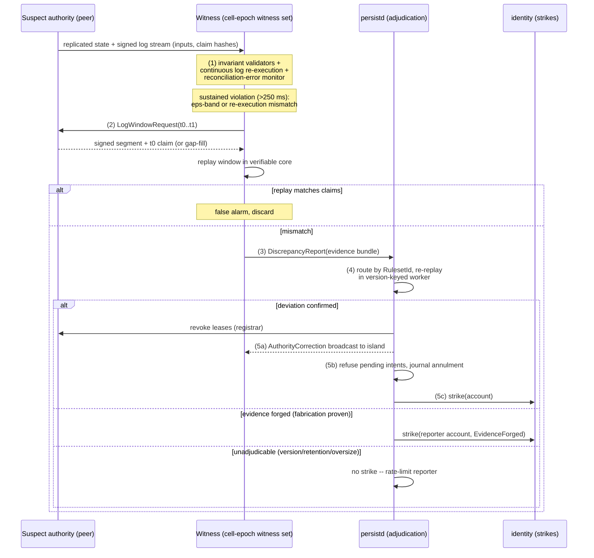

# Witnessing & Anti-Cheat

In a per-entity-authority P2P world every peer is a tiny server, and a tiny server can lie. Orrery does not pretend to solve cheating in general; it partitions the threat space into what is *prevented by construction* (durable-state forgery), what is *detected and punished* (rule violations in authoritative state), and what is *explicitly out of scope for witnessing* (legal-input cheats, information leaks) and delegated to statistical telemetry. The detection half is "amended witnessing": machinery peers are already running does the witnessing. For entities an observer predicts and reconciles against, a cheat surfaces as a prediction error that refuses to go away; for authoritative core entities outside anyone's predicted set, the **cell-epoch witness set continuously re-executes the streamed signed input logs** (a ~µs/tick kinematic replay) against the authority's own state claims; and stateless invariant validators screen everything every peer receives. This document specifies the threat model, the passive detection pipeline, replay adjudication, witness-attested persistence writes, the strike system, and the residual limits we accept.

Normative source: [ADR-0010](adr/0010-witnessing.md), elaborating details from [D8](adr/0008-prediction-rollback-interpolation.md), [D9](adr/0009-verifiable-core.md), [D11](adr/0011-persistence.md), and [D12](adr/0012-backend-services.md).

## 1. Threat model

The table is ordered by how completely the architecture answers each class. "Witnessing" here means the full D10 pipeline: invariant validators, reconciliation-error monitoring, continuous witness-set log re-execution, and replay adjudication.

| Attack class | Example | Detectable by witnessing? | Response |
|---|---|---|---|
| **Rule violations in authoritative state** | speed/teleport hacks, inflated damage, item spawning, cooldown skips, impossible resource ticks | **Yes.** Violates invariants or diverges from deterministic replay of the signed input log. | Authority-correction broadcast; durable write refusal/annulment; account strike (§3, §5). |
| **Legal-input cheats** | aimbot, triggerbot, scripted perfect parries | **No.** The inputs satisfy every rule; replay reproduces them exactly. | Telemetry/statistical detection only (§6). |
| **Information exposure** | ESP, radar, fog-of-war removal | **No.** Peers necessarily receive nearby state to simulate and predict it. | Exposure minimization: server-side secrets, late reveal, interest-set scoping (§7, §8). |
| **Peer IP exposure** | harvesting interest-set peers' network addresses via a modified client | **No.** Direct P2P connectivity requires address exchange. | Optional relay-only privacy mode — traffic pinned to the relay fleet at a latency cost (Valve SDR precedent) (§8). |
| **Targeted peer DoS** | booter attacks knocking an opponent offline as a gameplay weapon | **No.** At protocol level the victim's outage is indistinguishable from a crash. | Reconnection grace before orphan redistribution of player-bound entities; combat-log-protection `Ruleset` hook; telemetry correlating disconnects with in-game adversaries; relay-only mode removes the target IP (§8). |
| **Timing manipulation** | lag switching, fast-forward, tick-rate skew | **Partially.** Signed logs bind inputs to ticks; sustained skew and future-tick claims are detectable, but network jitter is a confound. | Escalation only on sustained patterns; suspect's writes degrade to full cluster-side validation. |
| **Persistent-state forgery** | duping, currency injection, trade reneging | **Prevented by design.** The persistence cluster is the sole writer of durable truth; critical operations are serializable, witness-attested intents (D11). | Intent refused *before* commit; nothing to correct after the fact. |
| **Identity abuse** | Sybil accounts to stack witness sets or launder strikes | **Partially.** Witnessing cannot see it; the identity layer prices it. | Account acquisition cost, witness eligibility gates, per-account dedup (§4.1, §5). |

Three precedents anchor the "No" and "Prevented" rows. Information exposure is inherent to any client-holds-state topology: deterministic-lockstep RTSes compute fog of war client-side because every client must hold full state, which is why [StarCraft-lineage maphacks are architecturally unpreventable](https://news.ycombinator.com/item?id=34395153) ([discussion of the client-server contrast](https://news.ycombinator.com/item?id=7538428)); a P2P interest set is the same situation at smaller radius. Persistent-state forgery is the one slice with a proven fix: [Diablo II's closed realms](https://classic.battle.net/diablo2exp/faq/multiplayer.shtml) protected server-stored characters while open (client-stored) characters were freely duped — the canonical demonstration that server-side storage plus validation is the effective anti-duping control ([analysis](https://gist.github.com/amtal/bf941bde443eefc7d4626fd439d7f480)). The counter-example is [GTA Online's decade of "hacked money" with retroactive correction](https://www.sportskeeda.com/gta/gta-online-money-generators-illegal-will-get-account-wiped-reset): validating after commit is too late and too weak. Orrery validates *before* commit, always. [Destiny's persistence path](https://gist.github.com/nessus42/df399f31e4ab41192cbd51b32e9d7b73) — "all changes to persistent character data are communicated directly to the secure data center with no peer-to-peer interference" — is the shipped model D11 follows. Unity's own docs concede that distributed authority ["is not a reliable authority mode for games where local game instances may be attempting to cheat"](https://docs.unity3d.com/Packages/com.unity.netcode.gameobjects@2.11/manual/terms-concepts/distributed-authority.html); Orrery's answer is not to trust the instances but to make their claims *auditable*.

## 2. Lineage: PeerReview

The detection machinery is a direct descendant of [PeerReview (SOSP 2007)](https://dl.acm.org/doi/10.1145/1294261.1294279): each node keeps a tamper-evident, hash-chained, signed log of the nondeterministic events (here: per-tick inputs plus periodic state-claim hashes, per D9); any auditor holding a log segment and a start state can deterministically re-execute the node's reference implementation (here: the `Ruleset` verifiable core) and compare outcomes; a mismatch yields *unforgeable evidence* — the signed log itself convicts its author, and a forged accusation is impossible because the accused's signature won't verify. Orrery scopes this down from PeerReview's full-node accountability to the verifiable core only (persistent-value-touching rules), makes auditing *continuous but cheap* (witness-set members re-execute the streamed logs as they arrive, and prediction errors during interaction arm escalation — no scheduled full audits), and centralizes final adjudication in the cluster, which links the same `Ruleset` and therefore reproduces the replay bit-for-bit for discrete outcomes and within tolerance bands for continuous state.

> **Implementation status (2026-08-16).** Stages 1–3 are implemented in
> `orrery_witness` and stage 4 in `orrery_persistd::AdjudicationExecutor`.
> Landed: stage-1 stateless invariants, stage-1c continuous log re-execution
> against the subject's own signed claims, gap detection as a
> `LogRangeRequest` rather than an accusation, escalation bounded at the
> 180-tick window, `DiscrepancyReport` assembly and signing, and version-keyed
> routing over the last three retained rules builds.
>
> **Shadow mode is the default** (`WitnessConfig::shadow_mode = true`): every
> check runs, every detection is counted, and nothing is filed. D17 risk 3 is
> that false-positive strikes on honest players kill witness-based trust, and
> no amount of correct detection logic substitutes for measuring the real
> cross-platform drift distribution first.
>
> **A verdict rests only on what the subject signed.** The bundle's
> `claimed_hashes`/`computed_hashes` are the *reporter's* per-tick numbers and
> carry no subject signature; judging on them would let a reporter convict an
> honest peer by inventing numbers. They are advisory locators, and the
> `StateClaim`s are what an authority is held to — which is why a window must
> end at a claim tick.
>
> Not yet here: transport. Nothing streams frames or claims, and gap repair
> surfaces as a request the caller is expected to send — that wiring lives in
> `orrery_net` alongside the Bevy plugin adapter, and the two land together.
> Stage 5 responses (authority correction, annulment, strikes) and §4
> attestation are P5.

## 3. The passive pipeline

The pipeline runs in `orrery_witness` (client side), `orrery_core` (replay), and `orrery_persistd`'s adjudication executor (cluster side). Numbered stages:

1. **Continuous cheap checks.** Every interested peer runs (a) *stateless invariant validators* on received authoritative state — speed and acceleration caps, teleport detection (displacement vs. max velocity × Δtick), fire/action rate limits, value-range checks (health ≤ max, negative-quantity rejection) — supplied by the game as `Ruleset::invariants()`; and (b) the *reconciliation-error monitor* from `orrery_predict` (D8) for entities in its own predicted set: predicted-vs-authoritative error per entity, compared against the D9 tolerance bands (ε_pos = 1 cm, ε_vel = 1 cm/s). In addition, (c) **continuous log re-execution**: members of the cell-epoch witness set (≤ 7 peers, §4.1) re-execute the streamed signed input logs for their watched core entities tick by tick — the kinematic core step costs ~µs/tick — and compare computed state against the authority's 2 Hz `StateClaim` hashes. (c) is *the* witness signal for non-predicted entities: a remote player nobody is interacting with is still audited continuously, which prediction error alone cannot provide; peers outside the witness set contribute only (a) plus (b) during interactions. (a) and (b) are O(received state); (c) adds ~µs/tick per watched entity. No extra traffic for any of them.
2. **Escalation.** A hard invariant breach, or tolerance-band violation *sustained past the 250 ms window* (not a single spike — spikes are packet loss), arms an audit. The observer requests the disputed window's signed input-log segment and the t₀ state claim from the suspect (witness-set members already hold the stream — D9 piggybacks logs on replication datagrams to the cell-epoch witness set, so for them this is a no-op or a gap-fill; an interacting observer outside the witness set fetches the segment over the reliable control stream), then re-executes the window headlessly in the verifiable core. Window length is bounded by the **adjudication window max: 3 s (180 ticks)** — longer anomalies are reported as consecutive windows.
3. **Discrepancy report.** On mismatch, the observer files an evidence bundle to the cluster: the signed log segment, the signed t₀ claim, the claimed vs. locally computed state hashes, and the observer's own signature. The bundle is *self-verifying* — the adjudicator needs nothing from the observer but the bundle itself.
4. **Adjudication.** `orrery_persistd`'s adjudication executor routes the bundle by its pinned `RulesetId` to the matching **version-keyed sidecar worker** (the cluster retains the last 3 ruleset builds, D12) and re-runs the window. Discrete-outcome mismatch (damage, currency, loot) is a binary verdict; continuous-state deviation uses the same ε bands and sustained-error window. Failed evidence splits two ways (D10): **`EvidenceForged`** — provable fabrication, e.g. a subject signature the reporter attested as verified fails verification — strikes the *reporter*; **`Unadjudicable`** — adjudicator-side causes (ruleset build older than the 3 retained, retention miss, oversize window) — is **never a strike**; unadjudicable submissions are merely rate-limited per account.
5. **Responses**, on a guilty verdict, in order: (a) **in-session authority correction** — the cluster revokes the offender's leases at the registrar (D7, which it already owns) and broadcasts a signed `AuthorityCorrection` to the island; peers reconcile to the adjudicated state through the normal rollback path; (b) **durable refusal/annulment** — pending intents from the offender in the disputed window are refused, and already-journaled bulk writes are annulled by appending compensating inverse-op entries to the event journal (D11's journal is the event source; see [08-persistence.md](08-persistence.md)); (c) an **account strike** filed with `orrery_identity` (§5).

**Attestation cost by weapon type.** The pipeline above is weapon-agnostic, but the *cost* of stage-4 adjudication varies:

- **Hitscan:** one raycast against the pose ring — trivial.
- **Dumb projectile:** replay the spawn event and integrate the ballistic trajectory — cheap.
- **Guided missile:** re-execute the full guidance trace (per-tick target states, seeker logic, countermeasure interactions) — ~µs/tick × flight duration, bounded by the 3 s adjudication window cap.

Ruleset authors should budget witness-set re-execution capacity accordingly: a missile-heavy game needs more witness headroom than a hitscan-heavy one.



If the suspect refuses or times out on the log-window request, that is itself evidence in the PeerReview sense: the observer reports non-cooperation, the cluster attempts to assemble the segment from other witness-set peers holding the stream, and an unfillable gap in a peer's own hash chain converts the peer to *suspected* — its writes degrade to full cluster-side validation until the gap is explained (reconnect with the missing segment clears it).

Wire types (sketch, `orrery_protocol`):

```rust
/// Evidence bundle filed at stage 3. Self-verifying: adjudication needs no
/// further data from the reporter.
pub struct DiscrepancyReport {
    pub subject: NodeId,             // accused authority
    pub entity: PersistId,
    pub ruleset: RulesetId,          // { version: u32, digest: [u8; 32] } the subject ran;
                                     // routes the bundle to a version-keyed worker
    pub window: TickRange,           // <= 180 ticks
    pub t0_claim: SignedStateClaim,  // subject-signed snapshot hash + quantized state
    pub t0_snapshot: Bytes,          // full quantized state; blake3 must match t0_claim
    pub log_segment: SignedLogSegment, // hash-chained input records, subject-signed
    pub claimed_hashes: Vec<StateHash>,   // per-tick: what the subject asserted
    pub computed_hashes: Vec<StateHash>,  // per-tick: what the reporter's replay produced
    pub reporter_sig: Signature,
}

pub enum Verdict {
    Deviation { first_bad_tick: Tick },   // guilty -> strike the subject
    WithinTolerance,                      // honest divergence (float drift, etc.) -> no strike
    EvidenceForged,                       // provable fabrication (e.g. a subject signature the
                                          // reporter attested as verified fails verification)
                                          // -> strike the REPORTER
    Unadjudicable { reason: UnadjudicableReason }, // adjudicator-side: ruleset version outside
                                          // the 3 retained builds, retention miss, oversize
                                          // window -> NO strike; rate-limited per account
}
```

## 4. Attested intents

Detection punishes after the fact; attestation raises the bar *before* durable value moves. Every critical operation (D11: item/currency transfers, trades, loot grants, progression, structure placement) is a signed intent carrying co-signatures from the **K required non-party witnesses** of its cell-epoch set — **default K = 3 of N ≥ 5** (D16).

### 4.1 Witness-set seeding per cell-epoch

Witness sets are **seeded by the coordinator, never self-chosen** — a cheater who picks its own witnesses picks its friends. The coordinator (`orrery_coordinator`, which already tracks island membership and presence) seeds one witness set per *cell-epoch* and commits it through the gateway to FDB (the `epoch/{cell_id}` row, [08-persistence.md](08-persistence.md) §6):

- **Epoch identity:** `EpochId { cell: CellId, epoch: u32 }`, monotonic per cell. A new epoch begins when any of: **30 s elapsed** (default `witness_epoch_secs`), the eligible-candidate set changed by more than 50%, or live candidates dropped below N — subject to hard rate limits: **minimum epoch interval 10 s** (D16), and churn-triggered reseeds fire only on **gateway-observed organic disconnects**, with per-account cooldowns. Nobody rerolls the draw by bouncing NodeIds until a favorable set appears. Epoch boundaries are tick-aligned.
- **Candidate pool:** members of the entity's interest set (they already hold the replication context needed to judge plausibility — this is the point), filtered by eligibility: account in good standing (no active quarantine, strike score under the witness-eligibility threshold), account age past probation (default 7 days), present in the island ≥ 10 s (one lease TTL), and **one witness slot per account** even if the account runs multiple NodeIds.
- **Per-intent party exclusion:** every party to an intent — matched on **accounts and every NodeId bound to them** — is ineligible to attest that intent. Honest witnesses refuse proposals for intents they are party to, and the gateway rejects party attestations regardless. If exclusion leaves fewer than N eligible candidates, the intent takes the §4.5 low-population path.
- **Deterministic selection:** the coordinator computes `seed = HMAC-SHA256(k_epoch, cell_id ‖ epoch)` from a coordinator-held **epoch seed key**, sorts candidate NodeIds bytewise, runs a seeded Fisher–Yates shuffle (ChaCha, `rand_chacha` per D14), and takes the first N (target N = 7, floor N = 5).
- **Commit-then-reveal verifiability:** the epoch announcement carries a **blake3 commitment to the seed key**; the key is **revealed at epoch end**. During the epoch the seed stays secret — no peer can grind its position into a set, and no submitter can grind an intent id against the required-subset derivation (§4.2). After the reveal, anyone can recompute the shuffle and every per-intent required subset and confirm nothing was hand-picked. (A VRF would give verification without the reveal delay; noted as future work.)
- **Publication:** a signed `WitnessSetAnnouncement { epoch_id, tick_range, seed_key_commitment, candidates, selected, coordinator_sig }` is pushed to the island and committed through the persistence gateway, which will later verify that attestations on an intent came from the *announced* set — and specifically its required subset — for the epoch in which the intent's tick falls.

### 4.2 Co-signing flow

```mermaid
sequenceDiagram
    participant S as Submitter (authority peer)
    participant W1 as Witness 1..N (epoch set, parties excluded)
    participant G as persistd gateway

    S->>W1: IntentProposal { intent, epoch_id, context_refs }
    Note over W1: plausibility checks against<br/>own replicated view (4.3);<br/>parties refuse to attest
    W1-->>S: Attestation { intent_hash, epoch_id, tick, sig } (or refusal + reason)
    Note over S: collect all replies within 150 ms budget
    S->>G: SignedIntent + [Attestation; ..]
    Note over G: verify sigs, epoch membership;<br/>derive required K = HMAC(epoch_seed, intent_id);<br/>reject party attestations;<br/>Ruleset validation, FDB serializable txn
    G-->>S: commit ack (p99 < 10 ms in-region)
```

The submitter broadcasts the proposal to the epoch's full announced set (minus parties) over existing island connections, collects every attestation that returns within the co-sign budget (**150 ms** — three send intervals at 20 Hz; this is off the hot path, so it delays only the durable commit, not the predicted local outcome, per `orrery_persist_client`'s intent-outcome prediction), and submits the lot. It does not get to choose which K count: the gateway derives the **K required co-signers** — a deterministic per-intent subset of the announced set, `HMAC(epoch_seed, intent_id)`, parties excluded — and accepts the intent only if all K required signatures are present and verify. Because the epoch seed is secret until epoch end (§4.1), neither the submitter nor the witnesses can predict or grind the required subset; "any first K of N" attestation shopping is structurally gone. If a required co-signer is unreachable, the submitter cannot substitute a friendlier one — the gateway-observed disconnect feeds the (rate-limited) reseed path, or the intent takes the §4.5 fallback. Witness refusals carry a machine-readable reason; K refusals citing the same precondition kill the intent client-side without ever reaching the gateway. The gateway independently verifies every attestation signature, checks the signers against the announced epoch set and the required subset, rejects any attestation from a party to the intent (accounts and all their bound NodeIds), re-validates the intent against hot state with the `Ruleset`, and only then executes the FoundationDB serializable transaction. Attestation is thus a *filter in front of* cluster validation, never a substitute for it.

### 4.3 What witnesses actually check

Witnesses are drawn from the interest set precisely because they hold the context; they attest to *plausibility of the state transition*, not to global truth (the cluster's serializable transaction owns global truth):

- the witness is not itself a party to the intent — an honest witness refuses to attest anything naming its own account or any of its bound NodeIds (§4.1; the gateway rejects such attestations regardless);
- the submitter's signature verifies and, per replicated lease state, the submitter plausibly holds authority/ownership over the subject entities (D7);
- the intent's preconditions hold in the witness's own replicated view within tolerance bands — the looted container is here and was opened, the trade partners are within interaction range, the target of the kill-credit actually died in the witness's view around the claimed tick;
- the referenced input-log positions are consistent with the log stream the witness has been receiving (D9) — the intent isn't grafted onto a history nobody saw;
- rate sanity: the witness has not co-signed a conflicting or duplicate intent for the same object within the epoch (a local memory; the FDB transaction is the real double-spend guard, the witness check just makes the attempt cost a refusal record).

A witness that signs attestations later shown false by adjudication earns its own strike (`false-attestation`), which is what gives signatures teeth.

### 4.4 Collusion analysis

To push a fraudulent intent through, an attacker needs every one of the K = 3 *required* co-signers to be corrupt — and it does not get to influence who they are at any level. Parties to the intent (accounts and all their bound NodeIds) are excluded outright; the N-member set is a secret-keyed shuffle over an interest set the attacker joined but did not compose; the K required signers are a hidden per-intent HMAC draw from that set; and reseeds are rate-limited to gateway-observed organic churn. That abolishes the three cheap moves outright: attestation shopping ("any first K" no longer exists), intent-id grinding (the epoch seed is secret until epoch end), and reseed grinding (bounced NodeIds trigger no redraw). What remains stacks multiplicatively: (a) *placement* — the attacker must keep ≥ 3 colluding **non-party** accounts physically co-resident in the victim cell's interest set across reseeds, with per-account dedup blocking cheap multi-NodeId tricks, and each individual intent still succeeds only if the hidden draw lands all K required slots on colluders — C(c,K)/C(N,K), about 1-in-35 per attempt with c = 3 colluders at N = 7 — while every failed attempt leaves a refusal record from an honest required witness; (b) *identity* — each colluding account costs real acquisition (§5) and probation time; (c) *exposure* — every attestation is a signed, durable statement; the commit-then-reveal scheme (§4.1) makes every epoch's selection and every required subset retroactively auditable; one adjudicated fraud strikes all co-signers at elevated weight, and strike decay (14-day half-life) means a burned account stays burned for weeks; (d) *audit* — provisional and low-population commits are subject to cluster spot replay (§4.5), and economy-wide invariant audits (D17.6) catch conservation violations that slipped past plausibility checks. Collusion is not impossible, but a full colluding pod alone in an empty region drops below N after party exclusion and lands on the §4.5 provisional path — where cluster spot replay, not peer attestation, decides — and everything short of that is expensive, slow, traceable to paid accounts, and bounded in value by what spot replay and ledger conservation checks will tolerate. That is the design goal: not cryptographic impossibility, but a cost curve steeper than the value curve.

### 4.5 Low-population fallbacks

When the eligible candidate pool is smaller than N — whether from empty regions and dead hours, or because per-intent party exclusion (§4.1) thinned it below the floor:

1. **Field-host witness.** If a field host (`orrery_field_host`) is present or cheaply schedulable, the coordinator seats it as a witness with weight K−1 — one infrastructure witness plus one peer witness satisfies quorum. Field hosts are infrastructure (D6), so this is equivalent to partial cluster validation at the edge.
2. **Provisional commit.** With no field host, the intent commits *flagged provisional*: it lands in FDB with a `provisional` marker and full evidence attached (submitter's log segment covering the intent window, t₀ claim). The cluster's adjudication executor finalizes it asynchronously by **spot replay** — re-executing the window exactly as in §3 stage 4 — on a sampling schedule (100% for high-value intents by `Ruleset` classification, sampled for the rest). Provisional value is spendable optimistically but annullable by journal compensation until finalized; games can gate irreversible sinks (real-money-adjacent, cross-player transfers out of the cell) on finalization.

## 5. Strikes, identity, Sybil resistance

Strikes live in `orrery_identity`'s reputation ledger, attached to **accounts, not NodeIds** — rotating transport keys does not launder a record. Verdicts carry weights (invention, tunable): confirmed replay deviation 3.0, false attestation 3.0, forged evidence (`EvidenceForged`, provable fabrication by a reporter) 3.0, non-cooperation/log-gap 1.0, timing-pattern flag 0.5. `Unadjudicable` outcomes never carry a weight — adjudicator-side failure is not the reporter's fault; it is rate-limited per account, not struck. The score decays exponentially with the **14-day half-life** (D16): `S(t) = Σ wᵢ · 2^(−Δtᵢ/14 d)`.

| Threshold (default) | State | Effect |
|---|---|---|
| S ≥ 3 | **Quarantine** | All durable writes require full cluster-side validation (no attestation shortcut); ineligible as witness; telemetry sampling at 100%. |
| S ≥ 6 | **Cooldown** | Persistence writes suspended; may play in-island as a guest whose outcomes never commit; typically 24–72 h wall-clock (ops dial). |
| S ≥ 10 | **Ban** | Account banned; bound NodeIds blacklisted; appeal path is human review of the (self-verifying) evidence bundles. |

**False-positive protections** are load-bearing, not decorative (D17.3): continuous-state comparisons always use the ε bands (1 cm / 1 cm·s⁻¹) with the 250 ms sustained-error window, so float drift and platform variance never escalate; single reconciliation spikes are ignored — escalation requires *multiple rollbacks / sustained* violation; peers with measured packet loss or relay-path connections (known from `orrery_net` telemetry) get widened windows before escalation; and timing-manipulation verdicts are never issued on network evidence alone — only on signed-log self-contradiction (future-tick claims, non-monotonic tick stamps). Above all: **the strike pipeline launches in shadow mode** — for the first production period every verdict is telemetry-only, thresholds are calibrated against the observed honest-population distribution, and enforcement switches on only when the false-positive rate on known-honest cohorts is measurably negligible. This is a launch *requirement*, not an option.

**Sybil resistance** is economic, delegated to the identity service: accounts bind NodeIds and cost something to acquire — a game purchase, a verified payment method, or an equivalent the game chooses. Fresh accounts carry probation (no witness eligibility for 7 days, provisional-tier trust for durable writes), so a banned cheater re-entering pays both money and time before regaining the capabilities that matter for collusion. Witnessing itself makes no Sybil claims; it merely ensures that everything a Sybil does is signed by an account that was paid for.

## 6. What telemetry covers that witnessing cannot

Witnessing proves *rule* violations. Cheats that follow every rule are invisible to replay by definition, and are handed to the telemetry/audit pipeline (D12: OpenTelemetry into ClickHouse or similar), which consumes discrepancy reports, state-hash cross-checks, and gameplay statistics:

- **Aimbot/input-generation cheats:** distributional detection — angular-snap profiles, time-to-target after visibility onset, headshot ratios vs. population baselines, inhuman input regularity. The signed input logs (D9) are a gift here: they provide clean, tamper-evident per-tick input series for offline classification.
- **ESP exploitation:** correlational detection — pre-aiming at soon-to-be-visible players, path choices statistically conditioned on information the player shouldn't act on. Reduced at the source by keeping out-of-interest players cluster-side and revealing hidden state late (unopened loot rolls resolve in the cluster at open time, never pre-replicated).
- **Economy anomalies:** conservation-law audits over the ledger and event archive (wealth created vs. sanctioned sources per cell/actor/time-range), catching whatever collusion slipped through §4.4.
- **Timing gray zone:** long-horizon jitter/loss fingerprinting to separate lag-switch users from genuinely bad networks — evidence quality witnessing cannot reach on a 3 s window.

Statistical verdicts feed the same strike ledger but at lower weights and always with human-or-model review gates; they are probabilistic, and the strike system's credibility rests on replay verdicts being *proofs*.

## 7. Edge cases and failure modes

- **Witness churn mid-epoch.** Interest sets churn violently (Donnybrook measured [68% membership turnover per second](https://www.microsoft.com/en-us/research/wp-content/uploads/2016/02/donnybrook.pdf) in its regime); the 30 s epoch — with churn reseeds rate-limited to gateway-observed organic disconnects at a 10 s minimum interval (§4.1) — accepts that attestations may come from witnesses who have since left the cell: validity is judged against the epoch's *announced* set, not current presence. If a *required* co-signer is unreachable, no substitute is permitted (§4.2); the gateway-observed disconnect feeds the rate-limited reseed path, and until a new epoch lands the intent falls back to §4.5.
- **Coordinator unreachable / netsplit.** D12's posture: P2P simulation continues, intents queue. No new epochs can be announced, so queued intents are attested against the last valid epoch; on reconnect the gateway accepts a grace window (one epoch length) of stale-epoch attestations, and everything else takes the provisional-commit path.
- **Observer is the liar.** Covered structurally: evidence bundles are self-verifying, so provable fabrication — a subject signature the reporter attested as verified failing verification — comes back `EvidenceForged` at stage 4 and strikes the reporter. Bundles that fail for adjudicator-side reasons come back `Unadjudicable` and strike nobody. Report spam of either kind is rate-limited per account at the gateway.
- **Suspect crashes mid-audit.** Lease expiry (10 s TTL) orphans its entities regardless; the audit completes from the already-streamed log segments held by interest peers. An unfillable gap → suspected status on reconnect (§3).
- **Adjudication overload.** Replay is cheap by construction: the core step costs tens of microseconds per tick, so a full 180-tick single-entity bundle adjudicates in **< 5 ms** (see [06-verifiable-core.md](06-verifiable-core.md) §10) — a single executor core clears ~200 windows/s, and the version-keyed sidecar workers (last 3 ruleset builds, D12) scale the same way, so the fleet is small: a couple of cores absorb even attack-volume report floods. The executor is still a work queue with per-account and per-cell fairness; a flood large enough to matter is itself the attack signature, shed by per-account rate limits, sampling, and prioritizing reports whose subjects have nonzero strike scores. Shadow-mode telemetry validates the sizing before enforcement ever switches on.
- **Honest divergence at scale.** A `Ruleset` bug that makes honest clients fail replay would strike everyone. Mitigations: shadow mode, verdict-rate alarming (a spike in deviation verdicts across unrelated accounts auto-suspends enforcement for that rule version), and the `RulesetId { version, digest }` pinned in every evidence bundle, which the executor routes to the matching version-keyed sidecar worker (last 3 ruleset builds retained, D12) so adjudication always replays with the build the peer actually ran. Bundles pinning a build older than retention come back `Unadjudicable` — never a strike.

## 8. Residual limits — stated plainly

- **Aimbots and all legal-input cheats are not stopped.** Statistical detection catches the blatant, not the subtle. This is the P2P tax; it is also true of most client-server games without kernel anti-cheat.
- **ESP within the interest set is not stopped.** Anyone in your cell neighborhood can, with a modified client, see everything replicated to them — positions through walls included. We shrink the leak (interest-set scoping, cluster-side secrets, late reveal); we cannot close it. [Lockstep RTS maphacks](https://news.ycombinator.com/item?id=34395153) are the 25-year-old proof that this is architectural, not an implementation defect.
- **Peer IP exposure is inherent to direct P2P.** Interest-set peers must exchange network addresses to connect, and a modified client can harvest them. The opt-out is **relay-only privacy mode** — all traffic pinned to the relay fleet, never exposing a direct address (Valve's SDR is the shipped precedent) — at a latency cost the player chooses.
- **Targeted peer DoS is blunted, not stopped.** A booter can knock an opponent offline as a gameplay weapon. Mitigations reduce the payoff rather than prevent the attack: a reconnection grace period before player-bound entities are orphan-redistributed, a combat-log-protection `Ruleset` hook (games decide what an unclean disconnect forfeits), telemetry correlating disconnect patterns with in-game adversaries, and relay-only mode removing the IP a booter needs.
- **Client integrity is not attempted.** No kernel driver, no binary attestation, no memory scanning. Orrery's trust boundary is the wire protocol and the signed log, full stop.
- **Collusion in empty regions can fabricate small histories.** Bounded by party exclusion (a colluding pod drops below N and lands on the provisional path), provisional commits, spot replay, conservation audits, and account cost — not eliminated.
- **A solo player in an unwitnessed cell is audited by no peer.** With no eligible witness candidates, nobody re-executes the streamed log. Narrowed, not closed: cell actors **mandatorily** run the stateless `Ruleset` invariant validators on every inbound bulk diff for entities in cells with fewer than N witness candidates (D11; sampled elsewhere), rejecting or flagging violations, and durable value still moves only through intents, which take the §4.5 provisional path with cluster spot replay. What remains is invariant-satisfying *bulk-state* fiction in an empty cell — positional and cosmetic, value-free by construction.
- **Timing manipulation has an irreducible gray zone** against genuinely bad networks; we bias toward false negatives there by policy.
- **What is genuinely solid:** durable state. Items, currency, progression, trades, and structures move only through signed, witness-attested, cluster-validated serializable transactions with pre-commit validation and journaled annulment. The Diablo II lesson (sole writer) and the GTA Online lesson (validate before, not after) are both structural here, and everything above this line is defense in depth on top of that floor.

Cross-references: reconciliation-error signal and rollback mechanics in [05-prediction-rollback.md](05-prediction-rollback.md); `Ruleset`, determinism scoping, signed logs and the replay harness in [06-verifiable-core.md](06-verifiable-core.md); intent transactions, journal annulment and the event archive in [08-persistence.md](08-persistence.md); leases and authority revocation in [04-authority.md](04-authority.md); adjudication-fleet and identity-service operations in [09-services-and-ops.md](09-services-and-ops.md).
