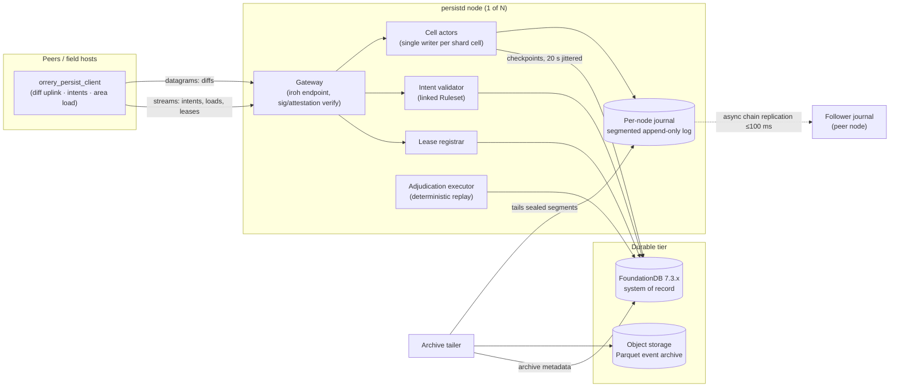
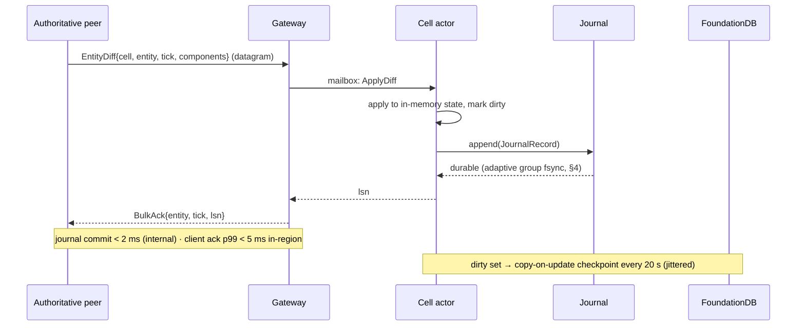
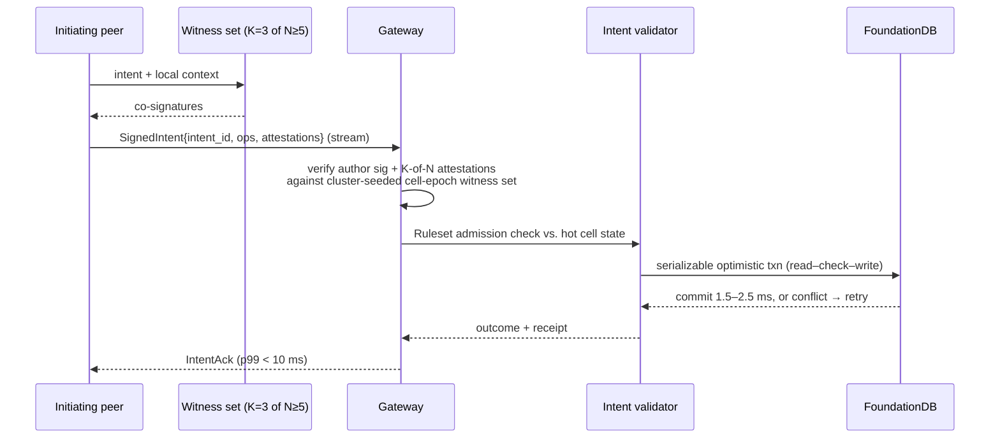
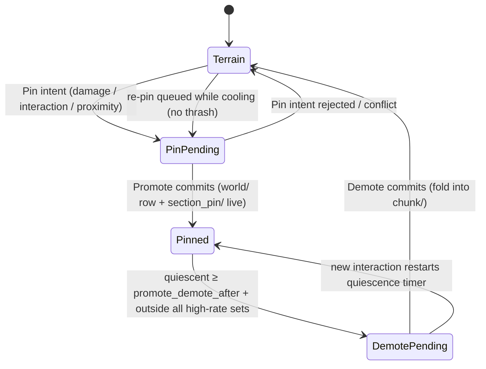

# 08 — Persistence: Cell Actors, Journal, FoundationDB

The persistence cluster (`orrery_persistd`) is the sole writer of durable truth in Orrery. It answers the owner mandate "really really fast, horizontally scalable" with a two-tier design: an in-memory, single-writer **cell actor** tier fronted by a per-node append-only **journal** (journal commit < 2 ms server-internal, client-observed acks p99 < 5 ms in-region — never blocking the simulation), backed by **FoundationDB** as the strictly-serializable system of record (checkpoints for bulk state; synchronous transactions for anything with economic value). This document specifies the full write paths, the actor model and its recovery/split protocols, the journal and its honest durability windows, the complete FDB keyspace schema, a worked item-trade transaction, terrain and event-history handling, hotspot management, scaling math, backup/DR, at-rest schema versioning, and world seeding/content patching.

Normative source: [ADR-0011](adr/0011-persistence.md) (with [D5](adr/0005-spatial-model.md) for `CellId`/sharding, [D7](adr/0007-authority-and-leases.md) for leases, [D10](adr/0010-witnessing.md) for attestations, [D12](adr/0012-backend-services.md) for the service inventory, and [D16](adr/0016-parameter-reference.md) for parameters).

## 1. Architecture

The current `orrery_persistd` reference binary runs one process per node, with a
static primary/follower journal-chain topology available for two-process
recovery. Games link their `Ruleset` (D9) into their own `persistd` binary —
the harness is a library; dynamic multi-node placement remains a later step.



- **Gateway** — the iroh-facing front door. Terminates peer connections (peers dial well-known addresses; no hole punching server-side, D3), verifies intent signatures and witness attestations, routes diffs to cell actors (local or remote via internal tonic/gRPC), serves area loads, and multiplexes lease traffic.
- **Cell actors** — one single-writer actor per *shard cell* (8×8×8 interest cells, D5/D16) holding that region's hot state in memory.
- **Journal** — one segmented append-only log per node, shared by all actors on the node, adaptively group-committed (< 2 ms server-internal, §4).
- **Lease registrar** — arbiter for authority leases (D7): CAS on `lease/{entity_id}` rows, TTL 10 s, heartbeat 2.5 s, batched. Logically a distinct component, physically it executes **inside each cell actor's single-writer event loop** (lease rows shard with their cells); the gateway routes lease traffic to the owning actor.

**Implemented authority status (2026-08-16).** Lease rows are durably written
on acquire, park, expiry, restore, and committed rekey; heartbeats update only
hot actor state. A TTL sweep returns the rows that lost a holder — with the
holder and token they lost — so the gateway can select a successor without
re-reading the registrar; the actor also tracks the highest journal position it
has folded per entity, which is what makes a divesting holder's `Divest.cursor`
checkable rather than merely carried. Each row has a durable cell-location index, so actor recovery
loads only its own leases and gives restored rows a fresh conservative TTL.
Committed rekeys are server-only: the journaled record moves the entity and its
lease index together, preserves holder/sequence/fence, rejects stale presented
cells, and leaves no partial migration after an error. Client lease-rekey
control messages and rekey bulk records are rejected at the gateway.
- **Intent validator** — runs `Ruleset` admission checks against hot state, then executes the FDB transaction.
- **Adjudication executor** — re-executes discrepancy-report evidence bundles (D10) in the headless `orrery_core` replay harness; retains the last **3** ruleset builds as version-keyed sidecar workers and routes each bundle by its `RulesetId` (bundles older than retention are *unadjudicable* — no strike, D10); verdicts produce write refusals/annulments and `strike/` rows.
- **Archive tailer** — compacts sealed journal segments into Parquet objects (event history, R7).

## 2. The two write classes

Everything durable enters through exactly one of two paths. The split is `Ruleset`-classified (D9): anything touching persistent *value* (items, currency, progression, structure placement) is critical; everything else (positions, health, world-entity state, terrain deltas) is bulk.

| Property | Bulk state | Critical operations |
|---|---|---|
| Trigger | replicon change-detection diffs, ~1–4 Hz per entity, priority-scheduled | signed, witness-attested intents (K=3 of N≥5, D10) |
| Transport | iroh unreliable datagrams | iroh reliable stream |
| Durability point | journal group-commit fsync (adaptive, < 2 ms server-internal) | FDB serializable commit |
| Ack target | **journal commit < 2 ms (server-internal) · client-observed ack p99 < 5 ms in-region** | **< 10 ms p99 in-region** |
| RPO | ≤ ~100 ms (chain-replicated journal, default) | **0** |
| Reaches FDB | checkpoint, **20 s jittered** cadence | synchronously, in the ack path |

### 2.1 Bulk path



The ack is issued **after** the record's group fsync completes — the ack *is* the durability contract. The two targets are measured at different points: **journal commit < 2 ms** from actor append to fsync completion (server-internal); **client-observed ack p99 < 5 ms** from datagram send to `BulkAck` receipt (in-region, RTT included). `orrery_persist_client` keeps unacked diffs buffered and resends on reconnect (records are idempotent: keyed by `(entity, tick)`, last-writer-wins per component within an entity's single-writer stream). This design — unreliable datagrams + application-level acks + idempotent records — is **normative** for the bulk uplink; the reliable stream carries only intents, loads, and leases ([02-networking.md](02-networking.md)). Nothing in this path touches FDB, so bulk throughput is bounded by journal appends, not database ops.

**Ingress admission: the gateway refuses what it cannot route in time, and counts it.** A gateway that accepts every datagram and serves it late does not remove queueing, it hides it. Measured on the kill-9 gate (2026-08-18): `client_bulk_wire_ms` p99 2 018 ms against a 5 ms budget, of which `gateway_ingress_queue_ms` — the wait between the endpoint driver handing a datagram over and the connection's receive loop reaching it — accounted for 1 992 ms, while the gateway's own `gateway_bulk_server_ms` span read 50 ms. Arrival and service rates matched over the run (540 536 sent, 540 536 acked), so this was not sustained overload but a **standing queue**: a transient built a backlog that never drained, because at ~100 % utilisation there is no slack to drain it with. Neither a larger concurrency cap nor a faster route removes a standing queue; only destroying work does.

So the receive loop now decides admission without ever waiting, on two bounds. A diff that has already waited longer than **25 ms** in the inbound queue (five times the whole D16 round-trip budget) is dropped before it is routed, and a diff arriving when the connection's `MAX_INFLIGHT_DIFF_ROUTES_PER_CONN` route slots are all busy is dropped rather than queued behind them. Both drops are silent on the wire and loud in telemetry: `GatewayIngressMetrics` counts `admitted`, `shed_stale` and `shed_saturated`, the gateway logs the running totals at `WARN` whenever they move, and the boundary sink emits them as `{"type":"gateway_ingress"}` records beside the transport-boundary histograms.

Silence, not a `BulkNack`, is deliberate. A nack means *rejected, do not resend* — the client drops the pending diff (§3.5) — whereas an un-acked diff stays pending and is re-offered on the next flush, usually as a newer tick, which is what this lane's idempotent `(entity, tick)` records are for. Dropping an un-acked diff is also the one loss this contract already permits: the ack *is* the durability promise, and "the unacked tail is lost by design (bulk class)" (§9). P2's demo criterion promises RPO 0 for acked intents and bulk loss "bounded by the journal/replication window" ([11-roadmap.md](11-roadmap.md) §P2); a diff refused at ingress was never acknowledged, so nothing that was promised is withdrawn. It is the same load-shedding order §11 states explicitly: bulk sheds first, intents last.

Measured on three interleaved before/after runs of the same gate on the same box: `bulk_ack_ms` p99 1 945 / 1 985 / 2 018 ms before, **20 / 30 / 50 ms after**, with 24–25 % of diffs shed and the acked remainder (402 807 – 405 444 of ~540 000) fully recovered by the post-kill verifier. One honest caveat, and one former one. `gateway_ingress_queue_ms` initially got *worse* (2 530–3 253 ms p99), because the histogram sampled every inbound message including the shed ones — so it measured the age of the backlog being destroyed rather than the delay being served, and stopped predicting client-observed latency. That is now fixed by splitting it: `gateway_ingress_queue_ms` records only messages the gateway **served**, and refused diffs go to `gateway_shed_age_ms`. Both are "time in the inbound queue", but a refused diff is refused *for* waiting, so pooling them guaranteed the served-latency distribution was dragged into the seconds by exactly the samples that were never served. The remaining caveat was that the loop could be stalled by the lease/claim work it ran inline, which is what let a backlog form at all. That is the next paragraph.


**The lease lane: authority work runs beside the receive loop, not inside it.** The shed rate above — a quarter of every diff offered — was not the cell actors being the limit. On the same runs the actors were at **37.8 %** utilisation (17 684 diffs/s x 2.734 ms mean `router_apply` = 48.4 actor-seconds per wall second against 128 actors). What consumed the deadline was the receive loop's own `GatewayMsg::Lease` arm: ~263 lines with **sixteen `.await` points and no `spawn`**, so a claim, a heartbeat or a divest — including `PeerState` locks and one actor round trip per `(grid, cell)` a peer holds entities in — ran to completion before the next inbound datagram was even looked at. `Subscribe` and `SubmitIntent` had already been moved off the loop; lease had not.

Lease work now goes to a **per-connection worker with its own queue** (`spawn_lease_lane`). Not a `tokio::spawn` per message: authority is a fencing protocol, and two operations on one entity may not reorder. What the code actually requires is **per-entity** order (`PeerState::leases` is keyed by entity and `complete_lease_claim` decides on the entry already indexed there) and **per-session** order (`try_reserve_lease_slot` / `complete_lease_claim` are a reserve-then-commit pair over `pending_lease_claims`); a single FIFO worker per connection is the smallest shape that gives both, and is *exactly* as ordered as the inline arm was. The queue is bounded (`MAX_QUEUED_LEASE_OPS_PER_CONN`) and full-lane refusal is a `Deny { RateLimited }` to a claimant and silence to a holder — a `HeartbeatAck { invalid }` would tell a holder to stop writing to entities it still owns, which is worse than the retry it will make anyway. Counts ride the boundary sink as `{"type":"gateway_lease"}`.

Measured on three interleaved before/after runs of the kill-9 gate, same box, same binaries otherwise:

| | before | after |
|---|---|---|
| `gateway_ingress_queue_ms` p99 (served messages) | 750 / 500 / 1 500 ms | **0.05 / 0.05 / 0.05 ms** |
| diffs shed for queue age | 138 238 / 146 090 / 146 150 (25.6 / 27.0 / 27.0 %) | **0 / 0 / 0** |
| durable bulk acks (of ~540 000 offered) | 402 466 / 394 542 / 394 994 | **536 140 / 541 264 / 539 296** |
| `bulk_ack_ms` p99 | 30 / 30 / 30 ms | 500 / 150 / 200 ms |

The head-of-line block is gone outright: the wait a served message spends in the inbound queue drops four orders of magnitude, nothing is shed for age any more, and the gateway durably acknowledges **every diff offered to it** (a2 and a3 acked 100 % of offers) — a third more durable writes than the shedding gateway managed.

The cost is that the ingress deadline no longer fires, and it was the only thing bounding client-observed latency. That is not an accident of this change, it is the same standing-queue result one stage later: with the loop no longer the constriction, the queue re-forms downstream of admission, where a per-arrival deadline cannot see it, and `bulk_ack_ms` p99 rises to 150–500 ms. Note also that the "before" p99 is a **survivorship** number — it is the distribution over the 75 % of diffs that were *not* shed, while the shed quarter has no latency at all — so the two columns' last row are not measured over the same population, and per *offer* the change is a strict improvement.

The valve that can still see that queue is `MAX_INFLIGHT_DIFF_ROUTES_PER_CONN`, which at 128 per connection x 125 sessions bounds nothing in practice (`shed_saturated` stayed 0 on every run above). One exploratory run at **8** — not the committed value — turned the invisible downstream queue back into visible shedding: 52 275 shed saturated (9.7 %), 488 629 durable acks, `bulk_ack_ms` p99 100 ms. So the trade curve is real and is a policy choice, not a defect: 25.6 % shed / 30 ms, 9.7 % / 100 ms, 0 % / 150–500 ms. Choosing a point on it is a separate change from removing the head-of-line block, which is what this one does.

**Where the queue actually went, and the valve that can see it.** The paragraph above ended on a guess with two candidates. Neither was right, and the first job of this change was to stop guessing: `gateway_bulk_stage_delta` already splits the server span into `route_queue` / `router_apply` / `journal_wait` / `reply`, and `router_apply` — the whole of `Router::apply_fenced` — held it. But `router_apply` is not one wait, it is three, in three different subsystems, so `crate::cluster::RouteStageMetrics` now splits it again and rides the boundary sink as `{"type":"gateway_route_stage"}`. Four runs of the merged branch, 30 s, 125 sessions, 10 000 entities, 128 shards, per acknowledged diff:

| stage | mean | max |
|---|---|---|
| `route_queue` — spawn to route task | 0.005 ms | 0.22–0.45 ms |
| `router_apply` | 7.8–9.5 ms | 2.15–2.21 s |
| — entity-gate wait | 7.2–9.0 ms | 2.15–2.21 s |
| — `LeaseStore::locate` (an FDB read) | 0.40–0.42 ms | 3.6–15.4 ms |
| — actor mailbox round trip | **0.006 ms** | 0.27–1.0 ms |
| `journal_wait` | 1.6–4.3 ms | 35–275 ms |

So it is **not** the tokio scheduler (`route_queue` is noise), **not** the cell actors (a 6 µs mailbox round trip — they are idle, which is consistent with the 37.8 % utilisation measured before the offload), and not primarily the committer. It is the **1024-way striped per-entity mutex** in `CellRuntime::apply_fenced`, which is held across an FDB read transaction — and which the now-concurrent lease lane takes **77 gates at a time for 16 ms mean / 50 ms max** (`heartbeat_leases` locks a peer's whole renewal set, then resolves each entry's route with its own `LeaseStore::locate` while holding all of them). That is the head-of-line block: it did not disappear when lease work left the receive loop, it moved onto the entity stripes, where a batched heartbeat and live diff traffic for the same entities now collide instead of taking turns.

A deadline bounds only a wait it is evaluated *after*. `MAX_INGRESS_QUEUE_WAIT_US` is evaluated on arrival age at dequeue, and with the loop instant it always passes. `MAX_ROUTE_ADMISSION_WAIT_US` is the same 25 ms budget and the same arrival clock, evaluated around the router round trip: a diff the router cannot admit to a journal inside its budget is dropped, silently on the wire and loudly in telemetry, as `shed_slow_route` — its own counter, beside `shed_stale` and `shed_saturated`, because an operator reading one number must not have to guess which of three queues grew. It **stops at the journal** deliberately: once the actor has admitted the record the write is going to be durable, and refusing to wait for that ack would withhold an acknowledgement for a write that happened. `journal_wait` is therefore outside the valve (and is frozen to another lane).

The budget is `GatewayConfig::route_admission_wait_us`, defaulting to the constant and overridable per node with `ORRERY_GATEWAY_MAX_ROUTE_WAIT_US`; `0` disables the valve, which is exactly the pre-change behaviour and therefore the "before" leg of every A/B below — the two legs differ in one number, not in code.

**The trade curve.** Interleaved runs of the kill-9 gate on one box, one binary. "Offered" is `admitted + shed_stale + shed_saturated`; served is `admitted - shed_slow_route`. `shed_stale` and `shed_saturated` were **0 on every run**, before and after.

| route budget | shed | `bulk_ack_ms` p99 | durable acks | `router_apply` mean | gate wait max |
|---|---|---|---|---|---|
| off (merged branch) | 0 % | 150 / 300 / 150 / 150 ms | 540.3–541.0 k | 8.0–9.5 ms | 2.15–2.21 s |
| 500 ms | 0.55 % | 150 ms | 537.9 k | 2.79 ms | 500 ms |
| 250 ms | 0.82 % | 75 ms | 536.8 k | 1.94 ms | 250 ms |
| 100 ms | 1.05 / 1.19 % | 50 / 30 ms | 534.4–535.1 k | 1.39–1.47 ms | 100 ms |
| 50 ms | 1.34 / 1.45 % | 30 / 30 ms | 533.4 k | 1.20–1.23 ms | 50 ms |
| **25 ms (shipped)** | 2.08 / 2.13 / 2.23 % | 20 / 40 / 150 ms | 528.6–529.6 k | 0.92–0.96 ms | 25 ms |
| 10 ms | 4.19 / 4.65 % | 15 / 15 ms | 515.5–518.0 k | 0.58–0.59 ms | 10 ms |
| 5 ms | 5.92 % | 20 ms | 509.3 k | 0.45 ms | 5 ms |
| *(prior)* route cap 8/conn | 9.7 % | 100 ms | 488.6 k | — | — |
| *(prior)* ingress deadline only | 25.6–27.0 % | 30 ms | 394.5–402.5 k | — | — |

Read the whole table rather than one row. **Both halves are now within reach of one point where they were not before**: at a 50–100 ms budget the gateway sheds 1.0–1.5 % of offers and answers in the tens of milliseconds, against 25 % shed for the same tail before the lease lane and 150–300 ms tail for zero shed after it. The `MAX_INFLIGHT_DIFF_ROUTES_PER_CONN = 8` point is off the frontier entirely — every budget from 5 ms to 500 ms dominates it on all three axes — and so is 5 ms, which sheds more than 10 ms for a worse p99. Everything from 10 ms to 500 ms is a genuine monotone trade with no dominating point, so **choosing among those is a policy call, not a defect to fix**. The shipped default is 25 ms because it is the number the ingress deadline already carries: one staleness policy, evaluated in two places, rather than two numbers that can drift.

The mechanism behind the curve's shape is worth stating, because it is why a *generous* budget works at all. The gate wait is a convoy with positive feedback — a held stripe makes waiters, waiters make the connection slower, a slower connection makes more waiters — and shedding the head of the convoy breaks the feedback. That is why 100 ms sheds only 1.2 % and still caps the tail at 30 ms: once the convoy cannot form, almost nothing comes near even a generous deadline. It is also why the valve *reduces* mean `router_apply` by 6–9x while refusing 1–2 % of work.

**What this does not fix.** The gate still fails, and now on someone else's number. In every valved run `bulk_ack_ms` p99 tracks `journal_commit_ms` p99 within one histogram bucket (20/10, 150/150, 40/30, 15/15, 20/20, 30/10, 50/30, 75/50, 150/75) — with the entity gate bounded, the residual client-observed tail *is* the group committer, whose own D16 target is 2 ms and which missed it on every run in this study, before and after. That is `journal/**`, frozen to this lane, so it is reported here rather than fixed. Nothing on this curve reaches the 5 ms `bulk_ack_ms` D16 target, and no setting of this valve can: the valve cannot bound a wait that begins after the record is durable.

The underlying defect was still there, only bounded: the diff write path takes a per-entity mutex and then performs an **FDB read transaction under it** (`LeaseStore::locate`, 0.40 ms mean — 98 % of the diff path's own gate hold), and the batched heartbeat path performed one such read *per entity* while holding that entity's whole batch of gates. That is what the next paragraph removes.

### 2.1.1 Taking the entity gate off the read path

**What the gate protects, before moving anything out from under it.** Every lease path in `cluster.rs` follows one shape: take the entity's stripe gate, resolve the entity's committed cell, act on the actor that owns it (`claim_lease`, `heartbeat_lease`, `validate_lease`, `park_lease`, `apply_fenced`, and `gated_mutex_actor` for the `Mutex<CellRuntime>` router). The migration side, `commit_rekey`, takes **one** gate — the entity's — and holds it across `CommittedRekeyPlan::execute`, which journals the rekey, calls `LeaseStore::migrate`, and installs the entity at the destination actor. The invariant is therefore narrower than "one writer per entity": the actors already serialise per entity in their own mailboxes. It is that **an entity's committed location is read, and acted on, atomically with respect to a migration of that entity** — and `migrate`, reached only from `execute` under that gate, is the *only* operation that ever changes that location (`LeaseStore::put` refuses to overwrite a different existing one and answers `LocationConflict` instead). The gate does not make the read possible; it makes the read's answer still true when it is used.

That is a property a counter can prove after the fact. `EntityStripeGates` now carries a per-stripe count of completed migrations, bumped inside `execute` immediately after `migrate` while the gate is still held. A reader samples the counter **before** it locates and re-reads it once it holds the gate: unchanged means no migration completed in the window, so the location read outside the gate is the one the gate would have shown. Changed sends that one entry down the original shape — gate held across its own `locate` — rather than routing it to an actor that no longer owns the entity. `heartbeat_leases` therefore resolves every location with **no gate held at all**, and then takes gates **per actor group**, around one mailbox turn and nothing else, still in `lock_entity_gates`'s deduplicated stripe order so no new multi-gate acquisition can cycle. `tests/heartbeat_gate_hold.rs` pins both halves: a single-entity renewal for an entity *inside* a parked batch must still get its gate, and an entity migrated while the batch is parked must be re-resolved rather than answered `None`.

**Measured.** Six configurations, three interleaved runs each, one box, one pair of binaries differing only in this change, 30 s / 125 sessions / 10 000 entities / 128 shards. Per fenced apply:

| leg | budget | entity-gate wait | `LeaseStore::locate` | actor mailbox | `router_apply` | `journal_wait` |
|---|---|---|---|---|---|---|
| before | off | 7.56–8.64 ms (max 2.08–2.17 s) | 0.39–0.44 ms | 0.006 ms | 8.11–9.16 ms | 2.33–3.29 ms |
| before | 50 ms | 0.75–0.80 ms (max 50 ms) | 0.39–0.44 ms | 0.006 ms | 1.21 ms | 2.32–2.41 ms |
| before | 25 ms | 0.51–0.53 ms (max 26 ms) | 0.40–0.42 ms | 0.006 ms | 0.93–0.97 ms | 2.34–2.91 ms |
| **after** | **off** | **0.011–0.015 ms** (max 5.3–20.6 ms) | 0.48–0.50 ms | 0.006 ms | **0.50–0.53 ms** | 2.27–2.43 ms |
| after | 50 ms | 0.012–0.013 ms (max 4.9–6.3 ms) | 0.47–0.48 ms | 0.007 ms | 0.50–0.51 ms | 2.41–2.68 ms |
| after | 25 ms | 0.011–0.013 ms (max 4.3–12.3 ms) | 0.47–0.50 ms | 0.006 ms | 0.49–0.52 ms | 2.55–2.85 ms |

The gate wait falls by **~600×** in the mean and from 2.1 s to 5–21 ms at the max, with the valve *off* — that is, without shedding anything. `locate` costs the same 0.4–0.5 ms it always did; it is simply no longer anyone else's wait. `router_apply` is now `locate` plus 20 µs.

And the batch hold that caused it:

| leg | batch locks / run | gates per lock | hold mean | hold max |
|---|---|---|---|---|
| before | 1 125 | 77.0 | 16.17–16.32 ms | 39–63 ms |
| after | 90 000 | 1.0 | 0.012–0.015 ms | 1.1–2.3 ms |

Read the first column with the second: the *lock* is now the per-actor-group acquisition, so one heartbeat that used to be a single 77-gate lock is many small ones. The comparable quantity is gate-microseconds and the blocking window per stripe: 1 125 × 77 gates held 16.3 ms each becomes 90 000 × 1 gate held 0.014 ms each — the same gates, taken for **1 100× less time each**. Note also what "1.0 gates per lock" says about the fold: on this workload a peer's 77 entities sit in 77 distinct shards, so `group_by_actor` produces 77 singleton groups and buys no mailbox batching here. That is unchanged by this work and is why folding was never where the cost was.

**The re-measured trade curve**, same runs, "shed" being `shed_slow_route` over offers (`shed_stale` and `shed_saturated` were 0 on all 18 runs):

| leg | route budget | shed | `bulk_ack_ms` p99 | durable acks |
|---|---|---|---|---|
| before | off | 0 % | 200 / 150 / 200 ms | 540.3–541.5 k |
| before | 50 ms | 1.29–1.52 % | 30 / 30 / 30 ms | 532.9–534.1 k |
| before | 25 ms | 1.82–2.22 % | 20 / 20 / 30 ms | 529.1–530.8 k |
| **after** | **off** | **0 %** | **15 / 15 / 15 ms** | **540.9–541.3 k** |
| after | 50 ms | 0 % | 15 / 15 / 15 ms | 540.5–541.4 k |
| after | 25 ms | 0 % | 15 / 20 / 20 ms | 540.9–541.4 k |

**There is no curve left to sit on.** `off` after the change dominates every point before it on all three axes at once — it sheds nothing, answers in 15 ms at p99, and durably acknowledges more diffs than any valved run of the old code. The monotone trade the previous section described was a trade against the gate hold, and with the hold gone the valve does not fire: at a 25 ms budget, the tightest setting measured here, `shed_slow_route` was **0 on every run**, because the gate wait it is watching never comes near 25 ms any more. So the valve is no longer load-bearing on this workload, and the honest reading is that its default is now a policy choice with no measured cost either way — inert at 25 ms, and inert at `off`. It is kept enabled at 25 ms as a bound for the workloads this study did not run, not because anything here needs it; the case for disabling it by default is that a valve that never fires is a valve nobody has tested.

**What is left is the committer, and only the committer.** After the change `bulk_ack_ms` p99 equals `journal_commit_ms` p99 exactly on every run (15/15, 15/15, 15/15 at `off`; 15/15, 20/20, 20/15 at 25 ms), against a 2 ms D16 target for the commit itself. The client-observed bulk tail is now entirely the group commit path — `journal/**`, frozen to this lane and reported rather than fixed.

### 2.1.2 Taking FoundationDB off the bulk write path

§2.1.1 got the FDB read out from under the entity gate. It left the read
itself: one `LeaseStore::locate` — a FoundationDB read transaction — per
fenced bulk diff, on the write path, which is a direct contradiction of §2's
"bulk writes reach FDB only at the 20 s checkpoint". [14-capacity.md](14-capacity.md)
§5.1 then measured what that costs: `libfdb_c` runs **one** network thread per
process, and that thread was the binding constraint on a whole 16-thread box —
25.8 % of a core at the P2 operating point, 100 % at collapse, with fifteen
threads, the NVMe array, the NIC, FDB's own server and RAM all idle beside it.

**The read is gone from the accept path.** `CellRuntime::apply_fenced` now
asks `actor(record.cell)` — the owner of the cell the client declared —
directly, and consults `locate` only when that owner rejects *without* a row
(or when there is no actor for the presented cell here, or its mailbox is
gone). It is not a cache: nothing is memoised, nothing can go stale, there is
no TTL and no invalidation hook. The decision is simply made by the component
whose own state the decision is defined over.

**Why the accept set is unchanged.** The locate was never part of the fence.
`CellMsg::ApplyFencedDiff` evaluates five conjuncts against the receiving
actor's *own* state — no pending rekey, `by_cell[e] == record.cell`, and
holder / `lease_id` / `seq` / expiry against its own registrar row — and
`apply_fenced` never rewrites `record.cell`. The locate only chose *which
actor* evaluated them. So the whole question is whether a different actor can
evaluate the same predicate to true, and one invariant answers it:

> **(J)** If an actor's `LeaseRegistrar` holds a row for entity `e`, then
> `LeaseStore::locate(e)` names a cell inside that actor's shard subtree (or
> is `None`).

Given J, an actor that *accepts* holds a live row, so `locate(e)` is in its
shard, so `actor(locate(e))` — the old route — is that same actor. The accept
set is identical with or without the read.

J has exactly **four enforcement sites**, all in `actor.rs`, and all of them
go through `checked_row_cell`, which asserts `shard.is_prefix_of(cell)` and
returns the cell it checked — so the assertion and the write are one
expression and a later edit cannot move the row without moving the check:

| site | why the row is in-shard | pinned by |
|---|---|---|
| `claim_lease` | the claim is routed to `actor(locate().unwrap_or(cell))` and stores `location = cell`; `LeaseStore::put` answers `LocationConflict` rather than overwrite a different location, so even a misrouted claim cannot manufacture a violation | `tests/lease_location_conflict.rs` |
| `install_rekey` | runs at `actor(destination_cell)`, immediately after `migrate` set `location = destination_cell` | `tests/fenced_route_invariant_j.rs` |
| `complete_local_rekey` | the intra-shard case of the same move; source and destination are one actor | `tests/fenced_route_invariant_j.rs` |
| actor-spawn recovery | seeded from `load_cell(shard)`, which is a **prefix range scan** of `lease_cell_key` under that shard — in-shard by construction | `tests/fenced_route_invariant_j.rs` |

`tests/fenced_route_invariant_j.rs` walks every actor and checks J directly
after grant, park, sweep, cross-shard rekey, intra-shard rekey, `split`,
`activate_shards` and recovery, under both lease stores.

The `LocationConflict` guard in row 1 is the one that stops a misrouted claim
from *creating* a J violation, and it was load-bearing and untested: replacing
`LocationConflict(_) => return Denied(NotEligible)` with `{}` survived the
full suite, and the actor would have fallen through, installed
`lease_cells[e]` at a cell whose durable location belongs to another shard,
and returned a `Granted` row for an entity it does not own.
`tests/lease_location_conflict.rs` routes a claim to the wrong shard's actor
through a lying location index and now fails that mutation at `Granted` where
`Denied(NotEligible)` is required.

**`checked_row_cell` is a real `assert!`, not a `debug_assert!`.** It was the
latter, which compiles out of release — the configuration the capacity sweep
and production both run — so the four enforcement sites above were four
enforcement sites in the test suite and none at all where it matters. The
promotion is free: none of the four callers is on the bulk write path (a
lease grant, a rekey install, its intra-shard twin, and one row per entry at
actor-spawn recovery), so it runs **zero** times per fenced diff, and
`is_prefix_of` is a `u64` range containment measured at **0.98 ns** per call
in a release build. Panicking is the intended response rather than a
degradation: past that point the actor would be admitting fenced writes
against a row whose durable location it does not own — silent divergence of
the accept set, with no local recovery — and failing the shard closed is
strictly safer than serving it.

**Why a reject still reads.** J says nothing about a *rejecting* actor.
Cross-shard duplicate `by_cell` entries are reachable — an unfenced diff at a
new cell in another shard writes `by_cell` there without clearing the old
actor's entry — so the cell owner's "I have no row" is not proof of absence,
and the locate runs. `Rejected(Some(row))` *is* proof: a row present means, by
J, this is the location owner, so the NACK carries the same live row it always
did, and the D7 §5 duplicate-authority detector (`observe_fencing_rejection`,
which returns early on `None`) and the client's `reconcile_lease_nack` keep
working at full fidelity. The fallback is bounded by construction — **one**
locate, **at most two** mailbox turns, no loop, and no short-circuit on
anything but `row.is_some()` — and `tests/fenced_route_bounds.rs` asserts the
bound, including that a fallback resolving to the actor that already answered
does not re-send.

**What actually keeps the fallback cold — a bounded probe, not an
invariant.** The first version of this section justified `locate_fallbacks`
staying near zero by saying `strict_authority` "pins `record.cell` at the
grant cell for the entity's life". That is a statement about which diffs are
**admitted**, not about which cell **arrives**: `route_diff` builds the record
as `cell: diff.cell` straight from the client's `DiffUplink`, and the actor's
`by_cell[e] == record.cell` conjunct is evaluated *after* the route has
already chosen an actor. So a peer holding a perfectly valid lease that
presented any other cell took the fallback on **every** diff — one FDB locate
plus a second mailbox turn, i.e. the pre-change cost plus a turn — at its own
chosen rate. Since §5.1 of [14-capacity.md](14-capacity.md) identifies the
single `libfdb_c` network thread as the binding constraint on the whole box,
capacity was bimodal on an unvalidated field on the wire.

**Validating the cell against the grant does not work, and it is worth saying
why.** The gateway's `SessionLease.cell` is the cell the lease was *granted*
at, and a registrar-driven `commit_rekey` moves an entity without telling the
gateway anything: the NACK the holder receives carries a `Lease`, which has no
cell in it. So the holder's first legitimate write at the new cell presents a
cell the session index has never heard of and is indistinguishable, at that
instant, from a client addressing the wrong cell. Refusing on the mismatch was
implemented first and failed two existing gateway tests, including
`rekeyed_entity_rejects_stale_presented_cell_with_current_lease`, which asserts
exactly that write is acknowledged. A cheap gateway-side check cannot be
authoritative about an entity's cell, because the only authority is the actor.

So the mismatch buys a **probe**, and the probe is what is bounded. There are
**two** diff shapes the session index fails to confirm, and it is worth naming
them separately because they have different causes and different endings:

1. the index holds an entry for the entity naming **another cell** — the rekey
   case, and the abuse case that mimics it;
2. the index holds **no entry at all** — an entity this session was never
   granted a lease for.

Shape 2 needs no lease, no rekey and no setup: it is the cheapest way a peer
can reach the expensive branch, because an entity with no row anywhere is
`Rejected(None)` at the router, and `Rejected(None)` is exactly the answer that
does *not* short-circuit — it takes the fallback and spends its locate. **It
was not bounded at all until this was written down.** The predicate was
`indexed.is_some_and(...)`, so shape 2 read as "not misrouted": it took no
token, incremented no counter, could not be throttled, and routed. A probe of
1000 diffs at a foreign cell for an unheld entity measured
`routed_to_router=1000  misrouted_diffs=0  misroute_throttled=0`. Of the three
bounds below, only the third — the process-wide permit pool — applied to it,
and a permit pool caps **concurrency, not rate**. This is not a regression
against the pre-change route (every fenced diff paid an unconditional locate
then, so one locate per diff *is* the old cost), but it was a bound this
section claimed and the code did not have.

Both shapes now take the same path:

* **Per connection, a token bucket.** A diff whose route the session index
  does not confirm — either shape — is routed if the connection can pay a
  token (`MisrouteBucket`: 32/s, burst 256) and answered with a `BulkNack`
  without routing if it cannot. `misrouted_diffs` counts both shapes,
  `unindexed_diffs` the subset that is shape 2, and `misroute_throttled` the
  refusals. All three are exported on the `gateway_authority` JSONL record;
  they were in-process counters that nothing scraped, which made the alarm
  this section names unreadable in ops even where it did fire.
* **An admitted probe repairs the index — shape 1 only.** `route_diff` reports
  whether the router *admitted* the record, and admission is proof of location
  — the actor admitted it only because its own `by_cell[entity]` names that
  cell and its registrar row names this holder's live lease. So a rekey costs
  one token per entity and then routes at full speed forever. A peer whose
  cell is simply wrong is never admitted, never repairs anything, and settles
  at 32 fallbacks a second instead of its own send rate. The bucket is sized
  for the repair case: a 256-entity mass rekey drains the burst and does not
  stall. Shape 2 is **deliberately not repaired**: the repair writes through
  `get_mut`, so it cannot fabricate a `SessionLease` the gateway never granted
  — an invented entry would enter `lease_capacity` accounting,
  `resolve_renewals` and `cleanup_peer_session`'s park loop, and admission does
  not name the row's owner generation. Shape 2 therefore also settles at 32/s,
  by never leaving the metered path rather than by never being admitted.
* **Across connections, a permit pool.** `ORRERY_FENCED_LOCATE_FALLBACK_PERMITS`
  (default 64) caps concurrent fallback locates process-wide. Process-wide
  rather than per connection on purpose: the resource being protected is one
  thread per *process*, and a per-connection cap of `k` across `n` connections
  bounds nothing at `n · k`. It queues rather than sheds — a diff that waits is
  still routed — and what sheds it, if the wait runs long, is the
  route-admission budget the gateway already applies from the diff's arrival,
  which counts what it drops. The expensive branch therefore degrades into an
  existing, measured valve instead of into FDB-thread saturation.

**Why metering shape 2 is safe, stated as the argument rather than assumed.**
Treating "no entry" as unproven would be wrong if a legitimate write could
outrun its own index entry. It cannot: a peer learns it holds a lease only
from `LeaseMsg::Grant`, both emitters send it *after* `complete_lease_claim`
has inserted the entry, every removal (`divest_lease`, `unwind_grant`,
`cleanup_peer_session`, the compensation path) is paired with a `park_lease`
that has already made the router reject the write anyway, and a failed renewal
reports `invalid` without touching the map. The rekey case that made this a
probe rather than a refusal keeps its entry throughout — only the *cell*
moves. Shape 2 accordingly has no legitimate *admissible* producer — no honest client
gets a shape-2 diff **accepted**. That is not the same as never emitting one,
and an earlier draft of this paragraph said `unindexed_diffs` was expected at a
flat zero. It is not. Two ordinary paths emit shape-2 diffs from an honest
client, both on the way *out* of authority: diffs already queued in the client's
`UplinkScheduler` when a `divest_lease` has removed the gateway's entry — the
client drops `LocallyAuthoritative` but nothing unregisters the scheduler, whose
only `unregister` caller is `reconcile_lease_nack` — and a reconnect that loses
the race with `cleanup_peer_session`. So the shape to expect is a bounded spike
that decays, and the alarm is a *sustained* non-zero, not a non-zero. It is still a probe and not a refusal, so if that argument is ever
falsified by a new grant path the cost is a metered 32/s rather than a hard
stop.

One detection consequence is accepted in exchange: a throttled diff is not
routed, so it can no longer raise `duplicate_authority` against a *different*
live holder. The first 256 still do, so the detector still fires — it simply
cannot be driven at a peer's chosen rate, which is the point of the bucket.

`locate_fallbacks` is still expected at ~0 and is still the alarm if it is
not. What has changed is the honesty of the reason: it is low because a probe
allowance holds it low and a pool bounds what gets past the allowance, not
because the protocol makes it impossible. The inline gateway test
`a_diff_at_an_unindexed_cell_probes_once_repairs_the_index_and_is_then_throttled`
pins the probe, the repair and the throttle for shape 1;
`diffs_for_an_entity_this_session_holds_no_lease_for_are_metered_too` reruns
the 1000-diff probe above and pins shape 2 at 256 routed, 744 throttled, 1000
counted, and no fabricated index entry; and
`tests/fenced_locate_fallback_bound.rs` pins the pool at a peak of 2 in-flight
locates against 8 concurrent fallbacks.

**One accepted divergence, in writing.** A rekey whose `LeaseStore::migrate`
committed and then reported failure (FDB's `commit_unknown_result`, or
`execute` returning `Err(RekeyError::LeaseStore)`) leaves the source actor
holding both its `pending_rekeys` reservation and its row while the durable
location already names the destination. Where the destination is in another
shard, the two routes disagree on the NACK *payload*: the old one asked the
destination and got `Rejected(None)`; the new one asks the source, which
rejects on conjunct 1 and hands back its live row. Both reject — admission is
identical — and the new payload is the more useful one, being the row the
client still holds. This is the only divergence in the state matrix, and
`tests/fenced_route_differential.rs` asserts both that it is the only one and
that it does fire.

**The margin being spent, stated as a precondition.** Before this change every
fenced diff re-read shared FoundationDB truth, so a location moved
out-of-band by another writer would have been noticed on the next diff. Now
only the actor's own state witnesses it. The requirement is therefore explicit:

> **One `persistd` process writes a grid's lease keyspace.**

That is true today — every `Router` implementation is in-process, and
`LeaseStore::migrate` is reachable at runtime only from `commit_rekey`, which
has no production caller (the gateway answers a client `LeaseMsg::Rekey` with
an unconditional `Deny{NotEligible}` and NACKs a `RecordKind::Rekey` diff) —
but it is now load-bearing rather than incidental. Cross-node exclusion
continues to rest on the durable shard-fence epochs of §3.4, unchanged.

**Monitored, not assumed.** The one silent failure mode is J being false: an
actor admitting a write against a registrar row that is not the durably
located one. So a **sampled audit** ships: one in `ORRERY_FENCED_LOCATION_AUDIT_N`
accepted fenced diffs (default 1000 in release, **1** under
`debug_assertions`, so the whole test suite audits every accept) still
performs the locate and increments `location_mismatches` with a `warn!` when
the durable location falls outside the accepting actor's shard. **That counter
must be zero.** Three properties of the audit are load-bearing, and each is
pinned by a test rather than asserted here:

* **It runs with the entity gate released.** Only the *decision* to sample is
  made under the gate. An audit is a FoundationDB read, and the first version
  ran it inside the critical section, after `RouteStageMetrics::record` — so
  it was excluded from all three stage timers and its cost came back as the
  *next* diff's `gate_wait_us`. At a 5 ms locate with eight concurrent accepts
  on one entity that measured `applies=8 locate_us_sum=0 gate_wait_us_sum=171433`
  for a 49.5 ms wall. `tests/fenced_route_audit_gate.rs` reproduces the shape
  at a 25 ms locate and fails at 732 ms of `gate_wait_us_sum` if the audit is
  moved back inside.
* **Releasing the gate does not weaken it.** The sample can no longer be
  pinned to its accept by holding the gate, so it is pinned the way
  `heartbeat_leases` phase 1 pins its own off-gate reads (§2.1.1): the
  entity's stripe migration counter is read under the gate and re-read after
  the locate, and a sample that straddled a migration is discarded rather than
  judged. `location_mismatches` therefore has no known false-positive source
  — which is what lets it stay a stop-ship number.
* **No locate outcome is invisible.** `location_audits_decided` counts the
  samples the sampler chose, and is the denominator of the other three:
  `location_audits` counts samples that reached a verdict,
  `location_audit_errors` counts samples that ran and produced none — a store
  error, a discarded straddling sample, *and* `locate` answering `None` — and
  `location_audits_dropped` counts samples that never ran at all. `None`
  belongs with the errors: an accepted fenced diff has a live registrar row, a
  row is only granted through `claim_lease`, and `claim_lease` writes the
  location key in the same call, so a missing key means the audit read
  nothing, not that it read agreement. Folding it into the clean count would
  let a lease store that has lost its location index report health forever. A
  *drop* is kept apart from both because it says nothing about the store: it
  is the audit declining a sample, and folding it into the errors would let a
  saturated audit pool read as a sick registrar. The three buckets are
  disjoint and exhaustive of the decided ones —

  ```text
  location_audits_decided
    == location_audits + location_audit_errors + location_audits_dropped
  ```

  — so `location_audits == 0` while accepts flow is itself the alarm that the
  audit stopped running, and no decided sample can go missing.
* **It cannot refuse a write.** The audit is detached: `apply_fenced` decides
  it under the gate, captures what it needs, and spawns it after the route has
  already answered. It is bounded process-wide by
  `ORRERY_FENCED_LOCATION_AUDIT_INFLIGHT` (512), which is a `try_acquire` and
  not a queue — a diagnostic that falls behind should shrink its sample, not
  grow a backlog of stale ones — and a refused sample is counted rather than
  dropped silently. `tests/fenced_audit_never_sheds.rs` pins the first half
  end to end through a real gateway with the audit read made six route budgets
  long; `tests/fenced_audit_inflight_bound.rs` pins the second.

Its cost is its own stage, `location_audit_us_sum` / `_max`, deliberately not
folded into `locate_us`: `locate_us` is the route's own read, on the critical
path of the routing decision, and mixing a background sample into it would
make "the route reads nothing" unfalsifiable from the counters. **The
sampling rate stays at 1 in 1000.** At the 99 k diffs/s this change sustains
(§2.1.3) that is ~99 locates/s against the ~99 000/s it removed — 0.1 %. §5.1
of [14-capacity.md](14-capacity.md) measured the FDB client thread at 25.8 %
of a core while serving ~18 000 locates/s, i.e. ~14 µs of that thread each, so
99/s is ~0.14 % of one core: below the noise floor of every other number in
this document.

Its **latency** cost on the request path is now zero, and getting there took
two corrections rather than one.

**Superseded 2026-08-19, and why it is left visible.** The paragraph that
stood here said: *"`apply_fenced` still `await`s `finish_location_audit`
before it returns, so the **sampled diff's own** route return is delayed by
its own locate. At 1 in 1000 that is one diff in a thousand paying roughly one
FDB read on top of its route, and no other diff paying anything for it."* The
arithmetic is right and the conclusion is wrong, because it priced a delay and
the delay was not the cost. The gateway runs `apply_fenced` inside
`within_route_budget(received_at, MAX_ROUTE_ADMISSION_WAIT_US, …)` — a 25 ms
`tokio::time::timeout` measured from the diff's *arrival* — so a sampled diff
whose audit overran the remaining budget did not pay a delay, it was
**cancelled**: counted `shed_slow_route`, never acknowledged, and its audit
landed in no counter at all. The 0.1 % diagnostic was dropping bulk writes.

It was also the *only* thing dropping them. Across the 73 point directories of
[14-capacity.md](14-capacity.md) §11 — both storage engines, three orders of
magnitude of shed rate — the identity `shed_slow_route == (decided audits) −
(completed audits)` held **exactly**, at every single point, with
`location_audit_us_max` clamped in the 20.8–26.5 ms band that a 25 ms budget
produces. Bulk shed attributable to actual route slowness was zero in the
whole study. The claim is left visible rather than quietly rewritten because
the error was structural, not arithmetic: a diagnostic had been placed inside
a valve that sheds, and nothing about "it is only 0.1 %" makes that safe.

So the audit is off the request path entirely. `apply_fenced` decides the
sample under the entity gate — including the stripe migration mark that pins
it — and spawns it; the route returns without it. **FoundationDB is off the
bulk *routing* path — every accepted fenced diff, without exception — and off
the bulk write path but for a 0.1 % audit sample that runs detached, bounded,
after the route has answered, and is counted in a stage of its own.** The
`gateway_route_stage` boundary record carries the audit counters next to
`locate_fallbacks` and `mailbox_turns`, whose ratio to `applies` must sit at
1.0 and can never exceed 2.0.

**Out of scope, deliberately.** `Cluster::apply_fenced` keeps its locate:
`committed_entity_cell` there is doing real cross-runtime routing — the
presented cell may be hosted by a *different* runtime — and J is a statement
about one runtime's own actors, so it says nothing about which runtime holds a
shard. `Mutex<CellRuntime>::apply_fenced` keeps its locate too; it is not on
the shipped path and would need J re-proved for its structure. Both sites
carry that reason in a comment.

The same change made phase 1 of `heartbeat_leases` — the other per-entity FDB
read stream, described in §2.1.1 — resolve its locations **concurrently**
rather than one at a time. The proof is untouched: each future samples its own
stripe mark before its own read, and phase 2's under-the-gate re-check is
unchanged. A 77-entry renewal was 77 serial round trips.

**Epoch-fenced acks (split-brain guard).** An actor may issue durable acks only while its shard-ownership epoch (§3.4) is **confirmed fresh**: it heartbeats an FDB read version roughly every **1 s** and treats its epoch as stale after a **3 s staleness bound** — deliberately below the failure-detection + re-placement time, so a partitioned former owner falls silent before a replacement can be fenced in and serving. While stale, the actor downgrades to **provisional acks**, which the client treats as unacked (kept buffered, resent to the new owner). Every `JournalRecord` carries the epoch it was appended under, so recovery replay discards records from a superseded epoch; §4.1 quantifies the residual window.

**Every gateway bulk write is fenced.** `route_session_diff` sets `strict_authority: true` unconditionally, so a `DiffUplink` without a granted `(lease_id, authority_seq)` is substituted with the never-granted `LeaseId(0)` and rejected by `apply_fenced` before it reaches the journal. Two consequences bind every client of this path, the P2 load rig (`p2-load`) included:

- **A writable entity must already exist durably.** The registrar grants a lease only when it can resolve the entity's *committed* cell and that cell is the one the claim names (`committed_entity_cell(grid, entity) == cell`). An entity that has never been journaled has no committed cell, so it cannot be claimed, so it cannot be written. Bootstrapping is a server-side or seeding concern — `orrery-seed` for a durable world, `persistd --dev-seed` for a volatile harness — never a client one.
- **A leased writer cannot move an entity between cells.** `apply_fenced` admits a diff only where `by_cell[entity] == record.cell`, and the gateway answers a client-sent `LeaseMsg::Rekey` with an unconditional `Deny{NotEligible}`; rekey is driven by the registrar and the redistributor. A client that follows an entity across a cell boundary by simply re-addressing its diffs is fenced out at the boundary. Cross-cell coverage in a load profile therefore comes from *placement*, not from motion.

`p2-load` implements exactly this: one iroh identity per session (the peer registry is `NodeId`-keyed and only a peer's newest session is current), a strong `Explicit` claim per entity before any load, a batched lease heartbeat at 3 s against the 10 s TTL, and no unleased write path at all — a denied claim or a withdrawn lease fails the run rather than degrading to writes the gateway will refuse.

**Bulk-path validation.** The cell actor runs the stateless `Ruleset` invariant validators (D9/D10 — the same speed/acceleration/rate/impossible-value checks witnesses run) on inbound diffs: **mandatory** for entities in cells with fewer than N witness candidates — closing the solo-player-in-an-empty-cell hole, where no witness set exists to observe the author — and **sampled** elsewhere. Violations are rejected (NACK) or flagged to the adjudication pipeline.

### 2.1.3 What it bought, in delivered records

The study is `scripts/fenced-sweep-*.sh`: the pre-change and post-change
binaries interleaved over the same points on the same box, against the same
10 000-entity seeded world, reduced by `scripts/fenced-sweep-report.py`. Raw
output is one directory per point.

**Read the delivered column, not the nominal one.** `offered/s` in the first
version of this table was `entities × diff_hz` — nominal demand, a dial
setting, not load that arrived. `p2-load`'s fan-out assert allows
`sessions × 160` diffs/s (`check_fan_out`), five of the six rate points were
provisioned with exactly zero margin against that, and the rig drops the
excess silently on the client (`UplinkScheduler::queue` is newest-wins). The
rig tops out at about **99.3 k diffs/s** on this box whatever the session
count, so the "120 k" and "160 k" points are the **same** delivered operating
point and neither reached its nominal setting. See the correction in
[14-capacity.md](14-capacity.md) §2.

| nominal/s | rig cap/s | arm | delivered/s | durable acks/s | shed % | `locate` ms/apply | intent p99 | FDB thread mean |
|---|---|---|---|---|---|---|---|---|
| 20 000 | 20 000 | before | 16 417–18 031 | 16 123–18 027 | 0.03–1.79 | 0.51–0.69 | 40–100 ms | 25.0–25.4 % |
| 20 000 | 20 000 | **after** | 17 915–18 022 | **17 915–18 021** | **0.00** | **0.00** | 15–30 ms | **8.2–8.3 %** |
| 40 000 | 40 000 | before | 33 601–33 906 | 33 434–33 455 | 0.50–1.33 | 1.00–1.07 | 50–75 ms | 38.7–40.9 % |
| 40 000 | 40 000 | **after** | 34 056 | **34 055** | **0.00** | **0.00** | 75 ms | **6.8 %** |
| 60 000 | 80 000 | before | 48 896 | 44 671 | 8.64 | 2.26 | 500 ms | 57.2 % |
| 60 000 | 80 000 | **after** | 49 667 | **49 663** | **0.01** | **0.00** | 200 ms | **7.0 %** |
| 80 000 | 80 000 | before | 65 989 | 58 327 | 11.61 | 3.04 | 1.0 s | 75.8 % |
| 80 000 | 80 000 | **after** | 66 330 | **66 267** | **0.01** | **0.00** | 500 ms | **8.8 %** |
| 120 000 | 120 000 | before | 97 962 | 35 041 | 61.94 | 12.11 | 2 s | 96.6 % |
| 120 000 | 120 000 | **after** | 99 436 | **99 428** | **0.01** | **0.00** | 750 ms | **11.1 %** |
| 160 000 | 160 000 | before | 99 536 | 29 385 | 68.61 | 12.79 | 3 s | 95.2 % |
| 160 000 | 160 000 | **after** | 99 324 | **99 317** | **0.01** | **0.00** | 750 ms | **10.8 %** |

**The headline, stated in what was measured.** At the rig's ceiling — about
**99 k diffs/s delivered on both arms**, the last two rows, which are one
operating point reached two ways — the pre-change binary made **29 k–35 k
records durable per second** and shed 62–69 % of them, while the post-change
binary made **99.3 k** durable and shed 0.01 %. Same load in, **~3× the
writes made durable**, and the FDB client thread fell from ~95–97 % of a core
to ~11 %.

**The knee was not found, and the study cannot claim one.** At 99 k delivered
the after arm sheds 0.01 %, commits intents in 750 ms, and acknowledges
essentially everything that arrives; nothing about it looks like a limit. What
ran out was the load generator. The honest statement of the new service
ceiling is **">= 99 k delivered records/s, not located"** — finding it needs a
rig that can offer more than one box's `p2-load` can, which this study did not
have. The *old* knee is the number that moved and is measurable: 40 000
nominal / ~33.6 k delivered before, versus at least 99 k delivered after.

**Re-measured after the review fixes.** Four changes since the table above
touch this path — the sampled audit moved off the entity gate, `checked_row_cell`
became a real `assert!`, the gateway gained one `HashMap` lookup per diff
against a lock it already takes, and the fallback locate gained a permit pool
— so the 20 000 and 80 000 points were re-run, two repeats, arms interleaved
in one session, the merged branch tip against the fixed binary:

| nominal/s | arm | delivered/s | durable acks/s | shed % | `gate_wait` ms/apply | FDB thread mean |
|---|---|---|---|---|---|---|
| 20 000 | merged tip | 18 029–18 034 | 18 028–18 033 | 0.00–0.01 | 0.000 | 6.5–8.2 % |
| 20 000 | **+ fixes** | 17 936–18 032 | 17 936–18 031 | 0.00 | 0.000 | 6.6–7.6 % |
| 80 000 | merged tip | 65 808–66 031 | 65 803–66 027 | 0.01 | 0.001–0.002 | 7.5–9.0 % |
| 80 000 | **+ fixes** | 66 197–66 330 | 66 193–66 326 | 0.01 | 0.000 | 8.9 % |

The arms are inside this box's own run-to-run spread at both points, and every
route invariant held on all four runs: `mailbox_turns / applies` exactly 1.0,
`locate_fallbacks` 0, `location_mismatches` 0, `leases_lost` 0, and
`diff_nacks` **0** — the last being the end-to-end evidence that `p2-load`
addresses its diffs at the cell it was granted, so the new per-connection
probe bucket never fires on the workload. `bulk_ack_ms` p99 is the one number
that moves visibly and is the one this box is worst at reproducing: 9–15 ms
against 7–300 ms at 20 000, where the 300 ms is a single run's fsync
excursion and the repeat of the same binary answered in 7 ms.

**Superseded, and why it is left visible.** The first published version of
this table had an `offered/s` column carrying the nominal figures, a "120 k"
row and a "160 k" row read as two operating points, and a claim that the new
knee sat above 160 k. All three are wrong in the same way: they are the dial,
not the delivery. The numbers are not quietly overwritten because the error
was not arithmetic — it was reporting a setting as a measurement, which is
the kind of mistake that recurs unless the tooling makes it impossible.
`scripts/fenced-sweep-report.py` now prints `delivered_per_s`,
`rig_cap_per_s` and `delivered_pct` beside the nominal, and warns to stderr
when any point delivered under 95 % of it.

## 2.2 Critical path



**Delivery is at-least-once, and stays that way.** Intent submission rides the reliable lane, so an intent is not lost to a dropped packet — but the window that made at-least-once necessary is not a transport window and does not close. A gateway can receive a submission, commit it durably, and lose the connection before the ack reaches the client; from the client's side that is indistinguishable from a submission that never arrived, so it replays on reconnect. What makes the replay safe is the `intent/{intent_id}` idempotency row read in step 0 of §7: a replayed intent returns the recorded outcome rather than applying twice. **At-least-once delivery plus an idempotency key is a route to exactly-once *outcomes*, and no transport supplies one** — the pairing is retained deliberately, not left over.

The client-side in-flight timeout that accompanies it changed meaning rather than going away. It was a retransmit timer for a submission lost on the packet lane; on a reliable lane a submission on a live connection cannot be lost without the connection dying, and a dying connection already requeues everything in flight. It is now a liveness backstop for a gateway that accepted an intent and never answered — which is why it sits at 10 s, three orders of magnitude above the p99 < 10 ms commit budget. A backstop near the commit budget would resubmit against precisely the gateway that is already struggling.

**What the admission filter checks with no `Ruleset` linked (P2).** A deployed `persistd` runs `BaselineIntentValidator`, whose scope is exactly the checks that do not need game rules to state: the envelope's **shape** (at least one op, at most 64; ≤ 4 KiB of args per op and ≤ 64 KiB per intent — the executor mints an id and writes an effect per op inside one serializable transaction, so an unbounded op list is an unbounded transaction); the **one op this cluster's own executor interprets** (op `0`, the §7 ledger credit, whose `args` must be the 24-byte `account ‖ asset ‖ delta` triple — malformed ones are refused at the edge rather than returning `REASON_EXECUTOR_ERROR` after a round trip); the **account binding** of that op (a credit may only name the account the connection's session token authenticated as, which is what keeps the executor's blind `Add` from being a credit-anyone primitive); **attestation authenticity** (at most 16, no repeated witness, every co-signature verifies over the canonical preimage); and **party exclusion at the NodeId level** (no attestation may name the intent's own issuer as its witness — D10 item 4 and [07-witnessing.md](07-witnessing.md) §4.1, enforced here because a gateway must not assume a witness set it did not choose is well-formed). Rejections are `REASON_VALIDATION_FAILED` on the wire, with the specific cause logged — with one exception, `REASON_SELF_WITNESS`, which gets its own code because it is the only admission cause that describes an attack rather than a malformed client, and an operator has to be able to count it apart from the noise floor. **The party check is now made over accounts as well as NodeIds** ([D31](adr/0031-id-account-subspace.md)). Given an `owner(n)` resolver the gateway drops from `E(I)` every announced candidate bound to a party account — the submitter's own account under a second device, or the counterparty an `ItemTransfer` names — and refuses two attestations from two NodeIds of one account as `duplicate_attesting_account` rather than letting them fill two of the K slots. The party side needed no reverse lookup: the ops this cluster interprets are keyed by `AccountId` outright, so `P(I)` is already a set of accounts; what needed the `id/` index is the candidate side, where the announcement carries NodeIds and no account at all.

**A candidate whose binding does not resolve is excluded, not admitted** (D31 clause (f)). The attacker chooses whether a lookup misses, so the unknown branch cannot be the admitting one. Closing costs `|E(I)|`, and below `WITNESS_SET_FLOOR_N` that is `low_population_epoch` — D29's quarantined provisional commit, not a refusal. The coordinator's selection-time half remains *approximated* (D28 clause (e)): a NodeId bound to the same account but connected to a different coordinator is not deduped out of the candidate pool.

It checks nothing durable, and the gap is the point: balances, item ownership, single-ownership, conservation, progression gates, quotas — none are read here, and the P2 stub executor does not check them either, so an admitted credit still mints value from nothing. Ops other than `0` are `Ruleset`-opaque and are size-checked and nothing more; K-of-N attestation thresholds and the seeded cell-epoch witness set are P5; replay is handled durably by the `intent/{intent_id}` row (§7 step 0), not by an admission-time cache. The FDB transaction remains the sole authority, and a linked `Ruleset` still owes every durable invariant above.

Two-stage validation, deliberately: the hot-state `Ruleset` check is a **fast admission filter** (reject obviously invalid intents without an FDB round trip, using live positions/inventory the actor already holds); the **FDB transaction is the sole authority** for ledger state — it re-reads and re-checks every durable invariant inside the transaction. Hot state mirrors ledger rows; it never owns them. This is the Diablo II lesson (D10) enforced structurally: no client, and no in-memory tier, can mint value.

### 2.2.1 Where the D16 intent tail actually comes from

> **The configuration this section measures is no longer the rig's default
> (2026-08-19).** `p2-load` now phases each session's lease renewal across the
> period; the single-pass burst diagnosed below is reached with
> `P2_LOAD_HEARTBEAT_PHASED=0`. Nothing here is restated, re-derived or
> withdrawn by that change — every number below is a measurement of the
> unphased rig and remains one, which is precisely why the opt-out exists. The
> decision, its rationale, and the re-baselined gate are §2.2.2.

**Every quantitative claim in this section is printed by
`scripts/intent-tail-derive.py`, which reads the raw sweep artifacts. A number
that script does not print is not in this section.** That is a rule about this
section specifically, and it exists because the section was published once and
corrected twice: the second correction reintroduced the defect it was written
to fix — replacement measurements asserted in prose, never re-derived, and all
wrong in the same direction because the same two runs had been silently dropped
from each. Patching claim by claim did not converge, so the section was rebuilt
from the script outwards. It makes fewer claims than it did, and several it
made are now marked deleted or withdrawn rather than softened; comprehensiveness
was not the goal, re-derivability was.

Three habits are enforced by the emitter rather than by review: a range
cannot be constructed without the population it spans, so an `n`-less range is
a `TypeError`; every row names its leg, and a row drawn from more than one says
**cross-leg**; every subset states the rule that made it a subset.

The sweep artifacts (~10 GB of JSONL) are not version-controlled. What is in
the tree is the script and three checks it carries.
`scripts/intent-tail-derive.py --self-test` re-derives, from the raw files,
every number the 2026-08-19 re-review established by hand — including the true
values of the claims this rebuild deleted — and fails loudly if any of them
moves. `scripts/intent-tail-derive.py --audit-doc` reads this section back and
fails if it contains a number the script does not print, which is the rule
above made mechanical rather than promised. Structural numbers (section
references, FDB error codes, configured constants) are a short explicit
allow-list in the script, each entry carrying the reason it is structure rather
than measurement; a number quoted here *as wrong* is listed separately, because
a false value is not derivable by construction. Both lists fail the audit when
an entry stops appearing here, so an exemption cannot outlive the sentence it
was written for.

`--audit-doc` compares **whole numeric tokens**, not substrings. Its first
version asked whether each number here appeared anywhere in the script's report
as a substring, which a report full of long floats answers "yes" to for nearly
any short number, and it passed seven numbers this section quoted that the
script never printed. So the third check exists:
`scripts/intent-tail-derive.py --gate-self-test` plants wrong values — both
one-digit corruptions of numbers quoted here and values chosen to be substrings
of real printed ones — and fails unless the audit rejects every one of them.
`--audit-doc` runs it first and refuses to report a pass without it, because a
gate that can quietly stop enforcing is this section's own failure one level up.

#### The rig, and the populations every number below is drawn from

One box, `ssd-2` storage engine, 250 sessions over a 10 000-entity world on 128
level-18 shards, 30 s per run, `p2-load` driving both bulk and intents. Three
legs plus one calibration run, 25 runs total:

| leg | runs | what it varies | driver |
|---|---|---|---|
| rate | 8 | intent rate at fixed bulk: 47.1–47.2 / 202.7–203.0 / 483.9–484.8 / 970.0–972.4 per s, ×2 repeats with the order reversed | `run-sweep.sh` |
| cadence | 8 | the rig's lease-renewal pass: 1.5 s / 3 s / 6 s, and 3 s **phased**, ×2 repeats | `run-heartbeat.sh` |
| device | 8 | bulk loaded vs quiet, × phased vs burst, ×2 repeats | `run-quiet.sh` |
| calibration | 1 | the published operating point, run once first | — |

Two population splits are used throughout and are stated once here.

* **Loaded vs quiet.** 21 runs carry bulk at `diff_hz` 2, delivering
  **18 346–18 497 diffs/s** (n=21, all loaded runs). 4 runs carry bulk at
  `diff_hz` 0.05, delivering **333 diffs/s** (n=4, the quiet runs). Unless a
  claim says otherwise, its population is the 21 loaded runs. The 4 quiet runs
  are reported separately at the end because that leg failed.
* **Fast vs slow fsync regime.** This box has two fsync-cost regimes that
  differ ~2× and switch on a tens-of-seconds scale (§4.3), which is a confound
  for every latency series here. The script splits runs on the journal's own
  worst `sync_data` at a **150 ms** threshold. That threshold is not tuned to a
  result: sorted, the loaded runs' worst journal fsync is `[7.5, 17.5, 22.4,
  24.0, 26.4, 29.7, 32.3, 32.7, 37.3, 45.6, 59.8, 64.0, 90.6, 96.4, 110.8,
  169.4, 175.9, 178.0, 200.7, 207.3, 355.7]` ms — the threshold sits in a gap
  from 110.8 to 169.4 ms with nothing in it. 15 loaded runs are fast, 6 are
  slow.

The leg labels are sweep inputs, not properties of the artifacts, so the script
cross-checks them: a burst run must reach 10 000 batched lease acquisitions in
some 250 ms interval and a phased run must never reach 10 000 while touching
nearly every interval. All 25 runs agree with their declared phasing, so the
leg column is not a free parameter.

#### The instrument

`crate::intent::stages` (`IntentStageMetrics`), on `RouteStageMetrics`' shape
and for the same reason §2.1 needed that one.

**Denominators first, because this is where the error gets made.** Two, not
one. `intents` counts *definitive replies* and divides every gateway-side
stage; `executed` counts intents that reached `IntentExecutor::execute` and
divides every FDB stage. An intent refused at admission moves the first and not
the second. (The failure this warning exists for is next door:
`JournalStageSnapshot` samples once per *flush*, and dividing its sums by
records understates every stage ~30×  — §4.3.)

**Both residuals are emitted, not left to be subtracted.** `server_gap` is
server-span time no stage claims; `fdb_gap` is time inside `execute` that no
FDB phase claims. An unattributed gap is itself a finding, and this project has
had one before (§2.1.3's audit, whose cost was excluded from every stage timer
and reappeared as the next diff's gate wait).

**`fdb_gap` is synchronous CPU, not scheduler wake delay.** Verified against
the source and the vendored `foundationdb-0.11.0` runner: the awaits inside
`execute` resolve on futures libfdb_c's network thread has already completed,
so what lands in `fdb_gap` is work the worker thread does between phases, not
time waiting to be polled. Two caveats the re-review added, both real:

* The claim holds **on the success path only**. `RunnerHooks::on_error_duration`
  takes a `duration_ms`, so a sub-millisecond backoff truncates to zero and its
  cost falls into `fdb_gap` instead of `backoff`.
* A commit that returns `Err` never reaches `on_commit_success`, so its
  `commit_us` is never stamped and that time also lands in `fdb_gap`.

**A mean cannot answer a question about a p99**, so the whole field set is kept
twice — over every intent and over only those past a 20 ms cut
(`DEFAULT_SLOW_THRESHOLD_US`) — and one exemplar per 250 ms report interval
carries the slowest intent's entire trace. Over the 21 loaded runs that is
**2 479 exemplars, of which 550 are past the cut**. Every count in this section
that has "exemplar" in it is a count out of one of those two numbers.

#### The 130 ms, in one real sample

The slowest of 6 075 intents in the calibration run (`cal-i200-r0`, 202.5
intents/s). Every number measured; nothing derived.

| stage | µs | |
|---|---|---|
| `server_us` | **157 413** | receipt → reply |
| `admit_us` | 43 | ed25519 verify + validator |
| `spawn_wait_us` | 1 | `tokio::spawn` → first poll |
| `exec_us` | 157 366 | inside `IntentExecutor::execute` |
| — `grv_us` | **128 031** | **get-read-version** |
| — `idem_read_us` | 1 025 | `intent/{id}` |
| — `fence_us` | 6 993 | 128 concurrent reads; slowest single read 6 852 |
| — `commit_us` | 21 294 | closure end → commit resolved |
| — `alloc_wait_us` / `alloc_refill_us` | 0 / 0 | |
| — `backoff_us` | 0 | `attempts` = 1: **no retry** |
| — `fdb_gap_us` | 23 | residual inside `execute` |
| `server_gap_us` | 3 | residual inside the span |
| `reply_us` | 1 | |

The arithmetic closes three ways, and the script prints all three because the
interesting one is the middle:

* **`exec_us` is fully attributed.** The seven FDB phases sum to 157 343 µs;
  with `fdb_gap` 23 µs that is 157 366 µs against `exec_us` 157 366 µs —
  **nothing unclaimed.**
* **Named stages against the span.** `admit + spawn_wait + reply` plus the
  seven phases is **157 388 µs of 157 413 µs**. The 25 µs difference is
  accounted for by the two emitted residuals, which total 26 µs.
* **The span closes to 1 µs.** `admit + spawn_wait + exec + server_gap + reply`
  is 157 414 µs against a span of 157 413 µs — one microsecond *over*, from
  independent `Instant` reads, which is the resolution floor of the
  decomposition and not a leak.

The 130 ms is GRV — 81.3 % of the span, and the largest FDB phase. It is the
transaction's first FoundationDB round trip, paid by every intent including a
pure replay, and it was never measured before because it was an invisible
prefix of the idempotency read. It is a stage now: the executor takes the read
version explicitly and first, which costs no extra round trip because the read
below it could not return without one.

#### It is not load; it is a periodic stall that lands on GRV

Rate leg, all eight runs: bulk at `diff_hz` 2, burst renewal at 3 s. TAIL
columns are means over only the intents past the 20 ms cut, and `n_tail` is
that population.

| run | intents/s | n | n_tail | slow % | cli p50 | cli p99 | TAIL srv | TAIL grv | TAIL fence | TAIL commit | retries |
|---|---|---|---|---|---|---|---|---|---|---|---|
| i50-r1 | 47.1 | 1 414 | 54 | 3.82 | 7 ms | 150 ms | 84.9 ms | **74.5 ms** | 4.7 ms | 4.4 ms | 0 |
| i50-r2 | 47.2 | 1 417 | 62 | 4.38 | 8 ms | 150 ms | 92.3 ms | **80.5 ms** | 5.6 ms | 5.0 ms | 0 |
| i200-r1 | 202.7 | 6 080 | 209 | 3.44 | 6 ms | 150 ms | 82.3 ms | **64.9 ms** | 10.2 ms | 5.9 ms | 0 |
| i200-r2 | 203.0 | 6 090 | 214 | 3.51 | 6 ms | 150 ms | 84.2 ms | **67.0 ms** | 10.0 ms | 6.1 ms | 0 |
| i500-r1 | 483.9 | 14 518 | 885 | 6.10 | 10 ms | 150 ms | 81.2 ms | **50.6 ms** | 13.6 ms | 15.1 ms | 0 |
| i500-r2 | 484.8 | 14 543 | 926 | 6.37 | 8 ms | 150 ms | 84.5 ms | **51.0 ms** | 15.4 ms | 17.1 ms | 0 |
| i1000-r1 | 970.0 | 29 101 | 7 001 | 24.06 | 15 ms | 200 ms | 69.1 ms | **33.1 ms** | 16.5 ms | 16.8 ms | 0 |
| i1000-r2 | 972.4 | 29 171 | 7 123 | 24.42 | 15 ms | 200 ms | 68.1 ms | **30.7 ms** | 17.4 ms | 17.7 ms | 0 |

Client and server percentiles are D16 lattice **buckets**, not interpolations;
the lattice's neighbours here are 100 / 150 / 200 ms, so a p99 read this way is
only ever accurate to its bucket. That is why no argument below rests on one.

Across a twentyfold change in intent rate the tail's *mean size* moves
little — **81.20–92.34 ms** (n=6, the six rate-leg runs at 47–485 intents/s) —
while GRV, its largest term, runs **30.69–80.49 ms** (n=8, all rate-leg runs)
and falls as the rate rises. Load does not do that; a fixed periodic stall
does, because it catches a fixed share of a uniform arrival stream and its
share is diluted as the stream thickens.

**Per burst, the stall is the same size at every cadence.** This is the
statistic the whole causal claim rests on, and it is regime-insensitive.
Population, stated because it is a restriction: loaded, **unphased**, ~200
intents/s — 11 runs, **cross-leg**, drawn from rate, cadence, device and
calibration, because the cadence is the variable and the leg is not. Runs at 47
or 970 intents/s are excluded because aggregate GRV scales with intent count;
phased runs are excluded because they have no pass to divide by.

| cadence | runs | passes in 30 s | run-total GRV | **GRV per pass** |
|---|---|---|---|---|
| 1.5 s | hb1_5-r1, hb1_5-r2 | 20 | 35.43 / 36.94 s | 1.77 / 1.85 s |
| 3 s | cal-i200-r0, hb3-r1, hb3-r2, i200-r1, i200-r2, q-loaded-r1, q-loaded-r2 | 10 | 15.18–20.41 s | 1.52–2.04 s |
| 6 s | hb6-r1, hb6-r2 | 5 | 9.87 / 8.09 s | 1.97 / 1.62 s |

Over the whole population that is **1.52–2.04 s of aggregate GRV per renewal
pass** (n=11) across a fourfold range of cadence. Split by fsync regime it does
not move: **1.52–2.04 s** in the fast regime (n=8) — the same bounds as the
whole population, because both the minimum (i200-r1) and the maximum
(q-loaded-r2) are fast-regime runs — and **1.62–1.87 s** in the slow one (n=3). A term that is constant *per burst* while the burst rate varies
fourfold, and that is indifferent to the device regime, is one stall being run
more or less often — not load, and not the device.

**The spacing is the cadence.** Over the same 11 runs, the median gap between
250 ms report intervals whose exemplar exceeded 40 ms equals the configured
renewal cadence **in 7 of 11**. The 4 that miss are hb3-r1, hb3-r2 and hb6-r2 —
all three slow-regime runs in the population — plus q-loaded-r2, the fast-regime
run with the highest journal fsync of any fast-regime run (110.8 ms). The
device's own aperiodic spikes bury the periodic one; that is the confound this
sweep was interleaved and repeated to expose, and it shows up exactly where the
regime split says it should.

In the cleanest instance, `i200-r1` (rate leg, 202.7 intents/s), the nine spike
intervals are spaced **11, 12, 12, 12, 12, 12, 12, 12** intervals apart —
2 750 ms once, then **3 000 ms seven times**. In that run `batch_locks` — the
router's own batched gate acquisitions from `heartbeat_leases`, read out of the
`gateway_route_stage` record — is non-zero in exactly 9 intervals and reads
**10 000** in every one of them. **8 of the 9 spike intervals are among those
9**; one spike and one lock interval do not pair, which is what a burst
straddling a 250 ms boundary looks like. It is 8 of 9 and not 9 of 9, and the
earlier text that said "in exactly those intervals and no other" was
overstating a real coincidence by one interval.

`LEASE_HEARTBEAT` is 3 s, and `p2-load` renewed **every session's whole entity
set in one pass of its drive loop**: 250 sessions × 40 entities is 10 000 lease
renewals arriving inside a few milliseconds, every three seconds.

#### Moving the cadence, then moving only its shape

Periodicity at a cadence is a coincidence until the cadence moves. Both knobs
are the rig's (`P2_LOAD_LEASE_HEARTBEAT_MS`, `P2_LOAD_HEARTBEAT_PHASED`), and
at the time this leg ran both defaults were unchanged, so every number
published *before 2026-08-19* still means what it did.

> **Corrected 2026-08-19.** This read "both defaults are unchanged, so every
> previously published number still means what it did". §2.2.2 then moved one
> of them: `P2_LOAD_HEARTBEAT_PHASED` now defaults to phased. The measurements
> in this section are unaffected — they describe the unphased configuration and
> are reproducible with `P2_LOAD_HEARTBEAT_PHASED=0` — but the consequence
> clause is no longer true of the tree, and it is the one sentence in §2.2.1
> that §2.2.2 withdraws. It is prose rather than a number, so the derive gate
> cannot catch it; it is corrected here by hand. Cadence leg, all eight runs, one row per run — no repeat is
averaged into another, because the two repeats of this leg landed in different
fsync regimes and averaging them would hide that.

| run | renewal | regime | n | n_tail | slow % | TAIL srv | TAIL grv | TAIL commit | run-total GRV |
|---|---|---|---|---|---|---|---|---|---|
| hb1_5-r1 | 1.5 s burst | fast | 6 064 | 570 | 9.40 | 80.9 ms | 58.50 ms | 11.2 ms | 35.43 s |
| hb1_5-r2 | 1.5 s burst | fast | 6 077 | 576 | 9.48 | 83.2 ms | 60.27 ms | 11.4 ms | 36.94 s |
| hb3-r1 | 3 s burst | slow | 6 037 | 579 | 9.59 | 125.1 ms | 29.04 ms | 86.5 ms | 18.31 s |
| hb3-r2 | 3 s burst | slow | 6 075 | 708 | 11.65 | 64.8 ms | 24.45 ms | 33.2 ms | 18.69 s |
| hb6-r1 | 6 s burst | fast | 6 082 | 134 | 2.20 | 84.0 ms | 63.82 ms | 8.9 ms | 9.87 s |
| hb6-r2 | 6 s burst | slow | 6 072 | 351 | 5.78 | 67.0 ms | 19.50 ms | 41.1 ms | 8.09 s |
| **hbph-r1** | **3 s phased** | slow | 6 078 | 230 | 3.78 | 68.2 ms | **0.75 ms** | 62.8 ms | **1.51 s** |
| **hbph-r2** | **3 s phased** | slow | 6 057 | 798 | 13.17 | 66.9 ms | **0.51 ms** | 64.3 ms | **1.65 s** |

The discriminating comparison is the last two rows against the 3 s burst rows,
because **only the shape changes**: the same 10 000 renewals in the same three
seconds, spread instead of bunched, at +0.2 % intents executed. Run-total GRV
goes from **18.31–18.69 s** (n=2, the cadence leg's 3 s burst runs) to
**1.51–1.65 s** (n=2, the cadence leg's 3 s phased runs) — an order of
magnitude, for slightly *more* work. Widening the burst population to every
loaded unphased 3 s run at ~200 intents/s gives **15.18–20.41 s** (n=7,
cross-leg: rate, cadence, device, calibration), and widening the phased
population to every loaded phased run gives **1.51–2.94 s** (n=4, cross-leg:
cadence and device). The two populations do not overlap.

The tail-GRV column tells the same story with the same caveat about which runs
it covers: **0.51–0.75 ms** over the cadence leg's two phased runs, and
**0.18 ms and 6.91 ms** for the device leg's two phased runs (`qph-loaded-r1`
and `qph-loaded-r2`) — four phased loaded runs in all, and the 6.91 ms one is
in the slow fsync regime. Quoting "0.5–0.8 ms phased" without saying it covered
only the cadence leg's pair was the previous version's error; the four-run
range is **0.18–6.91 ms**.

**The synchronized renewal pass is a property of the load generator, not of the
workload.** Real clients are not phase-aligned with each other; `p2-load`
already phases its *bulk* flushes per session (`session_flush_phase`) and did
not phase its heartbeat, and that asymmetry is the whole of the burst.

#### What phasing leaves behind is the device, and it is the other two series

Phasing does not make the series pass; it changes which stage owns the tail. In
the phased runs the tail's commit term is **62.76–64.29 ms** (n=2, the cadence
leg's phased runs) against a GRV term under 1 ms.

That commit is FoundationDB's transaction-log fsync, on the same md2 QLC RAID1
with no power-loss protection that produces the journal's tail — and the two
sit in **the same device stall window**. Over all 21 loaded runs, the journal's
worst `sync_data` and FoundationDB's worst `commit` in the same 30 s window on
the same device give **Pearson r = 0.888, Spearman = 0.752** (n=21). Restricted
to the 15 fast-regime runs the correlation collapses to **r = 0.466** (n=15),
and to the 6 slow-regime runs, **r = 0.655** (n=6).

That collapse is what fixes the wording. Most of the 0.888 is the regime switch
moving both columns together — one device, two subsystems, which *is* the
claim — but it is not within-regime evidence, and it does not support the
stronger "the same event", which an earlier version asserted. The mechanism
never required equality either: an FDB commit is proxy + resolver + tlog fsync
+ replication, so it is bounded below by one fsync and free to exceed it, and
two maxima over the same 30 s window are two observations of a window, not of
one event. Two of the six slow-regime runs are not near-equal at all (hb3-r2
178.0 / 290.8 ms, qph-loaded-r2 207.3 / 102.9 ms). **The same device stall
window** is the supported claim.

The tail's commit term follows the regime and nothing else:

* **33.20–86.49 ms** over the 6 loaded runs in the slow regime — hb3-r1,
  hb3-r2, hb6-r2, hbph-r1, hbph-r2, qph-loaded-r2 (cross-leg: cadence and
  device).
* **4.23–24.53 ms** over the 15 loaded runs in the fast regime (cross-leg: all
  three legs and the calibration run).
* Worst single FDB commit, any loaded run: **12.90–351.32 ms** (n=21).

The two ranges are contiguous and every loaded run falls in one of them. The
previously published "62.8–86.5 ms in the slow regime" was a subset of a subset:
it named a six-run partition and then quoted a range covering two of the six,
leaving q-loaded-r2's 24.5 ms in neither published range.

**So P2's three failing latency series are two problems, not three.** The
journal's fsync tail, `bulk_ack_ms` behind it, and the residual of
`intent_commit_ms` after the rig's burst is removed are **one device**. What is
left over is a load-generator artifact that a real client population does not
have. The same 250-session / 203.0–203.3 intents/s point, phased, at 18 493 and
18 491 delivered diffs/s, measures:

| run | regime | client p99 | server p99 | past the 20 ms cut | FDB commit max | journal worst fsync |
|---|---|---|---|---|---|---|
| qph-loaded-r1 | fast | **15 ms** | **9 ms** | **2 of 6 089** (0.03 %) | 12.9 ms | 17.5 ms |
| qph-loaded-r2 | slow | 75 ms | 75 ms | 204 of 6 100 (3.34 %) | 102.9 ms | 207.3 ms |

Both are device-leg runs; both percentiles are lattice buckets. The remaining
variance in `intent_commit_ms` is the device's, run for run.

#### The fence: what the numbers say, and what the verdict is

The published verdict here was right and its stated evidence was wrong.

**The evidence that was wrong.** The section claimed the slowest single fence
read was "≤ 19 ms in every loaded point". It is not: over the 21 loaded runs the
worst single fence read is **7.82–81.37 ms**, and even restricted to the 17
loaded runs at ≤ 300 intents/s it reaches **41.18 ms** (hb6-r2). The whole
fence stage's worst is **7.95–81.48 ms** (n=21) — so at the top the stage *is*
one slow read. A single read taking 81.37 ms is eight times the D16 budget on its
own. (The stated bound came from folding `fence_read_max_us` as if it were a
sum; it has no `_max` suffix, so a reader that keys on the suffix silently
accumulates it. The derive script maxes it explicitly and the self-test pins the
value.)

**The other three fence claims the previous correction introduced, all of which
excluded the two runs where the fence looks strongest (i1000-r1, i1000-r2):**

* Fence mean against `idem_read` mean is **5.78–15.59×** (n=21, all loaded
  runs), not "10–16×, every run". The minimum is i1000-r1 at 5.78 and
  i1000-r2 is 6.97.
* Fence as a share of the server span is not "2–15 % in 20 of 21 runs".
  **169 of the 550 past-cut exemplars exceed 15 %** (pooled over the 21 loaded
  runs). i1000-r1's past-cut exemplars average **24.21 %** (n=97) and
  i1000-r2's median is **26.03 %** (n=94). The three largest per-run maxima are
  **55.2 %** (i1000-r1), **51.2 %** (qph-loaded-r2) and **47.3 %** (i1000-r2).
* Fence is the largest FDB phase in **661 of the 2 479** exemplars overall, and
  in **43 of the 550** past the cut, spread over three runs: i1000-r2 (24),
  i1000-r1 (18), qph-loaded-r2 (1). Not "exactly one of 2 479".

**The verdict, re-argued on the numbers above and below.** The fence is a real
cost that grows with intent rate, and at ~970 intents/s it is a first-order term
in the tail. It is **not the generator of the 130 ms excursions.** Take the
single slowest intent of each of the 21 loaded runs — a population chosen
before looking at which stage wins, since it is just "the worst one in each
run":

* Fence on those 21 intents is **1.46–18.75 ms** (n=21).
* **grv or commit is the largest FDB phase in 20 of the 21**, at
  **93.69–345.79 ms** (n=20).
* The single exception is `qph-loaded-r1`, whose slowest intent is 21.21 ms
  and is dominated by a 9.82 ms allocator refill — a run whose whole tail is
  2 intents past the cut.

So: fence is never the 100 ms term, and the thing that is the 100 ms term is
GRV before phasing and commit after it. Both statements are about the same 21
intents and neither excludes a run.

#### The elimination table, with the population behind each row

Every range is over the 21 loaded runs unless the row says otherwise.

| hypothesis | measured | verdict |
|---|---|---|
| Wake-up multiplication — the intent future is woken from a thread outside the runtime onto the injector queue while ~18.5 k diff routes/s hold the workers' local queues | `spawn_wait` mean **0.0025–0.0074 ms**, max **0.148–3.913 ms** (n=21) — this bounds the spawn hop only. `fdb_gap` mean **0.0194–0.0234 ms** and max **0.062–1.650 ms** (n=21) do **not** bound it: `fdb_gap` is synchronous CPU by construction, so it is near zero whatever the wake cost is | **bounded, not ruled out** — see below |
| Silent `db.run` retries on 1007/1009/1021/1037/1213 (conflicts being zero says nothing about these) | `attempts − executed` = **0** over **181 302** executed intents (n=21); `backoff` max **0.000 ms** in every run — though see the `fdb_gap` caveat: a sub-ms backoff cannot appear here | ruled out |
| Gateway stages outside `execute` — ingress queue, reply handoff, unattributed span time | `ingress` mean **1.2–9.6 µs**, `reply` mean **0.66–0.97 µs**, `server_gap` mean **1.67–2.02 µs** (n=21 each) | ruled out |
| The process-wide `PersistId` allocator mutex, held across a refill transaction | **1–8** refills per 30 s run; `alloc_wait` mean **0.1–129.6 µs**; `alloc_wait` max **0.01–66.56 ms**; `alloc_refill` max **1.49–66.55 ms**; an allocator phase is the largest in **13 of 2 479** exemplars (n=21) | **not the 130 ms tail, but a real contributor against a 10 ms budget — 9.82 ms (qph-loaded-r1) to 66.56 ms (qph-loaded-r2) — see below** |
| Fence fan-out amplification — the transaction waits on the max of 128 concurrent reads | worst single fence read **7.82–81.37 ms** (n=21), **7.82–41.18 ms** restricted to the 17 runs at ≤ 300 intents/s; tail `fence` mean **1.90–17.42 ms** (n=21) | real and rate-dependent, but **not the tail**: see the 21-slowest-intent argument above |
| FDB commit fsync — the device | tail `commit` mean **4.23–24.53 ms** over the 15 fast-regime runs and **33.20–86.49 ms** over the 6 slow-regime runs; worst single commit **12.90–351.32 ms** (n=21) | real, and the same root cause as the other two series |
| GRV | tail `grv` mean **30.69–80.49 ms** over the 8 rate-leg runs with the burst present; **0.18–6.91 ms** over the 4 loaded phased runs | first in line, and it is the burst |

**The wake-up row is bounded, not closed, and the previous version closed
it.** `spawn_wait` measures one hop — `tokio::spawn` to first poll — and it is
small. `fdb_gap` was offered alongside it as though it measured the rest, but
`fdb_gap` is the synchronous CPU *between* the timed spans: every await inside
`execute` sits inside a stage timer that stops when the awaited future
**returns**, i.e. after a worker has already polled it, so every wake-to-poll
delay is billed to the stage that awaited. `fdb_gap ≈ 0` is therefore
guaranteed by the instrument's shape and carries no information about wake
cost. A wake delay inside `grv`, `fence` or `commit` is, with this instrument,
indistinguishable from FoundationDB being slow. The hypothesis is bounded at
the spawn hop and open everywhere else.

**The allocator row and the fence row are reconciled, not asserted.** The
allocator is not the 130 ms tail — no exemplar in any run has an allocator phase
larger than 66.56 ms, and the 130 ms excursions are GRV. But it is not "not the
tail" either: `qph-loaded-r1`'s slowest intent of the entire run is a 9.82 ms
refill with a 9.81 ms wait on the mutex held across it, which is the whole D16
budget in one stage, and `qph-loaded-r2` shows a 66.56 ms wait. The correct
statement is the one in the table: a contributor between qph-loaded-r1's
9.82 ms and qph-loaded-r2's 66.56 ms against a 10 ms budget, in a minority of intents, on a path that serialises every intent behind
one mutex. It is a defect worth fixing and it is not the thing being hunted here.

**An elimination that is withdrawn.** The published section ruled out the
gateway receive loop, the reply lane and the rig's poll cadence on the grounds
that the client's arrival-stamped maximum was "within 1 ms of the server
maximum". Over the 21 loaded runs that excess is **0.15–11.17 ms** and it
exceeds 1 ms in **4 of 21**: hb3-r1 **11.17 ms**, i500-r1 **6.82 ms**, i50-r1
**2.83 ms**, q-loaded-r2 **1.05 ms**. An 11 ms client-side excess is larger than
the entire D16 budget. **That elimination is withdrawn.** Client-side time
between the ack arriving on the wire and the client's own measurement is not
bounded by anything measured here, and re-establishing it needs an instrument
that does not yet exist — not a restatement.

`IntentQueue::on_ack_at` stamping the ack on arrival, as the bulk path already
did, remains the right fix for the *measurement* — it is what makes the 0.15 ms
runs meaningful — but it is not evidence that the client side is quiet in the
four runs where it is not.

#### The quiet leg failed, and is reported because it failed

The device leg's control — hold the intent rate, drop `--diff-hz` to 0.05 so
the journal is nearly idle at 333 diffs/s — made FoundationDB **worse by two
orders of magnitude**. Over its 4 runs: **99.66–100.00 %** of intents past the
20 ms cut, mean GRV **284.61–398.50 ms** over every executed intent, client p50
**750 ms** in all four. The loaded controls beside them, same leg, measure a
mean server span of **3.87–10.52 ms** (n=4).

Latency with no utilisation anywhere, from a configuration change that was
supposed to *reduce* load. It is an open anomaly, not a device measurement, and
nothing in this section rests on it. The device question is answered by the
fsync correlation instead, which needs no configuration change at all.

#### What is not established

* **Which resource the burst saturates such that GRV specifically queues.**
  Two candidates are excluded by a bound rather than by a per-interval
  argument, which is the stronger form: the *run maximum* of `spawn_wait` is
  **0.148–3.913 ms** and of `ingress` is **0.157–0.827 ms** (n=21
  each), and a run maximum covers the stalled intervals along with every other.
  So neither the spawn hop nor the receive loop's queue holds a 100 ms term
  anywhere in any run. What remains unseparated is the single libfdb_c client
  network thread, FoundationDB's own single-threaded `fdbserver`, **and** a
  wake-to-poll delay inside the `grv` await itself, which this instrument bills
  to `grv`. The proximate stage and the cause of the burst are both
  established; the resource between them is not.
* **The client side, in the four runs where the arrival-stamped excess exceeds
  1 ms.** See the withdrawal above.
* **Whether the tail is engine-independent.** Every run here is `ssd-2` on one
  box. The earlier claim that the tail appears on both storage engines was not
  re-tested in this sweep and is not repeated.
* **FoundationDB's own `status json` commit-latency figures.** They came from a
  different artifact set that this script does not read, so the paragraph that
  compared them to these numbers has been removed rather than carried forward
  unverified.
* **CPU attribution.** `pidstat` and `vmstat` were captured for every run and
  are not read by the derive script, so no CPU percentage appears in this
  section.

### 2.2.2 The renewal pass is phased by default, and P2 is re-baselined

**The decision, verbatim, from the gate's owner (2026-08-19):**

> p2 load should be diffuse in phase space, that's what actually happens with
> real players and we should not optimize for a stampede corner case which
> should be handled elsewhere for example with login queues.

Two things follow, and the second is the one a later reader is most likely to
undo by accident.

**One default moved.** `P2_LOAD_HEARTBEAT_PHASED` now defaults to *phased*:
session `i` renews at `i/sessions` of the way through the renewal period, so
the same renewals reach the gateway spread across the period instead of in one
pass of the drive loop. `P2_LOAD_HEARTBEAT_PHASED=0` restores the burst, and
that opt-out is load-bearing: §2.2.1 is a diagnosis *of the unphased
configuration*, and a diagnosis that cannot be re-run is a story. Nothing else
changed — not the cadence, not the number of renewals, not the work the gateway
does per renewal. `p2-load` already phased its **bulk** flushes per session
(`session_flush_phase`) and did not phase its heartbeat; this removes that
asymmetry and nothing more.

**No server-side stampede mitigation is being built, and that is a decision,
not an omission.** A synchronized renewal pass is a thundering herd. The
project has placed herds with **admission control** — a login queue — and not
with the persistence path; the named deliverable is in
[11-roadmap.md](11-roadmap.md) §P6. There is therefore deliberately no jitter,
no batching window and no shed inside the gateway's lease path, and adding one
later should be argued as *reversing this decision*, not as filling a gap.

The rationale is about the workload, not about the measurement. Real player
populations are diffuse in phase space: players connect when they connect, and
their per-session periodic chores are spread across the period by the same
accident that spread their arrivals. A load generator that renews every session
in one pass is not modelling a busy world; it is modelling a world in which
every player logged in on the same tick and never drifted. That shape of load
*does* occur — a region restart, a relay-region loss, a patch-day open — and it
is real enough to own, which is why it is assigned rather than dismissed. It is
assigned upstream of `persistd`, where the arrival rate is something an operator
can choose, instead of downstream of it, where the only available response is to
make durable writes cheaper by making them later.

**§2.2.1 stands, unedited.** Its numbers describe the unphased rig, they are
still what that configuration does, and `scripts/intent-tail-derive.py` still
re-derives every one of them from the sweep artifacts. What changed is which
configuration is the *default*, and therefore which numbers describe a P2 run
someone starts today.

**Which side of the doc gate these numbers are on, and why.** Everything below
comes from a different experiment — the full `scripts/p2-kill9-gate.sh`, not
the capacity sweep — so `intent-tail-derive.py` cannot produce it, and its
`--audit-doc` is scoped to §2.2.1 (the end marker moved here when this section
was added; the span audited before is audited still). The same discipline
applies with a different emitter: every **measured** number in this section is
printed by `scripts/p2-baseline-report.py`, which reads
`docs/data/p2-phase-baseline-2026-08-19.jsonl` — all 43 runs, one JSON object
each, in the tree. What is *not* on that list is structure rather than
measurement, and is named here so the distinction is not a loophole: the gate's
own configuration (shards, entities, sessions, rate, duration), the D16 budgets,
the lattice boundaries, and the size of the evidence file. The sweep's
artifacts were ~10 GB and could not be versioned; this baseline's reduce to
75 KB, so unlike §2.2.1 this section is re-derivable from a clean checkout with
no cluster at all — `scripts/p2-baseline-report.py --self-test` holds the
summaries to the shape the argument reads from.

#### The new baseline: the full kill-9 gate, both arms, interleaved

What is measured is the thing the criterion is written against: 128 shards
derived from the seeded `demo` world, 10 000 entities, 125 sessions at 2 Hz for
30 s, `kill -9` the primary, promote the follower, verify every
acknowledgement, fence the zombie. Runs were driven one at a time against a
private FoundationDB (`configure new single ssd`, its own port and data
directory), the keyspace cleared between runs because the gate consumes its
cluster, and each run's ~1 GB of output reduced by
`scripts/p2-baseline-extract.py` and deleted before the next one started.

**The arms are interleaved run by run, and that is not tidiness.** This box
swings about twofold on per-flush fsync cost on a tens-of-seconds scale (§4.3,
[14-capacity.md](14-capacity.md) §7). A block of phased runs followed by a
block of unphased ones would confound the arm with the device — which is the
mistake this project has already made once, quoting an n=1 pass. So: **43 runs,
28 phased and 15 unphased**, every range below carrying its n, and every run
present in the tables at the end of this section.

**Both fsync regimes are sampled, and the sweep's cut still bisects this
workload.** By §2.2.1's rule — slow iff the run's worst journal `sync_data` is
at or above 150 ms — the worst journal fsync ranges **19.8–201.0 ms** (n=43)
and the population splits **37 fast / 6 slow**, with the cut falling in a real
gap: the highest fast run is **144.6 ms** and the lowest slow run **156.6 ms**.
Per arm that is **24 fast / 4 slow** phased and **13 fast / 2 slow** unphased.

| series | budget | phased p99 | passes | unphased p99 | passes |
|---|---|---|---|---|---|
| `journal_commit_ms` | 2 ms | **15–100 ms** (n=28) | 0 of 28 | **15–150 ms** (n=15) | 0 of 15 |
| `bulk_ack_ms` | 5 ms | **15–150 ms** (n=28) | 0 of 28 | **15–150 ms** (n=15) | 0 of 15 |
| `intent_commit_ms` | 10 ms | **15–150 ms** (n=28) | 0 of 28 | **150–200 ms** (n=15) | 0 of 15 |
| `area_first_page_ms` | 50 ms | **3–20 ms** (n=28) | 28 of 28 | **3.5–5 ms** (n=15) | 15 of 15 |

Every p99 here is a **lattice bucket's upper bound**, never an interpolation
(`orrery_protocol::metrics::LATENCY_BOUNDARIES_US`), and the gate compares that
bound against the budget. The neighbours around the intent budget are 9, 10, 15
and 20 ms, so a run printed at 15 ms has a true p99 somewhere in (10, 15]: a
real miss of a 10 ms budget, and possibly a miss by microseconds. That
resolution is why the medians below are quoted with their bucket histograms.

#### Which series pass, which fail, and whether the failure follows the device

* **`journal_commit_ms` (2 ms): FAILS, 0 of 43.** Phased **15–100 ms** (n=28),
  unphased 15–150 ms (n=15); phased median **20 ms**, with 20 of 28 phased runs
  in the 15 ms and 20 ms buckets. **Not regime-dependent — it fails in both.**
  Phased fast regime **15–75 ms** (n=24), phased slow regime **40–100 ms**
  (n=4). The quietest run measured — `ph-r28`, worst journal fsync 19.8 ms —
  still reads a 15 ms p99 against a 2 ms budget. This is the device (§4.3),
  and phasing was never going to touch it.
* **`bulk_ack_ms` (5 ms): FAILS, 0 of 43.** Phased **15–150 ms** (n=28); phased
  fast **15–75 ms** (n=24), phased slow **40–150 ms** (n=4). Not
  regime-dependent for the same reason: `bulk_ack_ms` contains a journal
  commit by construction, so it cannot pass while `journal_commit_ms` fails.
  The dashboard classifies it as a **consequence** and names one root cause —
  `journal_commit_ms` — in **43 of 43** runs.
* **`intent_commit_ms` (10 ms): FAILS, 0 of 43 — and this is the number the
  phasing changed.** Phased **15–150 ms** (n=28), median **17.5 ms**, with
  **14 of 28** phased runs in the (10, 15] bucket and 20 of 28 at or below
  20 ms. Unphased **150–200 ms** (n=15), median 150 ms. **Not
  regime-dependent in the sense that matters — it fails in both:** phased fast
  **15–50 ms** (n=24), phased slow **40–150 ms** (n=4). What *is* now
  regime-dependent is its *size*, which is the point of the next section.
* **`area_first_page_ms` (50 ms): PASSES, 43 of 43.** Phased **3–20 ms**
  (n=28), unphased 3.5–5 ms (n=15). Passes in both regimes, in both arms, with
  the worst single run (`ph-r3`, 20 ms) still less than half its budget.

#### Does P2 pass? No — and what changed is the reason it fails

**The honest answer is no, and it is not close, and it is not a regime story.**
Three of the four D16 series miss in every one of the 43 runs, in both fsync
regimes and in both arms. Stated with its n: `intent_commit_ms` fails in **28
of 28** phased runs — **24 of 24** in the fast regime and **4 of 4** in the
slow one. There is no regime **sampled in this baseline** on which the phased
gate passes.

That qualifier is load-bearing, and the counter-evidence is in this same
document. The baseline spans worst-journal-fsync 19.8–201.0 ms and its
`journal_commit_ms` p99 never fell below 15 ms — but this box has been measured
quieter than any of the 43 runs. §2.2.1's `q-loaded-r1`, under comparable
delivered bulk load, read a worst fsync of 7.5 ms and `journal_commit_ms` p99
of **1.5 ms**, which *passes* the 2 ms budget; `qph-loaded-r1` read 8 ms at
17.5 ms. No phased gate run was taken in that device state. And by the
containment this section establishes — phased `intent_commit_ms` p99 is
0.67–1.50× `journal_commit_ms` p99 — a phased run at journal p99 8 ms would
predict intent p99 ≈ 5–12 ms, straddling the 10 ms budget rather than clearing
or missing it.

So the defensible statement is about the device states this baseline reached,
not about the box: **P2 fails in every device state sampled here, and the
states in which it might pass are quieter than any of the 43.** Whether such a
state is reachable under sustained gate load, rather than glimpsed in a sweep,
is not established either way and is the experiment that would settle it.

This baseline also does not reproduce the one run that was once read as a pass
— `qph-loaded-r1` at client p99 15 ms / server p99 9 ms — though that reading
had already been retracted in this file (commit 465ccda) as one run of four,
the other three being 150 / 150 / 75 ms. It is mentioned here only so a reader
comparing the two sections does not think the numbers disagree: the closest 14 runs sit in the (10, 15]
bucket, which is a miss.

**What phasing did change is which subsystem owns the number**, and that
change is unambiguous.

* **Run-total GRV: 4.11–5.94 s phased (n=28) against 57.00–64.34 s unphased
  (n=15).** The two populations do not overlap, and neither do their tail
  terms: the tail's GRV mean is **0.14–6.71 ms** phased and **27.57–57.07 ms**
  unphased.
* **Unphased, `intent_commit_ms` did not follow the device at all.** It read
  150 ms or 200 ms in all 15 unphased runs — 150–200 ms across the 13 fast-
  regime runs and 150 ms in both slow-regime ones — while the device's worst
  journal fsync underneath those runs ranged from 20.7 ms (`un-r7`) to 201.0 ms
  (`un-r15`). A number that is flat across a tenfold change in device cost is
  not measuring the device.
* **Phased, it follows the device closely.** Intent p99 divided by journal p99
  is **0.67–1.50×** over the 28 phased runs, against **1.00–13.33×** over the
  15 unphased ones — and the single unphased run at 1.00× is `un-r6`, the one
  whose journal p99 was itself 150 ms. Phased, `intent_commit_ms` is bounded by
  the same device stall that already fails `journal_commit_ms`; unphased, it
  was up to 13× larger than it.

So the P2 verdict is unchanged — the gate is red — but its shape is simpler
than it was this morning: **one root cause in 43 of 43 runs**, and it is the
journal's fsync on a QLC RAID1 with no power-loss protection (§4.3). The
load-generator artifact that used to sit on top of `intent_commit_ms`, and only
on that series, is gone.

#### What the gate still proves, on every run

The latency verdict is the last thing `p2-kill9-gate.sh` computes; every
durability proof runs before it, and **all 43 runs reached the latency step**,
which means every one of them cleared the proofs:

* **Recovery verification true in 43 of 43.** The promoted follower was checked
  against every pre-crash acknowledgement, with the comparison bound to the
  chain prefix adopted at promotion.
* **Durable acknowledgements in family: 539 352–541 264 per run** (n=43), and
  the ack log's durable-diff count equals the client's own `durable_acks`
  counter in **43 of 43**.
* **Zero leases lost, every run** (`leases_lost` max 0 over 43; 10 000 leases
  held at the end of every run), and **zero diff nacks**.
* **The zombie primary failed fenced admission and the bumped chain epoch was
  refused rather than forked, in all 43** — those stages precede the latency
  gate, and no run died before it.
* **No unrecognized series in any run** (`unknown_series` max 0), so no
  producer drifted from `orrery_protocol::metrics` and no sample was silently
  dropped.

#### Reproducing

```bash
# a throwaway FDB on its own port and data dir; the gate consumes its cluster
docker run -d --name my-fdb --network host -e FDB_PORT=4610 \
  -e FDB_NETWORKING_MODE=host -e FDB_COORDINATOR_PORT=4610 \
  -v /some/dir:/var/fdb/data foundationdb/foundationdb:7.3.63
fdbcli -C /some/fdb.cluster --exec 'configure new single ssd'

cargo build --release -p orrery_persistd -p orrery_seed \
  --features orrery_persistd/fdb,orrery_seed/fdb
cargo build --release --manifest-path p2-load/Cargo.toml
cargo build --release --manifest-path p2-dashboard/Cargo.toml

export ORRERY_FDB_CLUSTER_FILE=/some/fdb.cluster
export PERSISTD_BIN=target/release/persistd ORRERY_SEED_BIN=target/release/orrery-seed
export P2_LOAD_BIN=p2-load/target/release/p2-load
export P2_DASHBOARD_BIN=p2-dashboard/target/release/p2-dashboard

# between runs: the primary asserts --chain-epoch 1 against a fence that only
# ever moves forward, so a second run needs a cleared keyspace
fdbcli -C "$ORRERY_FDB_CLUSTER_FILE" --exec 'writemode on; clearrange "" \xff'

P2_GATE_OUT=$PWD/run-1 scripts/p2-kill9-gate.sh              # phased: the default
P2_LOAD_HEARTBEAT_PHASED=0 P2_GATE_OUT=$PWD/run-2 \
  scripts/p2-kill9-gate.sh                                   # §2.2.1's burst

python3 scripts/p2-baseline-extract.py run-1 ph-r1 >ph-r1.json && rm -rf run-1
python3 scripts/p2-baseline-report.py                        # every number above
```

`scripts/p2-baseline-extract.py` is what makes an n-run baseline fit on this
box: it folds one gate directory into a few hundred bytes — the four gated
series as the dashboard scored them, the recovery verdict, the durable-ack
count, the client's own footer, the journal's worst `sync_data` and the
gateway's intent stages — so the gigabyte can go immediately.

#### Per run

No aggregate above is quoted without these behind it. Ordered by the device,
because that is the variable the runs differ in.

**Phased — the new default** (n=28), `P2_LOAD_HEARTBEAT_PHASED` unset:

| run | worst journal fsync | `journal_commit_ms` p99 | `bulk_ack_ms` p99 | `intent_commit_ms` p99 | `area_first_page_ms` p99 | run-total GRV |
|---|---|---|---|---|---|---|
| ph-r28 | 19.8 ms | 15 ms | 15 ms | 15 ms | 4 ms | 4.34 s |
| ph-r24 | 20.2 ms | 15 ms | 15 ms | 15 ms | 4.5 ms | 4.11 s |
| ph-r25 | 21.1 ms | 15 ms | 15 ms | 15 ms | 6 ms | 4.29 s |
| ph-r15 | 21.4 ms | 15 ms | 15 ms | 15 ms | 4 ms | 4.28 s |
| ph-r4 | 21.5 ms | 15 ms | 15 ms | 15 ms | 3.5 ms | 4.22 s |
| ph-r5 | 23.9 ms | 15 ms | 15 ms | 15 ms | 3.5 ms | 4.16 s |
| ph-r13 | 26.9 ms | 20 ms | 20 ms | 15 ms | 4 ms | 4.23 s |
| ph-r21 | 28.7 ms | 20 ms | 20 ms | 20 ms | 4 ms | 4.46 s |
| ph-r3 | 30.3 ms | 15 ms | 20 ms | 15 ms | 20 ms | 4.59 s |
| ph-r11 | 30.3 ms | 20 ms | 20 ms | 15 ms | 4.5 ms | 4.43 s |
| ph-r16 | 31.6 ms | 15 ms | 15 ms | 15 ms | 6 ms | 4.14 s |
| ph-r10 | 32.6 ms | 15 ms | 15 ms | 15 ms | 4.5 ms | 4.21 s |
| ph-r14 | 34.4 ms | 20 ms | 20 ms | 15 ms | 7 ms | 4.34 s |
| ph-r27 | 34.4 ms | 15 ms | 15 ms | 15 ms | 3 ms | 4.25 s |
| ph-r2 | 36.5 ms | 20 ms | 20 ms | 15 ms | 4 ms | 4.14 s |
| ph-r9 | 38.6 ms | 20 ms | 20 ms | 20 ms | 4.5 ms | 4.32 s |
| ph-r19 | 41.7 ms | 20 ms | 20 ms | 20 ms | 6 ms | 4.11 s |
| ph-r8 | 68.6 ms | 20 ms | 30 ms | 20 ms | 3.5 ms | 4.53 s |
| ph-r22 | 99.0 ms | 20 ms | 20 ms | 20 ms | 4 ms | 4.22 s |
| ph-r6 | 133.1 ms | 20 ms | 30 ms | 20 ms | 4 ms | 4.26 s |
| ph-r1 | 133.6 ms | 50 ms | 50 ms | 50 ms | 3.5 ms | 4.74 s |
| ph-r23 | 134.9 ms | 50 ms | 50 ms | 40 ms | 4.5 ms | 4.41 s |
| ph-r12 | 142.3 ms | 75 ms | 75 ms | 50 ms | 5 ms | 4.16 s |
| ph-r7 | 144.6 ms | 30 ms | 30 ms | 30 ms | 3.5 ms | 4.64 s |
| ph-r20 | 156.6 ms | 100 ms | 150 ms | 150 ms | 4.5 ms | 4.58 s |
| ph-r17 | 168.2 ms | 40 ms | 40 ms | 40 ms | 4 ms | 5.94 s |
| ph-r18 | 178.3 ms | 75 ms | 75 ms | 50 ms | 5 ms | 4.61 s |
| ph-r26 | 185.0 ms | 100 ms | 100 ms | 75 ms | 5 ms | 4.74 s |

**Unphased — the control** (n=15), `P2_LOAD_HEARTBEAT_PHASED=0`:

| run | worst journal fsync | `journal_commit_ms` p99 | `bulk_ack_ms` p99 | `intent_commit_ms` p99 | `area_first_page_ms` p99 | run-total GRV |
|---|---|---|---|---|---|---|
| un-r7 | 20.7 ms | 15 ms | 15 ms | 200 ms | 5 ms | 57.00 s |
| un-r10 | 21.1 ms | 15 ms | 15 ms | 200 ms | 4.5 ms | 59.30 s |
| un-r11 | 22.0 ms | 15 ms | 15 ms | 200 ms | 4.5 ms | 62.86 s |
| un-r14 | 25.5 ms | 15 ms | 20 ms | 150 ms | 4 ms | 59.96 s |
| un-r1 | 25.8 ms | 20 ms | 20 ms | 150 ms | 3.5 ms | 62.60 s |
| un-r8 | 30.3 ms | 20 ms | 20 ms | 150 ms | 4 ms | 58.21 s |
| un-r2 | 72.3 ms | 30 ms | 30 ms | 150 ms | 3.5 ms | 64.34 s |
| un-r5 | 105.1 ms | 50 ms | 50 ms | 150 ms | 5 ms | 57.87 s |
| un-r12 | 106.2 ms | 75 ms | 75 ms | 150 ms | 4.5 ms | 58.57 s |
| un-r4 | 117.3 ms | 40 ms | 50 ms | 150 ms | 4.5 ms | 59.46 s |
| un-r9 | 132.9 ms | 75 ms | 75 ms | 150 ms | 3.5 ms | 58.82 s |
| un-r13 | 137.2 ms | 40 ms | 40 ms | 150 ms | 4 ms | 57.02 s |
| un-r3 | 141.5 ms | 75 ms | 75 ms | 150 ms | 4 ms | 62.62 s |
| un-r6 | 164.8 ms | 150 ms | 150 ms | 150 ms | 4 ms | 57.84 s |
| un-r15 | 201.0 ms | 100 ms | 100 ms | 150 ms | 4 ms | 62.27 s |

### 2.2.3 The renewal path's own cost: 40 mailbox turns, one after another

§2.2.1 diagnosed the intent tail as the rig's *synchronized* renewal pass, and
§2.2.2 phased the pass away. That removed the herd; it did not look at what one
renewal costs the server. This does, because the number is not small: at the P2
operating point the cluster serves ~200 intents/s and ~3 333 lease renewals/s
(250 sessions x 40 entities, `LEASE_HEARTBEAT` 3 s). The renewal path had never
had the scrutiny §2.1.2 gave the fenced bulk path.

**The rig.** `benches/lease_renewal.rs` — one `CellRuntime`, 128 level-18
shards, 10 000 entities each in its own leaf cell, 250 sessions of 40, nothing
running but renewals. Measure-only, like `journal_latency`; it isolates
`Router::heartbeat_leases` from the bulk, journal and intent work it is mixed
with in the sweep.

**What it found.** `heartbeat_leases` has two phases: resolve every entry's
location holding no gate, then take gates per actor group around one mailbox
turn. Phase 1 was made concurrent when FoundationDB came off the bulk path
(§2.1.2). Phase 2 was left a `for` loop — and phase 2 is the expensive half,
because the fold that builds the groups only collapses leases that share an
**actor**. A session's 40 leases sit in 40 different shards, so the batch is 40
groups of one, and the loop is 40 mailbox round trips end to end for renewals
that share nothing. On a loaded node each of those turns queues behind a
different actor's journal work, so a serial loop waits out every queue in
sequence instead of overlapping them.

The ablation is what identifies it rather than a plausible story about it:
holding the shard count, the entity count, the batch size and the locate count
fixed, and changing only *how many actors a batch spans*, moves the whole cost.

| batch spans | per-batch p50 | per renewal |
|---|---|---|
| 40 actors (the P2 layout) | 0.301 ms | 7.6 us |
| 1 actor (`--blocked`, same registrars) | 0.029 ms | 0.7 us |

**The change.** Phase 2's groups dispatch concurrently, in all three `Router`
implementations. Concurrency does not weaken the gate discipline, because that
discipline was never per-batch: `lock_entity_gates` acquires in ascending
stripe address and every other lease path takes exactly one gate. Ascending
acquisition by every holder is what excludes a cycle, and it holds between two
groups of one batch exactly as it held between two batches. Two groups sharing
a stripe serialize on it — the same wait the serial loop paid unconditionally.
Each group's work is otherwise untouched: the same under-the-gate re-check of
the stripe mark against phase 1's sample, the same one mailbox turn inside the
hold, the same stale entries deferred to a re-resolve.

Alongside it, the actor stops copying its registrar to renew a lease. Every
other mutation in `actor.rs` builds a `next` and installs it after the durable
write succeeds, because a half-applied claim or sweep must be abandonable; a
heartbeat writes no journal record and no `LeaseStore` row, advances no
sequence and mints no token, so it has nothing to abandon. The copy was of both
hash maps whole, so it cost the *shard's* population rather than the batch's,
and it grew with the world while the renewal paying it did not.

**Measured, same rig, 4 000 batches:**

| | p50 | p99 | max | per renewal |
|---|---|---|---|---|
| before | 0.301 ms | 0.385 ms | 0.731 ms | 7.6 us |
| **after** | **0.060 ms** | **0.078 ms** | **0.097 ms** | **1.5 us** |

**5.0x at p50, 4.9x at p99, 7.5x at the max.** The registrar copy is the
smaller of the two terms at P2's ~78 rows per shard and the larger one as
shards consolidate: on a single-shard 10 000-row registrar it alone is
0.072 ms -> 0.018 ms per batch.

Pinned by `tests/heartbeat_group_concurrency.rs`, with no timing threshold: one
group is held on an entity gate something else owns, and a second group on a
different actor must still land. A serial loop has not started the second group,
so it cannot ever satisfy it. Mutation-checked — reverting the loop fails with
`a heartbeat batch must dispatch its actor groups concurrently; a serial loop
never reaches the second group while the first is held: Elapsed(())`.

**What this leaves.** Every renewal is still one `LeaseStore::locate` after
this change — the count is unchanged at 1.000 per renewal, it is just no longer
serialized. §2.2.4 removes it, and §2.2.5 measures what that was worth on the
gate.

### 2.2.4 FoundationDB is off the renewal path

§2.1.2 took FoundationDB off the fenced bulk write path. This is the same
change on the other lease path, and it rests on the same invariant.

**What it cost.** `heartbeat_leases` resolved every entry with one
`LeaseStore::locate`. §2.2.3 made those concurrent, so a batch waited about one
locate rather than forty — but the *count* never moved, and the count is what
lands on FoundationDB. At the P2 operating point the renewal path issues
~3 333 locates/s (250 sessions x 40 entities every 3 s), and under
`--fdb-cluster-file` each is a read transaction on the single `libfdb_c`
network thread that docs/14-capacity.md §5.1 measured as the entire capacity of
one box. docs/08 §2 says bulk writes reach FoundationDB at the 20 s checkpoint;
it does not say heartbeats reach it every 3 s per lease.

**The change.** `<CellRuntime as Router>::heartbeat_leases` asks the actor that
owns the cell the holder *presented* and consults `locate` only for the entries
that actor has no row for. Zero store reads on the path that renews.

Why the answer set is unchanged is invariant J, unmodified from §2.1.2:

> (J) if an actor's registrar holds a row for entity `e`, then `locate(e)`
> names a cell inside that actor's shard subtree (or is `None`).

The locate never entered the renewal decision. `LeaseRegistrar::heartbeat`
compares the presented holder and fencing token against the actor's own row and
nothing else, and the route never rewrites `entry.cell`; the locate only chose
which actor did the comparing. Given J, an actor that answers *with a row* is
the actor the locate would have named — and where `locate` is `None` the old
route fell back to the presented cell, which is this same actor. J is enforced
at the four row-install sites through `checked_row_cell` and backed by
`LeaseStore::put` refusing to overwrite a different location.

J says nothing about an actor that has **no** row, so a `None` is not proof of
absence — the entity may have been rekeyed into another shard, or live on a
cell this runtime does not host at all — and only those entries pay for a
locate. The fallback is the retained pre-change body, run once over exactly the
missed entries: one locate each, no loop, and no short-circuit on anything but
`row.is_some()`.

The batch's phase structure collapses with it. There is no off-gate locate left
to protect, so there is no stripe migration mark to sample before it and
re-check under the gate: the fast path is a pure grouping followed by one gated
mailbox turn per actor. The marks live on inside the fallback, which is the old
two-phase body unchanged.

**One accepted divergence, decided rather than discovered.** The two routes can
only differ where J is violated: an actor holding a row for an entity whose
durable location sits in another shard. That is reachable in exactly the state
§2.1.2 named — a rekey whose `LeaseStore::migrate` committed and whose later
steps then failed, leaving the source holding both the reservation and the row.
Routing by `locate` answers `None`, so the holder is told its lease is invalid
and re-claims; asking the owner answers the source's live row and renews it.
The new payload is the more useful one, and it is not a hole in single-writer
safety: a write is admitted by `LeaseRegistrar::admits_write` against the
actor's own row, never by a renewal acknowledgement, and `install_rekey`
restores the prepare-time snapshot, so the renewed expiry does not outlive the
rekey under either route. What differs is what the holder is *told*, not who
may write.

**Not silent when it is wrong.** The renewal accept path feeds the same sampled
invariant-J audit the fenced path ships — a real `locate` on one in
`ORRERY_FENCED_LOCATION_AUDIT_N` accepts, run on a detached task after the
route has answered, never under a gate and never inside the caller's budget,
counting every case where the durable location sits outside the accepting
actor's shard. That counter must be zero. It is also the whole of the residual
read traffic below: 0.001 locates per renewal is the 1-in-1000 sample, not the
route.

**Measured** (`benches/lease_renewal.rs`, P2 shape, `--locate-us` standing in
for a store round trip), per-batch p50 for one session's 40 renewals:

| store `locate` | before §2.2.3 | after §2.2.4 | |
|---|---|---|---|
| 0 us (in-process) | 0.295 ms | 0.064 ms | 4.6x |
| 500 us | 1.476 ms | 0.075 ms | **19.7x** |
| 2 000 us | 3.534 ms | 0.081 ms | **43.6x** |

Store reads: **1.000 per renewal -> 0.001**. The line that matters is not any
one factor but the shape of the column: the renewal path's cost no longer
depends on the lease store's latency at all.

Those are bench numbers, on a rig with nothing running but renewals. What the
change was worth on the real P2 gate — a disjoint 15.7 % cut in the intent
path's read-version wait, and no movement in any gate series — is §2.2.5.

**Checked, not asserted.** `tests/heartbeat_route_differential.rs` holds the
new route and `CellRuntime::heartbeat_leases_via_locate` — the pre-change body,
retained verbatim as an oracle — to the same `Option<Lease>` per entry over an
enumerated matrix: six states for where the row actually is (at the presented
cell, at a sibling cell of the same shard, moved by a committed rekey, on an
unhosted cell, absent, and J-violating) crossed with what the holder presents
(current token, wrong holder, wrong token, past expiry), each run alone and
mixed into one batch so positional alignment across fast-path and fallback
entries is checked too. The matrix pins the oracle's answer per state, so a
scenario that silently stopped building its condition fails rather than
comparing equal to an oracle looking at the same nothing; it asserts every arm
the route can produce appears; and it asserts the accepted divergence above is
the only one **and** that it fires.

Mutation-checked, two ways:
* trust a rowless answer as absence (drop the fallback) -> the differential
  fails on all eight `Rekeyed` cases: a renewal that should have followed the
  entity to its new actor answers `None` and costs the peer a lease it holds.
* route by `locate` again -> `heartbeat_route_bounds` fails with `a renewal
  batch whose rows are where the holder presented them must not read the lease
  store: left: 64, right: 0`.

**Three tests had to be retargeted, and that is worth saying rather than
quietly doing.** `heartbeat_gate_hold.rs`'s two tests and
`heartbeat_locate_concurrency.rs` are all about the locate phase, and after
this change a batch whose rows are where the holder presented them never
enters it — so all three passed while exercising nothing, which is the exact
failure mode §2.2.1's `--gate-self-test` exists to catch one level up. Each now
builds a batch that *misses* (leases claimed in one shard, renewals presenting
a cell in the other) so it reaches the fallback the phase moved into, and each
was re-checked against the mutation it was written for: gates taken across the
locates fails `a renewal batch must not hold its gates across locate` in
5.01 s; ignoring the stale stripe mark fails `the renewal must follow the
entity to its new actor`; a serial locate loop fails `the locate phase must
have all its reads in flight at once`.

**The deployment precondition §2.1.2 started spending is now spent by both
lease paths**: one `persistd` process writes a grid's lease keyspace. Before
this, a renewal re-read shared FoundationDB truth; now the actor's own state
witnesses the location for renewals as well as for fenced writes.

**Out of scope, deliberately.** `Mutex<CellRuntime>` and `Cluster` keep the
locate-based route. Neither is the shipped single-node path, `Cluster`'s
`committed_entity_cell` is real cross-runtime routing rather than actor
selection, and J would need re-proving at each — the same boundary §2.1.2 drew,
for the same reasons.

### 2.2.5 What §2.2.4 did to the gate: GRV, and nothing else

§2.2.4 was measured on a bench. This is the same change measured on the rig the
criterion is written against, and it exists because the bench cannot answer
"does the P2 gate move" and the honest prediction from §2.2.2's data was *no*.

**Every number here is printed by `scripts/p2-locate-removal-report.py`, which
reads `docs/data/p2-locate-removal-2026-08-19.jsonl`; `--self-test` holds each
load-bearing claim to that file.** The runs are ~2 KB each after
`p2-baseline-extract.py`, so unlike §2.2.1 this section is re-derivable from a
clean checkout with no cluster at all.

**The experiment.** Two `persistd` binaries — `65a97c1` (pre) and `621637b`
(post) — **interleaved run by run**, five pairs, on one private FoundationDB
consumed and cleared between runs. Only `persistd` differs; the seeder, load
rig and dashboard are one build each. Interleaving is not tidiness: §2.2.2
established that this box swings about twofold on per-flush fsync cost on a
tens-of-seconds scale, so blocked arms would confound the arm with the device.

**What moved.** The intent path's own read-version wait, and it moved cleanly:

| | pre (n=5) | post (n=5) | |
|---|---|---|---|
| GRV mean | 0.257–0.322 ms (med 0.261) | **0.217–0.226 ms** (med 0.220) | **−15.7 %** |
| run-total GRV | 4.07–5.10 s (med 4.15) | **3.43–3.59 s** (med 3.49) | **−15.9 %** |

The populations are **disjoint** on both, and they stay disjoint when the one
pair whose device states differ sharply is dropped (`pre-r3` ran at a 289 ms
worst fsync, `post-r3` at 120 ms): 0.257–0.270 against 0.217–0.226, −14.9 %.
The post arm is also **six times tighter** — within-arm spread 1.04× against
1.25× — which is what removing a contended resource looks like from the
consumers still queueing behind it.

This is worth stating plainly because the prediction was wrong. §2.2.2's phased
GRV mean of 0.271 ms median was read here as "already at FoundationDB's
uncontended round-trip floor, so there is no headroom". There was headroom: the
~3 333 `locate` transactions/s the renewal path was issuing were still
measurably in the intent path's way after phasing had spread them, and removing
them is worth about a sixth of an intent's read-version wait.

**What did not move, exactly as predicted.** The gate is **red in 10 of 10**,
with `journal_commit_ms` the sole root cause in **10 of 10** and
`bulk_ack_ms`/`intent_commit_ms` classified as its consequences. That was never
in doubt: GRV is 0.22 ms against an `intent_commit_ms` p99 of 15–150 ms — under
2 % of the number — and §2.2.2 established phased intent p99 is bounded at
0.67–1.50× a journal p99 that misses its 2 ms budget by 7–100× because of
fdatasync on QLC (§4.3). **A change that removes FoundationDB work cannot fix a
gate whose binding constraint is a consumer SSD's flush.** Delivered load is
unchanged too: 15 831–15 895 intents executed per run across both arms, and
537 256–541 120 durable bulk acknowledgements. The one run below §2.2.2's
539 352–541 264 band is `pre-r3`, the only slow-regime run in this set, where a
289 ms worst fsync cut delivered records — the device, not the arm.

**What the ten runs also bought.** They are the only end-to-end exercise of the
new renewal route under real load, and the gate asserts exactly the property it
could have broken: **10 000 leases held and `leases_lost` 0 in 10 of 10**, with
zero diff nacks, zero duplicate durable acknowledgements, and recovery verified
against every pre-crash acknowledgement in all ten — through a `kill -9` and a
promotion each time. A route that asks the actor owning the presented cell,
rather than the durable location index, keeps every lease in a 10 000-entity
world alive for 30 s across a primary loss.

#### Reproducing

```bash
# §2.2.2's reproducing block builds the rig; then, per arm:
git checkout 65a97c1 && cargo build --release -p orrery_persistd \
  --features orrery_persistd/fdb && cp target/release/persistd /tmp/persistd-pre
git checkout 621637b && cargo build --release -p orrery_persistd \
  --features orrery_persistd/fdb && cp target/release/persistd /tmp/persistd-post

# interleaved, one arm per run, clearing the keyspace between runs
for i in 1 2 3 4 5; do for arm in pre post; do
  fdbcli -C "$ORRERY_FDB_CLUSTER_FILE" --exec 'writemode on; clearrange "" \xff'
  PERSISTD_BIN=/tmp/persistd-$arm P2_GATE_OUT=$PWD/run scripts/p2-kill9-gate.sh
  python3 scripts/p2-baseline-extract.py $PWD/run $arm-r$i phased >$arm-r$i.json
  rm -rf $PWD/run
done; done

python3 scripts/p2-locate-removal-report.py              # every number above
python3 scripts/p2-locate-removal-report.py --self-test
```

### 2.2.6 Above the router, there is nothing left to take

§2.2.3–§2.2.5 took the renewal path apart below the [`Router`] boundary and
left it near 1.9 us per renewal on the bench. Nothing measured what a heartbeat
costs *above* it — the peer-state lock, the resolve against the session's own
lease table, the second lock, the ack encode. Five waits, no numbers. That is
the position `router_apply` and `gateway_intent_server_ms` were in before
`RouteStageMetrics` and `IntentStageMetrics` split them, so this is the same
split for renewals: `crate::lease::stages`, emitted as `gateway_lease_stage`.

**Every number here is printed by `scripts/p2-lease-stage-report.py` from
`docs/data/p2-lease-stages-2026-08-19.jsonl`** — the 30 report intervals one
P2 kill-9 gate run's primary emitted — and `--self-test` holds the section's
conclusions to it.

**One heartbeat, 125 sessions x 80 leases, 1 220 heartbeats over the run:**

| stage | per heartbeat | per renewal | share |
|---|---|---|---|
| peer-state lock | 0.0 us | 0.00 us | 0.0 % |
| resolve vs session table | 7.3 us | 0.09 us | 2.9 % |
| **router call** | **235.5 us** | **2.94 us** | **94.0 %** |
| second lock | 0.0 us | 0.00 us | 0.0 % |
| ack encode + send | 5.7 us | 0.07 us | 2.3 % |
| unattributed gap | 2.0 us | 0.02 us | 0.8 % |
| **served span** | **250.5 us** | **3.13 us** | 100 % |

**The answer is that there is nothing here.** Everything above the router is
**6.0 %** of the served span, and the whole renewal path — router included —
is **1.019 %** of one core across a 30 s run. The largest single item above the
router is the resolve, at 7.3 us per heartbeat. Removing all of it would save
six hundredths of one percent of a core.

Two things in the table are worth naming rather than skipping past.

**Both peer-state lock acquisitions are free.** They were the reason to suspect
this layer at all — two async mutex acquisitions per heartbeat, one of them
holding the session's whole lease table across the resolve. They measure 0.0 us
per heartbeat and a 0.01 ms maximum across 1 220 of them, because the lease
lane is per connection and nothing contends for a peer's own state.

**The router costs more here than on the bench** — 2.94 us per renewal against
1.9 us — and that difference is the real node doing bulk, journal and intent
work at the same time. It is the right direction and the right size; a
synthetic rig with nothing else running should be the optimistic bound.

**What this closes.** The renewal path was worth examining because it ran at
~3 333/s against ~200 intents/s and nobody had looked. It has now been looked
at from the actor mailbox up to the wire, and after §2.2.4 it is not a
meaningful consumer of anything. The instrument stays because it is what would
catch that changing — an unattributed gap of 0.8 % is a decomposition that
adds up, and `--self-test` fails if the stages stop summing to the span they
decompose.

The run itself is in family with §2.2.5's post arm on every number that
section pins — GRV mean 0.220 ms inside its 0.217–0.226 ms band, 10 000 leases
held, `leases_lost` 0, recovery verified, gate red on `journal_commit_ms` —
so the instrumentation costs nothing measurable.

### 2.2.7 The intent fence read 128 rows per intent

§2.2.6 closed the renewal path. The intent path's own decomposition — which has
existed since `intent::stages` and which nothing had read against this question
— says where an intent's time goes, and one line in it is not a latency at all:

> `fence_reads` **2 030 976** over 15 867 intents = **128.0 per intent**

One FDB read per hosted shard, per intent, at the P2 operating point:
**67 699 reads/s**, more than twenty times the renewal locates §2.2.4 took off
the same single `libfdb_c` network thread docs/14-capacity.md §5.1 measured as
one box's whole capacity. It was 22.5 % of an intent's mean server span.

**Every number here is printed by `scripts/p2-intent-fence-report.py` from
`docs/data/p2-intent-fence-2026-08-19.jsonl`**, and `--self-test` holds both
the numbers and this section's hedges to it.

#### The change is not a weakening

The obvious narrowing is unavailable and the code already says so: an
`IntentOp` carries no cell, so an intent cannot be attributed to a shard and a
per-shard fence has nothing to select on. The whole-set fence is deliberate —
"a node that has been partially superseded is not a node that may still mint
durable ledger effects".

The keyspace offers a better one. Fence keys are `'a' ‖ grid ‖ shard_bits`
(`keyspace::fence_key`), so a grid's rows are **contiguous**, and
`require_intent_fence` now reads them with **one range read** instead of 128
point reads. Nothing about the fence's meaning moves: the same rows are read
inside the same transaction, so they register the same read conflict ranges and
a superseded node still cannot commit; the same values are compared against the
same expected row; the check still runs in shard order, so the error still
names the first shard the node no longer owns. A range read's conflict range
spans the whole span rather than 128 points, which also conflicts on a row
*inserted* into it — strictly stricter, in the conservative direction this
fence already argues for.

#### Measured: five interleaved pairs

| | pre (n=5) | post (n=5) | |
|---|---|---|---|
| fence reads / intent | 128.0 | **1.0** | −99.2 %, disjoint |
| fence stage | 1.64–1.73 ms | **0.23–0.26 ms** | **−86.1 %, disjoint** |
| intent server span | 4.28–7.04 ms | **2.42–2.77 ms** | **−46.9 %, disjoint** |
| commit stage | 2.16–4.99 ms | 1.90–2.24 ms | −27.7 %, overlapping |

Delivered load is identical across arms (15 786–15 853 intents, 540 448–541 624
durable acks), 10 000 leases held with `leases_lost` 0 in 10 of 10, recovery
verified in 10 of 10.

#### And one thing this section will not claim

The worst journal fsync **separated by arm in all five pairs** — pre
68.8–139.5 ms, post 13.0–30.5 ms, a disjoint −80.6 % — with `journal_commit_ms`
p99 (−62.5 % median) and `intent_commit_ms` p99 (−50 %) following it.

There is a mechanism that would explain it. On this rig FoundationDB's data
directory and the journal are **on the same array**, so two million
storage-server reads per run contend with the journal's fsync. The run order
argues for it rather than against: each pair is pre-then-post, both arms write
identical durable data, and a previous run's compaction would penalise the
*post* run, not the pre one. There is even dose-response — `pre-r5`, the
quietest pre run at 69.6 ms, has a commit stage indistinguishable from post's.

**It is still not established here.** A five-of-five separation is p ≈ 0.03 on
a sign test, which is thin for a claim this large, and the claim is large: if
it is causal, part of what §2.2.2 attributed to the hardware floor — and what
§2.2.5 repeated — was read load the intent path was inflicting on itself. The
experiment that would settle it is FoundationDB's data directory on a device
separate from the journal's, which this rig cannot arrange. Until then this is
a hypothesis the data supports and a section may not promote.

> **Weakened by [§4.4](#44-the-re-measurement-43-asked-for-power-loss-protected-storage)
> (2026-08-19, after this section was written).** Two of its findings bear on
> the paragraph above and both cut against it.
>
> First, §4.4 identifies a *better-supported* mechanism for the same symptom:
> the harness dirties page cache at ~4.7 MB/s writing `acks.jsonl` and its
> telemetry into the same directory tree as `primary-data`, and buffered
> writeback at that rate reproduces barrier stalls of exactly the gate's size
> and rarity (`fio` job `D`: p99.99 119 ms, max 303 ms) where the same barriers
> without it top out at 0.46 ms. That load is present in *both* arms above, so
> it cannot by itself explain their separation — but it is the larger term, and
> the fence fan-out's share of the device is correspondingly smaller than this
> paragraph assumes.
>
> Second, and more damaging to the statistics: §4.4 shows the gated tail is set
> by **two or three discrete stalls per run**, not by a shifted distribution.
> A five-run arm is therefore a handful of Bernoulli trials on a rare heavy-tail
> event, and "worst fsync" is very nearly a coin flip per run. The sign test
> quoted above treats each run as an independent sample of a stable quantity,
> which is the wrong model for a statistic driven by two events. **p ≈ 0.03
> overstates the evidence**, and the honest reading of the fsync column here is
> that it is consistent with the hypothesis and close to uninformative about it.
>
> What §4.4 does **not** touch is this section's disjoint direct effects —
> fence reads 128 → 1, fence stage −86.1 %, intent server span −46.9 % — none
> of which are device-mediated. And it corroborates the direction
> independently: on enterprise NVMe `intent_commit_ms` passes 8 of 16, against
> 0 of 43 on the reference box.

**`intent_commit_ms` passed once**, on `post-r3`: p99 10.0 ms against a 10.0 ms
budget. That series failed in **43 of 43** runs of §2.2.2's baseline, whose
best p99 ever recorded was 15.0 ms, and it failed in 9 of the 10 runs here. One
pass in five post runs is not a passing gate, and this section does not say it
is. What is defensible is narrower and still worth having: **every post run
read at or better than the best of the 43-run baseline.**

#### Reproducing

```bash
# §2.2.2's reproducing block builds the rig; then, per arm, with the fence
# change applied and reverted:
cargo build --release -p orrery_persistd --features orrery_persistd/fdb
# interleaved, one arm per run, clearing the keyspace between runs, as §2.2.5
python3 scripts/p2-intent-fence-report.py              # every number above
python3 scripts/p2-intent-fence-report.py --self-test
```

## 3. Cell actor model

### 3.1 Single writer, mailbox, state

A cell actor is a tokio task owning all hot state for one shard cell — the persistence-side twin of the single-writer invariant (D2). All mutation flows through its mailbox; readers get snapshots via message, never shared mutable access.

```rust
// orrery_persistd (sketch)
pub enum CellMsg {
    ApplyDiff(EntityDiff, AckHandle),
    ReadSnapshot { cells: SmallVec<[CellId; 27]>, reply: mpsc::Sender<SnapshotPage> },
    Precheck(LedgerPrecheck, oneshot::Sender<PrecheckVerdict>),   // intent admission
    Rekey { entity: PersistId, from: CellId, to: CellId },        // cross-cell movement commit (D7)
    Checkpoint(CheckpointCause),          // Timer{jitter} | Quiesce | PreSplit
    Split { epoch: Epoch, children: [ShardCellId; 8] },
    Shutdown,
}

pub struct CellActorState {
    shard: ShardCellId,
    epoch: Epoch,                                   // fencing token (§3.4)
    entities: HashMap<PersistId, EntityRecord>,     // per-component encoded bytes + dirty bits
    by_cell: HashMap<CellId, kiddo::KdTree<f32, 3>>,// intra-cell spatial queries (D5)
    terrain: HashMap<CellId, ChunkState>,           // base + pending deltas (§8)
    dirty: DirtySet,                                // entities touched since last checkpoint
    ckpt_watermark: Lsn,                            // journal LSN covered by last checkpoint
}
```

`EntityRecord` stores components as individually `postcard`-encoded byte slices (`orrery_protocol` types): diffs apply by slot replacement without decoding, checkpoints serialize by concatenation, and the actor never needs the game's component types — only the `Ruleset` does.

### 3.2 Placement: the `actor/` row is the owner ([D26](adr/0026-sibling-gateways.md))

**One normative rule.** The owner of a shard is the node named by its durable
`actor/{grid}/{shard}` row, and a process serves a shard only if its `--shard`
set names it *and* it has won that row by CAS:

```
owner(g, s) = actor[g][s].owner   when actor[g][s].status ∈ {Active, Draining}
            = ⊥                   otherwise (no row, or Splitting)

serves(n, g, s)  ⟺  s ∈ shards(n)  ∧  owner(g, s) = n  ∧  status = Active
```

The row is the placement record *and* the fencing token (§3.4/§3.5): every activation CASes it and every checkpoint transaction re-reads it, so there is no second source to cache, diverge from, or repair. Gateways route on it and repair on epoch-mismatch NACKs.

**Rendezvous (HRW) hashing is a planner, not the rule.** `propose(g, s) = argmax_n weight_n · h(g, s, n)` is a pure function an operator or a future autoscaler uses to *suggest* an assignment — minimal disruption when nodes join or leave (only shards whose argmax changed move), and capacity weighting — and it is consulted on no serving, routing, fencing or recovery path. Its virtue, "no central assignment table", buys nothing here because the table is read for fencing regardless, and `argmax` over a node set is single-valued only if every node agrees on that set, which nothing in this system publishes. Note that the hash mixes the `GridId`: without it, two grids' identically-numbered shards receive identical proposals and their placement is perfectly correlated (D26 rule 1; `RendezvousHasher` does not yet do this, and reaches no production path).

**Which shards a process owns is a deployment input, not an inference.** `persistd --shard` names them; with the flag absent, `resolve_shards` falls back to `CellId::ROOT`, which is one shard covering the universe and therefore *one* actor mailbox for every write in it. That fallback is a single-process harness affordance and is measurably not the architecture: on the P2 kill-9 gate's 10 000-entity world (10 000 interest cells over 128 level-18 shards) it put 96 % of an acknowledged diff's 7.81 ms into `router_apply` — the mailbox — while `journal_commit_ms` sat at 0.46 ms against a 2 ms budget, and the registrar withdrew 8 921 of 10 000 leases. Deploying the shard set the world actually occupies (`orrery-seed shards`, docs/12 §9.3) took the same run to `router_apply` 1.03 ms and 174 withdrawals. Startup cost scales as one FDB fence read plus one checkpoint load per shard, both sequential: measured 386 ms of activation and 63 ms of runtime recovery for 128 shards on a fresh cluster, 503 ms to the readiness line.

### 3.3 Why an in-memory tier at all

Because the alternative was surveyed and loses: Redis-class stores acknowledge writes that async replication can lose on failover ([Redis cluster docs](https://redis.io/docs/latest/operate/oss_and_stack/management/scaling/)), and in-process state in the persistence node is strictly cheaper than a network hop to a cache that has the same durability posture. The literature agrees on the shape: single authoritative actor per region + append-only event journal + write-behind checkpointing is the recommended MMO persistence structure ([Cornell VLDB 2009](https://www.cs.cornell.edu/~tuancao/2009-VLDB-Checkpoint.pdf), [Netherite](https://arxiv.org/pdf/2103.00033)). CRDTs are deliberately absent from the hot path — single writer per cell makes them unnecessary (noted future option for offline build modes only, D11).

### 3.4 Restart and recovery

On assuming shard `S` (cold start, node replacement, or relocation):

1. **Fence:** CAS `actor/{S}` from `(old_node, e)` to `(self, e+1)` in one FDB transaction. The new epoch `e+1` is the fencing token; every subsequent checkpoint transaction *reads* `actor/{S}` and aborts if the epoch moved — a zombie actor (network-partitioned former owner) can never commit a stale checkpoint, because its commit would conflict with the CAS.
2. **Load checkpoint:** range-scan `world/{cell_id}/…` for all interest cells in `S`, plus `chunk/{cell_id}/…`; read `ckpt/{S}` for the journal watermark `(node_id, lsn)` of the last checkpoint.
3. **Replay tail:** replay journal records for `S`'s cells with `lsn > watermark` — from the local journal if restarting in place, from the **chain-replication follower** if the node died, from the archive if both are gone.
4. **Open mailbox**, bump gateway routing.

Recovery time is bounded by checkpoint size + ≤20 s of journal tail — seconds, not minutes, per the [Cornell copy-on-update analysis](https://www.cs.cornell.edu/~tuancao/2009-VLDB-Checkpoint.pdf).

**Step 2 is two independent reads here, and one dependent read in the code.**
`FdbCheckpointStore::load` (`checkpoint/fdb.rs:391`) reads `ckpt/{S}` first and
returns `None` when that row is absent; the `world/` scan that rebuilds the
entity bag and `by_cell` sits inside the `Some` branch. An absent watermark
therefore means "no state", not "replay from `0:0`" — so a shard whose `world/`
rows were committed by something that has no journal position, which is
precisely `orrery-seed` (docs/12-world-seeding.md §11.4 states it writes no
`ckpt/` row, by design), comes up empty. Measured 2026-08-17: the P2 kill-9
gate seeds 100 entities, the primary recovers zero, `committed_entity_cell`
resolves nothing, every lease claim is denied `NotEligible`, the fenced write
path refuses every diff, and the chain mirror is empty for want of anything to
mirror (docs/13-chain-replication.md §"What an empty mirror means").

**Steps 1–4 assume the previous owner is *gone*** — cold start, node replacement, follower promotion — and the lease restore depends on it: a durable expiry minted under another process's monotonic registrar clock means nothing, so a held row is restored with a full fresh 10 s TTL. That is correct exactly when the previous owner's sessions died with it. Moving a shard away from a *live* owner therefore does not use this path directly; it must first make that precondition true, which is what §3.4.1 does.

#### 3.4.1 Live handover: drain, then hand over ([D26](adr/0026-sibling-gateways.md))

Moving shard `S` from live owner A to sibling B is a **drain followed by the ordinary fence**, so that B restores no held row and no holder loses the ability to heartbeat without an `Expire`:

1. **Mark.** A CASes `actor/{g}/{S}` from `(A, e, Active)` to `(A, e, Draining{B})`. Status only: A stays owner, epoch and single writer. A losing CAS aborts with nothing changed.
2. **Close admission.** New `Claim`s for cells under `S` are denied; diffs and heartbeats keep flowing, so the drain is invisible to gameplay.
3. **Divest.** Every live row under `S` gets an `Expire` on **its own holder's connection to A** — reassigned to an eligible peer still on A where the row is weak, parked otherwise with `own_seq` intact and [04 §4.3](04-authority.md)'s grace re-armed. No cross-gateway grant and no session directory is needed, because every holder is by construction connected to A.
4. **Bound it.** A holder silent past `handoff_deadline_ms` (300 ms) is revoked unconditionally. The drain completes within one deadline, not one per row.
5. **Quiesce-flush.** `Checkpoint(PreHandover)` — §3.5's `PreSplit` under a second name — then stop accepting diffs for `S`. NACKed diffs are dropped, not retried, exactly as §3.5 specifies.
6. **Hand over.** A CASes `(A, e, Draining{B})` → `(B, e+1, Active)`. A's epoch is now stale, so any late checkpoint of A's conflicts; `owning_shard` returning `None` on A is correct rather than a trap, because step 3 left nobody heartbeating to A for `S`.
7. **Open.** B runs §3.4 steps 2–4. Every restored row is parked; there is no held row to re-arm.
8. **Redirect.** A peer's next write under `S` is answered `WrongOwner{grid, shard, owner}`; it re-resolves, dials B and re-claims. The row is never retired — only its owner and epoch moved.

**The invariant, in checkable terms.** *(I1)* At every instant, for each grid, the shard cells of all `Active` rows naming distinct nodes are pairwise non-overlapping — the same prefix-containment test `fence::validate_activation_set` applies within one process, taken cluster-wide. *(I2)* For every lease row live at step 1, an `Expire` was written to its holder's session before the step 6 CAS: `leases_live_at_drain_start − expires_delivered_before_cas == 0` and `heartbeats_rejected_wrong_owner == 0` across the handover window.

### 3.5 Hotspot split / relocate

Range-sharding on a space-filling curve concentrates a crowd's writes on one shard — the [FDB #11510 hotspot pattern](https://github.com/apple/foundationdb/issues/11510) — so the actor tier splits *ahead* of the storage tier feeling it. Telemetry per actor: player count in shard (from coordinator presence), mailbox depth, append rate.

```mermaid
sequenceDiagram
    participant T as Telemetry/coordinator
    participant P as Parent actor (epoch e)
    participant F as FoundationDB
    participant K as Child actors (epoch e+1)
    participant G as Gateways
    T->>P: split threshold sustained (with hysteresis)
    P->>F: txn: write actor/{child_i} = (HRW owner, e+1) ×8, mark actor/{S} = Splitting
    P->>P: quiesce-flush: immediate checkpoint (PreSplit), stop accepting diffs (NACK epoch)
    K->>F: load child cell ranges from checkpoint
    K->>P: replay journal tail (cell-indexed, prefix-filtered per child)
    K-->>G: ready(epoch e+1)
    G->>G: reroute on epoch bump; retried diffs land on children
    P->>F: retire actor/{S}
```

The same machinery with one child at the same level is a **relocate** (move a hot shard to an underloaded node by writing the `actor/` row, which is the ownership rule outright per §3.2 — there is no HRW result to override). A relocate away from a *live* owner runs §3.4.1's drain first, **and that path is implemented**: `CellRuntime::begin_handover` / `quiesce_handover` / `complete_handover` / `abort_handover` are the four fence transitions, `GatewayServer::drain_shard_for_handover` is steps 3–4 (every live row parked and its `Expire` delivered on the holder's own session — see the note below on reassignment), `persistd --standby-shard` is the successor's step 7, and `persistd --handover-request` is the invocation surface. **What is deliberately not implemented is the decision**: who moves a shard and when is placement/ops policy, so a handover is invoked, never scheduled.

Two points where the shipped sequence is narrower than [D26](adr/0026-sibling-gateways.md) rule 3 permits, both in the safe direction and both deliberate:

- **No row is reassigned during a drain.** Step 3 says a weak row *may* be reassigned to an eligible peer still on A. Taking that permission would rebuild the hazard the record exists to remove, one row at a time: the reassignee's session is on A, the shard is about to become B's, so B would restore its row with a fresh 10 s TTL and park it with nobody to redistribute to. A reassignment inside a drain is safe only if the successor peer is on the *incoming* gateway, and rule 4 rules cross-gateway candidacy out. Every row parks, its holder is told, and it re-claims on B — which is step 8 regardless.
- **The quiesce precedes the `PreHandover` checkpoint**, where step 5 reads "Checkpoint(PreHandover); stop accepting diffs". In that order a diff accepted between the two is written into A's journal after the checkpoint that is about to become B's only base — and a sibling is not a chain follower, so there is no journal for B to replay it from. Quiescing first closes that window; the cost is that refusals start one checkpoint earlier, inside the same window either way.

Two ownership fences had to widen for any of it to work, and both are D26 rule 1's ownership function (`status ∈ {Active, Draining}`) being applied where only `Active` was accepted: the checkpoint transaction's fence (`checkpoint/fdb.rs`) refused the `PreHandover` checkpoint outright, and the intent ledger's (`intent/fdb.rs`) would have refused **every** intent on the node for the length of any planned shard move, because it verifies the whole shard set and one non-`Active` row fails it. Neither is visible without a live cluster: `tests/shard_handover_fdb.rs` is what found the first. Diffs NACKed during the handover window (target: < 1 s) are **dropped** by the client scheduler, not retried (`UplinkScheduler::on_nack`): the uplink holds one pending diff per entity, so the next change-detection diff restates the entity against the new owner, and records are keyed `(entity, tick)` so nothing survives that the following tick does not re-send. Retrying the NACKed diff itself is deferred — a rejected write is usually rejected for a reason a resend does not change. Either way it is invisible to gameplay, because bulk acks are not in the frame loop. Merges run the protocol in reverse when children fall below the low-water mark for a sustained period.

## 4. Journal design

Per-node (not per-actor: one fsync stream per disk is the point), segmented, append-only:

- **Segments** of 128 MiB, named by monotonic sequence; a segment is *sealed* when full or on rotation, then immutable — the archive tailer's unit of work.
- **Group commit — adaptive:** appends from all actors on the node accumulate in a shared queue; the committer takes **whatever is queued when it wakes** as one group, writes it as one atomic store batch whose durability is `SyncData`, and resolves every waiter in the group on that one `fdatasync`. There is no timer: `GroupCommitConfig::batch_window` is `Duration::ZERO` in production and the size caps (`batch_max_records`, `batch_max_bytes`) are overflow guards, not targets. A lone record arriving on an idle disk is therefore flushed immediately and pays only device latency, while under load the group is exactly what accumulated during the previous flush — the device's own service time sets both the batch size and the fsync cadence. That is the adaptive policy of D11; the non-default [`AdaptiveCommitMode`]s exist only to make batching deterministic in tests.

  **Reading the stage telemetry.** `JournalStageSnapshot`'s `queue_wait` / `fjall_batch_commit` / `sync_data` / `resolve` sums accumulate **per flush**, not per record: one completed fsync contributes one sample, and its `records` field says how many appends it carried. Dividing a stage sum by the record count therefore understates the true cost by the records-per-flush factor — ~23x on the P2 gate run that first raised the alarm, which is how "the journal spends 0.044 ms doing work and 100 ms waiting" was read out of a committer that was in fact spending ~1 ms per flush back to back at ~80 % utilisation. **Divide by `flushes`, not by `records`.** In the P2 JSONL artifact the keys carry the `_us_sum` / `_us_max` suffix (`sync_data_us_sum`), not `_sum`.

  **What actually sets the tail.** Measured on the reference box (`cargo test -p orrery_persistd --release --test journal_arrival_rate -- --ignored --nocapture`, an open-loop rig at the gate's 17.7 k records/s):

  | box state | flushes/s | rec/flush | store work per flush | `journal_commit` p50 / p99 | ≤ 2 ms |
  |---|---|---|---|---|---|
  | quiet (load ~0.1) | 499 | 35.5 | 0.38 ms | 0.69 / 0.93 ms | 99.8 % |
  | shared with CI (load ~2) | 468 | 37.9 | 1.74 ms | 3.30 / 4.69 ms | 7.2 % |
  | saturated (load ~15) | 3 | 4128 | — | 1497 / 19035 ms | 0.0 % |

  The committer is a single-server queue whose service time *is* the store's, so `journal_commit` is roughly two flush service times — under 1 ms when the device is uncontended, and whatever the device gives when it is not. The D16 budget is met on an uncontended disk by this policy as it stands; when the gate misses it, the artifact to look at is the per-flush `sync_data_us_sum / flushes`, not the batching rule. A raw `write(8 KiB) + fdatasync` on that device costs 0.33 ms p50, and the store's coupled batch-write-plus-fsync costs 0.38 ms, so there is essentially no committer overhead to remove.

  **Why the two halves are not pipelined.** Splitting staging from the `fdatasync` (stage with `PersistMode::Buffer`, fsync separately from a second thread, so the next group is written while the current one is on the device) was tried and measured worse: fjall's `Batch::commit` holds the single `Mutex<Writer>` across the journal write *and* the memtable apply, and `Database::persist` takes that same mutex, so the two phases are mutually exclusive by construction. The split cannot overlap anything; it only adds contention on an unfair mutex and raises the fsync rate (24 records per fsync instead of 35 for the same arrival rate). Interleaved A/B at 17.7 k records/s put the coupled committer ahead on the ≤ 2 ms fraction in every round. Overlapping the two phases requires a store whose write path and durability path are separable — the planned `journal-raw` backend, not fjall.

  Under sustained load the store's own backpressure also enters the append path: `local_backpressure` sleeps in `Batch::commit` once a keyspace reaches 20 L0 runs or 4 sealed memtables, and every record is written to two keyspaces (`records` and the `originated_records` index), which doubles the flush and compaction work behind that check. In a 30 s gate run the same binary was observed at 0.4 ms per flush and ~850 fsyncs/s for one half of the run and 1.8–3.0 ms per flush at ~450 fsyncs/s for the other — the store and the device, not the committer.
- **Record** (`orrery_protocol` sketch):

```rust
pub struct JournalRecord {
    pub lsn: Lsn,             // (segment_seq, offset) — node-local, monotonic
    pub cell: CellId,         // Morton CellId (NonZeroU64, D5) — the index key
    pub entity: PersistId,    // stable persistent id, u64 (never a Bevy Entity)
    pub tick: Tick,           // u64 universe tick (D8)
    pub epoch: Epoch,         // shard-ownership epoch at append (§2.1/§3.4 fence)
    pub author: NodeId,       // authoritative peer that produced the op
    pub kind: RecordKind,     // ComponentDiff | TerrainDelta | Spawn | Despawn | Rekey | CheckpointMark
                              // | TerrainPin | TerrainDemote  (§10.1 — pending D18)
    pub payload: Bytes,       // postcard
    pub crc: u32,
}
```

`Spawn` records carry the new entity's **`PersistId`**, minted one of two ways (D11): peer-side from a **journaled block grant** — a contiguous range of ids (default **4096**), leased to the peer per session through the gateway, allocated by atomic add on `pid/next` (§6) and recorded in the journal, so grants survive restarts and remain usable **offline** — or cluster-side inside an intent transaction, returned in the commit receipt (§7) for intent-created entities. The replicated `PersistId` component (owner-written, maintained by `orrery_persist_client`) carries the id into every peer's world and is the canonical Bevy `Entity` ↔ `PersistId` mapping ([03-replication.md](03-replication.md)).

- **Cell index:** a per-segment sparse index `(cell_id → offset list)` written as a segment footer, so recovery and split replay read only the relevant cells' records, not the whole segment. Implementation: raw segmented files with the footer index, or [fjall 3.x](https://fjall-rs.github.io/post/fjall-3/) (active, pure Rust, ~42 K LOC vs. RocksDB's ~700 K) if we want its compaction machinery; **not RocksDB unless profiling demands it** (D11).
- **Chain replication — default ON:** each node streams its journal to exactly one async follower (next node in HRW order over node ids; ops-overridable, placed in a different AZ). The follower persists segments verbatim. Replication is async — it is *not* in the ack path — with lag monitored and alarmed above 100 ms.

### 4.1 Honest durability windows

What an **acked** write survives, by failure and mode:

| Failure | Bulk, journal-only (chain OFF) | Bulk, chain replication ON (**default**) | Critical (FDB) |
|---|---|---|---|
| `persistd` process crash (disk intact) | 0 loss (acked ⇒ fsynced) | 0 loss | 0 loss |
| Node/disk loss | up to **20 s + jitter** (last checkpoint) | ≤ **~100 ms** (follower lag) | 0 loss |
| Node **and** its follower lost | — | up to 20 s + jitter | 0 loss |
| AZ loss (follower cross-AZ) | up to 20 s + jitter | ≤ ~100 ms | 0 loss (FDB spans AZs in-region) |
| Zombie actor (partitioned former owner) | acks issued inside the ≤ **3 s** staleness bound (§2.1) may cover records replay discards as superseded-epoch | same ≤ 3 s residual | 0 loss (txn epoch-checks `actor/{S}`) |
| Region loss | last archive + FDB backup | last archive + FDB backup | last FDB backup point |

Unacked in-flight diffs are always the client's to resend; the table is about acked data. The zombie row is the **residual split-brain window** the epoch fence cannot close: a partitioned former owner can keep acking for up to the 3 s read-version staleness bound before downgrading to provisional acks (§2.1). Because the bound sits below failure-detection + re-placement time, a successor is normally not yet serving during that window, so the residual is a bounded theoretical exposure, not an expected loss path; records journaled under the superseded epoch are discarded at replay and the client's resend to the new owner closes the gap. We state the journal-only column because chain replication is a deployment toggle: single-node dev setups run with it off and accept the 20 s window.

### 4.2 Closing the store, and the upstream drop we do not trust

`Journal::close` stops the group committer, waits for its exit, and issues a
final `SyncData` persist. Everything durable is settled at that point; releasing
the fjall handle afterwards is only thread joins and the directory lock.

We do not release it inline, because fjall 3.1.9's `DatabaseInner::drop` can
park forever. It shuts its worker pool down with *blocking* sends of
`WorkerMessage::Close` into the same `flume::bounded(1_000)` channel the workers
use for flush and compaction work, in a loop whose exit condition only those
sends can advance — so once the channel fills and nothing is draining it, the
drop never returns and never re-reads the counter it is waiting on. Upstream
tracks this as [fjall-rs/fjall#260](https://github.com/fjall-rs/fjall/issues/260)
(see also #183); we added the production reproduction and the observation that
it needs no active writers, since the drop loop fills the channel by itself.

So `Journal::drop` hands the handles to a detached thread and waits
`ORRERY_JOURNAL_CLOSE_TIMEOUT_MS` (default 30 s) for it. If the budget expires
the handle is abandoned: its worker threads and the directory lock leak until
the process exits, and a `tracing::error!` names the upstream issue. That trade
is deliberate — a leak that ends at process exit costs less than a test binary
that hangs until CI kills the runner, which is exactly what this bug did to us
twice. A process that then fails to reopen the same journal directory is a
diagnosable failure; a hang is not. Remove the workaround when the fix lands
upstream (D14 governs the bump).

### 4.3 Where the D16 journal tail actually comes from

P2's `journal_commit_ms` p99 sits around 15 ms against a 2 ms budget, and
`bulk_ack_ms` tracks it. The standing explanation was fjall's single writer:
`Batch::commit` and `Database::persist` take one `Mutex<Writer>`
(fjall-3.1.9 `src/batch/mod.rs`), so the store cannot overlap a write with an
fsync, and a single server at ρ ≈ 0.78 with 1 ms of service would indeed give a
p99 in the low tens of milliseconds. **Measured, that is not what is happening.**
This section records the measurement so the explanation is not re-derived.

**Denominators first.** `JournalStageSnapshot` takes *one sample per flush* —
`record_group` is called once per flush with `flushes: 1, records: N`. Per-flush
cost is `stage_sum / flushes`. Dividing by `records` understates every stage by
the records-per-flush factor, which is ~30 at the production window; that error
has already sent one investigation the wrong way.

**Utilisation is not the constraint.** Thirty-two `p2-kill9` runs on a dedicated
cluster, 128 shards, ~17.7 k records/s, medians per batch window:

| `batch_window` | n | flush/s | rec/flush | sync_data µs/flush | service ms | ρ | jc p50 | jc p99 (spread) | ack p50 | ack p99 |
|---|---|---|---|---|---|---|---|---|---|---|
| 0 µs | 3 | 755 | 24.2 | 747 | 0.756 | 0.57 | 1.00 | **15.0** (15–300) | 1.50 | 20.0 |
| 200 µs *(production)* | 8 | 566 | 31.9 | 922 | 0.934 | 0.54 | 1.00 | **15.0** (9–150) | 2.00 | 17.5 |
| 500 µs | 6 | 370 | 49.0 | 1010 | 1.028 | 0.38 | 1.00 | **9.5** (2–150) | 1.75 | 12.5 |
| 1000 µs | 6 | 357 | 51.0 | 958 | 0.976 | 0.35 | 1.50 | **9.0** (2.5–150) | 2.25 | 12.0 |
| 2000 µs | 6 | 316 | 56.8 | 452 | 0.473 | 0.15 | 2.50 | **3.5** (3–15) | 3.00 | 6.0 |
| 5000 µs | 3 | 159 | 114.7 | 500 | 0.543 | 0.09 | 3.50 | **6.0** (6–9) | 4.50 | 10.0 |

ρ = flush-rate × per-flush service (`fjall_batch_commit` + `sync_data` +
`resolve`; `fjall_batch_commit` is always 0 because §4's commit callback folds
staging into the one `SyncData` and attributes the pair there). At the
production window ρ ≈ 0.54, **not** 0.78 — the single server is roughly half
idle. An M/M/1 sojourn at ρ = 0.45 with 0.76 ms of service predicts a 6.3 ms
p99; the same run measured 15.0. At ρ = 0.15 with 0.47 ms of service it predicts
0.6 ms; the run measured 3.0. The single-server model over-predicts at one end
and under-predicts at the other by 5×, so whatever sets the tail is not the
occupancy of that server. What is left is the *shape* of the service time.

**The service time is the device's fsync, and it is erratic.** `fio`, 8 KiB
write + `fdatasync`, one thread, 60 s, on the same `md2` (RAID1 of two Solidigm
SSDPFKKW010X7 NVMe, internal write-intent bitmap): 893 fsync/s, p50 **0.30 ms**,
p75 1.58, p90 **2.38**, p95 2.74, p99 **3.72**, p99.9 34.9, max 92.3 ms. About
**12 % of bare `fdatasync` calls already exceed the 2 ms budget** with no
queueing, no fjall and no Orrery code in the path. Four repeats of the same
15 s job minutes apart returned 1452, 997, 463 and 444 fsync/s with p99 3.4,
3.2, 5.5 and 4.4 ms — the device's own throughput moves 3× and its tail 1.7×
between identical runs on an otherwise quiet box.

**What that storage is.** `SSDPFKKW010X7` is a Solidigm P41 Plus — a *consumer*
1 TB drive using **QLC NAND behind a dynamic SLC cache** — and
`/sys/block/nvme0n1/queue/write_cache` reads `write back` with no power-loss
protection. Two consequences follow directly, and together they account for both
the level and the variance:

- **No PLP means every `fdatasync` must reach NAND.** A drive with a
  power-protected write cache can acknowledge a flush from DRAM in tens of
  microseconds; this one cannot, and RAID1 pays that cost on both mirrors before
  the barrier completes. That is the ~0.3 ms floor and the 3–5 ms p99.
- **A dynamic SLC cache in front of QLC is bimodal by construction.** Sustained
  writing fills the SLC region, after which the drive folds to QLC and write
  latency degrades for as long as folding continues, recovering when the drive
  next gets idle time. That is the shape §4.3 measures — regimes tens of seconds
  long that recover, and that appear in either order between runs — and it fits
  better than the `md2` write-intent bitmap, whose 64 MiB chunk at the journal's
  ~2.5 MB/s predicts a boundary crossing every ~27 s but only *one slow barrier*
  per crossing, not a sustained slow period. The bitmap remains worth ruling out
  (`mdadm --grow --bitmap=none`, reversible; the cost is a full 920 GB resync
  after an unclean shutdown instead of a dirty-chunk-only one), but it is the
  second suspect, not the first.

Neither is fixable in this repository. Both are reasons to read every number in
this section as a property of *this box*, and to re-measure before carrying the
conclusion to hardware with power-loss-protected write cache — where the barrier
p99 the sizing below asks for is routine rather than out of reach.

**The gate is not what makes it worse.** The open-loop rig
(`tests/journal_arrival_rate.rs`) drives the same committer at the same rate
with no actors, no FDB, no follower and no connections. Four back-to-back 30 s
solo runs at the production window: per-flush `sync_data` 1993 / 379 / 552 /
461 µs and `journal_commit_ms` p99 **14.4 / 0.90 / 3.36 / 3.45 ms**. The first
of those reproduces the gate's 15 ms tail with none of the gate's components
present. Adding a second full journal writing to the same device concurrently —
the load the chain follower contributes and the rig otherwise lacks — gave
419 µs and p99 1.11 ms, i.e. *better* than the solo run before it, consistent
with the device parallelising (1 thread 444–1452 fsync/s, 4 threads 3171, 8
threads 5117). The often-quoted "rig does 0.93 ms p99" is a real number from a
20 s run in a fast device period; it is not a property of the rig.

**Conclusion.** The tail is the storage device's `fdatasync` latency
distribution, not fjall's writer mutex and not the gate's topology. Two
consequences bind:

> **Measured (2026-08-19): half of this is right and the headline is wrong —
> see [§4.4](#44-the-re-measurement-43-asked-for-power-loss-protected-storage).**
> The re-measurement this section asks for below was run on storage whose
> barrier p99 is 0.089–0.095 ms, and `journal_commit_ms` p99 did not move: it
> landed on 15 ms in 11 of 16 runs, the same modal value measured here. What
> *did* follow the device is everything this section measured directly —
> per-flush `sync_data` 922 → ~205 µs, p50 1.00 → 0.50 ms, ρ 0.54 → 0.11 — and
> 96.19 % of durable acks now land inside the 2 ms budget. The p99 is set by
> two or three stalls of 90–175 ms per run that the device cannot produce and
> that co-located buffered writeback can. So consequence 1's *sizing* stands as
> a necessary condition and is demonstrably not a sufficient one, and the
> sentence above — "not fjall's writer mutex and not the gate's topology" — was
> not established by the evidence in this section and is now the open question.
> The paragraphs below are left standing because they are correct about this
> box, and because §4.4 is only legible next to them.

1. **D16's 2 ms `journal_commit_ms` p99 is below this hardware's floor.** A
   durable ack costs at least one durability barrier, and one bare barrier on
   `md2` has a p99 of 3.2–5.5 ms. No group-commit tuning, no removal of the
   single writer, and no `journal-raw` segment format can put 99 % of acks
   inside 2 ms here. Sizing what a raw journal would have to achieve therefore
   yields a storage requirement, not a code one: **a barrier whose p99 is
   ≤ ~1.5 ms sustained at ≥ 400 barriers/s** (the observed demand at a 1 ms
   window is ~357/s, well inside the 444–1452/s the device already delivers —
   throughput was never binding). That is a power-loss-protected write cache,
   not a file format. Concurrency does not substitute: 8 parallel fsync streams
   raise aggregate throughput 4–11× but move per-barrier p99 the wrong way,
   3.2 ms → 15.1 ms.
2. **A batch window is a real but partial win.** 2 ms of window cuts the median
   `journal_commit_ms` p99 from 15.0 to 3.5 ms and `bulk_ack_ms` p99 from 17.5
   to 6.0, and — visible in the spread column — it also makes runs far more
   *repeatable*, because a third of the flush rate is a third of the device
   pressure. It buys that by delaying every ack that would otherwise have gone
   out immediately: p50 rises 1.0 → 2.5 ms. That trade is self-defeating
   against a 2 ms p99 target, since a 2 ms window puts the *median* at the
   budget. We therefore keep `persistd`'s 200 µs and leave the window settable
   per deployment (`ORRERY_JOURNAL_BATCH_WINDOW_US`, applied in
   `journal::group_commit`) rather than raising the constant: on storage whose
   barrier p99 is under 1 ms the small window is the right shape, and on this
   box no window is right.

### 4.4 The re-measurement §4.3 asked for: power-loss-protected storage

§4.3 ends by naming a storage requirement — **a barrier whose p99 is ≤ ~1.5 ms
sustained at ≥ 400 barriers/s** — and asking that its conclusion be re-measured
"on hardware with power-loss-protected write cache, where the barrier p99 the
sizing below asks for is routine rather than out of reach." This is that
measurement. Every number here is re-derivable from the tree:

```sh
python3 scripts/p2-nvme-report.py             # every number below
python3 scripts/p2-nvme-report.py --self-test # and the claims they support
```

**What was run.** The same `scripts/p2-kill9-gate.sh`, unmodified, at the same
commit, against the same scenario (`p2demo`, profile `demo`: 10 000 entities,
128 shards, 125 sessions, 30 s, phased renewals). Sixteen runs — eight against
a FoundationDB cluster configured `single ssd` and eight against `single
memory`, arms interleaved with the order alternating per repeat, so neither arm
is always the one that runs first into a cold page cache. Two further runs were
instrumented and are excluded from every aggregate below (`leg` distinguishes
them in the data file). The host was a throwaway GCP `c4d-standard-32-lssd` —
32 vCPU, 121 GB, one Titanium local NVMe carrying **both** journals, both FDB
clusters and the harness's own output, ext4 `noatime`, FDB 7.3.77.

#### The device is the one §4.3 asked for, by a wide margin

`nvme id-ctrl` reports `vwc=0` and the kernel reports `write_cache: write
through`: there is no volatile write cache to flush, which is the property §4.3
predicted would change the numbers. The same `fio` job §4.3 used — 8 KiB write
+ `fdatasync`, buffered, one thread — reports:

| | barriers/s | p50 | p99 | p99.9 | max |
|---|---|---|---|---|---|
| this device, 60 s | 29 653 | 0.023 | **0.085** | 0.091 | 1.103 |
| this device, 4 × 15 s | 11 679–12 530 | 0.076–0.082 | **0.089–0.095** | 0.098–0.103 | 0.212–0.281 |
| `md2`, 60 s (§4.3) | 893 | 0.30 | **3.72** | 34.9 | 92.3 |
| `md2`, 4 × 15 s (§4.3) | 444–1452 | — | **3.2–5.5** | — | — |

That clears §4.3's requirement by **16× on latency and 29× on rate**, and it
clears it *repeatably*: four repeats span 0.089–0.095 ms, against 3.2–5.5 ms
and a 3× swing in throughput on the QLC array. §4.3's concurrency result also
inverts. There, eight parallel fsync streams moved per-barrier p99 3.2 → 15.1
ms; here they move it 0.085 → 0.510 ms.

#### The gated p99 did not follow

| series | budget | reference box (§2.2.2, n=28 phased) | this box (n=16) | passing |
|---|---|---|---|---|
| `journal_commit_ms` p99 | 2 ms | 15–100 (med 20) | **15–40 (med 15)** | 0 of 16 |
| `bulk_ack_ms` p99 | 5 ms | 15–150 | **15–40 (med 15)** | 0 of 16 |
| `intent_commit_ms` p99 | 10 ms | 15–150 (med 17.5) | **8–40 (med 12.5)** | 8 of 16 |
| `area_first_page_ms` p99 | 50 ms | 3–20 | **2.5–7 (med 3.25)** | 16 of 16 |
| `journal_commit_ms` p50 | — | 1.00 ms | **0.50 ms** | — |
| per-flush `sync_data` | — | 922 µs | **199–217 µs** | — |
| ρ (writer utilisation) | — | 0.54 | **0.11** | — |

Everything §4.3 measured *directly* improved by roughly the factor the device
improved by. The one number that is gated did not move: `journal_commit_ms`
p99 landed on 15 ms in **11 of 16** runs, which is the reference box's own
modal value. A 40× better barrier bought no p99.

Two series did cross. `intent_commit_ms` passes in **8 of 16** runs here
against **0 of 43** there, and `area_first_page_ms` tightened from 3–20 ms to
2.5–7 ms. Neither is the series that gates on a durability barrier.

**The two FoundationDB storage engines are not separable here.** Identical
medians on `journal_commit_ms` (15 / 15), `bulk_ack_ms` (15 / 15) and
overlapping ranges on all four. On `intent_commit_ms` the `ssd` arm reads
*better* (med 9.5 vs 17.5), which is the opposite direction from
[14-capacity.md](14-capacity.md) §11.7 — but at n=8 per arm with ranges of
8–20 against 8–40 that is not a result, and it is not offered as one. This
experiment collected none of the FDB-internal counters §11.7 rests on.

#### What the tail is, by elimination

The gate's own journal instrumentation reports a worst `sync_data` of
**51.9–174.8 ms** per 30 s run, on a device whose bare `fdatasync` maximum is
0.27 ms. Three orders of magnitude sit between them. Each candidate was tested
rather than argued, and the four `fio` jobs are in the data file:

| candidate | test | p99.9 | p99.99 | max | verdict |
|---|---|---|---|---|---|
| the device + fs | `A` — the gate's own barrier shape: 2 writers, 470 barriers/s each, 120 s, same ext4 | 0.226 | 0.317 | **0.460** | cleared |
| the fs under load | `B` — the same, unthrottled (33 981 barriers/s) | 0.272 | 0.285 | **0.829** | cleared |
| the device alone | `C` — raw block device, `O_DIRECT` (with `vwc=0` the flush is a no-op) | 0.000 | 0.000 | **0.014** | cleared |
| CPU scheduling | one gate run under PSI at 10 Hz + `mpstat`/`vmstat` | — | — | — | cleared: 95.5–97.3 % idle, CPU pressure `some avg10` peak **0.47 %**, run queue 12 of 32 |
| **writeback** | `D` — job `A` plus a concurrent **5 MB/s buffered writer** | 0.247 | **119.013** | **303.377** | **reproduces** |

`A` and `D` differ in one thing. Buffered writeback leaves the body of the
distribution alone — p99.9 moves 0.226 → 0.247 ms — and manufactures a far tail
of exactly the size and rarity the gate measures. That matters because the gate
dirties page cache at that rate itself: it writes `acks.jsonl` (110 MB),
`telemetry.jsonl` (15 MB) and the rig's stdout (15 MB) into `$P2_GATE_OUT`,
**the same directory tree as `primary-data`**, over a 30 s run — about
4.7 MB/s.

#### Why two stalls set a p99

One run kept its telemetry so the histogram could be read out rather than
reduced to a percentile. Of 533 904 samples:

| | samples | share |
|---|---|---|
| ≤ 0.5 ms | 513 582 | **96.19 %** |
| > 2 ms (the D16 budget) | 17 959 | 3.36 % |
| > 10 ms | 11 331 | 2.12 % |
| > 15 ms | 7 420 | **1.39 %** |
| > 50 ms | 2 668 | 0.50 % |

The same run's journal recorded **two** discrete stall events: its running
maximum stepped 1.02 → 3.69 → 89.57 → 94.54 ms and then stopped moving. Two
stalls of ~90 ms, at 470 flushes/s and 37 records per flush, block

```
2 × 0.09 s × 470 flush/s × 37 rec/flush ≈ 3 100 records
```

directly, before the queue behind them drains; measured above 50 ms is 2 668.
The order of magnitude agrees, which is the argument that these two events own
the tail — **a reconciliation, not an independent measurement**, and offered as
one.

That reframes the budget. On the reference box the whole distribution was slow:
a 0.3 ms floor, 12 % of bare barriers already over 2 ms, p50 1.00 ms. Here the
floor is gone and 96 % of durable acks land inside a budget the system has
never passed. What is left is a handful of rare, very large stalls per run —
a different problem, with a different class of fix.

#### The durability proofs, on every run

The latency verdict is the last thing the gate computes, and all 16 runs
reached it: recovery verification true in **16 of 16**, durable acknowledgements
**539 199–541 608** (in family with §2.2.2's 539 352–541 264), **zero** leases
lost and 10 000 held at the end of every run, **zero** diff nacks, the zombie
primary refused fenced admission and the bumped chain epoch refused rather than
forked on both engines, and no unrecognized series in any run.

**P2's verdict is unchanged: the gate is red**, on two of four series, on both
storage engines, on enterprise NVMe.

#### What this does not establish

* **The CPU changed too** — 32 Turin vCPUs against 8 Zen 4 cores. That is a
  confound for every gate number here. It is *not* a confound for the device
  claim, which rests on `fio` on both boxes rather than on the gate.
* **The lattice is coarse above 2 ms.** "15 ms" is a bucket upper bound; the
  true p99 sits in (10, 15]. Every value is far outside its budget either way,
  but it is why the p99 column has so few distinct values.
* **The writeback mechanism is demonstrated with `fio`, not inside `persistd`.**
  Nobody instrumented fjall or jbd2 during a gate run. What is established is
  that this filesystem produces 119–303 ms barrier stalls under the harness's
  own write load and 0.46 ms without it, and that the gate's stalls are the same
  size. That is strong circumstantial agreement and it is not attribution.
* **n = 16, 30 s runs**, against §2.2.2's n = 28 phased. This sample cannot
  detect an engine difference smaller than its own spread.
* **One unmirrored device**, where the reference box journals to a RAID1 — which
  favours this box — and **FDB 7.3.77** here against 7.3.63 in §2.2.2.

The one claim this settles is the one it was run to settle, and it is a
negative: **a power-loss-protected barrier at p99 0.09 ms does not put
`journal_commit_ms` p99 inside 2 ms.** §4.3's storage requirement is necessary
and demonstrably not sufficient, and the next question is not about hardware.

#### What follows

1. **Take the harness's evidence files off the journal's filesystem.** If job
   `D` is the mechanism, giving `acks.jsonl` and the telemetry streams their own
   device removes a measurement artifact from every future gate number. It costs
   one path and is testable in one run. Until that is done, **no gate number in
   this file has been taken with the journal's device to itself** — including
   §2.2.2's baseline and §4.3's own.

   > **Done, and it is not the mechanism ([§4.6](#46-removing-every-co-tenant-and-what-is-left)).**
   > `P2_GATE_DATA_DIR` landed in §4.5; §4.6 ran it here, 36 runs across three
   > placements and two filesystems. Evidence on tmpfs does not remove the
   > stall, moving FoundationDB off as well does not remove it, and XFS — 10×
   > more writeback-resistant at the device than ext4 — does not remove it.
   > 34 of 36 runs stalled. Job `D` is a real effect on the device and is not
   > what the gate is measuring, so read the paragraph above as the hypothesis
   > it was labelled as. Follow-up 2 below is now the only one standing.
   *(Done, as `P2_GATE_DATA_DIR` — see [§4.5](#45-separating-the-evidence-path-and-why-the-reference-box-cannot-answer-it),
   which also shows the reference box cannot measure what it buys: that box's
   bare barrier maximum is 78 ms against this one's 0.46 ms, so the test wants
   running here.)*
2. **Then re-measure the tail.** If the stalls survive a separated evidence
   path, they are inside fjall or jbd2, and segment rotation, memtable flush and
   compaction are the candidates. None has been looked at since §4.3 concluded
   the question was hardware.
3. **The batch window is still not the lever.** §4.3 kept the 200 µs window
   reasoning that "on storage whose barrier p99 is under 1 ms the small window
   is the right shape". This is that storage, and the reasoning holds for a
   second reason it did not have: at ρ = 0.11 the writer is 89 % idle, so there
   is nothing for a window to coalesce away.

#### Reproducing

```sh
# a throwaway instance with a datacenter NVMe; c4d/c3 `-lssd` shapes carry one.
# The binaries need at most GLIBC_2.34, so a dev box on a newer glibc can build
# what a Debian 13 target runs — build locally and copy up rather than
# installing a toolchain on the instance.
gcloud compute instances create orrery-nvme-lab --zone us-central1-b \
  --machine-type c4d-standard-32-lssd --image-family debian-13 \
  --image-project debian-cloud --boot-disk-type hyperdisk-balanced --tags orrery-lab

# two private clusters on the NVMe, one per engine. `fdbserver` is in /usr/sbin,
# which is not on a normal user's PATH — a `nohup fdbserver` fails silently.
/usr/sbin/fdbserver --cluster_file /mnt/nvme/ssd.cluster \
  --public_address 127.0.0.1:4601 --listen_address 127.0.0.1:4601 \
  --datadir /mnt/nvme/fdb-ssd/data --logdir /mnt/nvme/fdb-ssd/logs &
fdbcli -C /mnt/nvme/ssd.cluster --exec 'configure new single ssd'   # and `memory` on :4602

# per run, alternating arms; the primary asserts --chain-epoch 1 against a fence
# that only moves forward, so clear the keyspace first. Extract regardless of
# exit status: artifact.json is written only on a pass, and keeping only the
# runs that passed is the one selection bias this experiment cannot afford.
fdbcli -C "$ORRERY_FDB_CLUSTER_FILE" --exec 'writemode on; clearrange "" \xff'
P2_GATE_OUT=/mnt/nvme/gate/$label scripts/p2-kill9-gate.sh
python3 scripts/p2-baseline-extract.py /mnt/nvme/gate/$label $label phased
```

The elimination chain is four `fio` invocations on the mounted NVMe and one
gate run with `mpstat`, `vmstat` and a 10 Hz PSI sampler alongside it; the job
that matters is `D`, which is job `A` plus a second job at `rate=5m` with no
`fsync`. Gate directories are ~1 GB each and were discarded after extraction,
as `p2-baseline-extract.py` intends; what is versioned is
`docs/data/p2-nvme-2026-08-19.jsonl` (18 run summaries) and
`docs/data/p2-nvme-device-2026-08-19.json` (the `fio` reports, the histogram
and the host's own description of its write cache).

### 4.5 Separating the evidence path, and why the reference box cannot answer it

[§4.4](#44-the-re-measurement-43-asked-for-power-loss-protected-storage) found
the harness contaminating its own measurement — `acks.jsonl`, the telemetry
streams and stdout dirtying page cache at ~4.7 MB/s in the same directory tree
as `primary-data` — and asked, first, that they be moved off the journal's
filesystem. This section does two things: it makes that separation possible,
and it reports what it bought **on the reference box**, which is nothing
detectable, for a reason worth writing down.

**Every number here is printed by `scripts/p2-evidence-split-report.py`** from
`docs/data/p2-evidence-split-2026-08-19.jsonl` and its device file;
`--self-test` holds the null and the reason for it.

#### The knob

`scripts/p2-kill9-gate.sh` gains `P2_GATE_DATA_DIR`, which relocates
`primary-data` and `follower-data` and nothing else. It **defaults to
`$P2_GATE_OUT`**, so an unset variable reproduces every previous run exactly
and no published number changes meaning. Pointing it elsewhere is what §4.4's
first follow-up asks for, and on a box with a tmpfs it needs no second device:
evidence on tmpfs is not a different device, it is *no* device, which is a
stricter isolation than a second disk.

#### The measurement, and the null

Five interleaved pairs on the reference box, arm order alternating per repeat,
journals on `md2` in both arms and the FoundationDB cluster's data directory
left on `md2` in both so the only variable is the harness's own writes. Each
run verified its own split with `df` rather than trusting the configuration.

| pair | split | together | |
|---|---|---|---|
| r1 | 20.0 | 50.0 | split |
| r2 | 40.0 | 15.0 | together |
| r3 | 30.0 | 30.0 | tie |
| r4 | 20.0 | 15.0 | together |
| r5 | 15.0 | 75.0 | split |

`journal_commit_ms` p99, in ms: **two wins each and a tie.** On the statistic
§4.4 used — discrete steps in the running `sync_data` maximum — stalls above
50 ms are 4 against 5, and above 90 ms 1 against 3. Nothing at these counts.
Durability held in all ten: recovery verified, zero leases lost, 540 456–541 368
durable acks.

#### Why that is a null and not a refutation

Running §4.4's own `fio` jobs on this box explains it:

| job | p99.9 | p99.99 | max |
|---|---|---|---|
| **md2**, 2 writers at 470 barriers/s, **no competing writer** | 8.159 | 23.200 | **77.957** |
| md2, the same **plus a 5 MB/s buffered writer** | 19.530 | 94.896 | 109.302 |
| NVMe (§4.4), no competing writer | 0.226 | 0.317 | **0.460** |
| NVMe (§4.4), plus the same writer | 0.247 | 119.013 | 303.377 |

**On `md2` the bare barrier already produces a 78 ms stall with nothing else
running.** The gate stalls this experiment tried to attribute are 22–152 ms —
the same magnitude. Signal and noise are the same size here, so **no sample
size separates them on this box**; the experiment is not underpowered, it is
unrunnable. §4.4's box separates the two by **170×** on that maximum, which is
precisely why it could see the effect at all.

Writeback is nonetheless visible on `md2`: adding the same 5 MB/s writer moves
p99.9 from 8.2 to 19.5 ms and p99.99 from 23.2 to 94.9 ms. §4.4's mechanism is
present here too. It simply cannot be resolved through the gate's own metric
against a 78 ms floor.

This also retires an idea [§2.2.7](#227-the-intent-fence-read-128-rows-per-intent)
left open. That section observed the worst journal fsync separating by arm and
hedged the causal claim; the numbers above say the reference box cannot support
*any* fsync-based attribution at n = 5, whatever the arm. The hedge was
correct and the note added there is the correction.

#### What follows

1. **Re-run this on §4.4's hardware.** It is now one environment variable and
   two runs. Job `A` there tops out at 0.46 ms, so a surviving stall is
   unambiguous, and that is the box where the separation can be shown to work
   or not.

   > **Done ([§4.6](#46-removing-every-co-tenant-and-what-is-left)): the stall
   > survives.** Twelve `split` runs there, evidence on tmpfs, still stalled at
   > 90–238 ms — and twelve more with FoundationDB moved off too. The null this
   > section reported was the right reading of its own data for the right
   > reason; the separation simply does not work anywhere.
2. **Until then, keep the default.** `P2_GATE_DATA_DIR` unset reproduces
   history; nothing in this file needs re-deriving because of it.
3. **§4.4's second follow-up is unchanged.** If the stalls survive separation
   on a device whose own tail is quiet, they are inside fjall or jbd2 — segment
   rotation, memtable flush, compaction — and nothing has looked there since
   §4.3 concluded the question was hardware.

   > **They survive, and jbd2 is out too
   > ([§4.6](#46-removing-every-co-tenant-and-what-is-left)).** The same stalls
   > appear on XFS, which has no jbd2, at the same magnitude — so of the two
   > named here only fjall remains, alongside one candidate this list did not
   > anticipate: the *I/O shape* an LSM asks for, which no `fio` job in §4.4,
   > §4.5 or here ever reproduced.

#### Reproducing

```sh
# together: the status quo, journal and evidence sharing one filesystem
P2_GATE_OUT=$PWD/run scripts/p2-kill9-gate.sh
# split: journals on disk, the harness's own output on a tmpfs
P2_GATE_OUT=/tmp/run P2_GATE_DATA_DIR=$PWD/run-data scripts/p2-kill9-gate.sh

# the two barrier jobs this section compares
fio --name=jobA --directory=<on the journal's fs> --rw=write --bs=8k \
    --fdatasync=1 --numjobs=2 --rate_iops=470 --runtime=120 --time_based --size=256m
#   jobD is jobA with `--rw=write --bs=64k --rate=5m` running alongside it

python3 scripts/p2-evidence-split-report.py
python3 scripts/p2-evidence-split-report.py --self-test
```

### 4.6 Removing every co-tenant, and what is left

[§4.4](#44-the-re-measurement-43-asked-for-power-loss-protected-storage)
attributed the journal's 50–175 ms stalls to buffered writeback from the
harness's own evidence files, on the strength of an `fio` job that reproduced
their size and rarity, and labelled it circumstantial rather than attribution.
[§4.5](#45-separating-the-evidence-path-and-why-the-reference-box-cannot-answer-it)
built the knob to test it and showed the reference box could not run the test.
This section runs it on §4.4's hardware. **The attribution does not survive.**

```sh
python3 scripts/p2-nvme-isolation-report.py             # every number below
python3 scripts/p2-nvme-isolation-report.py --self-test # and its eliminations
```

**What was run.** Thirty-six `p2-kill9-gate.sh` runs on a fresh
`c4d-standard-32-lssd` at `03b2b4c3`, six per cell of a 3 × 2 design, cell
order rotating per repeat. The placements remove the journal's co-tenants one
at a time:

| placement | journals | FoundationDB | the harness's evidence |
|---|---|---|---|
| `together` | the device | the device | **the device** (§4.4's configuration) |
| `split` | the device | the device | **tmpfs** — no harness byte reaches the device |
| `isolated` | the device | **tmpfs** | **tmpfs** — the journal has the device to itself |

The filesystem is the second factor, at the suggestion that started this leg:
`ext4` on `/dev/nvme0n1` and `xfs` on `/dev/nvme1n1`, two *identical* Titanium
local NVMes, so `fs` is a real factor rather than a mount option on one device
queue. Every run verified its own layout with `df` rather than trusting the
configuration, and the verification is in the data file.

#### Nothing outside `persistd` is producing the stall

| cell | n | `journal_commit_ms` p99 med | worst fsync med | range | stalls > 50 ms | µs/flush |
|---|---|---|---|---|---|---|
| ext4-together | 6 | 15.0 | 92.3 | 84–176 | 13 | 202.4 |
| ext4-split | 6 | 40.0 | 149.2 | 90–238 | 11 | 200.8 |
| ext4-isolated | 6 | 15.0 | 89.5 | 78–142 | 9 | 202.1 |
| xfs-together | 6 | **8.5** | 94.6 | 22–189 | 8 | 179.2 |
| xfs-split | 6 | 12.0 | 111.1 | 94–236 | 9 | 177.2 |
| xfs-isolated | 6 | 17.5 | 180.2 | 47–236 | 8 | 179.9 |

Read down the `worst fsync` column, which is the statistic §4.4 and §4.5 both
use. Removing the harness's writes entirely does not remove the stall
(`together` median 93.2 ms, `split` 125.1 ms). Removing FoundationDB as well
does not remove it either (`isolated` 130.4 ms). **34 of 36 runs stalled**, 58
stalls above 50 ms and 33 above 90 ms, and no cell of the six produced a clean
set of runs. The two arms that were supposed to help are, if anything, slightly
worse — with n = 6 and a max-of-run statistic that is noise, but *no arm is
better*, and that is the finding.

So the elimination §4.4 began now runs out of candidates outside the process:

| candidate | removed by | result |
|---|---|---|
| the device | `fio` job `A`: 0.27–0.72 ms max over 112 800 barriers | cleared (§4.4, and again here on both filesystems) |
| CPU scheduling | PSI, `mpstat`, run queue | cleared (§4.4) |
| the harness's own writeback | `split`: evidence on tmpfs | **does not remove the stall** |
| FoundationDB's co-tenancy | `isolated`: FDB's data directory on tmpfs too | **does not remove the stall** |
| the filesystem's journal (jbd2) | `xfs`, which has no jbd2 | **does not remove the stall** |

**What is left is inside `persistd`** — which is §4.4's second follow-up, and
now the only one standing. But "inside `persistd`" splits into two candidates
that this experiment cannot separate, and conflating them would send the next
investigation the wrong way:

1. **fjall's own work**, off the device entirely: segment rotation, memtable
   flush, compaction, or the writer mutex held across one of them. The stall
   would then be CPU or lock time that happens to be measured inside the
   journal's sync stage.
2. **The I/O fjall asks for, which is not the I/O `fio` was asked to do.** Job
   `A` appends 8 KiB at a steady rate to a pre-sized file and calls
   `fdatasync`. It never creates a file, never extends one, never renames or
   deletes, never fsyncs a directory, and never presents a multi-megabyte
   dirty set in one barrier. An LSM does all of those. **So the device and the
   filesystem are cleared for `fio`'s I/O shape, not for fjall's** — and the
   most economical hypothesis consistent with everything above is that a
   memtable flush or compaction hands one `fdatasync` far more to persist than
   the steady state does, on hardware where the steady state costs 200 µs.

That hypothesis is attractive precisely because it explains the pattern that
has survived every environmental change: two or three stalls per 30 s run,
independent of placement, filesystem and device, in a system that writes a
memtable-sized unit every so often by construction. It is also unmeasured.
Both candidates need the same instrument — a stage timer inside the journal
that separates fjall's own work from the `fdatasync` it wraps, and per-barrier
bytes — which is what makes it one piece of work rather than two.

#### The filesystem half, which cuts the other way

XFS is dramatically better at the thing §4.4 blamed, and it does not help:

| `fio` job | p99.9 | p99.99 | max |
|---|---|---|---|
| `A` ext4 — barriers only | 0.192 | 0.268 | 0.721 |
| `D` ext4 — plus a 5 MB/s buffered writer | 2.023 | 35.914 | **37.390** |
| `A` xfs — barriers only | 0.090 | 0.096 | 0.269 |
| `D` xfs — plus the same writer | 2.998 | 3.555 | **3.935** |

XFS is **10× more resistant to writeback interference at the device**, and the
gate stalls on it at 22–236 ms regardless. If writeback were the gate's
mechanism, this is the row that would have shown it.

What XFS *does* buy is real and worth having: a tighter per-flush cost
(177–180 µs against ext4's 200–202, populations that do not overlap) and a
lower gated p99 — `xfs-together` reads a median **8.5 ms** against ext4's
15.0. It gets there by redistributing the near tail, not by removing the far
one: XFS carries slightly *more* mass just over 2 ms (4.16 % against 3.66 %)
and slightly less above 15 ms. Note how narrow that makes the p99 here — the
tail mass above 15 ms is ~0.8 % in both, so the 1 % point sits almost exactly
on the boundary and the gated statistic swings a whole bucket on very little.
Prefer the mass columns to the p99 when comparing these cells.

#### Unchanged from §4.4

The body of the distribution is where §4.4 left it: **92.5–96.1 % of journal
commits land at or below 0.5 ms in every one of the 36 runs**. Durability held
in all 36 — recovery verified, zero leases lost, zero diff nacks, 539 872–541 400
durable acknowledgements. `area_first_page_ms` passed 36 of 36 and
`intent_commit_ms` 24 of 36. **The gate is red in all 36.**

#### What this does not establish

* **It does not identify the mechanism inside `persistd`.** It removes every
  external candidate and stops there. Naming fjall's segment rotation,
  memtable flush or compaction would need instrumentation nobody has added.
* **n = 6 per cell, and the worst-fsync statistic is a max of a run.** It is
  the right statistic for "did the stall happen", and a poor one for ranking
  arms that all stall. No ordering among the three placements is claimed.
* **The two filesystems sit on two devices.** They are the same SKU in one
  instance and job `A` agrees to within 0.5 ms, but a per-device difference is
  not excluded by this design.
* **XFS was not run on the reference box**, so its advantage is established on
  this hardware only, and on the bulk path only.

#### What follows

1. **Instrument the journal writer, and record per-barrier bytes.** Every
   external explanation is eliminated on hardware quiet enough to eliminate it,
   so the next measurement is inside `persistd`: a stage timer separating
   fjall's own work from the `fdatasync` it wraps, the bytes each barrier is
   asked to persist, and enough of a trace to say whether a rotation, flush or
   compaction was in flight when a 90 ms barrier happened. The bytes are the
   cheap half and they discriminate between the two candidates above on their
   own — a stall that arrives with a multi-megabyte barrier is the I/O-shape
   story, and one that arrives with an ordinary 36 KB barrier is fjall's own
   work.

   > **Done ([§4.7](#47-the-stall-is-fjalls-write-backpressure-and-it-is-a-sleep)):
   > it is fjall's own work, and the bytes said so.** The worst barrier in 11 of
   > 12 gate runs carried 0.94–1.53× an ordinary batch. The same stall then
   > reproduced in the open-loop rig on **tmpfs**, where the mean barrier costs
   > 3.4 µs — so it is not storage either. The mechanism is fjall's
   > `local_backpressure()`: a 100 ms `std::thread::sleep` on the commit path.
2. **Then re-run job `A` with fjall's syscall mix, not a steady append.** If
   the bytes point at the I/O shape, the honest follow-up is an `fio` job (or a
   small harness) that creates, extends, renames and deletes the way an LSM
   does, to find out whether this device and filesystem stall on *that* while
   staying flat on a steady 8 KiB append.

   > **Not needed ([§4.7](#47-the-stall-is-fjalls-write-backpressure-and-it-is-a-sleep)).**
   > The bytes did not point at the I/O shape, and the rig — real fjall, real
   > syscall mix — stalls identically on tmpfs. A synthetic approximation of an
   > LSM's syscalls would have been a worse instrument than the LSM itself.
3. **`P2_GATE_DATA_DIR` stays, and stays defaulted.** It cost nothing, it makes
   the layout explicit, and §4.5's reason for keeping the default unchanged is
   unaffected. What it is no longer is a fix.
4. **Consider XFS for the journal's filesystem.** It is a smaller,
   independently useful result: tighter per-flush cost and a lower gated p99 on
   the same hardware, for a mount-time decision. It does not close the gate.

#### Reproducing

```sh
# two identical local NVMes so the filesystem is a real factor, plus a tmpfs
mkfs.ext4 -F /dev/nvme0n1 && mount -o noatime /dev/nvme0n1 /mnt/nvme
mkfs.xfs  -f /dev/nvme1n1 && mount -o noatime /dev/nvme1n1 /mnt/xfs
mount -t tmpfs -o size=24G tmpfs /mnt/evidence

# together / split / isolated differ only in where these two point, plus which
# cluster is used -- the `isolated` arm needs a third fdbserver whose --datadir
# is on the tmpfs.
P2_GATE_OUT=$ROOT/gate/$label                                  # together
P2_GATE_OUT=/mnt/evidence/gate/$label P2_GATE_DATA_DIR=$ROOT/data/$label   # split, isolated

# and verify rather than assume, every run
df --output=fstype "$P2_GATE_OUT" "$P2_GATE_DATA_DIR/primary-data"
```

### 4.7 The stall is fjall's write backpressure, and it is a `sleep`

[§4.6](#46-removing-every-co-tenant-and-what-is-left) eliminated every
explanation outside `persistd` and left two it could not separate: fjall's own
work, and the *shape* of the I/O an LSM asks for. It asked for one instrument —
per-barrier bytes — because the two predict different numbers. This section
adds that instrument and runs the three measurements it makes possible. The
answer is neither device nor volume: it is a 100 ms `std::thread::sleep` on
fjall's commit path.

```sh
python3 scripts/p2-barrier-shape-report.py             # every number below
python3 scripts/p2-barrier-shape-report.py --self-test # and its claims
```

**The instrument.** `JournalStageSnapshot` gains the worst barrier's *shape*
beside its cost — `sync_data_us_max_bytes` and `sync_data_us_max_records`,
installed by the same compare-exchange that installs the maximum — plus
`slow_syncs`, `slow_sync_bytes_sum` and `slow_sync_records_sum` over every
flush past `SLOW_SYNC_THRESHOLD_US` (20 ms, ten times the D16 budget). The pair
is the whole point: a 90 ms barrier carrying an ordinary batch is fjall or the
kernel taking that long over ~4 KB, and one carrying megabytes is a flush or
compaction handing a single `fdatasync` far more than the steady state does.

#### The volume hypothesis is refuted by its own number

Twelve gate runs on the §4.6 hardware, six per filesystem:

| | worst barrier | carrying | ordinary flush | ratio |
|---|---|---|---|---|
| 11 of 12 runs | 85–227 ms | 4.8–7.5 KB / 35–55 records | 4.7–5.2 KB | **0.94–1.53×** |
| `ext4-gate-r3` | 125.6 ms | 169.9 KB / 1248 records | 5.1 KB | 33.2× |

The median is **1.13×**. The slowest barrier in a run is an *ordinary* barrier:
whatever costs 90–227 ms is not the volume being persisted, because the volume
is the same as every other flush's.

#### It happens with no block device at all

The open-loop rig (`crates/orrery_persistd/tests/journal_arrival_rate.rs`)
drives the same committer at the gate's arrival shape with **no gateway, no
FoundationDB, no follower and no network**. Three storage backings, three runs
each, 60 s:

| storage | mean sync/flush | p99 | p99.9 | max | slow barriers | worst |
|---|---|---|---|---|---|---|
| ext4 | 109.0 µs | 6.02 ms | 148.1 ms | 206.9 ms | 12 | 102.1 ms |
| xfs | 89.6 µs | 4.13 ms | 140.8 ms | 199.5 ms | 9 | 110.4 ms |
| **tmpfs** | **3.4 µs** | 0.24 ms | **182.7 ms** | **241.0 ms** | **10** | **135.0 ms** |

**tmpfs.** A mean `SyncData` of 3.4 µs — the "device" is RAM and the barrier is
very nearly free — and the same 100-plus-millisecond stalls, ten of them.
Storage cannot produce a 135 ms stall it is not involved in. Together with
§4.6's device, filesystem, writeback and co-tenant eliminations, nothing
outside the process survives.

#### The mechanism, and a manipulation that moves it

fjall 3.1.9's `Batch::commit` ends by calling `local_backpressure()` on every
keyspace the batch touched (`src/batch/mod.rs:178-181`), and that function is
(`src/keyspace/mod.rs:802-823`):

```rust
if l0_run_count >= 20 { perform_write_stall(l0_run_count); … }
while self.tree.sealed_memtable_count() >= 4 {
    std::thread::sleep(Duration::from_millis(100));
}
```

**A 100 ms sleep on the commit path**, entered when four or more sealed
memtables are queued behind the flush workers. It is device-independent, it is
unrelated to the committing batch's size, and it lands on whichever barrier is
unlucky. Every observation above is a consequence: the stalls are ~100 ms and
small multiples of it, they appear a handful of times per run, they survive
every storage change, and the barrier that pays is an ordinary one.

How often a commit meets it is set by how often the memtable rotates, so
`max_memtable_size` is the lever that tests the claim. `ORRERY_JOURNAL_MEMTABLE_BYTES`
overrides it (unset reproduces fjall's 64 MiB exactly, so nothing else in this
file changes meaning). Two rig runs per point, ext4:

| memtable | run | slow barriers | p99.9 | max | worst |
|---|---|---|---|---|---|
| 8 MiB | 60 s | 3 | 24.9 ms | 46.4 ms | 35.7 ms |
| 16 MiB | 60 s | 17 | 80.2 ms | 117.6 ms | 164.6 ms |
| 32 MiB | 60 s | 17 | 81.2 ms | 139.0 ms | 69.4 ms |
| **64 MiB** *(default)* | 60 s | 6 | 116.5 ms | 174.5 ms | 89.9 ms |
| 128 MiB | 60 s | 2 | 72.4 ms | 101.1 ms | 173.0 ms |
| 256 MiB | 60 s | **0** | **0.5 ms** | **1.4 ms** | 1.3 ms |
| **256 MiB** | **180 s** | **13** | **660.8 ms** | **835.5 ms** | **402.4 ms** |

The relationship is not monotone, and the shape is the argument. A small
memtable rotates constantly but each flush is quick, so the queue rarely
reaches four. A large one rotates rarely — and at 256 MiB the 60 s rig barely
rotates at all, which is why that row looks like a cure. **It is not one.** The
last row is the same setting over 180 s, where rotation does happen: the stalls
return, and each is *longer*, because a bigger sealed memtable takes more 100 ms
sleeps to drain. p99.9 goes from 116 ms at the default to **661 ms**. Tuning
this knob trades stall frequency against stall severity; it does not remove the
sleep.

#### What this establishes, and what it does not

* **Established:** the D16 `journal_commit_ms` tail on quiet hardware is fjall's
  write backpressure, not the storage device, not the filesystem, not the
  harness, not FoundationDB, and not the volume of any one barrier. §4.3's
  conclusion is now fully replaced: the tail was never the device's `fdatasync`
  distribution on hardware whose barrier is quiet, and §4.3's storage
  requirement is neither necessary nor sufficient for it.
* **Not established:** *which* of the two branches fires. The 100 ms quantum and
  its multiples point at the sealed-memtable sleep rather than the L0
  `perform_write_stall` spin — which is a bounded `black_box` loop, not a sleep
  — but nothing here counts the branches. A counter on each is a one-line
  change in a patched fjall and would settle it.
* **Not established:** that the reference box behaves the same way. Its own
  barrier stalls at 78 ms unloaded (§4.5), so the same measurement there cannot
  separate this mechanism from the device. Everything above is this hardware.
* **n is small**: 2 runs per sweep point, 3 per storage backing, 12 gate runs.
  The effects are large relative to that, but no ordering between adjacent
  sweep points is claimed.

#### What follows

1. **This is an upstream conversation, not a tuning exercise.** A 100 ms sleep
   in a durability path is a latency floor no caller can tune away — the sweep
   above is the demonstration. What P2 needs from fjall is backpressure that
   blocks proportionally, or a way to apply it to the *submitter* rather than
   inside `Batch::commit`. Worth an issue with this section's numbers attached.

   > **Better evidenced now ([§4.8](#48-is-it-fjalls-or-an-lsms-a-store-level-comparison)).**
   > Two other stores under the identical write pattern, on the same box, do
   > not do this — RocksDB and a pure WAL both stall **zero** times on tmpfs
   > where fjall stalls 59, and both hold `journal_commit_ms` p99 inside D16's
   > 2 ms budget where fjall reads 72 ms. So it is fjall's, not an LSM's, and
   > the issue can say so with numbers.
2. **Until then, D16's 2 ms `journal_commit_ms` p99 is not reachable through
   this store**, and that is a different sentence from §4.3's. It is not a
   hardware purchase and not a group-commit tuning; 96 % of commits already
   clear the budget (§4.4) and the tail is one dependency's flow control.
3. **`ORRERY_JOURNAL_MEMTABLE_BYTES` stays unset.** It exists to move an
   independent variable, and the sweep shows every setting is a trade rather
   than a fix. Do not ship a value picked from the 60 s column.
4. **Re-check after any fjall bump.** This is pinned to 3.1.9's source; the
   `--self-test` records the mechanism and the citation so a version bump that
   changes it fails loudly rather than silently invalidating this section.

#### Reproducing

```sh
# the rig, which needs no cluster and no network — the fastest way to see it
ORRERY_JOURNAL_DIR=/mnt/nvme/rigdata RIG_SECONDS=60 \
  cargo test --release -p orrery_persistd --features fdb \
  --test journal_arrival_rate -- --ignored --nocapture

# the same on tmpfs, which is the control that removes storage entirely
ORRERY_JOURNAL_DIR=/dev/shm/rigdata  RIG_SECONDS=60  … # stalls just the same

# the manipulation
ORRERY_JOURNAL_MEMTABLE_BYTES=$((256*1024*1024)) RIG_SECONDS=180 … # and it comes back
```

One build note that cost a debugging pass: build the rig with the **same
feature set** as the binaries under test. `cargo test --release -p
orrery_persistd --test journal_arrival_rate` without `--features fdb`
un-unifies the release profile and rebuilds `persistd` *without* FDB, after
which the gate dies at startup with `persistd was compiled without the fdb
feature`.

### 4.8 Is it fjall's, or an LSM's? A store-level comparison

> **Decision status (2026-08-20):** this store-level comparison did not by
> itself license adoption. The subsequent indexed implementation passed the
> full kill-9 gate 5/5 against Fjall's 0/5, and
> [D19](adr/0019-indexed-waldb-journal.md) then selected it as the default.
> The caveats below remain the pre-decision evidence boundary and maturity-risk
> record.

[§4.7](#47-the-stall-is-fjalls-write-backpressure-and-it-is-a-sleep) named the
mechanism — fjall 3.1.9's `Batch::commit` calls `local_backpressure()`, which
sleeps in 100 ms steps while four or more sealed memtables are queued — and
left exactly one question open. That question is about a *second* store: is
this pathology **fjall's**, or **an LSM's**? Nothing measured so far could tell
the two apart, because everything measured so far ran on fjall.

```sh
python3 scripts/p2-journal-store-report.py             # every number below
python3 scripts/p2-journal-store-report.py --self-test # and its claims
```

**The instrument** is [`p2-journal-bench`](../p2-journal-bench/README.md), and
it is deliberately not a second `Journal`. What the journal asks of a store is
narrow — batch N keyed records, commit the batch with one WAL fsync, let the
caller time that call — so that is the whole `Store` trait, implemented
identically for every arm. All arms see the same arrival process (the gate's
bulk shape: 250 bursts/s of 71 records, ~17.7 k records/s), the same 200 µs
window and caps, the same **monotonic big-endian keys** — what the journal's
LSN ordering produces, and the ordering an LSM's compaction is most sensitive
to — and the same 152 B values. **No arm is tuned.**

#### The answer: it is fjall's

300 s per run on a `c4d-standard-32-lssd`, 5.33 M records, n=2 per cell:

| store | medium | p50 | p99 | p99.9 | max | stalls ≥ 20 ms |
|---|---|---|---|---|---|---|
| fjall | NVMe | 0.502 | **74.618** | 325.462 | 456.365 | 66 |
| fjall | tmpfs | 0.370 | **71.860** | 332.327 | 418.302 | 59 |
| rocksdb | NVMe | 0.439 | **0.595** | 91.852 | 156.075 | 17 |
| rocksdb | tmpfs | 0.320 | **0.331** | 0.399 | 0.556 | **0** |
| wal-db | NVMe | 0.463 | **0.517** | 0.641 | 62.781 | 2 |
| wal-db | tmpfs | 0.312 | **0.326** | 0.358 | 0.555 | **0** |

Read the tmpfs rows first, because tmpfs is where storage cannot be blamed:

* **fjall stalls 59 times with no block device involved**, and 66 times with
  one. Its stall count is *device-independent*, which is §4.7's finding
  reproduced in a codebase that shares nothing with the journal but fjall
  itself.
* **RocksDB and wal-db stall zero times on tmpfs.** Their stalls are
  *device-coupled*: 17 and 2 respectively on NVMe, none in RAM.

And on the gated statistic: **RocksDB and wal-db hold `journal_commit_ms` p99
inside D16's 2 ms budget in all four of their cells. fjall reads 72–75 ms.**
That is a factor of roughly 130 on the number P2 is actually graded on, and it
is not a device story, a tuning story, or a workload story — every arm ran the
same pattern on the same box through the same binary.

The two-store leg adds duration as a variable and rules out the trap §4.7 fell
into once already, where a short run reports zero stalls from a store that
stalls. At 90 s (1.60 M records) fjall's tmpfs p99 is 0.535 ms — *inside*
budget — because 21 stalls in ~22 000 flushes do not reach the 1 % mark. At
300 s the same configuration reads 64.7 ms. **A 90 s measurement of fjall would
have been a passing grade.**

#### The controls, without which none of that means anything

A comparison of "durable" stores is worthless if one of them was quietly not
syncing, or wrote far less:

| arm | mean barrier | on disk |
|---|---|---|
| fjall, fsync per batch | 250.8 µs | 158.6 MB |
| fjall, buffered *(control)* | 58.4 µs | 158.6 MB |
| rocksdb, fsync per batch | 194.2 µs | 152.4 MB |
| rocksdb, buffered *(control)* | 36.3 µs | 152.4 MB |
| wal-db, fsync per batch | 162.3 µs | **89.5 MB** |
| wal-db, buffered *(control)* | 23.1 µs | **89.5 MB** |

Every arm's barrier collapses without the fsync, so every arm really is
syncing. The two LSMs wrote within 4 % of each other. **wal-db wrote 56 % of
what fjall did**, and that number is the caveat, not a result — see below.

#### What this does not license

* **wal-db does strictly less work, and its numbers are a lower bound.** A WAL
  keeps no keyed index; the 89.5 MB against fjall's 158.6 MB is exactly that
  difference. `orrery_persistd`'s `Journal` maintains **8 keyspaces** and has
  **26 point/range read sites** — chain records, chain state, adoption markers,
  the originated-records index, segments, metadata. A pure WAL supplies none of
  it. Adopting one means building [`journal-raw`](#4-journal-design)'s index
  layer, and that work is not in these numbers.
* **Neither alternative is stall-free**, and a version of this section that
  said so would be wrong: RocksDB stalls 17 times on NVMe and wal-db twice,
  with a 124 ms worst barrier. What separates them from fjall is that their
  stalls are *rare enough not to reach p99*, and *absent* when the device is.
* **No store is tuned.** A default RocksDB is not a tuned RocksDB, and fjall's
  memtable size — the one knob §4.7 swept — is at its default here too.
* **This store-level result was not an adoption recommendation.** Swapping the
  journal's backing store required a D11/D14 decision. This section supplied
  substrate evidence; D19 was taken only after the indexed implementation ran
  through the full gate.
* **n = 2 per cell in the three-way leg**, 2–3 in the two-store leg. The effects
  are enormous relative to that — 59 stalls against 0 — but no ordering between
  RocksDB and wal-db is claimed.

#### On the two candidate crates, since suitability was asked

**`wal-db` 1.0.0 is the right *shape* and the wrong *maturity*.** The shape
argument is strong: the P2 journal *is* an append-only log keyed by LSN with a
group-commit fsync, and wal-db's `append` (page cache) / `sync` (barrier,
coalescing concurrent callers) is that contract exactly. It uses `fdatasync` on
Linux and `fcntl(F_FULLFSYNC)` on macOS — the latter matters, since plain
`fsync` there does not reach stable storage. It carries CRC32C per record where
the journal already computes `payload_crc`, truncates torn tails on open, and
offers a segmented log with `truncate_before` — which is a description of
`journal-raw` as §4 already scoped it. The maturity argument is equally strong
in the other direction: **235 downloads, and 0.5.0 through 1.0.0 published
inside about eight hours on 2026-06-05**, with the only dependents being the
same author's other crates. "On-disk format frozen for 1.x" is a claim made on
day one, not a track record. Its test posture (loom, fuzz-hardened recovery,
property tests for torn writes) is better than most crates its size, and that
is not the same as having survived other people's crashes.

**`lsm-db` 1.0.0 is the less appropriate of the two, twice over.** It is an LSM
— the same class whose memtable and compaction machinery produced the stall
this section exists to escape — so adopting it trades fjall's flow control for
another's, unmeasured. And it is built *on* wal-db: if this author's code is to
be depended on at all, the primitive is the part the journal needs and the LSM
is the part it does not. Its maturity is weaker still: 169 downloads, nine
versions between 2026-06-06 and 06-10.

#### What follows

1. **The upstream conversation is now better evidenced.** fjall's 100 ms sleep
   is not "how LSMs behave" — two other stores under the identical pattern do
   not do it, and one of them is the reference LSM implementation. That belongs
   in the issue §4.7 asks for.
2. **`journal-raw` is worth more than it was.** §4 has always listed it as
   planned; this section says the shape it describes measures flat (p99.9
   0.358 ms on tmpfs, 0.641 ms on NVMe) where the current store measures 332 ms.
   The remaining work is the index layer, not the log. A brief for that
   investigation — the seam to land it behind, the 19-method contract, the
   invariants that are not in the signatures, the gotchas §4.4–§4.8 paid for,
   and phased acceptance criteria — is
   [docs/spikes/journal-raw-waldb.md](spikes/journal-raw-waldb.md). It remains
   non-normative; its completed Phase 4 evidence is the input D19 later used.
3. **These store-only numbers did not justify a live wal-db dependency.** It
   was a credible *design reference* and a candidate to vendor and audit (this
   repository already vendors three crates). D19 accepts the maturity risk only
   after the indexed full-gate result, pins 1.0.0 exactly, and retains Fjall as
   an explicit fallback.
4. **RocksDB is the conservative option and is not free.** It clears the p99
   budget here and still stalls 17 times on NVMe, it is a large C++ dependency
   with a minutes-long cold build, and none of that is priced in this section.

#### Reproducing

```sh
cd p2-journal-bench
cargo build --release --features "rocksdb-store waldb-store"   # compiles RocksDB from C++; minutes
./target/release/p2-journal-bench --store fjall   --dir /mnt/nvme/f --seconds 300
./target/release/p2-journal-bench --store rocksdb --dir /mnt/nvme/r --seconds 300
./target/release/p2-journal-bench --store wal-db  --dir /mnt/nvme/w --seconds 300
# and the same three on a tmpfs, which is the arm that removes storage entirely
# --no-sync is the control: every arm's barrier must collapse without the fsync
```

**300 s is not a detail.** At the default rate the run offers ~2.7 MB/s and
fjall's default memtable is 64 MiB, so 90 s rotates two or three times and 30 s
may not rotate at all. The 90 s column above shows what that costs: a passing
p99 from a store that fails at 300 s.

## 5. FoundationDB as the system of record

Why FDB (pinned **7.3.x**, 7.4 tracked as upgrade candidate; `foundationdb-rs` 0.11 — D14):

- **Strictly serializable, interactive optimistic transactions across arbitrary keys** — the anti-duplication mechanism for trades needs no application locks and has no LWT contention cliffs; conflicting transactions simply retry ([FDB performance](https://apple.github.io/foundationdb/performance.html), [SIGMOD paper](https://www.foundationdb.org/files/fdb-paper.pdf)).
- **Latency:** reads 0.1–1 ms, commits **1.5–2.5 ms** at <75% load — which is why the intent path can promise < 10 ms p99 end-to-end.
- **Scale:** linear scaling demonstrated to **8.2 M ops/s** on 384 processes; per-core ~55 K reads/s, ~20 K writes/s (SSD engine).
- **Correctness pedigree:** the deterministic-simulation-tested core is [the canonical argument](https://jbaker.io/2022/05/09/project-loom-for-distributed-systems/) against rolling our own; the Rust binding is validated hourly against thousands of BindingTester seeds and has ~15 M downloads ([foundationdb-rs](https://github.com/foundationdb-rs/foundationdb-rs)).
- **Ops:** 3–5 node clusters via [fdb-kubernetes-operator](https://github.com/foundationdb/fdb-kubernetes-operator) or systemd + `fdbcli`; Apache 2.0, no licensing caps.

The [known limits](https://apple.github.io/foundationdb/known-limitations.html) and how the design respects each:

| FDB limit | Design consequence |
|---|---|
| 5 s transaction duration | all transactions are short read–check–write sets (intents) or bounded checkpoint batches; long scans (area load, archive) use continuation ranges across transactions |
| ~10 KB key | keys are tuple-encoded ids, tens of bytes |
| ~100 KB value | entity rows sharded if oversized; terrain chunks stored as ≤100 KB shard rows `chunk/{cell_id}/{n}` |
| 10 MB transaction | checkpoints split into multiple transactions by key range; the per-shard watermark row commits **last**, so a partially applied checkpoint is simply re-run (rows are idempotent overwrites) |
| multi-DC commit tail (~22 ms mean / 281 ms p99.9 with satellites) | one FDB cluster **per region**; no cross-region transactions (D11 latency targets are in-region) |

Hot-key conflict retries are application responsibility under optimistic concurrency — addressed by the actor tier absorbing bulk writes (FDB sees 20 s aggregates, not 4 Hz streams) and by §11 pre-splitting.

## 6. Keyspace schema

**This table is the single source for the cluster keyspace** — [09-services-and-ops.md](09-services-and-ops.md) and [10-crates.md](10-crates.md) reference it rather than restating rows. All subspaces are allocated once via the Directory layer; keys below show the logical tuple encoding. `{cell_id}` is the 64-bit Morton `CellId` (`NonZeroU64` — the sentinel bit guarantees non-zero, D5) written big-endian, so FDB's sorted keyspace inherits Morton order: **a shard cell's subtree is one contiguous range** (parent = prefix), and "everything near me" is a handful of range scans. Morton has locality discontinuities at power-of-2 boundaries, so neighborhood reads always enumerate the 27 explicit cell ranges rather than one raw span; an optional **Hilbert remap** (via [lindel](https://lib.rs/crates/lindel)) can be applied at the storage layer only, behind the same trait, if scan locality measurably matters.

| Subspace / key | Value | Writer | Notes |
|---|---|---|---|
| `world/{grid_id}/{cell_id}/{entity_id}` | `0x00 ‖ component bag` (postcard) | cell actor (checkpoint) · offline import tool | primary bulk state. `cell_id` is the entity's **own interest cell**, grid-relative; `grid_id` is an explicit key field, not context (P-7). Values > 100 KB are a **hard error**, not a split row — see the note below the table |
| `grid/{grid_id}` | `(parent GridId, origin transform, velocity, status)` | cell actor (checkpoint) | nested-grid frame registry ([01-spatial-model.md](01-spatial-model.md) §13): a carrier's motion re-keys *this one row*, never its contents; `world/` keys are read per-grid |
| `world/{grid_id}/{cell_id}/{entity_id}` *(tombstone)* | `0x01 ‖ (tick, gc_deadline_ms)` | cell actor | same key family as the live row, distinguished by the value's first byte; cleared by the checkpoint GC pass past its deadline (P-6) |
| `player/{account_id}` | profile, progression, settings | intent path | critical-class |
| `player/{account_id}/loc` | `(cell_id, entity_id)` | cell actor on rekey | login placement pointer. **Not yet written:** the rekey path relocates the durable *lease* location index, not this row; the key builder exists and no writer calls it |
| `ledger/bal/{account_id}/{asset_id}` | integer balance | **FDB txn only** | currency; integer math (D9) |
| `ledger/item/{item_uid}` | `(owner_ref, item_state)` | **FDB txn only** | unique items; single ownership row = anti-dupe invariant |
| `ledger/receipt/{versionstamp}` | `(intent_id, parties, ops)` | FDB txn (versionstamped key) | trade audit trail, strictly ordered |
| `intent/{intent_id}` | `(outcome, gc_deadline_ms)` | FDB txn | idempotency: a duplicate submission returns the recorded outcome. Retention is bounded — default **1 h**, swept by the same checkpoint pass that GCs despawn tombstones. A client's offline intent queue TTL must be shorter than this, or a replay after a long netsplit can double-apply |
| `lease/{entity_id}` | `(holder NodeId, seq: SeqPair(auth_seq, own_seq), lease_id, expires_at, flags, group)` | lease registrar (CAS) | D7; TTL 10 s, heartbeat 2.5 s; `lease_id` = monotonic fencing token (gateway drops stale-`lease_id` uplinks); `flags`: `PLAYER_BOUND`/`STRONG_HELD`/`PROVISIONAL`/`PARKED`; `group` = attached children; full field semantics in [04-authority.md](04-authority.md) (canonical) |
| `chunk/{grid_id}/{cell_id}/{n}` | terrain shard ≤ 100 KB | cell actor (compaction) · offline import tool | §8; `n` is a big-endian `u16` so a cell's sections sort together |
| `chunk/{grid_id}/{cell_id}/meta` | `(shard_count, base_version, encoding)` | cell actor | |
| `section_pin/{section_key}` | `(entity PersistId, cell, status: pin_pending\|live\|dormant\|cooling(until), tick_pin, tick_promote, tick_demote, demote_image_hash, demote_chunk_ref)` | transition intents (§10.1) | terrain↔entity promotion anchor — D17.7, pending D18 |
| `actor/{shard_cell_id}` | `(owner node, epoch, status)` | split/fence protocol | placement + fencing (§3.4) |
| `ckpt/{grid_id}/{shard_cell_id}` | `(node_id, journal lsn, epoch, time)` | cell actor | recovery watermark, and **nothing else** — the entity bag lives in `world/` rows only (P-8) |
| `jarchive/{node_id}/{segment_seq}` | `(object key, cell ranges, lsn span, checksum)` | archive tailer | journal-archive metadata |
| `id/{account_id}` | account record, bound NodeIds, tokens | `orrery_identity` | canonical identity subspace; Sybil cost anchor (D10) |
| `strike/{account_id}/{versionstamp}` | `(weight, decay t½=14 d, evidence ref)` | adjudication executor | read by identity for quarantine/ban thresholds |
| `epoch/{cell_id}` | witness-epoch record: seed-key commitment (blake3), epoch bounds, revealed key at epoch end | coordinator (via gateway) | D10 witness-set seeding; commitment published in the epoch announcement, key revealed for retroactive verifiability |
| `coord/leader` | coordinator leader lease (TTL) | coordinator (CAS) | active + warm-standby failover ([09-services-and-ops.md](09-services-and-ops.md)) |
| `pid/next` | next unallocated `PersistId` (atomic add) | gateway (block grants) · intent path | block grants: contiguous ranges (default **4096**) leased per session, journaled, usable offline (§4) |
| `content/version` | `(content build id, manifest digest, scenario seed, config digest, toolchain, seeded_at)` | offline import tool | designed-content diff/patch on later deploys (§17, [12-world-seeding.md](12-world-seeding.md) §9.3) |
| `seedmap/{content_key}` | `(PersistId, grid, cell, first_seen_build)` | offline import tool | the idmap that makes a re-seed keep its `PersistId`s ([12-world-seeding.md](12-world-seeding.md) §9.2) |
| `seedprog/{emit}/{grid}/{cell}` | subtree completion marker | offline import tool | resume marker for an interrupted bulk load ([12-world-seeding.md](12-world-seeding.md) §11.1) |

**Implementation.** The byte layout of every row above is defined once, in
`orrery_persistd::keyspace` — one module used by the checkpointer, the cold
reader, the intent path and the offline seeder alike, so a key convention
cannot drift between its writers. Each family carries a one-byte discriminator
in place of the logical string prefix (`w` world, `c` ckpt, `k` chunk, `a`
actor, `i` intent, `s` seedmap, `p` seedprog, `v` content/version); the
families are provably range-disjoint and a test asserts it pairwise.

**No split rows (P2 decision, 2026-08-13).** An earlier revision of this table
specified that a `world/` value above FDB's 100 KB limit splits into
`world/…/{k}` rows with a `u16` suffix, read back as one range. That is not
implemented and P2 does not implement it: the reader identifies a `world/` row
by its exact key length, so a split row would be invisible to both `load` and
`read_cold`, and making it visible complicates the cold reader, the checkpoint
writer, the seeder's manifest and its `verify` pass simultaneously. Instead an
over-limit value is a **hard error** — the seeder rejects it at plan time
(V9, [12-world-seeding.md](12-world-seeding.md) §10) and the checkpointer
refuses rather than writing a value it could never read back. At the 256 B
component bag the cost model assumes, the limit is ~390× the largest bag any
P2 profile produces; split rows are a P3 item, to be revisited if a real game's
bag approaches the limit.

## 7. Worked example: item trade

Player A sells `item_uid = X` to player B for 500 gold. The intent (built by `orrery_persist_client`, co-signed by K=3 witnesses from the cluster-seeded cell-epoch set) arrives at the gateway; signatures and attestations are verified **before** the transaction — the txn trusts the gateway's verdict and re-checks only *durable* facts. Sketch against `foundationdb-rs`:

```rust
// orrery_persistd intent executor (sketch — retry loop is db.run's)
db.run(|trx, _| async move {
    // 0. Idempotency: replayed intent returns the recorded outcome.
    if let Some(prev) = trx.get(&key_intent(intent_id), false).await? {
        return Ok(Outcome::decode(&prev)?);            // duplicate delivery
    }
    // 1. Read set — these reads register conflict ranges.
    let item = trx.get(&key_item(x_uid), false).await?
        .ok_or(Reject::NoSuchItem)?;
    let bal_b = trx.get(&key_bal(b, GOLD), false).await?;
    // 2. Checks — durable invariants only (sigs/attestations verified upstream).
    ensure!(Item::decode(&item)?.owner == a,   Reject::NotOwner);
    ensure!(u64_le(&bal_b) >= 500,             Reject::Insufficient);
    ruleset.validate_trade(&trx_view, &intent).await?;  // game-level durable rules
    // 3. Writes.
    trx.set(&key_item(x_uid), &Item { owner: b, ..item }.encode());
    trx.atomic_op(&key_bal(b, GOLD), &(-500i64).to_le_bytes(), MutationType::Add);
    trx.atomic_op(&key_bal(a, GOLD), &500i64.to_le_bytes(),  MutationType::Add);
    trx.set_versionstamped_key(&key_receipt_vs(), &receipt.encode());
    trx.set(&key_intent(intent_id), &Outcome::Committed.encode());
    Ok(Outcome::Committed)
}).await
```

Semantics that make this the anti-dupe mechanism:

- **Serializable read–check–write.** If any concurrent transaction commits a write intersecting this transaction's read set between our read version and commit (B spends the same gold elsewhere; A trades X to C), the resolver rejects the commit with `not_committed`; `db.run` re-runs the closure — which then re-reads the new state and *fails the check honestly* (`Insufficient` / `NotOwner`). Double-spend requires two commits over the same `ledger/item/{X}` read — impossible by construction.
- **Atomic adds** on balances avoid read conflicts on the *credit* side (A's balance is blind-incremented) while the *debit* side keeps its read so the balance check is enforced.
- **Idempotency row** converts at-least-once intent delivery (client retries on timeout) into exactly-once outcomes.
- **Id minting in the receipt:** intents that create entities (crafting outputs, loot grants) allocate `PersistId`s inside the transaction (atomic add on `pid/next`, §6) and return them in the commit receipt — the client's predicted entity binds to its durable id on ack (§4 covers the peer-side block-grant path for bulk-class spawns).
- **Bounded retries:** after 5 conflict retries or `Reject`, the gateway returns a definitive refusal; the client's predicted intent outcome (D8) rolls back. Cross-cell trades need nothing special — the transaction spans arbitrary keys regardless of which nodes host the parties' cell actors.

## 8. Checkpointing

Cell actors checkpoint **copy-on-update**: applying a diff to a dirty-flagged entity first detaches the record from the in-progress checkpoint's view (persistent-data-structure style), so checkpoint serialization never pauses the mailbox — the scheme the [Cornell VLDB study](https://www.cs.cornell.edu/~tuancao/2009-VLDB-Checkpoint.pdf) found minimizes in-game latency impact and recovery time for MMO workloads. Cadence: **20 s, jittered per shard** (spreads FDB write load; prevents cluster-wide checkpoint synchronization). The checkpoint writes only the dirty set, in ≤10 MB transaction batches, then commits `ckpt/{shard}` (watermark LSN + epoch fence read) last. **Quiesce-flush:** a cell whose last player leaves checkpoints immediately. The request is in-process — a handle on a channel into the scheduler's own task, with no wire representation and no coordinator path (D24 (a) rules out a coordinator→gateway control edge and declined to add one), so it is **not** a coordinator signal. It pulls the ordinary cadence forward and nothing else: the flush writes the cell's state to durable storage and the actor goes on holding it. There is no cell-state eviction path in `orrery_persistd` — the only implemented eviction is the gateway's idle-*peer* registry, which is unrelated despite the shared word. Bounding hot memory by *populated* cells rather than universe size is therefore the **intent of a path that is not built**, not a property of this one; see issue #124 Part 2.

## 9. Area load

Client enters an area → `orrery_persist_client` requests the 27-cell neighborhood (D5) over a reliable stream. The gateway partitions the cells: **live cells** (an actor holds them) are served from actor memory — authoritative, ≥ checkpoint freshness; **cold cells** are served by FDB range scans over `world/{cell_id}/…` + `chunk/{cell_id}/…` (contiguous by Morton prefix). Pages stream **nearest-first** (center cell, then face/edge/corner neighbors by distance), so the client can spawn-in against page one; target **< 50 ms to first page-in** (one actor snapshot or one in-region range scan — FDB reads are 0.1–1 ms — plus serialization and one RTT). Subsequent motion turns loads into incremental single-cell fetches at the AOI leading edge, and live diffs flow via replication (03-replication.md), not the load path. For a nested-grid area (a ship's interior, [01-spatial-model.md](01-spatial-model.md) §13) the load is one `grid/{grid_id}` frame read plus the normal 27-cell scans *in the ship's grid* — the frame row tells the client where the ship is; the contents come from the ship's own `CellId` space.

**A requested cell matches stored cells by prefix, and an unmatched request is an empty page, not an error.** `read_snapshot` admits an entity when the requested cell is a prefix of the entity's stored cell, so `CellId::ROOT` is a covering scan of the whole grid while a request at `INTEREST_LEVEL` — the deepest level — matches only itself. That asymmetry is what makes a *wrong* cell indistinguishable from an *empty* one: both answer with a well-formed page carrying no entities, and only a genuinely failed read becomes an `AreaLoadError`. Any reader that proves durability per entity must therefore name the cell the write was acknowledged at, not a cell it derived independently; the P2 kill-9 verifier reads its leaves straight out of the ack log for exactly this reason (`scripts/p2-kill9-gate.sh`, `p2-load`'s `recovery_leaf_cells`). Measured 2026-08-17: a verifier that synthesised its own lattice reported 99 of 100 durable entities missing against a promoted node that held all 100, with no error anywhere in the path.

### 9.1 Lanes, and why the gateway opens two streams

The load path is reliable in both directions, and the gateway's side of it is split. A QUIC stream is ordered within itself and independent of every other stream, so the assignment of traffic to streams decides what blocks what. Per connection:

- a **control** stream carries hello acks, intent acks, lease control and interest acks — sparse, small, ordered with each other;
- an **area** stream carries pages and per-cell load errors.

The split exists because the two have incompatible shapes. A 27-cell page-in is megabytes and can involve cold FDB scans; an intent ack is budgeted at p99 < 10 ms. On one stream the ack queues behind the page-in, which is the same head-of-line coupling the gateway already spends a task per message to avoid inside the process — reintroducing it at the transport layer would undo that work. Pages still share *one* stream rather than taking one each, because nearest-first page-in is an ordering property: page one must land first, and independent streams would let a corner page race the centre. Both streams open lazily, so a connection that never subscribes costs the peer no area stream. Bulk diffs and their acks stay on datagrams (§2.1), where a stale ack is worth less than a timely one.

**Pages are still chunked, for a different reason.** The `page_seq`/`chunk_index`/`total_chunks` coordinates predate the reliable lane, where they existed so an unordered datagram could be placed in its page. They are retained because the readers on both sides refuse a length prefix larger than the message cap *before* allocating for it — a peer-chosen length is otherwise a peer-chosen allocation — and because a client holding partial pages for 27 cells wants each chunk's footprint knowable in advance. The frame budget is therefore no longer an MTU figure: it is 64 KiB, an order of magnitude under the 1 MiB message cap, which against the old 1100-byte datagram budget cuts a large cell's chunk count and its per-chunk header tax by roughly 60×.

## 10. Terrain and bulk edits

Terrain is chunk-oriented and cell-aligned (one chunk = one interest cell subdivided into sections). Edits are **bulk-class**: a `TerrainDelta{cell, section, op}` journal record on the standard bulk ack path (§2.1). Every delta is **attributed to and fenced by the editing player's own `PLAYER_BOUND` lease** — the record's author must hold that lease, so edits are attributable per account and a peer cannot edit as someone else. The cell actor invariant-checks each delta before applying: **reach** (the edit lies within interaction range of the editor's committed position), **rate** (per-account edit-rate caps), **tool** (the `Ruleset` confirms the editor holds the claimed capability); violations are rejected or flagged (§2.1). **Destructive or high-value edits** (`Ruleset`-classified — structure demolition, protected-region changes) are not bulk at all: they route through the witness-attested intent path (§2.2). Live edits replicate peer-to-peer on the reliable per-cell stream ordered by `(cell, tick)`, with late joiners fetching compacted chunks from the gateway — the replication side is specified in [03-replication.md](03-replication.md) (terrain delta replication). The actor holds `base + delta list` per chunk; compaction (on checkpoint cadence, or when deltas exceed 25% of base size) folds deltas into a new base and rewrites `chunk/{cell_id}/{n}` snapshot rows, each ≤ 100 KB to respect the value limit. **Sparse elision** is mandatory: empty/homogeneous sections are not stored — the [Minecraft chunk format](https://minecraft.wiki/w/Chunk_format) precedent (empty sections elided; [region files](https://minecraft.wiki/w/Region_file_format) bundling nearby chunks is exactly our Morton-prefix locality, done with files). Untouched procedural terrain costs zero rows: absence of `chunk/` keys means "regenerate from seed".

### 10.1 Lazy terrain↔entity promotion (non-normative proposal — D17.7, pending ADR as D18)

**Status: specification-complete proposal, not ratified.** If adopted it becomes ADR decision D18 (amending D9 and D11 — D17.7). Everything in this section follows the rest of the design (one id space, witness-attested intents, single-writer cells, tolerance bands) and adds no new trust assumptions.

D9's trust model assigns mutable-terrain reads a cheap but non-adjudicated tier: a `GeometryFrame` closes replay over *which* sections and hashes a core rule consulted, but line-of-sight against *mutable* terrain is validated only as an invariant ([06-verifiable-core.md](06-verifiable-core.md) §3). That is correct for the common case — most terrain is scenery that never decides value — and wrong exactly where it hurts: a destructible asteroid that blocks a shot decides damage, and damage is core. Full-time entity treatment of every rock is the other wrong answer: entity machinery (lease, signed log, `StateClaim`s) is priced for value-dense state, and a Bulk-class entity is the worst of both worlds (§10.1.7). **Promotion is the escape hatch: pay for verifiability only when verifiability is being exercised.** A section stays terrain — hash-checked, journal-durable, zero per-tick cost — until a Ruleset-classified event makes it contested, at which point it becomes a Core entity with the full log/witness/adjudication apparatus; when the contest passes, it folds back to terrain. The rest of this section specifies trigger, identity, the `GeometryFrame`↔`NeighborFrame` seam, journaling, authorization, authority, classification, replication, failure modes, and cost.

#### 10.1.1 Triggers and hysteresis

Both directions are **Ruleset-classified, cluster-executed intents** (§10.1.5) — never ambient proximity and never a peer's unilateral act. The game registers a *promotion policy* per section class:

- **Promote when a section becomes contested.** Canonical triggers: a core rule mutates or resolves damage against the section (first shot blocked, first mining tick); a value-bearing interaction touches it (docking clamp, salvage lock). A pure proximity trigger is allowed for classes the Ruleset marks (a missile on a terminal intercept course) but is **not** the default — proximity alone does not exercise verifiability, and promoting on approach invites the §10.1.11 griefing surface.
- **Demote on sustained quiescence.** The Ruleset decides per section (default: no core interaction for `promote_demote_after`, **5 s**), *and* the section must be outside every subscribed peer's high-rate interest set ([03-replication.md](03-replication.md) §4) — a pinned entity is a pinned set member (§10.1.9), so this second condition usually dominates. A cell quiescing (§8) demotes all its pinned sections immediately as part of the quiesce-flush.
- **Hysteresis against thrash** mirrors the rest of the design (D5 cell hysteresis, [05-prediction-rollback.md](05-prediction-rollback.md) §8 band hysteresis): demotion requires quiescence **sustained for the full interval**, and after any `Demote` commits the section is in a **cooldown** (default 10 s) during which promotion triggers queue until cooldown expiry rather than executing — a section being shot at on a hair trigger pins once and stays pinned, instead of cycling per volley. Both timers are parameters (§10.1.10).



#### 10.1.2 Identity: one `PersistId`, stable across cycles

A section's id is minted **at `Pin`** from the `pid/next` allocator inside the Pin intent's FDB transaction — the same one-id-space rule as intent-created entities (§7) and designed content (§17): designed and dynamic entities share one space, and terrain joins it the moment it becomes an entity. The id is **stable across promote/demote cycles**: the `section_pin/` row (§10.1.4) survives demotion with status `dormant`, so a re-`Pin` reuses the recorded id. Rationale, in decreasing order of importance:

1. **Attributability across history.** Damage applied while pinned is durable value history; a stable id lets the journal, archive, and adjudication refer to one identity across epochs — griefing rollback and forensics (§11) work per-id without stitching aliases.
2. **Log seam correctness.** The seam record (§10.1.3) binds ticks before and after promotion into one auditable story; that story has one subject.
3. **Deterministic VC-3 RNG.** `blake3::keyed_hash(universe_seed, persist_id ‖ tick)` must resolve to the same stream on either side of the seam, or replay across it re-derives different randomness.

Rejected: re-minting per cycle (breaks all three above), and deterministic derivation from the section key alone (collides with the one-allocator invariant; the allocator is the single mint authority — derivation is an indexing choice, not a mint).

The transition's cross-cutting facts — the section's own log seam, adjudication across the boundary, and replay semantics — are canonical in [06-verifiable-core.md](06-verifiable-core.md) §6 (`TerrainPromotion` record) and §9; this section owns the persistence mechanics.

#### 10.1.3 The seam record

The transition is bound into the tamper-evident log by a new record source, `TerrainPromotion` (canonical sketch in [06-verifiable-core.md](06-verifiable-core.md) §6), the analog of `FrameChange` for class transitions:

```rust
// orrery_protocol — sketch (canonical enum entry in 06-verifiable-core.md §6)
RecordSource::TerrainPromotion { key: SectionRef }

pub enum SectionRef {
   /// Single section. `SectionKey` is stable across cycles: derived from the
   /// section's `PersistId` and anchored to its grid, so the same physical
   /// section keying a `GeometryFrame` pre-pin and a `NeighborFrame`
   /// post-promote is bit-identical.
   Section(SectionKey),
   /// Multi-chunk extent (a vessel-sized body): an explicit list of chunk
   /// refs, minted as one lease group (§10.1.9).
   Chunks(Vec<TerrainChunkRef>),
}
// payload: Pin { mint: PersistId, intent_id, hash_in, tick }
//      | Promote { section, intent_id, seed_state_hash, tick }
//      | Demote  { section, intent_id, tick }
```

The record appears in **two** logs: the interactor's (its step emitted the event — the record is part of that entity's closed input set, exactly like an `InboundEvent`) and the section's own chain (the section has a `PersistId` on both sides of the seam — see below). The seam rule the adjudicator applies:

| Epoch | Read type | Evidence |
|---|---|---|
| Before `Pin` | `GeometryFrame` | journaled `TerrainDelta`s up to `tick_pin` |
| Pinned, pre-`Promote` | `NeighborFrame { neighbor: section }` | the section's own chain (see below) |
| `Promote` → `Demote` | `NeighborFrame` + ordinary core records | the section's chain; `seed_state_hash` verified against the `world/` image |
| After `Demote` | `GeometryFrame` | `chunk/` rows (folded, §10.1.8) |

**The section's own chain across the seam.** The promoted entity's log does not begin at `Promote`: from `tick_pin` onward the section has an identity and a chain — at ticks where it is pinned-but-not-promoted it logs only the seam record (existence, not simulation), and from `Promote` onward it logs ordinary records. Concretely, the entity's first `StateClaim` covers the checkpoint image (hash = `seed_state_hash`), its first chain record is the `Promote` payload, and adjudication of a window spanning the seam consumes (a) journaled deltas up to `tick_pin` for geometry cross-checks, (b) the section's own chain for neighbor reads after pinning, (c) the interactor's frames as usual. A window *may* span the seam — unlike an `AuthorityChange`, there is no epoch boundary, because identity is continuous. A claimed seam without a committed intent is a discrete mismatch; a suppressed seam (damage claimed against a section never pinned) fails at the interactor's own log.

#### 10.1.4 Atomicity and journaling

The transition is a durable state mutation and must be atomic at two scales: within the cluster (journal + FDB) and across replicas (every peer's world agrees which epoch a section is in). The mechanism reuses existing machinery with two new `JournalRecord` kinds and one new keyspace family:

- **New `RecordKind`s:** `TerrainPin` (journaled by the cell actor when the Pin intent commits — journaled, not merely FDB-written, so the journal remains the complete event source and recovery replay reproduces the pin) and `TerrainDemote` (same, for the fold). The entity's ordinary records (`Spawn`, `ComponentDiff`, `Despawn`) are reused unchanged.
- **New keyspace family:** `section_pin/{section_key}` → `(entity PersistId, cell, status: pin_pending|live|dormant|cooling(until), tick_pin, tick_promote, tick_demote, demote_image_hash, demote_chunk_ref)`. Written inside the transition intents' FDB transactions; read by the adjudicator to resolve read-type-at-tick and by area load to serve pinned sections (§10.1.9). One `world/{cell}/{entity}` row family as usual for the entity's live state.
- **Consistency protocol** (the promotion half; demotion is its mirror):
 1. **Pin intent commits** (FDB txn): mint id, write `section_pin/… = pin_pending`, write the entity's `world/` row (checkpoint image from the section's journaled base + deltas, hash-pinned), append `TerrainPin` to the journal, broadcast `TerrainPromotion{Pin}` on the per-cell reliable stream (ordered by `(cell, tick)` — the same ordering substrate as `TerrainDelta`s, so every replica applies it at the same tick).
 2. **Lease escrow** (§10.1.6): the registrar creates the lease row with `holder = None`, `PROVISIONAL`.
 3. **Promote** (second intent, same actor pipeline): `section_pin/… → live`, grant the lease (§10.1.6), broadcast `TerrainPromotion{Promote}` on the per-cell stream. From the next tick the authority runs the entity as an ordinary Core entity.
 4. **Any crash between 1 and 3** leaves `pin_pending`: the cell actor's recovery replay (§3.4) sees the journal record, and completion is idempotent — the actor re-executes step 3 on recovery (or a retrying peer re-submits; the `intent/` idempotency row deduplicates). A crash *before* 1 commits nothing: the section is still terrain, the failed Pin intent never existed, and the interactor's log records no seam — consistent by construction.
- **Quiesce interaction:** a cell parking with pinned sections demotes them first (§10.1.1), so a parked cell holds no pinned sections and the §8 quiesce-flush stays simple.

The durable invariants the whole thing maintains: (a) a section has exactly one representation per tick — geometry xor entity; (b) the seam record exists in both logs iff the transition intent committed; (c) every epoch of a section's history lives in some durable, hash-checkable store (journal deltas, the section's chain, `world/` rows, `chunk/` rows).

#### 10.1.5 Authorization

Promotion and demotion are `Ruleset`-classified intents on the witness-attested path (§2.2), in the same class as destructive terrain edits (§10) — they create/destroy value-bearing identity, which is exactly what the intent path exists to gate. The **submitter** is the interactor whose core step emitted the event (the shooter, the miner, the docking peer): it predicts the outcome locally (§10.1.8), gathers K-of-N witness co-signatures from its cell-epoch set, and submits. The **cell actor** additionally rate-limits Pins per section and per account (§10.1.10's table; abuse cases in §10.1.11). **Demotion is cluster-initiated** (the actor evaluates the Ruleset's quiescence policy) — peers never demote, which removes the "demote to erase the audit trail" attack (the trail is journaled; demotion changes representation, not history).

#### 10.1.6 Authority and ownership

The promoted entity is a normal Core entity for lease purposes, with one bootstrap twist: between Pin and Promote the lease is in **escrow** — minted by the registrar at Pin with `holder = None`, `PROVISIONAL` — so no peer can claim a section whose state is still settling. At Promote the registrar grants the lease by the ordinary candidate rules, in priority order:

1. **Field host**, if the cell is promoted (D6) — the host already holds the cell's other entities; no new machinery.
2. **The interacting peer** (the Pin submitter), by weak claim with `basis: Contact{tick}` — the common case: the ship shooting the asteroid becomes its authority, exactly as if it had bumped a parked crate. The registrar's plausibility gate ([04-authority.md](04-authority.md) §10) applies as usual.
3. **Parked cluster-side** — if no peer is eligible (low-pop cell), the entity parks immediately (`park_tick`/`catch_up` apply from that tick, D7) and the first later `Claim` unparks it through the ordinary CAS path.

Demotion revokes the lease: the holder gets `Divest{to: None}` with the standard deadline, the final state uplinks (the `Divest.cursor` uplink-complete rule — [04-authority.md](04-authority.md) §3 — guarantees the fold image is complete), and the lease row goes dormant with the `section_pin/` row. A holder crash mid-demote is the ordinary orphan case (§4.3 there): the registrar's `last acked diff` *is* the fold image, which is why the fold uses only acked state (§10.1.8).

*One variant deliberately excluded (would amend D7):* **lease-escrowed handoff** — pinning a section while fixing its authority to the interactor across a session, past quiescence. The ordinary claim path already covers the real case (at Promote the interactor wins the weak claim by construction — it is the contact), and after Demote there is no entity to hold. Noted so the exclusion is a decision, not an oversight.

#### 10.1.7 Classification: Core, always

The promoted entity's components are `Ruleset`-classified **Core** — that is the entire point of the mechanism: its reads become `NeighborFrame`s, its damage is a logged, witness-checked core rule, and disputes over it are replay-adjudicable. **Bulk promotion is a non-goal, stated explicitly**: a Bulk-class entity gains no adjudicability over terrain (Bulk state is invariant-checked only, the same tier as mutable-terrain LOS) while paying lease, replication, and interest-set costs — it is strictly worse than either alternative. A game that wants a non-adjudicated destructible prop leaves it as terrain; a game that wants it verifiable promotes to Core. Cosmetic promotion does not exist (Cosmetic state is never persisted).

#### 10.1.8 Replication, load, and the fold

- **Live subscribers learn on the per-cell reliable stream.** The `TerrainPromotion` record rides the same stream as `TerrainDelta`s ([03-replication.md](03-replication.md) §5.4), ordered by `(cell, tick)`, so every replica switches representation at the same tick with no race against in-flight deltas. On receipt, a client despawns its terrain-section render node and spawns the entity from the Pin payload's image (or vice versa on Demote). Baselines do not transfer (a fresh entity has none) — the first replication send after Promote is absolute-encoded with the spawn boost ([03-replication.md](03-replication.md) §5.2), exactly like any spawn.
- **Late join / area load:** the gateway's area-load pages (§9) merge pinned sections into the entity stream — a cell's page lists `world/` entities plus `section_pin/` rows with status `live`, and the client spawns them as entities, never rendering the underlying chunk sections. The terrain page simply omits pinned sections (they are not geometry any more).
- **Prediction:** the interactor predicts the seam locally (presentation only — sparks on the asteroid) and reconciles on the `Promote` broadcast, the same contract as intent outcome prediction generally (D8).
- **The fold (demote) is the compaction analog.** At Demote the entity's final quantized core state is mapped back to terrain by the Ruleset (a damaged asteroid's remaining volume becomes `TerrainDelta`s; intact-but-sleeping state is elided). The actor applies the fold as ordinary `TerrainDelta` journal records, then lets normal compaction (§10) fold them into `chunk/` base rows on cadence. **Sparse elision applies (§10): a section promoted and demoted unmodified costs zero net rows** — the fold's deltas cancel against base. The `world/` entity row is tombstoned (despawn marker, §6), not deleted, so history resolves; the `section_pin/` row goes `dormant`, preserving the id (§10.1.2).

#### 10.1.9 Interaction with AOI and nested grids

- **AOI:** a pinned entity is a normal replicated entity — it joins its cell's room ([03-replication.md](03-replication.md) §3) and is scored into interest sets like any other. One rule addition: a pinned section is a **pinned high-rate set member** for any peer whose Ruleset flags it as contested-with (the Pin submitter, its target) — the same "current interaction partners must be high-rate" rule as [03-replication.md](03-replication.md) §4.1, because hit validation depends on it.
- **Nested grids:** a section lives in exactly one grid's `CellId` space. A section of a carrier's hull promotes into *that carrier's grid* (its `world/` key is grid-relative, §6) and rides the carrier's frame like any content; frame migration of the *entity* is the ordinary `FrameChange` path ([01-spatial-model.md](01-spatial-model.md) §13.3). A drifting asteroid is terrain in the root grid and promotes there — it was never a frame ([01-spatial-model.md](01-spatial-model.md) §13's nesting rule).
- **Multi-chunk bodies** (a capital-ship hull section spanning chunks) mint as a **lease group** ([04-authority.md](04-authority.md) §11.3): one `TerrainPromotion{Chunks(...)}` record, one Pin intent listing the extent, the group's sections promoted and demoted together. Demotion folds the group atomically in one intent.

#### 10.1.10 Performance budget and when not to promote

Costs, against the D16 parameter table (transition parameters are design defaults, added to D16 on ratification):

| Parameter | Default | Notes |
|---|---|---|
| `promote_demote_after` | 5 s | sustained quiescence before demote is eligible |
| `promote_cooldown` | 10 s | post-demote re-pin queue window (anti-thrash) |
| Pin + Promote commit | 2 × intent p99 (< 10 ms each) | two FDB txns; pipelined with lease escrow |
| `section_pin/` row | ~64 B | per section, dormant rows included |
| Live entity overhead while pinned | 1 core entity | log + claims + witness re-execution ([06-verifiable-core.md](06-verifiable-core.md) §10 budgets) |
| Fold (demote) | O(section extent) deltas | journaled, compacted on cadence — §10 machinery |

**When it is not worth promoting:** ambient destructible scenery nobody disputes; sections under continuous low-value interaction that would flap (the cooldown absorbs this); anything the Ruleset would classify Bulk anyway (§10.1.7). The break-even is exact: leaving a contested section as terrain costs *unverifiability* on a value-bearing decision; promoting costs one core entity's steady-state budget (well under a player character's — no movement inputs, sparse records) plus two intents per cycle. If a section cycles more than ~once per `promote_cooldown`, the policy should keep it pinned longer, not decline to pin — the hysteresis is the fix, not the mechanism.

#### 10.1.11 Failure modes and edge cases

| Case | Behavior |
|---|---|
| Crash mid-transition | §10.1.4 step 4: pre-commit = nothing happened; post-Pin/pre-Promote = idempotent completion on actor recovery or peer retry (`intent/` idempotency dedupes) |
| Concurrent promote/demote | Serialized by the single-writer cell actor + FDB txn conflict: one commits, the other's intent reads the `section_pin/` status and rejects honestly; cooldown (§10.1.1) queues re-pins |
| Shot straddles the seam | [05-prediction-rollback.md](05-prediction-rollback.md) §7.2: common case = two independent windows; `pin_pending` case = the target's authority parks the claim, verdict after `Promote` commits — never adjudicated against ambiguous geometry |
| Adjudication across the seam | [06-verifiable-core.md](06-verifiable-core.md) §9: harness switches read type at the seam tick; every history epoch lives in a durable hash-checkable store; a forged seam without a committed intent is a discrete mismatch |
| Pin-spam griefing (pin every rock in sight to burden a peer / the cluster) | Per-account and per-section Pin rate limits at the actor; witness exclusion already applies to intent parties (D10); cooldown prevents cycling; a pinned section costs its *authority* the steady-state budget, not the submitter |
| Demote-to-launder (erase state by cycling) | Impossible: history is journaled and the id is stable — demotion folds representation, never history; the dormant `section_pin/` row preserves the audit anchor |
| Cell split/merge with pinned sections | Sections migrate with their cell's `world/` and `section_pin/` rows exactly like entities (§3.5); the per-cell stream ordering survives because the seam records are journaled |
| Field-host demotion while pinned sections live | Host divests pinned entities per [04-authority.md](04-authority.md) §8 (negotiated or parked); the sections themselves stay pinned until their own quiescence |
| Escrowed lease abuse | Escrow is `PROVISIONAL` with the normal TTL; if Promote never completes (actor loss), the lease expires and the section reverts to `pin_pending` → completed or rolled back on recovery — never a live entity without a committed seam |

## 11. Event history and the archive

The journal **is** the event source (R7). The archive tailer consumes sealed segments, re-sorts records into `(cell_id, tick)` order, and writes Parquet objects to object storage, recording each under `jarchive/{node_id}/{segment_seq}`. Local segments are deleted only after (a) the checkpoint watermark has passed them and (b) the archive object is verified — the journal disk holds minutes-to-hours, the archive holds the configured retention (default: 30 days full-fidelity, aggregated statistics thereafter). Consumers:

**Retention is now built, and the archive half of that rule is not
([D20](adr/0020-journal-retention.md)).** Until D20 nothing ever deleted a
segment: `truncate_before` had no caller and the journal grew with a node's
uptime, as did the index rebuilt from it at every open — measured at 3.94 µs
and ~95 bytes per record, linearly, which at the P2 gate's own arrival rate is
a 94 GB journal and a 4.3-minute restart after one hour of run time. The floor
a node releases to is now the minimum of what its shards have checkpointed and
what its chain follower has mirrored, so condition (a) above holds and
condition (b) does not yet: **the archive tailer is a P6 deliverable and
released records are not archived anywhere.** That is the journal disk holding
minutes-to-hours, as this section always specified — but anything that needs
the full event history has to land the tailer first, and when it does it
contributes one more watermark to the same minimum rather than needing a
different mechanism. The P2 kill-9 gate holds with retention on: four
alternating arms on a qualified `c4d-standard-32-lssd` passed 4/4, retention
releasing 13 and 17 times inside its two arms' 30-second load phases, with
`journal_commit_ms` p99 at 1 ms in every arm and every pre-crash
acknowledgement recovered (docs/data/p2-retention-gate-2026-08-20.json). The residual D20 named — the *follower's* mirror, unbounded because
releasing a prefix of its provenance index would rebuild an empty chain cursor
and force a full re-stream — is closed by
[D23](adr/0023-follower-journal-retention.md): the primary's own floor travels
on the chain, the follower releases up to the local position of the first
mirrored row at or above it, and the dedupe cursor is seeded from the durable
row rather than rebuilt from batch zero. Retention is a *mandatory* clause of
the P2 gate from the same decision — both nodes' floors must advance and every
`journal_open_ms` must be inside D16's 2 000 ms budget — rather than something
the gate covered when jitter happened to fire it. The budget half is what the
residual actually cost: in the cadence arm whose follower released nothing, the
promoted node's `Journal::open` took **2 905 ms** after a thirty-second load,
against 764 ms and 300 ms in the arms that released
(docs/data/p2-follower-retention-2026-08-20.json).

- **Griefing rollback:** administrative inverse-op replay — select archive records by `(cell range, author/account, time range)`, generate inverse operations (terrain delta inverses, entity state restores from the preceding checkpoint), and apply them as administrative intents through the critical path (audited, attributable).
- **Offline progress / parked-cell catch-up:** on reload of a parked cell, the field host runs `Ruleset` catch-up (D7); the archive supplies the input history where catch-up depends on past events.
- **Desync forensics and adjudication context** (07-witnessing.md), and analytics export (Parquet is directly queryable by the telemetry stack, D12).

## 12. Hotspot management

Two tiers of defense against the crowd-event failure mode ([FDB issue #11510](https://github.com/apple/foundationdb/issues/11510): continuous-keyspace write hotspots cause storage-server queue growth):

1. **Actor tier absorbs rate.** FDB never sees per-tick or per-diff traffic — only 20 s checkpoint aggregates and intents. A 500-player crowd in one shard is a journal problem (which group commit handles) before it is an FDB problem.
2. **Pre-split on telemetry.** The coordinator's presence counts drive the §3.5 split protocol *ahead* of saturation (players trending toward a shard → split early, cheaply, while the parent is still healthy). Checkpoint jitter plus split children landing on distinct HRW owners spreads the resulting FDB write ranges. Under extreme load, load-shedding order is explicit: bulk ack latency degrades first (clients buffer), checkpoint cadence stretches next (durability window widens, alarmed), intents shed **last** and only by admission-queue backpressure — economic operations keep RPO 0 or fail loudly, never silently.

## 13. Scaling math

This table is a *model*, and one box has now been measured against it:
[14-capacity.md](14-capacity.md) sweeps a single `persistd` + FDB host to
its knee and finds ~40 k offered records/s, bound not by journal bandwidth
but by the single FoundationDB client network thread that `apply_fenced`'s
`LeaseStore::locate` puts one read on per bulk diff — against the
~150 k appends/s per node this table assumes.

**Shared capacity assumptions** — the sizing basis for the whole backend; [09-services-and-ops.md](09-services-and-ops.md) §11 cites this table rather than restating it (invented for sizing, not ADR-normative):

| Assumption | Value | At 10 k CCU |
|---|---|---|
| Authored core entities per player | 1–2 typical | witness-log/adjudication sizing ([06-verifiable-core.md](06-verifiable-core.md), [07-witnessing.md](07-witnessing.md)) |
| Hot world entities per player | 4 | 40 k hot entities |
| Diff records/s per player | 10 (own avatar at 4 Hz + world entities at 1–4 Hz, priority-scheduled) | **100 k records/s** cluster-wide |
| Journal record size | ~260 B | **~26 MB/s** journal write bandwidth |
| Intent rate per player | 0.05 intents/s (≈ 6 reads + 5 writes each) | **500 intents/s** |
| Checkpoint dirty set | ~40 k entities per 20 s window | 2 k checkpoint writes/s to FDB |
| Cluster conclusion | — | **3–4 `persistd` nodes + 3–5 FDB nodes** |

FDB per-core throughput 55 K reads / 20 K writes (SSD engine), triple replication.

| | 1 k players | 10 k | 100 k |
|---|---|---|---|
| Diff appends/s (cluster) | 10 k | 100 k | 1 M |
| Journal write bandwidth | ~2.6 MB/s | ~26 MB/s | ~260 MB/s |
| Checkpoint writes/s to FDB (dirty ÷ 20 s) | 200 | 2 k | 20 k |
| Intent txns/s → FDB ops/s | 50 → ~550 | 500 → ~5.5 k | 5 k → ~55 k |
| Total FDB ops/s (×3 replication on writes) | ~2 k | ~17 k | ~170 k |
| `persistd` nodes (~150 K appends/s each, + follower traffic, + HRW headroom) | 2 | **3–4** | 12–16 |
| FDB cluster | 3 nodes | **3–5** | 6–9 |

Every column is linear in players — no quadratic terms — and the 100 k column sits two orders of magnitude under FDB's demonstrated 8.2 M ops/s ceiling. The binding resource at scale is `persistd` memory for hot state (populated cells only, §8 quiesce), then journal bandwidth; both shard by HRW.

## 14. Backup and disaster recovery

- **FDB:** continuous backup (`fdbbackup` agents) to object storage with periodic restore drills; this is the region-loss recovery point for all critical-class data. One FDB cluster per region (§5); cross-region is DR, not replication.
- **Journal archive** (§11) doubles as bulk-state DR: region-loss recovery = restore FDB backup, then replay archived journal ranges newer than the backup's checkpoint watermarks.
- **Restore order:** FDB restore → `actor/` registry reset (all epochs bumped) → actors cold-start from checkpoints → archive tail replay → gateways open. Leases all expire naturally (TTL 10 s) — authority re-establishes via normal CAS claims.

## 15. Failure modes and edge cases

| Case | Behavior |
|---|---|
| Zombie actor after partition | epoch fence (§3.4): its checkpoint txn conflicts on `actor/{shard}` and aborts; its journal appends are ignored at replay (superseded epoch); its durable acks stop within the 3 s read-version staleness bound (§2.1) — past it, only provisional acks the client treats as unacked (residual window quantified in §4.1) |
| Gateway routes to stale actor during split | actor NACKs (carrying the registrar row when the rejection was a fence, `GatewayReply::BulkNack.lease`); the client drops the rejected diff and the entity's next diff routes to the new owner; bulk path absorbs the <1 s window |
| FDB unavailable (netsplit posture, D12) | bulk path keeps journaling and acking (durability window widens to journal+follower); checkpoints and intents queue; P2P sim continues — degraded, not dead |
| Gateway ingress backlog (burst, or a stalled receive loop) | diffs older than 25 ms in the inbound queue, diffs arriving with every route slot busy, and diffs the router cannot admit to a journal within 25 ms of arrival, are dropped un-acked and counted (`gateway_ingress` counters — `shed_stale`, `shed_saturated`, `shed_slow_route` — with `WARN` totals); the client's pending diff is re-offered on its next flush (§2.1) |
| Journal disk full / fsync stall | bulk acks shed first (clients buffer unacked diffs); intents unaffected (FDB path); alarm before shed via watermark telemetry |
| Checkpoint > 10 MB | multi-transaction batches; watermark row commits last → partial checkpoint is invisible and re-run idempotently |
| Entity > 100 KB | row sharding `world/{cell}/{entity}/{k}`; read as one range |
| Duplicate/replayed intent | `intent/{intent_id}` idempotency row returns the recorded outcome |
| Contended trade hot key (one famous vendor NPC) | conflict-retry with backoff; ledger rows are per-account so contention is per-party, not global; atomic-add credits remove the widest conflict range |
| Cross-cell trade, parties on different nodes | FDB txn spans keys regardless of actor placement; admission prechecks query both actors, but only durable checks decide |
| Crashed peer mid-uplink | lease expiry (10 s) orphans entities (D7); last acked diff is the durable state; unacked tail is lost by design (bulk class) |

## 16. At-rest schema versioning and migration

Games change their components; a persistent universe keeps rows written by every version that ever shipped. The scheme (D11):

- **Per-component schema version in the bag.** Every component slot in a `world/…` component bag (and every player/ledger row) carries its schema version alongside the postcard payload — versioning is per *component*, not per snapshot, so unrelated components migrate independently and the cell actor still never needs to decode game types (§3.1).
- **`Ruleset`-registered migration functions.** The `Ruleset` registers per-component migration functions; each must span **≥ 2 adjacent versions**, so the cluster composes v→v+1 steps into a chain that walks any historical row forward to current.
- **Lazy application.** Migrations run on **checkpoint-load and area-read** — a row upgrades when next touched and is written back at current version by the next checkpoint. An optional **background sweep** walks cold ranges at low priority, bounding how far behind any row can fall (and letting old migration code retire on a schedule).
- **History decodes too.** Journal and archive records carry their **encoding version**, so recovery replay (§3.4), parked-cell catch-up, and griefing rollback (§11) can decode records written under any retained version. Adjudication has the parallel mechanism: the executor keeps the last 3 ruleset builds as version-keyed workers routed by `RulesetId` (§1).

### 16.1 What is landed: the formats are self-describing (D38 W1)

[D38](adr/0038-at-rest-schema-versioning.md) splits the scheme above into three work items and lands the *formats* first, because every commit without them writes more long-lived rows a later reader would have to guess about. W1 writes versions; it applies none. Migration machinery — the registry, lazy application, the sweep — is W2, and the ≥ 2-adjacent-versions proof is W3.

**The bootstrap rule: absent == v0.** A value written without a version field is version 0 — not unknown, not rejected, not inferred from its shape. Rows predating a family's versioning are that family's oldest readable era, and a chain starting at 0 walks them forward like any other row. The rule is stated once, in `orrery_protocol::atrest`, and every family below defers to it.

**Component versions live in the bag; the staleness marker lives in the envelope.** §16's first bullet and its third pull in opposite directions — versions are *per component, inside* an opaque bag, while a sweep walks cold ranges without decoding game types. D38 clause (d)(2) resolves it by putting a summary outside the bag:

```
world/{grid}/{cell}/{entity}  ->  0x02 ‖ schema_floor:u32 BE ‖ component bag
                                  0x00 ‖ component bag                (v0, bootstrap)
                                  0x01 ‖ postcard(Tombstone)
schema_floor = min over the bag's slots of that slot's schema version
```

The floor is *derived from* the bag it describes rather than being an independent counter, so the two cannot drift apart undetectably. Per-component versions govern **what** migrates; the floor governs **whether**, at a fixed offset, to code that never opens the bag. persistd stamps it on every write-back, so each checkpoint retires one more unversioned row.

**Version domains do not mix.** A component schema version is per `ComponentTypeId`, allocated by the game, monotone, never reused or gapped within a type — and **orthogonal to `RulesetId.version`**. A rules hotfix bumps no schema; a schema bump ships without a rules change; `RETAINED_BUILDS` bounds adjudication evidence, not schemas. Neither number is ever derived from the other.

**Journal logical records carry their encoding version** as a one-byte trailer after the postcard body: `postcard(JournalRecord) ‖ version`. A trailer rather than a field, because postcard is positional and refuses trailing bytes — a new field would make every existing journal *fail* rather than bootstrap, which is exactly what the rule above forbids. What remains after an exact-length postcard decode is framing, so present-or-absent is decidable rather than guessed. The physical `RawEnvelope` still versions the file format and is not asked to answer for the record.

**What is deliberately not versioned yet, and why.** D38 clause (d)(1) allows `player/` and `ledger/` rows to gain versions "at their next shape change at the latest"; each carries its reason beside its constructor in `keyspace.rs`. `ledger/bal/` is the one that never will while it stays an integer: the value is a bare 16-byte little-endian i128 mutated by FDB's atomic `Add`, and a version byte would be arithmetic. `player/` has no writer yet, so there are no rows at rest to bootstrap. `ItemRow` and `ReceiptRow` are permanent and unswept, and their deadline is a shape change rather than a date — the next field added to either adds the trailer in the same commit.

## 17. World seeding and content patching

A designed world has to get *into* the keyspace before the first player connects:

- **Offline import tool, built on the `persistd` harness.** The importer links the same library as the server binary (D12) and bulk-writes designed content — entities into `world/{cell_id}/{entity_id}`, terrain into `chunk/{cell_id}/{n}` — via direct FDB batch loads (no gateway, no journal: there is nothing to replay yet), minting `PersistId`s from the same `pid/next` allocator (§6) so designed and dynamic entities share one id space.
- **Content-version row.** Each import records a content build id + manifest digest under `content/version` (§6). Later deploys **diff** the new manifest against the recorded one and **patch** only changed rows; seeded rows that players have since modified are not clobbered — they are flagged for a `Ruleset`-defined merge policy instead of overwritten.
- **Full specification.** The import tool's scenario format, generator bank, targeting model, determinism contract, manifest/diff/patch mechanics and acceptance criteria are specified in [12-world-seeding.md](12-world-seeding.md), which expands this section. This section stays normative over it.
- **`universe_seed` custody.** The universe's procedural seed is generated **once per universe** and held in the operator's secret store — it is security-relevant per D9 (the verifiable core's per-entity, per-tick deterministic RNG derives from it). `persistd` nodes and the import tool read it from the secret store at startup; it never appears in the keyspace or in client-visible state.

## 18. Rejected alternatives

| Alternative | One-line reason | Source |
|---|---|---|
| **ScyllaDB** (runner-up) | best raw write throughput (p99 < 7 ms at 7 M TPS) and a first-class Rust driver, but LWTs are Paxos-based, 3–4× slower, single-partition, with pathological contention behavior — the wrong trade-safety tool; revisit only if sustained writes exceed a modest FDB cluster (~>500 K entity-writes/s) | [Scylla LWT](https://www.scylladb.com/2020/07/15/getting-the-most-out-of-lightweight-transactions-in-scylla/), [petabyte benchmark](https://thenewstack.io/what-we-learned-benchmarking-petabyte-scale-workloads-with-scylladb/) |
| **openraft general store** | pre-1.0, incomplete chaos testing; FDB's lesson is that the deterministic simulator is the hard part — our custom layer stays thin and single-purpose instead | [openraft](https://github.com/databendlabs/openraft), [simulation-first](https://jbaker.io/2022/05/09/project-loom-for-distributed-systems/) |
| **Redis / Valkey / Dragonfly** as record store | async replication loses acknowledged writes on failover; AOF `everysec` loses up to 1 s | [Redis persistence](https://redis.io/docs/latest/operate/oss_and_stack/management/persistence/) |
| **Aerospike** | CE caps at 8 nodes / ~5 TiB — kills "very large"; strong consistency is Enterprise-only | [CE limits](https://discuss.aerospike.com/t/clarification-about-the-limit-of-cluster-size-for-community-edition/9925) |
| **TiKV** | official Rust client ships "not suitable for production" in 2026 | [tikv-client](https://github.com/tikv/client-rust) |
| **sled** for journal/staging | stalled (stable from 2021); fjall 3.x or raw segmented logs instead | [sled](https://crates.io/crates/sled), [fjall](https://fjall-rs.github.io/post/fjall-3/) |
| **SpacetimeDB** | validates database-as-game-server (BitCraft) but replaces the Bevy + P2P architecture rather than persisting under it | [SpacetimeDB](https://spacetimedb.com/) |

Cross-references: cell math and sharding in [01-spatial-model.md](01-spatial-model.md); the diff uplink's replicon source in [03-replication.md](03-replication.md); leases in [04-authority.md](04-authority.md); attestations and adjudication in [07-witnessing.md](07-witnessing.md); deployment and telemetry in [09-services-and-ops.md](09-services-and-ops.md); client-side API (`orrery_persist_client`) in [10-crates.md](10-crates.md); the world seeder that writes §17's designed content in [12-world-seeding.md](12-world-seeding.md).
