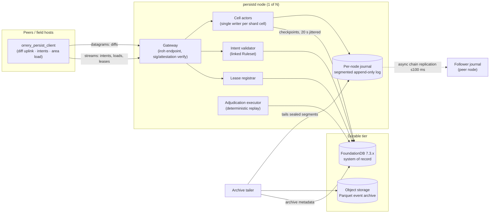
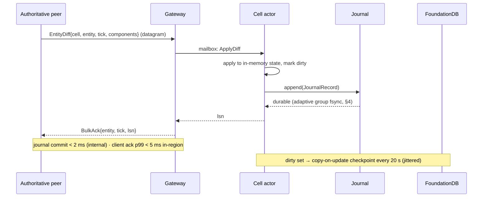
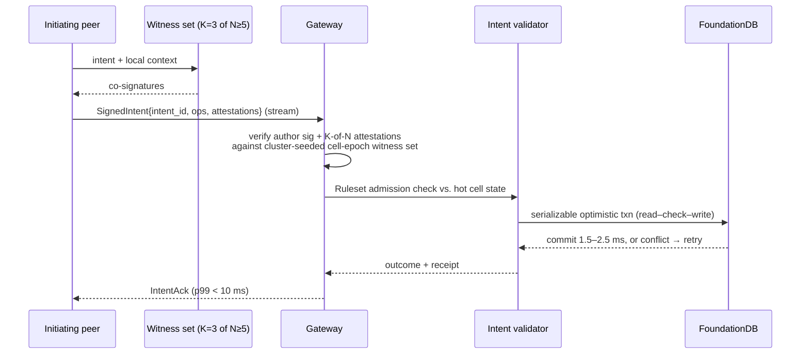
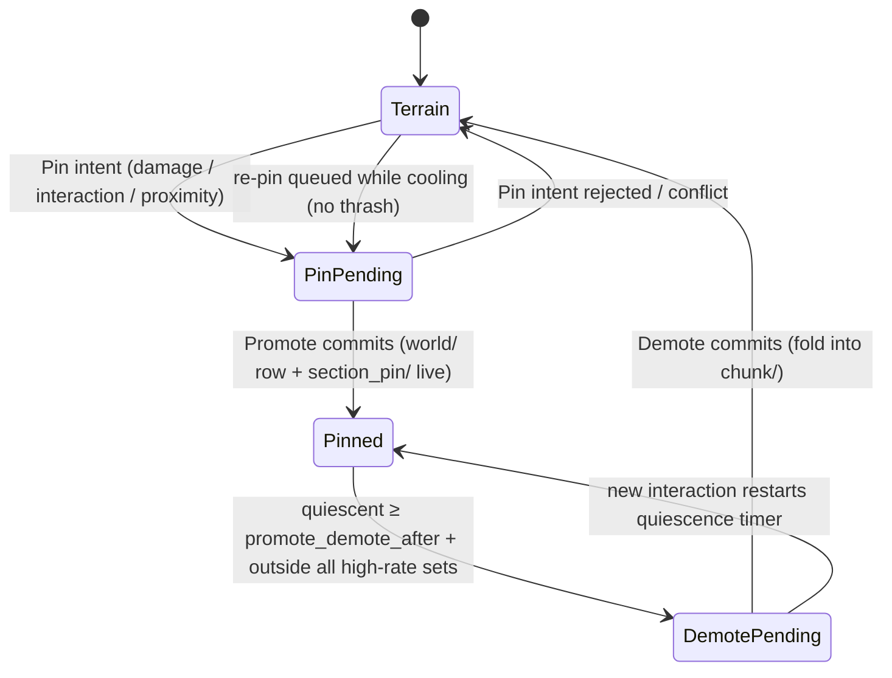

# 08 — Persistence: Cell Actors, Journal, FoundationDB

The persistence cluster (`orrery_persistd`) is the sole writer of durable truth in Orrery. It answers the owner mandate "really really fast, horizontally scalable" with a two-tier design: an in-memory, single-writer **cell actor** tier fronted by a per-node append-only **journal** (journal commit < 2 ms server-internal, client-observed acks p99 < 5 ms in-region — never blocking the simulation), backed by **FoundationDB** as the strictly-serializable system of record (checkpoints for bulk state; synchronous transactions for anything with economic value). This document specifies the full write paths, the actor model and its recovery/split protocols, the journal and its honest durability windows, the complete FDB keyspace schema, a worked item-trade transaction, terrain and event-history handling, hotspot management, scaling math, backup/DR, at-rest schema versioning, and world seeding/content patching.

Normative source: [ADR-0011](adr/0011-persistence.md) (with [D5](adr/0005-spatial-model.md) for `CellId`/sharding, [D7](adr/0007-authority-and-leases.md) for leases, [D10](adr/0010-witnessing.md) for attestations, [D12](adr/0012-backend-services.md) for the service inventory, and [D16](adr/0016-parameter-reference.md) for parameters).

## 1. Architecture

The current `orrery_persistd` reference binary runs one process per node, with a
static primary/follower journal-chain topology available for two-process
recovery. Games link their `Ruleset` (D9) into their own `persistd` binary —
the harness is a library; dynamic multi-node placement remains a later step.



- **Gateway** — the iroh-facing front door. Terminates peer connections (peers dial well-known addresses; no hole punching server-side, D3), verifies intent signatures and witness attestations, routes diffs to cell actors (local or remote via internal tonic/gRPC), serves area loads, and multiplexes lease traffic.
- **Cell actors** — one single-writer actor per *shard cell* (8×8×8 interest cells, D5/D16) holding that region's hot state in memory.
- **Journal** — one segmented append-only log per node, shared by all actors on the node, adaptively group-committed (< 2 ms server-internal, §4).
- **Lease registrar** — arbiter for authority leases (D7): CAS on `lease/{entity_id}` rows, TTL 10 s, heartbeat 2.5 s, batched. Logically a distinct component, physically it executes **inside each cell actor's single-writer event loop** (lease rows shard with their cells); the gateway routes lease traffic to the owning actor.

**Implemented authority status (2026-08-16).** Lease rows are durably written
on acquire, park, expiry, restore, and committed rekey; heartbeats update only
hot actor state. A TTL sweep returns the rows that lost a holder — with the
holder and token they lost — so the gateway can select a successor without
re-reading the registrar; the actor also tracks the highest journal position it
has folded per entity, which is what makes a divesting holder's `Divest.cursor`
checkable rather than merely carried. Each row has a durable cell-location index, so actor recovery
loads only its own leases and gives restored rows a fresh conservative TTL.
Committed rekeys are server-only: the journaled record moves the entity and its
lease index together, preserves holder/sequence/fence, rejects stale presented
cells, and leaves no partial migration after an error. Client lease-rekey
control messages and rekey bulk records are rejected at the gateway.
- **Intent validator** — runs `Ruleset` admission checks against hot state, then executes the FDB transaction.
- **Adjudication executor** — re-executes discrepancy-report evidence bundles (D10) in the headless `orrery_core` replay harness; retains the last **3** ruleset builds as version-keyed sidecar workers and routes each bundle by its `RulesetId` (bundles older than retention are *unadjudicable* — no strike, D10); verdicts produce write refusals/annulments and `strike/` rows.
- **Archive tailer** — compacts sealed journal segments into Parquet objects (event history, R7).

## 2. The two write classes

Everything durable enters through exactly one of two paths. The split is `Ruleset`-classified (D9): anything touching persistent *value* (items, currency, progression, structure placement) is critical; everything else (positions, health, world-entity state, terrain deltas) is bulk.

| Property | Bulk state | Critical operations |
|---|---|---|
| Trigger | replicon change-detection diffs, ~1–4 Hz per entity, priority-scheduled | signed, witness-attested intents (K=3 of N≥5, D10) |
| Transport | iroh unreliable datagrams | iroh reliable stream |
| Durability point | journal group-commit fsync (adaptive, < 2 ms server-internal) | FDB serializable commit |
| Ack target | **journal commit < 2 ms (server-internal) · client-observed ack p99 < 5 ms in-region** | **< 10 ms p99 in-region** |
| RPO | ≤ ~100 ms (chain-replicated journal, default) | **0** |
| Reaches FDB | checkpoint, **20 s jittered** cadence | synchronously, in the ack path |

### 2.1 Bulk path



The ack is issued **after** the record's group fsync completes — the ack *is* the durability contract. The two targets are measured at different points: **journal commit < 2 ms** from actor append to fsync completion (server-internal); **client-observed ack p99 < 5 ms** from datagram send to `BulkAck` receipt (in-region, RTT included). `orrery_persist_client` keeps unacked diffs buffered and resends on reconnect (records are idempotent: keyed by `(entity, tick)`, last-writer-wins per component within an entity's single-writer stream). This design — unreliable datagrams + application-level acks + idempotent records — is **normative** for the bulk uplink; the reliable stream carries only intents, loads, and leases ([02-networking.md](02-networking.md)). Nothing in this path touches FDB, so bulk throughput is bounded by journal appends, not database ops.

**Epoch-fenced acks (split-brain guard).** An actor may issue durable acks only while its shard-ownership epoch (§3.4) is **confirmed fresh**: it heartbeats an FDB read version roughly every **1 s** and treats its epoch as stale after a **3 s staleness bound** — deliberately below the failure-detection + re-placement time, so a partitioned former owner falls silent before a replacement can be fenced in and serving. While stale, the actor downgrades to **provisional acks**, which the client treats as unacked (kept buffered, resent to the new owner). Every `JournalRecord` carries the epoch it was appended under, so recovery replay discards records from a superseded epoch; §4.1 quantifies the residual window.

**Bulk-path validation.** The cell actor runs the stateless `Ruleset` invariant validators (D9/D10 — the same speed/acceleration/rate/impossible-value checks witnesses run) on inbound diffs: **mandatory** for entities in cells with fewer than N witness candidates — closing the solo-player-in-an-empty-cell hole, where no witness set exists to observe the author — and **sampled** elsewhere. Violations are rejected (NACK) or flagged to the adjudication pipeline.

### 2.2 Critical path



**Delivery is at-least-once, and stays that way.** Intent submission rides the reliable lane, so an intent is not lost to a dropped packet — but the window that made at-least-once necessary is not a transport window and does not close. A gateway can receive a submission, commit it durably, and lose the connection before the ack reaches the client; from the client's side that is indistinguishable from a submission that never arrived, so it replays on reconnect. What makes the replay safe is the `intent/{intent_id}` idempotency row read in step 0 of §7: a replayed intent returns the recorded outcome rather than applying twice. **At-least-once delivery plus an idempotency key is a route to exactly-once *outcomes*, and no transport supplies one** — the pairing is retained deliberately, not left over.

The client-side in-flight timeout that accompanies it changed meaning rather than going away. It was a retransmit timer for a submission lost on the packet lane; on a reliable lane a submission on a live connection cannot be lost without the connection dying, and a dying connection already requeues everything in flight. It is now a liveness backstop for a gateway that accepted an intent and never answered — which is why it sits at 10 s, three orders of magnitude above the p99 < 10 ms commit budget. A backstop near the commit budget would resubmit against precisely the gateway that is already struggling.

Two-stage validation, deliberately: the hot-state `Ruleset` check is a **fast admission filter** (reject obviously invalid intents without an FDB round trip, using live positions/inventory the actor already holds); the **FDB transaction is the sole authority** for ledger state — it re-reads and re-checks every durable invariant inside the transaction. Hot state mirrors ledger rows; it never owns them. This is the Diablo II lesson (D10) enforced structurally: no client, and no in-memory tier, can mint value.

## 3. Cell actor model

### 3.1 Single writer, mailbox, state

A cell actor is a tokio task owning all hot state for one shard cell — the persistence-side twin of the single-writer invariant (D2). All mutation flows through its mailbox; readers get snapshots via message, never shared mutable access.

```rust
// orrery_persistd (sketch)
pub enum CellMsg {
    ApplyDiff(EntityDiff, AckHandle),
    ReadSnapshot { cells: SmallVec<[CellId; 27]>, reply: mpsc::Sender<SnapshotPage> },
    Precheck(LedgerPrecheck, oneshot::Sender<PrecheckVerdict>),   // intent admission
    Rekey { entity: PersistId, from: CellId, to: CellId },        // cross-cell movement commit (D7)
    Checkpoint(CheckpointCause),          // Timer{jitter} | Quiesce | PreSplit
    Split { epoch: Epoch, children: [ShardCellId; 8] },
    Shutdown,
}

pub struct CellActorState {
    shard: ShardCellId,
    epoch: Epoch,                                   // fencing token (§3.4)
    entities: HashMap<PersistId, EntityRecord>,     // per-component encoded bytes + dirty bits
    by_cell: HashMap<CellId, kiddo::KdTree<f32, 3>>,// intra-cell spatial queries (D5)
    terrain: HashMap<CellId, ChunkState>,           // base + pending deltas (§8)
    dirty: DirtySet,                                // entities touched since last checkpoint
    ckpt_watermark: Lsn,                            // journal LSN covered by last checkpoint
}
```

`EntityRecord` stores components as individually `postcard`-encoded byte slices (`orrery_protocol` types): diffs apply by slot replacement without decoding, checkpoints serialize by concatenation, and the actor never needs the game's component types — only the `Ruleset` does.

### 3.2 Placement: rendezvous hashing over shard cells

Shard cells map to nodes by **rendezvous (HRW) hashing**: `owner(shard) = argmax_n weight_n · h(shard_id, node_id)`. Properties we need and get: no central assignment table for the common case, minimal disruption when nodes join/leave (only shards whose argmax changed move), and capacity weighting. The authoritative placement record (for fencing and splits, §3.4/§3.5) lives in FDB at `actor/{shard_cell_id}`; gateways cache the HRW result and repair on epoch-mismatch NACKs.

### 3.3 Why an in-memory tier at all

Because the alternative was surveyed and loses: Redis-class stores acknowledge writes that async replication can lose on failover ([Redis cluster docs](https://redis.io/docs/latest/operate/oss_and_stack/management/scaling/)), and in-process state in the persistence node is strictly cheaper than a network hop to a cache that has the same durability posture. The literature agrees on the shape: single authoritative actor per region + append-only event journal + write-behind checkpointing is the recommended MMO persistence structure ([Cornell VLDB 2009](https://www.cs.cornell.edu/~tuancao/2009-VLDB-Checkpoint.pdf), [Netherite](https://arxiv.org/pdf/2103.00033)). CRDTs are deliberately absent from the hot path — single writer per cell makes them unnecessary (noted future option for offline build modes only, D11).

### 3.4 Restart and recovery

On assuming shard `S` (cold start, node replacement, or relocation):

1. **Fence:** CAS `actor/{S}` from `(old_node, e)` to `(self, e+1)` in one FDB transaction. The new epoch `e+1` is the fencing token; every subsequent checkpoint transaction *reads* `actor/{S}` and aborts if the epoch moved — a zombie actor (network-partitioned former owner) can never commit a stale checkpoint, because its commit would conflict with the CAS.
2. **Load checkpoint:** range-scan `world/{cell_id}/…` for all interest cells in `S`, plus `chunk/{cell_id}/…`; read `ckpt/{S}` for the journal watermark `(node_id, lsn)` of the last checkpoint.
3. **Replay tail:** replay journal records for `S`'s cells with `lsn > watermark` — from the local journal if restarting in place, from the **chain-replication follower** if the node died, from the archive if both are gone.
4. **Open mailbox**, bump gateway routing.

Recovery time is bounded by checkpoint size + ≤20 s of journal tail — seconds, not minutes, per the [Cornell copy-on-update analysis](https://www.cs.cornell.edu/~tuancao/2009-VLDB-Checkpoint.pdf).

### 3.5 Hotspot split / relocate

Range-sharding on a space-filling curve concentrates a crowd's writes on one shard — the [FDB #11510 hotspot pattern](https://github.com/apple/foundationdb/issues/11510) — so the actor tier splits *ahead* of the storage tier feeling it. Telemetry per actor: player count in shard (from coordinator presence), mailbox depth, append rate.

```mermaid
sequenceDiagram
    participant T as Telemetry/coordinator
    participant P as Parent actor (epoch e)
    participant F as FoundationDB
    participant K as Child actors (epoch e+1)
    participant G as Gateways
    T->>P: split threshold sustained (with hysteresis)
    P->>F: txn: write actor/{child_i} = (HRW owner, e+1) ×8, mark actor/{S} = Splitting
    P->>P: quiesce-flush: immediate checkpoint (PreSplit), stop accepting diffs (NACK epoch)
    K->>F: load child cell ranges from checkpoint
    K->>P: replay journal tail (cell-indexed, prefix-filtered per child)
    K-->>G: ready(epoch e+1)
    G->>G: reroute on epoch bump; retried diffs land on children
    P->>F: retire actor/{S}
```

The same machinery with one child at the same level is a **relocate** (move a hot shard to an underloaded node, overriding HRW via the `actor/` row). Diffs NACKed during the handover window (target: < 1 s) are **dropped** by the client scheduler, not retried (`UplinkScheduler::on_nack`): the uplink holds one pending diff per entity, so the next change-detection diff restates the entity against the new owner, and records are keyed `(entity, tick)` so nothing survives that the following tick does not re-send. Retrying the NACKed diff itself is deferred — a rejected write is usually rejected for a reason a resend does not change. Either way it is invisible to gameplay, because bulk acks are not in the frame loop. Merges run the protocol in reverse when children fall below the low-water mark for a sustained period.

## 4. Journal design

Per-node (not per-actor: one fsync stream per disk is the point), segmented, append-only:

- **Segments** of 128 MiB, named by monotonic sequence; a segment is *sealed* when full or on rotation, then immutable — the archive tailer's unit of work.
- **Group commit — adaptive:** appends from all actors on the node accumulate in a ring; the committer issues `fdatasync` **immediately when the disk is idle** (a lone record pays only device latency) and falls back to **~0.5 ms batching** under load (or when the batch hits a size cap), keeping append→durable **< 2 ms server-internal** (D16). Every waiter in the batch resolves on one fsync. On NVMe this sustains hundreds of thousands of records/s at up to ~2 000 fsyncs/s.
- **Record** (`orrery_protocol` sketch):

```rust
pub struct JournalRecord {
    pub lsn: Lsn,             // (segment_seq, offset) — node-local, monotonic
    pub cell: CellId,         // Morton CellId (NonZeroU64, D5) — the index key
    pub entity: PersistId,    // stable persistent id, u64 (never a Bevy Entity)
    pub tick: Tick,           // u64 universe tick (D8)
    pub epoch: Epoch,         // shard-ownership epoch at append (§2.1/§3.4 fence)
    pub author: NodeId,       // authoritative peer that produced the op
    pub kind: RecordKind,     // ComponentDiff | TerrainDelta | Spawn | Despawn | Rekey | CheckpointMark
                              // | TerrainPin | TerrainDemote  (§10.1 — pending D18)
    pub payload: Bytes,       // postcard
    pub crc: u32,
}
```

`Spawn` records carry the new entity's **`PersistId`**, minted one of two ways (D11): peer-side from a **journaled block grant** — a contiguous range of ids (default **4096**), leased to the peer per session through the gateway, allocated by atomic add on `pid/next` (§6) and recorded in the journal, so grants survive restarts and remain usable **offline** — or cluster-side inside an intent transaction, returned in the commit receipt (§7) for intent-created entities. The replicated `PersistId` component (owner-written, maintained by `orrery_persist_client`) carries the id into every peer's world and is the canonical Bevy `Entity` ↔ `PersistId` mapping ([03-replication.md](03-replication.md)).

- **Cell index:** a per-segment sparse index `(cell_id → offset list)` written as a segment footer, so recovery and split replay read only the relevant cells' records, not the whole segment. Implementation: raw segmented files with the footer index, or [fjall 3.x](https://fjall-rs.github.io/post/fjall-3/) (active, pure Rust, ~42 K LOC vs. RocksDB's ~700 K) if we want its compaction machinery; **not RocksDB unless profiling demands it** (D11).
- **Chain replication — default ON:** each node streams its journal to exactly one async follower (next node in HRW order over node ids; ops-overridable, placed in a different AZ). The follower persists segments verbatim. Replication is async — it is *not* in the ack path — with lag monitored and alarmed above 100 ms.

### 4.1 Honest durability windows

What an **acked** write survives, by failure and mode:

| Failure | Bulk, journal-only (chain OFF) | Bulk, chain replication ON (**default**) | Critical (FDB) |
|---|---|---|---|
| `persistd` process crash (disk intact) | 0 loss (acked ⇒ fsynced) | 0 loss | 0 loss |
| Node/disk loss | up to **20 s + jitter** (last checkpoint) | ≤ **~100 ms** (follower lag) | 0 loss |
| Node **and** its follower lost | — | up to 20 s + jitter | 0 loss |
| AZ loss (follower cross-AZ) | up to 20 s + jitter | ≤ ~100 ms | 0 loss (FDB spans AZs in-region) |
| Zombie actor (partitioned former owner) | acks issued inside the ≤ **3 s** staleness bound (§2.1) may cover records replay discards as superseded-epoch | same ≤ 3 s residual | 0 loss (txn epoch-checks `actor/{S}`) |
| Region loss | last archive + FDB backup | last archive + FDB backup | last FDB backup point |

Unacked in-flight diffs are always the client's to resend; the table is about acked data. The zombie row is the **residual split-brain window** the epoch fence cannot close: a partitioned former owner can keep acking for up to the 3 s read-version staleness bound before downgrading to provisional acks (§2.1). Because the bound sits below failure-detection + re-placement time, a successor is normally not yet serving during that window, so the residual is a bounded theoretical exposure, not an expected loss path; records journaled under the superseded epoch are discarded at replay and the client's resend to the new owner closes the gap. We state the journal-only column because chain replication is a deployment toggle: single-node dev setups run with it off and accept the 20 s window.

## 5. FoundationDB as the system of record

Why FDB (pinned **7.3.x**, 7.4 tracked as upgrade candidate; `foundationdb-rs` 0.11 — D14):

- **Strictly serializable, interactive optimistic transactions across arbitrary keys** — the anti-duplication mechanism for trades needs no application locks and has no LWT contention cliffs; conflicting transactions simply retry ([FDB performance](https://apple.github.io/foundationdb/performance.html), [SIGMOD paper](https://www.foundationdb.org/files/fdb-paper.pdf)).
- **Latency:** reads 0.1–1 ms, commits **1.5–2.5 ms** at <75% load — which is why the intent path can promise < 10 ms p99 end-to-end.
- **Scale:** linear scaling demonstrated to **8.2 M ops/s** on 384 processes; per-core ~55 K reads/s, ~20 K writes/s (SSD engine).
- **Correctness pedigree:** the deterministic-simulation-tested core is [the canonical argument](https://jbaker.io/2022/05/09/project-loom-for-distributed-systems/) against rolling our own; the Rust binding is validated hourly against thousands of BindingTester seeds and has ~15 M downloads ([foundationdb-rs](https://github.com/foundationdb-rs/foundationdb-rs)).
- **Ops:** 3–5 node clusters via [fdb-kubernetes-operator](https://github.com/foundationdb/fdb-kubernetes-operator) or systemd + `fdbcli`; Apache 2.0, no licensing caps.

The [known limits](https://apple.github.io/foundationdb/known-limitations.html) and how the design respects each:

| FDB limit | Design consequence |
|---|---|
| 5 s transaction duration | all transactions are short read–check–write sets (intents) or bounded checkpoint batches; long scans (area load, archive) use continuation ranges across transactions |
| ~10 KB key | keys are tuple-encoded ids, tens of bytes |
| ~100 KB value | entity rows sharded if oversized; terrain chunks stored as ≤100 KB shard rows `chunk/{cell_id}/{n}` |
| 10 MB transaction | checkpoints split into multiple transactions by key range; the per-shard watermark row commits **last**, so a partially applied checkpoint is simply re-run (rows are idempotent overwrites) |
| multi-DC commit tail (~22 ms mean / 281 ms p99.9 with satellites) | one FDB cluster **per region**; no cross-region transactions (D11 latency targets are in-region) |

Hot-key conflict retries are application responsibility under optimistic concurrency — addressed by the actor tier absorbing bulk writes (FDB sees 20 s aggregates, not 4 Hz streams) and by §11 pre-splitting.

## 6. Keyspace schema

**This table is the single source for the cluster keyspace** — [09-services-and-ops.md](09-services-and-ops.md) and [10-crates.md](10-crates.md) reference it rather than restating rows. All subspaces are allocated once via the Directory layer; keys below show the logical tuple encoding. `{cell_id}` is the 64-bit Morton `CellId` (`NonZeroU64` — the sentinel bit guarantees non-zero, D5) written big-endian, so FDB's sorted keyspace inherits Morton order: **a shard cell's subtree is one contiguous range** (parent = prefix), and "everything near me" is a handful of range scans. Morton has locality discontinuities at power-of-2 boundaries, so neighborhood reads always enumerate the 27 explicit cell ranges rather than one raw span; an optional **Hilbert remap** (via [lindel](https://lib.rs/crates/lindel)) can be applied at the storage layer only, behind the same trait, if scan locality measurably matters.

| Subspace / key | Value | Writer | Notes |
|---|---|---|---|
| `world/{grid_id}/{cell_id}/{entity_id}` | `0x00 ‖ component bag` (postcard) | cell actor (checkpoint) · offline import tool | primary bulk state. `cell_id` is the entity's **own interest cell**, grid-relative; `grid_id` is an explicit key field, not context (P-7). Values > 100 KB are a **hard error**, not a split row — see the note below the table |
| `grid/{grid_id}` | `(parent GridId, origin transform, velocity, status)` | cell actor (checkpoint) | nested-grid frame registry ([01-spatial-model.md](01-spatial-model.md) §13): a carrier's motion re-keys *this one row*, never its contents; `world/` keys are read per-grid |
| `world/{grid_id}/{cell_id}/{entity_id}` *(tombstone)* | `0x01 ‖ (tick, gc_deadline_ms)` | cell actor | same key family as the live row, distinguished by the value's first byte; cleared by the checkpoint GC pass past its deadline (P-6) |
| `player/{account_id}` | profile, progression, settings | intent path | critical-class |
| `player/{account_id}/loc` | `(cell_id, entity_id)` | cell actor on rekey | login placement pointer. **Not yet written:** the rekey path relocates the durable *lease* location index, not this row; the key builder exists and no writer calls it |
| `ledger/bal/{account_id}/{asset_id}` | integer balance | **FDB txn only** | currency; integer math (D9) |
| `ledger/item/{item_uid}` | `(owner_ref, item_state)` | **FDB txn only** | unique items; single ownership row = anti-dupe invariant |
| `ledger/receipt/{versionstamp}` | `(intent_id, parties, ops)` | FDB txn (versionstamped key) | trade audit trail, strictly ordered |
| `intent/{intent_id}` | `(outcome, gc_deadline_ms)` | FDB txn | idempotency: a duplicate submission returns the recorded outcome. Retention is bounded — default **1 h**, swept by the same checkpoint pass that GCs despawn tombstones. A client's offline intent queue TTL must be shorter than this, or a replay after a long netsplit can double-apply |
| `lease/{entity_id}` | `(holder NodeId, seq: SeqPair(auth_seq, own_seq), lease_id, expires_at, flags, group)` | lease registrar (CAS) | D7; TTL 10 s, heartbeat 2.5 s; `lease_id` = monotonic fencing token (gateway drops stale-`lease_id` uplinks); `flags`: `PLAYER_BOUND`/`STRONG_HELD`/`PROVISIONAL`/`PARKED`; `group` = attached children; full field semantics in [04-authority.md](04-authority.md) (canonical) |
| `chunk/{grid_id}/{cell_id}/{n}` | terrain shard ≤ 100 KB | cell actor (compaction) · offline import tool | §8; `n` is a big-endian `u16` so a cell's sections sort together |
| `chunk/{grid_id}/{cell_id}/meta` | `(shard_count, base_version, encoding)` | cell actor | |
| `section_pin/{section_key}` | `(entity PersistId, cell, status: pin_pending\|live\|dormant\|cooling(until), tick_pin, tick_promote, tick_demote, demote_image_hash, demote_chunk_ref)` | transition intents (§10.1) | terrain↔entity promotion anchor — D17.7, pending D18 |
| `actor/{shard_cell_id}` | `(owner node, epoch, status)` | split/fence protocol | placement + fencing (§3.4) |
| `ckpt/{grid_id}/{shard_cell_id}` | `(node_id, journal lsn, epoch, time)` | cell actor | recovery watermark, and **nothing else** — the entity bag lives in `world/` rows only (P-8) |
| `jarchive/{node_id}/{segment_seq}` | `(object key, cell ranges, lsn span, checksum)` | archive tailer | journal-archive metadata |
| `id/{account_id}` | account record, bound NodeIds, tokens | `orrery_identity` | canonical identity subspace; Sybil cost anchor (D10) |
| `strike/{account_id}/{versionstamp}` | `(weight, decay t½=14 d, evidence ref)` | adjudication executor | read by identity for quarantine/ban thresholds |
| `epoch/{cell_id}` | witness-epoch record: seed-key commitment (blake3), epoch bounds, revealed key at epoch end | coordinator (via gateway) | D10 witness-set seeding; commitment published in the epoch announcement, key revealed for retroactive verifiability |
| `coord/leader` | coordinator leader lease (TTL) | coordinator (CAS) | active + warm-standby failover ([09-services-and-ops.md](09-services-and-ops.md)) |
| `pid/next` | next unallocated `PersistId` (atomic add) | gateway (block grants) · intent path | block grants: contiguous ranges (default **4096**) leased per session, journaled, usable offline (§4) |
| `content/version` | `(content build id, manifest digest, scenario seed, config digest, toolchain, seeded_at)` | offline import tool | designed-content diff/patch on later deploys (§17, [12-world-seeding.md](12-world-seeding.md) §9.3) |
| `seedmap/{content_key}` | `(PersistId, grid, cell, first_seen_build)` | offline import tool | the idmap that makes a re-seed keep its `PersistId`s ([12-world-seeding.md](12-world-seeding.md) §9.2) |
| `seedprog/{emit}/{grid}/{cell}` | subtree completion marker | offline import tool | resume marker for an interrupted bulk load ([12-world-seeding.md](12-world-seeding.md) §11.1) |

**Implementation.** The byte layout of every row above is defined once, in
`orrery_persistd::keyspace` — one module used by the checkpointer, the cold
reader, the intent path and the offline seeder alike, so a key convention
cannot drift between its writers. Each family carries a one-byte discriminator
in place of the logical string prefix (`w` world, `c` ckpt, `k` chunk, `a`
actor, `i` intent, `s` seedmap, `p` seedprog, `v` content/version); the
families are provably range-disjoint and a test asserts it pairwise.

**No split rows (P2 decision, 2026-08-13).** An earlier revision of this table
specified that a `world/` value above FDB's 100 KB limit splits into
`world/…/{k}` rows with a `u16` suffix, read back as one range. That is not
implemented and P2 does not implement it: the reader identifies a `world/` row
by its exact key length, so a split row would be invisible to both `load` and
`read_cold`, and making it visible complicates the cold reader, the checkpoint
writer, the seeder's manifest and its `verify` pass simultaneously. Instead an
over-limit value is a **hard error** — the seeder rejects it at plan time
(V9, [12-world-seeding.md](12-world-seeding.md) §10) and the checkpointer
refuses rather than writing a value it could never read back. At the 256 B
component bag the cost model assumes, the limit is ~390× the largest bag any
P2 profile produces; split rows are a P3 item, to be revisited if a real game's
bag approaches the limit.

## 7. Worked example: item trade

Player A sells `item_uid = X` to player B for 500 gold. The intent (built by `orrery_persist_client`, co-signed by K=3 witnesses from the cluster-seeded cell-epoch set) arrives at the gateway; signatures and attestations are verified **before** the transaction — the txn trusts the gateway's verdict and re-checks only *durable* facts. Sketch against `foundationdb-rs`:

```rust
// orrery_persistd intent executor (sketch — retry loop is db.run's)
db.run(|trx, _| async move {
    // 0. Idempotency: replayed intent returns the recorded outcome.
    if let Some(prev) = trx.get(&key_intent(intent_id), false).await? {
        return Ok(Outcome::decode(&prev)?);            // duplicate delivery
    }
    // 1. Read set — these reads register conflict ranges.
    let item = trx.get(&key_item(x_uid), false).await?
        .ok_or(Reject::NoSuchItem)?;
    let bal_b = trx.get(&key_bal(b, GOLD), false).await?;
    // 2. Checks — durable invariants only (sigs/attestations verified upstream).
    ensure!(Item::decode(&item)?.owner == a,   Reject::NotOwner);
    ensure!(u64_le(&bal_b) >= 500,             Reject::Insufficient);
    ruleset.validate_trade(&trx_view, &intent).await?;  // game-level durable rules
    // 3. Writes.
    trx.set(&key_item(x_uid), &Item { owner: b, ..item }.encode());
    trx.atomic_op(&key_bal(b, GOLD), &(-500i64).to_le_bytes(), MutationType::Add);
    trx.atomic_op(&key_bal(a, GOLD), &500i64.to_le_bytes(),  MutationType::Add);
    trx.set_versionstamped_key(&key_receipt_vs(), &receipt.encode());
    trx.set(&key_intent(intent_id), &Outcome::Committed.encode());
    Ok(Outcome::Committed)
}).await
```

Semantics that make this the anti-dupe mechanism:

- **Serializable read–check–write.** If any concurrent transaction commits a write intersecting this transaction's read set between our read version and commit (B spends the same gold elsewhere; A trades X to C), the resolver rejects the commit with `not_committed`; `db.run` re-runs the closure — which then re-reads the new state and *fails the check honestly* (`Insufficient` / `NotOwner`). Double-spend requires two commits over the same `ledger/item/{X}` read — impossible by construction.
- **Atomic adds** on balances avoid read conflicts on the *credit* side (A's balance is blind-incremented) while the *debit* side keeps its read so the balance check is enforced.
- **Idempotency row** converts at-least-once intent delivery (client retries on timeout) into exactly-once outcomes.
- **Id minting in the receipt:** intents that create entities (crafting outputs, loot grants) allocate `PersistId`s inside the transaction (atomic add on `pid/next`, §6) and return them in the commit receipt — the client's predicted entity binds to its durable id on ack (§4 covers the peer-side block-grant path for bulk-class spawns).
- **Bounded retries:** after 5 conflict retries or `Reject`, the gateway returns a definitive refusal; the client's predicted intent outcome (D8) rolls back. Cross-cell trades need nothing special — the transaction spans arbitrary keys regardless of which nodes host the parties' cell actors.

## 8. Checkpointing

Cell actors checkpoint **copy-on-update**: applying a diff to a dirty-flagged entity first detaches the record from the in-progress checkpoint's view (persistent-data-structure style), so checkpoint serialization never pauses the mailbox — the scheme the [Cornell VLDB study](https://www.cs.cornell.edu/~tuancao/2009-VLDB-Checkpoint.pdf) found minimizes in-game latency impact and recovery time for MMO workloads. Cadence: **20 s, jittered per shard** (spreads FDB write load; prevents cluster-wide checkpoint synchronization). The checkpoint writes only the dirty set, in ≤10 MB transaction batches, then commits `ckpt/{shard}` (watermark LSN + epoch fence read) last. **Quiesce-flush:** a cell whose last player leaves (coordinator signal) checkpoints immediately and the actor may be parked (D7) — hot memory is bounded by *populated* cells, not universe size.

## 9. Area load

Client enters an area → `orrery_persist_client` requests the 27-cell neighborhood (D5) over a reliable stream. The gateway partitions the cells: **live cells** (an actor holds them) are served from actor memory — authoritative, ≥ checkpoint freshness; **cold cells** are served by FDB range scans over `world/{cell_id}/…` + `chunk/{cell_id}/…` (contiguous by Morton prefix). Pages stream **nearest-first** (center cell, then face/edge/corner neighbors by distance), so the client can spawn-in against page one; target **< 50 ms to first page-in** (one actor snapshot or one in-region range scan — FDB reads are 0.1–1 ms — plus serialization and one RTT). Subsequent motion turns loads into incremental single-cell fetches at the AOI leading edge, and live diffs flow via replication (03-replication.md), not the load path. For a nested-grid area (a ship's interior, [01-spatial-model.md](01-spatial-model.md) §13) the load is one `grid/{grid_id}` frame read plus the normal 27-cell scans *in the ship's grid* — the frame row tells the client where the ship is; the contents come from the ship's own `CellId` space.

### 9.1 Lanes, and why the gateway opens two streams

The load path is reliable in both directions, and the gateway's side of it is split. A QUIC stream is ordered within itself and independent of every other stream, so the assignment of traffic to streams decides what blocks what. Per connection:

- a **control** stream carries hello acks, intent acks, lease control and interest acks — sparse, small, ordered with each other;
- an **area** stream carries pages and per-cell load errors.

The split exists because the two have incompatible shapes. A 27-cell page-in is megabytes and can involve cold FDB scans; an intent ack is budgeted at p99 < 10 ms. On one stream the ack queues behind the page-in, which is the same head-of-line coupling the gateway already spends a task per message to avoid inside the process — reintroducing it at the transport layer would undo that work. Pages still share *one* stream rather than taking one each, because nearest-first page-in is an ordering property: page one must land first, and independent streams would let a corner page race the centre. Both streams open lazily, so a connection that never subscribes costs the peer no area stream. Bulk diffs and their acks stay on datagrams (§2.1), where a stale ack is worth less than a timely one.

**Pages are still chunked, for a different reason.** The `page_seq`/`chunk_index`/`total_chunks` coordinates predate the reliable lane, where they existed so an unordered datagram could be placed in its page. They are retained because the readers on both sides refuse a length prefix larger than the message cap *before* allocating for it — a peer-chosen length is otherwise a peer-chosen allocation — and because a client holding partial pages for 27 cells wants each chunk's footprint knowable in advance. The frame budget is therefore no longer an MTU figure: it is 64 KiB, an order of magnitude under the 1 MiB message cap, which against the old 1100-byte datagram budget cuts a large cell's chunk count and its per-chunk header tax by roughly 60×.

## 10. Terrain and bulk edits

Terrain is chunk-oriented and cell-aligned (one chunk = one interest cell subdivided into sections). Edits are **bulk-class**: a `TerrainDelta{cell, section, op}` journal record on the standard bulk ack path (§2.1). Every delta is **attributed to and fenced by the editing player's own `PLAYER_BOUND` lease** — the record's author must hold that lease, so edits are attributable per account and a peer cannot edit as someone else. The cell actor invariant-checks each delta before applying: **reach** (the edit lies within interaction range of the editor's committed position), **rate** (per-account edit-rate caps), **tool** (the `Ruleset` confirms the editor holds the claimed capability); violations are rejected or flagged (§2.1). **Destructive or high-value edits** (`Ruleset`-classified — structure demolition, protected-region changes) are not bulk at all: they route through the witness-attested intent path (§2.2). Live edits replicate peer-to-peer on the reliable per-cell stream ordered by `(cell, tick)`, with late joiners fetching compacted chunks from the gateway — the replication side is specified in [03-replication.md](03-replication.md) (terrain delta replication). The actor holds `base + delta list` per chunk; compaction (on checkpoint cadence, or when deltas exceed 25% of base size) folds deltas into a new base and rewrites `chunk/{cell_id}/{n}` snapshot rows, each ≤ 100 KB to respect the value limit. **Sparse elision** is mandatory: empty/homogeneous sections are not stored — the [Minecraft chunk format](https://minecraft.wiki/w/Chunk_format) precedent (empty sections elided; [region files](https://minecraft.wiki/w/Region_file_format) bundling nearby chunks is exactly our Morton-prefix locality, done with files). Untouched procedural terrain costs zero rows: absence of `chunk/` keys means "regenerate from seed".

### 10.1 Lazy terrain↔entity promotion (non-normative proposal — D17.7, pending ADR as D18)

**Status: specification-complete proposal, not ratified.** If adopted it becomes ADR decision D18 (amending D9 and D11 — D17.7). Everything in this section follows the rest of the design (one id space, witness-attested intents, single-writer cells, tolerance bands) and adds no new trust assumptions.

D9's trust model assigns mutable-terrain reads a cheap but non-adjudicated tier: a `GeometryFrame` closes replay over *which* sections and hashes a core rule consulted, but line-of-sight against *mutable* terrain is validated only as an invariant ([06-verifiable-core.md](06-verifiable-core.md) §3). That is correct for the common case — most terrain is scenery that never decides value — and wrong exactly where it hurts: a destructible asteroid that blocks a shot decides damage, and damage is core. Full-time entity treatment of every rock is the other wrong answer: entity machinery (lease, signed log, `StateClaim`s) is priced for value-dense state, and a Bulk-class entity is the worst of both worlds (§10.1.7). **Promotion is the escape hatch: pay for verifiability only when verifiability is being exercised.** A section stays terrain — hash-checked, journal-durable, zero per-tick cost — until a Ruleset-classified event makes it contested, at which point it becomes a Core entity with the full log/witness/adjudication apparatus; when the contest passes, it folds back to terrain. The rest of this section specifies trigger, identity, the `GeometryFrame`↔`NeighborFrame` seam, journaling, authorization, authority, classification, replication, failure modes, and cost.

#### 10.1.1 Triggers and hysteresis

Both directions are **Ruleset-classified, cluster-executed intents** (§10.1.5) — never ambient proximity and never a peer's unilateral act. The game registers a *promotion policy* per section class:

- **Promote when a section becomes contested.** Canonical triggers: a core rule mutates or resolves damage against the section (first shot blocked, first mining tick); a value-bearing interaction touches it (docking clamp, salvage lock). A pure proximity trigger is allowed for classes the Ruleset marks (a missile on a terminal intercept course) but is **not** the default — proximity alone does not exercise verifiability, and promoting on approach invites the §10.1.11 griefing surface.
- **Demote on sustained quiescence.** The Ruleset decides per section (default: no core interaction for `promote_demote_after`, **5 s**), *and* the section must be outside every subscribed peer's high-rate interest set ([03-replication.md](03-replication.md) §4) — a pinned entity is a pinned set member (§10.1.9), so this second condition usually dominates. A cell quiescing (§8) demotes all its pinned sections immediately as part of the quiesce-flush.
- **Hysteresis against thrash** mirrors the rest of the design (D5 cell hysteresis, [05-prediction-rollback.md](05-prediction-rollback.md) §8 band hysteresis): demotion requires quiescence **sustained for the full interval**, and after any `Demote` commits the section is in a **cooldown** (default 10 s) during which promotion triggers queue until cooldown expiry rather than executing — a section being shot at on a hair trigger pins once and stays pinned, instead of cycling per volley. Both timers are parameters (§10.1.10).



#### 10.1.2 Identity: one `PersistId`, stable across cycles

A section's id is minted **at `Pin`** from the `pid/next` allocator inside the Pin intent's FDB transaction — the same one-id-space rule as intent-created entities (§7) and designed content (§17): designed and dynamic entities share one space, and terrain joins it the moment it becomes an entity. The id is **stable across promote/demote cycles**: the `section_pin/` row (§10.1.4) survives demotion with status `dormant`, so a re-`Pin` reuses the recorded id. Rationale, in decreasing order of importance:

1. **Attributability across history.** Damage applied while pinned is durable value history; a stable id lets the journal, archive, and adjudication refer to one identity across epochs — griefing rollback and forensics (§11) work per-id without stitching aliases.
2. **Log seam correctness.** The seam record (§10.1.3) binds ticks before and after promotion into one auditable story; that story has one subject.
3. **Deterministic VC-3 RNG.** `blake3::keyed_hash(universe_seed, persist_id ‖ tick)` must resolve to the same stream on either side of the seam, or replay across it re-derives different randomness.

Rejected: re-minting per cycle (breaks all three above), and deterministic derivation from the section key alone (collides with the one-allocator invariant; the allocator is the single mint authority — derivation is an indexing choice, not a mint).

The transition's cross-cutting facts — the section's own log seam, adjudication across the boundary, and replay semantics — are canonical in [06-verifiable-core.md](06-verifiable-core.md) §6 (`TerrainPromotion` record) and §9; this section owns the persistence mechanics.

#### 10.1.3 The seam record

The transition is bound into the tamper-evident log by a new record source, `TerrainPromotion` (canonical sketch in [06-verifiable-core.md](06-verifiable-core.md) §6), the analog of `FrameChange` for class transitions:

```rust
// orrery_protocol — sketch (canonical enum entry in 06-verifiable-core.md §6)
RecordSource::TerrainPromotion { key: SectionRef }

pub enum SectionRef {
   /// Single section. `SectionKey` is stable across cycles: derived from the
   /// section's `PersistId` and anchored to its grid, so the same physical
   /// section keying a `GeometryFrame` pre-pin and a `NeighborFrame`
   /// post-promote is bit-identical.
   Section(SectionKey),
   /// Multi-chunk extent (a vessel-sized body): an explicit list of chunk
   /// refs, minted as one lease group (§10.1.9).
   Chunks(Vec<TerrainChunkRef>),
}
// payload: Pin { mint: PersistId, intent_id, hash_in, tick }
//      | Promote { section, intent_id, seed_state_hash, tick }
//      | Demote  { section, intent_id, tick }
```

The record appears in **two** logs: the interactor's (its step emitted the event — the record is part of that entity's closed input set, exactly like an `InboundEvent`) and the section's own chain (the section has a `PersistId` on both sides of the seam — see below). The seam rule the adjudicator applies:

| Epoch | Read type | Evidence |
|---|---|---|
| Before `Pin` | `GeometryFrame` | journaled `TerrainDelta`s up to `tick_pin` |
| Pinned, pre-`Promote` | `NeighborFrame { neighbor: section }` | the section's own chain (see below) |
| `Promote` → `Demote` | `NeighborFrame` + ordinary core records | the section's chain; `seed_state_hash` verified against the `world/` image |
| After `Demote` | `GeometryFrame` | `chunk/` rows (folded, §10.1.8) |

**The section's own chain across the seam.** The promoted entity's log does not begin at `Promote`: from `tick_pin` onward the section has an identity and a chain — at ticks where it is pinned-but-not-promoted it logs only the seam record (existence, not simulation), and from `Promote` onward it logs ordinary records. Concretely, the entity's first `StateClaim` covers the checkpoint image (hash = `seed_state_hash`), its first chain record is the `Promote` payload, and adjudication of a window spanning the seam consumes (a) journaled deltas up to `tick_pin` for geometry cross-checks, (b) the section's own chain for neighbor reads after pinning, (c) the interactor's frames as usual. A window *may* span the seam — unlike an `AuthorityChange`, there is no epoch boundary, because identity is continuous. A claimed seam without a committed intent is a discrete mismatch; a suppressed seam (damage claimed against a section never pinned) fails at the interactor's own log.

#### 10.1.4 Atomicity and journaling

The transition is a durable state mutation and must be atomic at two scales: within the cluster (journal + FDB) and across replicas (every peer's world agrees which epoch a section is in). The mechanism reuses existing machinery with two new `JournalRecord` kinds and one new keyspace family:

- **New `RecordKind`s:** `TerrainPin` (journaled by the cell actor when the Pin intent commits — journaled, not merely FDB-written, so the journal remains the complete event source and recovery replay reproduces the pin) and `TerrainDemote` (same, for the fold). The entity's ordinary records (`Spawn`, `ComponentDiff`, `Despawn`) are reused unchanged.
- **New keyspace family:** `section_pin/{section_key}` → `(entity PersistId, cell, status: pin_pending|live|dormant|cooling(until), tick_pin, tick_promote, tick_demote, demote_image_hash, demote_chunk_ref)`. Written inside the transition intents' FDB transactions; read by the adjudicator to resolve read-type-at-tick and by area load to serve pinned sections (§10.1.9). One `world/{cell}/{entity}` row family as usual for the entity's live state.
- **Consistency protocol** (the promotion half; demotion is its mirror):
 1. **Pin intent commits** (FDB txn): mint id, write `section_pin/… = pin_pending`, write the entity's `world/` row (checkpoint image from the section's journaled base + deltas, hash-pinned), append `TerrainPin` to the journal, broadcast `TerrainPromotion{Pin}` on the per-cell reliable stream (ordered by `(cell, tick)` — the same ordering substrate as `TerrainDelta`s, so every replica applies it at the same tick).
 2. **Lease escrow** (§10.1.6): the registrar creates the lease row with `holder = None`, `PROVISIONAL`.
 3. **Promote** (second intent, same actor pipeline): `section_pin/… → live`, grant the lease (§10.1.6), broadcast `TerrainPromotion{Promote}` on the per-cell stream. From the next tick the authority runs the entity as an ordinary Core entity.
 4. **Any crash between 1 and 3** leaves `pin_pending`: the cell actor's recovery replay (§3.4) sees the journal record, and completion is idempotent — the actor re-executes step 3 on recovery (or a retrying peer re-submits; the `intent/` idempotency row deduplicates). A crash *before* 1 commits nothing: the section is still terrain, the failed Pin intent never existed, and the interactor's log records no seam — consistent by construction.
- **Quiesce interaction:** a cell parking with pinned sections demotes them first (§10.1.1), so a parked cell holds no pinned sections and the §8 quiesce-flush stays simple.

The durable invariants the whole thing maintains: (a) a section has exactly one representation per tick — geometry xor entity; (b) the seam record exists in both logs iff the transition intent committed; (c) every epoch of a section's history lives in some durable, hash-checkable store (journal deltas, the section's chain, `world/` rows, `chunk/` rows).

#### 10.1.5 Authorization

Promotion and demotion are `Ruleset`-classified intents on the witness-attested path (§2.2), in the same class as destructive terrain edits (§10) — they create/destroy value-bearing identity, which is exactly what the intent path exists to gate. The **submitter** is the interactor whose core step emitted the event (the shooter, the miner, the docking peer): it predicts the outcome locally (§10.1.8), gathers K-of-N witness co-signatures from its cell-epoch set, and submits. The **cell actor** additionally rate-limits Pins per section and per account (§10.1.10's table; abuse cases in §10.1.11). **Demotion is cluster-initiated** (the actor evaluates the Ruleset's quiescence policy) — peers never demote, which removes the "demote to erase the audit trail" attack (the trail is journaled; demotion changes representation, not history).

#### 10.1.6 Authority and ownership

The promoted entity is a normal Core entity for lease purposes, with one bootstrap twist: between Pin and Promote the lease is in **escrow** — minted by the registrar at Pin with `holder = None`, `PROVISIONAL` — so no peer can claim a section whose state is still settling. At Promote the registrar grants the lease by the ordinary candidate rules, in priority order:

1. **Field host**, if the cell is promoted (D6) — the host already holds the cell's other entities; no new machinery.
2. **The interacting peer** (the Pin submitter), by weak claim with `basis: Contact{tick}` — the common case: the ship shooting the asteroid becomes its authority, exactly as if it had bumped a parked crate. The registrar's plausibility gate ([04-authority.md](04-authority.md) §10) applies as usual.
3. **Parked cluster-side** — if no peer is eligible (low-pop cell), the entity parks immediately (`park_tick`/`catch_up` apply from that tick, D7) and the first later `Claim` unparks it through the ordinary CAS path.

Demotion revokes the lease: the holder gets `Divest{to: None}` with the standard deadline, the final state uplinks (the `Divest.cursor` uplink-complete rule — [04-authority.md](04-authority.md) §3 — guarantees the fold image is complete), and the lease row goes dormant with the `section_pin/` row. A holder crash mid-demote is the ordinary orphan case (§4.3 there): the registrar's `last acked diff` *is* the fold image, which is why the fold uses only acked state (§10.1.8).

*One variant deliberately excluded (would amend D7):* **lease-escrowed handoff** — pinning a section while fixing its authority to the interactor across a session, past quiescence. The ordinary claim path already covers the real case (at Promote the interactor wins the weak claim by construction — it is the contact), and after Demote there is no entity to hold. Noted so the exclusion is a decision, not an oversight.

#### 10.1.7 Classification: Core, always

The promoted entity's components are `Ruleset`-classified **Core** — that is the entire point of the mechanism: its reads become `NeighborFrame`s, its damage is a logged, witness-checked core rule, and disputes over it are replay-adjudicable. **Bulk promotion is a non-goal, stated explicitly**: a Bulk-class entity gains no adjudicability over terrain (Bulk state is invariant-checked only, the same tier as mutable-terrain LOS) while paying lease, replication, and interest-set costs — it is strictly worse than either alternative. A game that wants a non-adjudicated destructible prop leaves it as terrain; a game that wants it verifiable promotes to Core. Cosmetic promotion does not exist (Cosmetic state is never persisted).

#### 10.1.8 Replication, load, and the fold

- **Live subscribers learn on the per-cell reliable stream.** The `TerrainPromotion` record rides the same stream as `TerrainDelta`s ([03-replication.md](03-replication.md) §5.4), ordered by `(cell, tick)`, so every replica switches representation at the same tick with no race against in-flight deltas. On receipt, a client despawns its terrain-section render node and spawns the entity from the Pin payload's image (or vice versa on Demote). Baselines do not transfer (a fresh entity has none) — the first replication send after Promote is absolute-encoded with the spawn boost ([03-replication.md](03-replication.md) §5.2), exactly like any spawn.
- **Late join / area load:** the gateway's area-load pages (§9) merge pinned sections into the entity stream — a cell's page lists `world/` entities plus `section_pin/` rows with status `live`, and the client spawns them as entities, never rendering the underlying chunk sections. The terrain page simply omits pinned sections (they are not geometry any more).
- **Prediction:** the interactor predicts the seam locally (presentation only — sparks on the asteroid) and reconciles on the `Promote` broadcast, the same contract as intent outcome prediction generally (D8).
- **The fold (demote) is the compaction analog.** At Demote the entity's final quantized core state is mapped back to terrain by the Ruleset (a damaged asteroid's remaining volume becomes `TerrainDelta`s; intact-but-sleeping state is elided). The actor applies the fold as ordinary `TerrainDelta` journal records, then lets normal compaction (§10) fold them into `chunk/` base rows on cadence. **Sparse elision applies (§10): a section promoted and demoted unmodified costs zero net rows** — the fold's deltas cancel against base. The `world/` entity row is tombstoned (despawn marker, §6), not deleted, so history resolves; the `section_pin/` row goes `dormant`, preserving the id (§10.1.2).

#### 10.1.9 Interaction with AOI and nested grids

- **AOI:** a pinned entity is a normal replicated entity — it joins its cell's room ([03-replication.md](03-replication.md) §3) and is scored into interest sets like any other. One rule addition: a pinned section is a **pinned high-rate set member** for any peer whose Ruleset flags it as contested-with (the Pin submitter, its target) — the same "current interaction partners must be high-rate" rule as [03-replication.md](03-replication.md) §4.1, because hit validation depends on it.
- **Nested grids:** a section lives in exactly one grid's `CellId` space. A section of a carrier's hull promotes into *that carrier's grid* (its `world/` key is grid-relative, §6) and rides the carrier's frame like any content; frame migration of the *entity* is the ordinary `FrameChange` path ([01-spatial-model.md](01-spatial-model.md) §13.3). A drifting asteroid is terrain in the root grid and promotes there — it was never a frame ([01-spatial-model.md](01-spatial-model.md) §13's nesting rule).
- **Multi-chunk bodies** (a capital-ship hull section spanning chunks) mint as a **lease group** ([04-authority.md](04-authority.md) §11.3): one `TerrainPromotion{Chunks(...)}` record, one Pin intent listing the extent, the group's sections promoted and demoted together. Demotion folds the group atomically in one intent.

#### 10.1.10 Performance budget and when not to promote

Costs, against the D16 parameter table (transition parameters are design defaults, added to D16 on ratification):

| Parameter | Default | Notes |
|---|---|---|
| `promote_demote_after` | 5 s | sustained quiescence before demote is eligible |
| `promote_cooldown` | 10 s | post-demote re-pin queue window (anti-thrash) |
| Pin + Promote commit | 2 × intent p99 (< 10 ms each) | two FDB txns; pipelined with lease escrow |
| `section_pin/` row | ~64 B | per section, dormant rows included |
| Live entity overhead while pinned | 1 core entity | log + claims + witness re-execution ([06-verifiable-core.md](06-verifiable-core.md) §10 budgets) |
| Fold (demote) | O(section extent) deltas | journaled, compacted on cadence — §10 machinery |

**When it is not worth promoting:** ambient destructible scenery nobody disputes; sections under continuous low-value interaction that would flap (the cooldown absorbs this); anything the Ruleset would classify Bulk anyway (§10.1.7). The break-even is exact: leaving a contested section as terrain costs *unverifiability* on a value-bearing decision; promoting costs one core entity's steady-state budget (well under a player character's — no movement inputs, sparse records) plus two intents per cycle. If a section cycles more than ~once per `promote_cooldown`, the policy should keep it pinned longer, not decline to pin — the hysteresis is the fix, not the mechanism.

#### 10.1.11 Failure modes and edge cases

| Case | Behavior |
|---|---|
| Crash mid-transition | §10.1.4 step 4: pre-commit = nothing happened; post-Pin/pre-Promote = idempotent completion on actor recovery or peer retry (`intent/` idempotency dedupes) |
| Concurrent promote/demote | Serialized by the single-writer cell actor + FDB txn conflict: one commits, the other's intent reads the `section_pin/` status and rejects honestly; cooldown (§10.1.1) queues re-pins |
| Shot straddles the seam | [05-prediction-rollback.md](05-prediction-rollback.md) §7.2: common case = two independent windows; `pin_pending` case = the target's authority parks the claim, verdict after `Promote` commits — never adjudicated against ambiguous geometry |
| Adjudication across the seam | [06-verifiable-core.md](06-verifiable-core.md) §9: harness switches read type at the seam tick; every history epoch lives in a durable hash-checkable store; a forged seam without a committed intent is a discrete mismatch |
| Pin-spam griefing (pin every rock in sight to burden a peer / the cluster) | Per-account and per-section Pin rate limits at the actor; witness exclusion already applies to intent parties (D10); cooldown prevents cycling; a pinned section costs its *authority* the steady-state budget, not the submitter |
| Demote-to-launder (erase state by cycling) | Impossible: history is journaled and the id is stable — demotion folds representation, never history; the dormant `section_pin/` row preserves the audit anchor |
| Cell split/merge with pinned sections | Sections migrate with their cell's `world/` and `section_pin/` rows exactly like entities (§3.5); the per-cell stream ordering survives because the seam records are journaled |
| Field-host demotion while pinned sections live | Host divests pinned entities per [04-authority.md](04-authority.md) §8 (negotiated or parked); the sections themselves stay pinned until their own quiescence |
| Escrowed lease abuse | Escrow is `PROVISIONAL` with the normal TTL; if Promote never completes (actor loss), the lease expires and the section reverts to `pin_pending` → completed or rolled back on recovery — never a live entity without a committed seam |

## 11. Event history and the archive

The journal **is** the event source (R7). The archive tailer consumes sealed segments, re-sorts records into `(cell_id, tick)` order, and writes Parquet objects to object storage, recording each under `jarchive/{node_id}/{segment_seq}`. Local segments are deleted only after (a) the checkpoint watermark has passed them and (b) the archive object is verified — the journal disk holds minutes-to-hours, the archive holds the configured retention (default: 30 days full-fidelity, aggregated statistics thereafter). Consumers:

- **Griefing rollback:** administrative inverse-op replay — select archive records by `(cell range, author/account, time range)`, generate inverse operations (terrain delta inverses, entity state restores from the preceding checkpoint), and apply them as administrative intents through the critical path (audited, attributable).
- **Offline progress / parked-cell catch-up:** on reload of a parked cell, the field host runs `Ruleset` catch-up (D7); the archive supplies the input history where catch-up depends on past events.
- **Desync forensics and adjudication context** (07-witnessing.md), and analytics export (Parquet is directly queryable by the telemetry stack, D12).

## 12. Hotspot management

Two tiers of defense against the crowd-event failure mode ([FDB issue #11510](https://github.com/apple/foundationdb/issues/11510): continuous-keyspace write hotspots cause storage-server queue growth):

1. **Actor tier absorbs rate.** FDB never sees per-tick or per-diff traffic — only 20 s checkpoint aggregates and intents. A 500-player crowd in one shard is a journal problem (which group commit handles) before it is an FDB problem.
2. **Pre-split on telemetry.** The coordinator's presence counts drive the §3.5 split protocol *ahead* of saturation (players trending toward a shard → split early, cheaply, while the parent is still healthy). Checkpoint jitter plus split children landing on distinct HRW owners spreads the resulting FDB write ranges. Under extreme load, load-shedding order is explicit: bulk ack latency degrades first (clients buffer), checkpoint cadence stretches next (durability window widens, alarmed), intents shed **last** and only by admission-queue backpressure — economic operations keep RPO 0 or fail loudly, never silently.

## 13. Scaling math

**Shared capacity assumptions** — the sizing basis for the whole backend; [09-services-and-ops.md](09-services-and-ops.md) §11 cites this table rather than restating it (invented for sizing, not ADR-normative):

| Assumption | Value | At 10 k CCU |
|---|---|---|
| Authored core entities per player | 1–2 typical | witness-log/adjudication sizing ([06-verifiable-core.md](06-verifiable-core.md), [07-witnessing.md](07-witnessing.md)) |
| Hot world entities per player | 4 | 40 k hot entities |
| Diff records/s per player | 10 (own avatar at 4 Hz + world entities at 1–4 Hz, priority-scheduled) | **100 k records/s** cluster-wide |
| Journal record size | ~260 B | **~26 MB/s** journal write bandwidth |
| Intent rate per player | 0.05 intents/s (≈ 6 reads + 5 writes each) | **500 intents/s** |
| Checkpoint dirty set | ~40 k entities per 20 s window | 2 k checkpoint writes/s to FDB |
| Cluster conclusion | — | **3–4 `persistd` nodes + 3–5 FDB nodes** |

FDB per-core throughput 55 K reads / 20 K writes (SSD engine), triple replication.

| | 1 k players | 10 k | 100 k |
|---|---|---|---|
| Diff appends/s (cluster) | 10 k | 100 k | 1 M |
| Journal write bandwidth | ~2.6 MB/s | ~26 MB/s | ~260 MB/s |
| Checkpoint writes/s to FDB (dirty ÷ 20 s) | 200 | 2 k | 20 k |
| Intent txns/s → FDB ops/s | 50 → ~550 | 500 → ~5.5 k | 5 k → ~55 k |
| Total FDB ops/s (×3 replication on writes) | ~2 k | ~17 k | ~170 k |
| `persistd` nodes (~150 K appends/s each, + follower traffic, + HRW headroom) | 2 | **3–4** | 12–16 |
| FDB cluster | 3 nodes | **3–5** | 6–9 |

Every column is linear in players — no quadratic terms — and the 100 k column sits two orders of magnitude under FDB's demonstrated 8.2 M ops/s ceiling. The binding resource at scale is `persistd` memory for hot state (populated cells only, §8 quiesce), then journal bandwidth; both shard by HRW.

## 14. Backup and disaster recovery

- **FDB:** continuous backup (`fdbbackup` agents) to object storage with periodic restore drills; this is the region-loss recovery point for all critical-class data. One FDB cluster per region (§5); cross-region is DR, not replication.
- **Journal archive** (§11) doubles as bulk-state DR: region-loss recovery = restore FDB backup, then replay archived journal ranges newer than the backup's checkpoint watermarks.
- **Restore order:** FDB restore → `actor/` registry reset (all epochs bumped) → actors cold-start from checkpoints → archive tail replay → gateways open. Leases all expire naturally (TTL 10 s) — authority re-establishes via normal CAS claims.

## 15. Failure modes and edge cases

| Case | Behavior |
|---|---|
| Zombie actor after partition | epoch fence (§3.4): its checkpoint txn conflicts on `actor/{shard}` and aborts; its journal appends are ignored at replay (superseded epoch); its durable acks stop within the 3 s read-version staleness bound (§2.1) — past it, only provisional acks the client treats as unacked (residual window quantified in §4.1) |
| Gateway routes to stale actor during split | actor NACKs (carrying the registrar row when the rejection was a fence, `GatewayReply::BulkNack.lease`); the client drops the rejected diff and the entity's next diff routes to the new owner; bulk path absorbs the <1 s window |
| FDB unavailable (netsplit posture, D12) | bulk path keeps journaling and acking (durability window widens to journal+follower); checkpoints and intents queue; P2P sim continues — degraded, not dead |
| Journal disk full / fsync stall | bulk acks shed first (clients buffer unacked diffs); intents unaffected (FDB path); alarm before shed via watermark telemetry |
| Checkpoint > 10 MB | multi-transaction batches; watermark row commits last → partial checkpoint is invisible and re-run idempotently |
| Entity > 100 KB | row sharding `world/{cell}/{entity}/{k}`; read as one range |
| Duplicate/replayed intent | `intent/{intent_id}` idempotency row returns the recorded outcome |
| Contended trade hot key (one famous vendor NPC) | conflict-retry with backoff; ledger rows are per-account so contention is per-party, not global; atomic-add credits remove the widest conflict range |
| Cross-cell trade, parties on different nodes | FDB txn spans keys regardless of actor placement; admission prechecks query both actors, but only durable checks decide |
| Crashed peer mid-uplink | lease expiry (10 s) orphans entities (D7); last acked diff is the durable state; unacked tail is lost by design (bulk class) |

## 16. At-rest schema versioning and migration

Games change their components; a persistent universe keeps rows written by every version that ever shipped. The scheme (D11):

- **Per-component schema version in the bag.** Every component slot in a `world/…` component bag (and every player/ledger row) carries its schema version alongside the postcard payload — versioning is per *component*, not per snapshot, so unrelated components migrate independently and the cell actor still never needs to decode game types (§3.1).
- **`Ruleset`-registered migration functions.** The `Ruleset` registers per-component migration functions; each must span **≥ 2 adjacent versions**, so the cluster composes v→v+1 steps into a chain that walks any historical row forward to current.
- **Lazy application.** Migrations run on **checkpoint-load and area-read** — a row upgrades when next touched and is written back at current version by the next checkpoint. An optional **background sweep** walks cold ranges at low priority, bounding how far behind any row can fall (and letting old migration code retire on a schedule).
- **History decodes too.** Journal and archive records carry their **encoding version**, so recovery replay (§3.4), parked-cell catch-up, and griefing rollback (§11) can decode records written under any retained version. Adjudication has the parallel mechanism: the executor keeps the last 3 ruleset builds as version-keyed workers routed by `RulesetId` (§1).

## 17. World seeding and content patching

A designed world has to get *into* the keyspace before the first player connects:

- **Offline import tool, built on the `persistd` harness.** The importer links the same library as the server binary (D12) and bulk-writes designed content — entities into `world/{cell_id}/{entity_id}`, terrain into `chunk/{cell_id}/{n}` — via direct FDB batch loads (no gateway, no journal: there is nothing to replay yet), minting `PersistId`s from the same `pid/next` allocator (§6) so designed and dynamic entities share one id space.
- **Content-version row.** Each import records a content build id + manifest digest under `content/version` (§6). Later deploys **diff** the new manifest against the recorded one and **patch** only changed rows; seeded rows that players have since modified are not clobbered — they are flagged for a `Ruleset`-defined merge policy instead of overwritten.
- **Full specification.** The import tool's scenario format, generator bank, targeting model, determinism contract, manifest/diff/patch mechanics and acceptance criteria are specified in [12-world-seeding.md](12-world-seeding.md), which expands this section. This section stays normative over it.
- **`universe_seed` custody.** The universe's procedural seed is generated **once per universe** and held in the operator's secret store — it is security-relevant per D9 (the verifiable core's per-entity, per-tick deterministic RNG derives from it). `persistd` nodes and the import tool read it from the secret store at startup; it never appears in the keyspace or in client-visible state.

## 18. Rejected alternatives

| Alternative | One-line reason | Source |
|---|---|---|
| **ScyllaDB** (runner-up) | best raw write throughput (p99 < 7 ms at 7 M TPS) and a first-class Rust driver, but LWTs are Paxos-based, 3–4× slower, single-partition, with pathological contention behavior — the wrong trade-safety tool; revisit only if sustained writes exceed a modest FDB cluster (~>500 K entity-writes/s) | [Scylla LWT](https://www.scylladb.com/2020/07/15/getting-the-most-out-of-lightweight-transactions-in-scylla/), [petabyte benchmark](https://thenewstack.io/what-we-learned-benchmarking-petabyte-scale-workloads-with-scylladb/) |
| **openraft general store** | pre-1.0, incomplete chaos testing; FDB's lesson is that the deterministic simulator is the hard part — our custom layer stays thin and single-purpose instead | [openraft](https://github.com/databendlabs/openraft), [simulation-first](https://jbaker.io/2022/05/09/project-loom-for-distributed-systems/) |
| **Redis / Valkey / Dragonfly** as record store | async replication loses acknowledged writes on failover; AOF `everysec` loses up to 1 s | [Redis persistence](https://redis.io/docs/latest/operate/oss_and_stack/management/persistence/) |
| **Aerospike** | CE caps at 8 nodes / ~5 TiB — kills "very large"; strong consistency is Enterprise-only | [CE limits](https://discuss.aerospike.com/t/clarification-about-the-limit-of-cluster-size-for-community-edition/9925) |
| **TiKV** | official Rust client ships "not suitable for production" in 2026 | [tikv-client](https://github.com/tikv/client-rust) |
| **sled** for journal/staging | stalled (stable from 2021); fjall 3.x or raw segmented logs instead | [sled](https://crates.io/crates/sled), [fjall](https://fjall-rs.github.io/post/fjall-3/) |
| **SpacetimeDB** | validates database-as-game-server (BitCraft) but replaces the Bevy + P2P architecture rather than persisting under it | [SpacetimeDB](https://spacetimedb.com/) |

Cross-references: cell math and sharding in [01-spatial-model.md](01-spatial-model.md); the diff uplink's replicon source in [03-replication.md](03-replication.md); leases in [04-authority.md](04-authority.md); attestations and adjudication in [07-witnessing.md](07-witnessing.md); deployment and telemetry in [09-services-and-ops.md](09-services-and-ops.md); client-side API (`orrery_persist_client`) in [10-crates.md](10-crates.md); the world seeder that writes §17's designed content in [12-world-seeding.md](12-world-seeding.md).
