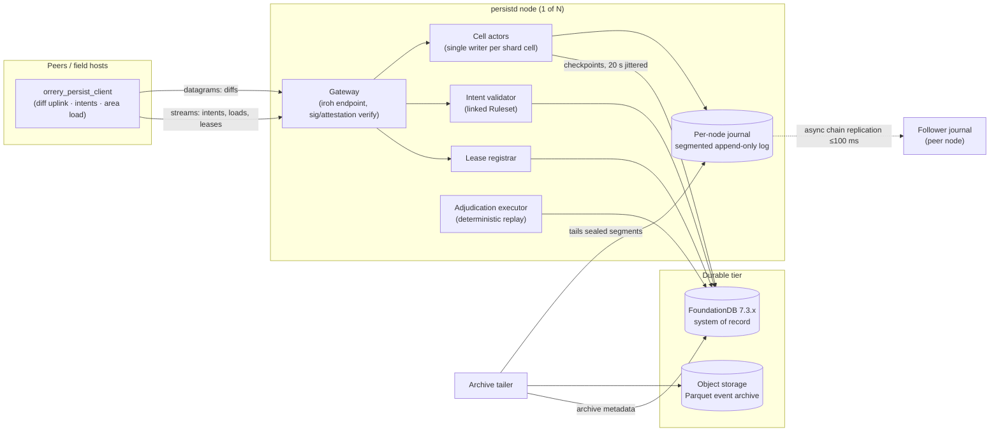
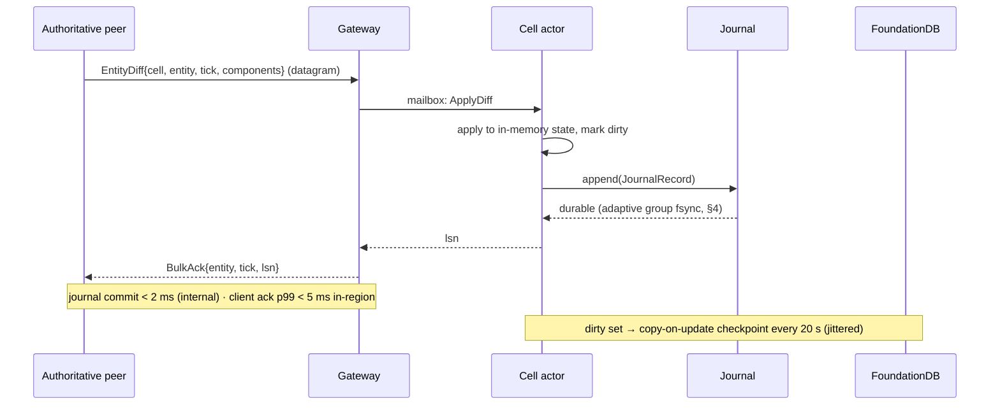
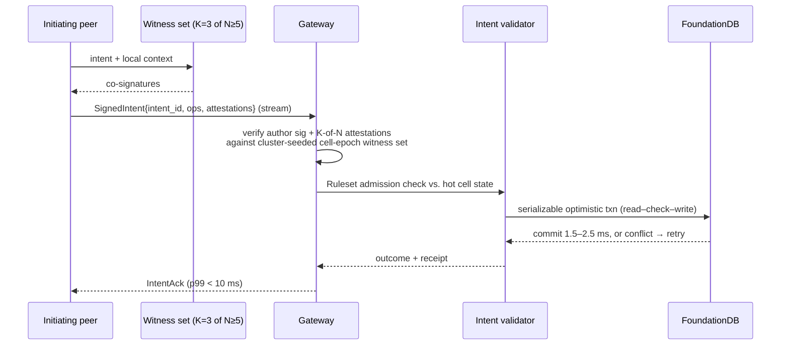
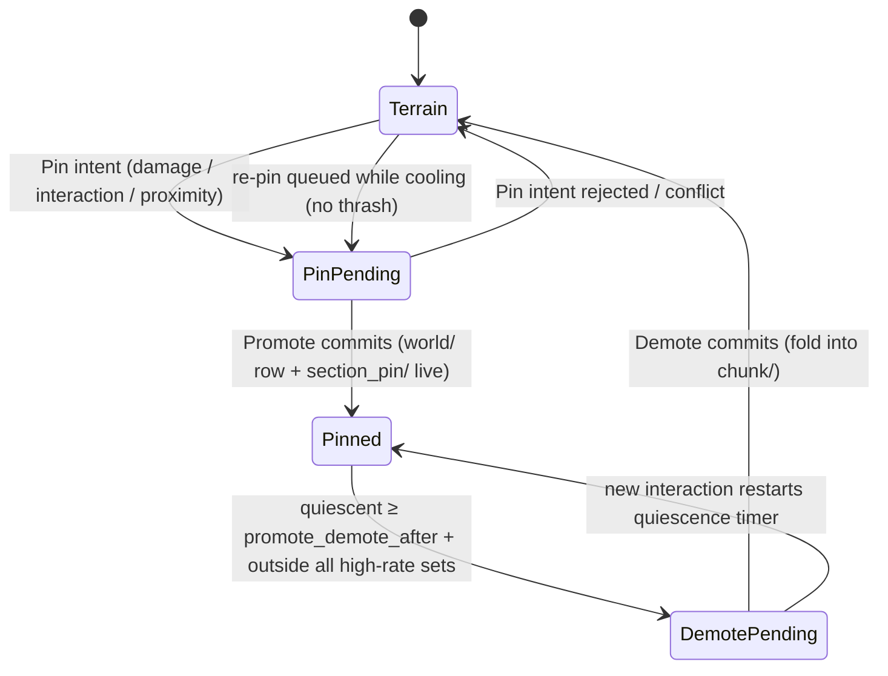

# 08 — Persistence: Cell Actors, Journal, FoundationDB

The persistence cluster (`orrery_persistd`) is the sole writer of durable truth in Orrery. It answers the owner mandate "really really fast, horizontally scalable" with a two-tier design: an in-memory, single-writer **cell actor** tier fronted by a per-node append-only **journal** (journal commit < 2 ms server-internal, client-observed acks p99 < 5 ms in-region — never blocking the simulation), backed by **FoundationDB** as the strictly-serializable system of record (checkpoints for bulk state; synchronous transactions for anything with economic value). This document specifies the full write paths, the actor model and its recovery/split protocols, the journal and its honest durability windows, the complete FDB keyspace schema, a worked item-trade transaction, terrain and event-history handling, hotspot management, scaling math, backup/DR, at-rest schema versioning, and world seeding/content patching.

Normative source: [ADR-0011](adr/0011-persistence.md) (with [D5](adr/0005-spatial-model.md) for `CellId`/sharding, [D7](adr/0007-authority-and-leases.md) for leases, [D10](adr/0010-witnessing.md) for attestations, [D12](adr/0012-backend-services.md) for the service inventory, and [D16](adr/0016-parameter-reference.md) for parameters).

## 1. Architecture

The current `orrery_persistd` reference binary runs one process per node, with a
static primary/follower journal-chain topology available for two-process
recovery. Games link their `Ruleset` (D9) into their own `persistd` binary —
the harness is a library; dynamic multi-node placement remains a later step.



- **Gateway** — the iroh-facing front door. Terminates peer connections (peers dial well-known addresses; no hole punching server-side, D3), verifies intent signatures and witness attestations, routes diffs to cell actors (local or remote via internal tonic/gRPC), serves area loads, and multiplexes lease traffic.
- **Cell actors** — one single-writer actor per *shard cell* (8×8×8 interest cells, D5/D16) holding that region's hot state in memory.
- **Journal** — one segmented append-only log per node, shared by all actors on the node, adaptively group-committed (< 2 ms server-internal, §4).
- **Lease registrar** — arbiter for authority leases (D7): CAS on `lease/{entity_id}` rows, TTL 10 s, heartbeat 2.5 s, batched. Logically a distinct component, physically it executes **inside each cell actor's single-writer event loop** (lease rows shard with their cells); the gateway routes lease traffic to the owning actor.

**Implemented authority status (2026-08-16).** Lease rows are durably written
on acquire, park, expiry, restore, and committed rekey; heartbeats update only
hot actor state. A TTL sweep returns the rows that lost a holder — with the
holder and token they lost — so the gateway can select a successor without
re-reading the registrar; the actor also tracks the highest journal position it
has folded per entity, which is what makes a divesting holder's `Divest.cursor`
checkable rather than merely carried. Each row has a durable cell-location index, so actor recovery
loads only its own leases and gives restored rows a fresh conservative TTL.
Committed rekeys are server-only: the journaled record moves the entity and its
lease index together, preserves holder/sequence/fence, rejects stale presented
cells, and leaves no partial migration after an error. Client lease-rekey
control messages and rekey bulk records are rejected at the gateway.
- **Intent validator** — runs `Ruleset` admission checks against hot state, then executes the FDB transaction.
- **Adjudication executor** — re-executes discrepancy-report evidence bundles (D10) in the headless `orrery_core` replay harness; retains the last **3** ruleset builds as version-keyed sidecar workers and routes each bundle by its `RulesetId` (bundles older than retention are *unadjudicable* — no strike, D10); verdicts produce write refusals/annulments and `strike/` rows.
- **Archive tailer** — compacts sealed journal segments into Parquet objects (event history, R7).

## 2. The two write classes

Everything durable enters through exactly one of two paths. The split is `Ruleset`-classified (D9): anything touching persistent *value* (items, currency, progression, structure placement) is critical; everything else (positions, health, world-entity state, terrain deltas) is bulk.

| Property | Bulk state | Critical operations |
|---|---|---|
| Trigger | replicon change-detection diffs, ~1–4 Hz per entity, priority-scheduled | signed, witness-attested intents (K=3 of N≥5, D10) |
| Transport | iroh unreliable datagrams | iroh reliable stream |
| Durability point | journal group-commit fsync (adaptive, < 2 ms server-internal) | FDB serializable commit |
| Ack target | **journal commit < 2 ms (server-internal) · client-observed ack p99 < 5 ms in-region** | **< 10 ms p99 in-region** |
| RPO | ≤ ~100 ms (chain-replicated journal, default) | **0** |
| Reaches FDB | checkpoint, **20 s jittered** cadence | synchronously, in the ack path |

### 2.1 Bulk path



The ack is issued **after** the record's group fsync completes — the ack *is* the durability contract. The two targets are measured at different points: **journal commit < 2 ms** from actor append to fsync completion (server-internal); **client-observed ack p99 < 5 ms** from datagram send to `BulkAck` receipt (in-region, RTT included). `orrery_persist_client` keeps unacked diffs buffered and resends on reconnect (records are idempotent: keyed by `(entity, tick)`, last-writer-wins per component within an entity's single-writer stream). This design — unreliable datagrams + application-level acks + idempotent records — is **normative** for the bulk uplink; the reliable stream carries only intents, loads, and leases ([02-networking.md](02-networking.md)). Nothing in this path touches FDB, so bulk throughput is bounded by journal appends, not database ops.

**Ingress admission: the gateway refuses what it cannot route in time, and counts it.** A gateway that accepts every datagram and serves it late does not remove queueing, it hides it. Measured on the kill-9 gate (2026-08-18): `client_bulk_wire_ms` p99 2 018 ms against a 5 ms budget, of which `gateway_ingress_queue_ms` — the wait between the endpoint driver handing a datagram over and the connection's receive loop reaching it — accounted for 1 992 ms, while the gateway's own `gateway_bulk_server_ms` span read 50 ms. Arrival and service rates matched over the run (540 536 sent, 540 536 acked), so this was not sustained overload but a **standing queue**: a transient built a backlog that never drained, because at ~100 % utilisation there is no slack to drain it with. Neither a larger concurrency cap nor a faster route removes a standing queue; only destroying work does.

So the receive loop now decides admission without ever waiting, on two bounds. A diff that has already waited longer than **25 ms** in the inbound queue (five times the whole D16 round-trip budget) is dropped before it is routed, and a diff arriving when the connection's `MAX_INFLIGHT_DIFF_ROUTES_PER_CONN` route slots are all busy is dropped rather than queued behind them. Both drops are silent on the wire and loud in telemetry: `GatewayIngressMetrics` counts `admitted`, `shed_stale` and `shed_saturated`, the gateway logs the running totals at `WARN` whenever they move, and the boundary sink emits them as `{"type":"gateway_ingress"}` records beside the transport-boundary histograms.

Silence, not a `BulkNack`, is deliberate. A nack means *rejected, do not resend* — the client drops the pending diff (§3.5) — whereas an un-acked diff stays pending and is re-offered on the next flush, usually as a newer tick, which is what this lane's idempotent `(entity, tick)` records are for. Dropping an un-acked diff is also the one loss this contract already permits: the ack *is* the durability promise, and "the unacked tail is lost by design (bulk class)" (§9). P2's demo criterion promises RPO 0 for acked intents and bulk loss "bounded by the journal/replication window" ([11-roadmap.md](11-roadmap.md) §P2); a diff refused at ingress was never acknowledged, so nothing that was promised is withdrawn. It is the same load-shedding order §11 states explicitly: bulk sheds first, intents last.

Measured on three interleaved before/after runs of the same gate on the same box: `bulk_ack_ms` p99 1 945 / 1 985 / 2 018 ms before, **20 / 30 / 50 ms after**, with 24–25 % of diffs shed and the acked remainder (402 807 – 405 444 of ~540 000) fully recovered by the post-kill verifier. One honest caveat, and one former one. `gateway_ingress_queue_ms` initially got *worse* (2 530–3 253 ms p99), because the histogram sampled every inbound message including the shed ones — so it measured the age of the backlog being destroyed rather than the delay being served, and stopped predicting client-observed latency. That is now fixed by splitting it: `gateway_ingress_queue_ms` records only messages the gateway **served**, and refused diffs go to `gateway_shed_age_ms`. Both are "time in the inbound queue", but a refused diff is refused *for* waiting, so pooling them guaranteed the served-latency distribution was dragged into the seconds by exactly the samples that were never served. The remaining caveat was that the loop could be stalled by the lease/claim work it ran inline, which is what let a backlog form at all. That is the next paragraph.


**The lease lane: authority work runs beside the receive loop, not inside it.** The shed rate above — a quarter of every diff offered — was not the cell actors being the limit. On the same runs the actors were at **37.8 %** utilisation (17 684 diffs/s x 2.734 ms mean `router_apply` = 48.4 actor-seconds per wall second against 128 actors). What consumed the deadline was the receive loop's own `GatewayMsg::Lease` arm: ~263 lines with **sixteen `.await` points and no `spawn`**, so a claim, a heartbeat or a divest — including `PeerState` locks and one actor round trip per `(grid, cell)` a peer holds entities in — ran to completion before the next inbound datagram was even looked at. `Subscribe` and `SubmitIntent` had already been moved off the loop; lease had not.

Lease work now goes to a **per-connection worker with its own queue** (`spawn_lease_lane`). Not a `tokio::spawn` per message: authority is a fencing protocol, and two operations on one entity may not reorder. What the code actually requires is **per-entity** order (`PeerState::leases` is keyed by entity and `complete_lease_claim` decides on the entry already indexed there) and **per-session** order (`try_reserve_lease_slot` / `complete_lease_claim` are a reserve-then-commit pair over `pending_lease_claims`); a single FIFO worker per connection is the smallest shape that gives both, and is *exactly* as ordered as the inline arm was. The queue is bounded (`MAX_QUEUED_LEASE_OPS_PER_CONN`) and full-lane refusal is a `Deny { RateLimited }` to a claimant and silence to a holder — a `HeartbeatAck { invalid }` would tell a holder to stop writing to entities it still owns, which is worse than the retry it will make anyway. Counts ride the boundary sink as `{"type":"gateway_lease"}`.

Measured on three interleaved before/after runs of the kill-9 gate, same box, same binaries otherwise:

| | before | after |
|---|---|---|
| `gateway_ingress_queue_ms` p99 (served messages) | 750 / 500 / 1 500 ms | **0.05 / 0.05 / 0.05 ms** |
| diffs shed for queue age | 138 238 / 146 090 / 146 150 (25.6 / 27.0 / 27.0 %) | **0 / 0 / 0** |
| durable bulk acks (of ~540 000 offered) | 402 466 / 394 542 / 394 994 | **536 140 / 541 264 / 539 296** |
| `bulk_ack_ms` p99 | 30 / 30 / 30 ms | 500 / 150 / 200 ms |

The head-of-line block is gone outright: the wait a served message spends in the inbound queue drops four orders of magnitude, nothing is shed for age any more, and the gateway durably acknowledges **every diff offered to it** (a2 and a3 acked 100 % of offers) — a third more durable writes than the shedding gateway managed.

The cost is that the ingress deadline no longer fires, and it was the only thing bounding client-observed latency. That is not an accident of this change, it is the same standing-queue result one stage later: with the loop no longer the constriction, the queue re-forms downstream of admission, where a per-arrival deadline cannot see it, and `bulk_ack_ms` p99 rises to 150–500 ms. Note also that the "before" p99 is a **survivorship** number — it is the distribution over the 75 % of diffs that were *not* shed, while the shed quarter has no latency at all — so the two columns' last row are not measured over the same population, and per *offer* the change is a strict improvement.

The valve that can still see that queue is `MAX_INFLIGHT_DIFF_ROUTES_PER_CONN`, which at 128 per connection x 125 sessions bounds nothing in practice (`shed_saturated` stayed 0 on every run above). One exploratory run at **8** — not the committed value — turned the invisible downstream queue back into visible shedding: 52 275 shed saturated (9.7 %), 488 629 durable acks, `bulk_ack_ms` p99 100 ms. So the trade curve is real and is a policy choice, not a defect: 25.6 % shed / 30 ms, 9.7 % / 100 ms, 0 % / 150–500 ms. Choosing a point on it is a separate change from removing the head-of-line block, which is what this one does.

**Where the queue actually went, and the valve that can see it.** The paragraph above ended on a guess with two candidates. Neither was right, and the first job of this change was to stop guessing: `gateway_bulk_stage_delta` already splits the server span into `route_queue` / `router_apply` / `journal_wait` / `reply`, and `router_apply` — the whole of `Router::apply_fenced` — held it. But `router_apply` is not one wait, it is three, in three different subsystems, so `crate::cluster::RouteStageMetrics` now splits it again and rides the boundary sink as `{"type":"gateway_route_stage"}`. Four runs of the merged branch, 30 s, 125 sessions, 10 000 entities, 128 shards, per acknowledged diff:

| stage | mean | max |
|---|---|---|
| `route_queue` — spawn to route task | 0.005 ms | 0.22–0.45 ms |
| `router_apply` | 7.8–9.5 ms | 2.15–2.21 s |
| — entity-gate wait | 7.2–9.0 ms | 2.15–2.21 s |
| — `LeaseStore::locate` (an FDB read) | 0.40–0.42 ms | 3.6–15.4 ms |
| — actor mailbox round trip | **0.006 ms** | 0.27–1.0 ms |
| `journal_wait` | 1.6–4.3 ms | 35–275 ms |

So it is **not** the tokio scheduler (`route_queue` is noise), **not** the cell actors (a 6 µs mailbox round trip — they are idle, which is consistent with the 37.8 % utilisation measured before the offload), and not primarily the committer. It is the **1024-way striped per-entity mutex** in `CellRuntime::apply_fenced`, which is held across an FDB read transaction — and which the now-concurrent lease lane takes **77 gates at a time for 16 ms mean / 50 ms max** (`heartbeat_leases` locks a peer's whole renewal set, then resolves each entry's route with its own `LeaseStore::locate` while holding all of them). That is the head-of-line block: it did not disappear when lease work left the receive loop, it moved onto the entity stripes, where a batched heartbeat and live diff traffic for the same entities now collide instead of taking turns.

A deadline bounds only a wait it is evaluated *after*. `MAX_INGRESS_QUEUE_WAIT_US` is evaluated on arrival age at dequeue, and with the loop instant it always passes. `MAX_ROUTE_ADMISSION_WAIT_US` is the same 25 ms budget and the same arrival clock, evaluated around the router round trip: a diff the router cannot admit to a journal inside its budget is dropped, silently on the wire and loudly in telemetry, as `shed_slow_route` — its own counter, beside `shed_stale` and `shed_saturated`, because an operator reading one number must not have to guess which of three queues grew. It **stops at the journal** deliberately: once the actor has admitted the record the write is going to be durable, and refusing to wait for that ack would withhold an acknowledgement for a write that happened. `journal_wait` is therefore outside the valve (and is frozen to another lane).

The budget is `GatewayConfig::route_admission_wait_us`, defaulting to the constant and overridable per node with `ORRERY_GATEWAY_MAX_ROUTE_WAIT_US`; `0` disables the valve, which is exactly the pre-change behaviour and therefore the "before" leg of every A/B below — the two legs differ in one number, not in code.

**The trade curve.** Interleaved runs of the kill-9 gate on one box, one binary. "Offered" is `admitted + shed_stale + shed_saturated`; served is `admitted - shed_slow_route`. `shed_stale` and `shed_saturated` were **0 on every run**, before and after.

| route budget | shed | `bulk_ack_ms` p99 | durable acks | `router_apply` mean | gate wait max |
|---|---|---|---|---|---|
| off (merged branch) | 0 % | 150 / 300 / 150 / 150 ms | 540.3–541.0 k | 8.0–9.5 ms | 2.15–2.21 s |
| 500 ms | 0.55 % | 150 ms | 537.9 k | 2.79 ms | 500 ms |
| 250 ms | 0.82 % | 75 ms | 536.8 k | 1.94 ms | 250 ms |
| 100 ms | 1.05 / 1.19 % | 50 / 30 ms | 534.4–535.1 k | 1.39–1.47 ms | 100 ms |
| 50 ms | 1.34 / 1.45 % | 30 / 30 ms | 533.4 k | 1.20–1.23 ms | 50 ms |
| **25 ms (shipped)** | 2.08 / 2.13 / 2.23 % | 20 / 40 / 150 ms | 528.6–529.6 k | 0.92–0.96 ms | 25 ms |
| 10 ms | 4.19 / 4.65 % | 15 / 15 ms | 515.5–518.0 k | 0.58–0.59 ms | 10 ms |
| 5 ms | 5.92 % | 20 ms | 509.3 k | 0.45 ms | 5 ms |
| *(prior)* route cap 8/conn | 9.7 % | 100 ms | 488.6 k | — | — |
| *(prior)* ingress deadline only | 25.6–27.0 % | 30 ms | 394.5–402.5 k | — | — |

Read the whole table rather than one row. **Both halves are now within reach of one point where they were not before**: at a 50–100 ms budget the gateway sheds 1.0–1.5 % of offers and answers in the tens of milliseconds, against 25 % shed for the same tail before the lease lane and 150–300 ms tail for zero shed after it. The `MAX_INFLIGHT_DIFF_ROUTES_PER_CONN = 8` point is off the frontier entirely — every budget from 5 ms to 500 ms dominates it on all three axes — and so is 5 ms, which sheds more than 10 ms for a worse p99. Everything from 10 ms to 500 ms is a genuine monotone trade with no dominating point, so **choosing among those is a policy call, not a defect to fix**. The shipped default is 25 ms because it is the number the ingress deadline already carries: one staleness policy, evaluated in two places, rather than two numbers that can drift.

The mechanism behind the curve's shape is worth stating, because it is why a *generous* budget works at all. The gate wait is a convoy with positive feedback — a held stripe makes waiters, waiters make the connection slower, a slower connection makes more waiters — and shedding the head of the convoy breaks the feedback. That is why 100 ms sheds only 1.2 % and still caps the tail at 30 ms: once the convoy cannot form, almost nothing comes near even a generous deadline. It is also why the valve *reduces* mean `router_apply` by 6–9x while refusing 1–2 % of work.

**What this does not fix.** The gate still fails, and now on someone else's number. In every valved run `bulk_ack_ms` p99 tracks `journal_commit_ms` p99 within one histogram bucket (20/10, 150/150, 40/30, 15/15, 20/20, 30/10, 50/30, 75/50, 150/75) — with the entity gate bounded, the residual client-observed tail *is* the group committer, whose own D16 target is 2 ms and which missed it on every run in this study, before and after. That is `journal/**`, frozen to this lane, so it is reported here rather than fixed. Nothing on this curve reaches the 5 ms `bulk_ack_ms` D16 target, and no setting of this valve can: the valve cannot bound a wait that begins after the record is durable.

The underlying defect was still there, only bounded: the diff write path takes a per-entity mutex and then performs an **FDB read transaction under it** (`LeaseStore::locate`, 0.40 ms mean — 98 % of the diff path's own gate hold), and the batched heartbeat path performed one such read *per entity* while holding that entity's whole batch of gates. That is what the next paragraph removes.

### 2.1.1 Taking the entity gate off the read path

**What the gate protects, before moving anything out from under it.** Every lease path in `cluster.rs` follows one shape: take the entity's stripe gate, resolve the entity's committed cell, act on the actor that owns it (`claim_lease`, `heartbeat_lease`, `validate_lease`, `park_lease`, `apply_fenced`, and `gated_mutex_actor` for the `Mutex<CellRuntime>` router). The migration side, `commit_rekey`, takes **one** gate — the entity's — and holds it across `CommittedRekeyPlan::execute`, which journals the rekey, calls `LeaseStore::migrate`, and installs the entity at the destination actor. The invariant is therefore narrower than "one writer per entity": the actors already serialise per entity in their own mailboxes. It is that **an entity's committed location is read, and acted on, atomically with respect to a migration of that entity** — and `migrate`, reached only from `execute` under that gate, is the *only* operation that ever changes that location (`LeaseStore::put` refuses to overwrite a different existing one and answers `LocationConflict` instead). The gate does not make the read possible; it makes the read's answer still true when it is used.

That is a property a counter can prove after the fact. `EntityStripeGates` now carries a per-stripe count of completed migrations, bumped inside `execute` immediately after `migrate` while the gate is still held. A reader samples the counter **before** it locates and re-reads it once it holds the gate: unchanged means no migration completed in the window, so the location read outside the gate is the one the gate would have shown. Changed sends that one entry down the original shape — gate held across its own `locate` — rather than routing it to an actor that no longer owns the entity. `heartbeat_leases` therefore resolves every location with **no gate held at all**, and then takes gates **per actor group**, around one mailbox turn and nothing else, still in `lock_entity_gates`'s deduplicated stripe order so no new multi-gate acquisition can cycle. `tests/heartbeat_gate_hold.rs` pins both halves: a single-entity renewal for an entity *inside* a parked batch must still get its gate, and an entity migrated while the batch is parked must be re-resolved rather than answered `None`.

**Measured.** Six configurations, three interleaved runs each, one box, one pair of binaries differing only in this change, 30 s / 125 sessions / 10 000 entities / 128 shards. Per fenced apply:

| leg | budget | entity-gate wait | `LeaseStore::locate` | actor mailbox | `router_apply` | `journal_wait` |
|---|---|---|---|---|---|---|
| before | off | 7.56–8.64 ms (max 2.08–2.17 s) | 0.39–0.44 ms | 0.006 ms | 8.11–9.16 ms | 2.33–3.29 ms |
| before | 50 ms | 0.75–0.80 ms (max 50 ms) | 0.39–0.44 ms | 0.006 ms | 1.21 ms | 2.32–2.41 ms |
| before | 25 ms | 0.51–0.53 ms (max 26 ms) | 0.40–0.42 ms | 0.006 ms | 0.93–0.97 ms | 2.34–2.91 ms |
| **after** | **off** | **0.011–0.015 ms** (max 5.3–20.6 ms) | 0.48–0.50 ms | 0.006 ms | **0.50–0.53 ms** | 2.27–2.43 ms |
| after | 50 ms | 0.012–0.013 ms (max 4.9–6.3 ms) | 0.47–0.48 ms | 0.007 ms | 0.50–0.51 ms | 2.41–2.68 ms |
| after | 25 ms | 0.011–0.013 ms (max 4.3–12.3 ms) | 0.47–0.50 ms | 0.006 ms | 0.49–0.52 ms | 2.55–2.85 ms |

The gate wait falls by **~600×** in the mean and from 2.1 s to 5–21 ms at the max, with the valve *off* — that is, without shedding anything. `locate` costs the same 0.4–0.5 ms it always did; it is simply no longer anyone else's wait. `router_apply` is now `locate` plus 20 µs.

And the batch hold that caused it:

| leg | batch locks / run | gates per lock | hold mean | hold max |
|---|---|---|---|---|
| before | 1 125 | 77.0 | 16.17–16.32 ms | 39–63 ms |
| after | 90 000 | 1.0 | 0.012–0.015 ms | 1.1–2.3 ms |

Read the first column with the second: the *lock* is now the per-actor-group acquisition, so one heartbeat that used to be a single 77-gate lock is many small ones. The comparable quantity is gate-microseconds and the blocking window per stripe: 1 125 × 77 gates held 16.3 ms each becomes 90 000 × 1 gate held 0.014 ms each — the same gates, taken for **1 100× less time each**. Note also what "1.0 gates per lock" says about the fold: on this workload a peer's 77 entities sit in 77 distinct shards, so `group_by_actor` produces 77 singleton groups and buys no mailbox batching here. That is unchanged by this work and is why folding was never where the cost was.

**The re-measured trade curve**, same runs, "shed" being `shed_slow_route` over offers (`shed_stale` and `shed_saturated` were 0 on all 18 runs):

| leg | route budget | shed | `bulk_ack_ms` p99 | durable acks |
|---|---|---|---|---|
| before | off | 0 % | 200 / 150 / 200 ms | 540.3–541.5 k |
| before | 50 ms | 1.29–1.52 % | 30 / 30 / 30 ms | 532.9–534.1 k |
| before | 25 ms | 1.82–2.22 % | 20 / 20 / 30 ms | 529.1–530.8 k |
| **after** | **off** | **0 %** | **15 / 15 / 15 ms** | **540.9–541.3 k** |
| after | 50 ms | 0 % | 15 / 15 / 15 ms | 540.5–541.4 k |
| after | 25 ms | 0 % | 15 / 20 / 20 ms | 540.9–541.4 k |

**There is no curve left to sit on.** `off` after the change dominates every point before it on all three axes at once — it sheds nothing, answers in 15 ms at p99, and durably acknowledges more diffs than any valved run of the old code. The monotone trade the previous section described was a trade against the gate hold, and with the hold gone the valve does not fire: at a 25 ms budget, the tightest setting measured here, `shed_slow_route` was **0 on every run**, because the gate wait it is watching never comes near 25 ms any more. So the valve is no longer load-bearing on this workload, and the honest reading is that its default is now a policy choice with no measured cost either way — inert at 25 ms, and inert at `off`. It is kept enabled at 25 ms as a bound for the workloads this study did not run, not because anything here needs it; the case for disabling it by default is that a valve that never fires is a valve nobody has tested.

**What is left is the committer, and only the committer.** After the change `bulk_ack_ms` p99 equals `journal_commit_ms` p99 exactly on every run (15/15, 15/15, 15/15 at `off`; 15/15, 20/20, 20/15 at 25 ms), against a 2 ms D16 target for the commit itself. The client-observed bulk tail is now entirely the group commit path — `journal/**`, frozen to this lane and reported rather than fixed.

### 2.1.2 Taking FoundationDB off the bulk write path

§2.1.1 got the FDB read out from under the entity gate. It left the read
itself: one `LeaseStore::locate` — a FoundationDB read transaction — per
fenced bulk diff, on the write path, which is a direct contradiction of §2's
"bulk writes reach FDB only at the 20 s checkpoint". [14-capacity.md](14-capacity.md)
§5.1 then measured what that costs: `libfdb_c` runs **one** network thread per
process, and that thread was the binding constraint on a whole 16-thread box —
25.8 % of a core at the P2 operating point, 100 % at collapse, with fifteen
threads, the NVMe array, the NIC, FDB's own server and RAM all idle beside it.

**The read is gone from the accept path.** `CellRuntime::apply_fenced` now
asks `actor(record.cell)` — the owner of the cell the client declared —
directly, and consults `locate` only when that owner rejects *without* a row
(or when there is no actor for the presented cell here, or its mailbox is
gone). It is not a cache: nothing is memoised, nothing can go stale, there is
no TTL and no invalidation hook. The decision is simply made by the component
whose own state the decision is defined over.

**Why the accept set is unchanged.** The locate was never part of the fence.
`CellMsg::ApplyFencedDiff` evaluates five conjuncts against the receiving
actor's *own* state — no pending rekey, `by_cell[e] == record.cell`, and
holder / `lease_id` / `seq` / expiry against its own registrar row — and
`apply_fenced` never rewrites `record.cell`. The locate only chose *which
actor* evaluated them. So the whole question is whether a different actor can
evaluate the same predicate to true, and one invariant answers it:

> **(J)** If an actor's `LeaseRegistrar` holds a row for entity `e`, then
> `LeaseStore::locate(e)` names a cell inside that actor's shard subtree (or
> is `None`).

Given J, an actor that *accepts* holds a live row, so `locate(e)` is in its
shard, so `actor(locate(e))` — the old route — is that same actor. The accept
set is identical with or without the read.

J has exactly **four enforcement sites**, all in `actor.rs`, and all of them
now go through `checked_row_cell`, which asserts `shard.is_prefix_of(cell)`
and returns the cell it checked — so the assertion and the write are one
expression and a later edit cannot move the row without moving the check:

| site | why the row is in-shard |
|---|---|
| `claim_lease` | the claim is routed to `actor(locate().unwrap_or(cell))` and stores `location = cell`; `LeaseStore::put` answers `LocationConflict` rather than overwrite a different location, so even a misrouted claim cannot manufacture a violation |
| `install_rekey` | runs at `actor(destination_cell)`, immediately after `migrate` set `location = destination_cell` |
| `complete_local_rekey` | the intra-shard case of the same move; source and destination are one actor |
| actor-spawn recovery | seeded from `load_cell(shard)`, which is a **prefix range scan** of `lease_cell_key` under that shard — in-shard by construction |

`tests/fenced_route_invariant_j.rs` walks every actor and checks J directly
after grant, park, sweep, cross-shard rekey, intra-shard rekey, `split`,
`activate_shards` and recovery, under both lease stores.

**Why a reject still reads.** J says nothing about a *rejecting* actor.
Cross-shard duplicate `by_cell` entries are reachable — an unfenced diff at a
new cell in another shard writes `by_cell` there without clearing the old
actor's entry — so the cell owner's "I have no row" is not proof of absence,
and the locate runs. `Rejected(Some(row))` *is* proof: a row present means, by
J, this is the location owner, so the NACK carries the same live row it always
did, and the D7 §5 duplicate-authority detector (`observe_fencing_rejection`,
which returns early on `None`) and the client's `reconcile_lease_nack` keep
working at full fidelity. The fallback is bounded by construction — **one**
locate, **at most two** mailbox turns, no loop, and no short-circuit on
anything but `row.is_some()` — and `tests/fenced_route_bounds.rs` asserts the
bound, including that a fallback resolving to the actor that already answered
does not re-send.

**One accepted divergence, in writing.** A rekey whose `LeaseStore::migrate`
committed and then reported failure (FDB's `commit_unknown_result`, or
`execute` returning `Err(RekeyError::LeaseStore)`) leaves the source actor
holding both its `pending_rekeys` reservation and its row while the durable
location already names the destination. Where the destination is in another
shard, the two routes disagree on the NACK *payload*: the old one asked the
destination and got `Rejected(None)`; the new one asks the source, which
rejects on conjunct 1 and hands back its live row. Both reject — admission is
identical — and the new payload is the more useful one, being the row the
client still holds. This is the only divergence in the state matrix, and
`tests/fenced_route_differential.rs` asserts both that it is the only one and
that it does fire.

**The margin being spent, stated as a precondition.** Before this change every
fenced diff re-read shared FoundationDB truth, so a location moved
out-of-band by another writer would have been noticed on the next diff. Now
only the actor's own state witnesses it. The requirement is therefore explicit:

> **One `persistd` process writes a grid's lease keyspace.**

That is true today — every `Router` implementation is in-process, and
`LeaseStore::migrate` is reachable at runtime only from `commit_rekey`, which
has no production caller (the gateway answers a client `LeaseMsg::Rekey` with
an unconditional `Deny{NotEligible}` and NACKs a `RecordKind::Rekey` diff) —
but it is now load-bearing rather than incidental. Cross-node exclusion
continues to rest on the durable shard-fence epochs of §3.4, unchanged.

**Monitored, not assumed.** The one silent failure mode is J being false: an
actor admitting a write against a registrar row that is not the durably
located one. So a **sampled audit** ships: one in `ORRERY_FENCED_LOCATION_AUDIT_N`
accepted fenced diffs (default 1000 in release, **1** under
`debug_assertions`, so the whole test suite audits every accept) still
performs the locate, under the gate it was accepted with, and increments
`location_mismatches` with a `warn!` when the durable location falls outside
the accepting actor's shard. **That counter must be zero.** It rides the
`gateway_route_stage` boundary record with two others: `locate_fallbacks`,
which is structurally ~0 because `strict_authority` pins `record.cell` at the
grant cell for the entity's life, and `mailbox_turns`, whose ratio to
`applies` must sit at 1.0 and can never exceed 2.0.

**Out of scope, deliberately.** `Cluster::apply_fenced` keeps its locate:
`committed_entity_cell` there is doing real cross-runtime routing — the
presented cell may be hosted by a *different* runtime — and J is a statement
about one runtime's own actors, so it says nothing about which runtime holds a
shard. `Mutex<CellRuntime>::apply_fenced` keeps its locate too; it is not on
the shipped path and would need J re-proved for its structure. Both sites
carry that reason in a comment.

The same change made phase 1 of `heartbeat_leases` — the other per-entity FDB
read stream, described in §2.1.1 — resolve its locations **concurrently**
rather than one at a time. The proof is untouched: each future samples its own
stripe mark before its own read, and phase 2's under-the-gate re-check is
unchanged. A 77-entry renewal was 77 serial round trips.

**Epoch-fenced acks (split-brain guard).** An actor may issue durable acks only while its shard-ownership epoch (§3.4) is **confirmed fresh**: it heartbeats an FDB read version roughly every **1 s** and treats its epoch as stale after a **3 s staleness bound** — deliberately below the failure-detection + re-placement time, so a partitioned former owner falls silent before a replacement can be fenced in and serving. While stale, the actor downgrades to **provisional acks**, which the client treats as unacked (kept buffered, resent to the new owner). Every `JournalRecord` carries the epoch it was appended under, so recovery replay discards records from a superseded epoch; §4.1 quantifies the residual window.

**Every gateway bulk write is fenced.** `route_session_diff` sets `strict_authority: true` unconditionally, so a `DiffUplink` without a granted `(lease_id, authority_seq)` is substituted with the never-granted `LeaseId(0)` and rejected by `apply_fenced` before it reaches the journal. Two consequences bind every client of this path, the P2 load rig (`p2-load`) included:

- **A writable entity must already exist durably.** The registrar grants a lease only when it can resolve the entity's *committed* cell and that cell is the one the claim names (`committed_entity_cell(grid, entity) == cell`). An entity that has never been journaled has no committed cell, so it cannot be claimed, so it cannot be written. Bootstrapping is a server-side or seeding concern — `orrery-seed` for a durable world, `persistd --dev-seed` for a volatile harness — never a client one.
- **A leased writer cannot move an entity between cells.** `apply_fenced` admits a diff only where `by_cell[entity] == record.cell`, and the gateway answers a client-sent `LeaseMsg::Rekey` with an unconditional `Deny{NotEligible}`; rekey is driven by the registrar and the redistributor. A client that follows an entity across a cell boundary by simply re-addressing its diffs is fenced out at the boundary. Cross-cell coverage in a load profile therefore comes from *placement*, not from motion.

`p2-load` implements exactly this: one iroh identity per session (the peer registry is `NodeId`-keyed and only a peer's newest session is current), a strong `Explicit` claim per entity before any load, a batched lease heartbeat at 3 s against the 10 s TTL, and no unleased write path at all — a denied claim or a withdrawn lease fails the run rather than degrading to writes the gateway will refuse.

**Bulk-path validation.** The cell actor runs the stateless `Ruleset` invariant validators (D9/D10 — the same speed/acceleration/rate/impossible-value checks witnesses run) on inbound diffs: **mandatory** for entities in cells with fewer than N witness candidates — closing the solo-player-in-an-empty-cell hole, where no witness set exists to observe the author — and **sampled** elsewhere. Violations are rejected (NACK) or flagged to the adjudication pipeline.

### 2.2 Critical path



**Delivery is at-least-once, and stays that way.** Intent submission rides the reliable lane, so an intent is not lost to a dropped packet — but the window that made at-least-once necessary is not a transport window and does not close. A gateway can receive a submission, commit it durably, and lose the connection before the ack reaches the client; from the client's side that is indistinguishable from a submission that never arrived, so it replays on reconnect. What makes the replay safe is the `intent/{intent_id}` idempotency row read in step 0 of §7: a replayed intent returns the recorded outcome rather than applying twice. **At-least-once delivery plus an idempotency key is a route to exactly-once *outcomes*, and no transport supplies one** — the pairing is retained deliberately, not left over.

The client-side in-flight timeout that accompanies it changed meaning rather than going away. It was a retransmit timer for a submission lost on the packet lane; on a reliable lane a submission on a live connection cannot be lost without the connection dying, and a dying connection already requeues everything in flight. It is now a liveness backstop for a gateway that accepted an intent and never answered — which is why it sits at 10 s, three orders of magnitude above the p99 < 10 ms commit budget. A backstop near the commit budget would resubmit against precisely the gateway that is already struggling.

**What the admission filter checks with no `Ruleset` linked (P2).** A deployed `persistd` runs `BaselineIntentValidator`, whose scope is exactly the checks that do not need game rules to state: the envelope's **shape** (at least one op, at most 64; ≤ 4 KiB of args per op and ≤ 64 KiB per intent — the executor mints an id and writes an effect per op inside one serializable transaction, so an unbounded op list is an unbounded transaction); the **one op this cluster's own executor interprets** (op `0`, the §7 ledger credit, whose `args` must be the 24-byte `account ‖ asset ‖ delta` triple — malformed ones are refused at the edge rather than returning `REASON_EXECUTOR_ERROR` after a round trip); the **account binding** of that op (a credit may only name the account the connection's session token authenticated as, which is what keeps the executor's blind `Add` from being a credit-anyone primitive); and **attestation authenticity** (at most 16, no repeated witness, every co-signature verifies over the canonical preimage). Rejections are `REASON_VALIDATION_FAILED` on the wire, with the specific cause logged.

It checks nothing durable, and the gap is the point: balances, item ownership, single-ownership, conservation, progression gates, quotas — none are read here, and the P2 stub executor does not check them either, so an admitted credit still mints value from nothing. Ops other than `0` are `Ruleset`-opaque and are size-checked and nothing more; K-of-N attestation thresholds and the seeded cell-epoch witness set are P5; replay is handled durably by the `intent/{intent_id}` row (§7 step 0), not by an admission-time cache. The FDB transaction remains the sole authority, and a linked `Ruleset` still owes every durable invariant above.

Two-stage validation, deliberately: the hot-state `Ruleset` check is a **fast admission filter** (reject obviously invalid intents without an FDB round trip, using live positions/inventory the actor already holds); the **FDB transaction is the sole authority** for ledger state — it re-reads and re-checks every durable invariant inside the transaction. Hot state mirrors ledger rows; it never owns them. This is the Diablo II lesson (D10) enforced structurally: no client, and no in-memory tier, can mint value.

## 3. Cell actor model

### 3.1 Single writer, mailbox, state

A cell actor is a tokio task owning all hot state for one shard cell — the persistence-side twin of the single-writer invariant (D2). All mutation flows through its mailbox; readers get snapshots via message, never shared mutable access.

```rust
// orrery_persistd (sketch)
pub enum CellMsg {
    ApplyDiff(EntityDiff, AckHandle),
    ReadSnapshot { cells: SmallVec<[CellId; 27]>, reply: mpsc::Sender<SnapshotPage> },
    Precheck(LedgerPrecheck, oneshot::Sender<PrecheckVerdict>),   // intent admission
    Rekey { entity: PersistId, from: CellId, to: CellId },        // cross-cell movement commit (D7)
    Checkpoint(CheckpointCause),          // Timer{jitter} | Quiesce | PreSplit
    Split { epoch: Epoch, children: [ShardCellId; 8] },
    Shutdown,
}

pub struct CellActorState {
    shard: ShardCellId,
    epoch: Epoch,                                   // fencing token (§3.4)
    entities: HashMap<PersistId, EntityRecord>,     // per-component encoded bytes + dirty bits
    by_cell: HashMap<CellId, kiddo::KdTree<f32, 3>>,// intra-cell spatial queries (D5)
    terrain: HashMap<CellId, ChunkState>,           // base + pending deltas (§8)
    dirty: DirtySet,                                // entities touched since last checkpoint
    ckpt_watermark: Lsn,                            // journal LSN covered by last checkpoint
}
```

`EntityRecord` stores components as individually `postcard`-encoded byte slices (`orrery_protocol` types): diffs apply by slot replacement without decoding, checkpoints serialize by concatenation, and the actor never needs the game's component types — only the `Ruleset` does.

### 3.2 Placement: rendezvous hashing over shard cells

Shard cells map to nodes by **rendezvous (HRW) hashing**: `owner(shard) = argmax_n weight_n · h(shard_id, node_id)`. Properties we need and get: no central assignment table for the common case, minimal disruption when nodes join/leave (only shards whose argmax changed move), and capacity weighting. The authoritative placement record (for fencing and splits, §3.4/§3.5) lives in FDB at `actor/{shard_cell_id}`; gateways cache the HRW result and repair on epoch-mismatch NACKs.

**Which shards a process owns is a deployment input, not an inference.** `persistd --shard` names them; with the flag absent, `resolve_shards` falls back to `CellId::ROOT`, which is one shard covering the universe and therefore *one* actor mailbox for every write in it. That fallback is a single-process harness affordance and is measurably not the architecture: on the P2 kill-9 gate's 10 000-entity world (10 000 interest cells over 128 level-18 shards) it put 96 % of an acknowledged diff's 7.81 ms into `router_apply` — the mailbox — while `journal_commit_ms` sat at 0.46 ms against a 2 ms budget, and the registrar withdrew 8 921 of 10 000 leases. Deploying the shard set the world actually occupies (`orrery-seed shards`, docs/12 §9.3) took the same run to `router_apply` 1.03 ms and 174 withdrawals. Startup cost scales as one FDB fence read plus one checkpoint load per shard, both sequential: measured 386 ms of activation and 63 ms of runtime recovery for 128 shards on a fresh cluster, 503 ms to the readiness line.

### 3.3 Why an in-memory tier at all

Because the alternative was surveyed and loses: Redis-class stores acknowledge writes that async replication can lose on failover ([Redis cluster docs](https://redis.io/docs/latest/operate/oss_and_stack/management/scaling/)), and in-process state in the persistence node is strictly cheaper than a network hop to a cache that has the same durability posture. The literature agrees on the shape: single authoritative actor per region + append-only event journal + write-behind checkpointing is the recommended MMO persistence structure ([Cornell VLDB 2009](https://www.cs.cornell.edu/~tuancao/2009-VLDB-Checkpoint.pdf), [Netherite](https://arxiv.org/pdf/2103.00033)). CRDTs are deliberately absent from the hot path — single writer per cell makes them unnecessary (noted future option for offline build modes only, D11).

### 3.4 Restart and recovery

On assuming shard `S` (cold start, node replacement, or relocation):

1. **Fence:** CAS `actor/{S}` from `(old_node, e)` to `(self, e+1)` in one FDB transaction. The new epoch `e+1` is the fencing token; every subsequent checkpoint transaction *reads* `actor/{S}` and aborts if the epoch moved — a zombie actor (network-partitioned former owner) can never commit a stale checkpoint, because its commit would conflict with the CAS.
2. **Load checkpoint:** range-scan `world/{cell_id}/…` for all interest cells in `S`, plus `chunk/{cell_id}/…`; read `ckpt/{S}` for the journal watermark `(node_id, lsn)` of the last checkpoint.
3. **Replay tail:** replay journal records for `S`'s cells with `lsn > watermark` — from the local journal if restarting in place, from the **chain-replication follower** if the node died, from the archive if both are gone.
4. **Open mailbox**, bump gateway routing.

Recovery time is bounded by checkpoint size + ≤20 s of journal tail — seconds, not minutes, per the [Cornell copy-on-update analysis](https://www.cs.cornell.edu/~tuancao/2009-VLDB-Checkpoint.pdf).

**Step 2 is two independent reads here, and one dependent read in the code.**
`FdbCheckpointStore::load` (`checkpoint/fdb.rs:391`) reads `ckpt/{S}` first and
returns `None` when that row is absent; the `world/` scan that rebuilds the
entity bag and `by_cell` sits inside the `Some` branch. An absent watermark
therefore means "no state", not "replay from `0:0`" — so a shard whose `world/`
rows were committed by something that has no journal position, which is
precisely `orrery-seed` (docs/12-world-seeding.md §11.4 states it writes no
`ckpt/` row, by design), comes up empty. Measured 2026-08-17: the P2 kill-9
gate seeds 100 entities, the primary recovers zero, `committed_entity_cell`
resolves nothing, every lease claim is denied `NotEligible`, the fenced write
path refuses every diff, and the chain mirror is empty for want of anything to
mirror (docs/13-chain-replication.md §"What an empty mirror means").

### 3.5 Hotspot split / relocate

Range-sharding on a space-filling curve concentrates a crowd's writes on one shard — the [FDB #11510 hotspot pattern](https://github.com/apple/foundationdb/issues/11510) — so the actor tier splits *ahead* of the storage tier feeling it. Telemetry per actor: player count in shard (from coordinator presence), mailbox depth, append rate.

```mermaid
sequenceDiagram
    participant T as Telemetry/coordinator
    participant P as Parent actor (epoch e)
    participant F as FoundationDB
    participant K as Child actors (epoch e+1)
    participant G as Gateways
    T->>P: split threshold sustained (with hysteresis)
    P->>F: txn: write actor/{child_i} = (HRW owner, e+1) ×8, mark actor/{S} = Splitting
    P->>P: quiesce-flush: immediate checkpoint (PreSplit), stop accepting diffs (NACK epoch)
    K->>F: load child cell ranges from checkpoint
    K->>P: replay journal tail (cell-indexed, prefix-filtered per child)
    K-->>G: ready(epoch e+1)
    G->>G: reroute on epoch bump; retried diffs land on children
    P->>F: retire actor/{S}
```

The same machinery with one child at the same level is a **relocate** (move a hot shard to an underloaded node, overriding HRW via the `actor/` row). Diffs NACKed during the handover window (target: < 1 s) are **dropped** by the client scheduler, not retried (`UplinkScheduler::on_nack`): the uplink holds one pending diff per entity, so the next change-detection diff restates the entity against the new owner, and records are keyed `(entity, tick)` so nothing survives that the following tick does not re-send. Retrying the NACKed diff itself is deferred — a rejected write is usually rejected for a reason a resend does not change. Either way it is invisible to gameplay, because bulk acks are not in the frame loop. Merges run the protocol in reverse when children fall below the low-water mark for a sustained period.

## 4. Journal design

Per-node (not per-actor: one fsync stream per disk is the point), segmented, append-only:

- **Segments** of 128 MiB, named by monotonic sequence; a segment is *sealed* when full or on rotation, then immutable — the archive tailer's unit of work.
- **Group commit — adaptive:** appends from all actors on the node accumulate in a shared queue; the committer takes **whatever is queued when it wakes** as one group, writes it as one atomic store batch whose durability is `SyncData`, and resolves every waiter in the group on that one `fdatasync`. There is no timer: `GroupCommitConfig::batch_window` is `Duration::ZERO` in production and the size caps (`batch_max_records`, `batch_max_bytes`) are overflow guards, not targets. A lone record arriving on an idle disk is therefore flushed immediately and pays only device latency, while under load the group is exactly what accumulated during the previous flush — the device's own service time sets both the batch size and the fsync cadence. That is the adaptive policy of D11; the non-default [`AdaptiveCommitMode`]s exist only to make batching deterministic in tests.

  **Reading the stage telemetry.** `JournalStageSnapshot`'s `queue_wait` / `fjall_batch_commit` / `sync_data` / `resolve` sums accumulate **per flush**, not per record: one completed fsync contributes one sample, and its `records` field says how many appends it carried. Dividing a stage sum by the record count therefore understates the true cost by the records-per-flush factor — ~23x on the P2 gate run that first raised the alarm, which is how "the journal spends 0.044 ms doing work and 100 ms waiting" was read out of a committer that was in fact spending ~1 ms per flush back to back at ~80 % utilisation. **Divide by `flushes`, not by `records`.** In the P2 JSONL artifact the keys carry the `_us_sum` / `_us_max` suffix (`sync_data_us_sum`), not `_sum`.

  **What actually sets the tail.** Measured on the reference box (`cargo test -p orrery_persistd --release --test journal_arrival_rate -- --ignored --nocapture`, an open-loop rig at the gate's 17.7 k records/s):

  | box state | flushes/s | rec/flush | store work per flush | `journal_commit` p50 / p99 | ≤ 2 ms |
  |---|---|---|---|---|---|
  | quiet (load ~0.1) | 499 | 35.5 | 0.38 ms | 0.69 / 0.93 ms | 99.8 % |
  | shared with CI (load ~2) | 468 | 37.9 | 1.74 ms | 3.30 / 4.69 ms | 7.2 % |
  | saturated (load ~15) | 3 | 4128 | — | 1497 / 19035 ms | 0.0 % |

  The committer is a single-server queue whose service time *is* the store's, so `journal_commit` is roughly two flush service times — under 1 ms when the device is uncontended, and whatever the device gives when it is not. The D16 budget is met on an uncontended disk by this policy as it stands; when the gate misses it, the artifact to look at is the per-flush `sync_data_us_sum / flushes`, not the batching rule. A raw `write(8 KiB) + fdatasync` on that device costs 0.33 ms p50, and the store's coupled batch-write-plus-fsync costs 0.38 ms, so there is essentially no committer overhead to remove.

  **Why the two halves are not pipelined.** Splitting staging from the `fdatasync` (stage with `PersistMode::Buffer`, fsync separately from a second thread, so the next group is written while the current one is on the device) was tried and measured worse: fjall's `Batch::commit` holds the single `Mutex<Writer>` across the journal write *and* the memtable apply, and `Database::persist` takes that same mutex, so the two phases are mutually exclusive by construction. The split cannot overlap anything; it only adds contention on an unfair mutex and raises the fsync rate (24 records per fsync instead of 35 for the same arrival rate). Interleaved A/B at 17.7 k records/s put the coupled committer ahead on the ≤ 2 ms fraction in every round. Overlapping the two phases requires a store whose write path and durability path are separable — the planned `journal-raw` backend, not fjall.

  Under sustained load the store's own backpressure also enters the append path: `local_backpressure` sleeps in `Batch::commit` once a keyspace reaches 20 L0 runs or 4 sealed memtables, and every record is written to two keyspaces (`records` and the `originated_records` index), which doubles the flush and compaction work behind that check. In a 30 s gate run the same binary was observed at 0.4 ms per flush and ~850 fsyncs/s for one half of the run and 1.8–3.0 ms per flush at ~450 fsyncs/s for the other — the store and the device, not the committer.
- **Record** (`orrery_protocol` sketch):

```rust
pub struct JournalRecord {
    pub lsn: Lsn,             // (segment_seq, offset) — node-local, monotonic
    pub cell: CellId,         // Morton CellId (NonZeroU64, D5) — the index key
    pub entity: PersistId,    // stable persistent id, u64 (never a Bevy Entity)
    pub tick: Tick,           // u64 universe tick (D8)
    pub epoch: Epoch,         // shard-ownership epoch at append (§2.1/§3.4 fence)
    pub author: NodeId,       // authoritative peer that produced the op
    pub kind: RecordKind,     // ComponentDiff | TerrainDelta | Spawn | Despawn | Rekey | CheckpointMark
                              // | TerrainPin | TerrainDemote  (§10.1 — pending D18)
    pub payload: Bytes,       // postcard
    pub crc: u32,
}
```

`Spawn` records carry the new entity's **`PersistId`**, minted one of two ways (D11): peer-side from a **journaled block grant** — a contiguous range of ids (default **4096**), leased to the peer per session through the gateway, allocated by atomic add on `pid/next` (§6) and recorded in the journal, so grants survive restarts and remain usable **offline** — or cluster-side inside an intent transaction, returned in the commit receipt (§7) for intent-created entities. The replicated `PersistId` component (owner-written, maintained by `orrery_persist_client`) carries the id into every peer's world and is the canonical Bevy `Entity` ↔ `PersistId` mapping ([03-replication.md](03-replication.md)).

- **Cell index:** a per-segment sparse index `(cell_id → offset list)` written as a segment footer, so recovery and split replay read only the relevant cells' records, not the whole segment. Implementation: raw segmented files with the footer index, or [fjall 3.x](https://fjall-rs.github.io/post/fjall-3/) (active, pure Rust, ~42 K LOC vs. RocksDB's ~700 K) if we want its compaction machinery; **not RocksDB unless profiling demands it** (D11).
- **Chain replication — default ON:** each node streams its journal to exactly one async follower (next node in HRW order over node ids; ops-overridable, placed in a different AZ). The follower persists segments verbatim. Replication is async — it is *not* in the ack path — with lag monitored and alarmed above 100 ms.

### 4.1 Honest durability windows

What an **acked** write survives, by failure and mode:

| Failure | Bulk, journal-only (chain OFF) | Bulk, chain replication ON (**default**) | Critical (FDB) |
|---|---|---|---|
| `persistd` process crash (disk intact) | 0 loss (acked ⇒ fsynced) | 0 loss | 0 loss |
| Node/disk loss | up to **20 s + jitter** (last checkpoint) | ≤ **~100 ms** (follower lag) | 0 loss |
| Node **and** its follower lost | — | up to 20 s + jitter | 0 loss |
| AZ loss (follower cross-AZ) | up to 20 s + jitter | ≤ ~100 ms | 0 loss (FDB spans AZs in-region) |
| Zombie actor (partitioned former owner) | acks issued inside the ≤ **3 s** staleness bound (§2.1) may cover records replay discards as superseded-epoch | same ≤ 3 s residual | 0 loss (txn epoch-checks `actor/{S}`) |
| Region loss | last archive + FDB backup | last archive + FDB backup | last FDB backup point |

Unacked in-flight diffs are always the client's to resend; the table is about acked data. The zombie row is the **residual split-brain window** the epoch fence cannot close: a partitioned former owner can keep acking for up to the 3 s read-version staleness bound before downgrading to provisional acks (§2.1). Because the bound sits below failure-detection + re-placement time, a successor is normally not yet serving during that window, so the residual is a bounded theoretical exposure, not an expected loss path; records journaled under the superseded epoch are discarded at replay and the client's resend to the new owner closes the gap. We state the journal-only column because chain replication is a deployment toggle: single-node dev setups run with it off and accept the 20 s window.

### 4.2 Closing the store, and the upstream drop we do not trust

`Journal::close` stops the group committer, waits for its exit, and issues a
final `SyncData` persist. Everything durable is settled at that point; releasing
the fjall handle afterwards is only thread joins and the directory lock.

We do not release it inline, because fjall 3.1.9's `DatabaseInner::drop` can
park forever. It shuts its worker pool down with *blocking* sends of
`WorkerMessage::Close` into the same `flume::bounded(1_000)` channel the workers
use for flush and compaction work, in a loop whose exit condition only those
sends can advance — so once the channel fills and nothing is draining it, the
drop never returns and never re-reads the counter it is waiting on. Upstream
tracks this as [fjall-rs/fjall#260](https://github.com/fjall-rs/fjall/issues/260)
(see also #183); we added the production reproduction and the observation that
it needs no active writers, since the drop loop fills the channel by itself.

So `Journal::drop` hands the handles to a detached thread and waits
`ORRERY_JOURNAL_CLOSE_TIMEOUT_MS` (default 30 s) for it. If the budget expires
the handle is abandoned: its worker threads and the directory lock leak until
the process exits, and a `tracing::error!` names the upstream issue. That trade
is deliberate — a leak that ends at process exit costs less than a test binary
that hangs until CI kills the runner, which is exactly what this bug did to us
twice. A process that then fails to reopen the same journal directory is a
diagnosable failure; a hang is not. Remove the workaround when the fix lands
upstream (D14 governs the bump).

### 4.3 Where the D16 journal tail actually comes from

P2's `journal_commit_ms` p99 sits around 15 ms against a 2 ms budget, and
`bulk_ack_ms` tracks it. The standing explanation was fjall's single writer:
`Batch::commit` and `Database::persist` take one `Mutex<Writer>`
(fjall-3.1.9 `src/batch/mod.rs`), so the store cannot overlap a write with an
fsync, and a single server at ρ ≈ 0.78 with 1 ms of service would indeed give a
p99 in the low tens of milliseconds. **Measured, that is not what is happening.**
This section records the measurement so the explanation is not re-derived.

**Denominators first.** `JournalStageSnapshot` takes *one sample per flush* —
`record_group` is called once per flush with `flushes: 1, records: N`. Per-flush
cost is `stage_sum / flushes`. Dividing by `records` understates every stage by
the records-per-flush factor, which is ~30 at the production window; that error
has already sent one investigation the wrong way.

**Utilisation is not the constraint.** Thirty-two `p2-kill9` runs on a dedicated
cluster, 128 shards, ~17.7 k records/s, medians per batch window:

| `batch_window` | n | flush/s | rec/flush | sync_data µs/flush | service ms | ρ | jc p50 | jc p99 (spread) | ack p50 | ack p99 |
|---|---|---|---|---|---|---|---|---|---|---|
| 0 µs | 3 | 755 | 24.2 | 747 | 0.756 | 0.57 | 1.00 | **15.0** (15–300) | 1.50 | 20.0 |
| 200 µs *(production)* | 8 | 566 | 31.9 | 922 | 0.934 | 0.54 | 1.00 | **15.0** (9–150) | 2.00 | 17.5 |
| 500 µs | 6 | 370 | 49.0 | 1010 | 1.028 | 0.38 | 1.00 | **9.5** (2–150) | 1.75 | 12.5 |
| 1000 µs | 6 | 357 | 51.0 | 958 | 0.976 | 0.35 | 1.50 | **9.0** (2.5–150) | 2.25 | 12.0 |
| 2000 µs | 6 | 316 | 56.8 | 452 | 0.473 | 0.15 | 2.50 | **3.5** (3–15) | 3.00 | 6.0 |
| 5000 µs | 3 | 159 | 114.7 | 500 | 0.543 | 0.09 | 3.50 | **6.0** (6–9) | 4.50 | 10.0 |

ρ = flush-rate × per-flush service (`fjall_batch_commit` + `sync_data` +
`resolve`; `fjall_batch_commit` is always 0 because §4's commit callback folds
staging into the one `SyncData` and attributes the pair there). At the
production window ρ ≈ 0.54, **not** 0.78 — the single server is roughly half
idle. An M/M/1 sojourn at ρ = 0.45 with 0.76 ms of service predicts a 6.3 ms
p99; the same run measured 15.0. At ρ = 0.15 with 0.47 ms of service it predicts
0.6 ms; the run measured 3.0. The single-server model over-predicts at one end
and under-predicts at the other by 5×, so whatever sets the tail is not the
occupancy of that server. What is left is the *shape* of the service time.

**The service time is the device's fsync, and it is erratic.** `fio`, 8 KiB
write + `fdatasync`, one thread, 60 s, on the same `md2` (RAID1 of two Solidigm
SSDPFKKW010X7 NVMe, internal write-intent bitmap): 893 fsync/s, p50 **0.30 ms**,
p75 1.58, p90 **2.38**, p95 2.74, p99 **3.72**, p99.9 34.9, max 92.3 ms. About
**12 % of bare `fdatasync` calls already exceed the 2 ms budget** with no
queueing, no fjall and no Orrery code in the path. Four repeats of the same
15 s job minutes apart returned 1452, 997, 463 and 444 fsync/s with p99 3.4,
3.2, 5.5 and 4.4 ms — the device's own throughput moves 3× and its tail 1.7×
between identical runs on an otherwise quiet box.

**What that storage is.** `SSDPFKKW010X7` is a Solidigm P41 Plus — a *consumer*
1 TB drive using **QLC NAND behind a dynamic SLC cache** — and
`/sys/block/nvme0n1/queue/write_cache` reads `write back` with no power-loss
protection. Two consequences follow directly, and together they account for both
the level and the variance:

- **No PLP means every `fdatasync` must reach NAND.** A drive with a
  power-protected write cache can acknowledge a flush from DRAM in tens of
  microseconds; this one cannot, and RAID1 pays that cost on both mirrors before
  the barrier completes. That is the ~0.3 ms floor and the 3–5 ms p99.
- **A dynamic SLC cache in front of QLC is bimodal by construction.** Sustained
  writing fills the SLC region, after which the drive folds to QLC and write
  latency degrades for as long as folding continues, recovering when the drive
  next gets idle time. That is the shape §4.3 measures — regimes tens of seconds
  long that recover, and that appear in either order between runs — and it fits
  better than the `md2` write-intent bitmap, whose 64 MiB chunk at the journal's
  ~2.5 MB/s predicts a boundary crossing every ~27 s but only *one slow barrier*
  per crossing, not a sustained slow period. The bitmap remains worth ruling out
  (`mdadm --grow --bitmap=none`, reversible; the cost is a full 920 GB resync
  after an unclean shutdown instead of a dirty-chunk-only one), but it is the
  second suspect, not the first.

Neither is fixable in this repository. Both are reasons to read every number in
this section as a property of *this box*, and to re-measure before carrying the
conclusion to hardware with power-loss-protected write cache — where the barrier
p99 the sizing below asks for is routine rather than out of reach.

**The gate is not what makes it worse.** The open-loop rig
(`tests/journal_arrival_rate.rs`) drives the same committer at the same rate
with no actors, no FDB, no follower and no connections. Four back-to-back 30 s
solo runs at the production window: per-flush `sync_data` 1993 / 379 / 552 /
461 µs and `journal_commit_ms` p99 **14.4 / 0.90 / 3.36 / 3.45 ms**. The first
of those reproduces the gate's 15 ms tail with none of the gate's components
present. Adding a second full journal writing to the same device concurrently —
the load the chain follower contributes and the rig otherwise lacks — gave
419 µs and p99 1.11 ms, i.e. *better* than the solo run before it, consistent
with the device parallelising (1 thread 444–1452 fsync/s, 4 threads 3171, 8
threads 5117). The often-quoted "rig does 0.93 ms p99" is a real number from a
20 s run in a fast device period; it is not a property of the rig.

**Conclusion.** The tail is the storage device's `fdatasync` latency
distribution, not fjall's writer mutex and not the gate's topology. Two
consequences bind:

1. **D16's 2 ms `journal_commit_ms` p99 is below this hardware's floor.** A
   durable ack costs at least one durability barrier, and one bare barrier on
   `md2` has a p99 of 3.2–5.5 ms. No group-commit tuning, no removal of the
   single writer, and no `journal-raw` segment format can put 99 % of acks
   inside 2 ms here. Sizing what a raw journal would have to achieve therefore
   yields a storage requirement, not a code one: **a barrier whose p99 is
   ≤ ~1.5 ms sustained at ≥ 400 barriers/s** (the observed demand at a 1 ms
   window is ~357/s, well inside the 444–1452/s the device already delivers —
   throughput was never binding). That is a power-loss-protected write cache,
   not a file format. Concurrency does not substitute: 8 parallel fsync streams
   raise aggregate throughput 4–11× but move per-barrier p99 the wrong way,
   3.2 ms → 15.1 ms.
2. **A batch window is a real but partial win.** 2 ms of window cuts the median
   `journal_commit_ms` p99 from 15.0 to 3.5 ms and `bulk_ack_ms` p99 from 17.5
   to 6.0, and — visible in the spread column — it also makes runs far more
   *repeatable*, because a third of the flush rate is a third of the device
   pressure. It buys that by delaying every ack that would otherwise have gone
   out immediately: p50 rises 1.0 → 2.5 ms. That trade is self-defeating
   against a 2 ms p99 target, since a 2 ms window puts the *median* at the
   budget. We therefore keep `persistd`'s 200 µs and leave the window settable
   per deployment (`ORRERY_JOURNAL_BATCH_WINDOW_US`, applied in
   `journal::group_commit`) rather than raising the constant: on storage whose
   barrier p99 is under 1 ms the small window is the right shape, and on this
   box no window is right.

## 5. FoundationDB as the system of record

Why FDB (pinned **7.3.x**, 7.4 tracked as upgrade candidate; `foundationdb-rs` 0.11 — D14):

- **Strictly serializable, interactive optimistic transactions across arbitrary keys** — the anti-duplication mechanism for trades needs no application locks and has no LWT contention cliffs; conflicting transactions simply retry ([FDB performance](https://apple.github.io/foundationdb/performance.html), [SIGMOD paper](https://www.foundationdb.org/files/fdb-paper.pdf)).
- **Latency:** reads 0.1–1 ms, commits **1.5–2.5 ms** at <75% load — which is why the intent path can promise < 10 ms p99 end-to-end.
- **Scale:** linear scaling demonstrated to **8.2 M ops/s** on 384 processes; per-core ~55 K reads/s, ~20 K writes/s (SSD engine).
- **Correctness pedigree:** the deterministic-simulation-tested core is [the canonical argument](https://jbaker.io/2022/05/09/project-loom-for-distributed-systems/) against rolling our own; the Rust binding is validated hourly against thousands of BindingTester seeds and has ~15 M downloads ([foundationdb-rs](https://github.com/foundationdb-rs/foundationdb-rs)).
- **Ops:** 3–5 node clusters via [fdb-kubernetes-operator](https://github.com/foundationdb/fdb-kubernetes-operator) or systemd + `fdbcli`; Apache 2.0, no licensing caps.

The [known limits](https://apple.github.io/foundationdb/known-limitations.html) and how the design respects each:

| FDB limit | Design consequence |
|---|---|
| 5 s transaction duration | all transactions are short read–check–write sets (intents) or bounded checkpoint batches; long scans (area load, archive) use continuation ranges across transactions |
| ~10 KB key | keys are tuple-encoded ids, tens of bytes |
| ~100 KB value | entity rows sharded if oversized; terrain chunks stored as ≤100 KB shard rows `chunk/{cell_id}/{n}` |
| 10 MB transaction | checkpoints split into multiple transactions by key range; the per-shard watermark row commits **last**, so a partially applied checkpoint is simply re-run (rows are idempotent overwrites) |
| multi-DC commit tail (~22 ms mean / 281 ms p99.9 with satellites) | one FDB cluster **per region**; no cross-region transactions (D11 latency targets are in-region) |

Hot-key conflict retries are application responsibility under optimistic concurrency — addressed by the actor tier absorbing bulk writes (FDB sees 20 s aggregates, not 4 Hz streams) and by §11 pre-splitting.

## 6. Keyspace schema

**This table is the single source for the cluster keyspace** — [09-services-and-ops.md](09-services-and-ops.md) and [10-crates.md](10-crates.md) reference it rather than restating rows. All subspaces are allocated once via the Directory layer; keys below show the logical tuple encoding. `{cell_id}` is the 64-bit Morton `CellId` (`NonZeroU64` — the sentinel bit guarantees non-zero, D5) written big-endian, so FDB's sorted keyspace inherits Morton order: **a shard cell's subtree is one contiguous range** (parent = prefix), and "everything near me" is a handful of range scans. Morton has locality discontinuities at power-of-2 boundaries, so neighborhood reads always enumerate the 27 explicit cell ranges rather than one raw span; an optional **Hilbert remap** (via [lindel](https://lib.rs/crates/lindel)) can be applied at the storage layer only, behind the same trait, if scan locality measurably matters.

| Subspace / key | Value | Writer | Notes |
|---|---|---|---|
| `world/{grid_id}/{cell_id}/{entity_id}` | `0x00 ‖ component bag` (postcard) | cell actor (checkpoint) · offline import tool | primary bulk state. `cell_id` is the entity's **own interest cell**, grid-relative; `grid_id` is an explicit key field, not context (P-7). Values > 100 KB are a **hard error**, not a split row — see the note below the table |
| `grid/{grid_id}` | `(parent GridId, origin transform, velocity, status)` | cell actor (checkpoint) | nested-grid frame registry ([01-spatial-model.md](01-spatial-model.md) §13): a carrier's motion re-keys *this one row*, never its contents; `world/` keys are read per-grid |
| `world/{grid_id}/{cell_id}/{entity_id}` *(tombstone)* | `0x01 ‖ (tick, gc_deadline_ms)` | cell actor | same key family as the live row, distinguished by the value's first byte; cleared by the checkpoint GC pass past its deadline (P-6) |
| `player/{account_id}` | profile, progression, settings | intent path | critical-class |
| `player/{account_id}/loc` | `(cell_id, entity_id)` | cell actor on rekey | login placement pointer. **Not yet written:** the rekey path relocates the durable *lease* location index, not this row; the key builder exists and no writer calls it |
| `ledger/bal/{account_id}/{asset_id}` | integer balance | **FDB txn only** | currency; integer math (D9) |
| `ledger/item/{item_uid}` | `(owner_ref, item_state)` | **FDB txn only** | unique items; single ownership row = anti-dupe invariant |
| `ledger/receipt/{versionstamp}` | `(intent_id, parties, ops)` | FDB txn (versionstamped key) | trade audit trail, strictly ordered |
| `intent/{intent_id}` | `(outcome, gc_deadline_ms)` | FDB txn | idempotency: a duplicate submission returns the recorded outcome. Retention is bounded — default **1 h**, swept by the same checkpoint pass that GCs despawn tombstones. A client's offline intent queue TTL must be shorter than this, or a replay after a long netsplit can double-apply |
| `lease/{entity_id}` | `(holder NodeId, seq: SeqPair(auth_seq, own_seq), lease_id, expires_at, flags, group)` | lease registrar (CAS) | D7; TTL 10 s, heartbeat 2.5 s; `lease_id` = monotonic fencing token (gateway drops stale-`lease_id` uplinks); `flags`: `PLAYER_BOUND`/`STRONG_HELD`/`PROVISIONAL`/`PARKED`; `group` = attached children; full field semantics in [04-authority.md](04-authority.md) (canonical) |
| `chunk/{grid_id}/{cell_id}/{n}` | terrain shard ≤ 100 KB | cell actor (compaction) · offline import tool | §8; `n` is a big-endian `u16` so a cell's sections sort together |
| `chunk/{grid_id}/{cell_id}/meta` | `(shard_count, base_version, encoding)` | cell actor | |
| `section_pin/{section_key}` | `(entity PersistId, cell, status: pin_pending\|live\|dormant\|cooling(until), tick_pin, tick_promote, tick_demote, demote_image_hash, demote_chunk_ref)` | transition intents (§10.1) | terrain↔entity promotion anchor — D17.7, pending D18 |
| `actor/{shard_cell_id}` | `(owner node, epoch, status)` | split/fence protocol | placement + fencing (§3.4) |
| `ckpt/{grid_id}/{shard_cell_id}` | `(node_id, journal lsn, epoch, time)` | cell actor | recovery watermark, and **nothing else** — the entity bag lives in `world/` rows only (P-8) |
| `jarchive/{node_id}/{segment_seq}` | `(object key, cell ranges, lsn span, checksum)` | archive tailer | journal-archive metadata |
| `id/{account_id}` | account record, bound NodeIds, tokens | `orrery_identity` | canonical identity subspace; Sybil cost anchor (D10) |
| `strike/{account_id}/{versionstamp}` | `(weight, decay t½=14 d, evidence ref)` | adjudication executor | read by identity for quarantine/ban thresholds |
| `epoch/{cell_id}` | witness-epoch record: seed-key commitment (blake3), epoch bounds, revealed key at epoch end | coordinator (via gateway) | D10 witness-set seeding; commitment published in the epoch announcement, key revealed for retroactive verifiability |
| `coord/leader` | coordinator leader lease (TTL) | coordinator (CAS) | active + warm-standby failover ([09-services-and-ops.md](09-services-and-ops.md)) |
| `pid/next` | next unallocated `PersistId` (atomic add) | gateway (block grants) · intent path | block grants: contiguous ranges (default **4096**) leased per session, journaled, usable offline (§4) |
| `content/version` | `(content build id, manifest digest, scenario seed, config digest, toolchain, seeded_at)` | offline import tool | designed-content diff/patch on later deploys (§17, [12-world-seeding.md](12-world-seeding.md) §9.3) |
| `seedmap/{content_key}` | `(PersistId, grid, cell, first_seen_build)` | offline import tool | the idmap that makes a re-seed keep its `PersistId`s ([12-world-seeding.md](12-world-seeding.md) §9.2) |
| `seedprog/{emit}/{grid}/{cell}` | subtree completion marker | offline import tool | resume marker for an interrupted bulk load ([12-world-seeding.md](12-world-seeding.md) §11.1) |

**Implementation.** The byte layout of every row above is defined once, in
`orrery_persistd::keyspace` — one module used by the checkpointer, the cold
reader, the intent path and the offline seeder alike, so a key convention
cannot drift between its writers. Each family carries a one-byte discriminator
in place of the logical string prefix (`w` world, `c` ckpt, `k` chunk, `a`
actor, `i` intent, `s` seedmap, `p` seedprog, `v` content/version); the
families are provably range-disjoint and a test asserts it pairwise.

**No split rows (P2 decision, 2026-08-13).** An earlier revision of this table
specified that a `world/` value above FDB's 100 KB limit splits into
`world/…/{k}` rows with a `u16` suffix, read back as one range. That is not
implemented and P2 does not implement it: the reader identifies a `world/` row
by its exact key length, so a split row would be invisible to both `load` and
`read_cold`, and making it visible complicates the cold reader, the checkpoint
writer, the seeder's manifest and its `verify` pass simultaneously. Instead an
over-limit value is a **hard error** — the seeder rejects it at plan time
(V9, [12-world-seeding.md](12-world-seeding.md) §10) and the checkpointer
refuses rather than writing a value it could never read back. At the 256 B
component bag the cost model assumes, the limit is ~390× the largest bag any
P2 profile produces; split rows are a P3 item, to be revisited if a real game's
bag approaches the limit.

## 7. Worked example: item trade

Player A sells `item_uid = X` to player B for 500 gold. The intent (built by `orrery_persist_client`, co-signed by K=3 witnesses from the cluster-seeded cell-epoch set) arrives at the gateway; signatures and attestations are verified **before** the transaction — the txn trusts the gateway's verdict and re-checks only *durable* facts. Sketch against `foundationdb-rs`:

```rust
// orrery_persistd intent executor (sketch — retry loop is db.run's)
db.run(|trx, _| async move {
    // 0. Idempotency: replayed intent returns the recorded outcome.
    if let Some(prev) = trx.get(&key_intent(intent_id), false).await? {
        return Ok(Outcome::decode(&prev)?);            // duplicate delivery
    }
    // 1. Read set — these reads register conflict ranges.
    let item = trx.get(&key_item(x_uid), false).await?
        .ok_or(Reject::NoSuchItem)?;
    let bal_b = trx.get(&key_bal(b, GOLD), false).await?;
    // 2. Checks — durable invariants only (sigs/attestations verified upstream).
    ensure!(Item::decode(&item)?.owner == a,   Reject::NotOwner);
    ensure!(u64_le(&bal_b) >= 500,             Reject::Insufficient);
    ruleset.validate_trade(&trx_view, &intent).await?;  // game-level durable rules
    // 3. Writes.
    trx.set(&key_item(x_uid), &Item { owner: b, ..item }.encode());
    trx.atomic_op(&key_bal(b, GOLD), &(-500i64).to_le_bytes(), MutationType::Add);
    trx.atomic_op(&key_bal(a, GOLD), &500i64.to_le_bytes(),  MutationType::Add);
    trx.set_versionstamped_key(&key_receipt_vs(), &receipt.encode());
    trx.set(&key_intent(intent_id), &Outcome::Committed.encode());
    Ok(Outcome::Committed)
}).await
```

Semantics that make this the anti-dupe mechanism:

- **Serializable read–check–write.** If any concurrent transaction commits a write intersecting this transaction's read set between our read version and commit (B spends the same gold elsewhere; A trades X to C), the resolver rejects the commit with `not_committed`; `db.run` re-runs the closure — which then re-reads the new state and *fails the check honestly* (`Insufficient` / `NotOwner`). Double-spend requires two commits over the same `ledger/item/{X}` read — impossible by construction.
- **Atomic adds** on balances avoid read conflicts on the *credit* side (A's balance is blind-incremented) while the *debit* side keeps its read so the balance check is enforced.
- **Idempotency row** converts at-least-once intent delivery (client retries on timeout) into exactly-once outcomes.
- **Id minting in the receipt:** intents that create entities (crafting outputs, loot grants) allocate `PersistId`s inside the transaction (atomic add on `pid/next`, §6) and return them in the commit receipt — the client's predicted entity binds to its durable id on ack (§4 covers the peer-side block-grant path for bulk-class spawns).
- **Bounded retries:** after 5 conflict retries or `Reject`, the gateway returns a definitive refusal; the client's predicted intent outcome (D8) rolls back. Cross-cell trades need nothing special — the transaction spans arbitrary keys regardless of which nodes host the parties' cell actors.

## 8. Checkpointing

Cell actors checkpoint **copy-on-update**: applying a diff to a dirty-flagged entity first detaches the record from the in-progress checkpoint's view (persistent-data-structure style), so checkpoint serialization never pauses the mailbox — the scheme the [Cornell VLDB study](https://www.cs.cornell.edu/~tuancao/2009-VLDB-Checkpoint.pdf) found minimizes in-game latency impact and recovery time for MMO workloads. Cadence: **20 s, jittered per shard** (spreads FDB write load; prevents cluster-wide checkpoint synchronization). The checkpoint writes only the dirty set, in ≤10 MB transaction batches, then commits `ckpt/{shard}` (watermark LSN + epoch fence read) last. **Quiesce-flush:** a cell whose last player leaves (coordinator signal) checkpoints immediately and the actor may be parked (D7) — hot memory is bounded by *populated* cells, not universe size.

## 9. Area load

Client enters an area → `orrery_persist_client` requests the 27-cell neighborhood (D5) over a reliable stream. The gateway partitions the cells: **live cells** (an actor holds them) are served from actor memory — authoritative, ≥ checkpoint freshness; **cold cells** are served by FDB range scans over `world/{cell_id}/…` + `chunk/{cell_id}/…` (contiguous by Morton prefix). Pages stream **nearest-first** (center cell, then face/edge/corner neighbors by distance), so the client can spawn-in against page one; target **< 50 ms to first page-in** (one actor snapshot or one in-region range scan — FDB reads are 0.1–1 ms — plus serialization and one RTT). Subsequent motion turns loads into incremental single-cell fetches at the AOI leading edge, and live diffs flow via replication (03-replication.md), not the load path. For a nested-grid area (a ship's interior, [01-spatial-model.md](01-spatial-model.md) §13) the load is one `grid/{grid_id}` frame read plus the normal 27-cell scans *in the ship's grid* — the frame row tells the client where the ship is; the contents come from the ship's own `CellId` space.

**A requested cell matches stored cells by prefix, and an unmatched request is an empty page, not an error.** `read_snapshot` admits an entity when the requested cell is a prefix of the entity's stored cell, so `CellId::ROOT` is a covering scan of the whole grid while a request at `INTEREST_LEVEL` — the deepest level — matches only itself. That asymmetry is what makes a *wrong* cell indistinguishable from an *empty* one: both answer with a well-formed page carrying no entities, and only a genuinely failed read becomes an `AreaLoadError`. Any reader that proves durability per entity must therefore name the cell the write was acknowledged at, not a cell it derived independently; the P2 kill-9 verifier reads its leaves straight out of the ack log for exactly this reason (`scripts/p2-kill9-gate.sh`, `p2-load`'s `recovery_leaf_cells`). Measured 2026-08-17: a verifier that synthesised its own lattice reported 99 of 100 durable entities missing against a promoted node that held all 100, with no error anywhere in the path.

### 9.1 Lanes, and why the gateway opens two streams

The load path is reliable in both directions, and the gateway's side of it is split. A QUIC stream is ordered within itself and independent of every other stream, so the assignment of traffic to streams decides what blocks what. Per connection:

- a **control** stream carries hello acks, intent acks, lease control and interest acks — sparse, small, ordered with each other;
- an **area** stream carries pages and per-cell load errors.

The split exists because the two have incompatible shapes. A 27-cell page-in is megabytes and can involve cold FDB scans; an intent ack is budgeted at p99 < 10 ms. On one stream the ack queues behind the page-in, which is the same head-of-line coupling the gateway already spends a task per message to avoid inside the process — reintroducing it at the transport layer would undo that work. Pages still share *one* stream rather than taking one each, because nearest-first page-in is an ordering property: page one must land first, and independent streams would let a corner page race the centre. Both streams open lazily, so a connection that never subscribes costs the peer no area stream. Bulk diffs and their acks stay on datagrams (§2.1), where a stale ack is worth less than a timely one.

**Pages are still chunked, for a different reason.** The `page_seq`/`chunk_index`/`total_chunks` coordinates predate the reliable lane, where they existed so an unordered datagram could be placed in its page. They are retained because the readers on both sides refuse a length prefix larger than the message cap *before* allocating for it — a peer-chosen length is otherwise a peer-chosen allocation — and because a client holding partial pages for 27 cells wants each chunk's footprint knowable in advance. The frame budget is therefore no longer an MTU figure: it is 64 KiB, an order of magnitude under the 1 MiB message cap, which against the old 1100-byte datagram budget cuts a large cell's chunk count and its per-chunk header tax by roughly 60×.

## 10. Terrain and bulk edits

Terrain is chunk-oriented and cell-aligned (one chunk = one interest cell subdivided into sections). Edits are **bulk-class**: a `TerrainDelta{cell, section, op}` journal record on the standard bulk ack path (§2.1). Every delta is **attributed to and fenced by the editing player's own `PLAYER_BOUND` lease** — the record's author must hold that lease, so edits are attributable per account and a peer cannot edit as someone else. The cell actor invariant-checks each delta before applying: **reach** (the edit lies within interaction range of the editor's committed position), **rate** (per-account edit-rate caps), **tool** (the `Ruleset` confirms the editor holds the claimed capability); violations are rejected or flagged (§2.1). **Destructive or high-value edits** (`Ruleset`-classified — structure demolition, protected-region changes) are not bulk at all: they route through the witness-attested intent path (§2.2). Live edits replicate peer-to-peer on the reliable per-cell stream ordered by `(cell, tick)`, with late joiners fetching compacted chunks from the gateway — the replication side is specified in [03-replication.md](03-replication.md) (terrain delta replication). The actor holds `base + delta list` per chunk; compaction (on checkpoint cadence, or when deltas exceed 25% of base size) folds deltas into a new base and rewrites `chunk/{cell_id}/{n}` snapshot rows, each ≤ 100 KB to respect the value limit. **Sparse elision** is mandatory: empty/homogeneous sections are not stored — the [Minecraft chunk format](https://minecraft.wiki/w/Chunk_format) precedent (empty sections elided; [region files](https://minecraft.wiki/w/Region_file_format) bundling nearby chunks is exactly our Morton-prefix locality, done with files). Untouched procedural terrain costs zero rows: absence of `chunk/` keys means "regenerate from seed".

### 10.1 Lazy terrain↔entity promotion (non-normative proposal — D17.7, pending ADR as D18)

**Status: specification-complete proposal, not ratified.** If adopted it becomes ADR decision D18 (amending D9 and D11 — D17.7). Everything in this section follows the rest of the design (one id space, witness-attested intents, single-writer cells, tolerance bands) and adds no new trust assumptions.

D9's trust model assigns mutable-terrain reads a cheap but non-adjudicated tier: a `GeometryFrame` closes replay over *which* sections and hashes a core rule consulted, but line-of-sight against *mutable* terrain is validated only as an invariant ([06-verifiable-core.md](06-verifiable-core.md) §3). That is correct for the common case — most terrain is scenery that never decides value — and wrong exactly where it hurts: a destructible asteroid that blocks a shot decides damage, and damage is core. Full-time entity treatment of every rock is the other wrong answer: entity machinery (lease, signed log, `StateClaim`s) is priced for value-dense state, and a Bulk-class entity is the worst of both worlds (§10.1.7). **Promotion is the escape hatch: pay for verifiability only when verifiability is being exercised.** A section stays terrain — hash-checked, journal-durable, zero per-tick cost — until a Ruleset-classified event makes it contested, at which point it becomes a Core entity with the full log/witness/adjudication apparatus; when the contest passes, it folds back to terrain. The rest of this section specifies trigger, identity, the `GeometryFrame`↔`NeighborFrame` seam, journaling, authorization, authority, classification, replication, failure modes, and cost.

#### 10.1.1 Triggers and hysteresis

Both directions are **Ruleset-classified, cluster-executed intents** (§10.1.5) — never ambient proximity and never a peer's unilateral act. The game registers a *promotion policy* per section class:

- **Promote when a section becomes contested.** Canonical triggers: a core rule mutates or resolves damage against the section (first shot blocked, first mining tick); a value-bearing interaction touches it (docking clamp, salvage lock). A pure proximity trigger is allowed for classes the Ruleset marks (a missile on a terminal intercept course) but is **not** the default — proximity alone does not exercise verifiability, and promoting on approach invites the §10.1.11 griefing surface.
- **Demote on sustained quiescence.** The Ruleset decides per section (default: no core interaction for `promote_demote_after`, **5 s**), *and* the section must be outside every subscribed peer's high-rate interest set ([03-replication.md](03-replication.md) §4) — a pinned entity is a pinned set member (§10.1.9), so this second condition usually dominates. A cell quiescing (§8) demotes all its pinned sections immediately as part of the quiesce-flush.
- **Hysteresis against thrash** mirrors the rest of the design (D5 cell hysteresis, [05-prediction-rollback.md](05-prediction-rollback.md) §8 band hysteresis): demotion requires quiescence **sustained for the full interval**, and after any `Demote` commits the section is in a **cooldown** (default 10 s) during which promotion triggers queue until cooldown expiry rather than executing — a section being shot at on a hair trigger pins once and stays pinned, instead of cycling per volley. Both timers are parameters (§10.1.10).



#### 10.1.2 Identity: one `PersistId`, stable across cycles

A section's id is minted **at `Pin`** from the `pid/next` allocator inside the Pin intent's FDB transaction — the same one-id-space rule as intent-created entities (§7) and designed content (§17): designed and dynamic entities share one space, and terrain joins it the moment it becomes an entity. The id is **stable across promote/demote cycles**: the `section_pin/` row (§10.1.4) survives demotion with status `dormant`, so a re-`Pin` reuses the recorded id. Rationale, in decreasing order of importance:

1. **Attributability across history.** Damage applied while pinned is durable value history; a stable id lets the journal, archive, and adjudication refer to one identity across epochs — griefing rollback and forensics (§11) work per-id without stitching aliases.
2. **Log seam correctness.** The seam record (§10.1.3) binds ticks before and after promotion into one auditable story; that story has one subject.
3. **Deterministic VC-3 RNG.** `blake3::keyed_hash(universe_seed, persist_id ‖ tick)` must resolve to the same stream on either side of the seam, or replay across it re-derives different randomness.

Rejected: re-minting per cycle (breaks all three above), and deterministic derivation from the section key alone (collides with the one-allocator invariant; the allocator is the single mint authority — derivation is an indexing choice, not a mint).

The transition's cross-cutting facts — the section's own log seam, adjudication across the boundary, and replay semantics — are canonical in [06-verifiable-core.md](06-verifiable-core.md) §6 (`TerrainPromotion` record) and §9; this section owns the persistence mechanics.

#### 10.1.3 The seam record

The transition is bound into the tamper-evident log by a new record source, `TerrainPromotion` (canonical sketch in [06-verifiable-core.md](06-verifiable-core.md) §6), the analog of `FrameChange` for class transitions:

```rust
// orrery_protocol — sketch (canonical enum entry in 06-verifiable-core.md §6)
RecordSource::TerrainPromotion { key: SectionRef }

pub enum SectionRef {
   /// Single section. `SectionKey` is stable across cycles: derived from the
   /// section's `PersistId` and anchored to its grid, so the same physical
   /// section keying a `GeometryFrame` pre-pin and a `NeighborFrame`
   /// post-promote is bit-identical.
   Section(SectionKey),
   /// Multi-chunk extent (a vessel-sized body): an explicit list of chunk
   /// refs, minted as one lease group (§10.1.9).
   Chunks(Vec<TerrainChunkRef>),
}
// payload: Pin { mint: PersistId, intent_id, hash_in, tick }
//      | Promote { section, intent_id, seed_state_hash, tick }
//      | Demote  { section, intent_id, tick }
```

The record appears in **two** logs: the interactor's (its step emitted the event — the record is part of that entity's closed input set, exactly like an `InboundEvent`) and the section's own chain (the section has a `PersistId` on both sides of the seam — see below). The seam rule the adjudicator applies:

| Epoch | Read type | Evidence |
|---|---|---|
| Before `Pin` | `GeometryFrame` | journaled `TerrainDelta`s up to `tick_pin` |
| Pinned, pre-`Promote` | `NeighborFrame { neighbor: section }` | the section's own chain (see below) |
| `Promote` → `Demote` | `NeighborFrame` + ordinary core records | the section's chain; `seed_state_hash` verified against the `world/` image |
| After `Demote` | `GeometryFrame` | `chunk/` rows (folded, §10.1.8) |

**The section's own chain across the seam.** The promoted entity's log does not begin at `Promote`: from `tick_pin` onward the section has an identity and a chain — at ticks where it is pinned-but-not-promoted it logs only the seam record (existence, not simulation), and from `Promote` onward it logs ordinary records. Concretely, the entity's first `StateClaim` covers the checkpoint image (hash = `seed_state_hash`), its first chain record is the `Promote` payload, and adjudication of a window spanning the seam consumes (a) journaled deltas up to `tick_pin` for geometry cross-checks, (b) the section's own chain for neighbor reads after pinning, (c) the interactor's frames as usual. A window *may* span the seam — unlike an `AuthorityChange`, there is no epoch boundary, because identity is continuous. A claimed seam without a committed intent is a discrete mismatch; a suppressed seam (damage claimed against a section never pinned) fails at the interactor's own log.

#### 10.1.4 Atomicity and journaling

The transition is a durable state mutation and must be atomic at two scales: within the cluster (journal + FDB) and across replicas (every peer's world agrees which epoch a section is in). The mechanism reuses existing machinery with two new `JournalRecord` kinds and one new keyspace family:

- **New `RecordKind`s:** `TerrainPin` (journaled by the cell actor when the Pin intent commits — journaled, not merely FDB-written, so the journal remains the complete event source and recovery replay reproduces the pin) and `TerrainDemote` (same, for the fold). The entity's ordinary records (`Spawn`, `ComponentDiff`, `Despawn`) are reused unchanged.
- **New keyspace family:** `section_pin/{section_key}` → `(entity PersistId, cell, status: pin_pending|live|dormant|cooling(until), tick_pin, tick_promote, tick_demote, demote_image_hash, demote_chunk_ref)`. Written inside the transition intents' FDB transactions; read by the adjudicator to resolve read-type-at-tick and by area load to serve pinned sections (§10.1.9). One `world/{cell}/{entity}` row family as usual for the entity's live state.
- **Consistency protocol** (the promotion half; demotion is its mirror):
 1. **Pin intent commits** (FDB txn): mint id, write `section_pin/… = pin_pending`, write the entity's `world/` row (checkpoint image from the section's journaled base + deltas, hash-pinned), append `TerrainPin` to the journal, broadcast `TerrainPromotion{Pin}` on the per-cell reliable stream (ordered by `(cell, tick)` — the same ordering substrate as `TerrainDelta`s, so every replica applies it at the same tick).
 2. **Lease escrow** (§10.1.6): the registrar creates the lease row with `holder = None`, `PROVISIONAL`.
 3. **Promote** (second intent, same actor pipeline): `section_pin/… → live`, grant the lease (§10.1.6), broadcast `TerrainPromotion{Promote}` on the per-cell stream. From the next tick the authority runs the entity as an ordinary Core entity.
 4. **Any crash between 1 and 3** leaves `pin_pending`: the cell actor's recovery replay (§3.4) sees the journal record, and completion is idempotent — the actor re-executes step 3 on recovery (or a retrying peer re-submits; the `intent/` idempotency row deduplicates). A crash *before* 1 commits nothing: the section is still terrain, the failed Pin intent never existed, and the interactor's log records no seam — consistent by construction.
- **Quiesce interaction:** a cell parking with pinned sections demotes them first (§10.1.1), so a parked cell holds no pinned sections and the §8 quiesce-flush stays simple.

The durable invariants the whole thing maintains: (a) a section has exactly one representation per tick — geometry xor entity; (b) the seam record exists in both logs iff the transition intent committed; (c) every epoch of a section's history lives in some durable, hash-checkable store (journal deltas, the section's chain, `world/` rows, `chunk/` rows).

#### 10.1.5 Authorization

Promotion and demotion are `Ruleset`-classified intents on the witness-attested path (§2.2), in the same class as destructive terrain edits (§10) — they create/destroy value-bearing identity, which is exactly what the intent path exists to gate. The **submitter** is the interactor whose core step emitted the event (the shooter, the miner, the docking peer): it predicts the outcome locally (§10.1.8), gathers K-of-N witness co-signatures from its cell-epoch set, and submits. The **cell actor** additionally rate-limits Pins per section and per account (§10.1.10's table; abuse cases in §10.1.11). **Demotion is cluster-initiated** (the actor evaluates the Ruleset's quiescence policy) — peers never demote, which removes the "demote to erase the audit trail" attack (the trail is journaled; demotion changes representation, not history).

#### 10.1.6 Authority and ownership

The promoted entity is a normal Core entity for lease purposes, with one bootstrap twist: between Pin and Promote the lease is in **escrow** — minted by the registrar at Pin with `holder = None`, `PROVISIONAL` — so no peer can claim a section whose state is still settling. At Promote the registrar grants the lease by the ordinary candidate rules, in priority order:

1. **Field host**, if the cell is promoted (D6) — the host already holds the cell's other entities; no new machinery.
2. **The interacting peer** (the Pin submitter), by weak claim with `basis: Contact{tick}` — the common case: the ship shooting the asteroid becomes its authority, exactly as if it had bumped a parked crate. The registrar's plausibility gate ([04-authority.md](04-authority.md) §10) applies as usual.
3. **Parked cluster-side** — if no peer is eligible (low-pop cell), the entity parks immediately (`park_tick`/`catch_up` apply from that tick, D7) and the first later `Claim` unparks it through the ordinary CAS path.

Demotion revokes the lease: the holder gets `Divest{to: None}` with the standard deadline, the final state uplinks (the `Divest.cursor` uplink-complete rule — [04-authority.md](04-authority.md) §3 — guarantees the fold image is complete), and the lease row goes dormant with the `section_pin/` row. A holder crash mid-demote is the ordinary orphan case (§4.3 there): the registrar's `last acked diff` *is* the fold image, which is why the fold uses only acked state (§10.1.8).

*One variant deliberately excluded (would amend D7):* **lease-escrowed handoff** — pinning a section while fixing its authority to the interactor across a session, past quiescence. The ordinary claim path already covers the real case (at Promote the interactor wins the weak claim by construction — it is the contact), and after Demote there is no entity to hold. Noted so the exclusion is a decision, not an oversight.

#### 10.1.7 Classification: Core, always

The promoted entity's components are `Ruleset`-classified **Core** — that is the entire point of the mechanism: its reads become `NeighborFrame`s, its damage is a logged, witness-checked core rule, and disputes over it are replay-adjudicable. **Bulk promotion is a non-goal, stated explicitly**: a Bulk-class entity gains no adjudicability over terrain (Bulk state is invariant-checked only, the same tier as mutable-terrain LOS) while paying lease, replication, and interest-set costs — it is strictly worse than either alternative. A game that wants a non-adjudicated destructible prop leaves it as terrain; a game that wants it verifiable promotes to Core. Cosmetic promotion does not exist (Cosmetic state is never persisted).

#### 10.1.8 Replication, load, and the fold

- **Live subscribers learn on the per-cell reliable stream.** The `TerrainPromotion` record rides the same stream as `TerrainDelta`s ([03-replication.md](03-replication.md) §5.4), ordered by `(cell, tick)`, so every replica switches representation at the same tick with no race against in-flight deltas. On receipt, a client despawns its terrain-section render node and spawns the entity from the Pin payload's image (or vice versa on Demote). Baselines do not transfer (a fresh entity has none) — the first replication send after Promote is absolute-encoded with the spawn boost ([03-replication.md](03-replication.md) §5.2), exactly like any spawn.
- **Late join / area load:** the gateway's area-load pages (§9) merge pinned sections into the entity stream — a cell's page lists `world/` entities plus `section_pin/` rows with status `live`, and the client spawns them as entities, never rendering the underlying chunk sections. The terrain page simply omits pinned sections (they are not geometry any more).
- **Prediction:** the interactor predicts the seam locally (presentation only — sparks on the asteroid) and reconciles on the `Promote` broadcast, the same contract as intent outcome prediction generally (D8).
- **The fold (demote) is the compaction analog.** At Demote the entity's final quantized core state is mapped back to terrain by the Ruleset (a damaged asteroid's remaining volume becomes `TerrainDelta`s; intact-but-sleeping state is elided). The actor applies the fold as ordinary `TerrainDelta` journal records, then lets normal compaction (§10) fold them into `chunk/` base rows on cadence. **Sparse elision applies (§10): a section promoted and demoted unmodified costs zero net rows** — the fold's deltas cancel against base. The `world/` entity row is tombstoned (despawn marker, §6), not deleted, so history resolves; the `section_pin/` row goes `dormant`, preserving the id (§10.1.2).

#### 10.1.9 Interaction with AOI and nested grids

- **AOI:** a pinned entity is a normal replicated entity — it joins its cell's room ([03-replication.md](03-replication.md) §3) and is scored into interest sets like any other. One rule addition: a pinned section is a **pinned high-rate set member** for any peer whose Ruleset flags it as contested-with (the Pin submitter, its target) — the same "current interaction partners must be high-rate" rule as [03-replication.md](03-replication.md) §4.1, because hit validation depends on it.
- **Nested grids:** a section lives in exactly one grid's `CellId` space. A section of a carrier's hull promotes into *that carrier's grid* (its `world/` key is grid-relative, §6) and rides the carrier's frame like any content; frame migration of the *entity* is the ordinary `FrameChange` path ([01-spatial-model.md](01-spatial-model.md) §13.3). A drifting asteroid is terrain in the root grid and promotes there — it was never a frame ([01-spatial-model.md](01-spatial-model.md) §13's nesting rule).
- **Multi-chunk bodies** (a capital-ship hull section spanning chunks) mint as a **lease group** ([04-authority.md](04-authority.md) §11.3): one `TerrainPromotion{Chunks(...)}` record, one Pin intent listing the extent, the group's sections promoted and demoted together. Demotion folds the group atomically in one intent.

#### 10.1.10 Performance budget and when not to promote

Costs, against the D16 parameter table (transition parameters are design defaults, added to D16 on ratification):

| Parameter | Default | Notes |
|---|---|---|
| `promote_demote_after` | 5 s | sustained quiescence before demote is eligible |
| `promote_cooldown` | 10 s | post-demote re-pin queue window (anti-thrash) |
| Pin + Promote commit | 2 × intent p99 (< 10 ms each) | two FDB txns; pipelined with lease escrow |
| `section_pin/` row | ~64 B | per section, dormant rows included |
| Live entity overhead while pinned | 1 core entity | log + claims + witness re-execution ([06-verifiable-core.md](06-verifiable-core.md) §10 budgets) |
| Fold (demote) | O(section extent) deltas | journaled, compacted on cadence — §10 machinery |

**When it is not worth promoting:** ambient destructible scenery nobody disputes; sections under continuous low-value interaction that would flap (the cooldown absorbs this); anything the Ruleset would classify Bulk anyway (§10.1.7). The break-even is exact: leaving a contested section as terrain costs *unverifiability* on a value-bearing decision; promoting costs one core entity's steady-state budget (well under a player character's — no movement inputs, sparse records) plus two intents per cycle. If a section cycles more than ~once per `promote_cooldown`, the policy should keep it pinned longer, not decline to pin — the hysteresis is the fix, not the mechanism.

#### 10.1.11 Failure modes and edge cases

| Case | Behavior |
|---|---|
| Crash mid-transition | §10.1.4 step 4: pre-commit = nothing happened; post-Pin/pre-Promote = idempotent completion on actor recovery or peer retry (`intent/` idempotency dedupes) |
| Concurrent promote/demote | Serialized by the single-writer cell actor + FDB txn conflict: one commits, the other's intent reads the `section_pin/` status and rejects honestly; cooldown (§10.1.1) queues re-pins |
| Shot straddles the seam | [05-prediction-rollback.md](05-prediction-rollback.md) §7.2: common case = two independent windows; `pin_pending` case = the target's authority parks the claim, verdict after `Promote` commits — never adjudicated against ambiguous geometry |
| Adjudication across the seam | [06-verifiable-core.md](06-verifiable-core.md) §9: harness switches read type at the seam tick; every history epoch lives in a durable hash-checkable store; a forged seam without a committed intent is a discrete mismatch |
| Pin-spam griefing (pin every rock in sight to burden a peer / the cluster) | Per-account and per-section Pin rate limits at the actor; witness exclusion already applies to intent parties (D10); cooldown prevents cycling; a pinned section costs its *authority* the steady-state budget, not the submitter |
| Demote-to-launder (erase state by cycling) | Impossible: history is journaled and the id is stable — demotion folds representation, never history; the dormant `section_pin/` row preserves the audit anchor |
| Cell split/merge with pinned sections | Sections migrate with their cell's `world/` and `section_pin/` rows exactly like entities (§3.5); the per-cell stream ordering survives because the seam records are journaled |
| Field-host demotion while pinned sections live | Host divests pinned entities per [04-authority.md](04-authority.md) §8 (negotiated or parked); the sections themselves stay pinned until their own quiescence |
| Escrowed lease abuse | Escrow is `PROVISIONAL` with the normal TTL; if Promote never completes (actor loss), the lease expires and the section reverts to `pin_pending` → completed or rolled back on recovery — never a live entity without a committed seam |

## 11. Event history and the archive

The journal **is** the event source (R7). The archive tailer consumes sealed segments, re-sorts records into `(cell_id, tick)` order, and writes Parquet objects to object storage, recording each under `jarchive/{node_id}/{segment_seq}`. Local segments are deleted only after (a) the checkpoint watermark has passed them and (b) the archive object is verified — the journal disk holds minutes-to-hours, the archive holds the configured retention (default: 30 days full-fidelity, aggregated statistics thereafter). Consumers:

- **Griefing rollback:** administrative inverse-op replay — select archive records by `(cell range, author/account, time range)`, generate inverse operations (terrain delta inverses, entity state restores from the preceding checkpoint), and apply them as administrative intents through the critical path (audited, attributable).
- **Offline progress / parked-cell catch-up:** on reload of a parked cell, the field host runs `Ruleset` catch-up (D7); the archive supplies the input history where catch-up depends on past events.
- **Desync forensics and adjudication context** (07-witnessing.md), and analytics export (Parquet is directly queryable by the telemetry stack, D12).

## 12. Hotspot management

Two tiers of defense against the crowd-event failure mode ([FDB issue #11510](https://github.com/apple/foundationdb/issues/11510): continuous-keyspace write hotspots cause storage-server queue growth):

1. **Actor tier absorbs rate.** FDB never sees per-tick or per-diff traffic — only 20 s checkpoint aggregates and intents. A 500-player crowd in one shard is a journal problem (which group commit handles) before it is an FDB problem.
2. **Pre-split on telemetry.** The coordinator's presence counts drive the §3.5 split protocol *ahead* of saturation (players trending toward a shard → split early, cheaply, while the parent is still healthy). Checkpoint jitter plus split children landing on distinct HRW owners spreads the resulting FDB write ranges. Under extreme load, load-shedding order is explicit: bulk ack latency degrades first (clients buffer), checkpoint cadence stretches next (durability window widens, alarmed), intents shed **last** and only by admission-queue backpressure — economic operations keep RPO 0 or fail loudly, never silently.

## 13. Scaling math

This table is a *model*, and one box has now been measured against it:
[14-capacity.md](14-capacity.md) sweeps a single `persistd` + FDB host to
its knee and finds ~40 k offered records/s, bound not by journal bandwidth
but by the single FoundationDB client network thread that `apply_fenced`'s
`LeaseStore::locate` puts one read on per bulk diff — against the
~150 k appends/s per node this table assumes.

**Shared capacity assumptions** — the sizing basis for the whole backend; [09-services-and-ops.md](09-services-and-ops.md) §11 cites this table rather than restating it (invented for sizing, not ADR-normative):

| Assumption | Value | At 10 k CCU |
|---|---|---|
| Authored core entities per player | 1–2 typical | witness-log/adjudication sizing ([06-verifiable-core.md](06-verifiable-core.md), [07-witnessing.md](07-witnessing.md)) |
| Hot world entities per player | 4 | 40 k hot entities |
| Diff records/s per player | 10 (own avatar at 4 Hz + world entities at 1–4 Hz, priority-scheduled) | **100 k records/s** cluster-wide |
| Journal record size | ~260 B | **~26 MB/s** journal write bandwidth |
| Intent rate per player | 0.05 intents/s (≈ 6 reads + 5 writes each) | **500 intents/s** |
| Checkpoint dirty set | ~40 k entities per 20 s window | 2 k checkpoint writes/s to FDB |
| Cluster conclusion | — | **3–4 `persistd` nodes + 3–5 FDB nodes** |

FDB per-core throughput 55 K reads / 20 K writes (SSD engine), triple replication.

| | 1 k players | 10 k | 100 k |
|---|---|---|---|
| Diff appends/s (cluster) | 10 k | 100 k | 1 M |
| Journal write bandwidth | ~2.6 MB/s | ~26 MB/s | ~260 MB/s |
| Checkpoint writes/s to FDB (dirty ÷ 20 s) | 200 | 2 k | 20 k |
| Intent txns/s → FDB ops/s | 50 → ~550 | 500 → ~5.5 k | 5 k → ~55 k |
| Total FDB ops/s (×3 replication on writes) | ~2 k | ~17 k | ~170 k |
| `persistd` nodes (~150 K appends/s each, + follower traffic, + HRW headroom) | 2 | **3–4** | 12–16 |
| FDB cluster | 3 nodes | **3–5** | 6–9 |

Every column is linear in players — no quadratic terms — and the 100 k column sits two orders of magnitude under FDB's demonstrated 8.2 M ops/s ceiling. The binding resource at scale is `persistd` memory for hot state (populated cells only, §8 quiesce), then journal bandwidth; both shard by HRW.

## 14. Backup and disaster recovery

- **FDB:** continuous backup (`fdbbackup` agents) to object storage with periodic restore drills; this is the region-loss recovery point for all critical-class data. One FDB cluster per region (§5); cross-region is DR, not replication.
- **Journal archive** (§11) doubles as bulk-state DR: region-loss recovery = restore FDB backup, then replay archived journal ranges newer than the backup's checkpoint watermarks.
- **Restore order:** FDB restore → `actor/` registry reset (all epochs bumped) → actors cold-start from checkpoints → archive tail replay → gateways open. Leases all expire naturally (TTL 10 s) — authority re-establishes via normal CAS claims.

## 15. Failure modes and edge cases

| Case | Behavior |
|---|---|
| Zombie actor after partition | epoch fence (§3.4): its checkpoint txn conflicts on `actor/{shard}` and aborts; its journal appends are ignored at replay (superseded epoch); its durable acks stop within the 3 s read-version staleness bound (§2.1) — past it, only provisional acks the client treats as unacked (residual window quantified in §4.1) |
| Gateway routes to stale actor during split | actor NACKs (carrying the registrar row when the rejection was a fence, `GatewayReply::BulkNack.lease`); the client drops the rejected diff and the entity's next diff routes to the new owner; bulk path absorbs the <1 s window |
| FDB unavailable (netsplit posture, D12) | bulk path keeps journaling and acking (durability window widens to journal+follower); checkpoints and intents queue; P2P sim continues — degraded, not dead |
| Gateway ingress backlog (burst, or a stalled receive loop) | diffs older than 25 ms in the inbound queue, diffs arriving with every route slot busy, and diffs the router cannot admit to a journal within 25 ms of arrival, are dropped un-acked and counted (`gateway_ingress` counters — `shed_stale`, `shed_saturated`, `shed_slow_route` — with `WARN` totals); the client's pending diff is re-offered on its next flush (§2.1) |
| Journal disk full / fsync stall | bulk acks shed first (clients buffer unacked diffs); intents unaffected (FDB path); alarm before shed via watermark telemetry |
| Checkpoint > 10 MB | multi-transaction batches; watermark row commits last → partial checkpoint is invisible and re-run idempotently |
| Entity > 100 KB | row sharding `world/{cell}/{entity}/{k}`; read as one range |
| Duplicate/replayed intent | `intent/{intent_id}` idempotency row returns the recorded outcome |
| Contended trade hot key (one famous vendor NPC) | conflict-retry with backoff; ledger rows are per-account so contention is per-party, not global; atomic-add credits remove the widest conflict range |
| Cross-cell trade, parties on different nodes | FDB txn spans keys regardless of actor placement; admission prechecks query both actors, but only durable checks decide |
| Crashed peer mid-uplink | lease expiry (10 s) orphans entities (D7); last acked diff is the durable state; unacked tail is lost by design (bulk class) |

## 16. At-rest schema versioning and migration

Games change their components; a persistent universe keeps rows written by every version that ever shipped. The scheme (D11):

- **Per-component schema version in the bag.** Every component slot in a `world/…` component bag (and every player/ledger row) carries its schema version alongside the postcard payload — versioning is per *component*, not per snapshot, so unrelated components migrate independently and the cell actor still never needs to decode game types (§3.1).
- **`Ruleset`-registered migration functions.** The `Ruleset` registers per-component migration functions; each must span **≥ 2 adjacent versions**, so the cluster composes v→v+1 steps into a chain that walks any historical row forward to current.
- **Lazy application.** Migrations run on **checkpoint-load and area-read** — a row upgrades when next touched and is written back at current version by the next checkpoint. An optional **background sweep** walks cold ranges at low priority, bounding how far behind any row can fall (and letting old migration code retire on a schedule).
- **History decodes too.** Journal and archive records carry their **encoding version**, so recovery replay (§3.4), parked-cell catch-up, and griefing rollback (§11) can decode records written under any retained version. Adjudication has the parallel mechanism: the executor keeps the last 3 ruleset builds as version-keyed workers routed by `RulesetId` (§1).

## 17. World seeding and content patching

A designed world has to get *into* the keyspace before the first player connects:

- **Offline import tool, built on the `persistd` harness.** The importer links the same library as the server binary (D12) and bulk-writes designed content — entities into `world/{cell_id}/{entity_id}`, terrain into `chunk/{cell_id}/{n}` — via direct FDB batch loads (no gateway, no journal: there is nothing to replay yet), minting `PersistId`s from the same `pid/next` allocator (§6) so designed and dynamic entities share one id space.
- **Content-version row.** Each import records a content build id + manifest digest under `content/version` (§6). Later deploys **diff** the new manifest against the recorded one and **patch** only changed rows; seeded rows that players have since modified are not clobbered — they are flagged for a `Ruleset`-defined merge policy instead of overwritten.
- **Full specification.** The import tool's scenario format, generator bank, targeting model, determinism contract, manifest/diff/patch mechanics and acceptance criteria are specified in [12-world-seeding.md](12-world-seeding.md), which expands this section. This section stays normative over it.
- **`universe_seed` custody.** The universe's procedural seed is generated **once per universe** and held in the operator's secret store — it is security-relevant per D9 (the verifiable core's per-entity, per-tick deterministic RNG derives from it). `persistd` nodes and the import tool read it from the secret store at startup; it never appears in the keyspace or in client-visible state.

## 18. Rejected alternatives

| Alternative | One-line reason | Source |
|---|---|---|
| **ScyllaDB** (runner-up) | best raw write throughput (p99 < 7 ms at 7 M TPS) and a first-class Rust driver, but LWTs are Paxos-based, 3–4× slower, single-partition, with pathological contention behavior — the wrong trade-safety tool; revisit only if sustained writes exceed a modest FDB cluster (~>500 K entity-writes/s) | [Scylla LWT](https://www.scylladb.com/2020/07/15/getting-the-most-out-of-lightweight-transactions-in-scylla/), [petabyte benchmark](https://thenewstack.io/what-we-learned-benchmarking-petabyte-scale-workloads-with-scylladb/) |
| **openraft general store** | pre-1.0, incomplete chaos testing; FDB's lesson is that the deterministic simulator is the hard part — our custom layer stays thin and single-purpose instead | [openraft](https://github.com/databendlabs/openraft), [simulation-first](https://jbaker.io/2022/05/09/project-loom-for-distributed-systems/) |
| **Redis / Valkey / Dragonfly** as record store | async replication loses acknowledged writes on failover; AOF `everysec` loses up to 1 s | [Redis persistence](https://redis.io/docs/latest/operate/oss_and_stack/management/persistence/) |
| **Aerospike** | CE caps at 8 nodes / ~5 TiB — kills "very large"; strong consistency is Enterprise-only | [CE limits](https://discuss.aerospike.com/t/clarification-about-the-limit-of-cluster-size-for-community-edition/9925) |
| **TiKV** | official Rust client ships "not suitable for production" in 2026 | [tikv-client](https://github.com/tikv/client-rust) |
| **sled** for journal/staging | stalled (stable from 2021); fjall 3.x or raw segmented logs instead | [sled](https://crates.io/crates/sled), [fjall](https://fjall-rs.github.io/post/fjall-3/) |
| **SpacetimeDB** | validates database-as-game-server (BitCraft) but replaces the Bevy + P2P architecture rather than persisting under it | [SpacetimeDB](https://spacetimedb.com/) |

Cross-references: cell math and sharding in [01-spatial-model.md](01-spatial-model.md); the diff uplink's replicon source in [03-replication.md](03-replication.md); leases in [04-authority.md](04-authority.md); attestations and adjudication in [07-witnessing.md](07-witnessing.md); deployment and telemetry in [09-services-and-ops.md](09-services-and-ops.md); client-side API (`orrery_persist_client`) in [10-crates.md](10-crates.md); the world seeder that writes §17's designed content in [12-world-seeding.md](12-world-seeding.md).
