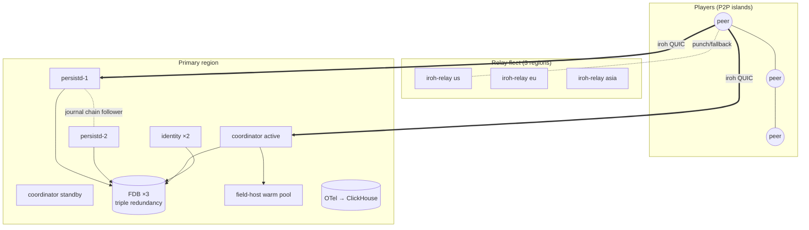
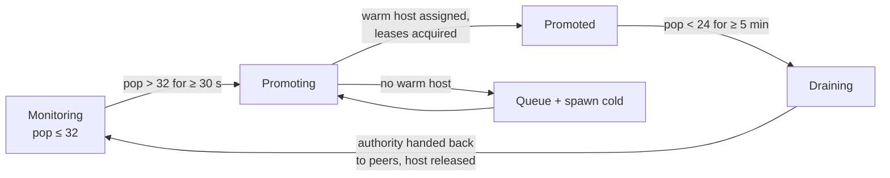

# 09 — Backend Services & Operations

Orrery's backend is deliberately small: five services, all Rust, all speaking iroh QUIC externally. None of them simulate the game — simulation lives on players' machines until a cell's population exceeds the mesh ceiling, at which point (and only at which point) the coordinator spins up a field host. This document specifies each service's operational contract: the state it holds, its scaling axis, its failure blast radius, and its HA strategy; the three reference deployment topologies; per-service ops procedures (relay fleet, FoundationDB, coordinator failover, field-host autoscaling, identity/key management); the observability and audit pipeline; runbook summaries for the major failure modes; a worked capacity plan at 10k CCU; and the CLI environment-variable fallbacks every binary shares (§12).

Normative source: [ADR-0012](adr/0012-backend-services.md) (expanding on [D3](adr/0003-transport.md), [D6](adr/0006-population-adaptive-topology.md), [D7](adr/0007-authority-and-leases.md), [D10](adr/0010-witnessing.md), [D11](adr/0011-persistence.md), [D16](adr/0016-parameter-reference.md), and [D17](adr/0017-risks-and-open-questions.md)).

## 1. Service inventory

Crate names come from [D15](adr/0015-crate-set.md). `orrery_persistd` ships as a library harness — the game team links its `Ruleset` and builds the deployed binary, so *the game repo owns the persistd artifact* and every `Ruleset` change is a persistd redeploy (D11, D17.6). [D21](adr/0021-ruleset-distribution.md) settles that this is the answer for 1.0 rather than a placeholder, and freezes the harness API accordingly: WASM-sandboxed rules are rejected on determinism and adjudication cost, and D21 names what would reopen the question. Rolling deploys keep old builds alive for the adjudication retention horizon: persistd retains the last **3** ruleset builds as version-keyed sidecar adjudication workers (D12); the adjudication executor routes evidence bundles by `RulesetId`, and bundles older than retention are ruled `Unadjudicable` — no strike, rate-limited per account (D10).

| Service | Crate | Role | State held | Scaling axis | Failure blast radius | HA strategy |
|---|---|---|---|---|---|---|
| **Identity** | `orrery_identity` | Accounts, NodeId binding, session tokens, strike/reputation ledger, bans | Durable: account records, key bindings, strikes (persisted in the FDB `id/{account_id}` subspace — schema in [08-persistence.md](08-persistence.md) §6) | Login/refresh QPS — near-flat vs. CCU | New logins and token refresh fail; established sessions ride out the outage on grace acceptance (§8) | Stateless replicas (≥2) behind the well-known address; FDB is the store of record |
| **Relay fleet** | `iroh-relay` (ops config) | Hole-punch rendezvous + relay fallback for the ~5–10% permanently-relayed tail | None (stateless; TLS certs only) | Relayed CCU × per-peer bitrate, per region | Peers homed on the lost relay lose rendezvous + relayed paths until they re-home (seconds, higher RTT) | ≥3 regions, ≥2 instances/region, DNS failover; clients multi-home |
| **Coordinator** | `orrery_coordinator` | Coarse presence; island form/merge/split/drain; NodeId handout; witness-set seeding per cell-epoch; field-host orchestration | Soft only: presence records + island records, rebuildable from peer re-reports (§6) | Presence message rate ≈ CCU × 0.1 Hz — one instance goes very far | No *new* islands, merges, promotions, or witness epochs; running islands unaffected | Active + warm standby; leader lease in FDB; soft-state rebuild < 30 s |
| **Persistence cluster** | `orrery_persistd` + FDB | Gateway, cell actors, journal, checkpointing, lease registrar, intent validation, adjudication executor | Hot cell state in RAM; NVMe journal (+ 1 async chain follower); FDB system of record | Hot cells × diff rate (persistd nodes); universe size + intent rate (FDB nodes) | Cells on the lost node pause durable acks until re-placement; RPO ≤ ~100 ms with chain replication (D11) | Rendezvous-hash re-placement; chain-replicated journal; FDB triple redundancy is the recovery floor |
| **Field hosts** | `orrery_field_host` | Headless Bevy authority for promoted cells; low-pop witness fallback; parked-cell catch-up | Ephemeral sim state only; all durable writes flow through persistd like any authority peer | Count of concurrently hot (>32 sustained) cells — **not** total CCU | Two-tier recovery: gateway-observed connection drop → immediate unconditional divestiture + warm-pool re-promotion, **< 10 s** player-facing; zombie host (no clean drop) → lease-TTL expiry, entities orphan to nearest interacting peers (D7) until re-promotion, **< 30 s** worst case | Warm pool + coordinator re-promotion; the mesh itself is the fallback |

Plus telemetry, which is infrastructure rather than a service: OpenTelemetry throughout, and the audit pipeline (§9).

## 2. The scaling maxim

**No game-simulation servers exist until a cell exceeds the mesh ceiling.** Backend spend scales with *hot areas*, not total players. 10,000 players spread across a large universe at typical densities (≤32/cell) cost: one coordinator, a few persistd nodes, 3–5 FDB nodes, a small relay fleet, and *zero* simulation hosts. The same 10,000 players crammed into raid hubs cost one field host per hot cell. The worst case — every cell hot — converges to client-server economics by design (D17.5); everything short of it is cheaper. This is the property that makes a very large, mostly-sparse universe affordable for a small team, and it is the shipped Elite Dangerous shape: [central edServer instancing + P2P islands](https://www.lavewiki.com/network), with central services owning only durable truth.

## 3. Deployment topologies

### 3.1 Single-node dev (`docker compose`)

Everything on one box; correctness over fidelity:

- `fdb` — one FDB process, `single` redundancy, memory or SSD engine.
- `persistd` — one instance of the *game's* persistd binary (linked `Ruleset`), journal on a local volume, chain replication off.
- `coordinator`, `identity` — one each.
- `iroh-relay` — one instance with a locally-provisioned cert (or skip it and use the n0 public relays, which are [free for dev/testing only](https://docs.iroh.computer/about/faq) — never production).
- `otel-collector` + ClickHouse (optional), `field_host` scaled to zero (spawned on demand by the coordinator via the container API).

### 3.2 Small production (one region)

The minimum deployment that honors every durability and HA default in D11/D16:



- **3-node FDB**, triple redundancy, SSD engine, NVMe.
- **2 persistd nodes** — each is the journal chain follower for the other (RPO ≤ ~100 ms on node loss).
- **1 coordinator + warm standby** (§6).
- **3 relays across regions** (2×US/EU + Asia per D3) even though compute is single-region: relay proximity is about *player* RTT to rendezvous, not backend locality.
- **2 identity replicas**, field-host warm pool (§7), OTel collector + ClickHouse.

**One live gateway, and that is deliberate at this tier.** `PD2` is `PD1`'s journal chain follower, not a second serving gateway: player QUIC goes to `PD1` only. Adding a *sibling* — a second `persistd` that serves its own disjoint `--shard` set (env `ORRERY_SHARD`) in the same region — is a distinct step, governed by [D26](adr/0026-sibling-gateways.md), and it changes three things: shard ownership is the durable `actor/{grid}/{shard}` row rather than anything a node computes (D26 rule 1, [08 §3.2](08-persistence.md)); a peer holds **one session per gateway whose shards it is interested in**, because a gateway never proxies a sibling's client traffic; and moving a shard between live siblings runs the drain in [08 §3.4.1](08-persistence.md) rather than a bare fence. Sibling `--shard` sets must be disjoint, and a peer's authority successor is only ever chosen among peers with a live session on the shard's *owning* gateway — so a sibling deployment parks more entities at the margin than a single-gateway one.

### 3.3 Scaled production (multi-region)

- **Relays**: more regions and instances, sized by regional relayed CCU (§4).
- **Persistence**: regional clusters (persistd + its own FDB) with **home-region ownership per universe shard** — each shard cell (8×8×8 interest cells, D5) is statically mapped to exactly one home region; a player in that shard talks to that region's gateway. FDB clusters never span regions: the FDB paper's multi-DC numbers (mean commit ~22 ms, [p99.9 ~281 ms](https://www.foundationdb.org/files/fdb-paper.pdf)) would destroy the < 10 ms intent p99. Cross-region travelers accept higher persistence RTT (sim stays 1-hop P2P regardless); shard→region remapping is an offline ops migration (drain, copy key range, flip the map), not a runtime mechanism. [D26](adr/0026-sibling-gateways.md) does not change that: its live handover is *intra-region*, between siblings sharing one FDB cluster and one `actor/` keyspace, and it moves ownership of a key range rather than copying one.
- **Coordinator**: still logically one per universe; partition by universe-shard ranges only if presence traffic ever demands it.
- **Identity**: replicas in each region, single home FDB for the account store (login tolerates tens of ms).

## 4. Relay fleet operations

Each relay is a stateless `iroh-relay` binary needing a **public IP, a DNS name, and ACME-issued TLS** ([iroh FAQ](https://docs.iroh.computer/about/faq)) — cattle, not pets. Relays double as hole-punch rendezvous; iroh connections start on the relay path and migrate to direct via QUIC multipath (D3), so relay latency is on the critical path for *connection setup* of every pair, and for *all traffic* of the relayed tail.

Sizing: the ~5–10% permanently-relayed tail (CGNAT↔CGNAT, UDP-blocked — [Tailscale's data](https://tailscale.com/blog/how-nat-traversal-works) shows stacked hard NATs essentially never punch) is a **product requirement, provisioned for**. Budget per relayed peer ≈ full peer budget through the relay: ≤ 1 Mbps up (D16) + interest-set receive (Donnybrook's [~12n kb/s](https://www.microsoft.com/en-us/research/wp-content/uploads/2016/02/donnybrook.pdf); ≈ 0.4 Mbps at a 32-peer island) ⇒ plan ~1.5 Mbps per relayed peer, knowing production reality is milder (iroh reports [~95% of bytes on direct paths](https://pinggy.io/blog/iroh_1_0_dial_keys_not_ips/)). Ops rules:

- ≥2 instances per region; clients re-home by relay latency, DNS failover for instance loss.
- n0's public relays are **dev-only**; production runs self-hosted exclusively (rate limits and neighbor traffic on shared relays are not acceptable for game traffic).
- Watch per-region relay egress and **relayed-connection ratio** (§9); a ratio drifting above ~10% means a mis-provisioned region or an ISP-level UDP problem, not normal variance.

## 5. FoundationDB operations for a small team

FDB 7.3.x (7.4 tracked as an upgrade candidate), 3–5 nodes, triple redundancy, SSD storage engine on NVMe (D11, D14). Two supported management modes: **fdb-kubernetes-operator** ([upstream](https://github.com/foundationdb/fdb-kubernetes-operator)) if the team already runs Kubernetes, else **systemd + `fdbcli`** — both are fine at this scale; do not invent a third.

- **Process classes**: at 3 nodes run default classes; at 5, pin `storage` / `log` / `stateless` classes per FDB guidance so log fsync and storage compaction don't fight.
- **Load ceiling**: keep sustained load < 75% — FDB's [1.5–2.5 ms commit numbers](https://apple.github.io/foundationdb/performance.html) hold only below it, and the < 10 ms intent p99 (D16) inherits that.
- **Upgrade discipline**: FDB upgrades are cluster-wide and version-locked (client libraries must match server versions via the multi-version client). Procedure: stage the new `libfdb_c` alongside the old in every persistd/identity image *first*, upgrade the cluster in one coordinated step, then retire the old client. Never mix server minor versions long-term. Rehearse on the dev compose stack.
- **Backups**: continuous backup (`fdbbackup` agents) to object storage, 7-day retention, daily restore points; monthly restore drill into a scratch cluster. This is disaster recovery only — normal node loss is handled by redundancy, and the journal archive (D11) independently preserves event history.
- **Hotspots**: crowd events concentrate writes on few shard-cell key ranges (the [FDB #11510 pattern](https://github.com/apple/foundationdb/issues/11510), D17.4). Persistd's hotspot cell-splitting is the first line; FDB-side, pre-split hot ranges before scheduled events and alert on storage-queue depth.

## 6. Coordinator HA

The coordinator's state is deliberately coarse and **rebuildable**, which makes standby promotion cheap. State sketch (types in `orrery_protocol`):

```rust
// Sketch — soft state only, all rebuildable from peer re-reports.
struct PresenceRecord {
    account: AccountId,
    node: NodeId,
    cell: CellId,            // coarse: interest-level cell
    island: Option<IslandId>,
    last_report: Instant,    // peers report at ~0.1 Hz or on cell crossing
}

struct IslandRecord {
    id: IslandId,
    cells: SmallVec<CellId>,
    members: Vec<NodeId>,
    regime: Regime,          // Mesh | InterestMesh | Promoted { host: NodeId }
    witness_epoch: EpochId,  // seed persisted to FDB via the gateway
}
```

Two design commitments make failover boring:

1. **Witness-set epoch seeds are durable, not coordinator-local.** The coordinator writes each cell-epoch seed through the gateway to FDB (the `epoch/{cell_id}` rows of the keyspace schema in [08-persistence.md](08-persistence.md) §6) at issuance. Persistd validates intent attestations (K=3 of N≥5, D10/D16) against FDB, never against coordinator memory — so attestations from before a failover remain verifiable, and a new coordinator simply starts issuing new epochs.
2. **Everything else regenerates from re-reports.** Peers already heartbeat presence; on seeing a new coordinator incarnation they immediately re-report presence + current island membership.

```mermaid
sequenceDiagram
    participant S as Standby coordinator
    participant F as FDB (leader lease row)
    participant P as Peers
    participant H as Field hosts
    S->>F: CAS coord/leader (old lease expired)
    F-->>S: acquired, incarnation n+1
    S-->>P: incarnation bump (on next contact / gateway gossip)
    P->>S: presence + island re-reports
    H->>S: re-register (cell, load, lease status)
    Note over S: reconciliation window (~2× report interval)<br/>islands adopted as reported; conflicts resolved<br/>by lease registrar state, not memory
    S->>S: resume merges/splits/promotions
```

Leadership is a TTL lease row in FDB (`coord/leader` in the [08-persistence.md](08-persistence.md) §6 schema) acquired by compare-and-swap — the same primitive as entity leases (D7), no consensus library. During the gap (target < 30 s to full topology knowledge): existing islands keep simulating, existing field hosts keep hosting (their entity leases are with the registrar, not the coordinator), intents keep committing. What pauses: island formation for freshly-arriving players, merges/splits, promotions, and new witness epochs — all latency-tolerant by construction.

## 7. Field-host autoscaling

The coordinator runs the promotion loop per island using population telemetry from presence reports:



- **Thresholds**: promote at **>32 sustained** (D16); "sustained" = 30 s over threshold; demote below 24 for 5 min. The asymmetry is deliberate anti-thrash hysteresis (same lesson as cell handoff, D5).
- **Warm pool**: N+2 idle `orrery_field_host` processes per active region (Bevy world initialized, connected to coordinator + gateway, no cell). Promotion = assign cell → host loads the 27-cell neighborhood from the gateway (< 50 ms first page-in, D16) → acquires cell-entity leases from the registrar as a negotiated divestiture (D7) → clients observe an ordinary authority handoff. Budget < 5 s from decision to full authority; cold spawn (container start + asset load) is the fallback and the reason the pool exists.
- **Packing**: field hosts are processes, not machines — pack several per VM; a hot cell needs roughly 4 vCPU for 60 Hz headless simulation and ≈13 Mbps egress at 64 players, up to the ≤ 35 Mbps budget at the 128-player ceiling (D6).
- **Cost model**: spend = (hot cells) × (one headless instance). Live-ops dial per D17.5: lowering the promotion threshold buys server authority for busy areas at higher cost; the limit case (every populated cell promoted ≈ CCU/32 hosts) is exactly a client-server fleet. The framework makes that a *choice*, not a floor.

Field hosts also serve as low-population witness fallback and parked-cell catch-up executors (D10, D7) — scheduled from the same pool at lower priority.

## 8. Identity and key management

- **Accounts and NodeIds**: an account (with acquisition cost — Sybil resistance, D10) binds one or more device ed25519 NodeIds. Binding a new NodeId requires account credentials; unbinding is immediate. The NodeId is the transport identity everywhere (D3), so identity's job is exactly the account↔NodeId mapping plus reputation.
- **Session tokens**: identity issues signed session tokens `{account, node_id, issued_at, ttl: 1 h, standing}` presented on connection establishment to coordinator and gateway. Clients refresh at half-TTL over a reliable stream. **Grace rule**: coordinator and gateway accept expired-but-otherwise-valid tokens for *established* sessions while identity is unreachable — an identity outage locks out new logins, never in-flight play. `standing` carries quarantine status (D10): quarantined accounts' writes get full cluster-side validation.
- **Strike ledger**: strikes from adjudication verdicts (D10) accrue per account, decaying with a **14-day half-life** (D16); thresholds walk quarantine → cooldown → ban. Enforcement points are coordinator (island admission) and gateway (write acceptance) — *not* relays, which stay stateless and dumb.
- **Key hygiene**: service NodeIds (gateway, coordinator, identity, field hosts) are provisioned secrets with documented rotation (rotate = publish new well-known NodeId, dual-accept for one client-release cycle). Account NodeId compromise = user re-binds; the strike ledger follows the account, not the key.

## 9. Observability

OpenTelemetry everywhere (D12): traces on the intent path (client → gateway → FDB), metrics from every service, logs structured. One trace ID rides the intent from `orrery_persist_client` submission through witness attestation to FDB commit — this is the single most valuable debugging artifact in the system.

SLO / metrics table (targets from D16 where given; alert thresholds are ops defaults, tune per game):

Every row's **Source** names the process that actually produces the number
today, or says plainly that nothing does. Three of these rows read "persistd
gateway" for years while their only producer repo-wide was the `gates/p2-load` rig:
a client-observed round trip is measured at the client, and a name that
mislocates it sends an operator to the wrong process on the worst day.

| Metric | Source | Target / SLO | Alert |
|---|---|---|---|
| Bulk ack p99, client-observed (in-region) | client — `orrery_persist_client`'s uplink scheduler, exercised by the `gates/p2-load` rig (`bulk_ack_ms`) | **< 5 ms** | > 10 ms for 5 min |
| Intent commit p99 (in-region) | client — `orrery_persist_client`'s intent queue, exercised by the `gates/p2-load` rig (`intent_commit_ms`) | **< 10 ms** | > 25 ms for 5 min |
| Area first page-in | client — `Subscribe` → first `AreaPage`, `gates/p2-load` rig (`area_first_page_ms`) | **< 50 ms** | p95 > 100 ms |
| Gateway server spans: bulk, intent, area first page | persistd gateway (`gateway_bulk_server_ms`, `gateway_intent_server_ms`, `gateway_area_first_page_server_ms`) | none — attribution, not a target | server span approaching the client target above it |
| Report outcomes and refusals | persistd gateway (`gateway_report`) | shadow mode: refusals explained, not zero | `refused_no_adjudicator` ≠ 0 on a cluster that linked a `Ruleset` |
| Authority: duplicate writes, handoffs, timeouts | persistd gateway (`gateway_authority`, ten counters) | `duplicate_authority` = **0** | any `duplicate_authority`; `handoff_timed_out` rising = zombie host (§10) |
| Fenced route: peers steering onto the expensive branch | persistd gateway (`gateway_authority`: `misrouted_diffs`, `unindexed_diffs`, `misroute_throttled`) | `unindexed_diffs` flat | `unindexed_diffs` rising sustained, especially with `misroute_throttled` rising alongside it — a peer is buying fallback locates (docs/08 §2.1.2). Brief spikes are ordinary: a divest or a lost reconnect race leaves already-queued diffs unindexed. |
| Hole-punch success rate | `orrery_net` client telemetry | ~90% direct | < 85% sustained |
| Relayed-connection ratio | client telemetry + relay egress | ~5–10% | > 12% per region |
| Rollback frequency / depth | `orrery_predict` monitor | game-tuned baseline | sustained deviation from baseline (also a witness signal, D10) |
| Discrepancy report rate | `orrery_witness` → audit | baseline per CCU | spike = cheat wave or bad tolerance bands |
| False-positive strike rate | adjudication outcomes | ≈ 0 (shadow mode first, D17.3) | any confirmed FP |
| Journal commit (server-internal) | persistd (`journal_commit_ms`, both primary and follower — each reports its *own* journal) | **< 2 ms** (adaptive group commit: fsync-when-idle, ~0.5 ms batching under load) | commit p99 > 2 ms |
| Archive lag (floor − archive watermark) | persistd — `Journal::archive_gap`, reported on the checkpoint round's blocked-release line (`segments_behind`, `bytes_behind`), and by the tailer's own `ArchiveTailerStatus` | 0–1 segments | `warn` at ≥ 4 segments (512 MiB) behind, or any tailer with 3 consecutive failed passes — see §10 |
| Chain-follower lag | persistd, **in-process only** — `ChainSnapshot` carries `lag_bytes`, `progress_age_ms`, `failed_pushes` and `behind`; `orrery_protocol::metrics::CHAIN_SERIES` names the wire spellings and nothing writes them to the artifact yet | ≤ 100 ms | follower lag > 1 s |
| FDB load ratio | FDB metrics | < 75% | > 75% |
| Lease-expiry orphan rate | lease registrar | baseline | spike = peer-crash wave or netsplit |

**How these reach an operator today, and how they do not.** `persistd`
collects every gateway counter unconditionally — the flag opens a sink, it
does not start the measurement — and `--metrics-jsonl` (env
`ORRERY_METRICS_JSONL`) appends them, plus the
latency `sample_batch` records, to a file. That is the whole surface: there is
no scrape endpoint and no admin socket, so on a node started without the flag
these counters are correct, live, and reachable by nothing until a restart.
The OTel bridge above is what closes that, and until it lands "turn on
metrics" means "restart with `--metrics-jsonl`".

**Audit pipeline**: discrepancy reports (evidence bundles) and periodic state-hash cross-checks stream from persistd's adjudication executor into ClickHouse-or-similar (ops choice, D12). It answers: which accounts generate discrepancies, whether tolerance bands (ε_pos = 1 cm, ε_vel = 1 cm/s, 250 ms window) are producing honest-player noise, and post-incident forensics joined against the journal-derived event archive (D11). The strike pipeline launches in **shadow mode** — telemetry only — until false-positive rates are characterized (D17.3).

## 10. Runbooks (summaries)

**Relay outage (one region).** Symptom: punch-success dip + relayed-peer disconnects in one geography. Peers re-home to the next-nearest relay automatically (higher RTT, not loss of service); pairs mid-punch retry via the new rendezvous. Ops: DNS failover to the surviving instance, restore capacity, watch the relayed ratio. Player impact ends when re-homing completes; no state is involved anywhere.

**persistd node loss.** Cells owned by the node stop acking; clients' uplink schedulers buffer diffs (bounded, drop-oldest per priority). The journal chain follower has RPO ≤ ~100 ms (D11). Recovery: rendezvous hashing re-places the lost node's shard cells onto survivors; each new cell actor restores from the last FDB checkpoint (≤ 20 s old) + replays the follower's journal tail, then resumes acks. Target: < 10 s to restored acks. Leases held via the lost node's registrar shard are FDB rows — unaffected. Verify: chain-follower lag zero, no checkpoint gaps, client-observed bulk-ack p99 back < 5 ms (journal commit < 2 ms).

**FDB degraded.** Single node loss: FDB self-heals, brief commit-latency blip, no action. Quorum loss / cluster unavailable: every FDB call **fails within a bounded time** rather than blocking — persistd opens each database handle through `orrery_persistd::fdb::FdbContext::connect`, which sets a transaction timeout (10 s by default, `ORRERY_FDB_TRANSACTION_TIMEOUT_MS`) and a retry limit, so an unreachable cluster surfaces as a store error at the adapter instead of a call that never returns. That bound is the precondition for everything else in this runbook: nothing can queue behind, pause, or fall back to a call with no end. Intents then queue **client-side** (the offline queue in `orrery_persist_client`), checkpoints pause, lease CAS operations pause (existing leases honored by TTL semantics; expiry processing resumes on recovery) — and the bulk path continues: cell actors keep applying diffs and journaling locally, so the hot tier keeps absorbing gameplay. Recovery: restore quorum, drain queued intents in order, resume checkpoints. RPO for bulk state remains journal-bounded, not FDB-bounded.

*Gap:* the **gateway-side bounded intent queue** this posture also calls for is not implemented. Today a client that reaches the gateway during a quorum loss gets the adapter's store error back and must fall back to its own offline queue; an intent already accepted by the gateway is not held for the cluster's return.

**Archive unreachable (`--archive-dir` / `--archive-retention`; env
`ORRERY_ARCHIVE_DIR` / `ORRERY_ARCHIVE_RETENTION`).** Symptom: a
`warn` line from the checkpoint round — *"the archive is not keeping up; the
journal cannot reclaim and will fill"* — carrying `segments_behind` and
`bytes_behind`, and/or the tailer's own *"archive tailer is stalled"* naming a
`stage` of `upload`, `verify` or `metadata`. What is happening: the retention
clamp (D20, #806) holds the journal floor behind the verified archive
watermark, so an archive that has stopped means a journal that has stopped
reclaiming, growing at the arrival rate (~26 MB/s at the P2 gate's load). This
is the correct trade — bulk state is the shed-able class and history is not
re-creatable — but it is a countdown to
[08-persistence.md](08-persistence.md) §15's "journal disk full → bulk acks
shed". **Player impact is nil until the disk fills**, so there is real time to
act; `bytes_behind` against free disk is how much.

Triage, in order:

1. **Read the `stage`.** `upload` is the object store or the path to it;
   `verify` means the upload was accepted and read back wrong — a truncated or
   silently-dropped object, which is a store problem, not a tailer bug;
   `metadata` is FoundationDB, so check the FDB runbook above first, since the
   `jarchive/` rows live in the same cluster as the checkpoints.
2. **Is it a follower?** A chain follower originates nothing, so a follower
   started with `--archive-retention` and no tailer blocks its mirror
   permanently — its archive term can never be satisfied. `--archive-dir` is
   refused on a follower for exactly this reason; the fix is to drop
   `--archive-retention` there. The follower's mirror is bounded by the
   primary's own floor (D23), not by an archive.
3. **Buy time if the disk is close.** Restarting without `--archive-retention`
   lets the floor advance again on checkpoints alone. **This is destructive of
   history**: records released while the clamp is off are gone from the journal
   and were never archived, and the tailer cannot go back for them — on restart
   it resumes at the new retention floor rather than re-scanning a released
   range. Prefer adding disk. Take this only against an imminent full disk, and
   record the LSN range it costs.
4. **Recovery is automatic.** The tailer retries with bounded backoff and needs
   no intervention once the store answers: it re-uploads to the same
   deterministic key, so a partial upload from before the outage is overwritten
   rather than duplicated, and the watermark then advances and the floor
   follows on the next checkpoint round. Verify: the tailer's `warn` stops, the
   `released journal below the checkpoint floor` line returns, and
   `segments_behind` goes to zero.

**Coordinator loss.** §6: standby CAS-acquires the leader lease, peers re-report, < 30 s to full topology knowledge. Player-visible impact: newly-arriving players wait for island assignment; ongoing play unaffected. If both instances die, running islands continue indefinitely — the system degrades to "no new matchmaking," which is the designed posture.

**Field host loss.** Two-tier recovery ([04-authority.md](04-authority.md) §8). **Fast path** — the gateway observes the host's connection drop: immediate **unconditional divestiture** of every lease the host held, coordinator re-promotes from the warm pool, authority hands back. Target: **< 10 s** player-facing. **Slow path** — a *zombie* host (connection alive, heartbeats silent, no clean drop): entity leases expire by TTL (10 s), entities orphan to the nearest interacting peers (D7), and the island degrades to interest-mesh at over-ceiling population (temporarily rough, not broken) until re-promotion. Target: **< 30 s** worst case, end-to-end.

**Netsplit (peers ↔ backend partition).** Verbatim posture from D12: **P2P simulation continues without the cluster; intents queue; durable commits pause; no cluster = degraded, not dead.** Islands keep simulating on existing leases (holders keep entities past TTL if the registrar is unreachable — expiry requires the registrar to act); witness attestation continues locally; queued intents commit on heal, in order, with attestations intact (witness epochs are durable, §6). The one thing players lose during a split is durable settlement — trades and loot finalize late, which the `Ruleset`'s intent-outcome prediction (D15, `orrery_persist_client`) papers over up to a game-chosen queue bound.

## 11. Capacity planning: worked example at 10k CCU

For what *one* machine actually does — the demo-sizing question, measured
rather than modelled — see [14-capacity.md](14-capacity.md).

Assumptions are the shared capacity table in [08-persistence.md](08-persistence.md) §13 (game-dependent; stated so they can be re-derived): 2 authored core entities per player; 4 hot world entities per player → 40k hot entities; 10 diff records/s per player → 100k records/s cluster-wide at ~260 B/record → ~26 MB/s journal ingest; 0.05 intents/s per player → **500 intents/s** average, 10× event peaks; checkpoint dirty set ~40k entities per 20 s window. Ops-local additions: mean island size 20 → ~500 islands; 2% of islands over the mesh ceiling.

| Component | Load at 10k CCU | Provisioning |
|---|---|---|
| Relays | 5–10% relayed = 500–1,000 peers × ~1.5 Mbps ⇒ 0.75–1.5 Gbps aggregate worst case, ~≤500 Mbps/region | 3 regions × 2 instances, 1 Gbps NICs — headroom included; actual byte share will be lower (~95% of bytes direct) |
| Coordinator | 10k × 0.1 Hz presence ≈ 1k msgs/s + island churn | 1 active + 1 standby, 2 vCPU each — vastly under-loaded |
| persistd | 100k diff records/s ≈ 26 MB/s journal ingest cluster-wide; ~25–33k appends/s/node across 3–4 nodes; adaptive group commit (fsync-when-idle, ~0.5 ms batching under load, D11) groups ~15 records | **3–4 nodes** (journal chain followers arranged in a ring), NVMe, ~8 vCPU each; hot-state RAM ≈ 1 GB including loaded-idle neighborhoods |
| FDB | Checkpoints: dirty set ~40k entities / 20 s ≈ 2k writes/s; intents: 500/s avg, ~5k/s peak (serializable txns) | 3–5 nodes, SSD engine — comfortably < 75% load against [55k reads / 20k writes per core](https://apple.github.io/foundationdb/performance.html) |
| Witness verification | peak 5k intents/s × 3 signatures ≈ 15k ed25519 verifies/s | ~1 core |
| Field hosts | ~10 hot cells → 10 processes × 4 vCPU, ≈13 Mbps each at 64 players (≤ 35 Mbps budget at the 128 ceiling; ~130–350 Mbps aggregate egress) | ~3 VMs packed + N+2 warm pool |
| Identity | patch-day login storm 10k / 5 min ≈ 33 auth/s | 2 small replicas |

Total steady-state footprint: roughly fifteen modest VMs plus relay bandwidth — and the only line that grows super-linearly with player *density* (not count) is field hosts, which is the maxim of §2 doing its job. For contrast, the pathological ceiling (every cell hot) at 10k CCU is ~312 field hosts ≈ a conventional dedicated-server fleet: the architecture's worst case is the industry's normal case.

## 12. CLI environment-variable fallbacks

Every non-excluded flag on every CLI binary outside the frozen trees falls back to an `ORRERY_`-prefixed environment variable (#865, clap's `env` feature): 166 fallbacks across 14 binaries. The scheme is `ORRERY_` + subsystem + flag, upper snake case, with subsystem scoping wherever a bare flag name would be ambiguous — `--output` alone is useless as a variable name, so it is `ORRERY_ISSUER_KEY_GENERATE_OUTPUT`, `ORRERY_ISSUER_KEY_ESCROW_OUTPUT`, or `ORRERY_P2_LOAD_OUTPUT` depending on the binary and operation it feeds.

**Precedence, stated once: an explicit flag beats the environment variable, which beats the default.** No default changed. `--help` prints each flag's variable beside it, so a binary's own help is the authoritative list; the tables here are the operator-facing copy of it. One pre-existing environment variable is *not* a clap fallback: `ORRERY_FDB_TRANSACTION_TIMEOUT_MS` (§10) is read directly by `FdbContext::connect` and has no flag counterpart.

### 12.1 Service binaries

| Binary | Flag | Env var |
|---|---|---|
| `persistd` | `--node-id` | `ORRERY_NODE_ID` |
| `persistd` | `--dir` | `ORRERY_PERSISTD_DIR` |
| `persistd` | `--bind` | `ORRERY_PERSISTD_BIND` |
| `persistd` | `--fdb-cluster-file` | `ORRERY_FDB_CLUSTER_FILE` |
| `persistd` | `--shard` | `ORRERY_SHARD` |
| `persistd` | `--standby-shard` | `ORRERY_STANDBY_SHARD` |
| `persistd` | `--handover-request` | `ORRERY_HANDOVER_REQUEST` |
| `persistd` | `--chain-listen` | `ORRERY_CHAIN_LISTEN` |
| `persistd` | `--chain-primary` | `ORRERY_CHAIN_PRIMARY` |
| `persistd` | `--chain-epoch` | `ORRERY_CHAIN_EPOCH` |
| `persistd` | `--chain-follower` | `ORRERY_CHAIN_FOLLOWER` |
| `persistd` | `--checkpoint-interval-ms` | `ORRERY_CHECKPOINT_INTERVAL_MS` |
| `persistd` | `--no-journal-retention` | `ORRERY_NO_JOURNAL_RETENTION` |
| `persistd` | `--archive-retention` | `ORRERY_ARCHIVE_RETENTION` |
| `persistd` | `--archive-dir` | `ORRERY_ARCHIVE_DIR` |
| `persistd` | `--archive-prefix` | `ORRERY_ARCHIVE_PREFIX` |
| `persistd` | `--receipt-archive` | `ORRERY_RECEIPT_ARCHIVE` |
| `persistd` | `--receipt-archive-page-rows` | `ORRERY_RECEIPT_ARCHIVE_PAGE_ROWS` |
| `persistd` | `--hot-ledger-sweep-interval-ms` | `ORRERY_HOT_LEDGER_SWEEP_INTERVAL_MS` |
| `persistd` | `--full-conservation-sweep-interval-ms` | `ORRERY_FULL_CONSERVATION_SWEEP_INTERVAL_MS` |
| `persistd` | `--metrics-jsonl` | `ORRERY_METRICS_JSONL` |
| `persistd` | `--issuer-key` | `ORRERY_ISSUER_KEY` |
| `persistd` | `--coordinator-key` | `ORRERY_COORDINATOR_KEY` |
| `persistd` | `--attestation-enforcement` | `ORRERY_ATTESTATION_ENFORCEMENT` |
| `persistd` | `--authority-correction` | `ORRERY_AUTHORITY_CORRECTION` |
| `orrery-coordinator` | `--bind` | `ORRERY_COORDINATOR_BIND` |
| `orrery-coordinator` | `--issuer-key` | `ORRERY_ISSUER_KEY` |
| `orrery-coordinator` | `--interest-key-id` | `ORRERY_INTEREST_KEY_ID` |
| `orrery-coordinator` | `--grid` | `ORRERY_GRID` |
| `orrery-coordinator` | `--witness-incarnation` | `ORRERY_WITNESS_INCARNATION` |
| `world-census` | `--fdb-cluster-file` | `ORRERY_FDB_CLUSTER_FILE` |
| `world-census` | `--page-rows` | `ORRERY_PAGE_ROWS` |
| `orrery-invite` | `--ledger` | `ORRERY_LEDGER` |
| `orrery-invite` | `--label` | `ORRERY_LABEL` |
| `orrery-invite` | `--issuer-credential` | `ORRERY_ISSUER_CREDENTIAL` |
| `orrery-invite` | `--account` | `ORRERY_ACCOUNT` |
| `orrery-invite` | `--node` | `ORRERY_NODE` |
| `orrery-invite` | `--ttl-ms` | `ORRERY_TTL_MS` |
| `orrery-invite` | `--join-file` | `ORRERY_JOIN_FILE` |
| `orrery-invite` | `--host-node` | `ORRERY_HOST_NODE` |
| `orrery-invite` | `--slot` | `ORRERY_SLOT` |
| `orrery-invite` | `--session-id` | `ORRERY_SESSION_ID` |
| `orrery-issuer-key` | `--key-id` (generate) | `ORRERY_KEY_ID` |
| `orrery-issuer-key` | `--output` (generate) | `ORRERY_ISSUER_KEY_GENERATE_OUTPUT` |
| `orrery-issuer-key` | `--credential` (escrow) | `ORRERY_CREDENTIAL` |
| `orrery-issuer-key` | `--output` (escrow) | `ORRERY_ISSUER_KEY_ESCROW_OUTPUT` |
| `orrery-issuer-key` | `--escrow` (restore, load) | `ORRERY_ESCROW` |
| `orrery-issuer-key` | `--expect-public-key` (restore, load) | `ORRERY_EXPECT_PUBLIC_KEY` |
| `orrery-issuer-key` | `--output` (load) | `ORRERY_ISSUER_KEY_LOAD_OUTPUT` |
| `orrery-seed` | `--profile` (plan, apply, verify) | `ORRERY_PROFILE` |
| `orrery-seed` | `--single-grid` (plan, apply, verify) | `ORRERY_SINGLE_GRID` |
| `orrery-seed` | `--json` (plan, shards) | `ORRERY_JSON` |
| `orrery-seed` | `--full` (verify) | `ORRERY_FULL` |
| `orrery-seed` | `--emit-manifest` (verify) | `ORRERY_EMIT_MANIFEST` |
| `orrery-seed` | `--grid` (shards) | `ORRERY_GRID` |

(`--single-grid` appears in the `wipe` verb too, without a fallback — §12.3.)

### 12.2 Gate harnesses

The measurement rigs take the same scheme; their variables matter mainly to the scripts and harness runners that set them.

| Binary | Env variables |
|---|---|
| `p0-nat-test` | `ORRERY_RELAY`, `ORRERY_PEER`, `ORRERY_P0_NAT_PEERS`, `ORRERY_TICK_HZ`, `ORRERY_PAYLOAD_BYTES`, `ORRERY_PING_HZ`, `ORRERY_DURATION_SECS`, `ORRERY_MESH`, `ORRERY_MESH_INDEX`, `ORRERY_JSON` |
| `p0-dashboard` | `ORRERY_JSON`, `ORRERY_GATE`, `ORRERY_MIN_DIRECT_RATE`, `ORRERY_MIN_DIRECT_BYTES` |
| `p2-load` | `ORRERY_GATEWAY`, `ORRERY_ADDR`, `ORRERY_ENTITIES`, `ORRERY_CELLS`, `ORRERY_DIFF_HZ`, `ORRERY_INTENT_MIX`, `ORRERY_SESSIONS`, `ORRERY_DURATION_SECS`, `ORRERY_MANIFEST`, `ORRERY_SCENARIO`, `ORRERY_JSON`, `ORRERY_ACK_LOG`, `ORRERY_FDB_CLUSTER_FILE`, `ORRERY_RECOVERY_CUTOFF`, `ORRERY_P2_LOAD_OUTPUT`, `ORRERY_DIFF_PAYLOAD_BYTES`, `ORRERY_ISSUER_KEY_ID`, `ORRERY_ACCOUNT_ID` |
| `p2-dashboard` | `ORRERY_JSON`, `ORRERY_GATE`, `ORRERY_DEVICE_QUALIFICATION`, `ORRERY_JOURNAL_COMMIT_MS`, `ORRERY_BULK_ACK_MS`, `ORRERY_INTENT_COMMIT_MS`, `ORRERY_AREA_FIRST_PAGE_MS` |
| `p3-island` | `ORRERY_GATEWAY_ADDR`, `ORRERY_GATEWAY_NODE`, `ORRERY_COORDINATOR_ADDR`, `ORRERY_COORDINATOR_NODE`, `ORRERY_P3_ISLAND_PEERS`, `ORRERY_ENTITIES_PER_PEER`, `ORRERY_VICTIM_CLAIM_KIND`, `ORRERY_CELL`, `ORRERY_DURATION_SECS`, `ORRERY_OUT`, `ORRERY_METRICS_JSONL` |
| `p3-siblings` | `ORRERY_GATEWAY_A_ADDR`, `ORRERY_GATEWAY_A_NODE`, `ORRERY_METRICS_A`, `ORRERY_SHARDS_A`, `ORRERY_GATEWAY_B_ADDR`, `ORRERY_GATEWAY_B_NODE`, `ORRERY_METRICS_B`, `ORRERY_SHARDS_B`, `ORRERY_COORDINATOR_ADDR`, `ORRERY_COORDINATOR_NODE`, `ORRERY_MANIFEST`, `ORRERY_P3_SIBLINGS_PEERS`, `ORRERY_HANDOVER_BUDGET_MS`, `ORRERY_VICTIM_CLAIM_KIND`, `ORRERY_DURATION_SECS`, `ORRERY_OUT`, `ORRERY_FDB_CLUSTER_FILE`, `ORRERY_RACE_ROUNDS`, `ORRERY_RACE_PERIOD_MS` |
| `p4-streams-bench` | `ORRERY_TRANSPORT`, `ORRERY_SECONDS`, `ORRERY_LOSS`, `ORRERY_DELAY_MS`, `ORRERY_REPAIR_HZ`, `ORRERY_SEED`, `ORRERY_JSON` |
| `p5-dupe-gauntlet` | `ORRERY_FDB_CLUSTER_FILE`, `ORRERY_DATA_DIR`, `ORRERY_ENFORCEMENT`, `ORRERY_POSTURE_FILE`, `ORRERY_GATEWAY_ADDR`, `ORRERY_GATEWAY_NODE`, `ORRERY_AUDIT_LOG`, `ORRERY_REPORT`, `ORRERY_ENFORCING_ADDR`, `ORRERY_ENFORCING_NODE`, `ORRERY_SHADOW_ADDR`, `ORRERY_SHADOW_NODE`, `ORRERY_ENFORCING_LOG`, `ORRERY_SHADOW_LOG`, `ORRERY_CONTROL_ADDR`, `ORRERY_CONTROL_NODE`, `ORRERY_ATTESTED_ADDR`, `ORRERY_ATTESTED_NODE`, `ORRERY_CONTROL_STAGES`, `ORRERY_ATTESTED_STAGES`, `ORRERY_SAMPLES`, `ORRERY_CONCURRENCY` |

### 12.3 What deliberately has no fallback

An environment variable is inherited by every process a shell spawns, and one setting arms a control in all of them at once. Four classes of flag therefore cannot be set from the environment, on the rule that what an operator must choose per process must not arrive by inheritance:

- **Secrets.** A credential in the environment outlives the process that read it — shell history, sibling processes, crash dumps. No fallback for `--secret-key` (`persistd`, `orrery-coordinator`, `p0-nat-test`, `p2-load`), `--interest-secret` and `--witness-master-secret` (`orrery-coordinator`), and `--issuer-secret` (`p2-load`, `p3-island`, `p3-siblings`).
- **Destructive or safety-sensitive actions.** No fallback for `--promote-from`, `--allow-volatile-leases`, and `--dev-seed` (`persistd`); seed `apply`'s `--allow-opaque`; the `wipe` verb and all four of its flags (`--profile`, `--yes`, `--content-build`, `--single-grid`); `--drain` (`p3-island`); and the `p3-siblings` handover choreography flags (`--handover-shard`, `--handover-request`, `--handover-successor-node`, `--gateway-b-pid`).
- **Mode and action selectors.** Flags that choose what a process does this once, rather than configure how it runs: `--passphrase-stdin` (`orrery-issuer-key`), `--print-id` (`p0-nat-test`), `--verify-recovery` (`p2-load`), `--print-keys` (`p3-island`, `p3-siblings`), `--check-link` (`p4-streams-bench`), `--replay`, `--attestation`, `--quarantine` (`p5-dupe-gauntlet`), and the hidden `--peer-spec` / `--trader-spec` (both `p3` harnesses).
- **Positionals and subcommand selectors.** clap's `env` feature attaches to named arguments only, and these choose *what* to act on: seed's scenario and manifest positionals plus its verb, both dashboards' `files` operands, identity's two `operation` subcommands (`orrery-invite`, `orrery-issuer-key`), and `p5-dupe-gauntlet`'s `command`.

**`gates/p1-swarm` has no fallbacks, and that is the freeze, not an oversight.** It is the largest CLI in the workspace — 44 args, more than any binary above — and it sits inside the P4 banking freeze (#329) alongside `orrery_witness`, `orrery_core`, `orrery_games`, and `clients/regolith`, none of which #865 touched. Its retrofit is deferred until the freeze window closes.
