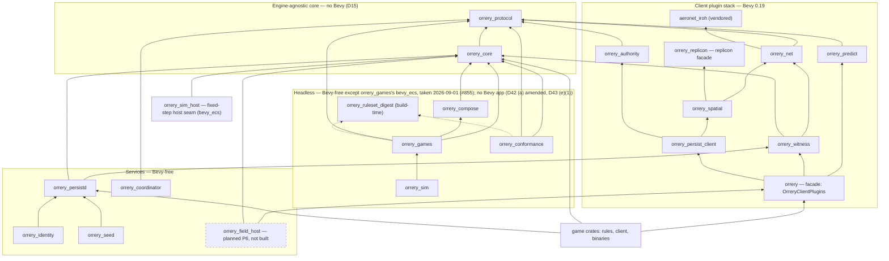

# Crate architecture

This document expands [ADR-0015](adr/0015-crate-set.md) into a concrete Cargo workspace: the layout tree, the dependency spine and its layering rules, a per-crate reference (purpose, public API sketch, dependencies, feature flags, Bevy status) for every first-party `orrery_*` crate (twenty at present — the reference table below lists all of them; the numbered sections predate the five crates it adds), the games-bring-rules linking pattern, client app composition, the lockstep versioning/release policy, and the upstreaming plan plus the replicon-direct plan B. All code below is **sketch-grade**: signatures are indicative of shape and naming, not guaranteed to compile.

Normative source: [ADR-0015](adr/0015-crate-set.md), drawing on [D4](adr/0004-bevy-netcode-stack.md), [D12](adr/0012-backend-services.md), [D14](adr/0014-pinned-versions.md), and [D17](adr/0017-risks-and-open-questions.md).

## Workspace layout

One workspace, one version number, one lockfile — with the standalone tools under `gates/` and the client under `clients/regolith` excluded from it, each declaring its own `[workspace]` and carrying its own committed lockfile, so a harness cannot drag a dependency into the shipped graph. Server crates and client crates live together so protocol changes are atomic across both sides.

```
orrery/
├── Cargo.toml                  # [workspace] + [workspace.dependencies] pin table (D14)
├── rust-toolchain.toml
├── crates/                     # first-party members
│   ├── orrery_protocol/        # lib · engine-agnostic · wire & data types
│   ├── orrery_core/            # lib · engine-agnostic · verifiable core / Ruleset
│   ├── orrery_compose/         # lib · link-time composition manifest for rulesets (D43 (g))
│   ├── orrery_net/             # Bevy plugin · sessions, coordinator client, channels
│   ├── orrery_replicon/        # lib · replicon facade — the only crate declaring bevy_replicon (D45 IV-7)
│   ├── orrery_spatial/         # Bevy plugin · CellId math, AOI, visibility mapping
│   ├── orrery_authority/       # Bevy plugin · claims, leases, handoff
│   ├── orrery_predict/         # Bevy plugin · lightyear config, rollback guard
│   ├── orrery_witness/         # Bevy plugin · validators, evidence, attestation
│   ├── orrery_persist_client/  # Bevy plugin · area load, diff uplink, intents
│   ├── orrery/                 # lib · facade: OrreryClientPlugins + prelude
│   ├── orrery_persistd/        # lib + reference bin · persistence cluster harness
│   ├── orrery_seed/            # lib + bin · world seeder: TOML scenario runner (12-world-seeding.md)
│   ├── orrery_ruleset_digest/  # lib · build-script source-closure encoder behind RulesetId (D49)
│   ├── orrery_games/           # lib · reference Rulesets + tampered variants (P4's measurement)
│   ├── orrery_sim/             # lib · pre-S5 C ABI spike: the engine-neutral simulation boundary
│   ├── orrery_sim_host/        # lib · engine-neutral fixed-step host seam (bevy_ecs backend, D42)
│   ├── orrery_conformance/     # lib + bin · determinism-matrix reference ruleset + golden corpus
│   ├── orrery_coordinator/     # bin · presence, islands, promotion
│   └── orrery_identity/        # bin · accounts, tokens, strikes
├── vendor/                     # vendored upstreams — root workspace members, not first-party
│   ├── aeronet_iroh/           # lib · aeronet IO layer over iroh (upstream candidate; §3)
│   ├── aeronet_tokio_runtime/  # tokio runtime adapter for aeronet
│   └── bevy_replicon/          # pinned replication stack
├── examples/
│   └── mygame/
│       ├── mygame_rules/       # Ruleset impl — no Bevy dependency
│       ├── mygame_client/      # Bevy app composing OrreryClientPlugins
│       └── mygame_persistd/    # MyRules linked into the persistd harness
└── deploy/                     # iroh-relay config, FDB manifests, otel collector
```

The `orrery` facade is purely compositional: it defines the `OrreryClientPlugins` plugin group named in D15 and a `prelude`. It contains no logic; a `PluginGroup` must live in a crate that depends on every member plugin, and none of the other nineteen crates can do that without inverting the spine.

## Dependency spine

Arrows read "depends on". Transitive edges are elided; **every first-party crate depends on `orrery_protocol`**. Dotted arrows are build dependencies. The exception is structural, not accidental: the three vendored crates under `vendor/` depend on no orrery crate — the IO layer stays orrery-free so it can be upstreamed verbatim, see [Upstreaming](#upstreaming-plan).



Bevy status, stated so this document and `scripts/core-gates.sh` cannot quietly disagree. The gate's Bevy-free graph scan binds exactly `orrery_core` and `orrery_conformance` (`orrery_protocol` is engine-free by the spine rule above); `orrery_games` is the scan's single permitted exception — `BEVY_PERMITTED_CRATES` carries it and nothing else. On 2026-08-31 the owner accepted `bevy_ecs` as a first-class, non-dev dependency of `orrery_games` (#793, amending D42 (a) and D43 (e)(1); #805 wrote the amendments and the gate row), so the crate is **Bevy-free today, no longer required to be** — and it has taken no Bevy dependency: the manifest declares `orrery_core`, `orrery_protocol` and `orrery_compose`, so the permission lives in the records and the gate, not yet in the graph. **Overtaken 2026-09-01 (#855): the dependency is taken** — the manifest declares `bevy_ecs` (`crates/orrery_games/Cargo.toml:40`) — for ruleset-owned components and systems driving the migrated `regolith.world` sections inside `EcsBackend`'s dedicated world. App-free still: no `bevy_app`, no clock, no renderer, no task-pool. The acceptance and the gate permission above stand; "taken no Bevy dependency" is now history. Everything else in the headless group is Bevy-free as a plain fact, ungated by any clause. `orrery_sim_host` is where `bevy_ecs` *did* land first-party, as the backend of D42's host seam. None of this touches `orrery_core`: its ban is a separate live rule with its own reason — one build of it links into the client that re-executes, the host that steps and the adjudicator that convicts (`crates/orrery_core/Cargo.toml:8-12`) — and it is not part of the games carve-out.

Layering rules (the first two are normative from D15; the rest are containment rules this doc establishes):

1. `orrery_protocol` ← everything. Wire types are defined once, engine-free.
2. `orrery_core` ← {`orrery_witness`, `orrery_persistd`, game}. The same `Ruleset` executes on peers and the cluster today (D9); the field host is the designed third execution site and is **planned, not built** — no such crate exists anywhere in the tree ([D29](adr/0029-low-population-path.md) holds it in P6). See §14.
3. **lightyear types appear only inside `orrery_predict`.** No other crate names a lightyear type in its public API. This is the plan-B blast radius (see below).
4. **replicon types appear only inside `orrery_replicon`** — the engine-handle-free facade that is the only first-party crate permitted to declare `bevy_replicon` (D45 IV-7; a cargo-metadata clause in `core-gates.sh` refuses any other direct declaration). `orrery_spatial` (visibility mapping) and `orrery_persist_client` (change-detection uplink) consume the facade. **aeronet types appear only in `vendor/aeronet_iroh` and `orrery_net`.**
5. `orrery_witness` and `orrery_persist_client` do not depend on each other: the witness emits `orrery_protocol` event types (`EvidenceBundle`, `AttestationGrant`) as Bevy messages; the persist client drains and transmits them.
6. Bevy-free services speak iroh directly (tokio-native endpoints); `vendor/aeronet_iroh` exists only for Bevy processes, because [`aeronet_io`](https://github.com/aecsocket/aeronet) is `bevy_ecs`-based. Both sides interoperate because framing lives in `orrery_protocol`, not in the IO layer. `orrery-coordinator` and `persistd` are both this shape, and deliberately share one session pattern — an admission uni-stream, then tagged datagrams — so a peer needs one client for both.

## Crate reference

| Crate | Kind | Bevy | Key upstream deps |
|---|---|---|---|
| `orrery_protocol` | lib | none | postcard/bitcode, serde, glam, iroh-base, lindel (opt) |
| `orrery_core` | lib | none | rand_chacha 0.9, libm, blake3, ed25519 (iroh-base) |
| `orrery_compose` | lib | none | blake3 |
| `aeronet_iroh` (vendored) | lib | via `aeronet_io` | aeronet 0.21, iroh 1.0.x, tokio |
| `orrery_net` | plugin | yes | aeronet 0.21, iroh 1.0.x, tokio |
| `orrery_replicon` | lib | yes | bevy_replicon 0.42, bevy_ecs, bevy_app |
| `orrery_spatial` | plugin | yes | big_space 0.12 (0.19 port), bevy_replicon 0.42, kiddo 6.x |
| `orrery_authority` | plugin | yes | — |
| `orrery_predict` | plugin | yes | lightyear 0.29, avian3d 0.7 (opt) |
| `orrery_witness` | plugin | yes | blake3 |
| `orrery_persist_client` | plugin | yes | bevy_replicon 0.42 |
| `orrery` (facade) | lib | yes | all six client plugins |
| `orrery_persistd` | lib+bin | **none** | foundationdb-rs 0.11, wal-db 1.0.0 (default), fjall 3.x (fallback), iroh, tokio, tonic |
| `orrery_seed` | lib+bin | **none** | toml, serde, blake3, rand_chacha 0.9, postcard, foundationdb-rs 0.11 (opt, `fdb` feature) |
| `orrery_ruleset_digest` | lib | **none** | blake3, syn/quote/proc-macro2, toml |
| `orrery_games` | lib | `bevy_ecs` — permitted (D42 (a) amended), taken 2026-09-01 (#855); **none**/"not taken" when this row was written | libm, rand_chacha 0.9, rand_core, blake3, iroh-base, bytes, postcard, serde (iroh-base, bytes, postcard and serde are the F-4 harness's, #749) |
| `orrery_sim` | lib (rlib+cdylib) | **none** | orrery_core, orrery_games |
| `orrery_sim_host` | lib | `bevy_ecs` | orrery_core |
| `orrery_conformance` | lib+bin | **none** | libm, rand_chacha 0.9, serde |
| `orrery_coordinator` | bin | **none** | iroh, tokio, tonic |
| `orrery_identity` | bin | **none** | iroh, tokio, foundationdb-rs 0.11, argon2 |

The five rows this table adds beyond the original fifteen — `orrery_compose`, `orrery_replicon`, `orrery_ruleset_digest`, `orrery_sim`, `orrery_sim_host` — have no numbered sections; their one-line purposes are in the layout tree above, and the records that specify them are named there.

### 1. `orrery_protocol` — wire and data types

Every serialized thing crosses this crate: `CellId`, intents, leases, attestations, evidence bundles, input-log records, coordinator/identity/gateway message enums, and the protocol version constant. It is engine-agnostic (glam for vector math, `iroh-base` for `NodeId`/signature types — no Bevy, no tokio) so servers, tools, and tests link it without an engine.

**Features:** `postcard` (default encoding), `bitcode` (alternative, benchmarked per release), `u128-cells` (extended-range `CellId`, D5 — wire-incompatible, see [Edge cases](#edge-cases-and-failure-modes)). `bitcode` and `u128-cells` are declared but inert: `channels.rs` encodes with postcard unconditionally, and no `cfg` site reads `u128-cells`. A storage-side `hilbert` index (D5) is designed but declared by no manifest.

The crate also carries a `metrics` module — unconditional, not a feature — whose contents are not wire types and are here on purpose: the D16 latency series names (`journal_commit_ms`, `bulk_ack_ms`, `intent_commit_ms`, `area_first_page_ms`, plus the ungated `gateway_bulk_server_ms`) and the shared histogram bucket lattice. Four processes have to agree on them — `orrery_persistd`'s journal recorder and gateway timer, the client-side histogram `gates/p2-load` measures with, and the `gates/p2-dashboard` gate that reconstructs percentiles from the JSONL artifact — and `orrery_protocol` is the only crate all four already depend on. It is a stepping stone toward D12's OpenTelemetry surface, not a resolution of it: when the OTel bridge lands these names become the instrument names and these boundaries the bucket hints.

```rust
/// D5: offset-binary coords (21 bits/axis), Morton-interleaved into 63 bits,
/// truncated to 3·level bits, then a single 1 sentinel bit, then zeros.
/// Sorted order = spatial locality; a parent's subtree is one key range.
#[derive(Copy, Clone, PartialEq, Eq, PartialOrd, Ord, Hash)]
pub struct CellId(pub u64);

impl CellId {
    pub const MAX_LEVEL: u8 = 21;                       // ±2^20 cells per axis
    pub fn from_cell_coords(xyz: glam::IVec3, level: u8) -> Self;
    pub fn level(self) -> u8;
    pub fn parent(self) -> Option<Self>;                // drop 3 bits, re-sentinel
    pub fn children(self) -> [Self; 8];
    pub fn neighbors27(self) -> [Self; 27];             // 3×3×3 AOI set, self included (D5)
    pub fn subtree_range(self) -> RangeInclusive<u64>;  // storage range-scan key span
    #[cfg(feature = "hilbert")]
    pub fn to_hilbert(self) -> u64;                     // storage layer only (D5)
}

/// Nested-grid identity (01-spatial-model.md §13): each moving reference
/// frame (ship, planet, station) is its own `CellId` space. Carried alongside
/// `CellId` wherever a cell reference can cross frames — wire messages,
/// journal records, storage keys, log records. The root universe grid is 0.
#[derive(Copy, Clone, PartialEq, Eq, PartialOrd, Ord, Hash)]
pub struct GridId(pub u32);

pub struct Lease {                       // D7 registrar row
    pub entity: PersistId,
    pub holder: NodeId,                  // iroh ed25519 key = transport identity (D3)
    pub auth_seq: u32,
    pub own_seq: u32,
    pub expires_at: UnixMillis,          // TTL 10 s, heartbeat 2.5 s (D16)
}

pub struct Intent {                      // D11 critical-write envelope
    pub intent_id: IntentId,             // ULID; idempotency key across retries
    pub issuer: NodeId,
    pub cell_epoch: CellEpoch,           // binds the seeded witness set (D10)
    pub ops: SmallVec<[IntentOp; 2]>,
    pub attestations: Vec<Attestation>,  // K=3 of N≥5 co-signatures (D16)
    pub signature: Signature,
}

pub struct InputLogRecord {              // D9 tamper-evident log entry
    pub tick: Tick,                      // u32
    pub entity: PersistId,
    pub inputs: Bytes,                   // encoded Ruleset::Input
    pub prev_hash: Hash,                 // hash chain
    pub state_claim: Option<Hash>,       // periodic state-claim hash
    pub sig: Signature,
}

pub struct EvidenceBundle {              // D10 discrepancy report payload
    pub window: RangeInclusive<Tick>,    // ≤ 180 ticks / 3 s (D16)
    pub t0_claim: StateClaim,
    pub log_segment: Vec<InputLogRecord>,
    pub claimed: Hash,
    pub computed: Hash,
    pub observer: NodeId,
}

pub const PROTOCOL_VERSION: u16 = 3;     // services accept this version only
```

### 2. `orrery_core` — verifiable core

The engine-agnostic deterministic kernel (D9): the `Ruleset` trait games implement, the fixed-tick executor, seeded RNG, quantization and tolerance comparators, signed hash-chained input logs, and the headless replay harness. Linked identically by peers (witness re-execution) and `persistd` (adjudication) today; field hosts (parked-cell catch-up) are the planned third linker (§14, P6). No Bevy, no tokio, no float nondeterminism: `libm`-backed math with tolerance bands for continuous state, integer/fixed-point for discrete outcomes.

**Features:** `fixed-point` (helper types for discrete-outcome math), `replay-cli` (dev tool for offline log replay).

```rust
pub trait Ruleset: Send + Sync + 'static {
    /// Hash over rules version + protocol feature set; checked at gateway handshake.
    const RULES_DIGEST: RulesDigest;
    type State: CoreState;               // quantized at tick boundaries (D9)
    type Input: CoreInput;

    /// Pure step function, headless-runnable (D9): 60 Hz, inputs totally ordered
    /// per entity per tick.
    fn step(
        &self,
        view: &StateView<Self::State>,
        inputs: &TickInputs<Self::Input>,
        rng: &mut CoreRng,
    ) -> (Self::State, SmallVec<[CoreEvent; 4]>);

    /// D11 write classification: Bulk (diff uplink) vs Critical (attested intent).
    fn classify(&self, op: &IntentOp) -> WriteClass;
    /// Cluster-side validation of a critical intent against hot state.
    fn validate_intent(&self, intent: &Intent, hot: &dyn HotStateRead) -> Result<(), IntentReject>;
    /// Game-specific stateless invariants, executed by orrery_witness (D10).
    fn invariants(&self) -> Vec<Arc<dyn InvariantValidator>>;
}

/// rand_chacha seeded from (universe_seed, entity, tick) — D9.
pub fn core_rng(universe_seed: u64, entity: PersistId, tick: Tick) -> CoreRng;

pub struct Tolerance { pub eps_pos: f32, pub eps_vel: f32, pub window: Duration }
impl Default for Tolerance { /* 1 cm, 1 cm/s, 250 ms (D16) */ }

pub struct InputLog;                     // append, sign, chain, segment export

pub struct ReplayHarness<R: Ruleset> { /* … */ }
impl<R: Ruleset> ReplayHarness<R> {
    pub fn new(rules: R) -> Self;
    pub fn verify(&self, t0: Snapshot<R::State>, segment: &[InputLogRecord]) -> ReplayVerdict;
}
pub enum ReplayVerdict { Match, Deviation { first_bad_tick: Tick, computed: Hash } }
```

Full treatment: [06-verifiable-core.md](06-verifiable-core.md).

### 3. `aeronet_iroh` (vendored) — iroh IO layer

This crate is not first-party: it lives at `vendor/aeronet_iroh` as a root workspace member, kept out of `crates/` because it ships upstream unchanged. The missing ecosystem piece (verified [absent from crates.io as of Aug 2026](https://crates.io/crates/aeronet)): an [`aeronet_io`](https://github.com/aecsocket/aeronet) implementation over [iroh 1.0](https://github.com/n0-computer/iroh) — QUIC dialed by `NodeId`, [~90% direct hole-punch success](https://www.iroh.computer/docs/protocols/net/holepunching), relay fallback, relay→direct path migration via QUIC multipath (D3). One implementation serves the entire upper stack: lightyear sits on aeronet, and raw replicon consumes it via [`aeronet_replicon`](https://crates.io/crates/aeronet_replicon). Deliberately depends on **no other orrery crate** so it can be published upstream as `aeronet_iroh` unchanged; an unpublished in-repo prototype in the aeronet repo is the structure to mirror (D4).

**Features:** `metrics` (per-session path/RTT counters).

```rust
/// Registers the iroh IO layer with aeronet_io. One endpoint per app.
/// Landed as `aeronet_iroh::IrohPlugin`, and it carries no configuration:
/// `orrery_net::OrreryNetPlugin` adds it and assembles the endpoint builder
/// from `NetConfig` (relay mode, optional secret key) in its Startup system,
/// with the tokio runtime in the `IrohRuntime` resource.
pub struct IrohPlugin;

#[derive(Component)] pub struct IrohEndpoint { /* wraps iroh::Endpoint */ }
#[derive(Component)] pub struct IrohSessionIo;   // marker on aeronet session entities

/// Spawn-to-connect, aeronet-style: insert on a new entity under the endpoint.
pub fn connect(peer: NodeAddr) -> impl Bundle;

#[derive(Component)]
pub struct PathReport { pub kind: PathKind, pub rtt: Duration }  // relay-path telemetry (D15)
pub enum PathKind { Direct, Relayed { relay: RelayUrl } }
```

### 4. `orrery_net` — session lifecycle

Owns everything about being *on the network* that is not replication: bootstrapping the endpoint via aeronet's `IrohPlugin`, which it adds itself, authenticating with `orrery_identity`, the coordinator client, island membership, peer connect/disconnect tracking, channel policy (datagrams = state, streams = control/bulk — D3), and relay-path telemetry aggregation. Enforces the ≤ 1 Mbps peer upload budget (D16) as the input to the priority accumulator configured by `orrery_predict`.

**Features:** `otel` (span + metric export).

```rust
pub struct OrreryNetPlugin { pub config: NetConfig }
pub struct NetConfig {
    pub coordinator: NodeAddr,
    pub session_token: SessionToken,       // from orrery_identity login
    pub upload_budget: Bandwidth,          // default 1 Mbps sustained (D16)
}

#[derive(SystemParam)]
pub struct CoordinatorClient<'w, 's> { /* … */ }
impl CoordinatorClient<'_, '_> {
    pub fn report_presence(&mut self, cell: CellId);          // coarse, rate-limited (D12)
    pub fn island(&self) -> Option<&IslandAssignment>;        // membership + regime
    pub fn witness_set(&self, cell: CellId) -> Option<&WitnessSet>; // per cell-epoch seed (D10)
}

#[derive(Resource)]
pub struct IslandMembership { pub island: IslandId, pub peers: Vec<PeerInfo>, pub regime: TopologyRegime }
pub enum TopologyRegime { Mesh, InterestMesh, Promoted }      // ≤8 / 9–32 / >32 sustained (D6)

#[derive(Event)]
pub enum NetEvent { PeerJoined(PeerInfo), PeerLeft(NodeId), IslandChanged(IslandAssignment) }
```

### 5. `orrery_spatial` — cells, AOI, visibility

`CellId` assignment from [`big_space`](https://github.com/aevyrie/big_space) grid coordinates, the 27-cell AOI subscription, mapping cell membership onto [bevy_replicon](https://github.com/simgine/bevy_replicon) per-client visibility, high-rate interest-set selection (bounded at 24 entities, Donnybrook pattern — D6), cell-crossing hysteresis, and 1–4 Hz extrapolated proxies for out-of-set entities. [kiddo](https://crates.io/crates/kiddo) k-d trees serve per-cell proximity queries (D5: in-memory query structure only, never the partition unit).

**Features:** `big_space` (default; gates integration with the 0.19 port so a port delay degrades to manual origin management instead of blocking the workspace).

```rust
pub struct OrrerySpatialPlugin { pub config: SpatialConfig }
pub struct SpatialConfig {
    pub cell_edge_m: f32,          // 128.0 (D16)
    pub hysteresis_frac: f32,      // 0.10 of cell edge (D16)
    pub high_rate_cap: usize,      // 24 entities (D16)
    pub proxy_hz: RangeInclusive<f32>, // 1.0..=4.0 (D16)
}

#[derive(Component)] pub struct Cell(pub CellId);      // hysteresis-stable current cell
#[derive(Resource)]  pub struct AoiSubscription { pub cells: [CellId; 27] }
#[derive(Component)] pub struct HighRate;              // in the bounded interest set
#[derive(Component)] pub struct Proxy { pub rate_hz: f32 }

pub fn cell_of(grid: &big_space::GridCell, cfg: &SpatialConfig) -> CellId;
```

### 6. `orrery_authority` — claims, leases, handoff

Implements D7 on the client: weak claims propagated through contact islands, strong ownership, monotonic `auth_seq`/`own_seq`, the optimistic lease client against the cluster registrar, cooperative divestiture, and orphan recovery. Ephemeral entities use in-island claims and never touch the registrar.

```rust
pub struct OrreryAuthorityPlugin;

#[derive(Component)] pub struct Authority { pub holder: NodeId, pub auth_seq: u32, pub own_seq: u32 }
#[derive(Component)] pub struct LocallyAuthoritative;   // simulate + uplink this entity

pub enum ClaimKind { Weak, Strong }                     // ownership beats authority (D7)

#[derive(SystemParam)]
pub struct LeaseClient<'w, 's> { /* pending-CAS table, heartbeat timers */ }
impl LeaseClient<'_, '_> {
    /// Optimistic (D7): local authority granted immediately; registrar CAS races in
    /// the background; on CAS loss the claim rolls back (AuthorityEvent::ClaimLost).
    pub fn claim(&mut self, entity: Entity, kind: ClaimKind) -> ClaimTicket;
    /// Cooperative handoff: resolves after holder ack + registrar row rewrite.
    pub fn divest(&mut self, entity: Entity, to: NodeId) -> DivestTicket;
    /// Drop the lease: entity is orphan-reassigned or parked cluster-side (D7).
    pub fn release(&mut self, entity: Entity);
    // internal: heartbeats every 2.5 s against the 10 s TTL (D16)
}

#[derive(Event)]
pub enum AuthorityEvent {
    ClaimLost { entity: Entity, winner: NodeId },
    Orphaned { entity: Entity },
    HandoffComplete { entity: Entity, to: NodeId },
}
```

### 7. `orrery_predict` — prediction and rollback

The lightyear 0.29 configuration layer for per-entity authority (D8): fixed 60 Hz tick, 20 Hz send (≤ 30), 9-tick rollback window, 100 ms interpolation buffer, 200 ms hit-rewind cap, delta compression against acked baselines, priority accumulation within the `orrery_net` upload budget. Also home to the reconciliation-error monitor (the witness signal, D10) and the rollback budget guard (resim amortized over ≤ 2 render frames). **The only crate whose internals name lightyear types** — the plan-B seam.

**Features:** `avian` (default; avian3d 0.7 integration per D13).

```rust
pub struct OrreryPredictPlugin { pub config: PredictConfig }

#[derive(Resource)]
pub struct PredictConfig {
    pub tick_hz: u32,                     // 60 (D16)
    pub send_hz: u32,                     // 20, ≤30 for small islands (D16)
    pub rollback_ticks: u16,              // 9 (~150 ms) (D16)
    pub interp_buffer: Duration,          // 100 ms (D16)
    pub hit_rewind_cap: Duration,         // 200 ms (D16)
    pub redundant_input_ticks: u16,       // 20 (docs/05 §4)
    pub presentation_cutoff_rtt: Duration,// 250 ms (D8)
    pub frame_time: Duration,             // 16.67 ms, the budget invariant's basis
}
impl PredictConfig {
    /// docs/05 §12's coupling invariants. The plugin refuses to build on a
    /// defect: a partial retune runs, and is quietly wrong.
    pub fn validate(&self) -> Vec<ConfigDefect>;
    pub fn history_ticks(&self) -> u16;      // 16 — the prediction ring
    pub fn pose_history_ticks(&self) -> u16; // 32 — the authority's pose ring
}

/// The lightyear ↔ universe tick offset map (D8, docs/05 §6). lightyear's
/// tick is a session-relative u32; Orrery's is a universe-global u64.
#[derive(Resource)]
pub struct TickBridge { /* base + serial-number wraparound accounting */ }

#[derive(Resource)]
pub struct ReconciliationMonitor { /* per (authority, entity) tracks vs D16 bands */ }
impl ReconciliationMonitor {
    /// Integer residuals on the quantization lattice. Returns a signal on the
    /// tick a violation first qualifies, and only then. Feeds the witness.
    pub fn record_residual(&mut self, key: TrackKey, tick: Tick,
                           pos_err_mm: i64, vel_err_mms: i64) -> Option<MonitorSignal>;
    pub fn scan_correction_pattern(&self) -> Option<MonitorSignal>;
    pub fn degrade(&mut self, reason: DegradedReason);
}

#[derive(Resource)]
pub struct RollbackBudget { pub step_cost: Duration /* ≈1 ms */, /* … */ }
impl RollbackBudget {
    pub fn observe_step(&mut self, measured: Duration);
    /// The D8 degradation ladder. Every answer is affordable by construction.
    pub fn plan(&mut self, pending_ticks: u16, predicted_len: u16) -> ResimPlan;
}

/// Attribution for a predicted entity, populated by `orrery_authority`. A
/// residual with no authority attached is discarded, never guessed at.
#[derive(Component)]
pub struct PredictedBy { pub authority: NodeId, pub persist_id: PersistId }

/// A game's predicted component, projected onto the lattice so lightyear's
/// post-rollback correction can be read as witness evidence.
pub trait ReconciliationResidual { fn pos_error_mm(&self) -> i64; fn vel_error_mms(&self) -> i64; }
pub trait AppReconciliationExt { fn track_reconciliation<D: ReconciliationResidual + Component>(&mut self) -> &mut Self; }
```

**Status (2026-08-16).** The configuration layer is landed and lightyear 0.29 builds against the pinned Bevy 0.19 unmodified — D14's pin holds and R-1's build-failure mode has not arrived. What did arrive is a capability gap: lightyear's per-entity **authority does not work** (its own docs say so — `lightyear_replication-0.29.0/src/lib.rs:67`), and it exposes no rollback event, so the monitor is fed from `VisualCorrection<D>` on the mispredicted entity instead. The full finding, including the D16-to-lightyear knob map and the `[patch.crates-io]` that keeps one copy of `bevy_replicon` in the graph, is [05-prediction-rollback.md](05-prediction-rollback.md) §13.

### 8. `orrery_witness` — validation and evidence

Runs the game's `InvariantValidator`s over received state, watches `ReconciliationMonitor` for sustained tolerance-band violations, fetches disputed log segments, re-executes them in `ReplayHarness<R>`, and assembles `EvidenceBundle`s. Also services attestation requests: co-signing intents when this peer is in the cluster-seeded witness set. Emits protocol event types; `orrery_persist_client` transmits them (rule 5 above).

```rust
pub struct OrreryWitnessPlugin<R: Ruleset> { pub config: WitnessConfig, pub rules: R }
pub struct WitnessConfig {
    pub quorum_k: u8,              // 3 (D16)
    pub quorum_n_min: u8,          // 5 (D16)
    pub tolerance: Tolerance,      // 1 cm / 1 cm·s⁻¹ / 250 ms (D16)
    pub shadow_mode: bool,         // default true at launch: telemetry only (D17)
}

pub trait InvariantValidator: Send + Sync {
    fn check(&self, observed: &ReceivedState) -> Option<Violation>; // speed caps, teleports…
}

#[derive(Event)] pub struct DiscrepancyDetected { pub entity: Entity, pub evidence: EvidenceBundle }
#[derive(Event)] pub struct AttestationGranted { pub intent: IntentId, pub sig: Attestation }
```

### 9. `orrery_persist_client` — the cluster from the client's side

Gateway session over iroh, area load (27-cell neighborhood streamed nearest-first, < 50 ms first page-in target — D16), the bulk diff uplink (replicon change-detection diffs for locally-authoritative entities, 1–4 Hz per entity, priority-scheduled — D11), and the intent pipeline with durable offline queueing (netsplit posture, D12: sim continues, durable commits pause). Predicts intent outcomes locally so UI does not wait for the < 10 ms commit.

```rust
pub struct OrreryPersistClientPlugin { pub config: PersistClientConfig }

#[derive(SystemParam)]
pub struct IntentQueue<'w, 's> { /* … */ }
impl IntentQueue<'_, '_> {
    /// Sign, gather K-of-N attestations from the seeded witness set, transmit.
    /// While the gateway is unreachable, persists to a local append-only queue.
    pub fn submit(&mut self, draft: IntentDraft) -> IntentTicket;
    pub fn status(&self, t: IntentTicket) -> IntentStatus;
    /// Optimistic local effects, rolled back on Rejected (D8: intents are the
    /// only path for durable consequences).
    pub fn predicted_outcome(&self, t: IntentTicket) -> Option<&PredictedEffects>;
}
pub enum IntentStatus { Draft, AwaitingAttestation, Queued, InFlight, Committed(Tick), Rejected(IntentReject) }

#[derive(SystemParam)]
pub struct AreaLoader<'w, 's> { /* … */ }
impl AreaLoader<'_, '_> {
    pub fn subscribe(&mut self, aoi: &AoiSubscription);   // range scans + live actor deltas
}

#[derive(Resource)] pub struct UplinkScheduler { /* per-entity Hz, priority accumulator */ }
```

### 10. `orrery` — client facade

Landed. Defines `OrreryClientPlugins<R: Ruleset>` — a Bevy `PluginGroup` in dependency order: net → spatial → authority → *island binding* → predict → witness → persist_client — and `OrreryConfig` aggregating the per-plugin configs. There is no separate transport plugin: `OrreryNetPlugin` adds aeronet's `IrohPlugin` itself. The island-binding member is the facade's own one system, mirroring `orrery_net::IslandMembership` into `orrery_authority::IslandBinding` — the wire crosses two crates neither of which may depend on the other. `AoiVisibilityPlugin` is deliberately **not** a member: it is built out of replicon's registries and panics unless `RepliconPlugins` was added first, so a game adds it after its own replication setup. Games depend on this one crate for the client side; individual plugins remain overridable through the standard `PluginGroupBuilder` (`.set(…)`, `.disable::<…>()`).

### 11. `orrery_persistd` — persistence cluster harness

**Bevy-free** (D15). A library harness plus a reference binary — and as of
[D21](adr/0021-ruleset-distribution.md) the harness half is **frozen**: a
breaking change to the seams a game composes (`CellRuntime`/`RuntimeConfig`,
`IntentValidator`/`IntentExecutor`, `AdjudicationExecutor::register`,
`CheckpointStore`/`ColdCellReader`, `Router`, the gateway exports,
`LeaseStore`/`FenceStore`, `Journal`) needs an ADR that names D21. Additive
change does not. gateway (iroh endpoint at a well-known address), single-writer cell actors, the segmented append-only journal (group commit, ~2 ms fsync — indexed wal-db by default under D19, with Fjall as an explicit fallback, and bounded by the checkpoint retention floor under D20), FoundationDB checkpoint/restore on the 20 s jittered cadence, the lease registrar (CAS rows), intent validation (`Ruleset::validate_intent` + FDB serializable transactions, < 10 ms p99), the adjudication executor (`ReplayHarness<R>`), and hotspot cell splitting. Internal service-to-service traffic uses tonic/gRPC where boring is better (D12). Games do not run this binary — they link their rules into their own (next section).

**Features:** the manifest default is `["journal-raw", "chain-grpc"]`.
`journal-raw` uses wal-db 1.0.0 for segmented CRC-framed storage and rebuilds
Orrery's ordered indexes at open; `journal-fjall` retains the previous Fjall
implementation as a fallback, and only one may be set. `chain-grpc` adds the
cross-process chain transport (hyper/prost/tonic); `chain-replication` is a
non-default placeholder for future transport options — the in-process chain
transport is always compiled in, so chain replication is not gated on it.
`fdb` links the FoundationDB C client and enables `FdbCheckpointStore` and the
cluster-gated test tier. An `otel` feature and a `hilbert` storage-key feature
are designed and declared by no manifest.

```rust
pub struct PersistdHarness<R: Ruleset> { /* … */ }
impl<R: Ruleset> PersistdHarness<R> {
    pub fn new(rules: R, cfg: PersistdConfig) -> anyhow::Result<Self>;
    /// Runs gateway, cell actors, journal, registrar, checkpointer, intent
    /// validator, and adjudicator until shutdown signal.
    pub async fn run(self) -> anyhow::Result<()>;
    pub fn handle(&self) -> ClusterHandle;   // health, cell census, drain, split
}

pub struct PersistdConfig {
    pub listen: IrohListenConfig,            // well-known NodeAddr, no punching (D3)
    pub fdb_cluster_file: PathBuf,           // FDB 7.3/7.4 (D11)
    pub journal: JournalConfig,              // dir, fsync_group: ~2 ms, chain follower
    pub checkpoint: CheckpointConfig,        // cadence: 20 s jittered (D16)
    pub region: RegionId,
}

pub struct LeaseRegistrar;                   // CAS over lease/{entity_id} rows (D7/D11)
pub struct CellActorHandle;                  // apply_diff → journal append → ack (<2 ms p99)
```

### 12. `orrery_coordinator` — islands and orchestration

**Bevy-free** binary. Coarse presence tracking, island form/merge/split/drain, `NodeId` handout for island bootstrap, witness-set seeding per cell-epoch (never self-chosen — D10), and field-host orchestration: promotion when a cell sustains > 32 players (with hysteresis), despawn on quiesce (D6). State is in-memory, reconstructible from presence announcements; witness-seed epochs and island generation counters are durably journaled to FDB (feature `fdb-state`) so a coordinator restart cannot reissue an epoch.

```rust
pub struct CoordinatorConfig {
    pub listen: IrohListenConfig,
    pub promotion_threshold: u32,        // >32 sustained, hysteresis (D16)
    pub field_host_pool: SchedulerConfig, // k8s / nomad / systemd adapters
}

// Wire surface lives in orrery_protocol::coord:
pub enum CoordMsg {
    Hello { token: SessionToken, node: NodeId },
    Presence { cell: CellId },
    IslandAssignment { island: IslandId, peers: Vec<PeerAddr>, regime: TopologyRegime },
    WitnessSeed { cell: CellId, epoch: CellEpoch, set: Vec<NodeId> },
    Promote { cell: CellId, host: PeerAddr },
    Drain { island: IslandId, deadline: UnixMillis },
}
```

### 13. `orrery_identity` — accounts and reputation

**Bevy-free** binary. Accounts, NodeId binding, session-token issuance, the strike/reputation ledger with 14-day half-life decay, and the quarantine → cooldown → ban escalation (D10). Backing store is the same FoundationDB cluster (its own `account/` keyspace beside `player/{account_id}` from D11); credential hashing via argon2. Consumed by `orrery_net` at login and by `orrery_persistd` when adjudication verdicts file strikes.

```rust
// Wire surface in orrery_protocol::identity:
pub enum IdentityMsg {
    Login { account: AccountId, proof: AuthProof },
    SessionToken { token: SessionToken, binds: NodeId, expires: UnixMillis },
    Strike { account: AccountId, weight: f32, evidence: EvidenceRef }, // decay t½ = 14 d (D16)
    EnforcementStatus { account: AccountId, level: Enforcement },
}
pub enum Enforcement { Clear, Quarantined, Cooldown(UnixMillis), Banned }
```

### 14. `orrery_field_host` — headless authority host (planned, not built)

**No such crate exists.** There has never been a `crates/orrery_field_host/` directory anywhere in this repository's history, and [D29](adr/0029-low-population-path.md) holds the crate in P6: nothing in this workspace builds, stubs, or reserves it. It stays in this document because it is still an accepted part of the architecture — D6's promoted regime, D9's third `Ruleset` execution site, and [D15](adr/0015-crate-set.md)'s crate table all call for it — so read this section as the design shape to build in P6, **not** as a member of today's graph.

The design, when built — the only Bevy-dependent service (D15): a headless Bevy app (`MinimalPlugins`, no render/winit/audio) that assumes cell-entity authority for promoted cells, acts as low-population witness fallback, and executes parked-cell catch-up via the `Ruleset` (D7). Architecturally it is *just another authority peer* (D6): it composes the same `OrreryClientPlugins` in headless mode, claims leases through the same registrar, and uplinks bulk state through the same persist client. The planned crate ships a lib target (`FieldHostPlugins<R>`) plus a reference binary that runs core-rules-only simulation; games whose hosted cells need full gameplay systems build `mygame_field_host` adding their plugins — the same bring-your-rules pattern as `persistd`.

```rust
pub struct FieldHostPlugins<R: Ruleset> { pub config: FieldHostConfig, pub rules: R }
pub struct FieldHostConfig {
    pub coordinator: NodeAddr,           // receives Promote/Drain assignments
    pub gateway: NodeAddr,
    pub witness_fallback: bool,          // low-pop attestation duty (D10)
}

// Reference binary:
fn main() {
    App::new()
        .add_plugins(MinimalPlugins)
        .add_plugins(FieldHostPlugins::from_env(CoreOnlyRules::default()))
        .run();
}
```

## Games bring the rules

The cluster re-executes the same rules it stores (D9–D11), so a game's `Ruleset` must be *linked into* the persistence binary — there is no dynamic rules loading (recompiling `persistd` is the accepted answer per D17.6). The rules crate itself is engine-agnostic **by default, not by rule**: `orrery_games` depends on `orrery_core`, `orrery_protocol` and `orrery_compose` and takes no Bevy dependency, but since the 2026-08-31 amendments a ruleset crate may host `bevy_ecs` — the dependency is gate-permitted (`BEVY_PERMITTED_CRATES`), and actually driving a `World` as D42 (a)'s store of record fails `core-gates.sh`'s escape check by name until the crate is declared in `DECLARED_HOST_CRATES` and takes the whole Tier-H battery (`orrery_sim_host` holds that row today; `orrery_games` is eligible and has not joined). The "takes no Bevy dependency" half is history since 2026-09-01: #855 took `bevy_ecs` — ruleset-owned components and systems for the migrated `regolith.world` sections, driven inside `EcsBackend`'s dedicated world. `orrery_games` still has not joined `DECLARED_HOST_CRATES`: it owns no canonical `World` — the dedicated one remains the host's — so the escape-check rule is untouched. What the spine still enforces mechanically is the other half: `orrery_core` has no Bevy dependency to leak, and its ban is untouched.

```rust
//! examples/mygame/mygame_persistd/src/main.rs
use mygame_rules::MyRules;               // impl Ruleset — no Bevy anywhere below
use orrery_persistd::{PersistdConfig, PersistdHarness};

fn main() -> anyhow::Result<()> {
    orrery_persistd::telemetry::init()?;                 // OpenTelemetry (D12) — designed, not built
    let cfg = PersistdConfig::load("persistd.toml")?;
    let rt = tokio::runtime::Builder::new_multi_thread().enable_all().build()?;
    rt.block_on(PersistdHarness::new(MyRules::default(), cfg)?.run())
}
```

The same `MyRules` value is linked into two other places today — the client (witness re-execution inside `OrreryClientPlugins::<MyRules>`) and offline tooling (`ReplayHarness` CLI) — plus the game's field host once P6 builds it (§14). `Ruleset::RULES_DIGEST` is exchanged at every gateway and coordinator handshake; a digest mismatch refuses the session — adjudication is meaningless across differing rules builds.

### The reference games in-tree

`orrery_games` is that shape, shipped: `Ruleset` implementations depending on `orrery_core`, `orrery_protocol` and `orrery_compose`, with no Bevy and no tokio — Bevy-free today, no longer required to be (see the spine above). That was written before #855 (2026-09-01): `bevy_ecs` has joined — components and systems for `regolith.world`'s native execution, no Bevy app, and still no tokio. It exists because P4's exit gate is a *measurement* — a false-positive rate over honest play — and a measurement needs rules that can refuse. `orrery_conformance`'s kernel deliberately cannot: it has no caps, no cooldowns, no reach, so nothing about it can be checked cheaply or disagreed with, and a false-positive rate taken over it would be a statement about arithmetic rather than about play.

Three things distinguish it from an example game. It is **plural** — the harness is generic over a `Game` trait and the test battery runs over a catalogue, because the false-positive rate is a property of the rules being played and one kernel cannot tell you which shape of play a number came from. It ships **cheats** — P4's demo criterion is a modified client, so each game builds its own tampered variants, which keep the honest `RulesetId` because a cheater claims to be running the rules. And it is held to the **determinism gates**: `scripts/core-gates.sh` still gates it — role discovery, VC-4, VC-6, VC-8, the async-runtime ban and the neighbour-read scan all bind it, though since the 2026-08-31 amendment the Bevy-free graph scan no longer does (D43 (e)(1)) — and its committed golden chains are checked on all four targets of the determinism matrix.

## Client app composition

```rust
//! examples/mygame/mygame_client/src/main.rs
use bevy::prelude::*;
use orrery::prelude::*;
use mygame_rules::MyRules;

fn main() {
    App::new()
        .add_plugins(DefaultPlugins)
        .add_plugins(
            OrreryClientPlugins::<MyRules>::new(OrreryConfig {
                universe: UniverseId::parse("…"),
                coordinator: NodeAddr::from_env("ORRERY_COORD"),
                session_token: SessionToken::from_env("ORRERY_TOKEN"),
                spatial: SpatialConfig::default(),  // 128 m cells, 10% hysteresis, 27-cell AOI
                predict: PredictConfig::default(),  // 60 Hz tick, 20 Hz send, 9-tick rollback
                witness: WitnessConfig::default(),  // K=3/N≥5, shadow-mode strikes
                persist: PersistClientConfig::default(),
            })
            .build()
            // ordinary Bevy PluginGroup surgery still applies:
            .set(OrrerySpatialPlugin { config: SpatialConfig { cell_edge_m: 256.0, ..default() } }),
        )
        .add_plugins(MyGamePlugins)
        .run();
}
```

## Versioning and release policy

- **Lockstep versions.** All `orrery_*` crates (facade included) share one version and are released together, Bevy-style; pre-1.0, a minor bump is the breaking-change unit. All twenty currently sit at `0.1.0`. The release automation that would enforce it — an `xtask release` that bumps the workspace atomically and runs a wire-corpus test — is designed and unbuilt: there is no `xtask/` in the tree and no wire-corpus tests, so the invariant is held by hand today.
- **Pinned upstreams per release.** `[workspace.dependencies]` carries the D14 pin table; the churn-prone trio is pinned exactly — `lightyear = "=0.29.0"`, `bevy_replicon = "=0.42.1"`, `aeronet = "=0.21.0"` — because [lightyear shipped four breaking releases in ten months](https://github.com/cBournhonesque/lightyear/releases) (0.25→0.29: Predicted/Confirmed entity merge, timeline refactor, tick `u16`→`u32`). [iroh is semver-stable since 1.0](https://crates.io/crates/iroh) and gets a caret req. Upstream upgrades land only at Orrery minor releases, each with a migration note.
- **Wire compatibility is decoupled from crate versions.** `orrery_protocol::PROTOCOL_VERSION` governs interop; services accept **that version only** — D29 clause 5 closed the N/N−1 rolling window for all traffic — enforced by `GatewayMsg::protocol_accepted` against the version a client names in `GatewayMsg::VersionedHello`. That is the only live bootstrap: the unversioned `GatewayMsg::Hello` is retired and a gateway refuses it with `GatewayReply::HelloRefused`, never a silent drop, so enforcement is universal rather than opt-in. The variant stays on the wire only so the refusal can be legible — postcard keys variants positionally, and deleting it would renumber every later arm. A byte-golden corpus of encoded messages guarding decode compatibility across releases is designed and unbuilt, deferred until the wire format settles.
- **`RULES_DIGEST` is exact-match**, versioned by the game, orthogonal to both of the above.
- **big_space exception:** until the 0.19 port is merged upstream (D14 tracked risk), the workspace pins a git revision of our port branch — the only non-crates.io dependency allowed.

## Upstreaming plan

Contributions upstream are the mitigation for single-maintainer bus factor (D17.1) — never forks.

| What | Target | Precondition / status |
|---|---|---|
| `vendor/aeronet_iroh` → `aeronet_iroh` | [aeronet](https://github.com/aecsocket/aeronet) | No `aeronet_iroh` exists on crates.io (verified 2026-08-11); an unpublished in-repo prototype exists to mirror (D4). Crate already has zero orrery dependencies; publish once soak-tested against the relay fleet. |
| big_space 0.19 port | [big_space](https://github.com/aevyrie/big_space) | 0.12 targets Bevy 0.18 (D5 risk); small port, PR upstream, carry a git pin until merged. |
| Authority-model hardening | [lightyear](https://github.com/cBournhonesque/lightyear) | Authority transfer is self-described as ["somewhat in flux"; the `distributed_authority` example is outdated](https://github.com/cBournhonesque/lightyear/releases). Contribute: lease-backed authority transfer hooks, divestiture acks, multi-writer conflict tests from our D7 suite. Maintainer is highly responsive (weekly releases). |

**Plan B — replicon-direct.** If lightyear's abstractions fight the P2P per-entity-authority model harder than upstream contributions can fix, we drop one level (per the research recommendation): [bevy_replicon 0.42](https://github.com/simgine/bevy_replicon) directly — its per-client visibility API and change-detection diffs are already our substrate for interest management and the persistence uplink — plus our own prediction/rollback inside `orrery_predict`, studying [bevy_ggrs](https://github.com/gschup/bevy_ggrs)'s snapshot/rollback-schedule design and the abandoned [bevy_rewind](https://crates.io/crates/bevy_rewind) for mechanics while **not** building on ggrs itself (deterministic whole-world lockstep is incompatible with a streaming universe — D2). Layering rule 3 makes the blast radius exactly one crate: `orrery_predict`'s internals are rewritten; its `PredictConfig` surface, `orrery_spatial`'s replicon visibility mapping, `orrery_persist_client`'s replicon diff consumption, and every engine-agnostic crate are untouched.

## Edge cases and failure modes

- **Feature unification vs. wire format.** `u128-cells` would change `CellId`'s width and therefore every key and message containing one. Cargo feature unification could silently enable it workspace-wide from one stray dependency edge. The designed mitigation is to fold the feature set into `RULES_DIGEST` and `PROTOCOL_VERSION` negotiation, so mixed builds refuse to connect rather than corrupt keyspaces; that fold is unbuilt and the feature is inert (declared in `orrery_protocol/Cargo.toml`, read by no `cfg`), so the hazard is latent rather than mitigated. A storage-side `hilbert` index would be safe either way: never on the wire (D5).
- **Rules/protocol skew.** Cluster deploys before clients (N/N−1 protocol acceptance) but `RULES_DIGEST` is exact: during a game hotfix window, old clients are refused at the gateway with an update-required error rather than adjudicated against different rules. Intents queued offline under an old digest are replayed through `Ruleset::validate_intent` on the new build — idempotency via `intent_id`, rejection is normal and surfaced to the player.
- **Tokio-in-Bevy boundary.** iroh is tokio-based; `OrreryNetPlugin` owns the single shared runtime (the `IrohRuntime` resource `aeronet_iroh` reads) so games embedding their own tokio don't end up with two. Bevy-free services are plain tokio binaries and never touch this seam.
- **Upstream breaking release mid-cycle.** Exact pins mean a lightyear/replicon/aeronet release can never break a build; the cost is deliberate upgrade work each Orrery minor. If an upstream *security* fix forces an off-cycle bump, layering rules 3–4 bound which crates can be affected.
- **Cyclic-dependency pressure.** The witness→persist_client submission path is the recurring temptation; the event-type decoupling (rule 5) is load-bearing. New cross-plugin flows must route through `orrery_protocol` types or move down a layer.
- **Facade drift.** `OrreryClientPlugins` must keep plugin registration order = dependency order (net before spatial before authority…); `crates/orrery/tests/client_group.rs` builds a headless `App` with the group and asserts both — each member plugin's resources exist, and the members build in the declared order (observed by probe plugins inserted with `add_before`, since `PluginGroupBuilder` keeps its order private).

## See also

[00-overview.md](00-overview.md) for the system tour; [02-networking.md](02-networking.md) (iroh, channels, budgets); [03-replication.md](03-replication.md) (replicon/lightyear stack); [04-authority.md](04-authority.md) (leases in depth); [06-verifiable-core.md](06-verifiable-core.md) (`Ruleset` contract); [08-persistence.md](08-persistence.md) (cell actors, journal, FDB schema); [09-services-and-ops.md](09-services-and-ops.md) (deployment of the five services); [11-roadmap.md](11-roadmap.md) (build order and D17 risks).
