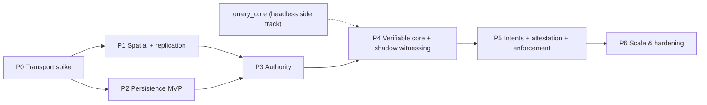

# Roadmap & Risk Register

This document turns the Orrery architecture into a phased build plan: seven phases (P0–P6), each with explicit goals, the crates it touches, deliverables, an upstream-contribution milestone, and — non-negotiably — a **demo criterion**: something runnable and observable that proves the phase, becomes a permanent regression harness, and gates entry to the next phase. It then expands [ADR-0017](adr/0017-risks-and-open-questions.md) into a full register (likelihood, impact, early-warning triggers, mitigations, plan B) and restates the open questions with proposed resolution paths and decision deadlines.

Normative source: [ADR-0017](adr/0017-risks-and-open-questions.md), with [D14](adr/0014-pinned-versions.md)–[D16](adr/0016-parameter-reference.md) governing versions, crate names, and parameters, and the applicable D3–D13 records in the [ADR index](DECISIONS.md) governing phase content.

## Sequencing principles

1. **Riskiest integration first.** The two things nobody has shipped in this ecosystem — an iroh IO layer for aeronet ([verified absent from crates.io as of Aug 2026](https://crates.io/crates/aeronet)) and the persistence tier (every surveyed netcode crate assumes transient in-memory state) — are P0 and P2. Everything else composes existing crates.
2. **Two parallel tracks.** The network track (P0→P1→P3) and the persistence track (P2) meet at P3, where the lease registrar makes the cluster the authority arbiter. `orrery_core` is engine-agnostic and headless (D9) and is built as a side track feeding P4.
3. **Demo-or-it-didn't-happen.** Each demo criterion is scripted, telemetry-instrumented (OpenTelemetry from P0 onward, per D12), and kept green in CI thereafter. Numbers in demo criteria are the D16 defaults — the demo *is* the parameter-table acceptance test.
4. **Trust features ship dark first.** Witnessing runs in shadow mode (telemetry only, no enforcement) for a full phase before any strike is issued, per D17.3.

Indicative calendar (planning estimate, not normative): P0 Q3 2026 · P1 Q4 2026 · P2 Q4 2026–Q1 2027 (overlaps P1; depends only on `orrery_protocol`) · P3 Q1 2027 · P4 Q2 2027 · P5 Q3 2027 · P6 Q4 2027.

---

## P0 — Transport spike

**Goal.** Prove the single biggest bet: iroh 1.0.x as the universal transport (D3), surfaced through `aeronet_io` so the whole upper stack inherits it. No replication, no game — raw sessions, datagrams, streams, and NAT telemetry.

**Crates.** `orrery_aeronet_iroh` (the deliverable), `orrery_protocol` (skeleton: `CellId` newtype, wire versioning), `orrery_net` (minimal: static peer list, channel policy datagrams=state / streams=control), plus ops config for one self-hosted `iroh-relay`.

**Deliverables.**
- `aeronet_io` implementation over iroh connections: unreliable datagrams for state, reliable streams for control/bulk, no head-of-line blocking between them; relay-vs-direct path surfaced as session telemetry (path type, time-to-direct-path, relayed-bytes fraction).
- A NAT test matrix exercised with real networks: full-cone, port-restricted, symmetric/hard NAT, CGNAT, and one deliberately UDP-blocked network (forced-relay case). Hard-NAT↔hard-NAT pairs are expected to relay permanently — [Tailscale's data](https://tailscale.com/blog/how-nat-traversal-works) shows CGNAT↔CGNAT pairs are effectively un-punchable — and D3 treats that tail as a product requirement.
- Punch-rate dashboard with the iroh production baseline (~90% direct connections, ~95% of bytes on direct paths) as the reference line ([iroh FAQ](https://docs.iroh.computer/about/faq), [holepunching docs](https://www.iroh.computer/docs/protocols/net/holepunching)).

**Demo criterion.** 8 peers on real, heterogeneous NATs (≥4 distinct NAT types, ≥2 ISPs, including the forced-relay peer) form a full mesh and exchange per-tick 60 Hz state datagrams for 30 minutes with zero session drops; the dashboard shows direct-path rate consistent with the ~90% baseline, the relayed peer's traffic flowing, and added relay latency quantified per pair. (60 Hz here is a deliberate transport stress at sim-tick rate; the production replication default is 20 Hz, D16.)

**Upstream milestone.** PR `orrery_aeronet_iroh` to aeronet as `aeronet_iroh`, mirroring the unpublished in-repo prototype (D4); file punch-rate findings against iroh where they diverge from the published numbers.

## P1 — Spatial model + replication

**Goal.** The 64-bit `CellId` doing its first duty (replication interest group, D5), on top of the consolidated stack (D4): bevy_replicon 0.42 visibility driven by cell membership, lightyear 0.29 bring-up for baseline prediction.

**Crates.** `orrery_spatial` (CellId Morton encoding, big_space integration, 27-cell AOI, hysteresis, interest-set selection, proxy extrapolation), `orrery_coordinator` (coarse presence, island formation, NodeId handout) — **landed** as a running service, not a stub; `orrery_net` (island membership lifecycle) — **landed**: the coordinator client drives membership from signed manifests over the game endpoint; `orrery_predict` (initial lightyear configuration: own-player prediction, 9-tick rollback window); `orrery_protocol` (final `CellId` encoding: offset-binary, Morton-interleaved, sentinel-bit level marker).

Membership is now a handout rather than an inference: a peer's island is what
the coordinator's manifest says, and the connected-session set is reconciled
against it. Conflating the two — which the P0 skeleton did — let any peer that
dialled in write itself into the island, and left manifest peers missing until
they happened to connect.

**Deliverables.**
- `CellId` property-test suite: sort order = spatial locality, parent = prefix range, level round-trips.
- big_space ported to Bevy 0.19 (tracked risk, D14) and integrated: `GridCell` ↔ interest-level `CellId` (128 m edge). **Resolved** — big_space 0.13 builds against Bevy 0.19 from the upstream `bevy-0.19` branch, and the `big_space` feature is now default rather than opt-in. The workspace still pins a git revision until that branch is released.
- Replicon visibility mapped from the 3×3×3 neighborhood; bounded high-rate interest set (24 entities) with 1–4 Hz extrapolated proxies beyond it — the Donnybrook pattern, whose measured ~12·n kb/s receive scaling is why the set is bounded ([Donnybrook, SIGCOMM 2008](https://www.microsoft.com/en-us/research/wp-content/uploads/2016/02/donnybrook.pdf)).
- Handoff hysteresis (10% of cell edge) verified against oscillation on the cell boundary.
- Peer upload budget metered and enforced at the send path (≤ 1 Mbps sustained, D6/D16): wire bytes including per-datagram overhead, a sliding window, per-link rates for the accumulator to apportion, and an oversubscription signal. State sheds at the ceiling, control never does. Priority-ordered shedding by relevance class stays with `orrery_predict`'s accumulator (docs/03-replication.md §9.3).
- lightyear 0.29 bring-up in `orrery_predict`. **Landed** — the crate now depends on lightyear rather than describing it. Delivered: the D16-to-lightyear configuration layer (60 Hz tick, 20 Hz send, 9-tick rollback window, 100 ms interpolation buffer, input redundancy, no input delay), `PredictConfig::validate` enforcing docs/05 §12's coupling invariants at plugin build, the universe↔lightyear tick offset map with wraparound accounting (docs/05 §6), the rollback budget guard applying D8's degradation ladder to lightyear's rollback bound, and the reconciliation-error monitor fed from real post-rollback corrections and attributed per authority. Details and the knob map: [05-prediction-rollback.md](05-prediction-rollback.md) §13.

**The lightyear bring-up finding (R-1 / R-2).** The pin holds: lightyear 0.29 builds against Bevy 0.19.1 unmodified — no bump, no fork, no patch to lightyear. R-1's build-failure trigger has not fired. Two gaps did surface, and the second is the one that matters.

1. lightyear exposes no rollback event or per-entity mispredict signal, so the monitor reads `VisualCorrection<D>` off the mispredicted entity instead. A workaround inside the seam, at the cost that a game must register lightyear correction for a component before its residuals become witness evidence.
2. **Per-entity authority does not work**, per lightyear's own module docs (`lightyear_replication-0.29.0/src/lib.rs:67`: *"Authority is currently not working since replicon only supports server to client replication"*). D17.1 recorded authority transfer as "in flux"; it is closer to absent. This does not block P1 — `orrery_authority` was always going to own D7's lease protocol, and the delivered slice proves that at P3 — but it does move the upstream milestone from *hardening* to *building*, which is more work than R-2's mitigation column assumes. The plan-B seam is now load-bearing rather than theoretical: the layering that confines lightyear to one crate is what makes a replicon-direct prediction layer a rewrite of `orrery_predict`'s internals and nothing else, and the crate's own surface (`PredictConfig`, `RollbackBudget`, `ReconciliationMonitor`, `TickBridge`, `PredictedBy`) is deliberately free of lightyear types so that rewrite would not reach its callers.

One workspace consequence rides along: lightyear's replication and prediction crates depend on crates.io `bevy_replicon`, and Orrery vendors a fork. The root manifest carries a `[patch.crates-io]` collapsing them onto the fork, because two copies of replicon in the graph are two distinct component types — `orrery_spatial`'s visibility mapping and lightyear's replication would talk past each other rather than fail to compile.

**Demo criterion.** 32 synthetic peers (headless bot harness, scripted roaming across ≥64 interest cells) run for one hour: every peer's sustained upload stays ≤ 1 Mbps; interest-set membership churn is absorbed without visible proxy pops; no entity thrashes cells at a boundary; a late-joining peer receives only its 27-cell neighborhood.

**Met**, by `p1-swarm` (`scripts/p1-swarm-gate.sh`), on a clean link and under P4's 3% loss / 100 ms jitter profile. Measured over the criterion's hour: worst peak upload 719 kbps against the 1 Mbps budget, 133 cells for the least-travelled peer, zero boundary flips and zero proxy pops across 75 k interest-set churn events, and a late joiner tracking only peers inside its neighbourhood. The hour is simulated — each peer's clock advances one 60 Hz tick per frame — so the run costs ~2.5 minutes and is reproducible from its seed.

The harness runs the shipping plugins; only the socket is stood in for, by an in-process router with seeded impairment (transport is P0's criterion, and P4 needs loss to be a reproducible parameter rather than a netem setup). Island *formation* is likewise installed rather than negotiated, because forming one is P3's criterion and is separately proven.

**Upstream milestone.** big_space 0.19 port PR upstream; visibility-API ergonomics feedback/patches to bevy_replicon.

## P2 — Persistence MVP

**Goal.** The "really really fast" tier (D11): cell actors, journal, FoundationDB checkpoints, area load — proven against synthetic load before real gameplay needs it. Starts during P1 (depends only on `orrery_protocol`).

**Crates.** `orrery_persistd` (gateway, cell actors, segmented journal on fjall 3.x or raw segments, FDB checkpoint/restore), `orrery_persist_client` (gateway session, diff uplink scheduler at 1–4 Hz per entity, area load/subscribe), `orrery_protocol` (intent, journal-record, checkpoint types).

**Deliverables.**
- Single-writer cell actor runtime with rendezvous-hash placement over shard cells (8×8×8 interest cells per shard).
- Journal with adaptive group commit (fsync immediately when the disk is idle, ~0.5 ms batching under load; commit < 2 ms server-internal); optional chain replication to one async follower (default on, RPO ≤ ~100 ms for bulk on node loss).
- FDB 7.3.x checkpointing on the 20 s jittered cadence, immediate on cell quiesce; keyspace exactly as D11 (`world/{cell_id}/{entity_id}`, `player/…`, `ledger/…`, `lease/…`, `chunk/…`).
- Area load: 27-cell FDB range scans + live actor deltas, streamed nearest-first.
- Offline world-seed import tool on the persistd harness (D11): bulk-writes designed content into `world/`/`chunk/` rows, mints `PersistId`s, and records a content-version row so later deploys can diff/patch designed content. Implemented as the TOML scenario runner specified in [12-world-seeding.md](12-world-seeding.md).
- The intent *execution* path (signature check → `Ruleset` validation stub → FDB serializable optimistic transaction) without witness attestation, so commit latency is measurable now; attestation arrives in P5.
- Latency rig: gateway-colocated load generator producing calibrated diff and intent mixes.

**Demo criterion.** With 10k entities across 100+ cells under synthetic load: `kill -9` the entire cluster, restart it, and the world resumes — zero acked intents lost (RPO 0), bulk loss bounded by the journal/replication window, clients (netsplit posture, D12) having queued intents and continued simulating. Measured against D16 targets in-region: journal commit < 2 ms server-internal, client-observed bulk ack p99 < 5 ms, intent commit p99 < 10 ms, area first page-in < 50 ms.

**Open defects blocking the demo criterion.** Found 2026-08-13 by tracing the seeder's read/write path through the landed code; each was read at the cited location, not inferred. Full detail, consequences and acceptance-gate mapping in [12-world-seeding.md](12-world-seeding.md) §2.

| # | Location | Defect |
|---|---|---|
| **P-1** | `orrery_persistd/src/runtime.rs` — `CellRuntime::open`, `::restore` | Journal replay filters `rec.cell != shard` (**equality**) while writes route via `shard.is_prefix_of(cell)` and clients uplink the entity's *interest* cell (`orrery_persist_client/src/feed.rs:87`). **Every real diff is discarded at recovery — the `kill -9` criterion cannot pass.** Fix: `shard.is_prefix_of(rec.cell)`. |
| **P-8** | `orrery_persistd/src/checkpoint/fdb.rs:126` | `checkpoint` postcards the whole `CheckpointData` — entity bag included — into the single `ckpt/{shard}` value, which D11 §6 fixes as `(node_id, lsn, epoch, time)`. Ceiling is `100 000/(bag+34)` = **344 entities/shard** at a 256 B bag; a 10k-entity world with any hotspot exceeds FDB's 100 KB value limit. |
| **P-2** | `checkpoint/fdb.rs:118` | Writes `world_key(data.shard, entity)` — keyed by the shard, not the entity's cell as D11 §6 specifies. `CheckpointData::by_cell` carries the right value and is unused for keying. |
| **P-3** | `checkpoint/fdb.rs` — `world_range_start`/`_end` | Compute `[w‖bits, w‖bits+1)`, the *exact-cell* span, though the doc comment claims it is the subtree (`CellId::subtree_range()` = `[bits−lsb+1, bits+lsb−1]`). Breaks subtree scans and `delete(shard)`. Masked in `tests/checkpoint_restore.rs:293`, which reads `CellId::ROOT` — also the shard. |
| **P-4** | `orrery_persistd/src/actor.rs:247` | `read_snapshot` opens `let _ = cells;` and returns the whole actor bag, so an area load for one interest cell returns up to 512 cells' entities. The < 50 ms first-page-in target is unmeasurable until it filters by `by_cell`. |
| **P-5** | `orrery_persistd/src/cluster.rs:236` | `Cluster::has_actor` returns `true` for every cell (`RendezvousHasher::owner` always answers), so the cold-store fallback never fires under a multi-node `Cluster`. |
| **P-6** | `checkpoint/fdb.rs` | `checkpoint` only ever `set`s rows for live entities; nothing clears removed ones, and the D11 §6 despawn tombstone is unimplemented. | **Fixed 2026-08-13:** `world/` values are now tag-prefixed — `0x00 ‖ bag` for live rows, `0x01 ‖ postcard(Tombstone{tick, gc_deadline_ms})` for despawn markers. The actor keeps tombstones on `Despawn` (5-minute GC deadline, `TOMBSTONE_RETENTION_MS`), the checkpoint writes markers and clears rows past their deadline (the §6 GC pass), `scan_world` never surfaces a marker, and `load` rebuilds the tombstone set so recovery keeps the countdown. Split partitions tombstones per child; re-spawn cancels a marker. Tests: `fdb.rs` value round-trip, always-on `despawn_tombstone_survives_checkpoint_restore_and_gc`, fdb-gated `fdb_tombstones_write_gc_and_isolate_grids` + `fdb_tombstone_end_to_end_lifecycle`. |
| **P-7** | `checkpoint/fdb.rs` — `world_key` | The 17-byte key carries no `GridId`, though `JournalRecord`, `DiffUplink` and the `grid/` rows all do and D11 §6 calls `cell_id` "grid-relative". Nested-grid content has nowhere to live. | **Fixed 2026-08-13:** the key is now `b'w' ‖ grid(4) ‖ cell(8) ‖ entity(8)` (21 bytes), and `ckpt/` is grid-scoped the same way; `world_range_start`/`_end`, `scan_world`, `load`, `delete` and `read_cold` all take the `GridId`. The grid threads from `RuntimeConfig` → actor → `CheckpointData`, and `GatewayMsg::Subscribe` carries it so area loads scan the right grid. Subtree spans never cross grids (an unbounded subtree ends at the next grid's first key). Tests: `fdb.rs` `grids_are_disjoint_under_identical_cells`/`ckpt_keys_are_grid_scoped` and fdb-gated `fdb_tombstones_write_gc_and_isolate_grids`. |

P-1 and P-8 block the demo criterion on their own. P-2, P-3, P-5 and P-6 block *seeded* worlds specifically; P-4 gates the latency numbers; P-7 gates nested grids. **All eight are fixed as of 2026-08-13** — P-1/P-4 in `actor.rs`/`runtime.rs`, P-2/P-3/P-6/P-7/P-8 in `checkpoint/fdb.rs`, P-5 in `cluster.rs` — each with a regression test; the seeder's acceptance gates (§14) can be built on the current tree.

**Implementation decisions taken during the P2 build (2026-08-13).** Each of
these binds more than one workstream, so it is recorded here rather than being
settled independently inside a single change.

| # | Decision | Why |
|---|---|---|
| **C-1** | **Area loads and intents are on a reliable stream. Resolved.** Originally a knowing deferral: both rode the packet lane, pages chunked under a conservative datagram budget with sequenced continuation markers, intents made safe by at-least-once delivery plus the `intent/{intent_id}` idempotency row and a client-side in-flight retransmit timeout. | PR #17 gave the peer lane real QUIC streams (`aeronet_iroh::stream`), which is what the client side was waiting for; PR #15/#16 supplied the motive, having found the datagram path amplifying under load — its own chunk retries flooding the state lane. **Now:** the Bevy client writes control on `IrohStreamIo`, and `orrery_persistd` (Bevy-free, so it speaks the same `[u32 LE length][payload]` framing over raw iroh) answers on two per-connection streams — control, and a separate one for area pages, so a 27-cell page-in never sits in front of an intent ack budgeted at p99 < 10 ms. The area-page frame budget is no longer an MTU figure (1100 B → 64 KiB, ~60× fewer chunks). **Retained deliberately:** at-least-once delivery and the idempotency row, because the window they cover — commit lands, connection dies before the ack — is not a transport window; and the client's in-flight timeout, reframed from a retransmit timer to a 10 s liveness backstop. **Retired:** the 50 ms unconditional area re-subscribe. It was the lost-page retry, it was the amplification, and a reliable lane leaves it nothing to recover; a 2 s backstop gated on the round actually being incomplete replaces it. See [08-persistence.md](08-persistence.md) §9.1. |
| **C-2** | **Journal replay drops only records superseded at write time.** Recovery scans in LSN order maintaining the running maximum epoch and discards a record iff its epoch is **below** that running maximum — not below the runtime's current epoch. | The naive predicate (`rec.epoch < current_epoch`) is inert only while the binary pins `Epoch::new(0)` and nothing fences. The moment startup fencing lands, it discards every legitimately acked record on every restart — the demo's exact failure mode, in a form that reads as success until someone counts entities. Zombie protection comes from the `actor/{shard}` fence CAS and the checkpoint's epoch read, not from filtering a node's own journal. |
| **C-3** | **`world/` values over 100 KB are a hard error, not a split row.** | → [08-persistence.md](08-persistence.md) §6. The reader identifies a row by exact key length; a suffixed row would be invisible to `load` and `read_cold`. |
| **C-4** | **The manifest's `value_digest` covers the component bag only**, excluding the storage value's live/tombstone tag byte. | → [12-world-seeding.md](12-world-seeding.md) §9.3. One decision with three consumers; if they disagree, gate A4 fails for a reason nobody can localize. |
| **C-5** | **`--profile <name>` selects an in-file `[profile.<name>]` overlay; the five ladder rungs are separate scenario files.** `apply --profile demo` therefore names a scenario file too, and `scenarios/p2demo.toml` ships with a baseline `[profile.demo]` and a 1000×-smaller `[profile.ci]`. | [12-world-seeding.md](12-world-seeding.md) §13.2 calls `apply --profile demo` "the entire P2 demo runbook line" while §5.2 defines `[profile.<name>]` as a file-local overlay. Binding profiles to files rather than to a global rung table keeps the ladder extensible without a registry, at the cost of one extra argument on the runbook line. |
| **C-6** | **`orrery_seed` depends on `orrery_persistd` with default features**, linking fjall and iroh into a batch tool. | → [12-world-seeding.md](12-world-seeding.md) §4. A knowing deviation from that section's own rationale; costs build time, not correctness. Revisit at P3. |
| **C-8** | **`actor/{shard}` fence rows are NOT grid-scoped, and that is now a known gap.** The key is `b'a' ‖ shard(8)` — 9 bytes, no `GridId` — while `world/`, `ckpt/` and `chunk/` all carry one. | Found 2026-08-13 by the seeder's `wipe` guard refusing on 8 fence rows another crate's tests had left in the shared dev cluster. Two consequences. **Correctness:** D11 §6 calls `cell_id` grid-relative, which is exactly why P-7 grid-scoped the other families; leaving `actor/` unscoped means a nested grid's shard fences against the root grid's row for the identical cell id — two different shards sharing one fencing token. **Operationally:** the seeder's §11.4 offline-mode precondition ("refuse when any `actor/{shard}` row in range is live") cannot be scoped to the grid being wiped, so unrelated residue blocks it. **Blocking, not deferred** (revised same day): running `cargo test` over `orrery_persistd` and `orrery_seed` *together* — which CI and the P2 demo runbook both must — leaves 8 fence rows from the persistd split tests that then block every seeder gate's pre-wipe. The suites pass separately and fail combined. **Fixed** (`e6a9a17`): the key is now `b'a' ‖ grid(4) ‖ shard(8)` (13 B), threaded through the `FenceStore` trait, the FDB store, the runtime, the scheduler and the seeder's wipe guard — which also had to stop deriving its grid set from every *declared* grid and use the grids its emits actually realize into, since guarding (and clearing) a grid the scenario never wrote is wrong twice over. The whole workspace now passes in one command: 301 tests across all four packages with both fdb features, twice consecutively, 0 skipped. |
| **C-7** | **Gate A8 is restated** as a skew-reproduction and watermark-size regression guard. | → [12-world-seeding.md](12-world-seeding.md) §14. The gate as written self-destructed when P-8 was fixed. |

**Upstream milestone.** Issues/patches to `foundationdb-rs` 0.11 and fjall as encountered; publish the FDB layer-schema notes.

## P3 — Authority

**Goal.** The two-tier claim model with cluster-arbitered leases (D7): the tracks merge — the persistence cluster becomes the authority arbiter for live simulation.

**Status (2026-08-16).** The strict persistence-authority slice is complete:
signed transport-bound admission, coordinator-interest-gated weak claims,
actor-owned durable lease rows, strict fenced uplinks, NodeId-scoped session and
claim-rate controls, client revocation on lease-bearing NACKs, hot-only
heartbeats, and server-owned recoverable committed rekeys.

The handoff slice on top of it adds **crash redistribution** (both the
disconnect fast path and the TTL slow path select a successor and grant through
the ordinary serialized claim path, parking only when no peer is eligible),
**holder-initiated negotiated divestiture** with an enforced
uplink-completeness gate, a registrar→peer push lane so a successor learns it
inherited a lease and a silent holder learns its lease ended, and the always-on
**single-writer invariant checker**. Strong-held rows still re-park rather than
being regranted, per D7.

Coordinator interest now reaches the gateway as a signed grant peers carry
themselves, which is what makes successor selection operable outside tests;
both directions of cooperative handoff are implemented, including the
registrar's divest request with D7's per-tier deadline rules; and
`PLAYER_BOUND` is enforced rather than merely declared. **The demo criterion
runs and holds** — see below.

The client-side halves of D7 have since landed too. **Contact-island
propagation** is a planner in `orrery_authority`: a breadth-first walk of each
tick's contact graph from every body the peer writes, batched under D7's
64-per-tick cap and spent against a client-side copy of the §10 claim bucket
(the cap alone is 3840 claims/s at 60 Hz against a 20/s bucket, so treating it
as a budget rate-limits an honest pile collapse into the strike telemetry),
stopped at strong-owned bodies, pre-filtered by the peer's own interest
coverage, and backed off per entity after a `Deny`. **Ephemeral in-island
claims** give projectiles and VFX a spawner-partitioned island-scoped identity,
initial authority by construction, and transfer by a single broadcast resolved
under D7 §4.4's total order — with a write marker distinct from the persistence
one, so no ephemeral path can uplink.

Remaining P3 follow-on: coordinator-driven island drain, `Expire` fan-out to
cell subscribers, redistribution across sibling gateways, and field-host
promotion (P6). The Bevy coordinator client in `orrery_net` landed with P1:
`orrery_net::coordinator` drives `IslandMembership` from coordinator manifests,
with the connected-peer derivation retained only as the no-coordinator
fallback. The last wire landed with the `orrery` facade: its
`bind_island_membership` mirrors `IslandMembership` into
`orrery_authority::IslandBinding`, where the ephemeral namespace and the
in-island tiebreak read the island id and manifest epoch. Before it, nothing
outside a unit test wrote that binding, so `EphemeralRegistry::spawn` bailed
on its first line in every real app.

**Crates.** `orrery_coordinator` ships the `orrery-coordinator` service:
authenticated presence in, island manifests and signed interest grants out,
Bevy-free over iroh (docs/10-crates.md §6). `orrery_authority` implements
optimistic weak/strong claims,
`auth_seq`/`own_seq`, correlation-safe lease control, inherited grants
(`ClaimId::REGISTRAR` → `AuthorityEvent::Inherited`), holder-initiated
`LeaseClient::divest`, loss-of-authority reconciliation, the contact-island
propagation planner, and the registrar-free ephemeral path (`IslandClient`,
`EphemeralRegistry`, `IslandAuthoritative`). `orrery_persistd` implements the
actor-owned lease registrar, strict gateway fencing, committed rekey, the `SuccessorPolicy`
seam with its coordinator-interest-ranked default, and `AuthorityMetrics`.
`orrery_predict` and `orrery_coordinator` retain their P1/P4 scaffolding;
coordinator-driven movement orchestration is not part of the delivered slice.

**Deliverables.**
- Lease rows `(entity_id → holder NodeId, auth_seq, own_seq, expiry)`; TTL 10 s, heartbeat 2.5 s; optimistic claim (simulate immediately, roll back on CAS loss).
- Cooperative handoff (negotiated divestiture with holder ack) and crash handoff (lease expiry → orphan → reassign to nearest interacting peer, else park in cluster). **Implemented:** crash handoff on both the disconnect and TTL paths, and the holder-initiated half of cooperative handoff with an enforced `Divest.cursor` gate. **Follow-on:** the registrar→holder `Divest` request, which is what lets a claimant's `Claim{Strong}` trigger the handoff.
- Cross-cell movement keeping the holder under hysteresis; storage row re-keyed on commit. **Implemented:** server-owned committed rekey preserves the lease fence and atomically relocates the durable lease index; client movement control is rejected. Re-keying the `world/` row means both halves — the new key written *and* the vacated one cleared by the checkpoint that writes it, since the cell lives in the key and until P-9 only the new key was ever written.
- Ephemeral entities (projectiles, VFX) on in-island claims only, never touching the registrar. **Follow-on.**
- Single-writer invariant checker: telemetry that flags any tick where two peers both believed they held authority. **Implemented:** `GatewayServer::authority_metrics()` counts fenced-out writes whose live row named a different unexpired holder, retains the last sample, and logs each at `warn`.

**Demo criterion — met (2026-08-16).** An 8-peer island with contested physics
objects: `kill -9` one peer holding ~50 entities → every entity is reassigned
or parked within the 10 s lease TTL, with no duplicate-authority tick recorded
and no lost entity; separately, a scripted cooperative handoff chain (player A
grabs, throws to B's contact island) completes with zero registrar-visible
conflicts and no visible pop.

`scripts/p3-island-gate.sh` is the permanent harness, driving the `p3-island`
tool against a live `orrery-coordinator` and `persistd`. Peers are real OS
processes, so the `kill -9` is a real SIGKILL rather than a dropped task, and
each peer obtains its interest grant from the coordinator rather than having
one minted for it — a fixture that signs its own authorization would prove
nothing about the path production uses. Observed on an 8-peer island of 400
entities: **50/50 of the victim's entities reassigned to survivors in ~10.9 s,
0 lost, 0 duplicate-authority observations**, reproduced across runs. The gate
writes no success artifact unless every clause holds.

One finding worth recording, because it changes what "within the TTL" means in
practice: **a `kill -9` is resolved by the slow path, not the fast one**. QUIC
cannot distinguish a dead process from a dead path until its own idle timeout,
so the gateway never sees a connection drop for a SIGKILLed peer; the lease
TTL lapsing is what redistributes its entities (§4.3's `else silent` branch).
The fast path is real, and covered by the disconnect test, but it is what a
*graceful* exit or a torn connection takes. The harness therefore budgets the
TTL plus the registrar's once-a-second sweep granularity and the up-to-one
heartbeat interval of TTL already spent before the kill.

The cooperative-handoff half is proven at the wire level in
`orrery_persistd/tests/gateway.rs` rather than in the island harness: both
directions of §4.2, the deadline rules for each tier, and the refusal paths.

This remains the anti-host-migration proof: authority moves per entity, so no session-wide stall — the
failure mode that [drove For Honor off P2P](https://www.ubisoft.com/en-us/game/for-honor/news-updates/2HayRoZjbJzSEJAhJMpeF7/for-honor-now-on-dedicated-servers-on-all-platforms)
cannot occur by construction.

**Upstream milestone.** Authority-model hardening PRs to lightyear (its authority handling is self-described as ["somewhat in flux"](https://github.com/cBournhonesque/lightyear/releases), and the `distributed_authority` example is outdated) — contribution, not fork, per D4.

## P4 — Verifiable core + witnessing in shadow mode

**Goal.** Scoped determinism (D9) and passive witnessing (D10) with **no enforcement**: logs, replay, adjudication, and discrepancy telemetry only. This phase exists to calibrate tolerance bands against reality before anyone can be striked.

**Crates.** `orrery_core` (`Ruleset` trait, fixed-tick executor, `rand_chacha` seeded per `(universe_seed, entity, tick)`, quantization, tolerance comparators, signed hash-chained input logs, headless replay harness) — **landed**, see [06-verifiable-core.md](06-verifiable-core.md); `orrery_witness` (invariant validators, discrepancy detection, evidence assembly) — **landed**, shadow-mode by default; `orrery_persistd` (adjudication executor linking the same `Ruleset`) — **landed** as version-keyed routing over the 3 retained builds; `orrery_games` (the reference games: kinematic movement + integer combat core) — **landed**.

The core was built as a side track (sequencing principle 2), so it proceeded
independently of the P1/P3 tracks. It now has its consumers: `orrery_witness`
re-executes what authorities stream, `orrery_persistd` adjudicates the resulting
bundles, and the pipeline carries frames and claims on `Channel::State` with gap
repair on `Channel::Control`. Detection, evidence and transport are in place and
the phase is no longer blocked on wiring.

What remains is the part the phase actually exists for, and it is measurement
rather than construction: **the false-positive rate**. Shadow mode stays on
until ≥ 500 honest player-hours across all three platforms under injected
impairment produce zero reports (D17 risk 3). Of the three things that gate
being able to measure it at all, two are now in place — the cross-platform
determinism CI (`.github/workflows/ci.yml`, four targets, per commit) and the
reference game (`orrery_games`) — and what is outstanding is the **accumulation
of hours**: `p1-swarm --witness` runs the pipeline, and the nightly swarm gate
now runs *it* — a third leg, 32 peers for a simulated hour under the impairment
profile, blocking on all three witnessing clauses, accruing 32 player-hours a
night on x86_64 Linux (`scripts/p1-swarm-gate.sh`,
`.github/workflows/nightly.yml`). The gate's fourth and fifth legs close the
criterion's *other* half — a modified client convicted at population, and an
armed honest island that files nothing — see below. Measured over that hour before it landed:
coverage 95.98% against the 95% floor, zero false positives, 156 728 chain gaps
repaired. What is outstanding is narrower than it was, and one part of it is
newly visible: **the criterion's loss band is 3–5% and only its floor held.**
The same witnessed hour at 5% loss judged 93.8% of the timeline it was shown,
below the 95% floor, with zero false positives across 32 player-hours and
234 930 chain gaps against 156 728. That deficit is now attributed and closed,
and the attribution is worth recording because the obvious explanation was the
wrong one.

**The deficit was never the repair path.** Instrumenting every way a frame can
leave the witness's deferral buffer — folded on a retry, discarded as already
behind the fold, displaced by the per-subject cap, swept past the retention
floor, refused by the drain that re-offered it, replaced by a later copy, or
still held at the end of the run — the ledger balances at essentially 100%
recovered: at 5% loss, 314 101 of 314 105 deferred frames folded on a retry,
four still held, and **zero** through any other door. Repairs were landing.

What the per-peer figures said instead: every peer's coverage came out at an
exact k/7 of the timeline it was shown, seven being the witness set. **The unit
of loss was a whole watch, judging its subject's entire hour or none of it** —
9 dead watches of 224 at 3% loss, which is 1 − 9/224 = 95.98% to four places,
and 14 of 224 at 5%, which is 93.75%. What killed them was the first frame after
the anchor. A watch had no verified head until one landed, so the signature
preimage was rebuilt from the anchor claim's head regardless — and a frame that
did not chain to it failed *verification* rather than gap detection. A rejection
asks for no repair and moves no head, so every frame after it failed identically
for the life of the watch, while the coverage denominator kept climbing because
the subject was still talking; re-anchoring could not rescue it either, because
resuming needs a `Catchup` that was never opened. One lost datagram in one place
cost a whole subject for the rest of the session.

The anchor's `input_head` is signed by the subject, which is exactly the
argument the re-anchor path already makes for the head it resumes on, so a watch
is now checked from its first frame and a first frame that does not chain opens
a repair from `anchor_tick`. Measured over the criterion's hour at 32 peers,
before and after, same seed:

| 32 peers, one simulated hour, `--witness` | 3% loss | 5% loss |
|---|---|---|
| Observation coverage, before | 95.98% | **93.75%** |
| Observation coverage, after | **100.0%** | **100.0%** |
| Watches that never folded a frame, before | 9 of 224 | 14 of 224 |
| Watches that never folded a frame, after | 0 | 0 |
| False positives, before and after | 0 | 0 |
| Chain gaps repaired, before → after | 156 728 → 164 164 | 234 930 → 250 007 |
| Deferred frames not recovered, after | 2 of 219 641 | 3 of 335 096 |
| Replication packets shed, before → after | 206 → 230 | 229 → 255 |

Those figures were taken with the swarm playing `orrery_conformance`'s corpus
kernel; it plays `orrery_games`' Skirmish now, and the seeded numbers moved with
it. See *Re-measured on Skirmish* below.

**The band holds at both ends.** The witnessed hour at 5% loss now judges
essentially all of the timeline it is shown, still with zero false positives.
`MIN_COVERAGE` did not move — the phase's target was met, not lowered — and no
D16 parameter moved either. The residual at both ends is the two or three frames
still held behind an open hole when the run stops, which is the run ending
mid-repair rather than a loss.

One consequence the gate had to absorb: repairing the watches that used to be
dead is repair traffic, so the swarm asked for 5–6% more chain gaps and shed
**230 packets at 3% loss against the nightly leg's `--max-shed 206` ratchet**
(255 at 5%). That allowance is a measured ratchet whose own comment says a run
that moves it has found something; that run found something, and the number was
re-baselined to the post-fix figure rather than the clause being relaxed. It has
since been re-baselined again, to 162, for a different reason — see below.

The gate runs the 3% floor nightly and `p1-swarm --loss 0.05` reproduces the
other end on demand. The rest of what is outstanding: the other three
determinism targets, and
a ledger that adds the nights up. Each report is
stamped with its seed, its full impairment profile, its target triple and its
commit sha, and deliberately not with a wall clock unless asked, so summing them
later is bookkeeping rather than archaeology.

**The hours now accumulate, and the ledger says what they are hours of.**
`scripts/p4-accumulate.sh` runs one witnessed hour a night and
`scripts/p4-ledger.sh` banks it; the nightly's `p4-accumulate` job carries the
ledger between nights. The gate could not be the thing that accumulated, and the
reason is structural rather than an oversight: it runs `--seed 1` at the band's
floor every night — no seed flag appeared anywhere in `scripts/` or `.github/`
before this — and `RunIdentity` carries no wall clock, so consecutive nightlies
on one commit produced byte-identical identities. Thirty-two hours re-run three
hundred times are thirty-two hours. The accumulation leg varies the seed with
the date and sweeps 3% → 4% → 5% on a three-day cycle, so each night is a
distinct sample of the band the criterion names; the ledger deduplicates on
`RunIdentity` verbatim, so a re-dispatched nightly adds nothing and a re-run at
a new seed adds a line.

*Running total, and what it is a total of.* **0 banked hours as of this
change** — the first line lands on the next nightly. A total is only meaningful
within a *pipeline version*, so every line carries one: the git tree hashes of
`orrery_witness`, `orrery_core`, `orrery_games` and `p1-swarm` at the run's own
commit, hashed together, and `p4-ledger.sh total` groups by it rather than
summing across it. That is what makes the pre-#44 boundary auditable rather than
a footnote: hours banked while the swarm played `orrery_conformance`'s corpus
kernel ran stage 1 against an empty invariant slice and are not hours of the
same measurement. At `431aa10` that digest is `52afc77a6583c7a6`; the 500 are
counted against it and reset when any of those four trees changes.

*What the ledger can and cannot claim.* Until this change it could claim honest
player-hours on **`x86_64-unknown-linux-gnu` only**. Every runner that could
execute the accumulation leg was Linux — the nightly's self-hosted box and
`ubuntu-latest` — and the criterion says *across all three platforms*, so a
Linux-only ledger could not satisfy it however many hours it held. The `target`
field is recorded per line and `total` groups on it precisely so that the
shortfall was visible rather than implied.

**The accumulation leg is now a three-way matrix** — the box, `windows-latest`,
`macos-latest` — each leg keeping its own ledger shard, and `p4-ledger.sh total`
reports progress per platform and names the platforms at zero rather than
printing one number that a Linux-only ledger could satisfy. What follows is what
is established about that and what is not, because the two are different.

*What was established, and how.* Everything below was measured on the box; a CI
run on the other two platforms is what will settle the rest, and this record is
written before one has happened.

- **The dependency graph resolves on all three.** `cargo tree --target` on
  `p1-swarm` yields 395 crates for `x86_64-unknown-linux-gnu`, 400 for
  `x86_64-pc-windows-msvc`, 405 for `aarch64-apple-darwin`. What the two
  non-Linux targets add is `windows`/`windows-sys`/`wmi`/`ipconfig` and
  `objc2-*`/`core-foundation`/`security-framework` — system bindings pulled by
  iroh's interface and certificate discovery. **No windowing, audio or input
  backend appears on any of them**, which is the Bevy-on-a-headless-runner
  hazard not being there: `p1-swarm` takes `bevy_app`, `bevy_ecs`, `bevy_math`
  and `bevy_time` with `default-features = false` and nothing else of Bevy.
- **A local cross-compile proves nothing either way, and the reason is this
  box.** `cargo check --target x86_64-pc-windows-msvc` fails in `cc-rs` with
  `failed to find tool "lib.exe"`, and `--target aarch64-apple-darwin` fails
  compiling `ring-0.17.14/crypto/curve25519/curve25519.c`. Both are `ring`
  building C for a target whose toolchain and SDK are not installed here — not
  a statement about Windows or macOS. **Only a CI run can answer question 1.**
- **The reports are comparable, byte for byte.** Two runs of one seed (424242,
  4% loss, 32 peers, 120 simulated seconds, witnessed) produce **identical**
  `--json` output. `SwarmReport` is a pure function of its parameters: the
  wall-clock phase timings go to stderr and never into it, and the only field
  that is not — `started_at_unix_secs` — appears only under
  `--stamp-wall-clock`. So the cross-platform question is a diff, not a
  judgement call, and `p4-accumulate.sh --probe` is what asks it: the same seed
  at every platform, `identity.target` the only field allowed to differ. The
  nightly's `p4-platform-ledger` job runs that diff and fails on a divergence.
- **What a run costs.** The leg is single-threaded — 99% of one core, 108 MB
  RSS, 9.26 s of CPU for 60 simulated seconds — so about 555 s per witnessed
  hour on a Zen 4 core, and the 615 s recorded below is the same figure with two
  other nightly jobs competing. A hosted runner is slower per core and pays a
  cold build of ~400 crates, which the per-platform cargo cache is there to
  amortise; the legs are bounded at 180 minutes (Windows) and 150 (macOS),
  well under the 6-hour job ceiling. The repository is public, so hosted minutes
  are not billed.

*Three things that would have stopped the leg off Linux, found by reading and
fixed here.* None of them needed a runner to find, and each would have failed
the first night:

1. `scripts/p4-accumulate.sh` hard-coded `p1-swarm/target/release/p1-swarm`.
   Cargo emits `p1-swarm.exe` on Windows, so the leg would have died at
   `harness binary missing` before running a tick. Both spellings are tried now.
2. `scripts/p4-ledger.sh` required `flock` and `sha256sum` — util-linux and GNU
   coreutils, neither of which is on a stock macOS runner or in the Git Bash a
   Windows runner uses. It falls back to `shasum -a 256` and to an atomic
   `mkdir` lock; the self-test checks that the two digest spellings agree,
   because a `run_key` that differed by platform would silently bank every hour
   twice.
3. There is no `.gitattributes` in this repository, and the Windows runner image
   sets `core.autocrlf=true`. Every `scripts/*.sh` would have been checked out
   with CRLF and died on the carriage return in its shebang. The Windows leg
   sets `core.autocrlf=input` before its checkout.

*What is still unknown.* **Whether `p1-swarm` compiles and holds its clauses on
Windows and macOS is not yet known** — it has never been built there, and no CI
run has happened on this work. The dependency graph resolving is a necessary
condition and not a sufficient one. If a leg fails, the failure lands in that
platform's job and in its probe artifact, `fail-fast: false` keeps it from
taking the other two down, and the ledger banks nothing for it — which is the
correct outcome, because an hour that does not satisfy the witnessing clauses is
not an hour.

*One thing these legs do not prove, whatever they report.* Within a single run
every peer shares one binary and one `libm`, so re-execution is bit-identical by
construction and the cross-platform divergence false positive cannot occur
(`p1-swarm`'s module docs say so). An hour banked on `windows-latest` is
evidence that the witness pipeline holds **on Windows**; it is not evidence that
a Windows witness re-executing a macOS subject's log agrees with it. That is a
different experiment — the determinism matrix extended to exchange logs between
its platform legs — and whether the criterion's "across all three platforms"
means the first or the second is not settled by its wording. `p4-ledger.sh
total` reports both halves for the same reason: the running total against 500,
and the per-platform split it is made of, without asserting how the 500 divide.

*What a night costs now.* Three accumulation legs instead of one. The box's leg
is unchanged at 615 s plus its build and stays bounded at 45 minutes; the two
hosted legs add a `windows-latest` and a `macos-latest` job to a nightly that
previously used hosted runners only for the two FoundationDB jobs, plus one
short comparison job back on the box. The comparability probe costs about 20 s
per leg — two simulated minutes at the same 32 peers — and runs before the hour
so that a platform which cannot hold the clauses is found cheaply.

**A correction to the shed figures above, found while choosing this leg's
allowance.** The table records 162 packets shed at 3% loss and 172 at 5% as
though the loss point moved it. Both are seed 1. Measured across 72 (seed, loss)
cells — seeds 20670–20741 against all three band points, 32 peers, witnessed —
the three points agree on their means to within 1.1 packets while the seeds
spread 149–183 at every one of them:

| shed, 32 peers, witnessed | min | mean | max | cells |
|---|---|---|---|---|
| 3% loss | 155 | 168.5 | 177 | 24 |
| 4% loss | 149 | 168.7 | 182 | 24 |
| 5% loss | 154 | 167.6 | 183 | 24 |

**The shed count is a function of the seed, not of the loss point**, and 162 →
172 is inside the noise a seed change produces at a *fixed* loss. The gate's
ratchet is unaffected and unchanged — it is one fixed seed, which is exactly the
condition under which an exact ratchet means something — but a swept leg pinned
at the observed maximum would fail about one night in twenty-four for no reason
but its seed, and a failed leg banks nothing. The accumulation leg therefore
carries a *bound* on the island-formation transient, 200, roughly 9% above the
observed maximum, with the per-run count recorded on every banked line so a
shift in the distribution stays visible. The transient settles early enough to
sample cheaply: seed 1 at 3% sheds 162 at 30 simulated seconds, at 5 minutes and
at the hour; seed 5 at 4% sheds 180 at all three.

**Re-measured on Skirmish.** Swapping the ruleset was a physics migration, not a
rename: Skirmish applies drag and a per-archetype speed clamp where the corpus
kernel applied neither, so every trajectory in the swarm moved and with it the
crowd density that decides how much any peer has to send. Every seeded number in
the gate was re-measured rather than adjusted, at 32 peers, same seed, at five
simulated minutes *and* at the criterion's hour:

| 32 peers, one simulated hour | corpus kernel | Skirmish |
|---|---|---|
| Least-travelled peer, cells visited (cruise-only legs) | 81 | **138** |
| Replication packets shed, `--witness` at 3% loss | 230 | **162** |
| Replication packets shed, `--witness` at 5% loss | 255 | **172** |
| Observation coverage, 3% / 5% | 100.0% / 100.0% | **100.0% / 100.0%** |
| False positives, 3% / 5% | 0 / 0 | **0 / 0** |
| Chain gaps repaired, 3% / 5% | 164 164 / 250 007 | 164 022 / 250 123 |
| Witness lane per peer | 194 kb/s | 180 kb/s |
| Worst peak upload, `--witness` | 973 kb/s | 921 kb/s |

Both shed figures are **identical at five simulated minutes and at one hour**,
which is the test that still distinguishes the island-formation transient from a
sustained overrun; the `--max-shed` ratchet on the nightly leg tracks the
measured number and is now 162. `--min-cells 64` is untouched and clears by more
than it did. `MIN_COVERAGE` did not move, and no D16 parameter moved.

Turning `Ruleset::invariants()` on was the live risk in that swap — `p1-swarm`
fails the run on any false positive, and Skirmish's stage-1 checks were tuned
against its own pilot rather than against a 20 Hz bot under 3–5% loss. They
hold: **zero** stage-1 breaches across 64 accumulated player-hours at both ends
of the band. The check that could have fired is `skirmish/acceleration-cap`
under packet reordering, where a jittered sample can arrive stamped *behind* its
predecessor; `checks::exceeds_acceleration` returns `false` on a zero-tick gap,
so a reordered pair is declined rather than accused.

**The demo criterion's other half is closed: a modified client is convicted at
population.** Both ends of it were proven separately and neither was proven in a
swarm — `orrery_witness`'s own tests drive a cheating authority to
`Verdict::Confirms`, `orrery_persistd`'s carry a signed report over a real
gateway, and `p1-swarm` had no `WitnessIdentity`, no cheat and no adjudicator:
every escalation it ever raised was counted as `escalations_unidentified` and
nothing was filed. `p1-swarm --cheat` closes it end to end, and the nightly gate
runs it as a fourth leg with an armed-but-honest control as a fifth.

Measured at the population the criterion names — `--peers 8 --seconds 300
--impaired --witness --cheat speed`:

| P4 demo criterion, 8-peer island, 3% loss / 100 ms jitter | |
|---|---|
| Modified peers fielded | 1 (`Tamper::SpeedMultiplier`, the criterion's own 1.5×) |
| First tick its build diverged from the shipping rules | **0** |
| First tick an independent re-run returned `Confirms` | **32** |
| Detection latency against the 180-tick window (D16) | **32 ticks**, 0.53 s |
| Reports filed against it → verdicts | 41 → **41 `Confirms`**, 0 exonerates, 0 forged, 0 unadjudicable |
| Reports filed against an honest peer | **0** |
| Observation coverage / false positives | **100.0%** / **0** |
| Same island, witnesses armed, nobody modified | **0 reports filed** |

Three findings came out of building it, and each one would have made the leg
pass while proving nothing.

**The named cheat is inert at these parameters unless it is aimed.**
`Tamper::SpeedMultiplier` raises an archetype's ceilings by 1.5×, and the swarm's
roam requests `accel_mmss` 60 000 — *exactly* an interceptor's
`max_accel_mmss`. On that slot `clamp(0, 60_000)` and `clamp(0, 90_000)` return
the same number, the tampered peer's state is byte-identical to an honest one's,
nothing is detected and nothing is filed: every conviction clause holds over a
swarm in which nothing happened. Neither *speed* ceiling binds either — the bots
cruise at 32 m/s against 120 and 60 — so the acceleration clamp is the whole of
this cheat here. Modified peers are pinned to the cruiser slot (ceiling 20 000,
so 20 000 honest against 30 000 tampered, 167 mm/s of velocity per thrusting
tick against a 10 mm/s band), a unit test asserts both halves, and a `--cheat`
whose build never diverges fails a clause of its own rather than passing the
rest.

**Stage 1 never fires on it, and that is correct.** A cruising bot thrusts about
one tick in nineteen, so across a 20 Hz sample gap the cheat's contribution stays
well inside `skirmish/acceleration-cap`'s allowance. It is caught by
re-execution and only by re-execution — the argument for stage 1 being a filter
rather than a verdict, arriving from the opposite direction to the
`DamageInflation` cheat that was written to make it.

**A latent adjudication defect, found by being the first thing to adjudicate a
swarm bundle.** `p1-swarm` anchors every watch at tick 0 and then published a
*second* claim at tick 0 on the first tick — same entity, head and state hash,
different `prev_claim`, therefore a different `claim_hash`. A witness retains
both; `AuthorityLog::assemble_bundle` takes the anchor as `t0_claim` while the
tick-30 claim chains from the duplicate; `verify_bundle` walks
`disputed_claims` checking `claim.prev_claim == claim_hash(previous)`, finds the
break, and returns **`Confirms { DiscreteMismatch }` against an authority that
did nothing wrong**. Shadow mode is why nothing saw it: no `p1-swarm` bundle had
ever been adjudicated. Fixed in the harness's own chain authoring, with a test
that fails without the fix.

The conviction leg is cheap — eight peers, five simulated minutes, about seven
wall seconds — because detection happens 32 ticks in and everything after it is
confirmation. It also stops filing after one window, which is the right
behaviour rather than a defect: a subject that diverges permanently never agrees
with its witness again, so `audit_window` runs out of agreed claims 180 ticks
past the anchor and every later mismatch is counted as
`escalations_unservable`.

**The bandwidth blocker at 32 peers is settled: it was the frame cadence.** At
the criterion population the witness lane wanted 384 kb/s per peer against
[03-replication.md](03-replication.md) §5.3's 0.15–0.2 Mbps, which took the peer
to 1006 kb/s over a 1 Mbps ceiling. The lane now holds a declared **20% share of
the peer upload budget** and derives its frame cadence from it — one frame per
10 ticks, 6 Hz, against the unchanged 20 Hz send rate and 2 Hz claim cadence
(§5.3a). Measured over 5 simulated minutes at 32 peers: lane 190 kb/s inside its
200 kb/s share, peak upload 973 kb/s, **observation coverage 81.3% → 100.0%**
and **false positives 582 → 0**; under the 3% loss / 100 ms jitter profile,
coverage 96.0% and false positives 0. Eight and sixteen peers hold at 0 shed, 0
false positives, 100% coverage. Over the criterion's full simulated hour at 32
peers: **32 accumulated player-hours, zero false positives, 100% coverage**,
lane at 194 kb/s; the same hour *under* the impairment profile held at
**95.98% coverage and zero false positives**, lane at 194 kb/s, 206 packets
shed — the same 206 as at five minutes, so a transient at island formation
rather than an overrun. That 95.98% was the dead-watch deficit above and is
**100.0%** since; the shed figure moved with it, to 230. The 500-hour gate is now a matter of running the harness
across the four determinism targets rather than of anything being in the way.

No D16 parameter moved. The witness set stays at N ≥ 5, ≤ 7 links — dropping to
five would have recovered under a third of what the cadence did while costing
the K-of-N collusion margin (§4.4's C(c,K)/C(N,K) goes from ~1-in-35 to
~1-in-10) — and the claim cadence stays at 2 Hz, because a claim is the
re-anchor point a witness restarts from and stretching it lengthens exactly the
window in which coverage is lost. What *was* wrong was a cadence inherited from
the send rate rather than derived from a budget, and a backstop that shed log
frames as though they were replication updates. The second is now impossible:
witness records are unsheddable and the lane is bounded at source instead
(§5.3a).

**The coverage figure is now reported beside every false-positive count and is
part of the exit gate.** The 500-hour number cannot be accumulated under
shedding: a witness that has stopped watching also reports zero, and 81%
coverage makes a false-positive rate a statement about which frames arrived
rather than about the rules.

**The reference game (`orrery_games`).** Skirmish — small craft, kinematic
movement over `libm`, integer combat with cooldowns, weapon reach and a death
state — plus the harness that plays it, records what an authority would have
logged, runs stage 1 the way an ordinary peer does, and re-executes the log the
way a witness does. Three things about it are worth stating here rather than
leaving in the crate:

- It is where `Ruleset::invariants()` first returns anything. P4's "continuous
  cheap checks — speed/acceleration caps, teleport detection, rate limits,
  impossible values" existed as a seam in `orrery_core` and as a consumer in
  `orrery_witness`; until a game published validators, every peer in the tree
  was evaluating an empty slice. **That included the swarm**, for as long as it
  played `orrery_conformance`'s corpus kernel: every accumulated player-hour ran
  stage 1 against `&[]`, and the false-positive count was a statement about log
  re-execution alone. `p1-swarm` plays Skirmish now, so the cheap checks run on
  every sample every peer receives and the invariant term in that count is live.
- It ships its own cheats, because the demo criterion is a modified client. The
  three are chosen so each is caught by a different stage: a 1.5× speed
  multiplier (the criterion's own, caught by stage 1 *and* out of band on
  replay), an inflated damage roll (**invisible** to every cheap check — every
  field it touches stays legal — and caught only by re-executing the attacker's
  window), and an ignored weapon cooldown (rate limit, then replay). The middle
  one is why stage 1 is a filter and not a verdict.
- The first run of its own battery found a false positive in its own
  acceleration cap: the obvious limit, `a_max · dt` per tick, is wrong for
  rules where drag and a speed clamp also move the velocity, and it fires on
  honest play within ten seconds. That is the failure mode of D17 risk 3 in
  miniature, found by a test rather than by a player, which is the argument for
  the crate in one sentence.

It is deliberately *not* a substitute for `p1-swarm`, and the two are now
coupled rather than parallel: the swarm plays this game, over an impaired link,
with the real witness, and answers whether the pipeline holds up; the battery
here answers whether the rules are honest-safe and the cheats are adjudicable,
in milliseconds, on every commit, on four platforms. The swarm is still the
thing that accumulates the hours — and, since `--cheat`, the thing that convicts
a modified one.

**Deliverables.**
- PeerReview-style tamper-evident logs streamed to the cell-epoch witness set (on the state lane beside replication, at a cadence derived from the lane's budget share — [03-replication.md](03-replication.md) §5.3a; gap repair over the reliable control stream); any holder of a segment + t₀ claim can re-execute a window ≤ 3 s (180 ticks) and produce self-verifying evidence.
- Continuous cheap checks: speed/acceleration caps, teleport detection, rate limits, impossible values, plus the reconciliation-error monitor.
- Discrepancy pipeline end-to-end: escalation → log-segment request → observer replay → evidence bundle → cluster re-execution → verdict — terminating in telemetry, not enforcement.
- Rules-version skew handled from the start: the adjudication executor retains the last 3 ruleset builds as version-keyed sidecar workers and routes evidence bundles by `RulesetId`; bundles older than retention resolve as unadjudicable — never a strike (D11, D12).
- Cross-platform determinism CI: identical core replays on Windows/Linux/macOS binaries every commit (ε_pos 1 cm, ε_vel 1 cm/s, 250 ms sustained-error window for continuous state; bit-exact for discrete outcomes).

**Demo criterion.** A modified client applying a 1.5× speed multiplier joins an 8-peer island: detected, escalated, replay-adjudicated with a deviation verdict within one adjudication window of the violation. Simultaneously, ≥ 500 honest player-hours (bot + human mix) across all three platforms under injected impairment (3–5% packet loss, 100 ms jitter spikes) produce **zero** false-positive discrepancy reports. False-positive rate is the phase's primary tunable; the phase does not exit until it holds.

*Status.* The first sentence **holds** and gates nightly: 8 peers, 3% loss and
100 ms jitter, one peer on `Skirmish::cheating(SpeedMultiplier)` — divergence at
tick 0, `Verdict::Confirms` at tick 32 against a 180-tick window, 41 of 41
reports confirmed, zero filed against any of the seven honest peers, and the
same island with every witness armed and nobody modified filing nothing. The
second sentence is bounded only by **accumulation**: the pipeline holds at both
ends of the 3–5% band at 32 peers with zero false positives and full observation
coverage, and what is outstanding is running the harness on the other three
determinism targets. Adding the nights up is no longer outstanding: the nightly
`p4-accumulate` job banks one distinct witnessed hour per night, swept across
the band, into a deduplicated ledger (`scripts/p4-ledger.sh total` is the
running figure). It stands at **0 hours** until the first nightly, and every
hour it will ever hold is `x86_64-unknown-linux-gnu` — one of the three
platforms the criterion names.

**Upstream milestone.** Publish the determinism conformance suite (quantization + `libm` math corpus) as a standalone repo; upstream any platform-drift fixes it surfaces.

## P5 — Intents + attestation + enforcement

**Goal.** Close the durable-truth loop (D10.4, D11): witness-attested intents, strike pipeline live, cluster as sole writer of value. The Diablo II closed-realm lesson, mechanized: [server-side storage + validation is the effective anti-duping control](https://gist.github.com/amtal/bf941bde443eefc7d4626fd439d7f480), and [GTA Online's post-hoc correction](https://www.sportskeeda.com/gta/gta-online-money-generators-illegal-will-get-account-wiped-reset) is the cautionary tale for validating too late.

**Crates.** `orrery_witness` (attestation co-signing), `orrery_coordinator` (witness-set seeding per cell-epoch — never self-chosen), `orrery_persistd` (attestation verification, quarantine-mode full validation, provisional commits, annulment), `orrery_identity` (accounts, NodeId binding, strike ledger with 14-day half-life, quarantine → cooldown → ban thresholds), `orrery_field_host` (witness-fallback mode only), `orrery_persist_client` (intent outcome prediction, offline queue).

**Deliverables.**
- K-of-N co-signatures (default K=3 of N≥5) on `Ruleset`-classified critical operations; low-population fallbacks: field-host witness or provisional commit finalized by cluster-side spot replay.
- Two-party trade flow as the reference intent (read-check-write across both parties' `ledger` rows in one FDB serializable transaction).
- Enforcement switches: write refusal/annulment, in-session authority correction broadcast, strikes — each independently feature-flagged, ramped from shadow to live per D17.3.
- At-rest schema versioning (D11): per-component schema versions in the component bag; `Ruleset`-registered migrations applied lazily on checkpoint-load/area-read plus an optional background sweep; journal/archive records carry their encoding version; migrations span ≥ 2 adjacent versions.

**Demo criterion.** The dupe gauntlet, all provably refused with machine-checkable audit trails: (a) replayed intent (idempotency key rejected); (b) double-spend race — the same item offered in two trades through two gateway nodes simultaneously (one FDB transaction conflicts and the retry fails validation); (c) forged/self-chosen attestation (signature/witness-set check fails); (d) trade during quarantine (full cluster-side validation path exercised). Honest trades sustain intent commit p99 < 10 ms with attestation overhead included.

**Upstream milestone.** Publish `orrery_protocol` intent/attestation wire spec with test vectors, inviting third-party audit.

## P6 — Scale & hardening

**Goal.** The population-adaptive topology completed (D6), the full R7 persistence surface, and production ops posture.

**Crates.** `orrery_field_host` (promoted-cell authority, parked-cell catch-up execution), `orrery_coordinator` (promotion at > 32 sustained with hysteresis, elastic scheduling), `orrery_persistd` (hotspot cell splitting, terrain chunk compaction, journal→archive tailer, griefing rollback), `orrery_net` (multi-region relay/gateway routing), ops (≥3 relay regions, fdb-kubernetes-operator or systemd deployment, dashboards, runbooks).

**Deliverables.**
- Field-host promotion/demotion: coordinator spins up a headless Bevy instance that assumes cell-entity authority; peers keep authority over their own players; clients experience it as just another authority peer (the Destiny 2 lesson — [move the host into the datacenter, never onto a player](https://edgegap.com/blog/multiplayer-game-hosting-deep-dive-exploring-how-destiny-2-uses-both-peer-to-peer-authoritative-servers)).
- Terrain pipeline: cell-aligned chunk deltas in the journal, compacted to ≤ 100 KB snapshot shards.
- Event archive (Parquet on object storage) with retention config; griefing rollback via inverse-op replay by cell/actor/time-range.
- Chaos suite: netsplit (cluster unreachable → intents queue, sim continues), relay-region loss, FDB node loss, coordinator restart.

**Demo criterion.** A scripted 128-player crowd event (R6 upper bound) in one region: the hot cell is promoted within the hysteresis window, per-peer bandwidth stays within the ≤ 1 Mbps uplink budget and field-host egress within the ≤ 35 Mbps hot-cell budget (D6; the modeled n=128 load is ~25.6+ Mbps, inside budget) throughout, and demotion follows dispersal cleanly. Then the rollback demo: a griefer bulldozes a player town; an operator restores it to a timestamp via archive inverse-op replay, with the ledger untouched. Multi-region: EU-based peers joining a US island get relay/gateway routing that keeps added latency within the measured relay penalty from P0.

**Upstream milestone.** Open-source the load/chaos harness and `iroh-relay` fleet deployment tooling.

---

## Risk register

Expands D17. Likelihood/impact: L/M/H. "Trigger" = the early-warning signal that activates the mitigation review.

| # | Risk | Likelihood | Impact | Trigger / early warning | Mitigation | Plan B |
|---|---|---|---|---|---|---|
| R-1 | **lightyear API churn** — 4 breaking releases in 10 months; migrations land mid-phase | H | M | New lightyear minor with breaking notes; CI on a canary branch tracking latest goes red | Pin per Orrery release (D14); confine lightyear types to `orrery_predict` so churn is one crate's problem; budget migration time each phase | Freeze on last-good version for a full release cycle; accelerate R-2's plan B if frozen > 6 months |
| R-2 | **Single-maintainer bus factor** (lightyear, aeronet; authority "in flux") | M | H | Maintainer inactivity > 60 days; stalled review on our P3 upstream PRs | Upstream authority hardening early (P3 milestone) so our needs live in-tree; maintain contributor relationship, not a fork | Documented D17 fallback: bevy_replicon-direct + own prediction layer (replicon visibility/diffs already the substrate; bevy_ggrs/bevy_rewind studied as rollback-schedule references) |
| R-3 | **big_space port lag** — every Bevy bump repeats this | ~~H~~ **retired for 0.19** | L–M | A Bevy bump lands with no corresponding big_space branch | big_space 0.13 builds against Bevy 0.19; integration stays isolated inside `orrery_spatial` behind a default-on feature, so a future lag degrades to manual origin management rather than blocking the workspace | Maintain a patch fork of the `GridCell` subset we use (small, stable surface) |
| R-4 | **noq drift from quinn** — iroh's QUIC stack diverging from mainline fixes | M | M | quinn CVE/congestion-control fix absent from noq after one iroh release cycle | Track both changelogs; P0's raw-quinn `aeronet_io` backend (D3 hedge) stays green in CI as a permanent alternative path | Swap LAN/dedicated/test traffic to the quinn backend; escalate with n0 (commercially backed); noq is usable standalone if iroh's identity layer chafes |
| R-5 | **Relay economics** — the 5–10% permanently-relayed tail (CGNAT↔CGNAT effectively always relays) under-provisioned or costlier than modeled | H (tail is certain) | M | P0/P1 telemetry: relayed-bytes fraction > 10%, or per-relayed-peer bandwidth cost exceeding model; regional relay saturation | Treat the tail as a product requirement (D3): capacity-plan from P0 punch-rate telemetry; ≥3 self-hosted regions; relays are stateless and cheap to scale horizontally | Rate-tier relayed traffic (proxy rates for relayed peers), add regions, or steer relayed peers preferentially toward field-hosted cells where uplink burden is server-side |
| R-6 | **Witness false positives** — tolerance bands vs. packet loss/platform drift strike honest players | H (untuned) | H | Any false positive in P4 shadow telemetry; discrepancy-report rate correlating with peer RTT/loss rather than accounts | Shadow mode for all of P4 with an explicit zero-FP exit gate; ε/window as configurable parameters; "multiple rollbacks" thresholds; strike decay (14-day half-life) bounds worst-case harm | Keep enforcement at quarantine (cluster-side full validation) indefinitely — never auto-ban on replay evidence alone until FP rate is provably zero over months |
| R-7 | **FDB ops learning curve**; hotspot writes under crowd events (the [FDB #11510](https://github.com/apple/foundationdb/issues/11510) pattern) | M | H | Commit p99 drifting toward the 10 ms budget at < 75% cluster load; range-write hotspots on crowd cells in P2 load runs | fdb-kubernetes-operator or systemd for a 3–5 node cluster; P2 latency rig doubles as a capacity model; hotspot pre-splitting + load shedding designed in P6; Morton-prefix keyspace spreads adjacent cells | ScyllaDB is the named runner-up (D11) if sustained writes outgrow a modest FDB cluster — but its LWTs never take over trade safety; intents stay on a serializable store |
| R-8 | **Field-host cost model** — promotion threshold vs. spend; worst case (every cell hot) is client-server economics | M | M | Coordinator telemetry: promoted-cell-hours trending up; cost per promoted cell-hour exceeding live-ops budget | Threshold (>32 sustained) and hysteresis are live-ops dials; elastic scheduling; demotion aggressiveness tunable | Accept the convergence by design (D17.5): a fully-hot world running field hosts everywhere is a functioning client-server game, not a failure |
| R-9 | **Schedule: persistence tier is greenfield** — no prior art in the ecosystem to lean on; P2 is the critical path | M | H | P2 slipping > 4 weeks; latency targets missed on first rig runs | P2 starts during P1 (only needs `orrery_protocol`); custom layer kept thin and single-purpose (D11); demo rig built before features | Ship P3 against FDB-only persistence (no cell actors/journal; bulk writes straight to FDB at relaxed ack targets) and retrofit the hot tier — targets degrade, architecture doesn't change |
| R-10 | **Schedule: Bevy 0.20 lands mid-roadmap**, dragging the whole pinned stack | H | M | Bevy release announcement; ecosystem crates starting migration | Pin everything per D14; re-pin only at phase boundaries; canary branch measures migration cost before committing | Skip a Bevy release entirely — nothing in Orrery requires engine-latest |
| R-11 | **Schedule: demo criteria need real-NAT diversity** — lab results won't reproduce home-network pathologies | M | M | P0 matrix missing NAT types; punch rate in lab ≫ punch rate in the wild | Recruit a standing remote test cohort on real ISPs (incl. CGNAT mobile links) from P0; keep the forced-relay peer in every CI-adjacent soak | Rent consumer-ISP endpoints / mobile-tether rigs; treat [Tailscale's published NAT taxonomy](https://tailscale.com/blog/how-nat-traversal-works) as the coverage checklist |

## Open questions (D17.6) — resolution paths and deadlines

| Question | Proposed resolution path | Decision by |
|---|---|---|
| **Cross-island consistency for fast travelers** — island merge latency when a player outruns coordinator merge/drain | Instrument island merge/drain latency from the P1 coordinator stub; prototype *corridor pre-merge* in P3: coordinator predicts trajectory from coarse presence and pre-warms destination-island connections (dial-ahead) before arrival, so the traveler joins an already-connected set; fall back to a brief interpolation-only window (no interaction) on arrival if pre-merge missed | P3 exit |
| **Parked-cell catch-up semantics** — lazy (on next load) vs. scheduled background simulation | Ship lazy catch-up as the P2/P3 default (matches D7's "optional lazy catch-up on next load"); measure catch-up wall-time distribution vs. parked duration from archive data; if p99 catch-up threatens the < 50 ms first-page-in budget, add scheduled catch-up on `orrery_field_host` (it already links the `Ruleset`, D15) for cells parked > threshold | P6 entry |
| **Economy-wide invariant auditing cadence** — how often to sweep for conservation violations the per-intent checks can't see | Build the auditor as a journal-archive consumer (the event source already exists, D11); start with a daily full conservation sweep + hourly incremental over hot ledgers; calibrate cadence from measured archive scan cost and time-to-detection targets. Must be live before enforcement is fully on — post-hoc-only correction is the documented GTA Online failure | P5 exit |
| **`Ruleset` distribution to cluster** — games recompile `persistd`: acceptable? | Keep link-time composition as the answer for 1.0 (`orrery_persistd` is a library harness by design, D12); the alternative (WASM-sandboxed `Ruleset`) costs determinism guarantees and adjudication performance for a modding scenario no launch title needs. Revisit only on concrete demand; the harness API is frozen at P2 exit, which is the cheap moment to decide | P2 exit |

## Cross-references

[00-overview.md](00-overview.md) for the system tour · [02-networking.md](02-networking.md) (P0/P1 transport and topology detail) · [01-spatial-model.md](01-spatial-model.md) (P1) · [08-persistence.md](08-persistence.md) (P2/P5) · [04-authority.md](04-authority.md) (P3) · [06-verifiable-core.md](06-verifiable-core.md), [07-witnessing.md](07-witnessing.md) (P4/P5) · [09-services-and-ops.md](09-services-and-ops.md) (P6 ops posture) · [10-crates.md](10-crates.md) (crate boundaries assumed by every phase).
