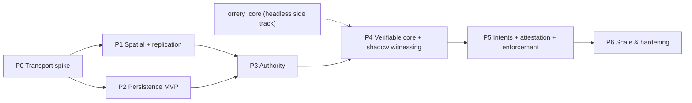

# Roadmap & Risk Register

This document turns the Orrery architecture into a phased build plan: seven phases (P0–P6), each with explicit goals, the crates it touches, deliverables, an upstream-contribution milestone, and — non-negotiably — a **demo criterion**: something runnable and observable that proves the phase, becomes a permanent regression harness, and gates entry to the next phase. It then expands [ADR-0017](adr/0017-risks-and-open-questions.md) into a full register (likelihood, impact, early-warning triggers, mitigations, plan B) and restates the open questions with proposed resolution paths and decision deadlines.

Normative source: [ADR-0017](adr/0017-risks-and-open-questions.md), with [D14](adr/0014-pinned-versions.md)–[D16](adr/0016-parameter-reference.md) governing versions, crate names, and parameters, and the applicable D3–D13 records in the [ADR index](DECISIONS.md) governing phase content.

## Sequencing principles

1. **Riskiest integration first.** The two things nobody has shipped in this ecosystem — an iroh IO layer for aeronet ([verified absent from crates.io as of Aug 2026](https://crates.io/crates/aeronet)) and the persistence tier (every surveyed netcode crate assumes transient in-memory state) — are P0 and P2. Everything else composes existing crates.
2. **Two parallel tracks.** The network track (P0→P1→P3) and the persistence track (P2) meet at P3, where the lease registrar makes the cluster the authority arbiter. `orrery_core` is engine-agnostic and headless (D9) and is built as a side track feeding P4.
3. **Demo-or-it-didn't-happen.** Each demo criterion is scripted, telemetry-instrumented (OpenTelemetry from P0 onward, per D12), and kept green in CI thereafter. Numbers in demo criteria are the D16 defaults — the demo *is* the parameter-table acceptance test.
4. **Trust features ship dark first.** Witnessing runs in shadow mode (telemetry only, no enforcement) for a full phase before any strike is issued, per D17.3.

Indicative calendar (planning estimate, not normative): P0 Q3 2026 · P1 Q4 2026 · P2 Q4 2026–Q1 2027 (overlaps P1; depends only on `orrery_protocol`) · P3 Q1 2027 · P4 Q2 2027 · P5 Q3 2027 · P6 Q4 2027.

---

## P0 — Transport spike

**Goal.** Prove the single biggest bet: iroh 1.0.x as the universal transport (D3), surfaced through `aeronet_io` so the whole upper stack inherits it. No replication, no game — raw sessions, datagrams, streams, and NAT telemetry.

**Crates.** `orrery_aeronet_iroh` (the deliverable), `orrery_protocol` (skeleton: `CellId` newtype, wire versioning), `orrery_net` (minimal: static peer list, channel policy datagrams=state / streams=control), plus ops config for one self-hosted `iroh-relay`.

**Deliverables.**
- `aeronet_io` implementation over iroh connections: unreliable datagrams for state, reliable streams for control/bulk, no head-of-line blocking between them; relay-vs-direct path surfaced as session telemetry (path type, time-to-direct-path, relayed-bytes fraction).
- A NAT test matrix exercised with real networks: full-cone, port-restricted, symmetric/hard NAT, CGNAT, and one deliberately UDP-blocked network (forced-relay case). Hard-NAT↔hard-NAT pairs are expected to relay permanently — [Tailscale's data](https://tailscale.com/blog/how-nat-traversal-works) shows CGNAT↔CGNAT pairs are effectively un-punchable — and D3 treats that tail as a product requirement.
- Punch-rate dashboard with the iroh production baseline (~90% direct connections, ~95% of bytes on direct paths) as the reference line ([iroh FAQ](https://docs.iroh.computer/about/faq), [holepunching docs](https://www.iroh.computer/docs/protocols/net/holepunching)).

**Demo criterion.** 8 peers on real, heterogeneous NATs (≥4 distinct NAT types, ≥2 ISPs, including the forced-relay peer) form a full mesh and exchange per-tick 60 Hz state datagrams for 30 minutes with zero session drops; the dashboard shows direct-path rate consistent with the ~90% baseline, the relayed peer's traffic flowing, and added relay latency quantified per pair. (60 Hz here is a deliberate transport stress at sim-tick rate; the production replication default is 20 Hz, D16.)

**Upstream milestone.** PR `orrery_aeronet_iroh` to aeronet as `aeronet_iroh`, mirroring the unpublished in-repo prototype (D4); file punch-rate findings against iroh where they diverge from the published numbers.

## P1 — Spatial model + replication

**Goal.** The 64-bit `CellId` doing its first duty (replication interest group, D5), on top of the consolidated stack (D4): bevy_replicon 0.42 visibility driven by cell membership, lightyear 0.29 bring-up for baseline prediction.

**Crates.** `orrery_spatial` (CellId Morton encoding, big_space integration, 27-cell AOI, hysteresis, interest-set selection, proxy extrapolation), `orrery_coordinator` (stub: coarse presence, island formation, NodeId handout), `orrery_net` (island membership lifecycle), `orrery_predict` (initial lightyear configuration: own-player prediction, 9-tick rollback window), `orrery_protocol` (final `CellId` encoding: offset-binary, Morton-interleaved, sentinel-bit level marker).

**Deliverables.**
- `CellId` property-test suite: sort order = spatial locality, parent = prefix range, level round-trips.
- big_space 0.12 ported to Bevy 0.19 (tracked risk, D14) and integrated: `GridCell` ↔ interest-level `CellId` (128 m edge).
- Replicon visibility mapped from the 3×3×3 neighborhood; bounded high-rate interest set (24 entities) with 1–4 Hz extrapolated proxies beyond it — the Donnybrook pattern, whose measured ~12·n kb/s receive scaling is why the set is bounded ([Donnybrook, SIGCOMM 2008](https://www.microsoft.com/en-us/research/wp-content/uploads/2016/02/donnybrook.pdf)).
- Handoff hysteresis (10% of cell edge) verified against oscillation on the cell boundary.

**Demo criterion.** 32 synthetic peers (headless bot harness, scripted roaming across ≥64 interest cells) run for one hour: every peer's sustained upload stays ≤ 1 Mbps; interest-set membership churn is absorbed without visible proxy pops; no entity thrashes cells at a boundary; a late-joining peer receives only its 27-cell neighborhood.

**Upstream milestone.** big_space 0.19 port PR upstream; visibility-API ergonomics feedback/patches to bevy_replicon.

## P2 — Persistence MVP

**Goal.** The "really really fast" tier (D11): cell actors, journal, FoundationDB checkpoints, area load — proven against synthetic load before real gameplay needs it. Starts during P1 (depends only on `orrery_protocol`).

**Crates.** `orrery_persistd` (gateway, cell actors, segmented journal on fjall 3.x or raw segments, FDB checkpoint/restore), `orrery_persist_client` (gateway session, diff uplink scheduler at 1–4 Hz per entity, area load/subscribe), `orrery_protocol` (intent, journal-record, checkpoint types).

**Deliverables.**
- Single-writer cell actor runtime with rendezvous-hash placement over shard cells (8×8×8 interest cells per shard).
- Journal with adaptive group commit (fsync immediately when the disk is idle, ~0.5 ms batching under load; commit < 2 ms server-internal); optional chain replication to one async follower (default on, RPO ≤ ~100 ms for bulk on node loss).
- FDB 7.3.x checkpointing on the 20 s jittered cadence, immediate on cell quiesce; keyspace exactly as D11 (`world/{cell_id}/{entity_id}`, `player/…`, `ledger/…`, `lease/…`, `chunk/…`).
- Area load: 27-cell FDB range scans + live actor deltas, streamed nearest-first.
- Offline world-seed import tool on the persistd harness (D11): bulk-writes designed content into `world/`/`chunk/` rows, mints `PersistId`s, and records a content-version row so later deploys can diff/patch designed content. Implemented as the TOML scenario runner specified in [12-world-seeding.md](12-world-seeding.md).
- The intent *execution* path (signature check → `Ruleset` validation stub → FDB serializable optimistic transaction) without witness attestation, so commit latency is measurable now; attestation arrives in P5.
- Latency rig: gateway-colocated load generator producing calibrated diff and intent mixes.

**Demo criterion.** With 10k entities across 100+ cells under synthetic load: `kill -9` the entire cluster, restart it, and the world resumes — zero acked intents lost (RPO 0), bulk loss bounded by the journal/replication window, clients (netsplit posture, D12) having queued intents and continued simulating. Measured against D16 targets in-region: journal commit < 2 ms server-internal, client-observed bulk ack p99 < 5 ms, intent commit p99 < 10 ms, area first page-in < 50 ms.

**Open defects blocking the demo criterion.** Found 2026-08-13 by tracing the seeder's read/write path through the landed code; each was read at the cited location, not inferred. Full detail, consequences and acceptance-gate mapping in [12-world-seeding.md](12-world-seeding.md) §2.

| # | Location | Defect |
|---|---|---|
| **P-1** | `orrery_persistd/src/runtime.rs` — `CellRuntime::open`, `::restore` | Journal replay filters `rec.cell != shard` (**equality**) while writes route via `shard.is_prefix_of(cell)` and clients uplink the entity's *interest* cell (`orrery_persist_client/src/feed.rs:87`). **Every real diff is discarded at recovery — the `kill -9` criterion cannot pass.** Fix: `shard.is_prefix_of(rec.cell)`. |
| **P-8** | `orrery_persistd/src/checkpoint/fdb.rs:126` | `checkpoint` postcards the whole `CheckpointData` — entity bag included — into the single `ckpt/{shard}` value, which D11 §6 fixes as `(node_id, lsn, epoch, time)`. Ceiling is `100 000/(bag+34)` = **344 entities/shard** at a 256 B bag; a 10k-entity world with any hotspot exceeds FDB's 100 KB value limit. |
| **P-2** | `checkpoint/fdb.rs:118` | Writes `world_key(data.shard, entity)` — keyed by the shard, not the entity's cell as D11 §6 specifies. `CheckpointData::by_cell` carries the right value and is unused for keying. |
| **P-3** | `checkpoint/fdb.rs` — `world_range_start`/`_end` | Compute `[w‖bits, w‖bits+1)`, the *exact-cell* span, though the doc comment claims it is the subtree (`CellId::subtree_range()` = `[bits−lsb+1, bits+lsb−1]`). Breaks subtree scans and `delete(shard)`. Masked in `tests/checkpoint_restore.rs:293`, which reads `CellId::ROOT` — also the shard. |
| **P-4** | `orrery_persistd/src/actor.rs:247` | `read_snapshot` opens `let _ = cells;` and returns the whole actor bag, so an area load for one interest cell returns up to 512 cells' entities. The < 50 ms first-page-in target is unmeasurable until it filters by `by_cell`. |
| **P-5** | `orrery_persistd/src/cluster.rs:236` | `Cluster::has_actor` returns `true` for every cell (`RendezvousHasher::owner` always answers), so the cold-store fallback never fires under a multi-node `Cluster`. |
| **P-6** | `checkpoint/fdb.rs` | `checkpoint` only ever `set`s rows for live entities; nothing clears removed ones, and the D11 §6 despawn tombstone is unimplemented. | **Fixed 2026-08-13:** `world/` values are now tag-prefixed — `0x00 ‖ bag` for live rows, `0x01 ‖ postcard(Tombstone{tick, gc_deadline_ms})` for despawn markers. The actor keeps tombstones on `Despawn` (5-minute GC deadline, `TOMBSTONE_RETENTION_MS`), the checkpoint writes markers and clears rows past their deadline (the §6 GC pass), `scan_world` never surfaces a marker, and `load` rebuilds the tombstone set so recovery keeps the countdown. Split partitions tombstones per child; re-spawn cancels a marker. Tests: `fdb.rs` value round-trip, always-on `despawn_tombstone_survives_checkpoint_restore_and_gc`, fdb-gated `fdb_tombstones_write_gc_and_isolate_grids` + `fdb_tombstone_end_to_end_lifecycle`. |
| **P-7** | `checkpoint/fdb.rs` — `world_key` | The 17-byte key carries no `GridId`, though `JournalRecord`, `DiffUplink` and the `grid/` rows all do and D11 §6 calls `cell_id` "grid-relative". Nested-grid content has nowhere to live. | **Fixed 2026-08-13:** the key is now `b'w' ‖ grid(4) ‖ cell(8) ‖ entity(8)` (21 bytes), and `ckpt/` is grid-scoped the same way; `world_range_start`/`_end`, `scan_world`, `load`, `delete` and `read_cold` all take the `GridId`. The grid threads from `RuntimeConfig` → actor → `CheckpointData`, and `GatewayMsg::Subscribe` carries it so area loads scan the right grid. Subtree spans never cross grids (an unbounded subtree ends at the next grid's first key). Tests: `fdb.rs` `grids_are_disjoint_under_identical_cells`/`ckpt_keys_are_grid_scoped` and fdb-gated `fdb_tombstones_write_gc_and_isolate_grids`. |

P-1 and P-8 block the demo criterion on their own. P-2, P-3, P-5 and P-6 block *seeded* worlds specifically; P-4 gates the latency numbers; P-7 gates nested grids. **All eight are fixed as of 2026-08-13** — P-1/P-4 in `actor.rs`/`runtime.rs`, P-2/P-3/P-6/P-7/P-8 in `checkpoint/fdb.rs`, P-5 in `cluster.rs` — each with a regression test; the seeder's acceptance gates (§14) can be built on the current tree.

**Implementation decisions taken during the P2 build (2026-08-13).** Each of
these binds more than one workstream, so it is recorded here rather than being
settled independently inside a single change.

| # | Decision | Why |
|---|---|---|
| **C-1** | **Area loads and intents remain packet-lane in the P2 surface.** Pages are chunked under a conservative datagram budget with sequenced continuation markers and send errors are logged rather than swallowed; intents are made safe by at-least-once delivery plus the `intent/{intent_id}` idempotency row and a client-side in-flight retransmit timeout. | P3 added a reliable iroh control lane for authenticated `Hello` and lease control. Area-load and intent transport still use the P2 packet-lane shape; moving those paths to a general client stream abstraction remains later work. At-least-once plus an idempotency row remains a legitimate route to exactly-once *outcomes*. |
| **C-2** | **Journal replay drops only records superseded at write time.** Recovery scans in LSN order maintaining the running maximum epoch and discards a record iff its epoch is **below** that running maximum — not below the runtime's current epoch. | The naive predicate (`rec.epoch < current_epoch`) is inert only while the binary pins `Epoch::new(0)` and nothing fences. The moment startup fencing lands, it discards every legitimately acked record on every restart — the demo's exact failure mode, in a form that reads as success until someone counts entities. Zombie protection comes from the `actor/{shard}` fence CAS and the checkpoint's epoch read, not from filtering a node's own journal. |
| **C-3** | **`world/` values over 100 KB are a hard error, not a split row.** | → [08-persistence.md](08-persistence.md) §6. The reader identifies a row by exact key length; a suffixed row would be invisible to `load` and `read_cold`. |
| **C-4** | **The manifest's `value_digest` covers the component bag only**, excluding the storage value's live/tombstone tag byte. | → [12-world-seeding.md](12-world-seeding.md) §9.3. One decision with three consumers; if they disagree, gate A4 fails for a reason nobody can localize. |
| **C-5** | **`--profile <name>` selects an in-file `[profile.<name>]` overlay; the five ladder rungs are separate scenario files.** `apply --profile demo` therefore names a scenario file too, and `scenarios/p2demo.toml` ships with a baseline `[profile.demo]` and a 1000×-smaller `[profile.ci]`. | [12-world-seeding.md](12-world-seeding.md) §13.2 calls `apply --profile demo` "the entire P2 demo runbook line" while §5.2 defines `[profile.<name>]` as a file-local overlay. Binding profiles to files rather than to a global rung table keeps the ladder extensible without a registry, at the cost of one extra argument on the runbook line. |
| **C-6** | **`orrery_seed` depends on `orrery_persistd` with default features**, linking fjall and iroh into a batch tool. | → [12-world-seeding.md](12-world-seeding.md) §4. A knowing deviation from that section's own rationale; costs build time, not correctness. Revisit at P3. |
| **C-8** | **`actor/{shard}` fence rows are NOT grid-scoped, and that is now a known gap.** The key is `b'a' ‖ shard(8)` — 9 bytes, no `GridId` — while `world/`, `ckpt/` and `chunk/` all carry one. | Found 2026-08-13 by the seeder's `wipe` guard refusing on 8 fence rows another crate's tests had left in the shared dev cluster. Two consequences. **Correctness:** D11 §6 calls `cell_id` grid-relative, which is exactly why P-7 grid-scoped the other families; leaving `actor/` unscoped means a nested grid's shard fences against the root grid's row for the identical cell id — two different shards sharing one fencing token. **Operationally:** the seeder's §11.4 offline-mode precondition ("refuse when any `actor/{shard}` row in range is live") cannot be scoped to the grid being wiped, so unrelated residue blocks it. **Blocking, not deferred** (revised same day): running `cargo test` over `orrery_persistd` and `orrery_seed` *together* — which CI and the P2 demo runbook both must — leaves 8 fence rows from the persistd split tests that then block every seeder gate's pre-wipe. The suites pass separately and fail combined. **Fixed** (`e6a9a17`): the key is now `b'a' ‖ grid(4) ‖ shard(8)` (13 B), threaded through the `FenceStore` trait, the FDB store, the runtime, the scheduler and the seeder's wipe guard — which also had to stop deriving its grid set from every *declared* grid and use the grids its emits actually realize into, since guarding (and clearing) a grid the scenario never wrote is wrong twice over. The whole workspace now passes in one command: 301 tests across all four packages with both fdb features, twice consecutively, 0 skipped. |
| **C-7** | **Gate A8 is restated** as a skew-reproduction and watermark-size regression guard. | → [12-world-seeding.md](12-world-seeding.md) §14. The gate as written self-destructed when P-8 was fixed. |

**Upstream milestone.** Issues/patches to `foundationdb-rs` 0.11 and fjall as encountered; publish the FDB layer-schema notes.

## P3 — Authority

**Goal.** The two-tier claim model with cluster-arbitered leases (D7): the tracks merge — the persistence cluster becomes the authority arbiter for live simulation.

**Status (2026-08-16).** The strict persistence-authority slice is complete:
signed transport-bound admission, coordinator-interest-gated weak claims,
actor-owned durable lease rows, strict fenced uplinks, NodeId-scoped session and
claim-rate controls, client revocation on lease-bearing NACKs, hot-only
heartbeats, and server-owned recoverable committed rekeys.

The handoff slice on top of it adds **crash redistribution** (both the
disconnect fast path and the TTL slow path select a successor and grant through
the ordinary serialized claim path, parking only when no peer is eligible),
**holder-initiated negotiated divestiture** with an enforced
uplink-completeness gate, a registrar→peer push lane so a successor learns it
inherited a lease and a silent holder learns its lease ended, and the always-on
**single-writer invariant checker**. Strong-held rows still re-park rather than
being regranted, per D7.

Coordinator interest now reaches the gateway as a signed grant peers carry
themselves, which is what makes successor selection operable outside tests;
both directions of cooperative handoff are implemented, including the
registrar's divest request with D7's per-tier deadline rules; and
`PLAYER_BOUND` is enforced rather than merely declared. **The demo criterion
runs and holds** — see below.

Remaining P3 follow-on: the Bevy coordinator client in `orrery_net` (island
membership there is still derived from the connected-peer stand-in rather than
from manifests), coordinator-driven island drain, `Expire` fan-out to cell
subscribers, contact-island propagation, redistribution across sibling
gateways, ephemeral in-island claims, and field-host promotion.

**Crates.** `orrery_coordinator` ships the `orrery-coordinator` service:
authenticated presence in, island manifests and signed interest grants out,
Bevy-free over iroh (docs/10-crates.md §6). `orrery_authority` implements
optimistic weak/strong claims,
`auth_seq`/`own_seq`, correlation-safe lease control, inherited grants
(`ClaimId::REGISTRAR` → `AuthorityEvent::Inherited`), holder-initiated
`LeaseClient::divest`, and loss-of-authority reconciliation; contact-island
propagation remains follow-on. `orrery_persistd` implements the actor-owned
lease registrar, strict gateway fencing, committed rekey, the `SuccessorPolicy`
seam with its coordinator-interest-ranked default, and `AuthorityMetrics`.
`orrery_predict` and `orrery_coordinator` retain their P1/P4 scaffolding;
coordinator-driven movement orchestration is not part of the delivered slice.

**Deliverables.**
- Lease rows `(entity_id → holder NodeId, auth_seq, own_seq, expiry)`; TTL 10 s, heartbeat 2.5 s; optimistic claim (simulate immediately, roll back on CAS loss).
- Cooperative handoff (negotiated divestiture with holder ack) and crash handoff (lease expiry → orphan → reassign to nearest interacting peer, else park in cluster). **Implemented:** crash handoff on both the disconnect and TTL paths, and the holder-initiated half of cooperative handoff with an enforced `Divest.cursor` gate. **Follow-on:** the registrar→holder `Divest` request, which is what lets a claimant's `Claim{Strong}` trigger the handoff.
- Cross-cell movement keeping the holder under hysteresis; storage row re-keyed on commit. **Implemented:** server-owned committed rekey preserves the lease fence and atomically relocates the durable lease index; client movement control is rejected.
- Ephemeral entities (projectiles, VFX) on in-island claims only, never touching the registrar. **Follow-on.**
- Single-writer invariant checker: telemetry that flags any tick where two peers both believed they held authority. **Implemented:** `GatewayServer::authority_metrics()` counts fenced-out writes whose live row named a different unexpired holder, retains the last sample, and logs each at `warn`.

**Demo criterion — met (2026-08-16).** An 8-peer island with contested physics
objects: `kill -9` one peer holding ~50 entities → every entity is reassigned
or parked within the 10 s lease TTL, with no duplicate-authority tick recorded
and no lost entity; separately, a scripted cooperative handoff chain (player A
grabs, throws to B's contact island) completes with zero registrar-visible
conflicts and no visible pop.

`scripts/p3-island-gate.sh` is the permanent harness, driving the `p3-island`
tool against a live `orrery-coordinator` and `persistd`. Peers are real OS
processes, so the `kill -9` is a real SIGKILL rather than a dropped task, and
each peer obtains its interest grant from the coordinator rather than having
one minted for it — a fixture that signs its own authorization would prove
nothing about the path production uses. Observed on an 8-peer island of 400
entities: **50/50 of the victim's entities reassigned to survivors in ~10.9 s,
0 lost, 0 duplicate-authority observations**, reproduced across runs. The gate
writes no success artifact unless every clause holds.

One finding worth recording, because it changes what "within the TTL" means in
practice: **a `kill -9` is resolved by the slow path, not the fast one**. QUIC
cannot distinguish a dead process from a dead path until its own idle timeout,
so the gateway never sees a connection drop for a SIGKILLed peer; the lease
TTL lapsing is what redistributes its entities (§4.3's `else silent` branch).
The fast path is real, and covered by the disconnect test, but it is what a
*graceful* exit or a torn connection takes. The harness therefore budgets the
TTL plus the registrar's once-a-second sweep granularity and the up-to-one
heartbeat interval of TTL already spent before the kill.

The cooperative-handoff half is proven at the wire level in
`orrery_persistd/tests/gateway.rs` rather than in the island harness: both
directions of §4.2, the deadline rules for each tier, and the refusal paths.

This remains the anti-host-migration proof: authority moves per entity, so no session-wide stall — the
failure mode that [drove For Honor off P2P](https://www.ubisoft.com/en-us/game/for-honor/news-updates/2HayRoZjbJzSEJAhJMpeF7/for-honor-now-on-dedicated-servers-on-all-platforms)
cannot occur by construction.

**Upstream milestone.** Authority-model hardening PRs to lightyear (its authority handling is self-described as ["somewhat in flux"](https://github.com/cBournhonesque/lightyear/releases), and the `distributed_authority` example is outdated) — contribution, not fork, per D4.

## P4 — Verifiable core + witnessing in shadow mode

**Goal.** Scoped determinism (D9) and passive witnessing (D10) with **no enforcement**: logs, replay, adjudication, and discrepancy telemetry only. This phase exists to calibrate tolerance bands against reality before anyone can be striked.

**Crates.** `orrery_core` (`Ruleset` trait, fixed-tick executor, `rand_chacha` seeded per `(universe_seed, entity, tick)`, quantization, tolerance comparators, signed hash-chained input logs, headless replay harness) — **landed**, see [06-verifiable-core.md](06-verifiable-core.md); `orrery_witness` (invariant validators, discrepancy detection, evidence assembly) — **landed**, shadow-mode by default; `orrery_persistd` (adjudication executor linking the same `Ruleset`) — **landed** as version-keyed routing over the 3 retained builds; reference game (kinematic movement + integer combat core).

The core is built as a side track (sequencing principle 2), so it proceeds
independently of the P1/P3 tracks and did. What it does *not* yet have is a
consumer: `orrery_witness` does not exist, nothing streams log frames, and no
adjudication executor calls `verify_bundle`. The kernel is provably
deterministic and self-verifying in isolation; the phase turns on wiring it to
the witness pipeline and then calibrating ε against real play.

**Deliverables.**
- PeerReview-style tamper-evident logs streamed to the cell-epoch witness set (piggybacked on the 20 Hz replication datagrams, gap repair over the reliable control stream); any holder of a segment + t₀ claim can re-execute a window ≤ 3 s (180 ticks) and produce self-verifying evidence.
- Continuous cheap checks: speed/acceleration caps, teleport detection, rate limits, impossible values, plus the reconciliation-error monitor.
- Discrepancy pipeline end-to-end: escalation → log-segment request → observer replay → evidence bundle → cluster re-execution → verdict — terminating in telemetry, not enforcement.
- Rules-version skew handled from the start: the adjudication executor retains the last 3 ruleset builds as version-keyed sidecar workers and routes evidence bundles by `RulesetId`; bundles older than retention resolve as unadjudicable — never a strike (D11, D12).
- Cross-platform determinism CI: identical core replays on Windows/Linux/macOS binaries every commit (ε_pos 1 cm, ε_vel 1 cm/s, 250 ms sustained-error window for continuous state; bit-exact for discrete outcomes).

**Demo criterion.** A modified client applying a 1.5× speed multiplier joins an 8-peer island: detected, escalated, replay-adjudicated with a deviation verdict within one adjudication window of the violation. Simultaneously, ≥ 500 honest player-hours (bot + human mix) across all three platforms under injected impairment (3–5% packet loss, 100 ms jitter spikes) produce **zero** false-positive discrepancy reports. False-positive rate is the phase's primary tunable; the phase does not exit until it holds.

**Upstream milestone.** Publish the determinism conformance suite (quantization + `libm` math corpus) as a standalone repo; upstream any platform-drift fixes it surfaces.

## P5 — Intents + attestation + enforcement

**Goal.** Close the durable-truth loop (D10.4, D11): witness-attested intents, strike pipeline live, cluster as sole writer of value. The Diablo II closed-realm lesson, mechanized: [server-side storage + validation is the effective anti-duping control](https://gist.github.com/amtal/bf941bde443eefc7d4626fd439d7f480), and [GTA Online's post-hoc correction](https://www.sportskeeda.com/gta/gta-online-money-generators-illegal-will-get-account-wiped-reset) is the cautionary tale for validating too late.

**Crates.** `orrery_witness` (attestation co-signing), `orrery_coordinator` (witness-set seeding per cell-epoch — never self-chosen), `orrery_persistd` (attestation verification, quarantine-mode full validation, provisional commits, annulment), `orrery_identity` (accounts, NodeId binding, strike ledger with 14-day half-life, quarantine → cooldown → ban thresholds), `orrery_field_host` (witness-fallback mode only), `orrery_persist_client` (intent outcome prediction, offline queue).

**Deliverables.**
- K-of-N co-signatures (default K=3 of N≥5) on `Ruleset`-classified critical operations; low-population fallbacks: field-host witness or provisional commit finalized by cluster-side spot replay.
- Two-party trade flow as the reference intent (read-check-write across both parties' `ledger` rows in one FDB serializable transaction).
- Enforcement switches: write refusal/annulment, in-session authority correction broadcast, strikes — each independently feature-flagged, ramped from shadow to live per D17.3.
- At-rest schema versioning (D11): per-component schema versions in the component bag; `Ruleset`-registered migrations applied lazily on checkpoint-load/area-read plus an optional background sweep; journal/archive records carry their encoding version; migrations span ≥ 2 adjacent versions.

**Demo criterion.** The dupe gauntlet, all provably refused with machine-checkable audit trails: (a) replayed intent (idempotency key rejected); (b) double-spend race — the same item offered in two trades through two gateway nodes simultaneously (one FDB transaction conflicts and the retry fails validation); (c) forged/self-chosen attestation (signature/witness-set check fails); (d) trade during quarantine (full cluster-side validation path exercised). Honest trades sustain intent commit p99 < 10 ms with attestation overhead included.

**Upstream milestone.** Publish `orrery_protocol` intent/attestation wire spec with test vectors, inviting third-party audit.

## P6 — Scale & hardening

**Goal.** The population-adaptive topology completed (D6), the full R7 persistence surface, and production ops posture.

**Crates.** `orrery_field_host` (promoted-cell authority, parked-cell catch-up execution), `orrery_coordinator` (promotion at > 32 sustained with hysteresis, elastic scheduling), `orrery_persistd` (hotspot cell splitting, terrain chunk compaction, journal→archive tailer, griefing rollback), `orrery_net` (multi-region relay/gateway routing), ops (≥3 relay regions, fdb-kubernetes-operator or systemd deployment, dashboards, runbooks).

**Deliverables.**
- Field-host promotion/demotion: coordinator spins up a headless Bevy instance that assumes cell-entity authority; peers keep authority over their own players; clients experience it as just another authority peer (the Destiny 2 lesson — [move the host into the datacenter, never onto a player](https://edgegap.com/blog/multiplayer-game-hosting-deep-dive-exploring-how-destiny-2-uses-both-peer-to-peer-authoritative-servers)).
- Terrain pipeline: cell-aligned chunk deltas in the journal, compacted to ≤ 100 KB snapshot shards.
- Event archive (Parquet on object storage) with retention config; griefing rollback via inverse-op replay by cell/actor/time-range.
- Chaos suite: netsplit (cluster unreachable → intents queue, sim continues), relay-region loss, FDB node loss, coordinator restart.

**Demo criterion.** A scripted 128-player crowd event (R6 upper bound) in one region: the hot cell is promoted within the hysteresis window, per-peer bandwidth stays within the ≤ 1 Mbps uplink budget and field-host egress within the ≤ 35 Mbps hot-cell budget (D6; the modeled n=128 load is ~25.6+ Mbps, inside budget) throughout, and demotion follows dispersal cleanly. Then the rollback demo: a griefer bulldozes a player town; an operator restores it to a timestamp via archive inverse-op replay, with the ledger untouched. Multi-region: EU-based peers joining a US island get relay/gateway routing that keeps added latency within the measured relay penalty from P0.

**Upstream milestone.** Open-source the load/chaos harness and `iroh-relay` fleet deployment tooling.

---

## Risk register

Expands D17. Likelihood/impact: L/M/H. "Trigger" = the early-warning signal that activates the mitigation review.

| # | Risk | Likelihood | Impact | Trigger / early warning | Mitigation | Plan B |
|---|---|---|---|---|---|---|
| R-1 | **lightyear API churn** — 4 breaking releases in 10 months; migrations land mid-phase | H | M | New lightyear minor with breaking notes; CI on a canary branch tracking latest goes red | Pin per Orrery release (D14); confine lightyear types to `orrery_predict` so churn is one crate's problem; budget migration time each phase | Freeze on last-good version for a full release cycle; accelerate R-2's plan B if frozen > 6 months |
| R-2 | **Single-maintainer bus factor** (lightyear, aeronet; authority "in flux") | M | H | Maintainer inactivity > 60 days; stalled review on our P3 upstream PRs | Upstream authority hardening early (P3 milestone) so our needs live in-tree; maintain contributor relationship, not a fork | Documented D17 fallback: bevy_replicon-direct + own prediction layer (replicon visibility/diffs already the substrate; bevy_ggrs/bevy_rewind studied as rollback-schedule references) |
| R-3 | **big_space port lag** — 0.12 targets Bevy 0.18; we need 0.19, and every future Bevy bump repeats this | H (known work) | L–M | Port estimate exceeds 2 weeks; upstream unresponsive to the P1 PR | Budgeted P1 deliverable; integration isolated inside `orrery_spatial` | Maintain a patch fork of the `GridCell` subset we use (small, stable surface) |
| R-4 | **noq drift from quinn** — iroh's QUIC stack diverging from mainline fixes | M | M | quinn CVE/congestion-control fix absent from noq after one iroh release cycle | Track both changelogs; P0's raw-quinn `aeronet_io` backend (D3 hedge) stays green in CI as a permanent alternative path | Swap LAN/dedicated/test traffic to the quinn backend; escalate with n0 (commercially backed); noq is usable standalone if iroh's identity layer chafes |
| R-5 | **Relay economics** — the 5–10% permanently-relayed tail (CGNAT↔CGNAT effectively always relays) under-provisioned or costlier than modeled | H (tail is certain) | M | P0/P1 telemetry: relayed-bytes fraction > 10%, or per-relayed-peer bandwidth cost exceeding model; regional relay saturation | Treat the tail as a product requirement (D3): capacity-plan from P0 punch-rate telemetry; ≥3 self-hosted regions; relays are stateless and cheap to scale horizontally | Rate-tier relayed traffic (proxy rates for relayed peers), add regions, or steer relayed peers preferentially toward field-hosted cells where uplink burden is server-side |
| R-6 | **Witness false positives** — tolerance bands vs. packet loss/platform drift strike honest players | H (untuned) | H | Any false positive in P4 shadow telemetry; discrepancy-report rate correlating with peer RTT/loss rather than accounts | Shadow mode for all of P4 with an explicit zero-FP exit gate; ε/window as configurable parameters; "multiple rollbacks" thresholds; strike decay (14-day half-life) bounds worst-case harm | Keep enforcement at quarantine (cluster-side full validation) indefinitely — never auto-ban on replay evidence alone until FP rate is provably zero over months |
| R-7 | **FDB ops learning curve**; hotspot writes under crowd events (the [FDB #11510](https://github.com/apple/foundationdb/issues/11510) pattern) | M | H | Commit p99 drifting toward the 10 ms budget at < 75% cluster load; range-write hotspots on crowd cells in P2 load runs | fdb-kubernetes-operator or systemd for a 3–5 node cluster; P2 latency rig doubles as a capacity model; hotspot pre-splitting + load shedding designed in P6; Morton-prefix keyspace spreads adjacent cells | ScyllaDB is the named runner-up (D11) if sustained writes outgrow a modest FDB cluster — but its LWTs never take over trade safety; intents stay on a serializable store |
| R-8 | **Field-host cost model** — promotion threshold vs. spend; worst case (every cell hot) is client-server economics | M | M | Coordinator telemetry: promoted-cell-hours trending up; cost per promoted cell-hour exceeding live-ops budget | Threshold (>32 sustained) and hysteresis are live-ops dials; elastic scheduling; demotion aggressiveness tunable | Accept the convergence by design (D17.5): a fully-hot world running field hosts everywhere is a functioning client-server game, not a failure |
| R-9 | **Schedule: persistence tier is greenfield** — no prior art in the ecosystem to lean on; P2 is the critical path | M | H | P2 slipping > 4 weeks; latency targets missed on first rig runs | P2 starts during P1 (only needs `orrery_protocol`); custom layer kept thin and single-purpose (D11); demo rig built before features | Ship P3 against FDB-only persistence (no cell actors/journal; bulk writes straight to FDB at relaxed ack targets) and retrofit the hot tier — targets degrade, architecture doesn't change |
| R-10 | **Schedule: Bevy 0.20 lands mid-roadmap**, dragging the whole pinned stack | H | M | Bevy release announcement; ecosystem crates starting migration | Pin everything per D14; re-pin only at phase boundaries; canary branch measures migration cost before committing | Skip a Bevy release entirely — nothing in Orrery requires engine-latest |
| R-11 | **Schedule: demo criteria need real-NAT diversity** — lab results won't reproduce home-network pathologies | M | M | P0 matrix missing NAT types; punch rate in lab ≫ punch rate in the wild | Recruit a standing remote test cohort on real ISPs (incl. CGNAT mobile links) from P0; keep the forced-relay peer in every CI-adjacent soak | Rent consumer-ISP endpoints / mobile-tether rigs; treat [Tailscale's published NAT taxonomy](https://tailscale.com/blog/how-nat-traversal-works) as the coverage checklist |

## Open questions (D17.6) — resolution paths and deadlines

| Question | Proposed resolution path | Decision by |
|---|---|---|
| **Cross-island consistency for fast travelers** — island merge latency when a player outruns coordinator merge/drain | Instrument island merge/drain latency from the P1 coordinator stub; prototype *corridor pre-merge* in P3: coordinator predicts trajectory from coarse presence and pre-warms destination-island connections (dial-ahead) before arrival, so the traveler joins an already-connected set; fall back to a brief interpolation-only window (no interaction) on arrival if pre-merge missed | P3 exit |
| **Parked-cell catch-up semantics** — lazy (on next load) vs. scheduled background simulation | Ship lazy catch-up as the P2/P3 default (matches D7's "optional lazy catch-up on next load"); measure catch-up wall-time distribution vs. parked duration from archive data; if p99 catch-up threatens the < 50 ms first-page-in budget, add scheduled catch-up on `orrery_field_host` (it already links the `Ruleset`, D15) for cells parked > threshold | P6 entry |
| **Economy-wide invariant auditing cadence** — how often to sweep for conservation violations the per-intent checks can't see | Build the auditor as a journal-archive consumer (the event source already exists, D11); start with a daily full conservation sweep + hourly incremental over hot ledgers; calibrate cadence from measured archive scan cost and time-to-detection targets. Must be live before enforcement is fully on — post-hoc-only correction is the documented GTA Online failure | P5 exit |
| **`Ruleset` distribution to cluster** — games recompile `persistd`: acceptable? | Keep link-time composition as the answer for 1.0 (`orrery_persistd` is a library harness by design, D12); the alternative (WASM-sandboxed `Ruleset`) costs determinism guarantees and adjudication performance for a modding scenario no launch title needs. Revisit only on concrete demand; the harness API is frozen at P2 exit, which is the cheap moment to decide | P2 exit |

## Cross-references

[00-overview.md](00-overview.md) for the system tour · [02-networking.md](02-networking.md) (P0/P1 transport and topology detail) · [01-spatial-model.md](01-spatial-model.md) (P1) · [08-persistence.md](08-persistence.md) (P2/P5) · [04-authority.md](04-authority.md) (P3) · [06-verifiable-core.md](06-verifiable-core.md), [07-witnessing.md](07-witnessing.md) (P4/P5) · [09-services-and-ops.md](09-services-and-ops.md) (P6 ops posture) · [10-crates.md](10-crates.md) (crate boundaries assumed by every phase).
