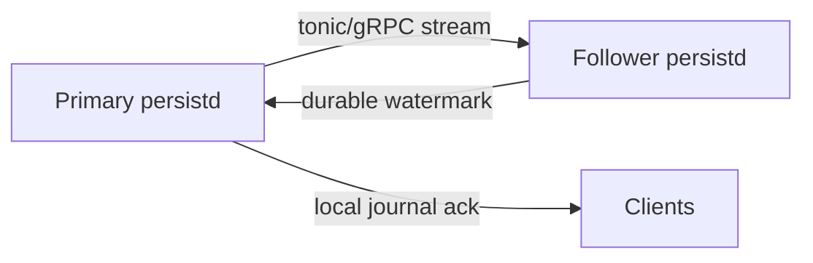

# 13 - Chain Replication: Cross-Process Journal Mirroring

This document describes the P2 exit design for journal-chain replication in `orrery_persistd`: one primary process appends and a single follower process mirrors the journal so the bulk write path keeps its low-latency ack contract while improving node-loss recovery. It is an implementation-facing design note, not a normative source. If it conflicts with [ADR-0011](adr/0011-persistence.md) or [ADR-0012](adr/0012-backend-services.md), the applicable ADR wins.

Normative context:

- [08-persistence.md](08-persistence.md) for the journal, actor, checkpoint, and durability model.
- [09-services-and-ops.md](09-services-and-ops.md) for the persistence service's operational envelope.
- [10-crates.md](10-crates.md) for the `orrery_persistd` crate boundary and gRPC/tonic posture.
- [11-roadmap.md](11-roadmap.md) for the P2 demo gate and the phase sequence that this design must satisfy.

## 1. Scope

**In scope**

- A two-process replication topology: one primary `persistd` instance owns the journal for a shard set and one follower instance receives its committed records.
- A tonic/gRPC protocol for streaming committed journal records, acknowledging durable follower progress, and resuming after reconnect.
- Durable dedupe and restart reconstruction on the follower.
- Recovery and reconnect behavior when either side restarts or the network drops.
- Operational visibility, alarms, and rollout gates.

**Out of scope**

- Multi-follower quorum replication.
- Dynamic leader election or consensus.
- Per-record synchronous confirmation in the primary ack path.
- Cross-region write coordination.
- Replacing the persistence architecture described in [08-persistence.md](08-persistence.md).

The intent is narrow: make the existing async follower path a production-shaped recovery layer, not a second durability system.

## 2. Topology and ownership

The exit criterion uses a static two-process topology:



Rules:

- Exactly one primary owns a shard set at a time.
- Exactly one follower is designated for that primary at a time.
- The follower does not accept writes for the shard set it mirrors.
- The primary never waits on the follower to issue its client ack; the follower is downstream of the ack contract.
- Shard ownership must be fenced before a different process is allowed to serve the same shard set.

This matches the journal-first posture in [08-persistence.md](08-persistence.md) §4 and the two-process service shape in [09-services-and-ops.md](09-services-and-ops.md).

### Ownership constraints

- The primary is the sole source of ordering for a journal stream.
- The follower only appends records that the primary has already committed.
- A follower watermark is advisory for recovery and alarming, not a commit dependency.
- A given shard set is never replicated by more than one active follower in this design.

That keeps the failure model simple: one writer, one mirror, one recovery source.

## 3. gRPC protocol

Use tonic/gRPC for node-to-node transport, with one long-lived bidirectional stream per `(primary_id, follower_id, shard_set, epoch)` tuple. The durable chain identity is distinct from an ephemeral connection session, so reconnects preserve dedupe state without silently crossing ownership streams.

### 3.1 Stream identity

Suggested envelope:

```rust
pub struct DurableChainId {
    pub primary_node: NodeId,
    pub follower_node: NodeId,
    pub shard_set: ShardSetId,
    pub epoch: u64,
}

pub struct ChainSession {
    pub chain: DurableChainId,
    pub session_nonce: u128,
}
```

`DurableChainId` must change when:

- the ownership epoch changes,
- the shard set is reassigned,
- the follower is replaced,

`session_nonce` changes on every reconnect, but never participates in durable
dedupe or watermark lookup.

This prevents a stale primary from resuming onto a new follower session without an intentional restart handshake.

### 3.2 Append batch

Records move in batches so the transport amortizes framing and syscalls:

```rust
pub struct AppendBatch {
    pub session: ChainSession,
    pub batch_seq: u64,
    pub first_lsn: Lsn,
    pub records: Vec<JournalRecord>,
}
```

Rules:

- `records` are in primary LSN order.
- `batch_seq` is monotonic per stream and lets the follower reject reordered or replayed batches cheaply.
- The follower appends the records verbatim to its own journal.
- Batching is a transport optimization only; record ordering remains the journal's ordering.

### 3.3 Durable ACK and watermark

The follower replies after the batch is durably appended:

```rust
pub struct DurableAck {
    pub session: ChainSession,
    pub batch_seq: u64,
    pub durable_through: Lsn,
    pub follower_watermark: Lsn,
}
```

Meaning:

- `durable_through` is the highest primary LSN in the batch that is now safe on the follower.
- `follower_watermark` is the highest origin LSN the follower has durably persisted overall.
- The primary uses the watermark to advance lag gauges and to decide the replay start point after reconnect.

The primary must treat the watermark as monotonic per stream. If an ACK arrives with a lower watermark than the last seen one, the stream is stale and must be restarted.

## 4. Follower dedupe and restart reconstruction

The follower must survive duplicates and restarts without inventing a new write history.

### 4.1 Durable dedupe

The follower dedupes by durable stream identity plus primary LSN:

- `(durable_chain_id, record.lsn)` is the stable identity of a mirrored record.
- A record already persisted in the follower journal must be rejected as a harmless duplicate.
- Duplicate batches are expected during reconnects and retries; they are not exceptional.

Implementation consequence:

- The follower keeps a compact durable index or journal scan cursor for the highest contiguous primary LSN it has persisted for each active stream.
- The dedupe state must survive follower restarts, either by being reconstructed from the follower journal or by being stored alongside it.

### 4.2 Restart reconstruction

On follower restart:

1. Open the local journal.
2. Rebuild the highest contiguous watermark per durable chain from durable records.
3. Rebuild the dedupe cursor from the same durable source.
4. Resume accepting `AppendBatch` messages only after the durable chain identity is revalidated.

On primary restart:

1. Load the last locally committed LSN.
2. Query the follower's watermark for the previous stream.
3. Reject a watermark ahead of that committed LSN. It cannot be a resume point — the follower holds history this primary never wrote — and accepting it silently empties every batch and parks the replicator at a reported lag of zero. This is a named fault, not a retryable transport error.
4. Scan its local journal from `follower_watermark + 1` and resend that tail.
5. Replay any unconfirmed tail records as idempotent resends.

This is why the protocol needs a watermark rather than a simple last-seen batch id: the recovery point is an LSN, not a transport message counter.

A restart of the same owner is only "the previous stream" while the epoch is unchanged, and in the landed implementation it usually is not: shard activation bumps the ownership epoch on every activation, a clean restart included. §3.1 makes that a different `DurableChainId`, and §4.1 keys the follower's durable dedupe by it — so a follower reopened at the bumped epoch would rebuild an empty cursor and take a full re-stream into a second physical copy of every mirrored record, at a healthy zero-byte lag, leaving promotion permanently ambiguous.

Dropping the epoch from the dedupe key is **not** the fix: §3.1's identity rule is exactly what stops a superseded primary resuming onto a live follower session. Instead the follower detects the fork. When its journal already holds mirrored rows under a sibling identity differing only in epoch, it refuses to open the new one and names the missing restart handshake. That handshake is not designed yet, and a passive follower cannot invent it: it runs without a fence store (§2's follower accepts no writes and performs no activation), so it has no way to verify an epoch claim. Refusing loudly is the correct behaviour until the handshake exists; resolving a fork today is an operator action.

## 5. Failure and reconnect behavior

The design assumes failures happen while one side is still live.

### Primary-side failure

- If the primary process dies, the follower keeps its durable journal.
- The follower becomes the recovery source for the next primary instance.
- Recovery starts from the follower watermark, not from the last volatile in-memory batch.
- Client-facing bulk acks are still governed by the journal contract in [08-persistence.md](08-persistence.md); the chain follower only narrows the loss window after node loss.

### Follower-side failure

- If the follower dies, the primary logs the chain as degraded and keeps the local journal path alive.
- Client acks do not wait on the follower.
- The primary continues until the local durability window or ops policy says otherwise, but the RPO has widened back toward the journal-only window described in [08-persistence.md](08-persistence.md) §4.1.
- On follower restart, the primary reconnects and resumes from the follower's reconstructed watermark.

### Network partition

- Transient disconnects are treated as stream loss, not as logical data loss.
- The primary retries the same durable chain identity with a fresh session nonce until it is explicitly superseded.
- The follower rejects stale batches by durable chain identity, session nonce, and batch sequence.
- If the stream cannot be re-established within the alarm window, page ops and mark the shard set as running without chain protection.

### Reconnect rules

- Reconnect is always explicit, with a fresh `session_nonce` but the same durable chain identity.
- The primary must perform a watermark probe before sending new records.
- The follower must not accept writes for an old stream identity after a new identity is established.

That gives at-least-once transport with exactly-once durable outcomes.

## 6. Observability

Use the existing OpenTelemetry posture from [09-services-and-ops.md](09-services-and-ops.md) and expose chain-specific signals:

- Primary commit latency.
- Follower append latency.
- Primary-to-follower lag in bytes and age.
- Reconnect count per stream.
- Duplicate batch count.
- Watermark probe latency.
- Stream restarts per shard set.
- Journal/fsync errors on either side.

Recommended alerts:

- follower lag above the D11 target for more than a short grace window,
- duplicate batch rate rising above reconnect noise,
- watermark regression,
- or stream churn that suggests the topology is flapping.

Every batch and ACK should carry `stream_id`, `batch_seq`, `first_lsn`, `durable_through`, and `follower_watermark` in logs so replay investigations can correlate the two journals.

The series names for these signals are declared once, in `orrery_protocol::metrics` (`CHAIN_SERIES`), for the same reason the D16 latency names are: a producer and a consumer in different processes must spell them identically. Nothing emits them yet — `ChainReplicator::snapshot` is the reading a reporter would publish, and wiring it into `persistd`'s delta reporter is the next step.

One caveat about the lag alarm, because it is the only alarm here: it advances only on a *successful* probe or push. A chain that cannot make progress at all therefore holds its last value rather than growing, which is why a wedged chain reports itself as a fault instead of relying on lag alone.

## 7. Rollout and acceptance gates

Rollout should stay scriptable and reversible.

### Stage 0 - single-process simulation

- Primary and follower are separate logical components in one process.
- Use the in-process transport already present in the harness as the control case.
- Verify batch ordering, dedupe, and watermark advancement.

**Gate**

- A mirrored batch survives process-local replay and the follower watermark advances monotonically.

### Stage 1 - two processes, same host

- Run one primary process and one follower process on the same machine.
- Use tonic/gRPC for the transport.
- Kill and restart the follower while the primary keeps appending.

**Gate**

- The follower reconstructs its watermark from its own journal and resumes without duplicate durable records.

### Stage 2 - two processes, separate hosts

- Split primary and follower across distinct machines or VMs.
- Inject packet loss, latency, and reconnects.
- Verify that the primary resumes from the follower watermark after reconnect.

**Gate**

- A primary crash after follower durability does not lose acked records.
- A follower crash does not block client acks.
- Reconnects are idempotent and do not create duplicate journal history.

### Exit gate for P2

Tie this design to the P2 demo criterion in [11-roadmap.md](11-roadmap.md):

- `kill -9` the primary,
- restart from the follower's journal tail,
- observe that bulk state resumes from the mirrored journal without violating the ack contract,
- and confirm the chain lag alert stays within the documented envelope during steady-state load.

If that gate is green, the chain is good enough for the next persistence phase. If it is not, keep the design narrow and fix the recovery path before widening the topology.
